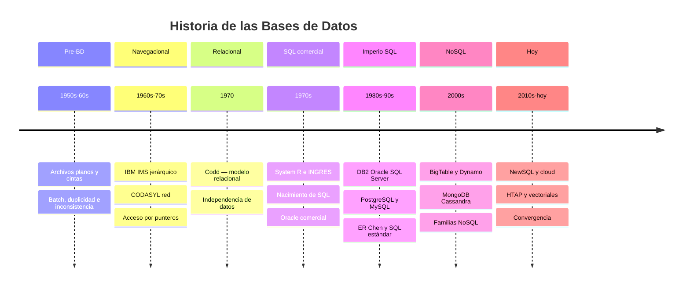

## Objetivos medibles

Al finalizar la lección el estudiante podrá:

1. **Ordenar cronológicamente** las siete etapas del relato (archivos planos → jerárquico/red → Codd → SQL comercial → imperio relacional → NoSQL → hoy) y nombrar el problema que cada etapa resolvió.
2. **Explicar causa→efecto** en al menos tres hitos (p. ej. por qué nacieron las BD; por qué el modelo relacional desplazó la navegación por punteros; por qué surgió NoSQL).
3. **Contar con palabras propias** el aporte de Codd (1970): datos en relaciones/tablas e **independencia de datos** (preguntar *qué* se quiere, no *cómo navegar*).
4. **Ubicar** el nacimiento de SQL en System R / INGRES / Oracle comercial, sin confundirlo con “Codd inventó SQL”.
5. **Reconocer** en un escenario cotidiano (p. ej. Excel compartido) el mismo patrón de duplicidad/inconsistencia de la era pre-BD — como comprensión del relato, no como ficha de anti-patrones.

> **Modo narrativa:** el contenido se organiza por **etapas del relato**. Prohibido convertir cada etapa en plantilla H3 *Qué es / Para qué / Cómo funciona / Malas prácticas / Señales*. Lenguaje simple, tono de enseñanza a una persona. Timeline + ejemplos bastan.

## Conceptos clave

### Etapa 1 — Archivos planos / pre-BD (años 50 – inicio 60)

Antes de los gestores de bases de datos, las organizaciones guardaban información en **archivos planos** (cintas, discos tempranos). Cada aplicación abría y escribía **sus** archivos. El procesamiento era casi siempre **por lotes (batch)**: se leía la cinta de punta a punta, se actualizaba un maestro y se generaba un reporte.

**Problema que esta etapa deja ver:** el mismo cliente o producto vivía en varias copias; al actualizar una, las otras quedaban viejas (**duplicidad e inconsistencia**). Además, si cambiaba el formato del archivo, había que **reescribir los programas** (dependencia fuerte del layout físico).

**Puente al presente (un párrafo, no un bloque de malas prácticas):** cuando una ferretería o academia hoy usa varias hojas Excel/Sheets como “sistema” compartido, reproduce el mismo patrón pre-BD: ediciones concurrentes, teléfonos viejos, stock que no cuadra. Eso explica *por qué nacieron* las bases de datos — no es una ficha de anti-patrones por etapa.

### Etapa 2 — Jerárquico (IMS) y red / CODASYL (años 60 – principios 70)

Nace la **era navegacional**: los datos se organizan como **árboles** (jerárquico, p. ej. IBM IMS) o **grafos** (red CODASYL / IDS / IDMS). El programa **sigue punteros** de registro en registro (`GET NEXT`, `FIND OWNER`…), no escribe una consulta declarativa.

**Qué resolvió:** acceso eficiente en mainframes y relaciones entre datos sin reescribir cintas enteras.

**Causa→efecto hacia lo siguiente:** el programador debía conocer las **rutas** de punteros; cambiar la estructura de enlaces obligaba a reescribir código. Esa rigidez prepara el terreno para el salto de Codd.

### Etapa 3 — Modelo relacional — Codd 1970

Edgar F. “Ted” Codd publica *A Relational Model of Data for Large Shared Data Banks*. Propone representar datos como **relaciones** (tablas de filas y columnas) con base matemática, relacionando tablas por **valores** (claves), no por punteros ocultos.

**Aporte central — independencia de datos:** las aplicaciones no deben depender del orden físico ni de rutas de almacenamiento. Se pregunta *qué* se quiere; el sistema elige *cómo* acceder.

**Causa→efecto:** sin este cambio conceptual no existirían el SQL ni el ecosistema de tablas que el estudiante usará en el resto del módulo.

### Etapa 4 — Prototipos y SQL comercial (años 70)

La teoría se vuelve producto:

- **System R (IBM):** prototipo; nace **SEQUEL/SQL**; transacciones, optimizador.
- **INGRES (UC Berkeley):** otro linaje; influencia posterior en PostgreSQL.
- **Oracle (1977–79):** una de las primeras ofertas comerciales relacionales/SQL exitosas.

**Hilo claro para el estudiante:** Codd inventó el **modelo**; SQL nace en el ecosistema de System R y se populariza con productos comerciales. El usuario escribe SQL declarativo; el **optimizador** elige índices y orden de joins.

### Etapa 5 — Imperio relacional (años 80 – 90)

Consolidación: **DB2**, **Oracle**, **SQL Server**, **PostgreSQL**, **MySQL**; estandarización SQL (ANSI/ISO). El modelado conceptual con **diagrama entidad-relación (ER) de Peter Chen (1976)** se vuelve lenguaje común entre analistas y técnicos.

**Paisaje por defecto:** casi toda PYME formaliza datos en tablas SQL. El puente requisitos → tablas (ER) es el mismo que el módulo enseñará en la clase de diseño.

### Etapa 6 — NoSQL y web-scale (años 2000)

Internet a escala impulsó sistemas **no (solo) relacionales**: BigTable, Dynamo, MongoDB (documentos), Cassandra (columnas), almacenes clave-valor y grafos. Priorizan particionado horizontal y esquemas flexibles; a menudo relajan consistencia fuerte.

**Causa→efecto:** volúmenes y patrones (sesiones, catálogos enormes, timelines) que el SQL monolítico clásico sufría. El relato no dice “NoSQL reemplazó a SQL”; dice “aparecieron opciones según el problema”.

### Etapa 7 — Hoy — NewSQL, cloud, HTAP, vectoriales y convergencia

El presente no es una guerra SQL vs NoSQL, sino **convergencia**:

- NewSQL / SQL distribuido (SQL + ACID + escala).
- Bases managed en la nube.
- HTAP (transacciones + analítica cercana).
- Bases o extensiones **vectoriales** (búsqueda semántica / IA).
- Motores multi-modelo.

**Cierre del relato:** *elige garantías y modelo según el problema*, no según la moda de una década. Empezar simple (p. ej. un PostgreSQL/MariaDB bien modelado) y crecer con evidencia.

## Comparación de modelos (CompareTable)

| Modelo | Época clave | Acceso | Idea central |
|--------|-------------|--------|--------------|
| Archivos planos | 50s–60s | Secuencial / batch | Sin motor de integridad |
| Jerárquico | 60s–70s | Punteros árbol | Rutas conocidas |
| Red (CODASYL) | 60s–70s | Punteros grafo | Varios padres |
| Relacional | 70s→hoy | SQL declarativo | Tablas + independencia |
| Documentos / KV / columnas / grafos | 2000s→ | Según familia | Flexibilidad / escala / caminos |
| NewSQL / cloud | 2010s→ | SQL distribuido / managed | Convergencia |

## Errores comunes (comprensión del relato)

1. Creer que Codd “inventó SQL” (inventó el **modelo**; SQL nace en System R / SEQUEL).
2. Pensar que IMS/CODASYL “ya no existen” (persisten en cores bancarios).
3. Contar la historia como “NoSQL mató a SQL” en lugar de convergencia.
4. No conectar Excel compartido con el problema pre-BD (duplicidad/inconsistencia).
5. Confundir la línea de tiempo (poner NoSQL antes de Codd, u Oracle antes del modelo relacional).

## Casos reales

### Caso 1 — Ferretería “El Tornillo” (Bogotá)

Tres Excel (mostrador, bodega, contador). Precios y stock divergen. **Lectura histórica:** es el patrón de archivos planos con otra herramienta. Migrar a un SGBD con una fuente de verdad cierra el arco del relato.

### Caso 2 — Startup “RutaAndina” (Medellín)

Eligen MongoDB para *todo* (incluidos pagos). Reportes contables fallan. **Lectura histórica:** usaron la respuesta web-scale donde el relato de Codd (datos compartidos consistentes) era el que importaba; hoy la convergencia favorece políglota con responsabilidad clara.

## Ejemplos de código sugeridos

SQL mínimo solo para **ilustrar** el salto declarativo vs navegacional (no es clase de SQL):

```sql
-- Relacional: se declara el QUÉ (join + filtro).
-- En IMS/CODASYL el programador escribiría pasos GET/FIND sobre punteros.
SELECT p.*
FROM pedido p
JOIN cliente c ON c.id = p.cliente_id
WHERE c.ciudad = 'Cali';
```

Documento ilustrativo (contraste pedagógico del relato NoSQL):

```json
{
  "clienteId": "c-100",
  "nombre": "Ana Ruiz",
  "pedidos": [{ "id": 101, "total": 150000 }]
}
```

## Ejercicios de práctica

- **tipo:** ordenar-pasos — Ordena: (a) NoSQL web-scale, (b) archivos planos, (c) imperio relacional + ER, (d) Codd 1970, (e) NewSQL/cloud/vectores, (f) IMS/CODASYL, (g) System R / Oracle SQL.
- **tipo:** reflexion — En 4–6 líneas, explica causa→efecto: ¿por qué el modelo navegacional empujó a Codd a proponer independencia de datos?
- **tipo:** reflexion — ¿Por qué una ferretería con Excel compartido “cuenta la misma historia” que los años 50? (duplicidad e inconsistencia).
- **tipo:** reflexion — Corrige el mito: “Codd inventó SQL”. ¿Qué inventó cada uno (modelo vs lenguaje/producto)?
- **tipo:** ordenar-pasos — Ordena el arco de una consulta SQL moderna: (a) plan del optimizador, (b) texto SQL, (c) filas, (d) parseo — y di en qué etapa del relato nace esta idea.

## Animación o visual sugerida

- **MermaidDiagram `timeline` (obligatorio — ADR 013):** las 7 etapas.
- **StepReveal (opcional):** cada etapa con el “problema que resolvió”.
- **CompareTable:** modelos del relato (plano → hoy).
- **Prohibido:** sustituir el timeline solo con lista; fichas qué/para qué/malas por etapa.

## Diagrama Mermaid (si aplica)



## Reto integrador

**“Cuenta la historia de AndinaMarket”**

Marketplace PYME (Colombia/Perú): catálogo flexible, pedidos/pagos con integridad, sesiones, recomendaciones futuras con embeddings.

El estudiante debe:

1. **Narrar en orden** las 7 etapas (títulos + una frase de causa→efecto cada una).
2. Explicar qué problemas **pre-BD** reaparecerían si todo viviera en Google Sheets.
3. Indicar qué aporte de **Codd** protege pedidos/pagos.
4. Ubicar en la timeline dónde nace la idea que usan para pedidos (SQL/relacional) y dónde encajan sesiones/recomendaciones (familias posteriores).
5. Cerrar con una frase de convergencia: no un solo hype, sino modelo según el problema.

**Criterio de éxito:** orden correcto, causa→efecto explícita, Codd ≠ SQL, sin lista de “malas prácticas” inventada por etapa.

## Preguntas sugeridas para quiz (5) — comprensión narrativa

1. **¿Cuál fue el problema central de los archivos planos en los años 50–60?**
   - A) Demasiadas transacciones ACID
   - B) Duplicidad e inconsistencia entre aplicaciones, con dependencia del formato físico
   - C) Exceso de independencia de datos
   - D) Uso obligatorio de SQL
   - **Correcta:** B
   - **Feedback:** Cada app tenía sus archivos; actualizar un dato en un lugar no lo actualizaba en todos.

2. **¿Qué distingue al modelo relacional de Codd frente a IMS/CODASYL?**
   - A) Usa solo cintas magnéticas
   - B) Relaciona datos por valores en tablas y busca independencia de datos, no navegación por punteros
   - C) Elimina por completo los esquemas
   - D) Solo funciona en la nube
   - **Correcta:** B
   - **Feedback:** Codd propuso relaciones (tablas) e independencia frente al acceso navegacional.

3. **¿Dónde nace SQL en el relato?**
   - A) Solo en el paper de Codd 1970
   - B) En System R (SEQUEL/SQL) e influencias de INGRES; luego productos comerciales como Oracle
   - C) Únicamente en CODASYL
   - D) En BigTable
   - **Correcta:** B
   - **Feedback:** El modelo es de Codd; el lenguaje SQL surge en el ecosistema System R.

4. **Ordena el sentido histórico correcto:**
   - A) NoSQL → Codd → archivos planos
   - B) Archivos planos → navegacional → Codd → SQL comercial → imperio relacional → NoSQL → convergencia
   - C) Oracle → IMS → archivos planos
   - D) Vectoriales → CODASYL → Codd
   - **Correcta:** B
   - **Feedback:** El relato sigue esa línea de causa→efecto.

5. **¿Qué lectura histórica corresponde a una startup que pone Excel compartido como única “base” de pedidos?**
   - A) Cumple el modelo CODASYL
   - B) Reproduce fallas pre-BD: choques de edición, duplicados e inconsistencias
   - C) Activa HTAP por defecto
   - D) Demuestra que Codd inventó SQL
   - **Correcta:** B
   - **Feedback:** Sin motor de concurrencia ni fuente única, reaparece el problema de los años 50.

## Referencias

- Fuente: `kb/education/sources/clases/bases-de-datos/clase-01-historia-bases-de-datos.md`
- Topic expert: `kb/agents/topic-experts/bases-de-datos.md`
- Pedagogía (modo narrativa; malas prácticas opcionales): `kb/education/pedagogy-standards.md`
- Codd (1970); Chen (1976); System R / INGRES / SQL; familias NoSQL; panorama NewSQL/cloud
- Prerrequisito: `index` · Siguiente: `clase-02-fundamentos-motores-estructura`
