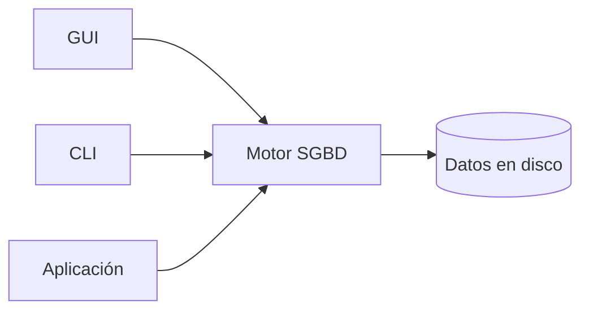

## Objetivos medibles

Al finalizar la lección el estudiante podrá:

1. **Definir** qué es una **BD** (Base de Datos) y qué es un **SGBD** (Sistema Gestor de Bases de Datos), y explicar cómo colaboran con un ejemplo de PYME LATAM.
2. **Contrastar** bases **relacionales** (tablas + **SQL** — Structured Query Language) frente a **NoSQL** (Not Only SQL: documentos, clave-valor, columnas, grafos) según escenario (inventario vs catálogo flexible).
3. **Distinguir** **motor/servidor** (MySQL, MariaDB, MongoDB), **GUI** (Graphical User Interface: phpMyAdmin, Workbench, DBeaver, Compass) y **CLI** (Command Line Interface: `mysql`/`mariadb`, `mongosh`).
4. **Nombrar y relacionar** **tabla**, **campo/columna**, **registro/fila** y **valor**, con reglas de nombres (`Nombre_Programa`) y literales entre comillas simples.
5. **Explicar** por qué confundir la GUI con el motor lleva a diagnósticos erróneos (un solo bloque de cuidado operativo al cierre).

> **Modo concepto:** definir con claridad. Usar *Qué es* solo donde defina un término central. Malas prácticas: **un solo bloque opcional al final** (confundir GUI con motor), no por cada sección.

## Páginas sugeridas (ADR 011)

| page slug | título sugerido | contenido principal |
|-----------|-----------------|---------------------|
| hub | Fundamentos, motores y estructura | Objetivos + índice |
| `que-es-y-tipos` | Qué es una BD y tipos | BD/SGBD + relacional vs NoSQL |
| `motores-y-gestores` | Motores y gestores | MySQL/MariaDB/MongoDB + GUI + CLI |
| `estructura-tablas-campos` | Estructura: tablas, campos, registros | Tabla/campo/registro/valor + reglas |
| `practica-y-cierre` | Práctica y cierre | Ejercicios + Reto + Quiz |

**Prev/next clase:** `clase-01-historia-bases-de-datos` → … → `clase-03-modelos-datos-er`.

---

## Conceptos clave

### 1. BD — Base de Datos

**Qué es:** un **conjunto organizado de datos relacionados**, persistentes, pensados para consultarlos, actualizarlos y compartirlos con reglas de consistencia. No es “cualquier archivo con información”.

**Para qué / cómo opera:** varias personas o apps trabajan sobre la **misma fuente de verdad**. Se define un esquema o modelo; el software gestor valida y persiste; otras apps leen datos ya consistentes.

**Ejemplo:** academia “Rutas Digitales” (Cali) deja de tener nombres de programas distintos por sede en Word/Excel y pasa a una BD `academia` con tabla `Programas`.

### 2. SGBD — Sistema Gestor de Bases de Datos

**Qué es:** el **software** que administra una o varias BD: crea estructuras, acepta lenguajes de consulta, controla usuarios, almacenamiento y recuperación. “Motor” enfatiza el **servidor** (mysqld, mongod).

**Frase ancla:** la BD es el **contenido organizado**; el SGBD es el **motor + herramientas** que lo hacen usable. phpMyAdmin **no** es el SGBD.

### 3. Tipos — relacionales

Organizan datos en **tablas** (filas/registros y columnas/campos). Relaciones por **valores** (claves). Lenguaje dominante: **SQL**.

**Encaje:** inventario, matrículas, facturación, órdenes — datos estructurados de negocio. Es el enfoque principal del módulo.

### 4. Tipos — NoSQL (Not Only SQL)

Familias: **documentos** (MongoDB), **clave-valor**, **columnas anchas**, **grafos**. Esquema más flexible; consistencia según producto.

| Escenario | Mejor encaje |
|-----------|--------------|
| Inventario / stock / facturación | Relacional (MySQL/MariaDB) |
| Catálogo con atributos distintos por categoría | Documentos (MongoDB) o híbrido |
| Sesiones / caché | Clave-valor |
| Red de referidos / fraude | Grafo |

### 5. Motores / servidores

| Motor | Familia | Perfil |
|-------|---------|--------|
| MySQL | Relacional SQL | Web LAMP; hosting LATAM |
| MariaDB | Relacional SQL | Distros Linux / aulas |
| MongoDB | Documentos | JSON flexible |

El motor **guarda y procesa**. Elegir motor es elegir modelo + ecosistema + operación.

### 6. Gestores visuales (GUI) y CLI

| Rol | Qué es | Ejemplos |
|-----|--------|----------|
| **GUI** | Cliente gráfico; habla con el motor | phpMyAdmin, Workbench, DBeaver, Compass |
| **CLI** | Cliente de texto | `mysql`/`mariadb`, `mongosh` |

Misma BD `academia` en MariaDB puede administrarse con phpMyAdmin, con `mariadb` en terminal o desde una app — **no son tres bases distintas**.

### 7. Estructura: tabla, campo, registro, valor

| Elemento | Definición operativa | Ejemplo |
|----------|----------------------|---------|
| Tabla | Contenedor de filas del mismo tipo de hecho | `Programas` |
| Campo / columna | Atributo tipado | `Nombre_Programa` |
| Registro / fila | Una instancia | Un programa ofertado |
| Valor | Dato en la celda | `'Técnica Profesional en Configuración de Servicios Web'` |

**Reglas de escritura:**

1. Nombres sin espacios → `Nombre_Programa`.
2. Literales de texto entre comillas simples `'…'`.
3. Los **valores** sí pueden llevar espacios, tildes y caracteres especiales.
4. No confundir identificador (campo) con contenido (valor).

```sql
CREATE TABLE Programas (
  id               INTEGER PRIMARY KEY,
  Nombre_Programa  VARCHAR(200) NOT NULL,
  cupos            INTEGER NOT NULL
);

INSERT INTO Programas (id, Nombre_Programa, cupos) VALUES
  (1, 'Técnica Profesional en Configuración de Servicios Web', 30);

SELECT id, Nombre_Programa FROM Programas WHERE cupos >= 25;
```

### Malas prácticas (un solo bloque opcional — al final)

**Confundir GUI con motor** (y variantes cercanas):

1. Reinstalar phpMyAdmin porque “se borró la BD” → diagnosticar el **servicio del motor** y el datadir.
2. Documentar el stack solo como “usamos Workbench/phpMyAdmin” → nombrar siempre **motor + versión + cliente**.
3. Creer que sin GUI “no hay base de datos” en un VPS → practicar **CLI**.

## Errores comunes

1. Confundir BD / SGBD / GUI.
2. Tratar Excel/Sheets como equivalente a un SGBD en producción.
3. Leer “NoSQL” como “nunca usar SQL”.
4. Campos con espacios; literales sin comillas simples.
5. Elegir Mongo por moda para cupos/inventario rígido.

## Casos reales

### Caso 1 — “Andes Tech” (Medellín)

Excel por sede con nombres oficiales divergentes. Solución: MariaDB + `Programas` con `Nombre_Programa` UTF-8; GUI solo para admin; app lee por SQL.

### Caso 2 — “Catálogo Libre” (Lima)

60 columnas nullable en MySQL para atributos variables → `ALTER` constantes. Mejor: pedidos/stock relacional; atributos flexibles en documentos (o diseño por tipo).

## Ejemplos de código sugeridos

Ver bloque SQL de estructura. Contraste de literales:

```sql
-- Correcto:
SELECT * FROM Programas
WHERE Nombre_Programa = 'Técnica Profesional en Configuración de Servicios Web';
```

Documento MongoDB ilustrativo (comparación, no reemplazo del foco relacional).

## Ejercicios de práctica

- **tipo:** reflexion — Diferencia BD, SGBD y phpMyAdmin en una frase con el ejemplo de Cali.
- **tipo:** ordenar-pasos — Clasifica en motor / GUI / CLI: MariaDB, DBeaver, `mongosh`, MongoDB, phpMyAdmin, `mysql`.
- **tipo:** reflexion — ¿Por qué inventario → relacional y catálogo heterogéneo → documentos?
- **tipo:** completar-codigo — `INSERT` de un programa con tildes usando comillas simples.
- **tipo:** diagrama — Tabla `Programas` con 2 registros; etiqueta tabla, campo, registro, valor.

## Animación o visual sugerida

- Mindmap o flowchart: BD → SGBD → (Motor / GUI / CLI).
- CompareTable: relacional vs NoSQL (escenarios); motor vs GUI vs CLI.
- StepReveal: tabla → campos → registros → valores.
- erDiagram mínimo de `Programas` si se promete diagrama.

## Diagrama Mermaid (si aplica)



## Reto integrador

**“Criterio de Andes Tech”**

1. Definir BD vs SGBD en el proyecto.
2. Elegir motor(es) por workload (cupos vs ficha flexible).
3. Indicar una GUI y una CLI coherentes.
4. Proponer `Programas` + `INSERT` válido del nombre largo con tildes.
5. Explicar en 3 líneas el riesgo de confundir GUI con motor.

## Preguntas sugeridas para quiz (5)

1. **¿Qué describe mejor BD frente a SGBD?**
   - A) BD es phpMyAdmin; SGBD es Excel
   - B) BD es el conjunto organizado de datos; SGBD es el software que los administra
   - C) Son sinónimos exactos
   - D) SGBD solo existe en NoSQL
   - **Correcta:** B
   - **Feedback:** Contenido organizado vs sistema que lo gestiona.

2. **Relacional vs documental:**
   - A) Relacional = tablas/SQL; documental = documentos flexibles (p. ej. MongoDB)
   - B) NoSQL prohíbe texto
   - C) Relacional no permite claves
   - D) MongoDB solo funciona sin disco
   - **Correcta:** A
   - **Feedback:** Dos familias distintas de organización y consulta.

3. **Motores vs gestores:**
   - A) phpMyAdmin es el motor que guarda los datos
   - B) MySQL/MariaDB/MongoDB son motores; phpMyAdmin/Workbench/DBeaver/Compass son GUI
   - C) La CLI reemplaza al motor
   - D) DBeaver almacena tablas en el navegador
   - **Correcta:** B
   - **Feedback:** El motor persiste; GUI/CLI son clientes.

4. **Campo y valor correctos:**
   - A) `Nombre Programa` y valor sin comillas
   - B) `Nombre_Programa` y `'Técnica Profesional en Configuración de Servicios Web'`
   - C) Campo con espacios y valor entre corchetes
   - D) Los valores nunca pueden tener tildes
   - **Correcta:** B
   - **Feedback:** Identificadores sin espacios; literales con comillas; tildes en el valor OK.

5. **¿Qué pasaría si tres sedes editan cupos solo en Excel compartido?**
   - A) ACID automático de MariaDB
   - B) Inconsistencias y choques de edición propios de no tener un SGBD
   - C) Se convierte en MongoDB
   - D) phpMyAdmin corrige solo
   - **Correcta:** B
   - **Feedback:** Sin motor de concurrencia/integridad, el patrón pre-BD vuelve.

## Referencias

- Fuente: `kb/education/sources/clases/bases-de-datos/clase-02-fundamentos-motores-estructura.md`
- Topic expert: `kb/agents/topic-experts/bases-de-datos.md`
- Pedagogía: `kb/education/pedagogy-standards.md`
- Prerrequisito: `clase-01-historia-bases-de-datos` · Siguiente: `clase-03-modelos-datos-er`
