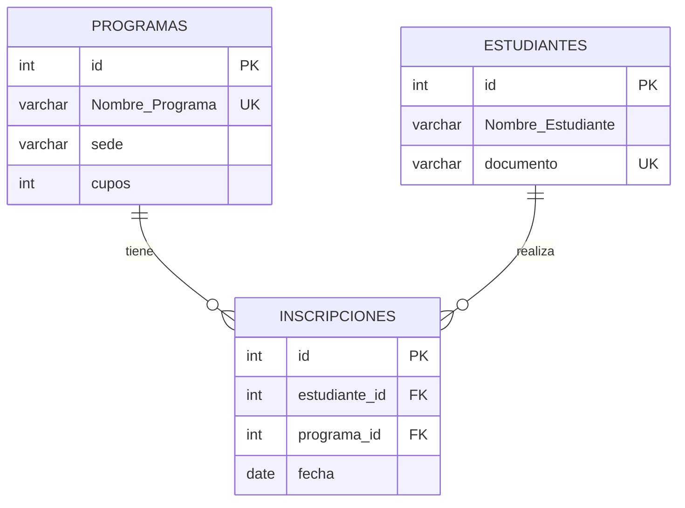
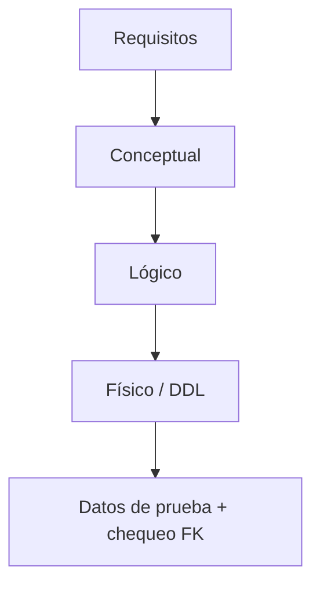

## Objetivos medibles

Al finalizar la lección el estudiante podrá:

1. **Explicar** qué es un **modelo de datos** y por qué se diseña **antes** de improvisar `CREATE TABLE`.
2. **Diferenciar** modelo **conceptual**, **lógico** y **físico** (qué representa, quién lo usa, ejemplo del mismo dominio).
3. **Crear e interpretar** un diagrama **ER** (Entity-Relationship — entidad-relación) con entidades, atributos, relaciones y cardinalidad (1:1, 1:N, N:M), incluyendo Mermaid `erDiagram`.
4. **Transformar** un ER a tablas SQL eligiendo **tipos**, **PK** (Primary Key) y **FK** (Foreign Key) con reglas (padres primero, mismos tipos, N:M → tabla puente).
5. **Ubicar** familias relacional / NoSQL / grafos como **contexto de elección de diseño** (no recontar toda la historia de la clase 01).

> **Modo diseño:** foco en diseñar (conceptual → lógico → físico → ER → transformación). Familias solo como contexto. **Sin** malas prácticas ni señales en cada sección; errores frecuentes van al cierre global.

## Páginas sugeridas (ADR 011)

| page slug | título sugerido | contenido |
|-----------|-----------------|-----------|
| hub | Modelos de datos y diagramas ER | Objetivos + índice |
| `modelos-conceptual-logico-fisico` | Conceptual, lógico y físico | Niveles de modelo |
| `diagramas-er` | Diagramas ER | Símbolos, cardinalidad, Mermaid |
| `familias-contexto-diseno` | Familias como contexto | Relacional / NoSQL / grafos (breve) |
| `transformacion-tipos-llaves` | ER→SQL, tipos y llaves | Pasos + CodeFiddle |
| `practica-y-cierre` | Práctica y cierre | Ejercicios + Reto + Quiz |

**Prev/next:** `clase-02-fundamentos-motores-estructura` → … → `clase-04-ddl-dml-relacional`.

---

## Conceptos clave

### 0. Diseñar antes de crear

Imagina que “Rutas Digitales” (Cali) pide “crear ya las tablas”. Primero se diseña: qué existe, cómo se relaciona, qué identifica cada hecho. El SQL de la siguiente clase implementará ese diseño; aquí el estudiante **dibuja y traduce**.

### 1. Modelo de datos

Representación estructurada del negocio: **entidades**, **atributos**, **relaciones**, con reglas de identificación. No es el motor ni el Excel: es el **plano**.

**Pasos:** requisitos → entidades → atributos → relaciones/cardinalidad → refinar con el cliente → bajar a lógico/físico.

### 2. Conceptual → lógico → físico

| Nivel | Qué representa | Quién lo usa | Ejemplo |
|-------|----------------|--------------|---------|
| **Conceptual** | Qué existe (entidades y relaciones), lenguaje de negocio | Analista + cliente | “Estudiante se inscribe en Programa” |
| **Lógico** | Atributos, claves, cardinalidad, sin motor concreto | Diseñador | Tablas lógicas + PK/FK |
| **Físico** | Tipos SQL, índices, motor, DDL | DBA / desarrollador | `VARCHAR(200)`, `INT AUTO_INCREMENT` |

El conceptual **no** menciona `INT AUTO_INCREMENT`. El físico es lo que el SGBD realmente crea.

### 3. Diagrama ER

Dibujo (o descripción formal) de entidades, atributos y relaciones con **cardinalidad**.

| Pieza | Idea |
|-------|------|
| Entidad | Cosa del negocio |
| Atributo | Dato que la describe |
| Relación | Vínculo semántico |
| 1:1 / 1:N / N:M | Cuántas instancias de cada lado |

**Cómo se crea:** listar entidades → atributos → verbos de relación → cardinalidad → revisar N:M → dibujar (Mermaid / pizarra) → contrastar con requisitos.



### 4. Familias como contexto de diseño (breve)

No repetir la historia completa. Al elegir **cómo modelar**:

| Familia | Organización | Cuándo encaja el diseño |
|---------|--------------|-------------------------|
| Relacional | Tablas + PK/FK + SQL | Matrículas, facturas, inventario |
| Documentos / NoSQL | JSON flexible | Catálogo con atributos variables |
| Grafos | Nodos + aristas first-class | “Quién estudió con quién”, recomendaciones |

El **núcleo** del módulo y de Rutas Digitales es relacional; otras familias son complemento según la forma de la pregunta.

> Intro estrella/copo (hechos + dimensiones): solo reconocimiento visual; detalle en clase 05.

### 5. Transformación ER → tablas SQL

1. Cada entidad fuerte → una tabla; atributos → columnas.
2. Elegir **PK** (subrogada `id` recomendada; UNIQUE de negocio aparte).
3. **1:N** → FK en el lado **N**.
4. **1:1** → FK en el lado dependiente (documentar).
5. **N:M** → **tabla puente** con al menos dos FKs (+ atributos de la relación).
6. Opcionales → `NULL` / `NOT NULL`.
7. `CREATE` **padres primero**, luego hijos/puentes.
8. Probar inserts válidos e inválidos (FK rota).

### 6. Tipos de datos (criterio)

| Familia | Tipos | Uso |
|---------|-------|-----|
| Enteros | `INT`, `BIGINT`… | IDs, cupos |
| Decimales | `DECIMAL` | Dinero |
| Texto | `VARCHAR`, `TEXT` | Nombres |
| Fecha/hora | `DATE`, `DATETIME`… | Inscripciones |
| Booleano | según motor | Flags |

No todo es `VARCHAR`: fechas como `DATE`, dinero como `DECIMAL`.

### 7. PK y FK

- **PK:** identifica de forma única cada fila; estable (no el nombre del programa).
- **FK:** valor que debe existir en la PK/UNIQUE del padre; **mismo tipo**; integridad referencial en el motor.

## Errores comunes

1. Empezar por `CREATE TABLE` sin modelo ni ER.
2. Mezclar niveles (tipos SQL en el conceptual).
3. Cardinalidad incorrecta; N:M sin tabla puente; FK en el lado 1 de una 1:N.
4. Todo `VARCHAR`; PK inestable; FK y PK de tipos distintos; hijas antes que padres.
5. Elegir familia por moda sin mirar la forma de la pregunta.

## Casos reales

### Caso 1 — Rutas Digitales (Cali)

Una tabla `Todo` con `estudiante1`, `estudiante2`… Redibujar ER (`Programas`, `Estudiantes`, `Inscripciones`) y migrar con PK/FK.

### Caso 2 — Andes Tech (recomendaciones)

Quieren caminos de co-inscripción y también facturación. Relacional para matrículas/pagos; grafo (o capa) para recomendaciones — la familia sigue a la pregunta.

## Ejemplos de código sugeridos

```sql
CREATE TABLE Estudiantes (
  id INT NOT NULL AUTO_INCREMENT,
  Nombre_Estudiante VARCHAR(120) NOT NULL,
  documento VARCHAR(30) NOT NULL,
  PRIMARY KEY (id),
  UNIQUE (documento)
);

CREATE TABLE Programas (
  id INT NOT NULL AUTO_INCREMENT,
  Nombre_Programa VARCHAR(200) NOT NULL,
  sede VARCHAR(80) NOT NULL,
  cupos INT NOT NULL,
  PRIMARY KEY (id),
  UNIQUE (Nombre_Programa)
);

CREATE TABLE Inscripciones (
  id INT NOT NULL AUTO_INCREMENT,
  estudiante_id INT NOT NULL,
  programa_id INT NOT NULL,
  fecha DATE NOT NULL,
  PRIMARY KEY (id),
  UNIQUE (estudiante_id, programa_id),
  CONSTRAINT fk_insc_est FOREIGN KEY (estudiante_id) REFERENCES Estudiantes(id),
  CONSTRAINT fk_insc_prog FOREIGN KEY (programa_id) REFERENCES Programas(id)
);
```

## Ejercicios de práctica

- **tipo:** reflexion — ¿Qué gana Rutas Digitales al pasar por conceptual → lógico → físico antes del SQL?
- **tipo:** diagrama — ER Programa–Estudiante–Inscripción con cardinalidades.
- **tipo:** ordenar-pasos — (a) CREATE hijas, (b) requisitos, (c) ER, (d) CREATE padres, (e) tipos físicos, (f) INSERT prueba.
- **tipo:** codigo — N:M Programa–Instructor → DDL con puente.
- **tipo:** reflexion — Elige familia para: facturas / caché de sesión / “quién estudió con quién”.

## Animación o visual sugerida

- Mermaid `erDiagram` (obligatorio).
- Flowchart: requisitos → conceptual → lógico → físico → DDL.
- CompareTable breve de familias (contexto).
- StepReveal del flujo de diseño.
- CodeFiddle de transformación + intento de FK huérfana.

## Diagrama Mermaid (si aplica)



## Reto integrador

1. Conceptual (6–8 líneas) del dominio matrículas.
2. `erDiagram` con ≥3 entidades y cardinalidades correctas.
3. Justificar núcleo relacional + un complemento (grafo/documentos) si aplica.
4. DDL padres primero con tipos, PK, UNIQUE, FK.
5. 2–3 INSERT válidos + 1 inválido (FK) documentado.
6. Argumentar en lenguaje técnico comprensible para un coordinador.

## Preguntas sugeridas para quiz (5)

1. **Conceptual vs físico:**
   - A) Conceptual ya define `VARCHAR`; físico solo dibuja
   - B) Conceptual = qué existe en el negocio; físico = tipos SQL, motor, índices
   - C) Son sinónimos de NoSQL
   - D) El físico no usa PK
   - **Correcta:** B
   - **Feedback:** El lógico está en medio (atributos/claves sin motor).

2. **En 1:N, ¿dónde va la FK?**
   - A) Siempre en el lado 1
   - B) En el lado N (tabla hija)
   - C) Nunca se usa FK
   - D) Solo en NoSQL
   - **Correcta:** B
   - **Feedback:** El hijo apunta al padre.

3. **Grafos frente a relacional típico:**
   - A) No pueden representar relaciones
   - B) Las aristas son ciudadanas de primera clase; consultas por caminos
   - C) Solo almacenan Excel
   - D) Obligan a VARCHAR
   - **Correcta:** B
   - **Feedback:** Forma de pregunta distinta → familia distinta.

4. **N:M a SQL:**
   - A) IDs separados por coma en una columna
   - B) Tabla puente con FKs a ambas entidades
   - C) Dos PRIMARY KEY en la misma tabla padre
   - D) Solo LEFT JOIN sin tablas nuevas
   - **Correcta:** B
   - **Feedback:** Asociación explícita.

5. **Orden de diseño sano:**
   - A) CREATE TABLE → luego preguntar al negocio
   - B) Requisitos → conceptual/ER → lógico → físico/DDL
   - C) Solo físico
   - D) Solo NoSQL primero
   - **Correcta:** B
   - **Feedback:** Diseñar antes de crear.

## Referencias

- Fuente: `kb/education/sources/clases/bases-de-datos/clase-03-modelos-datos-er.md`
- Topic expert: `kb/agents/topic-experts/bases-de-datos.md`
- Pedagogía: `kb/education/pedagogy-standards.md`
- Prerrequisito: `clase-02-fundamentos-motores-estructura` · Siguiente: `clase-04-ddl-dml-relacional`
