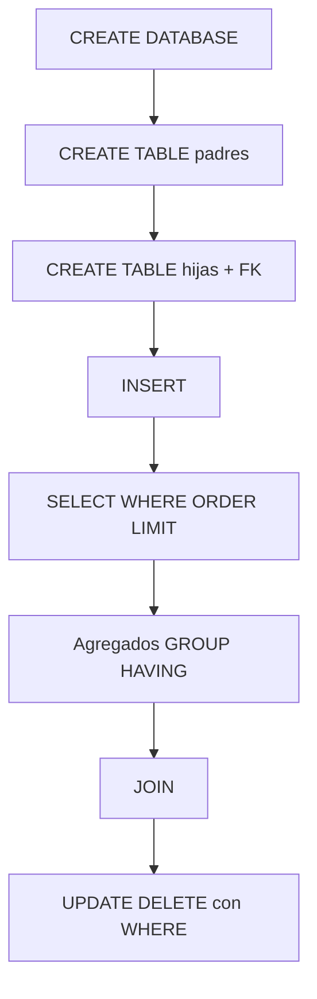

## Objetivos medibles

Al finalizar la lección el estudiante podrá:

1. **Aplicar** **DDL** (Data Definition Language — Lenguaje de Definición de Datos: `CREATE`/`DROP`/`ALTER`, AUTO INCREMENT, PK/UNIQUE/NOT NULL) sobre un esquema de baja complejidad ya diseñado.
2. **Manipular** datos con **DML** (Data Manipulation Language: `INSERT`, `SELECT` + `WHERE`/`DISTINCT`/`ORDER BY`/`LIMIT`, agregados, `GROUP BY`/`HAVING`, `UPDATE`, `DELETE`).
3. **Escribir** `INNER JOIN`, `LEFT JOIN` y `RIGHT JOIN` asumiendo el ER y las PK/FK ya vistos en **clase-03-modelos-datos-er** (no re-enseñar el diseño completo).
4. **Aplicar** un callout de seguridad: `UPDATE`/`DELETE` siempre con `WHERE`; `DROP` solo con backup — un solo bloque, no por cada sentencia.

> **Modo procedimiento:** pasos y práctica con sentencias. Malas prácticas **solo** donde el error rompe datos (UPDATE/DELETE sin WHERE, DROP sin backup). JOINs asumen ER de clase 03.

## Páginas sugeridas (ADR 011)

| page slug | título sugerido | contenido |
|-----------|-----------------|-----------|
| hub | DDL, DML y consultas SQL | Objetivos + índice |
| `ddl-estructura` | DDL: estructura | CREATE/DROP DATABASE/TABLE, ALTER, AUTO INCREMENT |
| `ddl-restricciones` | DDL: restricciones | PK, UNIQUE, NOT NULL |
| `dml-insert-select` | INSERT y SELECT | Carga y consulta base |
| `dml-filtros-orden` | Filtros y orden | WHERE, DISTINCT, ORDER BY, LIMIT |
| `agregados-group-having` | Agregados | AVG/SUM/COUNT/MAX/MIN + GROUP BY + HAVING |
| `update-delete` | UPDATE y DELETE | Callout WHERE/backup + práctica |
| `joins` | JOINs | INNER/LEFT/RIGHT sobre esquema ya modelado |
| `practica-y-cierre` | Práctica y cierre | Ejercicios + Reto + Quiz |

**Prev/next:** `clase-03-modelos-datos-er` → … → `clase-05-normalizacion-esquemas`.

---

## Conceptos clave

### 0. Mapa DDL vs DML

| Familia | Qué toca | Ejemplos |
|---------|----------|----------|
| **DDL** | Estructura (esquema) | `CREATE`/`ALTER`/`DROP` TABLE |
| **DML** | Datos (filas) | `INSERT`/`SELECT`/`UPDATE`/`DELETE` |

Progresión: crear esquema → restricciones → cargar/consultar → relacionar con JOIN (FK ya diseñadas en clase 03).

### Callout único — operaciones que rompen datos

**Incluir siempre `WHERE` en `UPDATE` y `DELETE`.** Sin `WHERE` se afectan **todas** las filas. **Backup** (dump/snapshot) antes de `DROP DATABASE`/`DROP TABLE` o cambios masivos en datos reales. Verificar host/BD (`SELECT DATABASE();`) antes de cualquier DDL destructivo.

---

### Bloque A — DDL

**CREATE DATABASE / DROP DATABASE** — contenedor lógico; DROP es irreversible sin backup.

**CREATE TABLE** — columnas tipadas; nombres sin espacios (`Nombre_Programa`).

**DROP TABLE** — elimina estructura y datos de esa tabla (≠ `DELETE` de filas).

**ALTER TABLE** — agregar/modificar/eliminar columnas; backfill antes de `NOT NULL` sobre datos existentes.

**AUTO INCREMENT** — genera número único al insertar; suele ir en la PK subrogada `id`.

### Bloque B — Restricciones

| Restricción | Rol |
|-------------|-----|
| **PRIMARY KEY** | Identifica de forma única cada fila |
| **UNIQUE** | Valores distintos en la columna (negocio) |
| **NOT NULL** | No admite ausencia; `NULL` ≠ `0` ≠ `''` |

Comparar con `NULL` → `IS NULL` / `IS NOT NULL`.

### Bloque C — DML base

**Reglas de escritura:** campos sin espacios; textos entre comillas simples; valores pueden tener tildes/espacios (`'Técnica Profesional en Configuración de Servicios Web'`).

**INSERT** — listar columnas explícitamente.

**SELECT** — proyectar lo necesario; base de filtros, agregados y JOINs.

### Bloque D — Filtrar, ordenar, limitar

| Cláusula | Pregunta que responde |
|----------|----------------------|
| **WHERE** | Filas que cumplen condición (también seguridad de UPDATE/DELETE) |
| **DISTINCT** | Valores únicos en el resultado |
| **ORDER BY** | Orden de entrega (sin él el orden no está garantizado) |
| **LIMIT** | Cuántas filas devolver (mejor con ORDER BY) |

### Bloque E — Agregados

```sql
SELECT AVG(campo), SUM(campo), COUNT(campo), MAX(campo), MIN(campo)
FROM tablas WHERE (opcional);
```

**GROUP BY** — agregar por grupos. **HAVING** — filtrar **después** de agrupar (sobre COUNT/AVG…); WHERE filtra filas antes.

### Bloque F — UPDATE y DELETE

```sql
UPDATE Programas SET cupos = 35 WHERE id = 1;
DELETE FROM Programas WHERE id = 3;
-- Peligroso: sin WHERE → todas las filas
```

Practicar: `SELECT` con el mismo WHERE → contar filas → luego UPDATE/DELETE.

### Bloque G — JOINs (ER ya visto)

El estudiante **ya** diseñó Programas 1:N Inscripciones y PK/FK en clase 03. Aquí solo opera:

| JOIN | Idea |
|------|------|
| **INNER** | Solo coincidencias |
| **LEFT** | Toda la izquierda + matches; NULL a la derecha si no hay |
| **RIGHT** | Toda la derecha + matches; NULL a la izquierda si no hay |

```sql
SELECT p.Nombre_Programa, i.Nombre_Estudiante
FROM Programas p
LEFT JOIN Inscripciones i ON i.programa_id = p.id;
```

Recordatorio breve (no re-curso de diseño): padres primero al crear FK; mismo tipo PK/FK.

## Errores comunes

1. Confundir `DROP TABLE` con `DELETE`.
2. `UPDATE`/`DELETE` sin `WHERE`.
3. Campos con espacios; literales mal citados.
4. Hijas antes que padres al crear FK; tipos distintos PK/FK.
5. INNER cuando el negocio necesita ver “sin coincidencia” (LEFT).
6. WHERE cuando hacía falta HAVING (o al revés); `= NULL` en vez de `IS NULL`.

## Casos reales

### Caso 1 — Rutas Digitales (Cali)

`DELETE FROM Inscripciones;` sin WHERE en BD con matrículas reales. Restaurar dump; usuario sin DELETE masivo; checklist SELECT-count.

### Caso 2 — Ferretería “El Tornillo” (Bogotá)

Reportan “todos los productos se venden” con INNER JOIN. Corrección: LEFT + `WHERE v.id IS NULL` para productos sin ventas.

## Ejemplos de código sugeridos

```sql
CREATE DATABASE academia_rutas;
USE academia_rutas;

CREATE TABLE Programas (
  id INT NOT NULL AUTO_INCREMENT,
  Nombre_Programa VARCHAR(200) NOT NULL,
  sede VARCHAR(80) NOT NULL,
  cupos INT NOT NULL,
  PRIMARY KEY (id),
  UNIQUE (Nombre_Programa)
);

CREATE TABLE Inscripciones (
  id INT NOT NULL AUTO_INCREMENT,
  Nombre_Estudiante VARCHAR(120) NOT NULL,
  programa_id INT NOT NULL,
  PRIMARY KEY (id),
  CONSTRAINT fk_insc_programa
    FOREIGN KEY (programa_id) REFERENCES Programas(id)
);

INSERT INTO Programas (Nombre_Programa, sede, cupos) VALUES
  ('Técnica Profesional en Configuración de Servicios Web', 'Cali', 30),
  ('Técnica en Sistemas', 'Cali', 25);

INSERT INTO Inscripciones (Nombre_Estudiante, programa_id) VALUES
  ('Ana Ruiz', 1), ('Luis Pérez', 1);

SELECT sede, COUNT(*) AS programas, AVG(cupos) AS promedio
FROM Programas GROUP BY sede HAVING COUNT(*) >= 1;

SELECT p.Nombre_Programa, i.Nombre_Estudiante
FROM Programas p
LEFT JOIN Inscripciones i ON i.programa_id = p.id;
```

## Ejercicios de práctica

- **tipo:** codigo — CREATE BD + `Programas` con PK/AUTO INCREMENT/UNIQUE; INSERT del nombre largo.
- **tipo:** codigo — SELECT con WHERE, ORDER BY, LIMIT.
- **tipo:** codigo — agregados + GROUP BY sede + HAVING.
- **tipo:** reflexion — ¿Qué pasa con `DELETE FROM Programas` sin WHERE si hay FK desde Inscripciones?
- **tipo:** codigo — INNER vs LEFT: programas y estudiantes.
- **tipo:** ordenar-pasos — CREATE DB → CREATE padre → CREATE hija → INSERT → JOIN.
- **tipo:** completar-codigo — UPDATE … WHERE por PK.

## Animación o visual sugerida

- Flowchart DDL → DML → JOIN.
- CompareTable: DDL vs DML; WHERE vs HAVING; INNER vs LEFT vs RIGHT.
- Callout danger único: WHERE/backup.
- CodeFiddle del script integral.
- erDiagram breve solo como recordatorio del esquema (diseño ya en clase 03).

## Diagrama Mermaid (si aplica)



## Reto integrador

**“Matrículas de Rutas Digitales”**

1. DDL: BD + Programas/Inscripciones (PK, AUTO INCREMENT, UNIQUE, FK; padres primero).
2. DML: ≥3 programas (uno con el nombre largo exacto) + ≥5 inscripciones.
3. Consultas: WHERE, DISTINCT sedes, top 2 por cupos.
4. Agregados + GROUP BY + HAVING.
5. INNER y LEFT (detectar programas sin inscritos).
6. Un UPDATE y un DELETE **seguros** + 3–4 líneas sobre qué pasaría sin WHERE y por qué backup.

## Preguntas sugeridas para quiz (5)

1. **DDL vs DML:**
   - A) DDL manipula filas; DML crea tablas
   - B) DDL = estructura; DML = datos (filas)
   - C) Ambos solo sirven para JOIN
   - D) DDL es NoSQL
   - **Correcta:** B
   - **Feedback:** CREATE/ALTER/DROP vs INSERT/SELECT/UPDATE/DELETE.

2. **`DELETE FROM Programas` sin WHERE:**
   - A) Solo borra la primera fila
   - B) No hace nada sin LIMIT
   - C) Elimina TODOS los registros; riesgo de pérdida — WHERE + backup
   - D) Borra la base de datos
   - **Correcta:** C
   - **Feedback:** Sin WHERE aplica a todas las filas.

3. **Al crear tablas con FK:**
   - A) Primero hijas, luego padres
   - B) Primero padres; FK y PK del mismo tipo
   - C) FK de distinto tipo “por seguridad”
   - D) No se pueden nombrar CONSTRAINT
   - **Correcta:** B
   - **Feedback:** Orden y tipos alineados (diseño clase 03 → DDL aquí).

4. **LEFT JOIN:**
   - A) Solo filas sin coincidencia
   - B) Todos los de la izquierda + coincidentes de la derecha; NULL a la derecha si no hay match
   - C) Solo intersección, nunca NULL
   - D) Producto cartesiano
   - **Correcta:** B
   - **Feedback:** “Con o sin” hijos.

5. **HAVING vs WHERE:**
   - A) HAVING crea tablas
   - B) HAVING filtra filas antes de leer
   - C) HAVING filtra grupos tras GROUP BY
   - D) HAVING elimina la BD
   - **Correcta:** C
   - **Feedback:** WHERE = filas; HAVING = grupos.

## Referencias

- Fuente: `kb/education/sources/clases/bases-de-datos/clase-04-ddl-dml-relacional.md`
- Topic expert: `kb/agents/topic-experts/bases-de-datos.md`
- Pedagogía: `kb/education/pedagogy-standards.md`
- Prerrequisito: `clase-03-modelos-datos-er` · Siguiente: `clase-05-normalizacion-esquemas`
