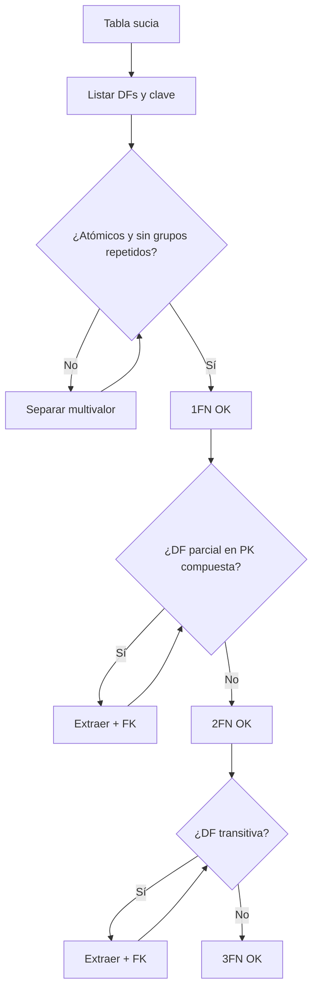

## Objetivos medibles

Al finalizar la lección el estudiante podrá:

1. **Explicar** **redundancia** y anomalías de inserción, actualización y borrado con un ejemplo de matrículas/facturas.
2. **Definir** **dependencia funcional** (DF: *si conozco A, determino B*) y detectarlas en una tabla sucia.
3. **Ejecutar** el procedimiento **1FN → 2FN → 3FN** con checklist y antes/después; mencionar **BCNF** sin exigir dominio formal completo.
4. **Argumentar** cuándo **desnormalizar** de forma consciente (snapshot, lecturas) y qué riesgo acepta.
5. **Distinguir** esquema en **estrella** vs **copo de nieve** y relacionarlos con normalización de dimensiones en BI.

> **Modo procedimiento:** pasos ejecutables. Anti-patrones solo si ayudan al procedimiento (p. ej. CSV en celdas = viola 1FN). Prerequisites: `clase-04-ddl-dml-relacional`.

## Páginas sugeridas (ADR 011)

| page slug | título sugerido | contenido |
|-----------|-----------------|-----------|
| hub | Normalización y esquemas | Objetivos + índice |
| `redundancia-y-dependencia-funcional` | Redundancia y DF | Anomalías + DF |
| `formas-normales-1-2-3` | 1FN, 2FN, 3FN | Procedimiento + BCNF mención |
| `desnormalizacion` | Desnormalización | Cuándo / riesgos / snapshot |
| `estrella-y-copo-de-nieve` | Estrella y copo | BI: dims planas vs normalizadas |
| `practica-y-cierre` | Práctica y cierre | Ejercicios + Reto + Quiz |

**Prev/next:** `clase-04-ddl-dml-relacional` → … → `clase-06-dcl-tcl-objetos-bd`.

---

## Conceptos clave

### 0. Limpiar el diseño (y saber cuándo no)

Tras ER (clase 03) y SQL (clase 04), se **limpia** el esquema: redundancia → DF → formas normales. Luego: desnormalización consciente y formas analíticas (estrella/copo).

### 1. Redundancia y anomalías

**Redundancia:** la misma verdad de negocio copiada en varios sitios y puede divergir.

| Anomalía | Idea |
|----------|------|
| Inserción | No puedes insertar un hecho sin inventar otro |
| Actualización | Cambias en N sitios y olvidas uno |
| Borrado | Al borrar una fila pierdes un hecho que aún necesitabas |

Detección: ¿este valor se repite y describe otra entidad? ¿Si lo cambio, toco varios sitios?

### 2. Dependencia funcional (DF)

**A → B:** si conozco A, determino B de forma única (regla del esquema).

Base para ejecutar formas: 2FN → dependencias **parciales** de PK compuesta; 3FN → dependencias **transitivas** (no-clave → no-clave).

### 3. Procedimiento 1FN → 2FN → 3FN

| Forma | Idea | Cómo ejecutarla |
|-------|------|-----------------|
| **1FN** | Valores atómicos; sin grupos repetidos | Separar listas/`curso1`…`cursoN` en filas o tablas hijas |
| **2FN** | Sin DF parcial de PK **compuesta** | Extraer atributos que dependen solo de parte de la clave + FK |
| **3FN** | Sin DF transitiva | Extraer determinantes no-clave + FK |
| **BCNF** (mención) | Refuerzo: determinante debe ser superclave | Detectar DF “rara”; no exigir descomposición formal completa |

**Orden en pizarra:** tabla sucia → listar DFs → checklist 1FN → 2FN → 3FN → (mención BCNF).

Si la PK es **simple** y hay 1FN, 2FN suele cumplirse; igual verificar DFs.

#### Ejemplo hilo (Rutas Digitales)

- Viola 1FN: columna `programas = 'A, B'`.
- Viola 2FN: PK `(estudiante_id, programa_id)` con `Nombre_Programa` solo dependiente de `programa_id`.
- Viola 3FN: en `Programas`, `sede → telefono_sede` (extraer `Sedes`).

### 4. Desnormalización

Reintroducir redundancia **después** de entender el modelo normalizado, por lecturas, reportes o historia — no por pereza.

**Ejemplo consciente:** al emitir factura, copiar `Nombre_Programa` y precio **congelados** (snapshot). La factura histórica no debe cambiar si mañana renombran el programa.

Decisión: modelo 3FN que funciona → medir dolor de JOINs → técnica (snapshot, resumen, vista) → dueño de la verdad + sync → documentar riesgo.

### 5. Estrella vs copo de nieve

| Forma | Dimensiones | Fortaleza | Cuidado |
|-------|-------------|-----------|--------|
| **Estrella** | Planas / a menudo desnormalizadas | Pocos JOINs en BI | Redundancia controlada en dims |
| **Copo (snowflake)** | Normalizadas en subdims | Menos duplicación en jerarquías | Más JOINs |
| **OLTP 3FN** | N/A (transacciones) | Integridad día a día | No es un DW |

No mezclar el almacén analítico con la carga operacional sin criterio.

## Errores comunes

1. Hablar de 2FN/3FN sin listar DFs.
2. CSV/listas en celdas (“ya hay tablas”).
3. Desnormalizar el día 1 o confundir con “quitar FK”.
4. Llamar estrella/copo al ER operacional sin hechos/dimensiones.
5. Copo extremo “por pureza” que hace inviables los tableros.

## Casos reales

### Caso 1 — Rutas Digitales

Tabla `Todo` con teléfono de sede repetido; al corregir, mitad de filas viejas. Procedimiento 1FN→3FN; `Sedes` dueña del teléfono.

### Caso 2 — Andes Tech

OLTP bien normalizado pero tablero lento. Alguien copia nombres en 4 tablas operacionales sin sync. Separar: 3FN en transacciones; snapshot en factura; estrella para BI.

## Ejemplos de código sugeridos

```sql
CREATE TABLE Sedes (
  id INT NOT NULL AUTO_INCREMENT,
  nombre_sede VARCHAR(80) NOT NULL,
  telefono VARCHAR(30) NOT NULL,
  PRIMARY KEY (id),
  UNIQUE (nombre_sede)
);

CREATE TABLE Programas (
  id INT NOT NULL AUTO_INCREMENT,
  Nombre_Programa VARCHAR(200) NOT NULL,
  sede_id INT NOT NULL,
  PRIMARY KEY (id),
  UNIQUE (Nombre_Programa),
  CONSTRAINT fk_prog_sede FOREIGN KEY (sede_id) REFERENCES Sedes(id)
);

CREATE TABLE FacturaDetalle (
  id INT NOT NULL AUTO_INCREMENT,
  factura_id INT NOT NULL,
  programa_id INT NOT NULL,
  Nombre_Programa_snapshot VARCHAR(200) NOT NULL,
  precio_snapshot DECIMAL(12,2) NOT NULL,
  PRIMARY KEY (id)
);
```

## Ejercicios de práctica

- **tipo:** reflexion — Anomalía de actualización con teléfono de sede.
- **tipo:** completar-codigo — De `'A, B'` en una celda a esquema 1FN.
- **tipo:** ordenar-pasos — sucia → DFs → 1FN → 2FN → 3FN → BCNF mención.
- **tipo:** codigo — PK compuesta con `Nombre_Programa` → 2FN con DDL.
- **tipo:** diagrama — flowchart del procedimiento; marcar nodo si aún hay `sede → telefono`.
- **tipo:** reflexion — Desnormalización consciente vs incorrecta.
- **tipo:** diagrama — estrella vs copo para inscripciones.

## Animación o visual sugerida

- Mermaid flowchart del procedimiento de normalización (obligatorio).
- Mermaid estrella vs copo.
- CompareTable estrella / copo / OLTP 3FN.
- StepReveal: sucia → 1FN → 2FN → 3FN → ¿desnormalizar? → ¿estrella/copo?
- CodeFiddle antes/después.

## Diagrama Mermaid (si aplica)



## Reto integrador

1. Tabla sucia (≥5 columnas) + una anomalía de cada tipo.
2. ≥4 DFs A → B.
3. Procedimiento 1FN→2FN→3FN con evidencia de qué se extrajo.
4. 3–5 líneas sobre cuándo sospechar BCNF.
5. Un atributo a congelar en factura + riesgo aceptado.
6. Estrella mínima + variante copo; aclarar que no es el OLTP.
7. Argumentación para coordinador no técnico (expandir 1FN/DF/BI).

## Preguntas sugeridas para quiz (5)

1. **DF A → B:**
   - A) A y B son la misma columna
   - B) Si conozco A, determino de forma única B según la regla del esquema
   - C) B causa físicamente a A
   - D) Solo existe en NoSQL
   - **Correcta:** B
   - **Feedback:** Base para 2FN/3FN.

2. **PK `(estudiante_id, programa_id)` + `Nombre_Programa` solo de `programa_id`:**
   - A) Solo BCNF
   - B) 1FN (enteros no atómicos)
   - C) 2FN (dependencia parcial)
   - D) Diseño ideal
   - **Correcta:** C
   - **Feedback:** Extraer a `Programas`.

3. **Desnormalización consciente:**
   - A) Borrar todas las FK
   - B) No diseñar nunca
   - C) Redundancia documentada (p. ej. snapshot) tras modelo normalizado
   - D) CSV en una celda
   - **Correcta:** C
   - **Feedback:** Decisión con dueño de la verdad.

4. **Estrella vs copo:**
   - A) Estrella = NoSQL; copo = SQL
   - B) Estrella = dims planas; copo = dims normalizadas (más JOINs)
   - C) Sinónimos de 1FN y 2FN
   - D) Copo sin hechos
   - **Correcta:** B
   - **Feedback:** Ambas son formas analíticas.

5. **1FN ataca principalmente:**
   - A) Dependencias transitivas
   - B) Valores no atómicos / grupos repetidos
   - C) Solo rendimiento de JOINs
   - D) Permisos DCL
   - **Correcta:** B
   - **Feedback:** Piso antes de 2FN/3FN.

## Referencias

- Fuente: `kb/education/sources/clases/bases-de-datos/clase-05-normalizacion-esquemas.md`
- Topic expert: `kb/agents/topic-experts/bases-de-datos.md`
- Pedagogía: `kb/education/pedagogy-standards.md`
- Prerrequisito: `clase-04-ddl-dml-relacional` · Siguiente: `clase-06-dcl-tcl-objetos-bd`
