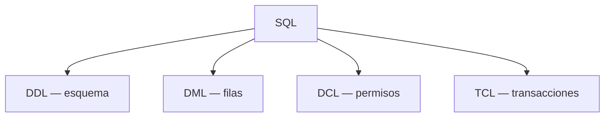
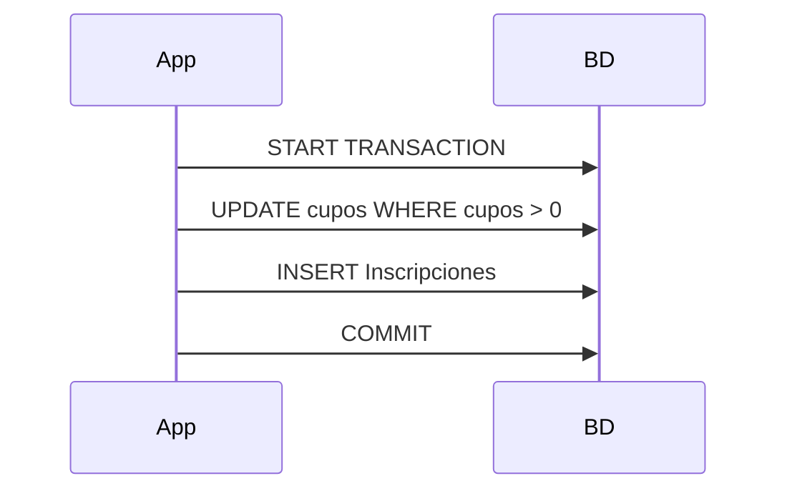

## Objetivos medibles

Al finalizar la lección el estudiante podrá:

1. **Ubicar** DDL / DML / **DCL** (Data Control Language) / **TCL** (Transaction Control Language) en un mapa con ejemplos.
2. **Aplicar** `GRANT`/`REVOKE` (MySQL/MariaDB) con **mínimo privilegio**.
3. **Usar** `START TRANSACTION`/`BEGIN`, `COMMIT`, `ROLLBACK`, `SAVEPOINT` y explicar **ACID** con un ejemplo atómico (inscripción o transferencia).
4. **Crear y consultar** vistas; contrastarlas con tablas base (proyección segura, simplificación).
5. **Ejemplificar** UDF, procedimientos y triggers, y decidir cuándo la lógica va en la app vs en la BD.

> **Modo procedimiento:** pasos ejecutables. Destacar mínimo privilegio y WHERE/transacciones donde importe. Prerequisites: `clase-05-normalizacion-esquemas`. Dialecto preferido: MySQL/MariaDB.

## Páginas sugeridas (ADR 011)

| page slug | título sugerido | contenido |
|-----------|-----------------|-----------|
| hub | DCL, TCL y objetos | Objetivos + índice |
| `mapa-sql-familias` | Mapa SQL | DDL/DML/DCL/TCL |
| `dcl-grant-revoke` | GRANT y REVOKE | Usuarios + mínimo privilegio |
| `tcl-transacciones-acid` | TCL y ACID | Transacciones + ejemplo atómico |
| `vistas` | Vistas | CREATE VIEW / SELECT / límites |
| `funciones-procedimientos-triggers` | Rutinas y triggers | UDF, PROCEDURE, TRIGGER + app vs BD |
| `practica-y-cierre` | Práctica y cierre | Ejercicios + Reto + Quiz |

**Prev clase:** `clase-05-normalizacion-esquemas` · Fin de módulo actual.

---

## Conceptos clave

### 1. Mapa de familias SQL

| Familia | Controla | Ejemplos |
|---------|----------|----------|
| **DDL** | Estructura | `CREATE`/`ALTER`/`DROP`, `CREATE VIEW` |
| **DML** | Filas | `INSERT`/`SELECT`/`UPDATE`/`DELETE` |
| **DCL** | Permisos | `GRANT`/`REVOKE` |
| **TCL** | Confirmación de unidades de trabajo | `COMMIT`/`ROLLBACK`/`SAVEPOINT` |

`CREATE VIEW` es DDL; `SELECT` sobre la vista es DML.

### 2. DCL — GRANT / REVOKE y mínimo privilegio

**DCL** otorga y revoca privilegios; no cambia esquema ni filas: cambia **quién puede** qué.

Principio: **mínimo privilegio** — solo lo necesario para la tarea.

```sql
CREATE USER 'app_rutas'@'localhost' IDENTIFIED BY 'clave_segura_lab';
GRANT SELECT, INSERT ON academia_rutas.Inscripciones TO 'app_rutas'@'localhost';
GRANT SELECT ON academia_rutas.Programas TO 'app_rutas'@'localhost';
GRANT SELECT ON academia_rutas.v_programas_cupos TO 'reporte_rutas'@'localhost';
REVOKE DELETE ON academia_rutas.Inscripciones FROM 'app_rutas'@'localhost';
```

Evitar `root` compartido y `GRANT ALL ON *.*` “para que funcione el lab”.

### 3. TCL y ACID

**Transacción:** unidad todo-o-nada.

| Sentencia | Rol |
|-----------|-----|
| `START TRANSACTION` / `BEGIN` | Inicia |
| `COMMIT` | Confirma |
| `ROLLBACK` | Deshace |
| `SAVEPOINT` / `ROLLBACK TO SAVEPOINT` | Rollback parcial |

| ACID | Idea |
|------|------|
| **Atomicity** | Todo o nada |
| **Consistency** | De estado válido a válido |
| **Isolation** | Concurrentes no se pisan de forma anómala (según nivel) |
| **Durability** | Tras COMMIT, sobrevive a caídas |

```sql
START TRANSACTION;
UPDATE Programas SET cupos = cupos - 1 WHERE id = 1 AND cupos > 0;
INSERT INTO Inscripciones (Nombre_Estudiante, programa_id) VALUES ('Ana Ruiz', 1);
COMMIT;  -- o ROLLBACK si el UPDATE no afectó filas
```

Transacciones **cortas**; motor transaccional (InnoDB). WHERE en el UPDATE de cupos evita dejar cupos negativos.

### 4. Vistas

Consulta `SELECT` con nombre. Vista típica **no** almacena filas propias; recalcula desde tablas base.

Usos: simplificar JOINs; **proyección segura** + `GRANT` solo sobre la vista; API de lectura estable.

Limitaciones: no todas son actualizables; no “magia” de índices; evitar torres de vistas opacas.

### 5. UDF, PROCEDURE, TRIGGER

| Objeto | Idea | Uso típico |
|--------|------|------------|
| **UDF** | Retorna un valor; usable en expresiones/SELECT | Cálculo pequeño (`fn_etiqueta_cupos`) |
| **PROCEDURE** | Proceso; se invoca con `CALL` | Inscripción atómica multi-paso |
| **TRIGGER** | Se dispara BEFORE/AFTER INSERT/UPDATE/DELETE | Auditoría delgada |

En MySQL/MariaDB enseñar `DELIMITER` al crear rutinas. Hosting compartido puede limitar routines → plan B en app.

### 6. ¿App o BD?

| Preferir en la **BD** | Preferir en la **app** |
|----------------------|------------------------|
| Integridad PK/FK/UNIQUE | UX / orquestación de pantallas |
| Invariantes ante cualquier cliente SQL | Reglas que cambian cada sprint |
| Auditoría mínima | Email, pagos, colas externas |
| Transacciones cortas multi-tabla | Flujos multi-sistema |
| Vistas + GRANT | Personalización compleja |

## Errores comunes

1. Confundir DCL con DML (`DELETE` no revoca privilegios).
2. `root` / `GRANT ALL` en lab y luego en prod.
3. Multi-tabla sin transacción; transacciones abiertas demasiado tiempo.
4. Creer que la vista guarda una copia física permanente.
5. Confundir UDF con PROCEDURE; triggers encadenados opacos.
6. Seguridad solo en el frontend sin GRANT/vistas.

## Casos reales

### Caso 1 — Rutas Digitales

App y pasante comparten `root`; script de limpieza borra matrículas. Remedio: usuario app con SELECT/INSERT; reportería solo-lectura.

### Caso 2 — Ferretería / Andes Tech

Descontar stock + registrar venta sin transacción; cae la red a mitad. Remedio: START TRANSACTION … COMMIT/ROLLBACK; InnoDB.

## Ejemplos de código sugeridos

```sql
CREATE VIEW v_programas_cupos AS
SELECT id, Nombre_Programa, cupos FROM Programas;

START TRANSACTION;
UPDATE Programas SET cupos = cupos - 1 WHERE id = 2 AND cupos > 0;
INSERT INTO Inscripciones (Nombre_Estudiante, programa_id) VALUES ('María Gómez', 2);
COMMIT;

-- DCL (requiere privilegios de admin en el lab)
GRANT SELECT ON academia_rutas.v_programas_cupos TO 'reporte_rutas'@'localhost';
```

Rutinas: mostrar esqueleto UDF/PROCEDURE/TRIGGER; si el sandbox no soporta `DELIMITER`, ejecutar en MariaDB local.

## Ejercicios de práctica

- **tipo:** ordenar-pasos — Etiquetar GRANT / CREATE TABLE / COMMIT / INSERT / CREATE VIEW como DDL/DML/DCL/TCL.
- **tipo:** codigo — GRANT SELECT sobre vista + REVOKE DELETE a usuario app.
- **tipo:** codigo — Transacción cupo + inscripción; variante ROLLBACK si cupos = 0.
- **tipo:** reflexion — ACID en 4 frases con el ejemplo de inscripción.
- **tipo:** codigo — VIEW que oculte columna sensible + SELECT.
- **tipo:** completar-codigo — Esqueleto FUNCTION y PROCEDURE.
- **tipo:** reflexion — App vs BD para: formato email / FK / WhatsApp / descuento de cupo.
- **tipo:** diagrama — Flujo inscripción con TCL + trigger de auditoría.

## Animación o visual sugerida

- CompareTable: DDL/DML/DCL/TCL; UDF vs PROCEDURE; app vs BD.
- StepReveal: START TRANSACTION → DML → COMMIT/ROLLBACK.
- Callout: root compartido; transacciones largas; triggers encadenados.
- Mermaid: familias SQL; sequence de inscripción + audit.

## Diagrama Mermaid (si aplica)





## Reto integrador

**“Matrícula segura”**

1. Mapa DDL/DML/DCL/TCL del flujo.
2. VIEW de programas/cupos + SELECT.
3. Inscripción atómica (UPDATE+INSERT) argumentando Atomicity; WHERE en cupos.
4. GRANT/REVOKE app vs reporte; mínimo privilegio.
5. Esbozo UDF + PROCEDURE (o equivalente en app si no hay routines).
6. Diseño trigger AFTER INSERT de auditoría.
7. Cuatro decisiones app vs BD.

## Preguntas sugeridas para quiz (5)

1. **¿Qué es DCL?**
   - A) INSERT/UPDATE/DELETE
   - B) Otorgar y revocar privilegios (`GRANT`/`REVOKE`)
   - C) Solo crear tablas
   - D) Un motor NoSQL
   - **Correcta:** B
   - **Feedback:** Quién puede qué.

2. **Atomicity:**
   - A) Datos “bonitos” en reportes
   - B) Tras COMMIT no hay backup
   - C) Todo-o-nada: todos los cambios o ninguno
   - D) Solo un usuario en el SGBD
   - **Correcta:** C
   - **Feedback:** Evita cupo descontado sin inscripción.

3. **Motivación típica de una vista:**
   - A) Reemplazar siempre tablas base como almacén
   - B) Simplificar consultas y/o exponer solo columnas autorizadas
   - C) Eliminar transacciones
   - D) Convertir a NoSQL
   - **Correcta:** B
   - **Feedback:** Consulta guardada + proyección.

4. **UDF vs PROCEDURE:**
   - A) No hay diferencia
   - B) UDF retorna valor (SELECT); PROCEDURE se CALL y encapsula procesos
   - C) PROCEDURE solo en Excel
   - D) UDF reemplaza GRANT
   - **Correcta:** B
   - **Feedback:** Valor vs proceso.

5. **Mala práctica con triggers:**
   - A) Auditoría delgada AFTER INSERT
   - B) Encadenar lógica oculta entre varios triggers
   - C) Documentar BEFORE/AFTER
   - D) Preferir FK cuando basta
   - **Correcta:** B
   - **Feedback:** Complejidad oculta = anti-patrón.

## Referencias

- Fuente: `kb/education/sources/clases/bases-de-datos/clase-06-dcl-tcl-objetos-bd.md`
- Topic expert: `kb/agents/topic-experts/bases-de-datos.md`
- Pedagogía: `kb/education/pedagogy-standards.md`
- Prerrequisito: `clase-05-normalizacion-esquemas` · Fin de módulo (6 clases + index)
