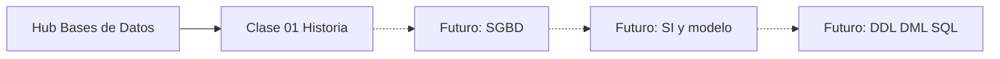

# Brief — Hub Bases de Datos

## Propósito

Introducir el módulo universitario / tecnólogo (LATAM) **Bases de Datos**: orientar al estudiante sobre qué aprenderá, publicar **literalmente** los objetivos y resultados oficiales del programa, indicar prerrequisitos sugeridos y enlazar la primera clase (`clase-01-historia-bases-de-datos`). Es un hub de orientación, no una lección técnica.

## Alcance

- Bienvenida al track y contexto del módulo (formación técnico-profesional / universitaria)
- Publicación **literal** (sin parafrasear) de objetivos y resultados de aprendizaje oficiales
- Prerrequisitos sugeridos: uso básico de PC; nociones de programación opcionales
- Conceptos ligeros de entrada: qué es una BD, qué es un SGBD, por qué importa el módulo
- Navegación explícita hacia `clase-01-historia-bases-de-datos`
- Cierre de hub: qué sigue en el recorrido
- UX: objetivos y resultados en rejilla `ClayCard` (una card por ítem)
- `showInTrackIndex: true` (este hub aparece en el índice del track)

## Fuera de alcance

- Historia detallada de las bases de datos (pertenece a `clase-01-historia-bases-de-datos`)
- Instalación de SGBD, modelo relacional, DDL/DML o SQL (clases futuras)
- Quiz formal de cierre (hub sin evaluación)
- lesson-draft, layout-spec ni TSX

## Objetivos de aprendizaje (texto oficial — copiar literal)

> Publicar **exactamente** estos tres ítems. No parafrasear ni acortar.

1. Implementar Bases de datos de baja complejidad, a partir de un modelo relacional y que cumpla con los requerimientos del cliente
2. Comunicar efectivamente utilizando todos los medios disponibles para ello, reconociendo y respetando las diferencias individuales
3. Demostrar integración y colaboración con los demás compañeros, para la consecución de objetivos comunes

## Resultados de aprendizaje (texto oficial — copiar literal)

> Publicar **exactamente** estos siete ítems. No parafrasear ni acortar.

1. Instala un sistema gestor de bases de datos, teniendo en cuenta los requerimientos de hardware y software
2. Reconoce los componentes de un sistema de información con base en un modelo definido
3. Identifica modelos relacionales de baja complejidad
4. Utiliza adecuadamente las estructuras DDL y DML para el manejo de bases de datos
5. Usa adecuadamente las sentencias SQL
6. Argumenta las soluciones propuestas utilizando el lenguaje técnico adecuado
7. Alienta y fomenta el trabajo en equipo para buscar soluciones a los problemas planteados

## Prerrequisitos sugeridos

- **Uso básico de PC:** navegar carpetas, instalar software con asistente, crear y guardar archivos.
- **Nociones de programación (opcionales):** variables, condiciones y lectura de código simple ayudan, pero no son obligatorias para empezar el hub ni la clase 01.

## Conceptos clave

Profundidad mínima (1 párrafo corto por concepto). No expandir a tutorial.

### Qué es una base de datos

Una **base de datos (BD)** es un conjunto organizado de datos relacionados que se almacenan de forma persistente para consultarlos, actualizarlos y compartirlos con consistencia. En este módulo se trabaja sobre el enfoque relacional de baja complejidad: tablas, relaciones y reglas que reflejan los requerimientos del cliente.

### Qué es un SGBD

Un **sistema gestor de bases de datos (SGBD)** es el software que administra la BD: crea estructuras, valida datos, ejecuta consultas y controla acceso y almacenamiento. Ejemplos comunes en formación y PYME: MySQL, MariaDB, PostgreSQL, SQL Server. Instalar y configurar un SGBD según hardware y software es un resultado explícito del módulo.

### Por qué importa este módulo

En Latinoamérica, muchas tiendas, talleres y laboratorios aún gestionan inventario o clientes en hojas de cálculo o cuadernos. Pasar a una BD relacional reduce errores, permite consultas confiables y prepara al estudiante para comunicar soluciones técnicas y trabajar en equipo — competencias del programa, no solo “saber SQL”.

## Errores comunes

- Creer que “base de datos” es solo Excel o un archivo `.mdb` suelto, sin distinguir datos vs. SGBD.
- Saltar directo a escribir SQL sin leer objetivos/resultados ni el hilo del módulo (historia → modelo → DDL/DML → SQL).
- Subestimar comunicación y trabajo en equipo: el programa evalúa argumentar en lenguaje técnico y colaborar, no solo “que el query funcione”.
- Asumir que hace falta ser programador avanzado para empezar; el hub y la clase 01 son accesibles con PC básico.
- Confundir este hub con una lección de historia: aquí se orienta; el detalle histórico está en clase-01.

## Casos reales

### PYME LATAM: tienda de barrio sin base de datos

Una tienda de abarrotes en un barrio de Bogotá (o ciudad equivalente) lleva el inventario en un cuaderno y precios en una hoja de cálculo compartida por WhatsApp. Cuando hay dos vendedores, se duplican pedidos, se “pierden” unidades y nadie sabe el stock real al cierre. El dueño pide “un sistema sencillo” que registre productos, ventas y existencias.

**Decisión formativa:** el estudiante debe ver que el módulo apunta a implementar una BD relacional de baja complejidad que cumpla esos requerimientos, instalar un SGBD adecuado al equipo disponible, y argumentar la solución al cliente en lenguaje técnico claro — alineado con objetivos y resultados oficiales.

## Ejemplos de código sugeridos

n/a — hub introductorio; sin snippets técnicos. El primer código aparece en clases posteriores (instalación SGBD, DDL/DML, SQL).

## Ejercicios de práctica

1. **tipo:** `reflexion`  
   **prompt:** En 4–6 líneas, describe un proceso de tu entorno (casa, trabajo, estudio o un negocio conocido) que hoy se lleva en papel, chat o Excel y que se beneficiaría de una base de datos. Indica qué datos guardarías y qué pregunta querrías responder con ellos (ej. “¿cuánto stock queda?”).  
   **criterio:** Menciona al menos un tipo de dato a guardar y una consulta/pregunta de negocio; no exige SQL.

## Animación o visual sugerida

### Obligatorio — rejilla ClayCard (objetivos + resultados)

- **Componente:** `ClayCard` en **rejilla atractiva** (grid responsive), **NO lista plana** (`<ul>`).
- **Una card por ítem:** 3 cards de objetivos + 7 cards de resultados.
- Cada card: **número o icono** + texto **literal** del ítem + **borde de acento** (`border-l-4` o equivalente del design system).
- Secciones etiquetadas: “Objetivos de aprendizaje” y “Resultados de aprendizaje”.
- Textos oficiales sin parafrasear.

### Opcional — timeline preview del track

- `StepReveal` o lista corta de hitos del recorrido: Hub → Historia (clase-01) → (futuro) SGBD → modelo relacional → DDL/DML → SQL.
- Solo preview de navegación; sin contenido histórico profundo.

### Metadatos de lección / portal

- `showInTrackIndex: true`

## Diagrama Mermaid (si aplica)

Opcional, mapa de recorrido del módulo (alto nivel):

No sustituye la rejilla ClayCard de objetivos/resultados.

## Reto integrador

**Leer clase-01 y anotar 3 hitos.**  
Tras explorar este hub, abre `clase-01-historia-bases-de-datos` y anota **tres hitos históricos** que te parezcan clave (por ejemplo: archivos planos → modelo relacional → SQL, u otros que la clase destaque). Trae las anotaciones a la siguiente sesión o déjalas en tu cuaderno digital.

## Preguntas sugeridas para quiz (5)

n/a — hub sin quiz (`quiz: n/a`). **0 preguntas.**

## Navegación y cierre de hub

1. Leer objetivos y resultados (ClayCard).
2. Revisar prerrequisitos sugeridos.
3. Completar la reflexión breve.
4. Ir a **Clase 01 — Historia de las Bases de Datos** (`clase-01-historia-bases-de-datos`).
5. **Qué sigue:** en clase-01 se contextualiza por qué existen las BD modernas; luego el módulo avanzará hacia instalación de SGBD, sistemas de información, modelo relacional, DDL/DML y SQL (catálogo futuro del topic-expert).

## UX crítico (para education-expert / layout)

| Requisito | Detalle |
|-----------|---------|
| Objetivos/resultados | `ClayCard` en rejilla; una card por ítem; número/icono; borde de acento |
| Texto oficial | Copiar literal; no parafrasear |
| Lista plana | Prohibida para objetivos/resultados |
| `showInTrackIndex` | `true` |
| Quiz | No incluir componente Quiz |
| CTA | Enlace claro a `clase-01-historia-bases-de-datos` |

## Referencias

- `kb/education/sources/clases/bases-de-datos/objetivos-y-resultados.md` — texto oficial de objetivos y resultados; instrucción visual ClayCard
- `kb/education/sources/clases/bases-de-datos/00-indice.md` — índice de fuentes del track
- `kb/agents/topic-experts/bases-de-datos.md` — catálogo, tono LATAM, dominio clave
- `kb/migration/track-bases-de-datos.md` — estado de migración del track
- `kb/education/brief-schema.md` — schema de brief
