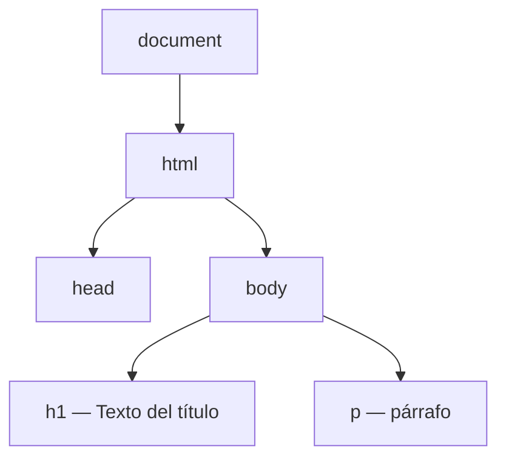
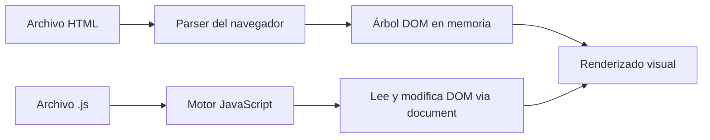
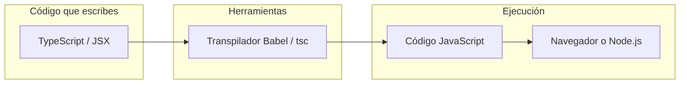

## Conceptos clave

- **JavaScript (JS):** lenguaje de programación pensado al inicio para dar **comportamiento** a páginas web en el navegador (validar formularios, reaccionar a clics, cambiar contenido sin recargar).
- **ECMAScript:** estándar oficial del lenguaje. Etiquetas como ES2015, ES6 o ES2024 nombran versiones de ese estándar; “JavaScript” es la implementación práctica en motores y navegadores.
- **Características principales:** interpretado (sin compilación obligatoria clásica), tipado dinámico, multiparadigma (funciones, objetos, clases desde ES6), orientado a eventos en el navegador, modelo de un solo hilo con asincronía para no bloquear la interfaz.
- **Ámbitos de uso actuales:** front-end web (DOM, APIs, interactividad), back-end con Node.js, herramientas de desarrollo, scripts de automatización, apps móviles (React Native), videojuegos web (Phaser, Three.js, WebGL).
- **Historia breve:** 1995 en Netscape (Brendan Eich); nombres iniciales Mocha → LiveScript → JavaScript; estandarización como ECMAScript; “guerra de navegadores”; evolución por versiones ES; auge de Node.js y frameworks modernos.
- **Ejecución en el navegador:** el motor JS (V8, SpiderMonkey, etc.) lee y ejecuta el código cuando la página carga o cuando un script se dispara; no modifica el archivo HTML en disco, sino la representación en memoria.
- **DOM (Document Object Model):** árbol de nodos que el navegador construye al parsear HTML — documento, elementos (`<p>`, `<div>`), texto, atributos. Es la estructura **viva** que JavaScript puede recorrer y modificar en tiempo de ejecución.
- **`document`:** objeto global de entrada al DOM en el navegador (p. ej. `document.documentElement` apunta al nodo `<html>`).
- **Consola y DevTools:** herramientas del navegador (F12) para inspeccionar DOM, ver errores, ejecutar JS ad hoc y usar `console.log()` para depurar.
- **JavaScript vs TypeScript:** TypeScript añade tipos estáticos sobre JS; los navegadores no ejecutan TS directamente — un transpilador (Babel, tsc) lo convierte a JavaScript estándar antes de ejecutarse. En ecosistemas como React Native: TS/JSX → JS → framework → capas nativas (Kotlin/Java, Swift).

## Errores comunes

- **Confundir HTML con JavaScript:** HTML define estructura; JS define comportamiento. Editar solo HTML no añade lógica interactiva.
- **Confundir HTML en disco con el DOM:** el archivo `.html` es estático; el DOM es la copia en memoria que puede cambiar sin volver a pedir el archivo al servidor.
- **Olvidar vincular el script al HTML:** sin `<script>` (inline o externo con `src`), el navegador no ejecuta JS — botones y validaciones quedan inertes.
- **Pensar que TypeScript se ejecuta en el navegador:** el motor solo entiende JavaScript; TS debe transpilarse.
- **Usar `console.log` en producción sin limpiar:** deja ruido en consola y puede filtrar datos sensibles; en esta lección es herramienta de aprendizaje, no patrón de producción.
- **Asumir que JS “compila” como C/Java:** es interpretado/JIT; no hay paso de compilación obligatorio para empezar, aunque herramientas modernas pueden optimizar o empaquetar el código.

## Casos reales

### 1. Tienda online: el JavaScript no carga

Un e-commerce despliega una actualización y el archivo `checkout.js` queda con ruta incorrecta en el `<script src="...">`. La página se ve bien (HTML/CSS cargan), pero el carrito no actualiza totales, el botón “Pagar” no responde y no hay validación de tarjeta. Soporte recibe tickets de “la web está rota” aunque el diseño visual es correcto.

**Decisión clave:** verificar en DevTools → pestaña Network/Consola si el script devuelve 404 o hay errores de referencia. Refuerza que **estructura (HTML) ≠ comportamiento (JS)** y que el enlace del script es crítico.

### 2. Panel admin: cambios en HTML que “no se ven”

Un practicante edita el texto de un `<h1>` en el archivo HTML del repositorio, pero en el navegador sigue viendo el título antiguo. Resulta que la app es una SPA: el título se genera con JavaScript que modifica el DOM al cargar. El HTML en disco ya no refleja lo que muestra la pantalla.

**Lección:** el DOM es la fuente de verdad en runtime; inspeccionar con DevTools → Elements muestra el árbol vivo, no solo el archivo fuente.

## Ejemplos de código sugeridos

### Entrada al DOM desde la consola

```javascript
// Ejecutar en DevTools → Console con cualquier página abierta
console.log(document.documentElement.tagName); // "HTML"
console.log(document.body.children.length);     // nº de hijos directos de body
```

### Primer contacto con console.log

```javascript
console.log("Hola desde JavaScript");
console.log(2 + 2);
console.log({ curso: "PBPEW", leccion: 1 });
```

### Conceptual: HTML estático vs DOM modificado (preview lección 10)

```javascript
// Tras cargar una página con <p id="saludo">Hola</p>
const parrafo = document.getElementById("saludo");
console.log(parrafo.textContent);  // "Hola"
parrafo.textContent = "Hola, DOM modificado";
// El archivo .html en disco NO cambia; solo el DOM en memoria
```

### Conceptual: cadena TS → JS (mención, no memorizar)

```typescript
// TypeScript (no ejecutable directo en navegador)
function saludar(nombre: string): string {
  return `Hola, ${nombre}`;
}
// Tras transpilar → JavaScript equivalente sin anotaciones de tipo
```

## Ejercicios de práctica

- **tipo:** reflexion — Enumera tres ámbitos donde se usa JavaScript hoy (mínimo: navegador, servidor, uno más: móvil, herramientas, juegos, etc.).
- **tipo:** reflexion — Explica con tus palabras qué gana una página web al poder modificar el DOM (respuesta esperada: interactividad, actualizar UI sin recargar, feedback inmediato al usuario).
- **tipo:** reflexion — ¿Por qué TypeScript suele convertirse a JavaScript antes de ejecutarse? (respuesta esperada: navegadores y muchos runtimes solo ejecutan JS; TS añade tipos en tiempo de desarrollo).
- **tipo:** codigo — Abre DevTools en cualquier sitio, ejecuta `console.log(document.title)` y anota qué imprime.
- **tipo:** diagrama — Dado un HTML mínimo (`html > head + body > h1 + p`), dibuja o etiqueta el árbol DOM indicando documento, elementos y nodos de texto.
- **tipo:** ordenar-pasos — Ordena: (a) motor JS ejecuta scripts, (b) navegador parsea HTML, (c) se construye el árbol DOM, (d) usuario ve la página renderizada, (e) JS puede leer/modificar nodos vía `document`.
- **tipo:** completar-codigo — Completa: `console.___("El tag raíz es:", document.documentElement._____);` → `log`, `tagName`.

## Animación o visual sugerida

- **StepReveal — línea temporal JS:** 1995 Netscape/Mocha → LiveScript → JavaScript → ECMAScript (1997) → ES5/ES6 hitos → Node.js (2009) → frameworks modernos. Un paso por década/hito clave.
- **CompareTable — roles en la web:**

  | Capa | Responsabilidad | Ejemplo |
  |------|-----------------|---------|
  | HTML | Estructura | `<form>`, `<button>` |
  | CSS | Presentación | colores, layout |
  | JavaScript | Comportamiento | validar, reaccionar al clic |
  | DOM | Puente en memoria | árbol que JS manipula |

- **MermaidDiagram — árbol DOM:** reutilizar diagrama de `QueEsElDomSection` (document → html → head/body → hijos).
- **MermaidDiagram — TS/JSX → nativo:** flujo de `ParaQueSeUsaSection` (TypeScript/JSX → transpilador → JS → React Native → Android/iOS).

## Diagrama Mermaid (si aplica)

### Árbol DOM (HTML mínimo)



### Flujo navegador: carga → DOM → JS



### Transpilación TypeScript → JavaScript



## Reto integrador

**“Diagnóstico de página rota”**

Te llega este reporte de un compañero:

> “Cambié el `<h1>` en `index.html` pero el título no cambia. Además el botón Agregar no hace nada. Uso TypeScript en el proyecto.”

En 6–8 líneas (o lista numerada), explica:

1. Qué es el DOM y por qué editar HTML en disco puede no coincidir con lo visible.
2. Dónde se ejecuta el JS de esa app (navegador) y qué herramienta usarías para investigar (DevTools: Elements, Console, Network).
3. Dos comprobaciones concretas (¿carga el `.js`? ¿hay errores en consola?).
4. Por qué TypeScript implica un paso extra antes de que el navegador ejecute código.

**Criterio de éxito:** distingue HTML fuente vs DOM vivo, nombra DevTools/console, menciona transpilación TS→JS, propone verificar carga del script.

## Preguntas sugeridas para quiz (5)

1. **¿Qué es el DOM?**
   - A) Un editor de HTML
   - B) La representación en memoria del documento como árbol de nodos
   - C) Un framework de JavaScript
   - D) El archivo CSS de la página
   - **Correcta:** B
   - **Feedback:** El navegador parsea HTML y construye el DOM; JavaScript lo manipula en runtime. No es el archivo en disco ni un framework.

2. **¿Dónde se ejecuta principalmente el JavaScript en este curso PBPEW?**
   - A) Solo en el servidor
   - B) En el navegador del usuario
   - C) En la base de datos
   - D) En el compilador de TypeScript
   - **Correcta:** B
   - **Feedback:** PBPEW empieza por JS en el navegador (DOM, consola). Node.js y otros entornos se mencionan como contexto, pero el foco inicial es el cliente.

3. **¿Qué herramienta del navegador usas para ver errores y probar `console.log`?**
   - A) DevTools → Consola
   - B) Bloc de notas
   - C) Git
   - D) El inspector de red únicamente
   - **Correcta:** A
   - **Feedback:** F12 abre DevTools; la pestaña Consola muestra logs y errores. Network ayuda a ver si cargan scripts, pero la consola es la herramienta de depuración directa.

4. **¿Qué etiqueta HTML incluye un archivo JavaScript externo?**
   - A) `<link>`
   - B) `<script src="...">`
   - C) `<js>`
   - D) `<style>`
   - **Correcta:** B
   - **Feedback:** `<script src="ruta.js">` vincula JS externo. `<link>` es para CSS; sin script el navegador no ejecuta tu código.

5. **¿Qué hace `console.log("Hola")`?**
   - A) Cambia el título de la pestaña del navegador
   - B) Escribe "Hola" en la consola de DevTools
   - C) Inserta "Hola" en el DOM automáticamente
   - D) Compila TypeScript a JavaScript
   - **Correcta:** B
   - **Feedback:** `console.log` envía salida a la consola para depurar; no modifica el DOM ni compila TS.

## Referencias

- Contenido TSX migrado: `src/components/teaching/lessons/pbpew/01-intro-js-y-dom/`
- Legacy (insumo): `kb/archive/legacy-pages/teaching/pbpew/01-intro-js-y-dom.html`
- MDN — Introducción a JavaScript: https://developer.mozilla.org/es/docs/Web/JavaScript/Guide/Introduction
- MDN — Introducción al DOM: https://developer.mozilla.org/es/docs/Web/API/Document_Object_Model/Introduction
- MDN — Consola de Firefox/Chrome (Console API): https://developer.mozilla.org/es/docs/Web/API/console
- ECMA-262 (ECMAScript): https://tc39.es/ecma262/
- Lección siguiente relacionada: `02-js-en-html` (vincular scripts, inline vs externo)
