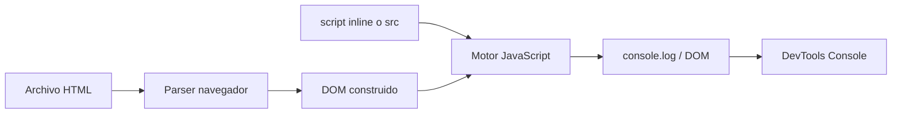
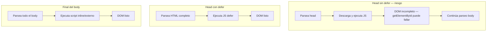
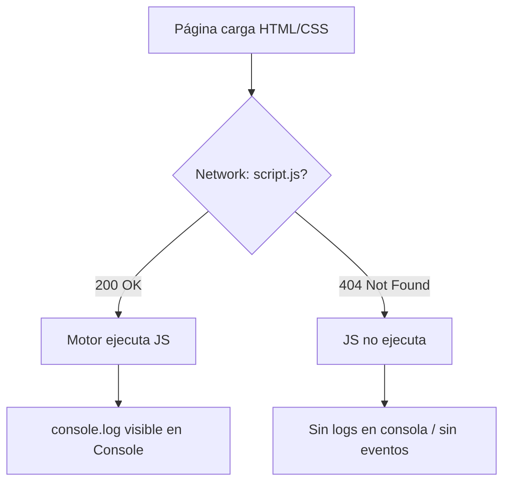

## Conceptos clave

- **Vincular JavaScript al HTML:** el navegador solo ejecuta JS si está incluido con `<script>` (código inline entre etiquetas) o `<script src="ruta.js">` (archivo externo).
- **JavaScript inline:** código escrito directamente en el HTML — entre `<script>...</script>` o en atributos de evento (`onclick`, `onload`, etc.). Útil para pruebas rápidas; en proyectos reales se usa con moderación.
- **JavaScript externo:** código en un archivo `.js` separado, enlazado con `src`. Ventajas: reutilización, caché del navegador, HTML más limpio, equipos pueden trabajar archivos distintos.
- **Ubicación del `<script>`:** el navegador parsea HTML de arriba abajo. Un script sin `defer`/`async` en el `<head>` **bloquea** el parseo hasta descargarlo y ejecutarlo; si el script usa el DOM antes de que exista, falla.
- **Script al final del `<body>` (patrón clásico):** cuando el script se ejecuta, el DOM ya está construido; no necesita `defer` para acceder a elementos del body.
- **`defer` en `<head>`:** descarga el script en paralelo mientras parsea HTML; ejecuta el script **después** de parsear todo el documento, en orden de aparición. Recomendado para JS externo que manipula DOM.
- **`async` en `<script>`:** descarga en paralelo y ejecuta **en cuanto termina la descarga**, sin esperar al parseo completo ni garantizar orden entre varios scripts async. Útil para analytics o widgets independientes del DOM inicial.
- **`console.log()`:** primera herramienta de salida y depuración; escribe en la consola de DevTools (F12), no modifica la página visible.
- **Consola de DevTools:** pestaña Console muestra logs, warnings, errores y permite ejecutar JS ad hoc. Network ayuda a confirmar si un `.js` cargó (200) o falló (404).
- **Otros métodos de consola:** `console.info` (informativo), `console.warn` (advertencia), `console.error` (error con traza), `console.table` (datos tabulares), `console.time` / `console.timeEnd` (medir duración).
- **Comentarios en JS:** `//` una línea, `/* ... */` varias líneas. Documentan el *por qué*, no lo obvio; el motor los ignora al ejecutar.
- **Rutas relativas en `src`:** `./js/app.js`, `js/app.js` o `/assets/app.js` dependen de la carpeta del HTML y la estructura del proyecto; una ruta mal escrita impide cargar el script (404).

## Errores comunes

- **Olvidar cerrar `<script>` o usar comillas mal en `src`:** el HTML queda roto o el navegador no encuentra el archivo.
- **Ruta incorrecta en `src`:** `script src="app.js"` cuando el archivo está en `js/app.js` → Network muestra 404; la página se ve bien pero el comportamiento no aparece.
- **Script en `<head>` sin `defer` que usa el DOM:** `document.getElementById("btn")` devuelve `null` porque el elemento aún no existe al ejecutarse el script.
- **Confundir `defer` con `async`:** `async` no garantiza orden ni espera al DOM; usar `async` para código que depende de nodos del body suele fallar.
- **Mezclar inline y externo sin entender el orden:** varios `<script>` se ejecutan en orden de aparición (salvo `async`); dependencias mal ordenadas producen `ReferenceError`.
- **Pensar que `console.log` cambia la página:** solo imprime en consola; para modificar la UI hay que tocar el DOM (p. ej. `document.body.innerHTML`).
- **Dejar `console.log` con datos sensibles:** en aprendizaje está bien; en producción puede filtrar información a quien abra DevTools.
- **Usar `<link>` en lugar de `<script>` para JS:** `<link>` es para CSS; JavaScript externo siempre va en `<script src="...">`.

## Casos reales

### 1. Landing corporativa: script en el head sin defer

Un desarrollador junior coloca en el `<head>`:

```html
<script src="main.js"></script>
```

`main.js` contiene `document.querySelector("#cta").addEventListener("click", ...)`. En producción el botón CTA no responde y la consola muestra error de `null` al intentar `.addEventListener`. El HTML y el CSS cargan perfectamente; solo falla el comportamiento.

**Decisión clave:** mover el script al final del `<body>` **o** añadir `defer` en el `<head>`. Refuerza que la **ubicación** del script determina si el DOM ya existe cuando corre el código.

### 2. Deploy en subcarpeta: 404 silencioso en el JS

Un equipo publica la web en `https://empresa.com/producto/` pero el HTML referencia `<script src="/js/analytics.js">` (ruta absoluta desde raíz del dominio). El archivo real está en `/producto/js/analytics.js`. Network muestra 404 para `analytics.js`; métricas y eventos de clic no se registran. Diseño intacto, negocio pierde datos.

**Lección:** verificar rutas relativas vs absolutas tras cada deploy; DevTools → Network filtra por JS y muestra estado HTTP. Sin script cargado, no hay ejecución aunque el enlace parezca “correcto” en local.

## Ejemplos de código sugeridos

### Hola mundo inline

```html
<!doctype html>
<html lang="es">
  <head>
    <meta charset="utf-8" />
    <title>Mi primera página JS</title>
  </head>
  <body>
    <h1>JavaScript en HTML</h1>
    <script>
      console.log("Hola mundo");
    </script>
  </body>
</html>
```

### JavaScript externo + defer en head

```html
<head>
  <meta charset="utf-8" />
  <title>Ejemplo defer</title>
  <script src="js/app.js" defer></script>
</head>
<body>
  <p id="msg">Hola</p>
</body>
```

```javascript
// js/app.js — se ejecuta tras parsear el HTML gracias a defer
console.log("Script externo cargado");
console.log(document.getElementById("msg").textContent); // "Hola"
```

### Script al final del body (inline)

```html
<body>
  <p id="msg">Hola</p>
  <script>
    console.log("Script al final del body");
    document.getElementById("msg").textContent = "Hola desde JS";
  </script>
</body>
```

### Métodos de consola

```javascript
console.log("Paso 1: inicio");
console.info("Información para el desarrollador");
console.warn("Cuidado: valor límite alcanzado");
console.error("Algo falló — revisa la traza");

console.table([
  { nombre: "Ana", nota: 5 },
  { nombre: "Luis", nota: 4.5 },
]);

console.time("bucle");
for (let i = 0; i < 1e6; i++) {}
console.timeEnd("bucle");
```

### Comentarios

```javascript
// Comentario de una línea: explica el propósito del bloque siguiente

/*
  Comentario multilínea:
  documentamos una decisión de diseño temporal
*/

const MAX_INTENTOS = 3; // límite acordado con negocio, no un número mágico
console.log(MAX_INTENTOS);
```

### Comparación defer vs async (conceptual)

```html
<!-- defer: espera al DOM, orden preservado -->
<script src="a.js" defer></script>
<script src="b.js" defer></script>

<!-- async: ejecuta en cuanto descarga; orden no garantizado -->
<script src="analytics.js" async></script>
```

## Ejercicios de práctica

- **tipo:** reflexion — ¿Cuándo preferirías JS externo sobre inline? (respuesta esperada: proyectos medianos/grandes, reutilización, caché, separación de responsabilidades, mantenimiento).
- **tipo:** reflexion — ¿Por qué poner un script al final del `<body>` evita errores al acceder al DOM? (respuesta esperada: el HTML ya fue parseado y los nodos existen cuando corre el script).
- **tipo:** codigo — Crea `index.html` con un `<script>` inline que imprima `console.log("Hola, PBPEW")`. Abre el archivo en el navegador y verifica el mensaje en DevTools → Console.
- **tipo:** codigo — Extrae el JS a `saludo.js` con el mismo `console.log` y enlázalo con `<script src="saludo.js" defer></script>` en el `<head>`. Confirma que funciona igual.
- **tipo:** completar-codigo — Completa el HTML: `<script _____="js/main.js" _____></script>` en el head para cargar externo sin bloquear el parseo → `src`, `defer`.
- **tipo:** ordenar-pasos — Ordena el flujo con script `defer` en head: (a) se ejecuta el JS, (b) navegador descarga HTML, (c) parseo completo del DOM, (d) descarga paralela del .js, (e) renderizado inicial. → b → d → c → a → e (descarga paralela durante parseo; ejecución tras parseo).
- **tipo:** diagrama — Dibuja dos columnas: script en head sin defer vs script al final del body; indica en qué momento existe `#msg` cuando corre el JS.
- **tipo:** reflexion — Abre DevTools → Network, recarga con un `src` incorrecto a propósito y describe qué ves (404, script no ejecutado, página estática sin comportamiento).

## Animación o visual sugerida

- **CompareTable — inline vs externo:**

  | Aspecto | Inline | Externo (`src`) |
  |---------|--------|-----------------|
  | Ubicación | Dentro del HTML | Archivo `.js` aparte |
  | Caché | No separado | Sí, reutilizable entre páginas |
  | Mantenimiento | Mezclado con markup | HTML y JS separados |
  | Uso típico | Prototipos, snippets | Proyectos reales |

- **CompareTable — defer vs async vs final del body:**

  | Estrategia | ¿Bloquea parseo? | ¿Espera al DOM? | Orden entre scripts |
  |------------|------------------|-----------------|---------------------|
  | Head sin atributos | Sí | No | Sí |
  | `defer` | No (descarga paralela) | Sí | Sí |
  | `async` | No | No | No garantizado |
  | Final del body | Solo al llegar ahí | Sí | Sí |

- **StepReveal — flujo “desde HTML hasta consola”:** (1) escribes HTML + script, (2) navegador parsea, (3) descarga/ejecuta JS, (4) `console.log` envía salida, (5) DevTools Console la muestra. Un paso por slide.
- **MermaidDiagram — decisión de ubicación del script:** árbol de decisión head/body/defer/async (ver sección Diagrama Mermaid).

## Diagrama Mermaid (si aplica)

### Flujo: HTML → script → consola



### Script en head sin defer vs defer vs final body



### Diagnóstico 404 en script externo



## Reto integrador

**“Arregla la página del evento”**

Te entregan este fragmento roto:

```html
<!doctype html>
<html lang="es">
  <head>
    <script src="scripts/main.js"></script>
  </head>
  <body>
    <button id="registro">Inscribirme</button>
    <script src="/js/contador.js"></script>
  </body>
</html>
```

`main.js` (ruta real: `js/main.js`) hace `document.getElementById("registro").addEventListener(...)`. `contador.js` existe en `js/contador.js` junto al HTML. En local la página se ve bien pero el botón no responde y Network muestra un 404.

En 8–10 líneas (lista numerada), entrega:

1. Dos errores concretos (ruta + ubicación del script).
2. Dos correcciones propuestas (ruta correcta + `defer` o mover script).
3. Qué comprobarías en DevTools (Console + Network).
4. Un `console.log` de prueba que añadirías para confirmar que `main.js` cargó.

**Criterio de éxito:** identifica 404 por ruta incorrecta, explica DOM no listo en head sin defer, propone `src="js/main.js" defer` o script al final del body, menciona verificación en Network/Console.

## Preguntas sugeridas para quiz (5)

1. **¿Qué atributo enlaza un archivo JavaScript externo?**
   - A) `href`
   - B) `src`
   - C) `link`
   - D) `code`
   - **Correcta:** B
   - **Feedback:** `<script src="archivo.js">` carga JS externo. `href` pertenece a `<a>` y `<link>` (CSS).

2. **¿Qué hace `defer` en un `<script src="...">` del `<head>`?**
   - A) Ejecuta el script antes de descargar el HTML
   - B) Descarga en paralelo y ejecuta tras parsear todo el HTML
   - C) Impide que el script se cachee
   - D) Convierte inline en externo
   - **Correcta:** B
   - **Feedback:** `defer` no bloquea el parseo y respeta el orden; el DOM suele estar listo al ejecutarse.

3. **¿Dónde aparece la salida de `console.log("Hola")`?**
   - A) En el título de la pestaña
   - B) En la consola de DevTools
   - C) Automáticamente dentro del `<body>`
   - D) En el archivo HTML en disco
   - **Correcta:** B
   - **Feedback:** `console.log` es salida de depuración en DevTools; no modifica el DOM ni el archivo fuente.

4. **Network muestra 404 para `app.js`. ¿Qué ocurre con ese script?**
   - A) El navegador lo ejecuta igual con código vacío
   - B) No se ejecuta; el comportamiento asociado no aparece
   - C) Se reemplaza automáticamente por inline
   - D) Solo falla en Firefox
   - **Correcta:** B
   - **Feedback:** Sin archivo válido no hay ejecución. La página puede verse bien (HTML/CSS) pero el JS vinculado no corre.

5. **¿Cuál es la forma recomendada de comentar una sola línea en JavaScript?**
   - A) `<!-- comentario -->`
   - B) `# comentario`
   - C) `// comentario`
   - D) `:: comentario`
   - **Correcta:** C
   - **Feedback:** `//` es comentario de línea en JS. `<!-- -->` es HTML; `#` no es comentario estándar en JS.

## Referencias

- Contenido TSX migrado: `src/components/teaching/lessons/pbpew/02-js-en-html/`
- Legacy (insumo): `kb/archive/legacy-pages/teaching/pbpew/02-js-en-html.html`
- Lección previa: `01-intro-js-y-dom` (DOM, consola introductoria)
- Lección siguiente: `03-variables-y-tipos` (variables, tipos primitivos)
- MDN — `<script>`: https://developer.mozilla.org/es/docs/Web/HTML/Element/script
- MDN — Atributos async y defer: https://developer.mozilla.org/es/docs/Web/HTML/Element/script#async
- MDN — Console API: https://developer.mozilla.org/es/docs/Web/API/console
- MDN — Comentarios en JavaScript: https://developer.mozilla.org/es/docs/Web/JavaScript/Reference/Lexical_grammar#comentarios
- MDN — Depuración en el navegador: https://developer.mozilla.org/es/docs/Learn_web_development/Core/Scripting/What_is_JavaScript#depuraci%C3%B3n
