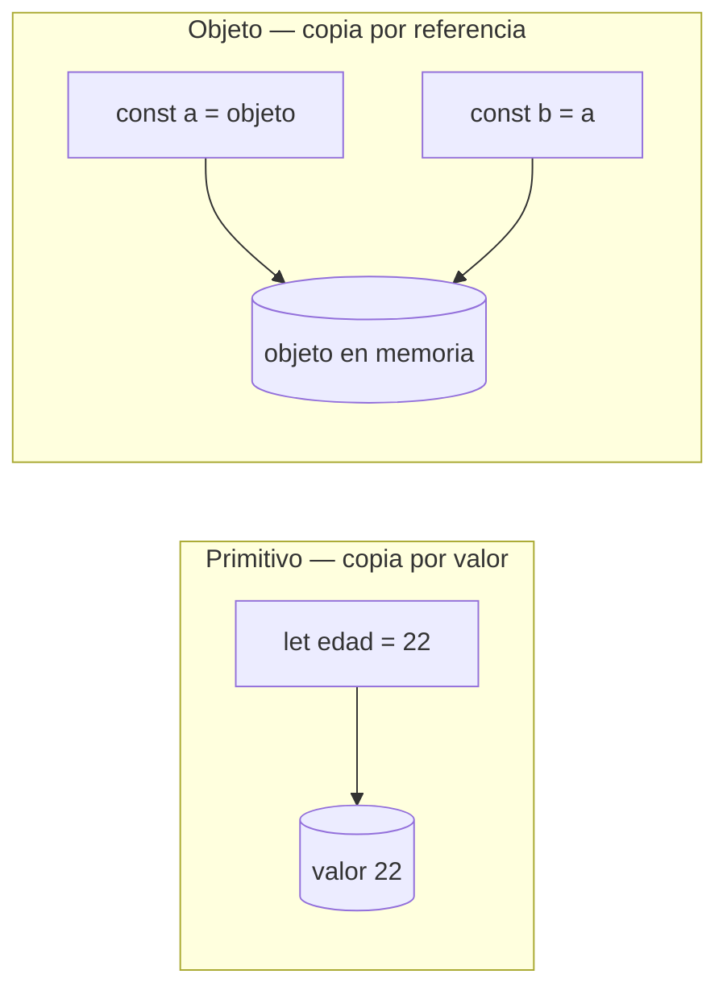
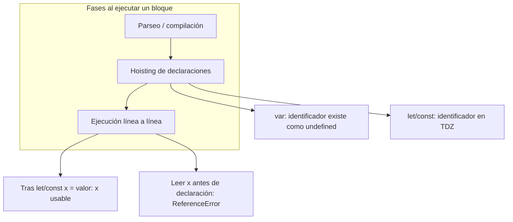
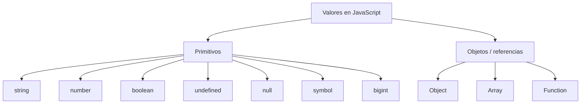

## Conceptos clave

- **Variable:** nombre (identificador) que el programa asocia a un valor en memoria. Permite guardar datos que cambian (contador, texto del usuario) o referencias a configuración estable.
- **Declaración vs asignación:** `let x;` declara el enlace; `x = 5;` asigna un valor. Con `const` la declaración debe incluir inicialización: `const PI = 3.14;`.
- **`let`:** variable reasignable; alcance de **bloque** (`{}`). Es la opción cuando el valor cambiará (contadores, acumuladores, estado temporal).
- **`const`:** enlace constante — no puedes **reasignar** la variable a otro valor. Si el valor es un objeto o array, sí puedes **mutar** sus propiedades o elementos; lo que no cambia es la referencia guardada en la variable.
- **`var`:** estilo legacy (pre-ES6); alcance de **función** (o global si está fuera de función); ignora bloques `if`/`for`. Puede sorprender en bucles y redeclaraciones. En código nuevo: preferir `let`/`const`.
- **Regla práctica:** `const` por defecto; `let` solo cuando necesites reasignar; evitar `var` en código nuevo.
- **Hoisting (“elevación”):** antes de ejecutar el código, el motor procesa las declaraciones. Con `var`, la declaración se eleva al inicio de su función y queda inicializada como `undefined`. Con `let` y `const` también hay hoisting, pero entran en la **zona muerta temporal (TDZ)**: no puedes leerlas antes de la línea de declaración → `ReferenceError`.
- **Tipado dinámico:** JavaScript no exige declarar el tipo al crear una variable; el tipo lo determina el **valor** en runtime. Una misma variable puede apuntar a distintos tipos si reasignas (solo con `let`).
- **Tipos primitivos (7 en ES2024):** `string`, `number`, `boolean`, `undefined`, `null`, `symbol`, `bigint`. Se copian por valor al asignar o pasar como argumento.
- **`string`:** texto entre comillas (`"hola"`, `'mundo'`). Ejemplo real: nombre de usuario, mensaje de error.
- **`number`:** enteros y decimales (IEEE 754). Incluye `Infinity`, `-Infinity` y `NaN` (Not a Number). Ejemplo: precio, edad, coordenada.
- **`boolean`:** `true` o `false`. Ejemplo: “¿aceptó términos?”, “¿formulario válido?”.
- **`undefined`:** valor por defecto de una variable declarada sin asignar; también retorno implícito de función sin `return`.
- **`null`:** “vacío intencional” — el programador indica ausencia deliberada de valor (p. ej. “sin usuario activo”).
- **`symbol`:** identificador único e inmutable (ES6). Uso avanzado: claves de propiedades que no colisionan. En PBPEW: reconocerlo con `typeof` y saber que existe.
- **`bigint`:** enteros arbitrariamente grandes (`123n`). Útil en IDs o cálculos que exceden `Number.MAX_SAFE_INTEGER`. No mezclar con `number` sin conversión explícita.
- **Objetos (tipo referencia):** `{}`, arrays `[]`, funciones, instancias de `Date`, etc. Al asignar o pasar un objeto, se copia la **referencia** (apuntan al mismo dato en memoria), no un clon.
- **`typeof`:** operador unario que devuelve un string con el tipo aparente: `"string"`, `"number"`, `"boolean"`, `"undefined"`, `"object"`, `"function"`, `"symbol"`, `"bigint"`. Peculiaridad histórica: `typeof null === "object"`.
- **Coerción de tipos (básico):** JavaScript convierte valores entre tipos en contextos como concatenación (`"5" + 1` → `"51"`) o comparaciones sueltas (`==`). En la lección 4 profundizarás operadores; aquí basta reconocer que el tipo importa y que `===` evita sorpresas (preview).

## Errores comunes

- **Reasignar una `const`:** `const x = 1; x = 2;` → `TypeError`. Confundir “constante” con “inmutable en profundidad”.
- **Mutar vs reasignar con `const`:** `const usuario = { nombre: "Ana" }; usuario.nombre = "Luis";` es válido; `usuario = {}` no lo es.
- **Usar una variable antes de declararla con `let`/`const`:** `console.log(b); let b = 10;` → `ReferenceError` (TDZ), no `undefined`.
- **Asumir que `var` respeta bloques:** `for (var i = 0; i < 3; i++) {} console.log(i);` imprime `3` — `i` existe fuera del bucle.
- **Confundir `null` y `undefined`:** `undefined` = “no se asignó”; `null` = “asigné vacío a propósito”. Comparar con `===` para distinguirlos.
- **Confiar en `typeof null`:** devuelve `"object"`; para comprobar null usar `valor === null`.
- **Olvidar que objetos se comparten por referencia:** `const a = { n: 1 }; const b = a; b.n = 2;` → `a.n` también es `2`.
- **Coerción accidental en sumas:** `"10" + 5` concatena (`"105"`), no suma `15`. Usar `Number("10")` o `parseInt` cuando el dato viene de un input HTML como string.
- **Declarar sin `let`/`const`/`var` en modo estricto:** asignar a variable no declarada en sloppy mode crea global; en `"use strict"` lanza error. Siempre declarar explícitamente.
- **Nombres reservados o inválidos:** no empezar con número (`2pac`), evitar palabras reservadas (`class`, `return`).

## Casos reales

### 1. Checkout e-commerce: total incorrecto por coerción

Un formulario envía la cantidad como string desde un `<input type="text">`. El desarrollador escribe:

```javascript
const precio = 29.99;
const cantidad = formulario.cantidad.value; // "3" (string)
const total = precio + cantidad;
```

En pantalla aparece `29.993` en lugar de `89.97`. Soporte recibe quejas de “cobro raro”. La causa: `number + string` concatena.

**Decisión clave:** convertir explícitamente (`Number(cantidad)` o `parseInt(cantidad, 10)`), validar con `typeof` o `Number.isNaN`, y mostrar error si no es numérico. Refuerza tipado dinámico y coerción.

### 2. Panel de configuración: `const` mal entendida

Un equipo define `const CONFIG = { apiUrl: "https://v1.api.com" };`. En un hotfix alguien escribe `CONFIG = { apiUrl: "https://v2.api.com" };` → falla en CI. Otro dev muta `CONFIG.apiUrl = "https://v2.api.com"` y el despliegue “funciona”, pero documentación dice que CONFIG es inmutable — genera confusión en code review.

**Lección:** `const` protege la **referencia**, no un clon profundo del objeto. Para configuración que no debe mutar, usar `Object.freeze()` (tema avanzado) o patrones de solo lectura; al menos documentar si la mutación es intencional.

## Ejemplos de código sugeridos

### Declaración básica: let y const

```javascript
let contador = 0;
contador = contador + 1;

const URL_API = "https://api.ejemplo.com";
// URL_API = "otro"; // TypeError: Assignment to constant variable
```

### const con objeto: mutación válida

```javascript
const usuario = { nombre: "Ana", activo: true };
usuario.nombre = "Luis";   // válido: mutación de propiedad
usuario.activo = false;    // válido
// usuario = { nombre: "Pedro" }; // TypeError: reasignación prohibida
```

### var vs let: alcance de bloque

```javascript
if (true) {
  var xVar = 1;
  let xLet = 2;
}
console.log(xVar); // 1 — var ignora el bloque
// console.log(xLet); // ReferenceError — let respeta el bloque
```

### Hoisting con var (undefined, no error)

```javascript
console.log(a); // undefined (declaración elevada, aún no asignada)
var a = 5;
console.log(a); // 5
```

### Hoisting con let (zona muerta temporal)

```javascript
try {
  console.log(b);
} catch (e) {
  console.error(e.name); // "ReferenceError"
}
let b = 10;
```

### Tipos primitivos y typeof

```javascript
const nombre = "María";
const edad = 22;
const aprobado = true;
let nota;                    // undefined
const sesion = null;         // null intencional
const id = Symbol("id");     // symbol
const grande = 9007199254740991n; // bigint

console.log(typeof nombre);   // "string"
console.log(typeof edad);     // "number"
console.log(typeof aprobado); // "boolean"
console.log(typeof nota);     // "undefined"
console.log(typeof sesion);   // "object" (peculiaridad con null)
console.log(typeof id);       // "symbol"
console.log(typeof grande);   // "bigint"
```

### Objetos por referencia

```javascript
const original = { puntos: 10 };
const copiaReferencia = original;
copiaReferencia.puntos = 99;

console.log(original.puntos);       // 99 — mismo objeto en memoria
console.log(copiaReferencia === original); // true
```

### Coerción básica (preview lección 04)

```javascript
console.log("5" + 1);    // "51" — concatenación
console.log("5" - 1);    // 4 — resta fuerza número
console.log(5 == "5");   // true — coerción con ==
console.log(5 === "5");  // false — sin coerción, tipos distintos
```

## Ejercicios de práctica

- **tipo:** reflexion — Explica con tus palabras por qué se recomienda `const` por defecto y `let` solo cuando hace falta reasignar.
- **tipo:** reflexion — ¿Cuál es la diferencia entre `undefined` y `null`? Da un ejemplo de cuándo usarías cada uno en una app web.
- **tipo:** codigo — Declara `let intentos = 0`, incrementa dos veces y muestra el resultado con `console.log`. Luego declara `const MAX_INTENTOS = 3` e intenta reasignarla; anota el error.
- **tipo:** codigo — Crea `const producto = { nombre: "Teclado", stock: 5 }`, muta `stock` a `3` y verifica que funciona. Intenta `producto = {}` y describe el error.
- **tipo:** completar-codigo — Completa para inspeccionar tipos: `console.log(typeof ___, typeof ___, typeof ___);` usando variables `mensaje` (string), `activo` (boolean) y `sinValor` (declarada sin asignar).
- **tipo:** diagrama — Dibuja dos cajas “variable” y “valor en memoria” para `let n = 42` y otro diagrama para `const ref = { id: 1 }` mostrando que la variable apunta al objeto, no contiene el objeto “dentro”.
- **tipo:** ordenar-pasos — Ordena la fase de hoisting con `let`: (a) motor entra en TDZ para `x`, (b) se ejecuta `let x = 10`, (c) lectura de `x` antes de su línea lanza ReferenceError, (d) tras la línea de declaración, `x` es legible.
- **tipo:** codigo — Predice y luego ejecuta en consola: `const a = { n: 1 }; const b = a; b.n = 2; console.log(a.n);` — explica el resultado usando “referencia”.

## Animación o visual sugerida

- **StepReveal — ciclo de vida de una variable:**
  1. Declaración (`let`/`const`) — el motor registra el identificador.
  2. Fase de hoisting — `var` → `undefined`; `let`/`const` → TDZ.
  3. Inicialización — se asigna el valor en la línea de código.
  4. Uso — lectura, reasignación (`let` sí, `const` no).
  5. Fin de alcance — al salir del bloque, el enlace deja de existir (`let`/`const`).

- **CompareTable — var vs let vs const:**

  | Palabra | Reasignar | Redeclarar en mismo ámbito | Alcance | Hoisting inicial |
  |---------|-----------|----------------------------|---------|------------------|
  | `var` | Sí | Sí | Función | `undefined` |
  | `let` | Sí | No | Bloque | TDZ (error si accedes) |
  | `const` | No | No | Bloque | TDZ (error si accedes) |

- **MermaidDiagram — variable primitiva vs referencia:** ver sección Diagrama Mermaid.

- **StepReveal — typeof en consola:** mostrar una línea de código y el string que devuelve `typeof` para cada primitivo, incluyendo la peculiaridad de `null`.

## Diagrama Mermaid (si aplica)

### Primitivo vs objeto (referencia)



### Hoisting: var vs let



### Tipos primitivos (panorama)



## Reto integrador

**“Depurar el módulo de perfil”**

Te pasan este fragmento de un script vinculado al final del `<body>` (lección 02). El QA reporta: contador de visitas siempre `0`, nombre de usuario no actualiza y a veces aparece `undefined` en pantalla.

```javascript
var visitas = 0;
const perfil = { nombre: "Invitado", nivel: 1 };

function registrarVisita() {
  visitas = visitas + 1;
  if (visitas > 5) {
    let visitas = visitas; // intención: “guardar copia” — bug
    console.log("Visitas en bloque:", visitas);
  }
  return visitas;
}

function cambiarNombre(nuevoNombre) {
  perfil = { nombre: nuevoNombre, nivel: perfil.nivel };
}

let usuarioActivo = null;
function obtenerSaludo() {
  if (usuarioActivo) {
    return "Hola, " + usuarioActivo.nombre;
  }
  return "Hola, " + perfil.nombre;
}

// Simulación desde consola
registrarVisita();
registrarVisita();
cambiarNombre("Laura");
console.log(obtenerSaludo());
console.log(typeof usuarioActivo, typeof perfil.nivel);
```

**Tareas:**

1. Identifica al menos **tres errores o malas prácticas** (hoisting/`var`, sombreado con `let`, reasignación de `const`, `null` vs objeto, coerción, etc.).
2. Propón correcciones concretas usando `let`/`const` adecuados y mutación de `perfil` en lugar de reasignar.
3. Escribe qué imprimiría `typeof` para `usuarioActivo` y `perfil.nivel` y qué valor debería mostrar `registrarVisita()` tras dos llamadas.
4. Añade una validación: si `nuevoNombre` es string vacío, no mutar y usar `console.warn`.

**Criterio de éxito:** distingue referencia vs reasignación, corrige sombreado en el `if`, explica TDZ/hoisting donde aplique, usa `typeof`/`=== null` correctamente, y el contador global llega a `2` tras dos llamadas.

## Preguntas sugeridas para quiz (5)

1. **¿Cuál es la forma recomendada de declarar una URL de API que no cambiará?**
   - A) `var URL_API = "..."`
   - B) `let URL_API = "..."`
   - C) `const URL_API = "..."`
   - D) `URL_API = "..."` sin declarar
   - **Correcta:** C
   - **Feedback:** `const` indica que no reasignarás el enlace; es el default para valores estables. Sin declarar es mala práctica y falla en modo estricto.

2. **¿Qué ocurre al ejecutar `console.log(x); let x = 5;`?**
   - A) Imprime `undefined`
   - B) Imprime `5`
   - C) `ReferenceError` por zona muerta temporal
   - D) `SyntaxError`
   - **Correcta:** C
   - **Feedback:** `let` sí tiene hoisting, pero no puedes leer la variable antes de su declaración. No confundir con `var`, que imprimiría `undefined`.

3. **Dado `const lista = [1, 2]; lista.push(3);`, ¿es válido?**
   - A) No, `const` prohíbe cualquier cambio
   - B) Sí, mutar el array está permitido
   - C) Solo si usas `let`
   - D) Solo en modo estricto
   - **Correcta:** B
   - **Feedback:** `const` impide reasignar `lista` a otro array, pero `push` muta el mismo objeto en memoria — eso es válido.

4. **¿Qué devuelve `typeof null`?**
   - A) `"null"`
   - B) `"undefined"`
   - C) `"object"`
   - D) `"number"`
   - **Correcta:** C
   - **Feedback:** Es un bug histórico del lenguaje. Para comprobar null usa `valor === null`, no confíes solo en `typeof`.

5. **Tras `const a = { n: 1 }; const b = a; b.n = 2;`, ¿cuánto vale `a.n`?**
   - A) `1` — son copias independientes
   - B) `2` — comparten la misma referencia
   - C) `undefined`
   - D) Error de ejecución
   - **Correcta:** B
   - **Feedback:** Objetos se asignan por referencia. `a` y `b` apuntan al mismo objeto; mutar vía `b` afecta a `a`.

## Referencias

- Contenido TSX migrado: `src/components/teaching/lessons/pbpew/03-variables-y-tipos/`
- Secciones actuales: `ObjetivosSection`, `QueEsUnaVariableSection`, `VarLetYConstSection`, `TiposDeDatosPrincipalesSection`, `ResumenSection`
- Legacy (insumo): `kb/archive/legacy-pages/teaching/pbpew/03-variables-y-tipos.html`
- MDN — Gramática y tipos: https://developer.mozilla.org/es/docs/Web/JavaScript/Guide/Grammar_and_types
- MDN — `let`: https://developer.mozilla.org/es/docs/Web/JavaScript/Reference/Statements/let
- MDN — `const`: https://developer.mozilla.org/es/docs/Web/JavaScript/Reference/Statements/const
- MDN — `var`: https://developer.mozilla.org/es/docs/Web/JavaScript/Reference/Statements/var
- MDN — Hoisting: https://developer.mozilla.org/es/docs/Glossary/Hoisting
- MDN — `typeof`: https://developer.mozilla.org/es/docs/Web/JavaScript/Reference/Operators/typeof
- MDN — Tipos de datos y estructuras: https://developer.mozilla.org/es/docs/Web/JavaScript/Data_structures
- MDN — Coerción de tipos: https://developer.mozilla.org/es/docs/Glossary/Type_coercion
- Lección anterior: `02-js-en-html` (vincular scripts, consola)
- Lección siguiente: `04-operadores-y-decisiones` (operadores, `===`, decisiones con `if`)
