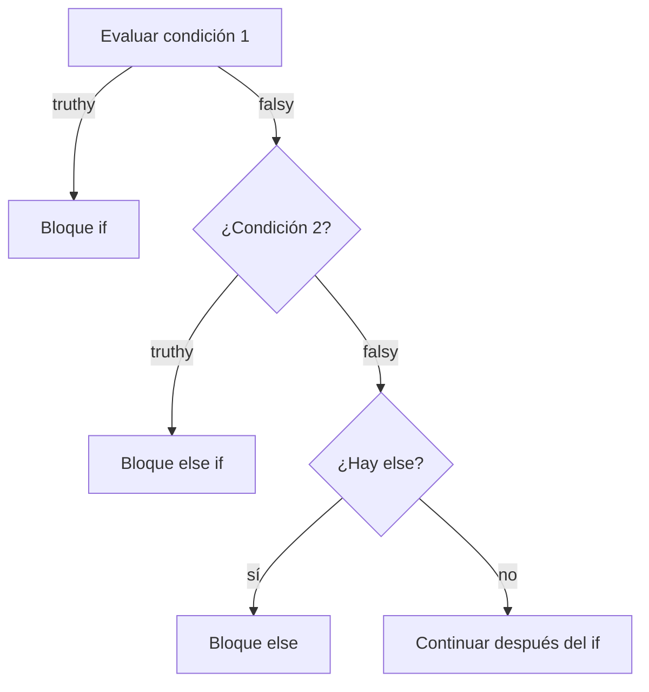
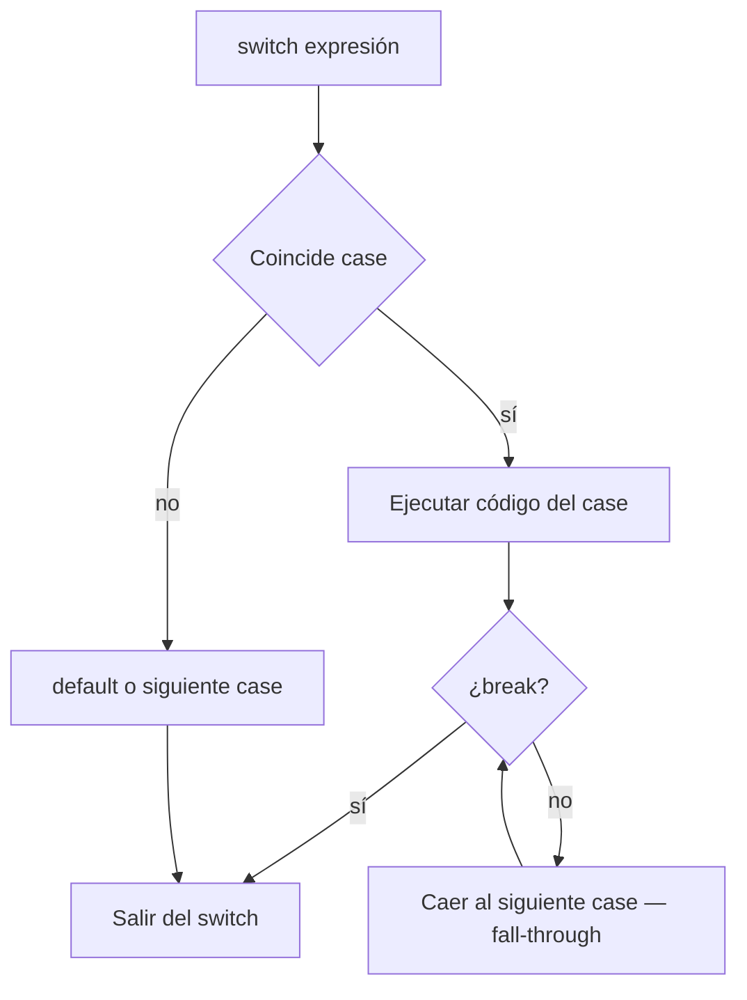
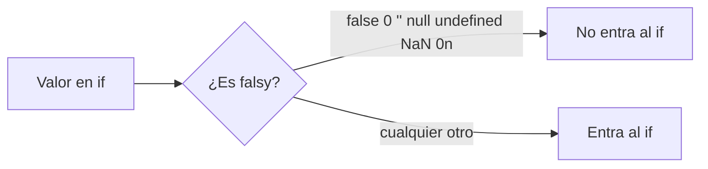
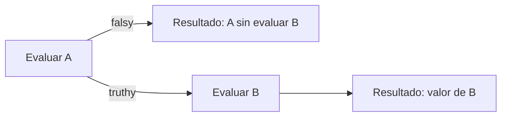

## Conceptos clave

- **Operador:** símbolo o palabra que actúa sobre uno o dos operandos (valores o variables) y produce un resultado. En esta lección: aritméticos, de comparación y lógicos.
- **Operadores aritméticos:** `+` (suma o concatenación si hay string), `-` (resta), `*` (multiplicación), `/` (división), `%` (módulo — resto de la división entera), `**` (potencia, ES2016). Ejemplo: `10 % 3` → `1`; `2 ** 8` → `256`.
- **Precedencia y paréntesis:** `*` y `/` se evalúan antes que `+` y `-` salvo que uses paréntesis: `(2 + 3) * 4` → `20`. Con strings, `+` concatena: `"10" + 5` → `"105"` (coerción — ver lección 03).
- **Operadores de comparación:** devuelven `boolean`. Igualdad estricta `===` y `!==` (valor **y** tipo deben coincidir). Igualdad suelta `==` y `!=` aplican coerción — evitar en código nuevo. Relacionales: `>`, `<`, `>=`, `<=`.
- **Regla PBPEW:** preferir siempre `===` y `!==` salvo que domines la coerción y tengas motivo documentado.
- **Truthy y falsy:** en contextos booleanos (condición de `if`, operadores lógicos), JavaScript convierte valores a “verdadero” o “falso”. **Falsy:** `false`, `0`, `-0`, `0n`, `""`, `null`, `undefined`, `NaN`. Casi todo lo demás es **truthy** (incluye `"0"`, `"false"`, `[]`, `{}`).
- **Operadores lógicos:** `&&` (AND — verdadero solo si ambos operandos son truthy), `||` (OR — verdadero si al menos uno es truthy), `!` (NOT — invierte truthiness a boolean explícito).
- **Cortocircuito (short-circuit):** `&&` deja de evaluar si el izquierdo es falsy; `||` si el izquierdo es truthy. Patrón común: `const nombre = input || "invitado";` — valor por defecto cuando `input` es falsy (`""`, `null`, etc.).
- **Estructura `if`:** ejecuta un bloque solo si la condición es truthy. Sintaxis: `if (condición) { ... }`.
- **`else if`:** prueba condiciones adicionales en orden; la primera que sea truthy gana.
- **`else`:** bloque por defecto cuando ninguna condición anterior fue truthy. Solo puede haber un `else` al final de la cadena.
- **Bloques `{}`:** aunque una sola línea puede ir sin llaves, en PBPEW y producción se recomiendan siempre llaves para evitar bugs al añadir líneas.
- **`switch`:** elige una rama según el **valor** de una expresión (`switch (expresión)`). Cada `case` compara con `===` (igualdad estricta). `break` sale del `switch`; sin `break`, la ejecución **cae** al siguiente `case` (fall-through). `default` cubre valores no listados.
- **Cuándo `if` vs `switch`:** `if` para rangos, condiciones compuestas o pocos casos; `switch` cuando comparas la misma variable contra muchos valores discretos constantes (día de la semana, código de estado, menú numérico).
- **Validación con operadores:** combinar comparación y lógica — p. ej. `edad >= 18 && aceptoTerminos === true`. Usar `Number.isNaN()` tras `Number()` para detectar entradas inválidas (patrón de `IfElseIfElseSection`).

## Errores comunes

- **Usar `==` en lugar de `===`:** `5 == "5"` → `true`; `5 === "5"` → `false`. En formularios y APIs los datos suelen llegar como string — la comparación suelta oculta bugs.
- **Olvidar `break` en `switch`:** sin `break`, se ejecutan todos los `case` siguientes hasta encontrar uno con `break` o el final — descuentos duplicados, mensajes repetidos, lógica imposible de seguir.
- **Confundir `=` con `===` en condiciones:** `if (x = 5)` asigna y el valor asignado es truthy — casi siempre un bug; la condición debe comparar: `if (x === 5)`.
- **Asumir que `!valor` distingue `null` de `undefined`:** ambos son falsy; usa `valor === null` o `valor === undefined` si necesitas precisión.
- **Truthy engañoso:** `if ("0")` entra al bloque porque el string `"0"` es truthy; `if (0)` no. Revisa inputs de `<input>` que llegan como string.
- **Condiciones con `&&` / `||` mal agrupadas:** `a && b || c` puede no ser lo que esperas; usa paréntesis: `(a && b) || c`.
- **No validar antes de comparar rangos:** `const nota = Number(prompt("..."));` sin comprobar `Number.isNaN(nota)` puede hacer que `nota >= 3` sea `false` para `NaN` sin mensaje claro al usuario.
- **`switch` con rangos sin truco:** `switch` no evalúa `case nota >= 3`; para rangos usa `if/else if`. En `switch` cada `case` es un valor concreto (o varios con fall-through intencional).
- **División por cero:** `10 / 0` → `Infinity` (truthy); no lanza error — valida divisor si el dominio lo exige.
- **Modificar la variable del `switch` dentro de un `case` sin `break`:** puede provocar bucles o saltos inesperados; mantén `switch` simple o usa `if`.

## Casos reales

### 1. Login corporativo: sesión “activa” con `==`

Un portal comprueba si el usuario puede entrar al panel:

```javascript
const rol = formulario.rol.value; // "admin" (string desde select)
if (rol == 0) {
  bloquearAcceso();
}
```

En QA todo funciona. En producción, un atacante envía `rol=0` como string y la coerción `==` hace que `"admin" == 0` sea `false`, pero otros valores inesperados pasan filtros mal escritos. Un bug similar: `if (token == null)` deja pasar `undefined` en algunos flujos.

**Decisión clave:** usar `===` y comparar contra strings explícitos (`rol === "admin"`). Validar lista blanca de roles. Refuerza comparación estricta y truthy/falsy.

### 2. E-commerce: descuento duplicado por `switch` sin `break`

Una tienda aplica descuentos por categoría de producto:

```javascript
switch (categoria) {
  case "electronica":
    descuento = 0.10;
  case "hogar":
    descuento = 0.15;
    break;
  case "ropa":
    descuento = 0.20;
    break;
}
```

Un producto de electrónica recibe 15 % en lugar de 10 % porque falta `break` tras `electronica` — fall-through no deseado.

**Lección:** cada `case` que no debe “caer” al siguiente necesita `break`. Si varios casos comparten acción, agrúpalos **sin** código entre ellos a propósito (fall-through intencional, como `lunes` + `miércoles` en la lección).

## Ejemplos de código sugeridos

### Operadores aritméticos

```javascript
let a = 10 + 3;   // 13
let b = 10 - 3;   // 7
let c = 10 * 3;   // 30
let d = 10 / 3;   // 3.333...
let e = 10 % 3;   // 1 (resto)
let f = 2 ** 8;   // 256
```

### Comparación estricta vs coerción

```javascript
console.log(5 === "5");  // false — tipos distintos
console.log(5 == "5");   // true — coerción (evitar)
console.log(10 > 3);     // true
console.log(10 <= 10);   // true
console.log("a" !== "b"); // true
```

### Operadores lógicos y cortocircuito

```javascript
console.log(true && false);  // false
console.log(true || false);  // true
console.log(!true);          // false

const nombre = "" || "invitado";  // "invitado"
const edad = 0 || 18;             // 18 — cuidado: 0 es válido a veces
const usuario = perfil && perfil.nombre; // undefined si perfil es null
```

### Truthy y falsy en condiciones

```javascript
if ("0") console.log("truthy");     // se ejecuta
if (0) console.log("no");           // no se ejecuta
if ([]) console.log("array vacío es truthy"); // se ejecuta
```

### if / else if / else (nota académica)

```javascript
const nota = Number(prompt("Nota (0-5):"));

if (Number.isNaN(nota)) {
  console.log("No escribiste un número válido");
} else if (nota >= 3.0) {
  console.log("Aprobado");
} else {
  console.log("Debes mejorar");
}
```

### switch con break y fall-through intencional

```javascript
const dia = "lunes";

switch (dia) {
  case "lunes":
  case "miércoles":
    console.log("Hay clase de PBPEW");
    break;
  case "viernes":
    console.log("Repaso");
    break;
  default:
    console.log("Otro día");
}
```

### switch sin break (anti-ejemplo didáctico)

```javascript
let mensaje = "";
const codigo = "A";

switch (codigo) {
  case "A":
    mensaje = "Opción A";
    // falta break — cae a B
  case "B":
    mensaje += " + Opción B";
    break;
}
console.log(mensaje); // "Opción A + Opción B" — bug típico
```

### Combinando operadores (acceso condicional)

```javascript
const edad = 20;
const tieneLicencia = true;

if (edad >= 18 && tieneLicencia) {
  console.log("Puede conducir");
} else if (edad >= 18 && !tieneLicencia) {
  console.log("Necesita licencia");
} else {
  console.log("Menor de edad");
}
```

## Ejercicios de práctica

- **tipo:** reflexion — Explica por qué `===` es más seguro que `==` cuando lees valores de un `<input>` o de una API. Menciona un ejemplo con número y string.
- **tipo:** reflexion — Lista cinco valores falsy en JavaScript y un valor que parezca “vacío” pero sea truthy.
- **tipo:** codigo — Declara `let puntos = 17`, calcula `puntos % 5` y `puntos ** 2`. Imprime ambos con `console.log`.
- **tipo:** codigo — Escribe un `if/else if/else` que clasifique una variable `temperatura` (número): `< 0` → "hielo", `0–30` → "templado", `> 30` → "calor".
- **tipo:** completar-codigo — Completa: `if (usuario ___ null ___ usuario.activo === ___) { console.log("Bienvenido"); }` → `!==`, `&&`, `true`.
- **tipo:** completar-codigo — Completa el `switch` para que solo imprima "Fin de semana" en `sabado` y `domingo` con un solo `console.log` compartido (fall-through intencional) y `break` al final.
- **tipo:** diagrama — Dibuja el flujo de `if (a) { ... } else if (b) { ... } else { ... }` indicando qué rama se ejecuta cuando `a` es falsy y `b` es truthy.
- **tipo:** ordenar-pasos — Ordena la evaluación de `edad >= 18 && tieneTicket === true`: (a) si el primer operando es falsy, `&&` cortocircuita y devuelve falsy sin evaluar el segundo, (b) se evalúa `edad >= 18`, (c) si es truthy, se evalúa `tieneTicket === true`, (d) el resultado final es truthy solo si ambos lo son.
- **tipo:** codigo — Predice y ejecuta: `console.log(0 == false, 0 === false, "" == false, "" === false)`. Anota qué pares usan coerción.

## Animación o visual sugerida

- **StepReveal — evaluación de una condición compuesta:** paso 1: sustituir variables (`edad = 20`, `vip = false`); paso 2: evaluar `edad >= 18` → `true`; paso 3: evaluar `vip` → falsy; paso 4: `true && false` → `false`; paso 5: se salta el bloque `if` y se ejecuta `else` si existe.
- **StepReveal — ejecución de `switch`:** paso 1: calcular valor de la expresión; paso 2: saltar al `case` coincidente; paso 3: ejecutar líneas; paso 4: ¿hay `break`? → salir o caer al siguiente `case`; paso 5: si ningún `case` coincide → `default`.
- **CompareTable — `if` vs `switch`:**

  | Criterio | `if / else if` | `switch` |
  |----------|----------------|----------|
  | Mejor para | Rangos, condiciones compuestas | Un valor vs muchas constantes |
  | Comparación | Cualquier expresión booleana | Igualdad estricta `===` con `case` |
  | Riesgo típico | Orden de condiciones incorrecto | Olvidar `break` |
  | `default` / `else` | `else` final | `default` |

- **MermaidDiagram — flujo if/else if/else:** reutilizar diagrama de `SwitchSection` (condición → ramas).
- **MermaidDiagram — fall-through en switch:** ver sección Diagrama Mermaid.

## Diagrama Mermaid (si aplica)

### Flujo if / else if / else



### switch con y sin break



### Truthy / falsy (decisión rápida)



### Cortocircuito con &&



## Reto integrador

**“Motor de tarifas del gimnasio”**

Un script en la página de inscripción recibe (simulados en consola):

```javascript
const edad = Number(prompt("Edad:"));
const plan = prompt("Plan (basico/premium/familiar):");
const esEstudiante = prompt("¿Estudiante? (si/no)") === "si";
```

**Requisitos:**

1. Si `edad` no es un número válido (`Number.isNaN`), mostrar error y no calcular precio.
2. Con `if/else if/else`, asignar precio base: menor de 12 → no permitido (mensaje y salir); 12–17 → 25; 18–59 → 40; 60 o más → 30.
3. Con `switch (plan)`, aplicar multiplicador al precio base: `basico` ×1, `premium` ×1.5, `familiar` ×2.2; plan desconocido → mensaje de error.
4. Si `esEstudiante` es verdadero **y** `edad` está entre 18 y 25 inclusive, restar 5 al precio final (mínimo 0) usando operadores lógicos y aritméticos.
5. Mostrar un resumen: `"Plan X, edad Y, total Z"` con `console.log`.

**Bonus:** reescribe la parte del `plan` con `if` y explica en una línea cuándo preferirías `switch`.

**Criterio de éxito:** usa `===` en comparaciones de strings, valida `NaN`, combina `if` para rangos y `switch` para valores discretos, aplica descuento solo cuando ambas condiciones (`&&`) se cumplen, y el precio nunca es negativo.

## Preguntas sugeridas para quiz (5)

1. **¿Qué imprime `console.log(5 === "5");`?**
   - A) `true`
   - B) `false`
   - C) `"5"`
   - D) Error de sintaxis
   - **Correcta:** B
   - **Feedback:** `===` exige mismo tipo y valor. Un número y un string nunca son estrictamente iguales aunque se “vean” igual.

2. **¿Cuál de estos valores es falsy en JavaScript?**
   - A) `"0"`
   - B) `[]`
   - C) `0`
   - D) `{}`
   - **Correcta:** C
   - **Feedback:** El número `0` es falsy. El string `"0"`, arrays y objetos vacíos son truthy — un error frecuente con datos de formularios.

3. **¿Qué hace falta tras un `case` si no quieres que la ejecución continúe en el siguiente `case`?**
   - A) `return` obligatorio en todo script
   - B) `break`
   - C) `else`
   - D) `continue`
   - **Correcta:** B
   - **Feedback:** Sin `break`, el `switch` hace fall-through y ejecuta los casos siguientes. `continue` aplica a bucles, no a `switch` (salvo en contextos de loop anidados).

4. **Dado `const ok = edad >= 18 && tieneDocumento;`, ¿cuándo `ok` es `true`?**
   - A) Cuando al menos una condición es verdadera
   - B) Solo cuando ambas condiciones son truthy
   - C) Cuando `edad` es exactamente 18
   - D) Siempre que `tieneDocumento` exista como variable
   - **Correcta:** B
   - **Feedback:** `&&` es AND lógico: las dos expresiones deben ser truthy. Si la primera es falsy, la segunda ni se evalúa (cortocircuito).

5. **¿Qué operador devuelve el resto de dividir 10 entre 3?**
   - A) `/`
   - B) `%`
   - C) `**`
   - D) `//`
   - **Correcta:** B
   - **Feedback:** `%` es módulo: `10 % 3` → `1`. `/` devuelve cociente decimal; `**` es potencia.

## Referencias

- Contenido TSX migrado: `src/components/teaching/lessons/pbpew/04-operadores-y-decisiones/`
- Secciones actuales: `ObjetivosSection`, `OperadoresAritmeticosSection`, `OperadoresLogicosSection`, `IfElseIfElseSection`, `SwitchSection`, `ResumenSection`
- Legacy (insumo): `kb/archive/legacy-pages/teaching/pbpew/04-operadores-y-decisiones.html`
- MDN — Operadores: https://developer.mozilla.org/es/docs/Web/JavaScript/Reference/Operators
- MDN — Operadores aritméticos: https://developer.mozilla.org/es/docs/Web/JavaScript/Reference/Operators#operadores_aritméticos
- MDN — Operadores de comparación: https://developer.mozilla.org/es/docs/Web/JavaScript/Reference/Operators#operadores_de_comparación
- MDN — Igualdad estricta (`===`): https://developer.mozilla.org/es/docs/Web/JavaScript/Reference/Operators/Strict_equality
- MDN — Igualdad abstracta (`==`): https://developer.mozilla.org/es/docs/Web/JavaScript/Reference/Operators/Equality
- MDN — Operadores lógicos: https://developer.mozilla.org/es/docs/Web/JavaScript/Reference/Operators#operadores_lógicos
- MDN — `if...else`: https://developer.mozilla.org/es/docs/Web/JavaScript/Reference/Statements/if...else
- MDN — `switch`: https://developer.mozilla.org/es/docs/Web/JavaScript/Reference/Statements/switch
- MDN — Valores truthy y falsy: https://developer.mozilla.org/es/docs/Glossary/Truthy
- MDN — Coerción de tipos: https://developer.mozilla.org/es/docs/Glossary/Type_coercion
- Lección anterior: `03-variables-y-tipos` (tipos, coerción preview, `typeof`)
- Lección siguiente: `05-bucles-y-errores` (bucles `for`/`while`, `try/catch`)
