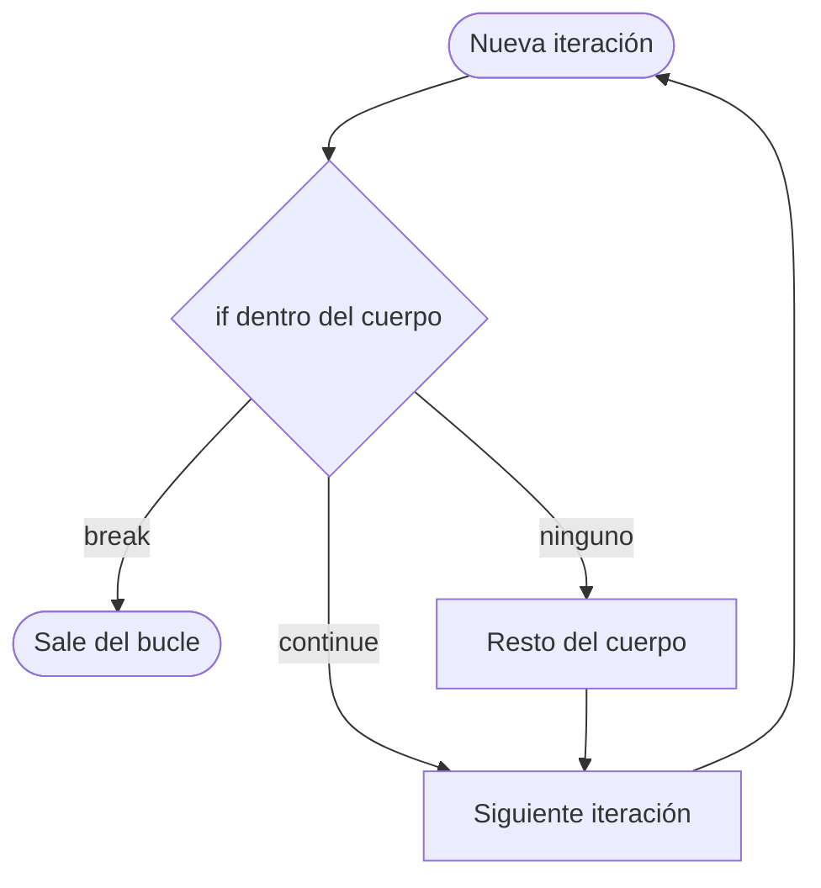
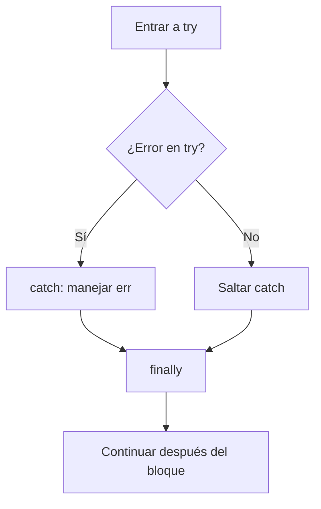
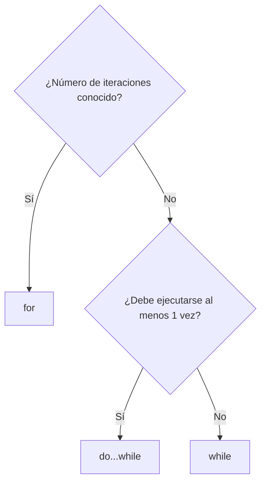

## Conceptos clave

- **Bucle (loop):** estructura que **repite** un bloque de código mientras se cumpla una condición o hasta recorrer un rango. Evita copiar/pegar el mismo código muchas veces (listar productos, validar intentos, sumar notas).
- **Iteración:** cada pasada del bucle. La variable contador (`i`, `n`) o la condición cambian en cada iteración para avanzar hacia el fin.
- **`for`:** ideal cuando conoces **cuántas veces** repetir o tienes un rango claro. Sintaxis clásica: `for (inicialización; condición; actualización) { ... }`. Ejemplo: `for (let i = 0; i < 5; i++)`.
- **Partes del `for`:** (1) inicialización — suele declarar el contador; (2) condición — se evalúa antes de cada iteración; si es falsa, el bucle termina; (3) actualización — se ejecuta al final de cada iteración (`i++`, `i += 2`).
- **`while`:** repite **mientras** la condición sea verdadera. La condición se comprueba **antes** de cada iteración; si es falsa desde el inicio, el cuerpo **no se ejecuta nunca**.
- **`do...while`:** igual que `while`, pero la condición se comprueba **después** del cuerpo. Garantiza **al menos una ejecución** aunque la condición sea falsa al principio.
- **Cuándo usar cada uno:** `for` → contadores y rangos fijos; `while` → “seguir hasta que…” (leer input, esperar dato); `do...while` → menús o acciones que deben ejecutarse al menos una vez (p. ej. pedir contraseña y reintentar).
- **`break`:** sale **inmediatamente** del bucle más interno que lo contiene (`for`, `while`, `do...while`, `switch`). El resto de iteraciones no se ejecutan.
- **`continue`:** salta el resto del cuerpo del bucle en la iteración actual y pasa a la **siguiente** iteración (vuelve a evaluar la condición o la actualización del `for`).
- **Bucle infinito:** la condición nunca se vuelve falsa (olvidar incrementar el contador, condición siempre `true`). En el navegador puede **congelar** la pestaña; en Node puede bloquear el proceso. Siempre debe haber una salida: condición que cambie, `break` o límite de seguridad.
- **Errores en tiempo de ejecución (runtime):** el código es sintácticamente válido pero falla al ejecutarse (dividir por cero, acceder a propiedad de `null`, variable no declarada). Sin manejo, el script se detiene en ese punto.
- **Tipos de error habituales:** `SyntaxError` (código mal escrito, detectado al parsear); `ReferenceError` (variable no definida); `TypeError` (operación inválida para ese tipo, p. ej. `null.foo`); `RangeError` (valor fuera de rango). El objeto `Error` y sus subclases llevan `.message` y a veces `.name`.
- **`try / catch / finally`:** `try { ... }` envuelve código que puede fallar; `catch (err) { ... }` se ejecuta si hay excepción; `finally { ... }` se ejecuta **siempre** (con o sin error), útil para limpiar recursos o logging.
- **`throw`:** lanza un error a propósito (`throw new Error("mensaje")`). Permite validar reglas de negocio (división por cero, dato inválido) y que el `catch` centralice la respuesta.
- **Recuperación vs propagación:** en `catch` puedes mostrar mensaje al usuario, devolver valor por defecto o reintentar; si no puedes recuperarte, vuelve a lanzar (`throw err`) o deja que suba. En PBPEW el foco es **atrapar, loguear y no tumbar toda la UI**.
- **Relación con lección 4:** los bucles combinan con `if/else` y operadores (`===`, `&&`, `||`) para filtrar iteraciones (`continue`) o decidir cuándo parar (`break`).
- **Preview lección 6:** los bucles suelen envolver **llamadas a funciones** y preparan callbacks (`repetir(n, fn)`). Esta lección usa funciones simples dentro de `try/catch` antes de profundizar en funciones como ciudadanos de primera clase.

## Errores comunes

- **Bucle infinito por olvidar actualizar el contador:** `let n = 0; while (n < 5) { console.log(n); }` — nunca incrementas `n`. Solución: `n++` dentro del cuerpo.
- **Off-by-one en `for`:** `i <= array.length` al indexar arrays provoca `undefined` en el último índice. Usar `i < array.length` (preview lección 7).
- **Confundir `break` con `continue`:** `break` termina el bucle; `continue` solo salta a la siguiente vuelta. Usar `continue` cuando quieres ignorar un caso, no salir del todo.
- **`break`/`continue` fuera de un bucle:** provoca `SyntaxError`. Solo son válidos dentro de `for`, `while`, `do...while` o `switch`.
- **Declarar el contador del `for` sin `let`:** `for (i = 0; ...)` en sloppy mode crea global; en `"use strict"` falla. Siempre `for (let i = 0; ...)`.
- **Usar `var` en bucles y sorprenderse después:** `for (var i = 0; i < 3; i++) {} console.log(i)` imprime `3` — `i` existe fuera del bucle. Preferir `let`.
- **`do...while` sin punto y coma final:** `do { ... } while (condicion)` — la sintaxis exige `while` con paréntesis; olvidar llaves en cuerpos multilínea causa bugs de alcance.
- **Catch vacío o silencioso:** `catch (e) {}` oculta fallos y dificulta depuración. Al menos `console.error(e.message)` o mensaje al usuario.
- **Atrapar sin entender el error:** mostrar “Algo salió mal” sin leer `err.message` o `err.name` pierde información útil en desarrollo.
- **Lanzar strings en lugar de `Error`:** `throw "falló"` funciona pero pierdes stack trace. Mejor `throw new Error("falló")`.
- **Pensar que `finally` evita el error:** `finally` siempre corre, pero si no hay `catch` o no manejas el error, el script puede seguir fallando después del bloque.
- **Confundir error de sintaxis con error de lógica:** `SyntaxError` impide que el script arranque; un bucle infinito es lógica incorrecta pero el parser no lo detecta.

## Casos reales

### 1. Dashboard de métricas: pestaña congelada

Un panel interno ejecuta `while (true) { refrescarDatos(); }` esperando que “siempre esté actualizado”. Tras el despliegue, los navegadores de los analistas dejan de responder en esa pestaña; DevTools muestra el script al 100 % CPU. El equipo revierte el commit de urgencia.

**Decisión clave:** los bucles deben tener **condición de salida** o delegar la repetición a APIs asíncronas (`setInterval`, eventos — preview lecciones posteriores). Para polling controlado: `let intentos = 0; while (intentos < max && !cancelado) { ... intentos++; }` o `break` cuando el componente se desmonta. Refuerza bucles infinitos como incidente de producción, no solo ejercicio teórico.

### 2. Checkout: división por cero sin try/catch

Un script de descuento calcula `precioFinal = total / cantidadCupones`. Cuando el usuario borra todos los cupones, `cantidadCupones` es `0` y el motor lanza error (o devuelve `Infinity` según el flujo). El resto del script — habilitar botón “Pagar” — no se ejecuta y el carrito queda bloqueado sin mensaje claro.

**Decisión clave:** validar con `if (cantidadCupones === 0)` y/o envolver en `try/catch` para mostrar feedback (“Añade al menos un cupón”) en lugar de dejar la UI muerta. Combinar **validación preventiva** (`if` + `throw`) con **recuperación** (`catch` + valor por defecto o mensaje).

## Ejemplos de código sugeridos

### Bucle `for` básico

```javascript
for (let i = 0; i < 3; i++) {
  console.log("iteración", i);
}
// 0, 1, 2
```

### Bucle `while`

```javascript
let n = 0;
while (n < 3) {
  console.log(n);
  n++; // crítico: avanzar hacia la salida
}
```

### Bucle `do...while` (al menos una vez)

```javascript
let k = 0;
do {
  console.log("al menos una vez", k);
  k++;
} while (k < 0); // condición falsa, pero el cuerpo ya corrió una vez
```

### `break` y `continue`

```javascript
for (let i = 0; i < 5; i++) {
  if (i === 2) continue; // salta el 2
  if (i === 4) break;    // sale antes del 4
  console.log(i);
}
// Imprime: 0, 1, 3
```

### Suma con acumulador (patrón real)

```javascript
let suma = 0;
for (let i = 1; i <= 5; i++) {
  suma += i;
}
console.log(suma); // 15
```

### Bucle infinito (anti-patrón — solo para reconocer)

```javascript
// NO ejecutar en producción sin límite
let x = 0;
while (true) {
  if (x === 3) break; // salida de emergencia
  console.log(x);
  x++;
}
```

### `throw`, `try`, `catch`, `finally`

```javascript
function dividir(a, b) {
  if (b === 0) {
    throw new Error("División por cero");
  }
  return a / b;
}

try {
  console.log(dividir(4, 0));
} catch (err) {
  console.error("No se pudo dividir:", err.message);
} finally {
  console.log("Esto se ejecuta siempre");
}
```

### Errores típicos en consola (demostración controlada)

```javascript
// ReferenceError — variable no declarada
// console.log(noExiste);

// TypeError — operación inválida
// const n = null;
// n.toUpperCase();

// Validación + throw en lugar de fallar en silencio
function parseEdad(texto) {
  const n = Number(texto);
  if (Number.isNaN(n) || n < 0) {
    throw new Error("Edad inválida: " + texto);
  }
  return n;
}
```

### Combinar bucle + condición (lección 4)

```javascript
const notas = [4, 2, 5, 0, 3];
let aprobadas = 0;
for (let i = 0; i < notas.length; i++) {
  if (notas[i] < 3) continue;
  aprobadas++;
}
console.log("Aprobadas:", aprobadas); // 3
```

## Ejercicios de práctica

- **tipo:** reflexion — ¿Cuándo elegirías `for` en lugar de `while`? (respuesta esperada: rango o número de iteraciones conocido; contador claro).
- **tipo:** reflexion — ¿Qué garantiza `do...while` que `while` no garantiza? (al menos una ejecución del cuerpo).
- **tipo:** reflexion — ¿Por qué un `catch` vacío es mala práctica? (oculta errores, dificulta depuración y soporte).
- **tipo:** codigo — Escribe un `for` que imprima los números pares del 0 al 8 inclusive.
- **tipo:** codigo — Escribe un `while` que cuente de 10 a 1 (cuenta regresiva) e imprima cada número.
- **tipo:** codigo — Usando `continue`, imprime del 1 al 6 excepto el 3 y el 5.
- **tipo:** codigo — Implementa `dividir(a, b)` con `throw` si `b === 0` y llámala dentro de `try/catch` mostrando `err.message`.
- **tipo:** completar-codigo — Completa: `for (let i = 0; i ___ 5; i___) { console.log(i); }` → `<`, `++`.
- **tipo:** completar-codigo — Completa: `___ { risky(); } catch (e) { console.error(e._____); }` → `try`, `message`.
- **tipo:** ordenar-pasos — Ordena el flujo `try/catch`: (a) se ejecuta `catch` si hay error, (b) se ejecuta el bloque `try`, (c) se ejecuta `finally` si existe, (d) si no hay error, `catch` se omite.
- **tipo:** diagrama — Dibuja el flujo de un `for (let i=0; i<3; i++)` indicando: evaluar condición, ejecutar cuerpo, actualizar `i`, repetir o salir.
- **tipo:** diagrama — Diagrama de decisión: ¿usar `for`, `while` o `do...while`? según “¿sé cuántas vueltas?” y “¿debe ejecutarse al menos una vez?”.

## Animación o visual sugerida

- **StepReveal — anatomía del `for`:** paso 1 inicialización (`let i = 0`) → paso 2 evaluar condición (`i < 5`) → paso 3 ejecutar cuerpo → paso 4 actualización (`i++`) → volver a paso 2 o salir.
- **CompareTable — tres bucles:**

  | Bucle | Cuándo | Condición se evalúa | Mínimo de ejecuciones |
  |-------|--------|---------------------|------------------------|
  | `for` | Rango/contador conocido | Antes de cada iteración | 0 si condición inicial es falsa |
  | `while` | Condición abierta | Antes de cada iteración | 0 |
  | `do...while` | Al menos una vez | Después del cuerpo | 1 |

- **CompareTable — `break` vs `continue`:**

  | Palabra clave | Efecto en la iteración actual | Efecto en el bucle |
  |---------------|------------------------------|-------------------|
  | `break` | Detiene de inmediato | Termina el bucle |
  | `continue` | Salta el resto del cuerpo | Sigue con la siguiente iteración |

- **MermaidDiagram — flujo try/catch/finally:** reutilizar en sección `TryCatchSection`.
- **CodePlayground interactivo:** editor con bucle `for` y botón “Ejecutar” que muestre salida en consola simulada; variante con input que provoque `catch`.
- **Secciones TSX sugeridas (expansión desde estado actual):** `BucleForSection`, `BucleWhileSection`, `BucleDoWhileSection`, `BreakContinueSection`, `BuclesInfinitosSection`, `TryCatchSection`, `ErroresRuntimeSection`, `ResumenSection`, `CompruebaTuComprensionSection`.

## Diagrama Mermaid (si aplica)

### Flujo del bucle `for`

```mermaid
flowchart TD
  start([Inicio for]) --> init["inicialización: let i = 0"]
  init --> cond{"¿i < límite?"}
  cond -->|Sí| body["ejecutar cuerpo"]
  body --> update["actualización: i++"]
  update --> cond
  cond -->|No| end([Fin del bucle])
```

### `break` vs `continue` en una iteración



### try / catch / finally



### Decisión: ¿qué bucle usar?



## Reto integrador

**“Validador de PIN con reintentos”**

Un cajero simulado en JavaScript debe pedir un PIN correcto (`const PIN_CORRECTO = "1234"`). Reglas:

1. Máximo **3 intentos** usando un bucle (`for` o `while` con contador).
2. Si el intento es **vacío** o no numérico, usar `continue` sin consumir intento (o documentar si decides consumirlo — sé consistente).
3. Si el PIN es correcto, imprimir “Acceso concedido” y salir con `break`.
4. Si tras 3 intentos fallidos no acertó, imprimir “Tarjeta bloqueada”.
5. Envolver la lectura simulada en `try/catch`: una función `leerPinSimulado(valor)` lanza `Error` si `valor` es `null` (simula fallo de hardware).
6. En `catch`, mostrar “Error de lectura, reintente” y **no** contar ese intento como fallo de PIN.

**Datos de prueba sugeridos:** `["", "12ab", "0000", "1234"]` o entrada por `prompt` en consola del navegador.

**Criterio de éxito:** usa al menos un bucle, `break` o `continue` con propósito claro, `throw` + `try/catch`, límite de 3 intentos, mensajes distintos para éxito, bloqueo y error de lectura.

## Preguntas sugeridas para quiz (5)

1. **¿Cuántas veces se ejecuta el cuerpo de este `while`?** `let x = 5; while (x < 5) { console.log(x); x++; }`
   - A) Una vez
   - B) Infinitas veces
   - C) Cero veces
   - D) Cinco veces
   - **Correcta:** C
   - **Feedback:** La condición `x < 5` es falsa desde el inicio (`x` es 5), así que el cuerpo del `while` nunca se ejecuta. A diferencia de `do...while`, no hay ejecución garantizada.

2. **¿Qué hace `continue` dentro de un bucle?**
   - A) Termina el bucle por completo
   - B) Salta al siguiente paso de actualización del `for` y la siguiente iteración
   - C) Reinicia el programa
   - D) Solo funciona en `switch`
   - **Correcta:** B
   - **Feedback:** `continue` abandona la iteración actual y vuelve al inicio del bucle (condición o actualización). Para salir del bucle entero se usa `break`.

3. **¿Cuál es la salida de este código?** `for (let i = 0; i < 3; i++) { if (i === 1) break; console.log(i); }`
   - A) 0, 1, 2
   - B) 0, 1
   - C) 0
   - D) 1, 2
   - **Correcta:** C
   - **Feedback:** Imprime `0`. En `i === 1`, `break` sale del bucle antes de imprimir 1. Solo se alcanza un `console.log` con `i === 0`.

4. **¿Qué bloque se ejecuta siempre, haya o no error en `try`?**
   - A) Solo `catch`
   - B) Solo `try`
   - C) `finally`
   - D) Ninguno
   - **Correcta:** C
   - **Feedback:** `finally` corre tras `try` (y tras `catch` si hubo error). Es útil para limpieza o logging que debe ocurrir en ambos casos.

5. **¿Cuál es la mejor forma de lanzar un error personalizado al detectar división por cero?**
   - A) `return Error("cero")`
   - B) `throw new Error("División por cero")`
   - C) `catch new Error("cero")`
   - D) `console.log("error")`
   - **Correcta:** B
   - **Feedback:** `throw new Error(...)` interrumpe el flujo normal y puede ser atrapado por `catch`. `return` no lanza; `catch` no lanza; `console.log` solo muestra texto.

## Referencias

- Contenido TSX (sparse, expandir según brief): `src/components/teaching/lessons/pbpew/05-bucles-y-errores/`
- Legacy (insumo): `kb/archive/legacy-pages/teaching/pbpew/05-bucles-y-errores.html`
- MDN — for: https://developer.mozilla.org/es/docs/Web/JavaScript/Reference/Statements/for
- MDN — while: https://developer.mozilla.org/es/docs/Web/JavaScript/Reference/Statements/while
- MDN — do...while: https://developer.mozilla.org/es/docs/Web/JavaScript/Reference/Statements/do...while
- MDN — break: https://developer.mozilla.org/es/docs/Web/JavaScript/Reference/Statements/break
- MDN — continue: https://developer.mozilla.org/es/docs/Web/JavaScript/Reference/Statements/continue
- MDN — try...catch: https://developer.mozilla.org/es/docs/Web/JavaScript/Reference/Statements/try...catch
- MDN — throw: https://developer.mozilla.org/es/docs/Web/JavaScript/Reference/Statements/throw
- MDN — Error: https://developer.mozilla.org/es/docs/Web/JavaScript/Reference/Global_Objects/Error
- Lección anterior: `04-operadores-y-decisiones` (condicionales y operadores dentro de bucles)
- Lección siguiente: `06-funciones-y-callbacks` (funciones llamadas desde bucles y callbacks)
