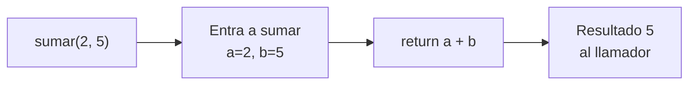
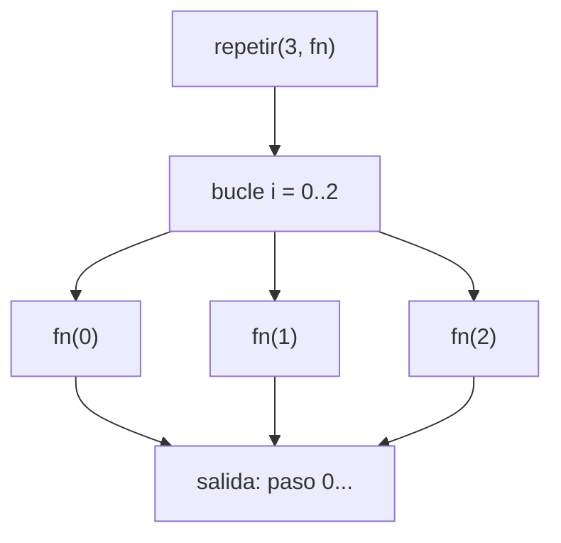
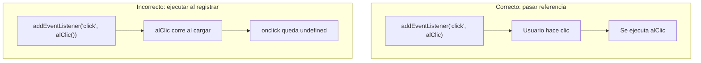

## Conceptos clave

- **Función:** bloque de código con nombre (o referencia) que agrupa lógica reutilizable. Evita repetir el mismo código, facilita pruebas y hace el programa más legible.
- **Declaración de función:** `function saludar(nombre) { return \`Hola, ${nombre}\`; }` — el motor la registra antes de ejecutar el bloque (hoisting de la declaración completa). Puedes invocarla antes de su línea en el archivo.
- **Expresión de función:** `const duplicar = function (x) { return x * 2; };` — la función se asigna a una variable. No tiene hoisting de la asignación: no puedes usar `duplicar` antes de esa línea.
- **Función flecha (arrow function):** `(x) => x * 3` o `(x) => { return x * 3; }`. Sintaxis compacta desde ES6. Si el cuerpo es una sola expresión sin llaves, el `return` es **implícito**.
- **Invocar / llamar:** ejecutar la función con `()` — `saludar("Patricia")`. La expresión `saludar` sin paréntesis es solo la **referencia** a la función, no la ejecuta.
- **Parámetros vs argumentos:** los **parámetros** son los nombres en la definición (`a`, `b` en `function sumar(a, b)`); los **argumentos** son los valores concretos en la llamada (`sumar(2, 5)` pasa argumentos `2` y `5`).
- **Parámetros por defecto:** `function saludar(nombre = "invitado") { ... }` — si el argumento es `undefined` o falta, usa el valor por defecto.
- **`return`:** devuelve un valor al código que llamó la función y **termina** la ejecución de esa función en ese punto. Código después de `return` en la misma rama no se ejecuta.
- **Retorno implícito `undefined`:** si una función no tiene `return` o solo `return;`, devuelve `undefined`.
- **Alcance (scope) local:** variables declaradas con `let`/`const` dentro de una función existen solo ahí. No son visibles fuera (salvo closure, preview avanzado).
- **Alcance de función con `var`:** `var` dentro de una función queda limitada a esa función; fuera de funciones puede contaminar el global (legacy — preferir `let`/`const`).
- **Función de orden superior (HOF, básico):** función que **recibe** otra función como argumento o **devuelve** una función. Ejemplo: `repetir(n, fn)` ejecuta `fn` varias veces.
- **Callback:** función que pasas como argumento para que otra función la ejecute **más tarde** o **en un momento concreto** (cada iteración de un bucle, tras un clic, tras un temporizador).
- **Callbacks en el navegador:** `addEventListener("click", miCallback)`, `setTimeout(fn, 1000)` — el motor o la API “llaman de vuelta” tu función cuando ocurre el evento o expira el tiempo.
- **`typeof` de funciones:** `typeof miFuncion === "function"`. Las funciones en JS son objetos invocables (citables).
- **Preview lección 7:** métodos de array como `.forEach`, `.map` y `.filter` reciben callbacks; esta lección prepara ese patrón.

## Errores comunes

- **Olvidar `return`:** `function doble(x) { x * 2; }` devuelve `undefined`. El cálculo ocurre pero no se envía al llamador.
- **Confundir `return` con `console.log`:** `console.log` muestra en consola; no sustituye a `return` cuando otra parte del código necesita el valor.
- **Llamar sin paréntesis cuando se necesita ejecutar:** `const btn = document.querySelector("button"); btn.addEventListener("click", manejarClick);` ✅ pasa la referencia. `btn.addEventListener("click", manejarClick());` ❌ ejecuta al registrar y pasa el **resultado** (a menudo `undefined`).
- **Paréntesis extra en arrow function de una línea:** `(x) => { x * 2 }` con llaves pero sin `return` explícito devuelve `undefined`; hace falta `return` dentro de llaves o quitar las llaves.
- **Número incorrecto de argumentos:** JavaScript no exige coincidencia estricta; argumentos faltantes son `undefined`, sobrantes se ignoran — puede ocultar bugs (`sumar(2)` → `NaN` si no validas).
- **Reutilizar nombres de parámetro y variable externa sin querer:** sombrear variables del scope exterior confunde al leer y depurar; usa nombres claros y distintos.
- **Asumir que arrow y `function` son idénticas en todos los contextos:** en esta lección basta con sintaxis; `this` y `arguments` difieren (tema avanzado — no profundizar aún).
- **Callback que nunca se invoca:** definir `function procesar(fn) { /* olvidaron fn() */ }` — la función pasada no hace efecto.
- **Modificar variables globales dentro de funciones sin declararlas:** en sloppy mode `contador++` crea global; usar `let`/`const` dentro de la función o parámetros explícitos.

## Casos reales

### 1. Checkout: el total sale `undefined`

Un desarrollador escribe `function calcularTotal(precio, cantidad) { precio * cantidad; }` y en el carrito muestra `Total: undefined`. En consola no hay error — la función corre, pero no devuelve nada. QA reporta “precio roto” en producción.

**Decisión clave:** revisar que la función tenga `return precio * cantidad;` y que quien llama use el valor retornado, no solo ejecute la función por efecto secundario.

### 2. Botón “Guardar” que dispara la acción al cargar la página

En un panel admin registran el manejador así: `boton.onclick = guardarCambios();`. Al cargar la página se dispara un guardado no deseado y el clic posterior no funciona porque `onclick` recibió `undefined` (retorno de `guardarCambios()`), no la función.

**Lección:** pasar **referencia** de función (`guardarCambios` o `() => guardarCambios()`) cuando quieres ejecutarla **después**, en respuesta a un evento — patrón callback.

## Ejemplos de código sugeridos

### Declaración, expresión y flecha

```javascript
// Declaración
function saludar(nombre) {
  return `Hola, ${nombre}`;
}
console.log(saludar("Patricia")); // "Hola, Patricia"

// Expresión
const duplicar = function (x) {
  return x * 2;
};

// Flecha — retorno implícito
const triple = (x) => x * 3;

console.log(duplicar(4)); // 8
console.log(triple(4));   // 12
```

### Parámetros, argumentos y return

```javascript
function sumar(a, b) {
  return a + b;
}
console.log(sumar(2, 5)); // 7 — argumentos 2 y 5

function avisar(mensaje) {
  console.log(mensaje);
  // sin return → undefined
}
console.log(avisar("Listo")); // imprime "Listo", retorno undefined
```

### Parámetro por defecto

```javascript
function crearSaludo(nombre = "invitado") {
  return `Bienvenido, ${nombre}`;
}
console.log(crearSaludo());        // "Bienvenido, invitado"
console.log(crearSaludo("Laura")); // "Bienvenido, Laura"
```

### Scope local

```javascript
function contar() {
  let n = 0;
  n++;
  return n;
}
console.log(contar()); // 1
// console.log(n); // ReferenceError — n solo existe dentro de contar
```

### Callback y función de orden superior

```javascript
function repetir(n, fn) {
  for (let i = 0; i < n; i++) {
    fn(i);
  }
}

repetir(3, (i) => console.log("paso", i));
// paso 0
// paso 1
// paso 2
```

### Callback de evento (preview DOM)

```javascript
const boton = document.querySelector("#enviar");
boton.addEventListener("click", function () {
  console.log("Clic registrado — callback ejecutado");
});
// Se pasa la función; el navegador la llama cuando hay clic
```

### Error clásico: ejecutar en lugar de pasar

```javascript
function alClic() {
  console.log("Guardado");
}

// ❌ Mal — ejecuta al instante
// boton.onclick = alClic();

// ✅ Bien — referencia para más tarde
// boton.onclick = alClic;
```

## Ejercicios de práctica

- **tipo:** reflexion — ¿Qué ventaja tiene extraer lógica repetida a una función frente a copiar el mismo bloque en tres sitios? (respuesta esperada: reutilización, un solo lugar para corregir, nombre que documenta intención).
- **tipo:** reflexion — Explica la diferencia entre parámetro y argumento con el ejemplo `function resta(a, b)` y `resta(10, 3)`.
- **tipo:** codigo — Escribe `function areaRectangulo(base, altura)` que devuelva `base * altura` y prueba con `console.log(areaRectangulo(5, 4))`.
- **tipo:** codigo — Convierte `function esPar(n) { return n % 2 === 0; }` a arrow function equivalente y comprueba con `esPar(4)` y `esPar(7)`.
- **tipo:** completar-codigo — Completa: `function repetir(n, fn) { for (let i = 0; i < ___; i++) { ___(i); } }` → `n`, `fn`.
- **tipo:** completar-codigo — Completa para que devuelva el doble: `const mitad = (x) => ___;` → `x / 2` (o `{ return x / 2; }` con llaves).
- **tipo:** ordenar-pasos — Ordena el flujo de `const r = sumar(2, 3);`: (a) se devuelve 5 al llamador, (b) se asigna 5 a `r`, (c) se invoca `sumar` con argumentos 2 y 3, (d) dentro de `sumar`, `a` vale 2 y `b` vale 3, (e) se evalúa `a + b`.
- **tipo:** diagrama — Dibuja o etiqueta: función `repetir(3, fn)` → bucle 3 veces → cada iteración llama a `fn(i)` con `i` = 0, 1, 2.
- **tipo:** reflexion — ¿Por qué `addEventListener("click", manejarClick())` suele ser incorrecto frente a `addEventListener("click", manejarClick)`?

## Animación o visual sugerida

- **CompareTable — tres formas de definir funciones:**

  | Forma | Sintaxis típica | Hoisting | Cuándo usar en PBPEW |
  |-------|-----------------|----------|----------------------|
  | Declaración | `function f() {}` | Sí (nombre) | Utilidades con nombre claro, handlers nombrados |
  | Expresión | `const f = function () {}` | No | Asignar a variable/constante |
  | Flecha | `const f = () => {}` | No | Callbacks cortos, una expresión |

- **StepReveal — flujo de una llamada:** definición → invocación con argumentos → cuerpo ejecuta → `return` → valor en el llamador.
- **MermaidDiagram — callback en `repetir`:** alinear con `CallbacksSection` (función principal llama a callback en cada iteración).
- **StepReveal — registro vs ejecución de callback:** paso 1 registrar referencia en `addEventListener`; paso 2 usuario hace clic; paso 3 navegador ejecuta la función registrada.

## Diagrama Mermaid (si aplica)

### Flujo: llamada con return



### Callback dentro de función de orden superior



### Registrar callback vs ejecutarlo al instante



## Reto integrador

**“Mini biblioteca de transformaciones”**

Implementa en un solo archivo (consola o `<script>`):

1. `function aplicarLista(valores, transformar)` — recorre `valores` con un `for`, llama `transformar(valor)` en cada elemento y devuelve un **nuevo array** con los resultados (sin `.map` aún; usa bucle de la lección 5).
2. `const aMayusculas = (texto) => texto.toUpperCase();`
3. `const conPrefijo = (n) => "ID-" + n;`
4. Prueba: `aplicarLista(["hola", "pbpew"], aMayusculas)` → `["HOLA", "PBPEW"]`.
5. Prueba: `aplicarLista([1, 2, 3], conPrefijo)` → `["ID-1", "ID-2", "ID-3"]`.
6. Añade `function filtrarLista(valores, cumple)` que devuelva solo elementos donde `cumple(valor)` sea `true` (callback predicado).

**Criterio de éxito:** usa declaración y flecha, `return` correcto, callbacks como argumentos, bucles vistos en lección 5, sin modificar el array original de entrada.

## Preguntas sugeridas para quiz (5)

1. **¿Qué hace `return` dentro de una función?**
   - A) Reinicia el programa
   - B) Devuelve un valor al llamador y termina la función en ese punto
   - C) Imprime en consola automáticamente
   - D) Declara una variable global
   - **Correcta:** B
   - **Feedback:** `return` envía el resultado hacia fuera y detiene la ejecución de la función en esa línea. Para ver valores en consola usas `console.log`, no confundir con `return`.

2. **En `function sumar(a, b) { return a + b; }` y la llamada `sumar(2, 5)`, ¿qué son `a` y `b`?**
   - A) Argumentos
   - B) Parámetros
   - C) Callbacks
   - D) Propiedades del objeto global
   - **Correcta:** B
   - **Feedback:** `a` y `b` son nombres en la definición (parámetros). Los valores `2` y `5` en la llamada son los argumentos.

3. **¿Cuál devuelve el triple de un número con retorno implícito?**
   - A) `const triple = (x) => { x * 3; };`
   - B) `const triple = (x) => x * 3;`
   - C) `const triple = function (x) { x * 3 };`
   - D) `function triple(x) { x * 3 }`
   - **Correcta:** B
   - **Feedback:** Con flecha y una sola expresión sin llaves, el resultado se devuelve automáticamente. Las opciones con cuerpo sin `return` explícito devuelven `undefined`.

4. **¿Qué es un callback en JavaScript?**
   - A) Un error de sintaxis en un bucle
   - B) Una función que pasas a otra para que la ejecute en el momento adecuado
   - C) Un tipo de variable solo para números
   - D) El archivo HTML que carga el script
   - **Correcta:** B
   - **Feedback:** Los callbacks conectan tu lógica con código que decide cuándo ejecutarla (bucles propios, eventos, temporizadores, APIs).

5. **¿Por qué `boton.addEventListener("click", guardar());` suele ser un error?**
   - A) Porque `addEventListener` no acepta strings
   - B) Porque ejecuta `guardar` al registrar y pasa su retorno, no la función
   - C) Porque los clics no usan callbacks
   - D) Porque hay que usar `var` obligatoriamente
   - **Correcta:** B
   - **Feedback:** Los paréntesis `()` invocan la función de inmediato. Para el clic necesitas pasar la referencia: `guardar` o `() => guardar()`.

## Referencias

- Contenido TSX migrado: `src/components/teaching/lessons/pbpew/06-funciones-y-callbacks/`
- Secciones existentes: `DeclaracionDeFuncionSection`, `CallbacksSection`, `ResumenSection`
- Legacy (insumo): `kb/archive/legacy-pages/teaching/pbpew/06-funciones-y-callbacks.html`
- MDN — Funciones: https://developer.mozilla.org/es/docs/Web/JavaScript/Guide/Functions
- MDN — Arrow functions: https://developer.mozilla.org/es/docs/Web/JavaScript/Reference/Functions/Arrow_functions
- MDN — return: https://developer.mozilla.org/es/docs/Web/JavaScript/Reference/Statements/return
- MDN — Callback function: https://developer.mozilla.org/es/docs/Glossary/Callback_function
- Lección anterior: `05-bucles-y-errores` (bucles para implementar HOF simples)
- Lección siguiente: `07-arrays-json-objetos` (arrays, `.forEach`/`.map` con callbacks)
