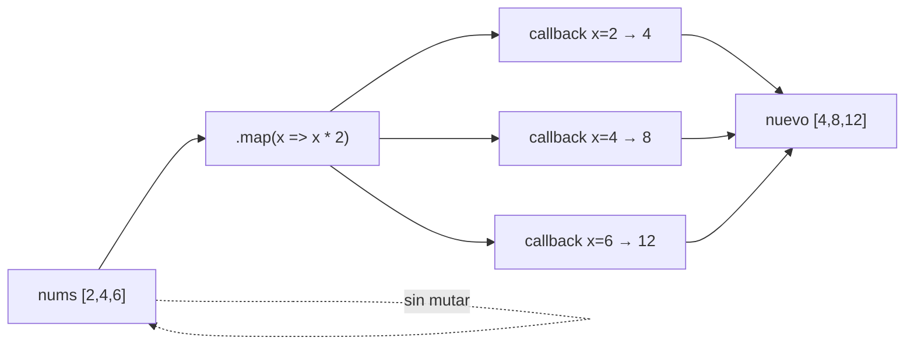
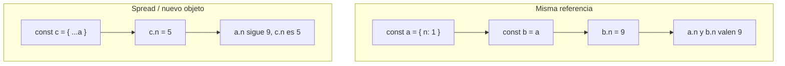

## Conceptos clave

- **Array (arreglo):** lista ordenada de valores en una sola variable. Índices desde **0**. Sintaxis literal: `const nums = [2, 4, 6];`. Elementos de cualquier tipo mezclables (`[1, "hola", true]`).
- **Longitud:** propiedad `arr.length` — número de elementos. Último índice válido: `arr.length - 1`.
- **Acceso por índice:** `nums[0]` → primer elemento; `nums[nums.length - 1]` → último. Índice fuera de rango devuelve `undefined` (no lanza error).
- **Mutación al final:** `push(valor)` añade al final y devuelve la nueva longitud; `pop()` quita el último y lo **devuelve**.
- **Mutación al inicio:** `unshift(valor)` añade al inicio; `shift()` quita el primero y lo devuelve. Más costoso en arrays grandes (reindexación), pero útil en colas simples.
- **Inmutabilidad vs mutación:** `push`/`pop`/`shift`/`unshift` **modifican** el array original. Métodos como `.map` y `.filter` devuelven un **nuevo** array sin alterar el original (patrón preferido para transformaciones).
- **Callback en arrays (conexión lección 6):** `.forEach`, `.map`, `.filter` reciben una función que el motor invoca por cada elemento — son callbacks en acción.
- **`.forEach(fn)`:** ejecuta `fn(elemento, indice, array)` por cada posición. **No devuelve** un array útil (retorno `undefined`). Sirve para efectos secundarios (`console.log`, actualizar DOM).
- **`.map(fn)`:** devuelve **nuevo array** con el resultado de `fn` aplicado a cada elemento. Misma longitud que el original.
- **`.filter(fn)`:** devuelve **nuevo array** solo con elementos donde `fn` devuelve valor truthy (predicado).
- **Preview — otros métodos útiles:** `.reduce((acc, x) => ..., valorInicial)` combina en un solo valor; `.find`, `.some`, `.every` para búsqueda y comprobaciones (mencionar en resumen, profundizar en lecciones posteriores).
- **Objeto literal:** agrupa propiedades con nombre (`clave: valor`). `const alumno = { id: 42, nombre: "Sofía" };`. Acceso: `alumno.nombre` o `alumno["nombre"]` (corchetes útiles si la clave es variable o tiene caracteres especiales).
- **Método en objeto:** propiedad cuyo valor es función — `presentarse() { return \`Soy ${this.nombre}\`; }`. Preview de `this` (lección 8); aquí basta con invocar `alumno.presentarse()`.
- **JSON (JavaScript Object Notation):** formato de **texto** para intercambiar datos (APIs, `localStorage`, logs). Subconjunto de la sintaxis literal de objetos/arrays de JS — no admite funciones, `undefined` ni comentarios.
- **`JSON.stringify(obj)`:** convierte objeto/array JS → cadena JSON. Pierde métodos y tipos no serializables.
- **`JSON.parse(texto)`:** convierte cadena JSON → objeto/array JS. Lanza error si el texto no es JSON válido.
- **Referencia vs valor (primitivos):** números, strings, booleanos se copian por valor. Objetos y arrays se asignan por **referencia** — dos variables pueden apuntar al **mismo** objeto en memoria; mutar por una afecta a la otra.
- **Copia superficial (preview):** `const copia = { ...original }` o `const copiaArr = [...original]` crea un nuevo contenedor de primer nivel; objetos anidados siguen compartiendo referencia (tema avanzado).
- **Destructuración básica:** extraer propiedades o elementos en variables en una línea.
  - Array: `const [primero, segundo] = lista;`
  - Objeto: `const { nombre, id } = alumno;`
  - Renombrar: `const { nombre: nombreAlumno } = alumno;`
  - Valores por defecto: `const { rol = "estudiante" } = usuario;`
- **Spread en literales:** `const nuevo = { ...viejo, activo: true };` — útil para clonar y actualizar sin mutar el original directamente.

## Errores comunes

- **Confundir índice con valor:** el primer elemento es índice `0`, no `1`. `arr[1]` es el **segundo** elemento.
- **Asumir que `.map` modifica el original:** `.map` devuelve array nuevo; si no asignas el resultado, el original queda igual y “parece que no funcionó”.
- **Usar `.forEach` cuando necesitas un array transformado:** `.forEach` no devuelve resultados acumulados; usa `.map` o un bucle con `push` explícito.
- **Olvidar `return` en callback de `.map`/`.filter` con llaves:** `(x) => { x * 2 }` devuelve `undefined` por elemento; hace falta `return` o quitar llaves.
- **Mutar el array mientras lo recorres con índice manual:** quitar elementos con `splice` dentro de un `for` puede saltar posiciones; preferir métodos de orden superior o iterar hacia atrás (avanzado).
- **Comparar arrays/objetos con `===`:** `[1,2] === [1,2]` es `false` (referencias distintas). Comparar contenido requiere lógica explícita o serialización.
- **Pensar que `JSON.parse` valida reglas de negocio:** solo valida sintaxis JSON; datos pueden ser coherentes en JSON pero incorrectos para la app (ej. edad negativa).
- **`JSON.stringify` con funciones o `undefined`:** las funciones se omiten; propiedades con valor `undefined` en objetos se excluyen del JSON.
- **Parsear respuesta de API sin `try/catch`:** JSON malformado rompe la ejecución — envolver `JSON.parse` o usar `response.json()` en fetch (lección 12).
- **Destructurar propiedad inexistente sin default:** `const { email } = usuario` → `email` es `undefined` si no existe; usar default o validar.
- **Confundir spread con copia profunda:** `{ ...obj }` no clona objetos anidados; mutar `copia.direccion.calle` puede afectar al original.
- **Pasar array/objeto a función y mutarlo sin querer:** el parámetro recibe la misma referencia; cambios internos se ven fuera.

## Casos reales

### 1. API de pedidos: el carrito “revive” ítems eliminados

Un frontend guarda el carrito en estado y también en `localStorage` con `JSON.stringify`. Un dev muta el array en memoria con `carrito.push(item)` pero olvida volver a serializar. Al recargar, `JSON.parse` restaura la versión antigua y el usuario ve productos que ya había quitado.

**Decisión clave:** tratar datos persistidos como fuente de verdad tras cada cambio, o inmutar (`const nuevo = [...carrito, item]`) y guardar el nuevo estado serializado. Entender que mutar un array compartido afecta a todas las referencias.

### 2. Dashboard: totales en cero tras “mapear” precios

El equipo escribe `productos.forEach(p => p.precio * 1.19)` esperando precios con IVA. Los precios no cambian porque `forEach` ignora el retorno del callback y no asigna nada. QA reporta totales incorrectos en el resumen.

**Lección:** usar `.map` para transformar y asignar: `const conIva = productos.map(p => p.precio * 1.19)`. Conectar con callbacks de la lección 6: la función que pasas **sí** se ejecuta, pero el método decide qué hacer con el resultado.

## Ejemplos de código sugeridos

### Creación, índices y mutación básica

```javascript
const nums = [2, 4, 6];
console.log(nums[0]);      // 2
console.log(nums.length);  // 3

nums.push(8);    // [2, 4, 6, 8] — al final
const ultimo = nums.pop();  // ultimo === 8, nums === [2, 4, 6]

const cola = ["a", "b"];
cola.unshift("z");  // ["z", "a", "b"]
const primero = cola.shift();  // primero === "z"
```

### map, filter, forEach (callbacks)

```javascript
const nums = [2, 4, 6];

const dobles = nums.map((x) => x * 2);
// [4, 8, 12] — nums sigue [2, 4, 6]

const pares = nums.filter((x) => x % 2 === 0);
// [2, 4, 6]

nums.forEach((x) => console.log("valor:", x));
// efecto por elemento, sin array nuevo
```

### reduce (preview)

```javascript
const nums = [2, 4, 6];
const suma = nums.reduce((acc, x) => acc + x, 0);
console.log(suma); // 12
```

### Objeto literal y método

```javascript
const alumno = {
  id: 42,
  nombre: "Sofía",
  presentarse() {
    return `Soy ${this.nombre}`;
  },
};

console.log(alumno.nombre);           // "Sofía"
console.log(alumno.presentarse());    // "Soy Sofía"
```

### JSON.stringify y JSON.parse

```javascript
const curso = {
  nombre: "PBPEW",
  horas: 40,
  activo: true,
};

const texto = JSON.stringify(curso);
console.log(texto);
// {"nombre":"PBPEW","horas":40,"activo":true}

const otraVez = JSON.parse(texto);
console.log(otraVez.nombre); // "PBPEW"
```

### Referencia vs valor

```javascript
const original = { puntos: 10 };
const ref = original;      // misma referencia
ref.puntos = 99;
console.log(original.puntos); // 99 — mutación compartida

const copia = { ...original, puntos: 10 };
copia.puntos = 50;
console.log(original.puntos); // 99
console.log(copia.puntos);    // 50
```

### Destructuración básica

```javascript
const lista = ["rojo", "verde", "azul"];
const [primero, , tercero] = lista;
console.log(primero, tercero); // "rojo" "azul"

const usuario = { id: 1, nombre: "Ana", rol: "admin" };
const { nombre, rol = "invitado" } = usuario;
console.log(nombre, rol); // "Ana" "admin"
```

## Ejercicios de práctica

- **tipo:** reflexion — ¿Por qué el índice del primer elemento de un array es `0` y no `1`? (respuesta esperada: convención de offsets en memoria; coherencia con `.length` y bucles `i < arr.length`).
- **tipo:** reflexion — Explica la diferencia entre `.forEach` y `.map` cuando quieres duplicar cada número de una lista.
- **tipo:** codigo — Crea `const notas = [6, 7, 8, 5]` y usa `.map` para obtener `notasAprobadas` con solo las ≥ 6 (o usa `.filter` directamente sobre `notas`).
- **tipo:** codigo — Dado `const items = ["pan", "leche"]`, añade `"huevos"` al final sin reasignar la variable (usa `push`) y luego crea `const copia = [...items]` y añade `"mantequilla"` solo a `copia`. Compara `items` y `copia` en consola.
- **tipo:** completar-codigo — Completa: `const dobles = numeros.___((n) => n * 2);` → `map`.
- **tipo:** completar-codigo — Completa: `const ___ = JSON.___('{"ok":true}');` → `obj`, `parse`.
- **tipo:** ordenar-pasos — Ordena el flujo de persistir un carrito: (a) `localStorage.setItem("carrito", texto)`, (b) `const texto = JSON.stringify(carrito)`, (c) usuario modifica `carrito`, (d) al cargar `JSON.parse(localStorage.getItem("carrito"))`.
- **tipo:** diagrama — Dibuja dos variables `a` y `b` apuntando al mismo objeto `{ x: 1 }` vs dos objetos distintos con el mismo contenido.
- **tipo:** codigo — Usa destructuración: `const persona = { nombre: "Luis", edad: 20 };` extrae `nombre` y `edad` en constantes e imprímelas.
- **tipo:** reflexion — ¿Por qué `JSON.stringify({ fn: () => {} })` produce `"{}"` o omite `fn`?

## Animación o visual sugerida

- **CompareTable — mutar vs transformar:**

  | Operación | ¿Modifica original? | ¿Devuelve nuevo array? | Ejemplo |
  |-----------|---------------------|------------------------|---------|
  | `push` / `pop` / `shift` / `unshift` | Sí | No (devuelve longitud o elemento) | `arr.push(1)` |
  | `.map` / `.filter` | No | Sí | `arr.map(x => x * 2)` |
  | `.forEach` | No* | No (`undefined`) | `arr.forEach(console.log)` |

  \*No cambia la estructura por sí solo, pero el callback puede mutar elementos si el programador lo hace.

- **StepReveal — ciclo JSON:** objeto JS → `JSON.stringify` → texto en red/almacenamiento → `JSON.parse` → objeto JS de nuevo.
- **MermaidDiagram — referencia compartida:** dos flechas desde variables distintas hacia el mismo bloque de memoria del objeto.
- **CompareTable — primitivo vs referencia:**

  | Tipo | Asignación `b = a` | `b` cambia → ¿afecta `a`? |
  |------|--------------------|---------------------------|
  | número, string, boolean | copia el valor | No |
  | array, objeto | copia la referencia | Sí, si mutas el contenido |

## Diagrama Mermaid (si aplica)

### Flujo: map con callback



### Referencia vs copia superficial



### Serialización JSON

```mermaid
flowchart LR
  O["Objeto JS\ncurso"]
  O --> S["JSON.stringify"]
  S --> T["'{\"nombre\":\"PBPEW\"...}'"]
  T --> P["JSON.parse"]
  P --> O2["Objeto JS\notraVez"]
```

## Reto integrador

**“Catálogo de cursos PBPEW”**

Partiendo de un array de objetos literales en consola (o `<script>`):

```javascript
const cursos = [
  { id: 1, nombre: "JS básico", horas: 20, activo: true },
  { id: 2, nombre: "DOM", horas: 15, activo: false },
  { id: 3, nombre: "Fetch", horas: 10, activo: true },
];
```

1. Usa `.filter` para obtener `activos` (solo `activo === true`).
2. Usa `.map` en `activos` para crear `resumen` con strings `"ID-1: JS básico (20h)"` (plantilla con `id`, `nombre`, `horas`).
3. Calcula `totalHorasActivas` con `.reduce` sobre `activos`.
4. Serializa `activos` con `JSON.stringify` y simula envío a API; parsea de vuelta con `JSON.parse` en `importados`.
5. Usa destructuración: `const { nombre, horas } = importados[0]` y muestra en consola.
6. Demuestra referencia: asigna `const ref = cursos`, muta `ref[0].nombre` y comprueba que `cursos[0].nombre` cambió; luego crea `const clon = cursos.map(c => ({ ...c }))`, muta `clon[0].nombre` y verifica que `cursos[0].nombre` **no** cambia.

**Criterio de éxito:** callbacks correctos en map/filter/reduce, sin confundir `forEach` con `map`, JSON válido round-trip, comprensión de referencia vs copia superficial con spread.

## Preguntas sugeridas para quiz (5)

1. **¿Qué devuelve `[10, 20].map((x) => x / 10)`?**
   - A) `undefined`
   - B) `[1, 2]` — un nuevo array
   - C) `[10, 20]` modificado in place
   - D) El número `2`
   - **Correcta:** B
   - **Feedback:** `.map` aplica el callback a cada elemento y devuelve un **nuevo** array con los resultados. El original no se reemplaza automáticamente.

2. **¿Cuál es la diferencia principal entre `push` y `unshift`?**
   - A) `push` solo funciona con strings
   - B) `push` añade al final; `unshift` al inicio
   - C) `unshift` devuelve el elemento eliminado
   - D) Ninguna; son alias
   - **Correcta:** B
   - **Feedback:** Ambos mutan el array, pero `push`/`pop` operan al final y `unshift`/`shift` al inicio.

3. **Tras `const a = { x: 1 }; const b = a; b.x = 5;`, ¿qué vale `a.x`?**
   - A) `1`
   - B) `5`
   - C) `undefined`
   - D) Error de sintaxis
   - **Correcta:** B
   - **Feedback:** Objetos se asignan por referencia. `a` y `b` apuntan al mismo objeto; mutar por `b` se ve en `a`.

4. **¿Para qué sirve `JSON.stringify`?**
   - A) Ejecutar funciones guardadas en un objeto
   - B) Convertir un objeto o array JS a texto JSON para transmitir o guardar
   - C) Validar que un usuario esté autenticado
   - D) Ordenar un array alfabéticamente
   - **Correcta:** B
   - **Feedback:** `stringify` serializa a texto; `parse` hace el camino inverso. No serializa funciones.

5. **¿Qué hace `const { nombre, edad = 18 } = usuario` si `usuario` solo tiene `{ nombre: "Eva" }`?**
   - A) Lanza TypeError
   - B) `nombre` es `"Eva"` y `edad` es `18`
   - C) `edad` es `undefined` sin default
   - D) Copia profunda de `usuario`
   - **Correcta:** B
   - **Feedback:** La destructuración extrae `nombre` existente y aplica el valor por defecto `18` a `edad` cuando falta o es `undefined`.

## Referencias

- Contenido TSX migrado: `src/components/teaching/lessons/pbpew/07-arrays-json-objetos/`
- Secciones existentes: `ArraysSection`, `ObjetosLiteralesSection`, `ResumenSection`
- Legacy (insumo): `kb/archive/legacy-pages/teaching/pbpew/07-arrays-json-objetos.html`
- MDN — Arrays: https://developer.mozilla.org/es/docs/Web/JavaScript/Reference/Global_Objects/Array
- MDN — Array.prototype.map: https://developer.mozilla.org/es/docs/Web/JavaScript/Reference/Global_Objects/Array/map
- MDN — Array.prototype.filter: https://developer.mozilla.org/es/docs/Web/JavaScript/Reference/Global_Objects/Array/filter
- MDN — Array.prototype.forEach: https://developer.mozilla.org/es/docs/Web/JavaScript/Reference/Global_Objects/Array/forEach
- MDN — JSON: https://developer.mozilla.org/es/docs/Web/JavaScript/Reference/Global_Objects/JSON
- MDN — Objeto inicializador: https://developer.mozilla.org/es/docs/Web/JavaScript/Reference/Operators/Object_initializer
- MDN — Destructuring: https://developer.mozilla.org/es/docs/Web/JavaScript/Reference/Operators/Destructuring_assignment
- Lección anterior: `06-funciones-y-callbacks` (callbacks para `.map`, `.filter`, `.forEach`)
- Lección siguiente: `08-this-scope-clases` (`this` en métodos de objetos literales)
