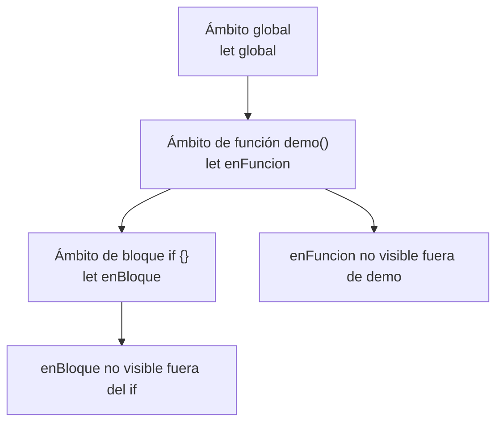
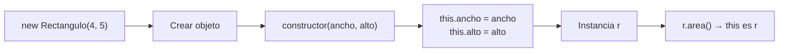
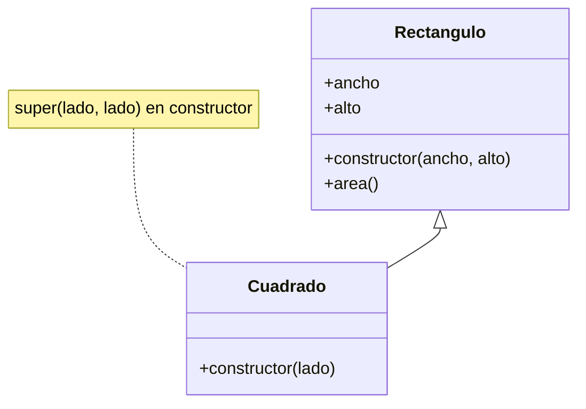
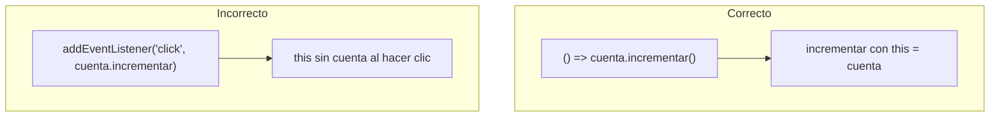

## Conceptos clave

- **`this`:** palabra clave que apunta al **contexto de ejecución** de una función — no es un argumento ni una variable que declares. Su valor depende de **cómo** se invoca la función, no solo de dónde está escrita.
- **Método de objeto:** función almacenada como propiedad (`obj.mostrar`). Al llamar `obj.mostrar()`, `this` suele ser `obj` — puedes acceder a otras propiedades con `this.propiedad`.
- **Llamada suelta (modo no estricto):** `const fn = obj.mostrar; fn()` — al extraer el método y llamarlo sin el objeto delante, `this` puede ser `undefined` (modo estricto) o el objeto global `window` (legacy). Es la causa clásica del bug “`this` es undefined”.
- **Modo estricto (`"use strict"`):** en funciones normales, `this` en llamada suelta es `undefined`; evita contaminar el global por accidente.
- **`this` en funciones flecha:** **no** tiene su propio `this`; lo **hereda léxicamente** del ámbito donde se definió la flecha (closure del `this` exterior). Ideal para callbacks que deben conservar el `this` del objeto que los creó.
- **Ámbito (scope):** región del código donde un identificador (variable, función) es **visible** y puede usarse. Si no está en scope, obtienes `ReferenceError`.
- **Ámbito global:** declaraciones en el nivel superior del script o módulo. En apps grandes conviene **no** llenar el global de nombres sueltos — riesgo de colisiones y bugs difíciles de rastrear.
- **Ámbito de función:** variables declaradas con `var`, `let` o `const` **dentro** de una función existen solo ahí (y en closures internas). Parámetros también son locales a la función.
- **Ámbito de bloque:** `let` y `const` dentro de `{ }` (bloque `if`, `for`, etc.) no son visibles fuera del bloque. `var` **no** respeta bloque — solo función — (legacy; preferir `let`/`const`).
- **Sombreado (shadowing):** declarar `let x` dentro de un bloque interno oculta el `x` del bloque exterior en esa región; puede confundir al depurar.
- **Objeto literal vs clase:** en lección 7 viste `{ clave: valor, metodo() {} }`. Las **clases ES6** (`class`) ofrecen sintaxis clara para **plantillas** de objetos con constructor y métodos compartidos en el prototipo.
- **`class Nombre { }`:** declaración de una “molde” para instancias. No es un objeto en sí: hay que usar `new` para crear instancias.
- **`constructor`:** método especial que se ejecuta al hacer `new Clase(args)`. Inicializa propiedades de instancia con `this.prop = valor`.
- **`this` en clases:** dentro del constructor y métodos de instancia, `this` es la **instancia** recién creada o la que recibe la llamada (`r.area()` → `this` es `r`).
- **Métodos de instancia:** `area() { return this.ancho * this.alto; }` — viven en el prototipo; todas las instancias comparten la misma función, cada una con su propio `this`.
- **`new Rectangulo(4, 5)`:** crea objeto, enlaza `this`, ejecuta `constructor`, devuelve la instancia (salvo que el constructor devuelva otro objeto explícitamente — caso avanzado).
- **Herencia con `extends`:** `class Cuadrado extends Rectangulo` — `Cuadrado` hereda métodos y comportamiento de `Rectangulo`.
- **`super`:** dentro de una subclase, llama al constructor o métodos de la **clase padre**. En el constructor hijo, `super(...)` debe ejecutarse **antes** de usar `this` en la subclase.
- **Azúcar sintáctico sobre prototipos:** `class` / `extends` / `super` son una capa legible sobre el modelo de prototipos de JavaScript; en PBPEW basta con la sintaxis moderna.
- **Cuándo usar flecha en métodos:** evita flecha como **método de instancia** si necesitas `this` dinámico de la instancia — la flecha no enlaza `this` al objeto que llama. Úsala en callbacks dentro de métodos (`items.forEach((x) => this.procesar(x))`).
- **Preview lección 9:** estructuras de datos (pilas, colas) suelen modelarse con clases u objetos con métodos que usan `this` para el estado interno.

## Errores comunes

- **Perder `this` al pasar un método como callback:** `boton.addEventListener("click", cuenta.incrementar)` — `incrementar` pierde la referencia a `cuenta`. Soluciones: `() => cuenta.incrementar()`, `.bind(cuenta)`, o flecha en la definición del método si el diseño lo permite.
- **Usar flecha como método de objeto/clase esperando `this` de la instancia:** `class Foo { incrementar = () => this.n++ }` funciona por herencia léxica, pero `incrementar() { this.n++ }` es el patrón habitual; mezclar sin entender confunde en exámenes y entrevistas.
- **Olvidar `new` al instanciar:** `const r = Rectangulo(4, 5)` sin `new` falla o comportamiento inesperado; con clases ES6 suele lanzar `TypeError: Class constructor Rectangulo cannot be invoked without 'new'`.
- **Usar `this` antes de `super()` en constructor hijo:** `class B extends A { constructor() { this.x = 1; super(); } }` → `ReferenceError`. Primero `super(...)`, luego `this`.
- **Confundir ámbito de bloque con ámbito de función:** `if (true) { let x = 1; } console.log(x)` → `ReferenceError`. Con `var` no habría error pero `x` sería `undefined` fuera — otro bug sutil.
- **Reutilizar `var` en bucles con callbacks (legacy):** `for (var i = 0; i < 3; i++) { setTimeout(() => console.log(i), 100); }` imprime `3` tres veces. Con `let` cada iteración tiene su propio `i`.
- **Contaminar el global:** `contador = 0` sin `let`/`const` en sloppy mode crea propiedad global. Usar siempre `let`/`const` y módulos/scripts encapsulados.
- **Asumir que `this` es siempre el objeto “lógico”:** en una función normal llamada como callback suelta, `this` no es el objeto del dominio — depende del **llamador** (o es `undefined` en strict).
- **Duplicar lógica del padre sin `super`:** reescribir todo el constructor del padre en el hijo en lugar de `super(lado, lado)` — frágil si el padre cambia.
- **Confundir `this` con el parámetro del constructor:** `constructor(nombre) { nombre = this.nombre }` asigna al parámetro, no a la instancia; debe ser `this.nombre = nombre`.

## Casos reales

### 1. Contador de clics: el badge siempre muestra `NaN`

Un componente de UI define `const panel = { total: 0, registrar() { this.total++; } }` y pasa `panel.registrar` a `boton.addEventListener("click", panel.registrar)`. Cada clic incrementa `this.total` del contexto equivocado (`undefined` o `window`), no de `panel`. El badge ligado a `panel.total` no cambia; en consola aparecen errores intermitentes.

**Decisión clave:** enlazar el contexto (`panel.registrar.bind(panel)`), usar wrapper flecha (`() => panel.registrar()`), o definir el handler como flecha que cierra sobre `panel` si el diseño lo permite.

### 2. Modelo de inventario: subclase sin `super` rompe el despliegue

Un equipo modela `class Producto` con `constructor(sku, precio)` y `class ProductoDigital extends Producto` con constructor que asigna `this.sku` sin llamar `super(sku, precio)`. En CI los tests fallan con `ReferenceError: Must call super constructor`. El fix es una línea, pero el PR retrasó release porque nadie revisó la regla de `super` en constructores hijos.

**Lección:** en herencia ES6, el constructor de la subclase **debe** invocar `super(...)` antes de tocar `this`; los métodos heredados (`calcularDescuento`) siguen disponibles en la instancia hija.

## Ejemplos de código sugeridos

### `this` en método de objeto

```javascript
const caja = {
  valor: 10,
  mostrar() {
    console.log(this.valor);
  },
};

caja.mostrar(); // 10 — this es caja
```

### Pérdida de `this` y corrección con flecha wrapper

```javascript
const cuenta = {
  total: 0,
  incrementar() {
    this.total++;
  },
};

// ❌ Pierde contexto
// boton.addEventListener("click", cuenta.incrementar);

// ✅ Wrapper flecha conserva cuenta del closure; incrementar usa this = cuenta
boton.addEventListener("click", () => cuenta.incrementar());
```

### `this` en función suelta vs flecha (contraste con lección 6)

```javascript
"use strict";

const objeto = {
  etiqueta: "demo",
  metodoNormal() {
    console.log(this.etiqueta);
  },
  metodoFlecha: () => {
    console.log(this.etiqueta); // this léxico — NO es objeto
  },
};

objeto.metodoNormal(); // "demo"
objeto.metodoFlecha(); // undefined (this exterior, p. ej. undefined en módulo)
```

### Ámbito global, de función y de bloque

```javascript
let global = "visible arriba";

function demo() {
  let enFuncion = "solo aquí";
  if (true) {
    let enBloque = "solo en el if";
    console.log(enBloque); // OK
  }
  // console.log(enBloque); // ReferenceError
  return enFuncion;
}

console.log(global); // OK
// console.log(enFuncion); // ReferenceError
```

### `let` en bucle vs `var` (callback)

```javascript
// Con let — cada iteración tiene su i
for (let i = 0; i < 3; i++) {
  setTimeout(() => console.log(i), 50);
}
// 0, 1, 2

// Con var — un solo i compartido (evitar)
for (var j = 0; j < 3; j++) {
  setTimeout(() => console.log(j), 50);
}
// 3, 3, 3
```

### Clase con constructor y método

```javascript
class Rectangulo {
  constructor(ancho, alto) {
    this.ancho = ancho;
    this.alto = alto;
  }
  area() {
    return this.ancho * this.alto;
  }
}

const r = new Rectangulo(4, 5);
console.log(r.area()); // 20
```

### Herencia con `extends` y `super`

```javascript
class Cuadrado extends Rectangulo {
  constructor(lado) {
    super(lado, lado); // inicializa ancho y alto en el padre
  }
}

const c = new Cuadrado(3);
console.log(c.area()); // 9 — hereda area() del padre
```

### Flecha dentro de método de clase (patrón útil)

```javascript
class Lista {
  constructor() {
    this.items = [];
  }
  agregar(valor) {
    this.items.push(valor);
  }
  cadaUno(fn) {
    this.items.forEach((item) => fn(item, this)); // this de Lista disponible
  }
}
```

## Ejercicios de práctica

- **tipo:** reflexion — ¿Por qué `this` no es una variable que puedas asignar como `let x = 5`? (respuesta esperada: es un binding especial determinado por la forma de llamada / reglas léxicas en flechas).
- **tipo:** reflexion — Explica la diferencia entre ámbito de función y ámbito de bloque con `let` frente a `var` en un `if`.
- **tipo:** codigo — Crea un objeto `contador` con `valor: 0` y método `subir()` que haga `this.valor++`. Llama `contador.subir()` dos veces y muestra `contador.valor`.
- **tipo:** codigo — Define `class Circulo` con `constructor(radio)`, propiedad `this.radio` y método `diametro()` que devuelva `this.radio * 2`. Instancia con `new Circulo(5)` y comprueba el resultado.
- **tipo:** completar-codigo — Completa la subclase: `class Cuadrado extends ___ { constructor(lado) { ___(lado, lado); } }` → `Rectangulo`, `super`.
- **tipo:** completar-codigo — Completa para ámbito de bloque: `if (true) { ___ x = 10; }` → `let` o `const` (no `var` si quieres que falle fuera).
- **tipo:** ordenar-pasos — Ordena `const r = new Rectangulo(2, 3);`: (a) se crea objeto vacío, (b) se ejecuta `constructor` con `this` enlazado, (c) se asignan `this.ancho` y `this.alto`, (d) se devuelve la instancia a `r`, (e) `r.area()` usa `this` = `r`.
- **tipo:** diagrama — Dibuja tres cajas anidadas: global → función `demo` → bloque `if`, y coloca dónde viven `global`, `enFuncion`, `enBloque`.
- **tipo:** reflexion — ¿Por qué `boton.addEventListener("click", objeto.manejar)` puede fallar mientras `boton.addEventListener("click", () => objeto.manejar())` suele funcionar?

## Animación o visual sugerida

- **CompareTable — `function` vs flecha respecto a `this`:**

  | Aspecto | `function` método | Flecha `=>` |
  |---------|-------------------|-------------|
  | `this` en `obj.metodo()` | Suele ser `obj` | Léxico (del scope exterior) |
  | Callback suelta | `undefined` (strict) o global | Igual que donde se definió |
  | Uso típico PBPEW | Métodos de objeto/clase | Callbacks dentro de métodos |

- **StepReveal — capas de scope:** línea global → entrar a función → entrar a bloque `if` → salir y ver qué nombres desaparecen.
- **StepReveal — `new Rectangulo(4, 5)`:** crear objeto → ejecutar `constructor` → asignar propiedades en `this` → instancia lista → llamada `r.area()`.
- **MermaidDiagram — herencia:** `Rectangulo` arriba, `Cuadrado extends` flecha hacia abajo, `super(lado, lado)` en constructor hijo.
- **CompareTable — tipos de ámbito:**

  | Tipo | Declaración típica | Visible fuera de... |
  |------|--------------------|---------------------|
  | Global | top-level `let`/`const` | N/A (todo el módulo/script) |
  | Función | dentro de `function` | La función |
  | Bloque | `let`/`const` en `{ }` | Ese bloque |

## Diagrama Mermaid (si aplica)

### Capas de ámbito (scope)



### Flujo: `new` y `constructor`



### Herencia: `extends` y `super`



### Pérdida de `this` en callback



## Reto integrador

**“Mini carrito con clases y contexto”**

Implementa en un solo archivo (consola o `<script>`):

1. `class Producto` con `constructor(nombre, precio)`, propiedades `this.nombre`, `this.precio` y método `resumen()` que devuelva `` `${this.nombre}: $${this.precio}` ``.
2. `class ProductoConDescuento extends Producto` con constructor `(nombre, precio, porcentaje)` que llame `super(nombre, precio)` y guarde `this.porcentaje`. Sobrescribe `resumen()` para devolver el texto del padre más ` (desc. ${this.porcentaje}%)` — usa `super.resumen()` dentro del método hijo.
3. `class Carrito` con `constructor()` que inicialice `this.items = []`, método `agregar(producto)` que haga `push`, y `total()` que sume `producto.precio` de cada item con un bucle `for` (lección 5).
4. Crea instancias, agrega al carrito y muestra `carrito.total()` y cada `item.resumen()`.
5. Simula un botón: función `registrarAgregar(carrito, producto)` que devuelve **una flecha** `() => carrito.agregar(producto)` para usar como callback sin perder `this` del carrito.

**Criterio de éxito:** usa `class`, `extends`, `super` en constructor y método, `this` coherente en métodos de instancia, ámbito local con `let`/`const`, callback flecha que no pierde el carrito, sin variables globales sueltas.

## Preguntas sugeridas para quiz (5)

1. **En `caja.mostrar()` donde `mostrar` es método de `caja`, ¿qué suele ser `this` dentro de `mostrar`?**
   - A) El objeto global `window` siempre
   - B) El objeto `caja`
   - C) `undefined` siempre
   - D) El archivo HTML
   - **Correcta:** B
   - **Feedback:** En una llamada como `objeto.metodo()`, el punto antes del método enlaza `this` al objeto que está a la izquierda.

2. **¿Qué ámbito tiene una variable declarada con `let` dentro de un bloque `{ }`?**
   - A) Global en todo el programa
   - B) Solo dentro de ese bloque
   - C) Solo en el navegador, no en Node
   - D) En todos los archivos del proyecto
   - **Correcta:** B
   - **Feedback:** `let` y `const` respetan ámbito de bloque. Fuera del `{ }` el nombre no existe — `ReferenceError` si intentas usarlo.

3. **¿Qué hace `super(lado, lado)` en el constructor de `class Cuadrado extends Rectangulo`?**
   - A) Elimina la clase padre
   - B) Invoca el constructor de `Rectangulo` con esos argumentos
   - C) Crea una variable global `super`
   - D) Convierte la clase en función flecha
   - **Correcta:** B
   - **Feedback:** `super(...)` en un constructor hijo delega la inicialización al padre. Debe ejecutarse antes de usar `this` en la subclase.

4. **¿Cuál es la diferencia principal de `this` en una función flecha frente a una `function` normal usada como método?**
   - A) La flecha no tiene `this` propio; lo toma del ámbito donde se escribió
   - B) La flecha siempre usa `window`
   - C) No hay diferencia
   - D) La flecha no puede usarse en callbacks
   - **Correcta:** A
   - **Feedback:** Las flechas heredan `this` léxicamente. Las funciones normales lo fijan según quién las llama — crucial en métodos y callbacks.

5. **¿Por qué `const r = Rectangulo(4, 5)` sin `new` suele fallar con clases ES6?**
   - A) Porque `Rectangulo` es un array
   - B) Porque los constructores de clase deben invocarse con `new`
   - C) Porque falta `extends`
   - D) Porque `4` y `5` no son números
   - **Correcta:** B
   - **Feedback:** `class` define constructores que esperan `new`. Sin `new` obtienes `TypeError` en entornos modernos.

## Referencias

- Contenido TSX migrado: `src/components/teaching/lessons/pbpew/08-this-scope-clases/`
- Secciones existentes: `ThisSection`, `AmbitoScopeSection`, `ClasesYMetodosSection`, `HerenciaSection`, `ResumenSection`
- Legacy (insumo): `kb/archive/legacy-pages/teaching/pbpew/08-this-scope-clases.html`
- MDN — `this`: https://developer.mozilla.org/es/docs/Web/JavaScript/Reference/Operators/this
- MDN — Scope (glosario): https://developer.mozilla.org/es/docs/Glossary/Scope
- MDN — `let`: https://developer.mozilla.org/es/docs/Web/JavaScript/Reference/Statements/let
- MDN — Classes: https://developer.mozilla.org/es/docs/Web/JavaScript/Reference/Classes
- MDN — `extends`: https://developer.mozilla.org/es/docs/Web/JavaScript/Reference/Classes/extends
- MDN — `super`: https://developer.mozilla.org/es/docs/Web/JavaScript/Reference/Operators/super
- MDN — Arrow functions (`this` léxico): https://developer.mozilla.org/es/docs/Web/JavaScript/Reference/Functions/Arrow_functions
- Lección anterior: `07-arrays-json-objetos` (objetos literales, base para métodos y `this`)
- Lección anterior relacionada: `06-funciones-y-callbacks` (flechas y callbacks — ahora `this` en profundidad)
- Lección siguiente: `09-estructuras-de-datos` (pilas/colas — modelado con clases u objetos con estado)
