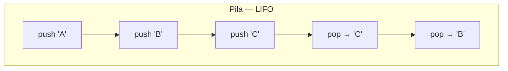
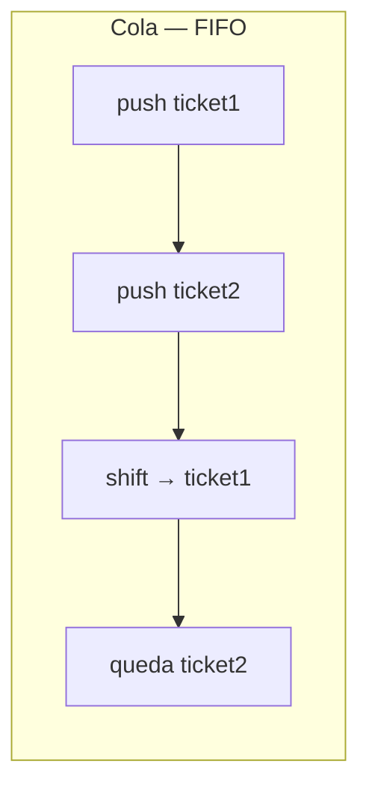
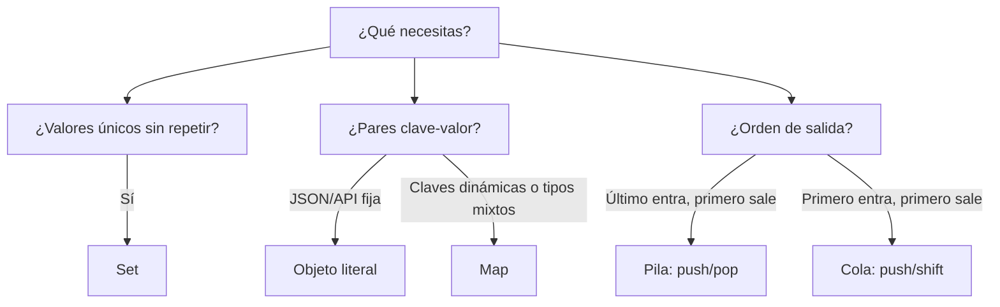

## Conceptos clave

- **Estructura de datos:** forma de organizar y acceder a información en memoria. En PBPEW ya usaste arrays y objetos literales; aquí amplías con `Map`, `Set` y dos **patrones** clásicos: pila y cola.
- **`Map`:** colección de pares **clave → valor** donde la clave puede ser **cualquier tipo** (string, número, objeto, función). Se crea con `new Map()` y se manipula con `.set(clave, valor)`, `.get(clave)`, `.has(clave)`, `.delete(clave)`, `.clear()` y la propiedad `.size`.
- **Objeto literal vs `Map`:** ambos guardan pares clave-valor. El objeto convierte claves no-string a string (`123` → `"123"`), hereda de `Object.prototype` y se itera con `Object.keys`. `Map` mantiene el tipo real de la clave, no mezcla con prototipo y conserva el **orden de inserción** al iterar con `.keys()`, `.values()` o `.entries()`.
- **Cuándo preferir `Map`:** claves dinámicas de tipos variados, muchas altas/bajas de entradas, necesitas `.size` fiable o iterar en orden de inserción sin sorpresas del prototipo.
- **Cuándo preferir objeto:** JSON estático (`{ "nombre": "Ana" }`), contratos de API, configuración con pocas propiedades fijas y serialización directa con `JSON.stringify`.
- **`Set`:** colección de **valores únicos** (sin duplicados). Se crea con `new Set(iterable)` o `new Set()` y usa `.add(valor)`, `.has(valor)`, `.delete(valor)`, `.clear()` y `.size`.
- **Unicidad en `Set`:** `new Set([1, 2, 2, 3])` tiene tamaño 3; la segunda aparición de `2` se ignora. Comparación con `===` (objetos distintos cuentan como distintos aunque tengan el mismo contenido).
- **Casos típicos de `Set`:** eliminar duplicados de un array (`[...new Set(arr)]`), comprobar pertenencia rápida, listas de etiquetas o permisos sin repetir.
- **Pila (stack) — LIFO:** *Last In, First Out*. El último elemento insertado es el primero en salir. Metáfora: pila de platos.
- **Cola (queue) — FIFO:** *First In, First Out*. El primero en entrar es el primero en salir. Metáfora: fila en el banco.
- **Array como pila:** `push` añade al final; `pop` quita y devuelve el último. Operaciones O(1) en la práctica para el final del array.
- **Array como cola (básico):** `push` al final para encolar; `shift` al inicio para desencolar. `shift` en arrays grandes puede ser costoso en tiempo — en producción a veces se usan índices o estructuras dedicadas; en PBPEW basta el patrón didáctico.
- **Patrón vs tipo:** pila y cola no son tipos nativos de JavaScript; son **convenciones** sobre cómo usar un array (u otra estructura). Lo importante es respetar el orden de entrada/salida.
- **Preview lección 10:** colas de eventos del DOM y callbacks encajan con FIFO; historial “deshacer” con pila LIFO.

## Errores comunes

- **Usar `Map` como objeto plano:** `mapa.nombre = "Ana"` no funciona; hace falta `mapa.set("nombre", "Ana")` y `mapa.get("nombre")`.
- **Confundir `.size` con `.length`:** `Map` y `Set` usan `.size`; los arrays usan `.length`.
- **Esperar que `Set` fusione objetos iguales por contenido:** `new Set([{ id: 1 }, { id: 1 }])` tiene tamaño 2 — cada objeto es una referencia distinta.
- **Iterar `Map` con `for...in`:** itera propiedades del objeto wrapper, no las entradas. Usa `for (const [clave, valor] of mapa)` o `mapa.forEach((valor, clave) => ...)`.
- **Pensar que `pop` saca el primero:** en una pila LIFO, `pop` saca el **último** que entró con `push`.
- **Usar `pop` en una cola:** `pop` implementa LIFO, no FIFO. Para cola se desencola con `shift` (o estrategia equivalente al inicio).
- **Olvidar que `shift` muta el array:** modifica el original; si necesitas preservarlo, trabaja sobre una copia o documenta la mutación.
- **Asumir que objeto y `Map` serializan igual:** `JSON.stringify(new Map([[1, 2]]))` devuelve `"{}"` — para persistir un `Map` hay que convertirlo (p. ej. array de pares).
- **Duplicados “invisibles” en `Set` de strings:** `"2"` y `2` son valores distintos para `Set` (tipos distintos con `===`).
- **Mezclar roles en el mismo array:** usar a veces `pop` y a veces `shift` en la misma estructura sin convención clara rompe el contrato pila/cola.

## Casos reales

### 1. Caché de sesión: objeto o `Map` para miles de usuarios

Un dashboard guarda datos por `userId` (número) en un objeto: `cache[userId] = datos`. Al borrar usuarios inactivos recorren `Object.keys` y notan claves convertidas a string y colisiones raras al mezclar con propiedades heredadas de prototipo en tests. Migran a `const cache = new Map()` con `.set(userId, datos)` y `.delete(userId)` — altas/bajas claras y `.size` exacto para métricas.

**Decisión clave:** objeto para payloads JSON fijos; `Map` cuando las claves son dinámicas, de tipos mixtos o el ciclo de vida de entradas es intenso.

### 2. Cola de tickets de soporte que atiende al revés

El equipo modela tickets con un array y usa `push` + `pop` pensando en “el más reciente primero”. Los clientes que esperan desde ayer nunca son atendidos. El bug es de **patrón**: implementaron una pila donde el negocio exige cola FIFO (`push` + `shift` o encolar/desencolar explícito).

**Lección:** elige la estructura según la regla de negocio — LIFO para deshacer/historial reciente; FIFO para turnos, impresión o procesamiento en orden de llegada.

## Ejemplos de código sugeridos

### `Map` básico

```javascript
const edades = new Map();
edades.set("Ana", 21);
edades.set("Luis", 22);
console.log(edades.get("Ana")); // 21
console.log(edades.has("Luis")); // true
console.log(edades.size); // 2

edades.set("Ana", 22); // actualiza
console.log(edades.get("Ana")); // 22
```

### Claves que no son string (ventaja sobre objeto)

```javascript
const porId = new Map();
const usuario = { id: 1, nombre: "Ana" };
porId.set(usuario, "sesión activa");
console.log(porId.get(usuario)); // "sesión activa"

// Con objeto literal la clave sería "[object Object]" — frágil
```

### Iterar un `Map`

```javascript
const precios = new Map([["manzana", 500], ["pera", 600]]);

for (const [fruta, precio] of precios) {
  console.log(fruta, precio);
}

precios.forEach((precio, fruta) => {
  console.log(`${fruta}: ${precio}`);
});
```

### `Set` y eliminar duplicados

```javascript
const ids = new Set([1, 2, 2, 3]);
console.log(ids.size); // 3
console.log(ids.has(2)); // true

const etiquetas = ["js", "web", "js", "pbpew"];
const unicas = [...new Set(etiquetas)];
console.log(unicas); // ["js", "web", "pbpew"]
```

### Pila LIFO con array

```javascript
const pila = [];
pila.push("A");
pila.push("B");
pila.push("C");

console.log(pila.pop()); // "C" — último en entrar
console.log(pila.pop()); // "B"
console.log(pila.length); // 1
```

### Cola FIFO con array

```javascript
const cola = [];
cola.push("ticket1");
cola.push("ticket2");
cola.push("ticket3");

console.log(cola.shift()); // "ticket1" — primero en entrar
console.log(cola.shift()); // "ticket2"
console.log(cola); // ["ticket3"]
```

### Comparación lado a lado: misma secuencia, distinto patrón

```javascript
const elementos = ["x", "y", "z"];

const pila = [...elementos];
console.log(pila.pop()); // "z" — LIFO

const cola = [...elementos];
console.log(cola.shift()); // "x" — FIFO
```

### Objeto vs `Map` (lectura rápida)

```javascript
const configObj = { tema: "oscuro", idioma: "es" };
console.log(configObj.tema); // acceso directo — ideal JSON

const contadorMap = new Map();
contadorMap.set("clics", 0);
contadorMap.set("clics", contadorMap.get("clics") + 1);
console.log(contadorMap.get("clics")); // 1 — ideal claves dinámicas
```

## Ejercicios de práctica

- **tipo:** reflexion — ¿Por qué `new Set([1, 2, 2, 3]).size` es 3 y no 4? (respuesta esperada: `Set` guarda solo valores únicos; el segundo `2` no se almacena otra vez).
- **tipo:** reflexion — Explica con tus palabras la diferencia entre LIFO y FIFO usando la metáfora de platos vs fila del banco.
- **tipo:** codigo — Crea un `Map` `inventario` con al menos dos productos (clave string, valor número). Implementa `function stock(nombre)` que devuelva el stock o `0` si no existe (`get` + valor por defecto).
- **tipo:** codigo — Dado `const nums = [1, 1, 2, 3, 3, 4]`, obtén un array sin duplicados usando `Set` y spread.
- **tipo:** codigo — Simula una pila: con `push`/`pop`, apila `"paso1"`, `"paso2"`, `"paso3"` y muestra en consola el orden en que salen con tres `pop`.
- **tipo:** codigo — Simula una cola de tres tickets con `push`/`shift` y muestra qué ticket se atiende primero y cuál queda pendiente.
- **tipo:** completar-codigo — Completa: `const vistos = new Set(); function registrar(id) { if (vistos.___(id)) return false; vistos.___(id); return true; }` → `has`, `add`.
- **tipo:** completar-codigo — Completa la pila: `const historial = []; historial.___("borrador"); historial.___("guardado"); console.log(historial.___());` → `push`, `push`, `pop` (devuelve `"guardado"`).
- **tipo:** ordenar-pasos — Ordena el flujo FIFO `push("a")`, `push("b")`, `shift()`: (a) queda `["b"]`, (b) se encola `"a"`, (c) se desencola `"a"`, (d) se encola `"b"`.
- **tipo:** diagrama — Dibuja una pila con entradas `push 1`, `push 2`, `push 3` y etiqueta qué valor devuelve el primer `pop`.

## Animación o visual sugerida

- **CompareTable — `Map` vs objeto literal:**

  | Criterio | Objeto `{}` | `Map` |
  |----------|-------------|-------|
  | Tipo de clave | String/Symbol (otros se convierten) | Cualquier tipo |
  | Tamaño | `Object.keys(obj).length` | `.size` |
  | Orden al iterar | Orden parcial / reglas ES | Orden de inserción |
  | JSON | Nativo | Requiere conversión |
  | Caso PBPEW | Config, DTO, respuesta API | Caché dinámica, claves no string |

- **CompareTable — pila vs cola (mismo array, distinto método de salida):**

  | Patrón | Entrada | Salida | Métodos típicos | Ejemplo mental |
  |--------|---------|--------|-----------------|----------------|
  | Pila LIFO | `push` (final) | `pop` (final) | `push` / `pop` | Deshacer en editor |
  | Cola FIFO | `push` (final) | `shift` (inicio) | `push` / `shift` | Tickets de soporte |

- **MermaidDiagram — pila LIFO:** alinear con `PilaSection` (nodos push secuenciales y pop que saca el tope).
- **MermaidDiagram — cola FIFO:** alinear con `ColaSection` (entrada por un extremo, salida por el otro).
- **StepReveal — `Set` elimina duplicados:** paso 1 array con repetidos → paso 2 `new Set` → paso 3 spread a array limpio.

## Diagrama Mermaid (si aplica)

### Pila LIFO: push y pop



### Cola FIFO: push y shift



### Cuándo usar cada estructura (decisión simple)



## Reto integrador

**“Centro de turnos y caché de consultas”**

Implementa en consola o `<script>`:

1. `const cache = new Map()` — función `obtenerUsuario(id)` que, si `cache.has(id)`, devuelva el valor cacheado; si no, simule fetch con un objeto `{ id, nombre: "Usuario " + id }`, guárdalo con `cache.set` y devuélvelo.
2. `const atendidos = new Set()` — al “atender” un ticket, registra su id; si ya está en `atendidos`, ignora duplicados.
3. `const colaTickets = []` — funciones `encolar(id)` (`push`) y `atenderSiguiente()` (`shift`) que devuelva el id atendido o `null` si la cola está vacía.
4. `const historialAcciones = []` — cada vez que atiendes un ticket, `push` el id; función `deshacerUltimaAtencion()` hace `pop` y devuelve el id revertido (pila LIFO de acciones).
5. Flujo de prueba: encola 101, 102, 103 → atiende dos → comprueba orden FIFO (101, 102) → intenta encolar 101 otra vez en `atendidos` y verifica que `Set` evita duplicados → deshace una atención y muestra el id sacado de la pila.

**Criterio de éxito:** usa `Map`, `Set`, cola FIFO y pila LIFO con arrays; no mezcles `pop` en la cola de tickets; nombres de funciones que dejen claro el patrón.

## Preguntas sugeridas para quiz (5)

1. **¿Qué devuelve `const pila = []; pila.push(1); pila.push(2); console.log(pila.pop());`?**
   - A) `1`
   - B) `2`
   - C) `undefined`
   - D) `[1, 2]`
   - **Correcta:** B
   - **Feedback:** `push` añade al final; `pop` quita el último elemento (LIFO). El último en entrar es `2`.

2. **¿Cuál es la forma correcta de guardar un par en un `Map` llamado `m`?**
   - A) `m.clave = valor`
   - B) `m[clave] = valor` sin `set`
   - C) `m.set(clave, valor)`
   - D) `m.add(clave, valor)`
   - **Correcta:** C
   - **Feedback:** `Map` usa `.set` / `.get`. `.add` pertenece a `Set`; la notación de objeto no es la API de `Map`.

3. **¿Qué imprime `console.log(new Set([1, 2, 2, 3]).size);`?**
   - A) `4`
   - B) `2`
   - C) `3`
   - D) `undefined`
   - **Correcta:** C
   - **Feedback:** `Set` almacena valores únicos; el `2` repetido solo cuenta una vez → tamaño 3.

4. **Para una cola FIFO con array, ¿qué combinación es la habitual en esta lección?**
   - A) `push` + `pop`
   - B) `unshift` + `pop`
   - C) `push` + `shift`
   - D) `shift` + `shift`
   - **Correcta:** C
   - **Feedback:** FIFO: entras por un lado (`push` al final) y sales por el otro (`shift` al inicio). `push` + `pop` sería pila (LIFO).

5. **¿Cuándo suele preferirse un `Map` frente a un objeto literal?**
   - A) Siempre, porque JSON no soporta objetos
   - B) Cuando las claves son dinámicas, de tipos variados o hay muchas altas/bajas de entradas
   - C) Solo para guardar funciones, nunca datos
   - D) Cuando necesitas `JSON.stringify` directo sin conversión
   - **Correcta:** B
   - **Feedback:** Los objetos brillan en JSON y esquemas fijos; `Map` gana en cachés y claves no string. `Map` no serializa a JSON de forma útil sin convertir.

## Referencias

- Contenido TSX migrado: `src/components/teaching/lessons/pbpew/09-estructuras-de-datos/`
- Secciones existentes (expandir según brief): `MapSection`, `ResumenSection`
- Secciones sugeridas para layout-spec: `SetSection`, `PilaSection`, `ColaSection`, `MapVsObjetoSection` (o `CompareTable` integrado en `MapSection`)
- Legacy (insumo): `kb/archive/legacy-pages/teaching/pbpew/09-estructuras-de-datos.html`
- MDN — Map: https://developer.mozilla.org/es/docs/Web/JavaScript/Reference/Global_Objects/Map
- MDN — Set: https://developer.mozilla.org/es/docs/Web/JavaScript/Reference/Global_Objects/Set
- MDN — Array.prototype.push: https://developer.mozilla.org/es/docs/Web/JavaScript/Reference/Global_Objects/Array/push
- MDN — Array.prototype.pop: https://developer.mozilla.org/es/docs/Web/JavaScript/Reference/Global_Objects/Array/pop
- MDN — Array.prototype.shift: https://developer.mozilla.org/es/docs/Web/JavaScript/Reference/Global_Objects/Array/shift
- Lección anterior: `08-this-scope-clases` (clases, `this`, scope)
- Lección relacionada: `07-arrays-json-objetos` (arrays y objetos literales — base de pila/cola)
- Lección siguiente: `10-dom-y-eventos` (colas de eventos y callbacks en el navegador)
