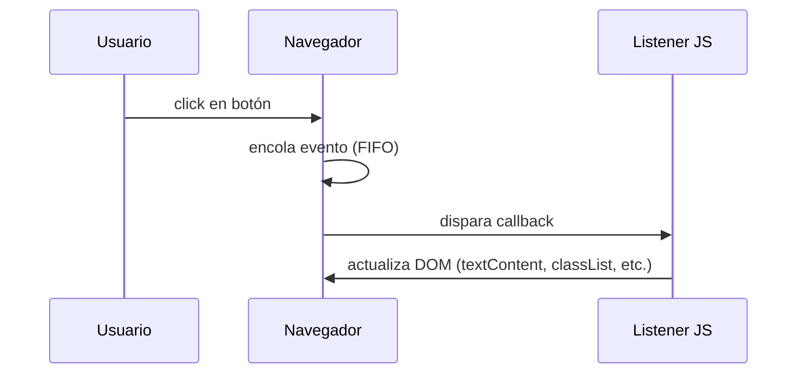
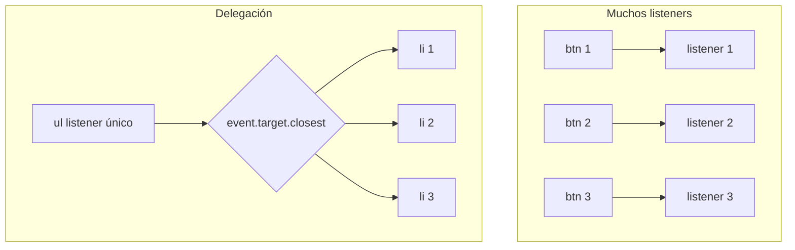
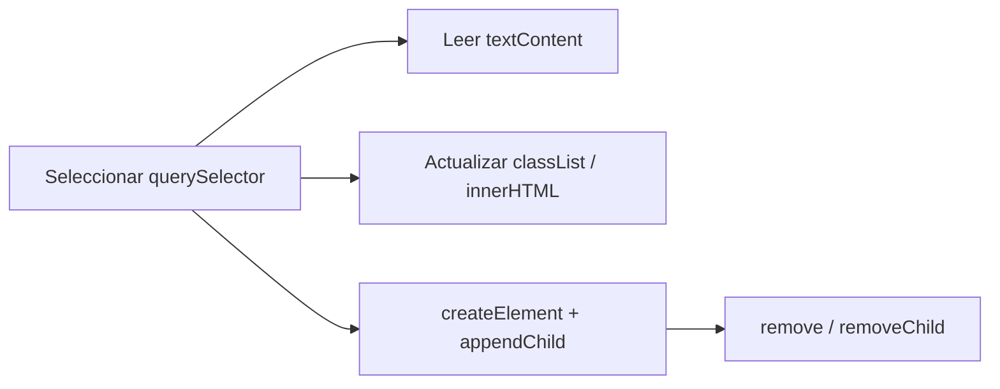

## Conceptos clave

- **DOM mutable:** el árbol que representa la página en memoria se puede **leer, crear, actualizar y borrar** en tiempo de ejecución. En lección 1 viste el concepto; aquí aplicas las APIs concretas.
- **Seleccionar nodos:** punto de partida para cualquier manipulación. APIs principales:
  - `document.querySelector(selectorCSS)` — primer nodo que coincide o `null`.
  - `document.querySelectorAll(selectorCSS)` — `NodeList` estática con todos los coincidencias (no es array; conviene `[...lista]` o `forEach`).
  - `document.getElementById("id")` — un elemento por `id` único.
  - `document.getElementsByClassName("clase")` — colección viva por clase (menos flexible que `querySelectorAll`).
- **Convención PBPEW:** preferir `querySelector` / `querySelectorAll` por flexibilidad (combinan etiqueta, clase, id, atributos). `getElementById` sigue siendo válido cuando solo tienes un `id`.
- **Leer y cambiar contenido:**
  - `textContent` — texto plano; escapa HTML automáticamente al asignar (más seguro para datos de usuario).
  - `innerHTML` — interpreta marcado HTML; útil para plantillas controladas, **peligroso** con entrada no confiable (riesgo XSS).
- **Estilos y clases:**
  - `elemento.style.propiedad = valor` — estilo inline puntual (`color`, `display`, etc.).
  - `elemento.classList` — API moderna: `.add("activo")`, `.remove("oculto")`, `.toggle("visible")`, `.contains("activo")`. Preferible a pelear con `className` como string.
- **Crear y eliminar nodos:**
  - `document.createElement("li")` — crea nodo vacío en memoria (aún no visible).
  - `padre.appendChild(hijo)` — inserta al final del padre.
  - `padre.removeChild(hijo)` o `hijo.remove()` — elimina del árbol.
- **Eventos y `addEventListener`:** el navegador notifica acciones del usuario o del sistema (`click`, `input`, `keydown`, `submit`). `addEventListener(tipo, callback)` separa HTML (estructura) de comportamiento (JS) y permite varios listeners por evento.
- **Objeto evento:** el callback recibe un objeto (p. ej. `evento` o `e`) con propiedades útiles:
  - `evento.type` — nombre del evento (`"click"`).
  - `evento.target` — nodo concreto que originó el evento (p. ej. el `<button>` pulsado).
  - `evento.currentTarget` — nodo donde está registrado el listener (en delegación suele ser el contenedor).
  - `evento.key` — tecla en eventos de teclado (`"Enter"`, `"Escape"`).
  - `evento.preventDefault()` — cancela el comportamiento por defecto del navegador (envío de formulario, seguir un enlace).
- **Cola de eventos (puente lección 9):** el navegador encola eventos y los despacha en orden (FIFO) en el hilo principal; los callbacks de `addEventListener` son funciones que se ejecutan cuando les toca — conecta con callbacks de lección 6 y colas de lección 9.
- **Delegación de eventos:** en lugar de un listener por cada hijo, registras **uno** en un ancestro común y usas `event.target` (a veces con `closest`) para saber qué hijo disparó la acción. Escala mejor en listas dinámicas.
- **Preview lección 11:** fetch, promesas y `async/await` actualizarán el DOM cuando lleguen datos del servidor sin recargar la página.

## Errores comunes

- **Usar `innerHTML` con datos de usuario:** inserta HTML arbitrario y abre la puerta a XSS. Preferir `textContent` o sanitizar en backend.
- **No comprobar `null` tras `querySelector`:** si el selector no existe, llamar `.textContent` lanza `TypeError`. Validar o usar optional chaining con cuidado.
- **Ejecutar JS antes de que exista el DOM:** script en `<head>` sin `defer` que busca `#app` antes de que el HTML esté parseado. Solución: script al final del `<body>`, `defer` o `DOMContentLoaded`.
- **Confundir `onclick` en HTML con `addEventListener`:** el atributo `onclick` mezcla capas y solo admite un handler; `addEventListener` es el patrón PBPEW (múltiples listeners, mejor mantenimiento).
- **Olvidar `preventDefault` en formularios o enlaces:** un `<form>` sin interceptar hace recarga completa; un `<a href="#">` puede saltar al inicio de la página.
- **Pensar que `querySelectorAll` devuelve array:** es `NodeList`; no tiene todos los métodos de array hasta que conviertes o usas `forEach`.
- **Añadir listeners dentro de un bucle sin delegación:** 500 `<li>` con 500 listeners consumen memoria y complican nodos que se crean después. Delegar en el `<ul>`.
- **Usar `event.target` sin filtrar en delegación:** el clic puede caer en un `<span>` dentro del `<button>`; a veces hace falta `event.target.closest("button")`.
- **Modificar `className` manualmente y pisar clases:** `el.className = "activo"` borra otras clases; `classList.add` preserva el resto.
- **Esperar que `removeChild` funcione con referencia incorrecta:** el nodo a eliminar debe ser hijo directo del padre que llama `removeChild`.

## Casos reales

### 1. Formulario de contacto que recarga y pierde datos

Una landing añade validación con JS pero el `<form>` sigue haciendo submit nativo. Al pulsar "Enviar", la página se recarga, se pierde lo escrito y el equipo cree que "el JavaScript no funciona". La consola no muestra error: el handler sí corrió, pero no llamó `event.preventDefault()`.

**Decisión clave:** en `submit`, validar campos y llamar `preventDefault()` si quieres manejar el envío en cliente (o mostrar errores sin recargar). En producción el envío real irá al servidor; en PBPEW basta simular con `console.log` o actualizar un mensaje en el DOM.

### 2. Lista de productos dinámica: un listener por fila

Un panel admin renderiza 200 filas y enlaza `addEventListener("click", ...)` en cada una. Al añadir filas nuevas vía API, los botones recién creados no responden porque el script solo enlazó las filas iniciales. Migran a **un solo listener** en `<tbody>` que lee `event.target.closest("tr")` y actúa según `data-id`.

**Lección:** delegación + `closest` mantiene un solo punto de enlace y funciona con hijos añadidos después.

## Ejemplos de código sugeridos

### Seleccionar nodos

```javascript
const titulo = document.querySelector("h1");
const botones = document.querySelectorAll("button.item");
const porId = document.getElementById("app");
const porClase = document.getElementsByClassName("card");

console.log(titulo?.textContent);
botones.forEach((btn) => console.log(btn));
```

### `textContent` vs `innerHTML`

```javascript
const p = document.querySelector("#mensaje");

p.textContent = "Nuevo texto"; // seguro: muestra texto literal
p.innerHTML = "<strong>Importante</strong>"; // interpreta etiquetas

const usuario = "";
p.textContent = usuario; // se ve como texto — correcto
// p.innerHTML = usuario; // ⚠️ peligroso con entrada externa
```

### Estilos y `classList`

```javascript
const tarjeta = document.querySelector(".card");

tarjeta.style.color = "#0f766e"; // inline puntual
tarjeta.classList.add("activa");
tarjeta.classList.toggle("oculta");
console.log(tarjeta.classList.contains("activa")); // true
```

### Crear y eliminar nodos

```javascript
const lista = document.querySelector("#lista");
const li = document.createElement("li");
li.textContent = "Elemento nuevo";
lista.appendChild(li);

// más tarde:
li.remove(); // o lista.removeChild(li);
```

### `addEventListener` y objeto evento

```javascript
const btn = document.querySelector("#ok");

btn.addEventListener("click", (evento) => {
  console.log("clic en", evento.target);
  console.log("tipo", evento.type);
});

document.addEventListener("keydown", (e) => {
  if (e.key === "Enter") {
    console.log("Enter pulsado");
  }
});
```

### `preventDefault` en formulario

```javascript
const form = document.querySelector("#contacto");

form.addEventListener("submit", (e) => {
  e.preventDefault();
  const email = form.querySelector("[name=email]").value;
  console.log("Enviar simulado:", email);
  // actualizar DOM con mensaje de éxito
});
```

### Delegación en lista

```javascript
const lista = document.querySelector("#lista-tareas");

lista.addEventListener("click", (e) => {
  const boton = e.target.closest("button.eliminar");
  if (!boton) return;

  const li = boton.closest("li");
  li.remove();
});
```

### Contador de clics (alinea `DemoMiniEnLaSection`)

```javascript
let clics = 0;
const contador = document.querySelector("#contador");
const btn = document.querySelector("#pulsar");

btn.addEventListener("click", () => {
  clics += 1;
  contador.textContent = `Clics: ${clics}`;
});
```

## Ejercicios de práctica

- **tipo:** reflexion — ¿Por qué `textContent` es más seguro que `innerHTML` cuando muestras un comentario escrito por un usuario? (respuesta esperada: `innerHTML` interpreta etiquetas y scripts; `textContent` trata todo como texto plano).
- **tipo:** reflexion — Explica la diferencia entre `event.target` y `event.currentTarget` en una lista con delegación.
- **tipo:** codigo — Selecciona `#titulo` y cambia su `textContent` a tu nombre.
- **tipo:** codigo — Crea un `<li>` con `createElement`, asígnale texto y añádelo a `#lista` con `appendChild`.
- **tipo:** codigo — A un botón `#alternar` añade un listener que haga `classList.toggle("activo")` en `#panel`.
- **tipo:** codigo — Escucha `keydown` en `document` e imprime en consola solo cuando la tecla sea `"Escape"`.
- **tipo:** completar-codigo — Completa: `form.addEventListener("submit", (e) => { e.___(); console.log("OK"); });` → `preventDefault`.
- **tipo:** completar-codigo — Completa: `const items = document.___(".item");` → `querySelectorAll`.
- **tipo:** ordenar-pasos — Ordena el flujo al pulsar un botón: (a) navegador encola evento, (b) callback actualiza DOM, (c) usuario hace clic, (d) navegador despacha evento al listener.
- **tipo:** diagrama — Dibuja un `<ul>` con tres `<li>` y un solo listener en el `<ul>`; etiqueta qué nodo es `currentTarget` y cuál puede ser `target` al pulsar el segundo ítem.

## Animación o visual sugerida

- **CompareTable — `textContent` vs `innerHTML`:**

  | Criterio | `textContent` | `innerHTML` |
  |----------|---------------|-------------|
  | Interpreta HTML | No (texto plano) | Sí |
  | Riesgo con usuario | Bajo | Alto (XSS) |
  | Uso PBPEW | Mensajes, contadores, datos | Plantillas fijas controladas por ti |
  | Ejemplo | `p.textContent = userInput` | `p.innerHTML = "<strong>OK</strong>"` |

- **CompareTable — `onclick` vs `addEventListener`:**

  | Criterio | `onclick` en HTML | `addEventListener` |
  |----------|-------------------|------------------|
  | Separación de capas | Mezcla HTML y JS | JS aparte |
  | Varios handlers | Uno (se pisan) | Varios por evento |
  | Patrón PBPEW | Evitar | Preferido |

- **MermaidDiagram — flujo click:** alinear con `SeleccionarNodosSection` (secuencia Usuario → Navegador → Listener JS).
- **StepReveal — delegación:** paso 1 lista con N hijos → paso 2 un listener en padre → paso 3 `event.target` identifica hijo → paso 4 hijos nuevos funcionan sin re-enlazar.
- **Demo interactiva — `DemoMiniEnLaSection`:** botón "Pulsar" + contador "Clics: 0" actualizado con `textContent` (mínimo `PracticeExercise` embebido).

## Diagrama Mermaid (si aplica)

### Flujo de un clic (event loop básico)



### Delegación vs listener por hijo



### CRUD sobre el DOM



## Reto integrador

**“Lista de tareas en la página”**

Implementa en un `<script>` o bloque de práctica con HTML mínimo:

1. Estructura: `<input id="nueva">`, `<button id="agregar">`, `<ul id="lista"></ul>`, `<span id="total">0 tareas</span>`.
2. Al pulsar "Agregar" (o Enter en el input): lee el texto, crea `<li>` con `createElement`, muestra el texto con `textContent`, añade un `<button class="eliminar">×</button>` dentro del `<li>`, y `appendChild` al `<ul>`. Limpia el input.
3. **Delegación:** un solo `addEventListener("click")` en `#lista` que elimine el `<li>` si el clic fue en `.eliminar` (`closest`).
4. Actualiza `#total` con el número de `<li>` tras cada alta o baja (`querySelectorAll("#lista li").length`).
5. Intercepta el submit si usas `<form>` con `preventDefault` para no recargar.
6. Opcional: `classList.toggle("completada")` al hacer clic en el texto del ítem (no en eliminar).

**Criterio de éxito:** usa selección, creación de nodos, `textContent`, `classList`, `addEventListener`, objeto evento, `preventDefault` si aplica y delegación en la lista. Sin `innerHTML` con datos del input.

## Preguntas sugeridas para quiz (5)

1. **¿Qué devuelve `document.querySelector("#inexistente")`?**
   - A) `undefined`
   - B) `null`
   - C) Un elemento vacío
   - D) Lanza error inmediato
   - **Correcta:** B
   - **Feedback:** Sin coincidencias, `querySelector` devuelve `null`. El error aparece si intentas usar propiedades sin comprobar.

2. **¿Cuál es la forma recomendada en PBPEW para reaccionar a un clic sin mezclar HTML y JS?**
   - A) Atributo `onclick="..."` en el botón
   - B) `button.click = function() {}`
   - C) `button.addEventListener("click", handler)`
   - D) Etiqueta `<click>` personalizada
   - **Correcta:** C
   - **Feedback:** `addEventListener` separa comportamiento del marcado y permite varios listeners.

3. **¿Qué hace `event.preventDefault()` en un listener de `submit`?**
   - A) Borra el formulario del DOM
   - B) Evita el envío/recarga por defecto del navegador
   - C) Detiene todos los listeners de la página
   - D) Convierte el evento en síncrono
   - **Correcta:** B
   - **Feedback:** Cancela la acción nativa (p. ej. recargar la página) para que tu JS controle el flujo.

4. **Para mostrar en pantalla un comentario de usuario sin interpretar HTML, ¿qué propiedad usas?**
   - A) `innerHTML`
   - B) `outerHTML`
   - C) `textContent`
   - D) `insertAdjacentHTML`
   - **Correcta:** C
   - **Feedback:** `textContent` trata el valor como texto plano; `innerHTML` parsearía etiquetas y aumenta riesgo XSS.

5. **En delegación de eventos en un `<ul>`, ¿dónde registras el listener?**
   - A) En cada `<li>` dentro de un bucle
   - B) En el `<ul>` padre y usas `event.target` / `closest`
   - C) Solo en `window.onload` sin selector
   - D) En el `<body>` con `innerHTML` del hijo
   - **Correcta:** B
   - **Feedback:** Un listener en el ancestro captura clics de hijos actuales y futuros; `target` identifica el origen.

## Referencias

- Contenido TSX migrado: `src/components/teaching/lessons/pbpew/10-dom-y-eventos/`
- Secciones existentes (expandir según brief): `SeleccionarNodosSection`, `DemoMiniEnLaSection`, `ResumenSection`
- Secciones sugeridas para layout-spec: `ContenidoYEstilosSection`, `CrearNodosSection`, `EventosSection`, `DelegacionSection`, `PreventDefaultSection`, `CierreSection`
- Legacy (insumo): `kb/archive/legacy-pages/teaching/pbpew/10-dom-y-eventos.html`
- MDN — querySelector: https://developer.mozilla.org/es/docs/Web/API/Document/querySelector
- MDN — textContent: https://developer.mozilla.org/es/docs/Web/API/Node/textContent
- MDN — classList: https://developer.mozilla.org/es/docs/Web/API/Element/classList
- MDN — createElement: https://developer.mozilla.org/es/docs/Web/API/Document/createElement
- MDN — addEventListener: https://developer.mozilla.org/es/docs/Web/API/EventTarget/addEventListener
- MDN — Event.preventDefault: https://developer.mozilla.org/es/docs/Web/API/Event/preventDefault
- MDN — Event delegation: https://developer.mozilla.org/es/docs/Learn_web_development/Core/Scripting/Event_bubbling#event_delegation
- Lección anterior: `09-estructuras-de-datos` (cola FIFO — paralelo con cola de eventos del navegador)
- Lección base DOM: `01-intro-js-y-dom` (concepto de árbol y `document`)
- Lección siguiente: `11-asincronia` (actualizar DOM tras fetch/promesas)
