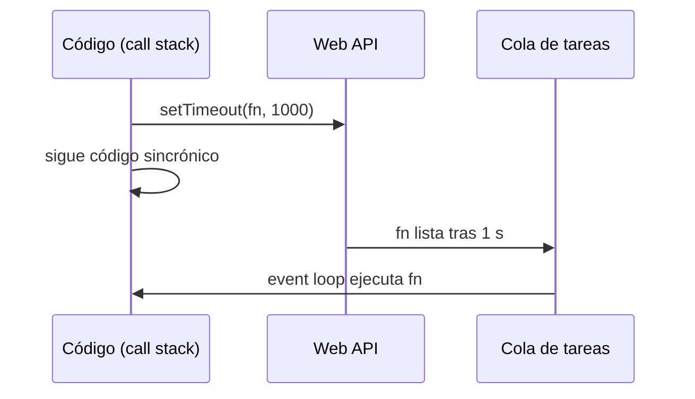
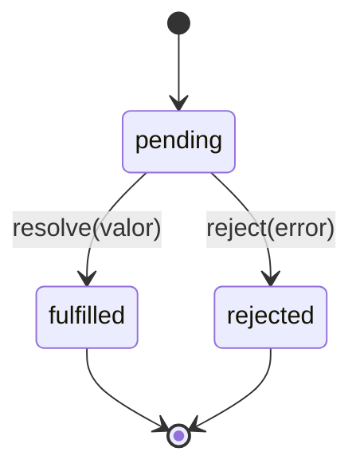
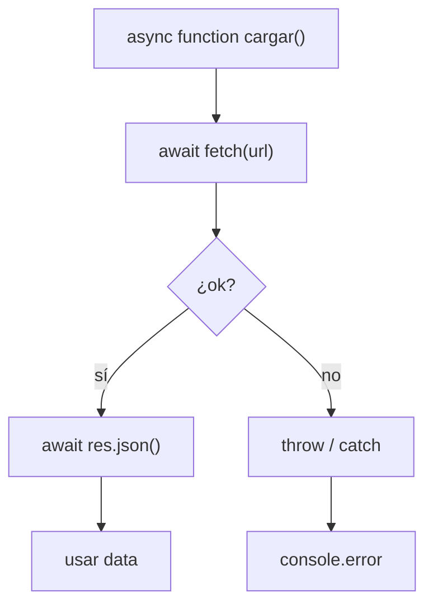

## Conceptos clave

- **Código sincrónico:** se ejecuta **línea a línea**; cada instrucción espera a que termine la anterior antes de continuar. Si una operación tarda (p. ej. un bucle enorme), el hilo principal queda **bloqueado** y la UI puede congelarse.
- **Código asíncrono:** **programa** trabajo que se completará más tarde (temporizador, red, disco) y sigue ejecutando el resto del script. El navegador puede seguir respondiendo a clics y pintar la interfaz mientras espera.
- **Un solo hilo en JS:** JavaScript en el navegador corre en un **hilo principal** (call stack). No hay paralelismo real de tu código de aplicación; la “magia” asíncrona la coordinan el motor y las **Web APIs** del navegador.
- **Event loop (idea básica):** 1) el call stack ejecuta código sincrónico; 2) tareas asíncronas (`setTimeout`, `fetch`, eventos DOM) las gestionan las Web APIs; 3) cuando terminan, sus callbacks van a una **cola de tareas**; 4) cuando el stack está vacío, el event loop saca el siguiente callback y lo ejecuta. No hace falta memorizar implementación interna — sí entender que **“más tarde” ≠ inmediatamente después de la línea actual**.
- **Callback (repaso lección 6):** función que pasas para que se ejecute cuando algo ocurre. `setTimeout(fn, 1000)` y `addEventListener("click", fn)` son asíncronos porque `fn` corre **después**, no en la misma vuelta del stack.
- **`setTimeout(callback, delayMs)`:** programa `callback` tras **al menos** `delayMs` milisegundos. Devuelve un **id numérico** del temporizador. El retardo es mínimo, no exacto — el navegador puede demorar más si el hilo está ocupado.
- **`clearTimeout(id)`:** cancela un `setTimeout` pendiente usando el id devuelto. Si ya se ejecutó, no hace nada.
- **`setInterval(callback, intervalMs)`:** ejecuta `callback` **repetidamente** cada `intervalMs` (mínimo). También devuelve un id.
- **`clearInterval(id)`:** detiene un `setInterval`. Sin esto, el intervalo sigue hasta cerrar la pestaña — fuga de memoria y trabajo innecesario.
- **Orden de impresión clásico:** `console.log("A"); setTimeout(() => console.log("B"), 0); console.log("C");` imprime `A`, `C`, `B` — el timeout, aunque sea 0 ms, entra en la cola y corre **después** del código sincrónico actual.
- **Promesa (`Promise`):** objeto que representa un **valor futuro**: puede estar **pendiente** (*pending*), **cumplida** (*fulfilled/resolved*) o **rechazada** (*rejected*). Encapsula éxito o error de operaciones asíncronas sin anidar callbacks infinitos.
- **Constructor `new Promise((resolve, reject) => { ... })`:** `resolve(valor)` marca éxito; `reject(error)` marca fallo. El ejecutor corre **sincrónicamente** al crear la promesa; lo asíncrono suele estar dentro (p. ej. un `setTimeout` que llama a `resolve`).
- **Patrón `esperar(ms)`:** `return new Promise((resolve) => setTimeout(resolve, ms));` — promesa que se cumple cuando pasa el tiempo. Base para encadenar con `.then`.
- **`.then(onFulfilled)`:** registra qué hacer cuando la promesa se cumple. Devuelve **otra promesa**, lo que permite **encadenar** pasos (transformar datos paso a paso).
- **`.catch(onRejected)`:** maneja rechazos (errores) en la promesa actual o en cualquier `.then` anterior de la cadena. Equivalente a `.then(null, onRejected)`.
- **`.finally(onFinally)`:** se ejecuta **siempre** al terminar (éxito o error). Útil para ocultar spinners, liberar flags o logging; **no** recibe el valor resuelto ni sustituye a `catch`.
- **Encadenamiento con `fetch` (preview):** `fetch(url).then(r => r.json()).then(data => ...).catch(...).finally(...)` — la lección 12 profundiza en HTTP; aquí el foco es el **flujo** de promesas.
- **`async function`:** una función marcada `async` **siempre devuelve una promesa**. Si haces `return 42`, el llamador recibe `Promise` resuelta con `42`.
- **`await`:** solo dentro de funciones `async`. **Pausa** la ejecución de esa función hasta que la promesa a la derecha se settle; mientras tanto, el hilo principal sigue libre. El código **parece** sincrónico pero no bloquea la UI.
- **`try/catch` con `await`:** errores de promesas rechazadas se capturan con `try/catch` igual que excepciones sincrónicas — lectura más clara que `.catch` anidado para flujos lineales.
- **Template literals (secundario):** cadenas con **backticks** `` ` `` que permiten **interpolar** expresiones con `${expresion}` y saltos de línea sin concatenar con `+`. Muy útiles para mensajes de log, UI y URLs con parámetros — no son asíncronos, pero aparecen en esta lección junto al diagrama del event loop.
- **Preview lección 12:** `fetch`, cabeceras, `response.ok` y APIs REST se ven con más detalle; aquí preparas promesas, temporizadores y `async/await` como base.

## Errores comunes

- **Asumir que `setTimeout(fn, 1000)` espera exactamente 1 s:** es un **mínimo**; si el hilo está ocupado, el callback se retrasa.
- **Olvidar `clearInterval`:** un reloj o polling que ya no necesitas sigue ejecutándose y consume CPU.
- **Confundir `clearTimeout` con `clearInterval`:** cada función limpia su propio tipo de temporizador; mezclar ids no cancela el timer correcto.
- **Pensar que `setTimeout(..., 0)` es instantáneo:** solo significa “cuando el stack esté libre”; siempre después del código sincrónico pendiente.
- **Callback hell antes de promesas:** anidar `setTimeout` dentro de `setTimeout` sin estructura — difícil de leer y depurar; promesas y `async/await` aplanan el flujo.
- **No devolver en `.then` al encadenar:** `.then(x => { procesar(x); })` sin `return` hace que el siguiente `.then` reciba `undefined`. Si el siguiente paso necesita el valor, usa `return procesar(x)` o arrow de expresión.
- **Olvidar `.catch` o `try/catch`:** una promesa rechazada sin manejador puede terminar en *unhandled rejection* y fallos silenciosos en producción.
- **Usar `await` fuera de `async`:** `const data = await fetch(...)` en el cuerpo global del script da error de sintaxis (salvo módulos con top-level await — fuera de alcance PBPEW).
- **Creer que `await` bloquea todo el navegador:** solo pausa **esa** función `async`; otros eventos y timers siguen procesándose.
- **Llamar `async function` sin manejar el rechazo:** `cargar()` devuelve una promesa; si falla dentro y no hay `try/catch` ni `.catch` en el llamador, el error se pierde.
- **Mezclar `return` y `.then` sin criterio:** en `async` functions, `return valor` equivale a resolver; `throw err` rechaza la promesa devuelta.
- **`.finally` esperando el resultado:** `finally` no recibe el valor resuelto; para transformar datos usa otro `.then`.
- **Template literal con comillas simples:** `'Hola ${nombre}'` no interpola — hacen falta backticks.
- **Suponer orden entre dos `fetch` paralelos sin coordinar:** quien termine primero no es predecible; usa `Promise.all` (preview) o encadena si hay dependencia.

## Casos reales

### 1. Dashboard que “se congela” al cargar datos

Un equipo pinta un spinner y luego ejecuta un bucle pesado sincrónico para “procesar” 50 000 filas antes de llamar a `setTimeout` para ocultar el spinner. Los usuarios no pueden cerrar modales ni hacer scroll durante 8 segundos. El bug no es el spinner — es **bloquear el hilo principal**. La corrección: trocear el trabajo (`requestAnimationFrame`, `setTimeout(0)` entre lotes) o delegar a Web Worker (avanzado); como mínimo, no mezclar procesamiento masivo sincrónico con expectativa de UI viva.

**Decisión clave:** operaciones largas no deben vivir en código sincrónico continuo si la interfaz debe responder.

### 2. Polling de estado de pago sin `clearInterval`

Un checkout consulta cada 2 s si el pago se confirmó con `setInterval(consultarEstado, 2000)`. Al redirigir a “gracias”, nadie llama `clearInterval`. En segundo plano siguen las peticiones, duplican cargos en logs y a veces muestran toasts en la página equivocada. Además, no hay `.catch` en la promesa del `fetch` — errores 500 quedan sin feedback.

**Lección:** todo temporizador recurrente necesita **ciclo de vida** (crear al montar, limpiar al salir) y toda cadena asíncrona necesita **rama de error** (`catch` o `try/catch`).

## Ejemplos de código sugeridos

### Sincrónico vs asíncrono: orden de salida

```javascript
console.log("1: inicio");

setTimeout(() => {
  console.log("3: timeout");
}, 0);

console.log("2: fin");
// Imprime: 1 → 2 → 3
```

### `setTimeout` y `clearTimeout`

```javascript
const avisoId = setTimeout(() => {
  console.log("Este mensaje no debería verse");
}, 5000);

clearTimeout(avisoId);

setTimeout(() => console.log("Hola tras 1 s"), 1000);
```

### `setInterval` y `clearInterval`

```javascript
let segundos = 0;
const tickId = setInterval(() => {
  segundos += 1;
  console.log(`tic ${segundos}`);
  if (segundos >= 3) {
    clearInterval(tickId);
    console.log("intervalo detenido");
  }
}, 1000);
```

### Promesa manual y `esperar`

```javascript
function esperar(ms) {
  return new Promise((resolve) => setTimeout(resolve, ms));
}

esperar(500).then(() => console.log("listo tras medio segundo"));

const promesa = new Promise((resolve, reject) => {
  const ok = true;
  if (ok) resolve({ id: 1, nombre: "Ana" });
  else reject(new Error("falló"));
});
```

### Encadenamiento `then` / `catch` / `finally`

```javascript
fetch("/api/datos.json")
  .then((response) => response.json())
  .then((data) => console.log(data))
  .catch((err) => console.error("Fallo", err))
  .finally(() => console.log("Fin del intento"));
```

### `async` / `await` con `try/catch`

```javascript
async function cargar() {
  try {
    const res = await fetch("/api/datos.json");
    const data = await res.json();
    console.log(data);
  } catch (e) {
    console.error(e);
  }
}

cargar();
```

### Combinar temporizador y promesa

```javascript
function esperar(ms) {
  return new Promise((resolve) => setTimeout(resolve, ms));
}

async function demo() {
  console.log("A");
  await esperar(1000);
  console.log("B tras 1 s");
}

demo();
```

### Template literals (interpolación y multilínea)

```javascript
const nombre = "Diana";
const saludo = `Hola ${nombre}, bienvenida a PBPEW`;

const multilinea = `
Línea 1
Línea 2
`;

console.log(saludo);
console.log(multilinea);
```

### Error típico: `await` sin `async`

```javascript
// ❌ SyntaxError en script clásico
// const data = await fetch("/api");

// ✅
async function obtener() {
  const data = await fetch("/api");
  return data;
}
```

## Ejercicios de práctica

- **tipo:** reflexion — ¿Por qué `setTimeout(() => console.log("B"), 0)` se imprime después de `console.log("A")` aunque el delay sea 0? (respuesta esperada: el callback entra en la cola de tareas y corre cuando el stack sincrónico termina).
- **tipo:** reflexion — Explica con tus palabras la diferencia entre sincrónico y asíncrono usando el ejemplo de “pedir comida y esperar mirando el móvil sin poder hacer nada” vs “pedir y seguir charlando hasta que llegue”.
- **tipo:** codigo — Escribe `esperar(ms)` que devuelva una promesa resuelta tras `ms` milisegundos. Encadénala para imprimir `"uno"`, esperar 500 ms, imprimir `"dos"`.
- **tipo:** codigo — Crea un `setInterval` que cuente de 1 a 5 cada segundo y se detenga solo con `clearInterval` al llegar a 5.
- **tipo:** codigo — Implementa `async function tresPasos()` que espere 300 ms entre tres `console.log` consecutivos usando `await esperar(300)`.
- **tipo:** completar-codigo — Completa: `fetch("/api/user").___(r => r.json()).___(user => console.log(user.nombre)).___(err => console.error(err));` → `then`, `then`, `catch`.
- **tipo:** completar-codigo — Completa: `___ function leer() { try { const res = ___ fetch("/api"); const data = await res.json(); } catch (e) { console.error(e); } }` → `async`, `await`.
- **tipo:** ordenar-pasos — Ordena el flujo del event loop simplificado: (a) Web API completa el timer, (b) callback a la cola, (c) stack ejecuta código sincrónico, (d) stack vacío, event loop saca callback, (e) se registra `setTimeout`.
- **tipo:** diagrama — Dibuja tres cajas: Call stack, Web APIs, Cola de tareas; flecha de `setTimeout` hacia Web APIs y de vuelta a la cola.
- **tipo:** codigo — Con template literals, crea `const mensaje = \`Usuario ${nombre} tiene ${puntos} puntos\`;` con variables dadas e imprímela.

## Animación o visual sugerida

- **CompareTable — sincrónico vs asíncrono:**

  | Criterio | Sincrónico | Asíncrono |
  |----------|------------|-----------|
  | Orden | Línea a línea, inmediato | Resultado “más tarde” |
  | Bloqueo UI | Sí, si tarda mucho | No, el hilo sigue atendiendo eventos |
  | Ejemplos PBPEW | `for`, cálculos, DOM inmediato | `setTimeout`, `fetch`, listeners |
  | Lectura del código | Secuencial arriba-abajo | Callbacks, `.then`, `await` |

- **CompareTable — `.then` vs `async/await`:**

  | Criterio | Cadena `.then` | `async/await` |
  |----------|----------------|---------------|
  | Estilo | Funcional, encadenado | Imperativo, parecido a sync |
  | Errores | `.catch` al final | `try/catch` local |
  | Cuándo usar en PBPEW | Transformaciones cortas | Flujos lineales largos |

- **MermaidDiagram — event loop (alinear con `TemplateLiteralsSection`):** secuencia Código → Web API → Cola → Código.
- **StepReveal — orden A/C/B:** paso 1 tres `console.log` y `setTimeout(0)` → paso 2 ejecutar → paso 3 resaltar que B sale al final.
- **StepReveal — promesa pendiente → fulfilled:** crear `new Promise`, llamar `resolve` tras timeout, mostrar `.then` ejecutándose después.

## Diagrama Mermaid (si aplica)

### Event loop simplificado (temporizador)



### Estados de una promesa



### Flujo `async/await` con `fetch`



## Reto integrador

**“Panel de carga con reintentos”**

Implementa en consola o `<script>`:

1. `function esperar(ms)` — promesa que resuelve tras `ms` ms (reutiliza el patrón de la lección).
2. `function simularFetch(intentos)` — devuelve una `Promise` que tras `esperar(400)` **rechaza** si `intentos < 2`, y **resuelve** `{ ok: true, datos: "PBPEW" }` si `intentos >= 2` (simula red inestable).
3. `async function cargarConReintentos(max = 3)` — bucle `for` con `await simularFetch(i)`; en `catch`, si quedan intentos, espera 300 ms con `await esperar(300)` y reintenta; si se agotan, muestra error con template literal `` `Falló tras ${max} intentos` ``.
4. `let spinnerId = setInterval(() => console.log("..."), 500)` — al iniciar carga; en `finally` (o bloque al terminar), `clearInterval(spinnerId)`.
5. Flujo de prueba: llamar `cargarConReintentos(3)` y ver spinner hasta éxito en el segundo intento simulado; luego probar con `max = 1` y ver mensaje de fallo.

**Criterio de éxito:** usa promesa + `async/await` + temporizadores con limpieza; maneja rechazos; template literal en mensaje de error; no deja `setInterval` activo al terminar.

## Preguntas sugeridas para quiz (5)

1. **¿Qué imprime este código? `console.log("A"); setTimeout(() => console.log("B"), 0); console.log("C");`**
   - A) `A B C`
   - B) `A C B`
   - C) `B A C`
   - D) `C B A`
   - **Correcta:** B
   - **Feedback:** El `setTimeout`, aunque sea 0 ms, encola el callback; el código sincrónico (`C`) termina antes de que el event loop ejecute `B`.

2. **¿Qué devuelve `setInterval(() => {}, 1000)`?**
   - A) `undefined`
   - B) Un id numérico del intervalo
   - C) Una promesa
   - D) El número de ejecuciones
   - **Correcta:** B
   - **Feedback:** Tanto `setTimeout` como `setInterval` devuelven un id para poder cancelar con `clearTimeout` / `clearInterval`.

3. **En una cadena de promesas, ¿qué hace `.catch(fn)`?**
   - A) Solo captura errores del primer `then`
   - B) Captura rechazos en la promesa o en cualquier `then` anterior de la cadena
   - C) Reemplaza a `finally`
   - D) Convierte la promesa en sincrónica
   - **Correcta:** B
   - **Feedback:** `.catch` es el manejador de rechazo de toda la cadena previa; `.finally` corre siempre pero no sustituye el manejo de errores.

4. **¿Cuál es la forma correcta de usar `await`?**
   - A) En cualquier función normal
   - B) Solo dentro de una función declarada `async` (o contexto módulo avanzado)
   - C) Solo después de `.catch`
   - D) Solo con `setTimeout`
   - **Correcta:** B
   - **Feedback:** `await` pausa una función `async` hasta que la promesa se settle; fuera de `async` hay error de sintaxis en el script clásico de PBPEW.

5. **¿Cuál cadena usa template literal con interpolación?**
   - A) `'Hola ' + nombre`
   - B) `"Hola ${nombre}"`
   - C) `` `Hola ${nombre}` ``
   - D) `'Hola ${nombre}'`
   - **Correcta:** C
   - **Feedback:** La interpolación `${}` solo funciona dentro de backticks; comillas simples o dobles tratan `${nombre}` como texto literal.

## Referencias

- Contenido TSX migrado: `src/components/teaching/lessons/pbpew/11-asincronia/`
- Secciones existentes (expandir según brief): `QueCambiaConLoSection`, `SettimeoutYSetintervalSection`, `ThenCatchFinallySection`, `AsyncAwaitSection`, `TemplateLiteralsSection`, `ResumenSection`
- Legacy (insumo): `kb/archive/legacy-pages/teaching/pbpew/11-asincronia.html`
- MDN — Event loop (concepto): https://developer.mozilla.org/es/docs/Web/JavaScript/Event_loop
- MDN — setTimeout: https://developer.mozilla.org/es/docs/Web/API/setTimeout
- MDN — setInterval: https://developer.mozilla.org/es/docs/Web/API/setInterval
- MDN — Promise: https://developer.mozilla.org/es/docs/Web/JavaScript/Reference/Global_Objects/Promise
- MDN — async function: https://developer.mozilla.org/es/docs/Web/JavaScript/Reference/Statements/async_function
- MDN — await: https://developer.mozilla.org/es/docs/Web/JavaScript/Reference/Operators/await
- MDN — Template literals: https://developer.mozilla.org/es/docs/Web/JavaScript/Reference/Template_literals
- Lección anterior: `10-dom-y-eventos` (eventos, listeners, cola de eventos del navegador)
- Lección relacionada: `06-funciones-y-callbacks` (callbacks — base de temporizadores y promesas)
- Lección siguiente: `12-ajax-fetch` (`fetch`, respuestas HTTP y consumo de APIs)
