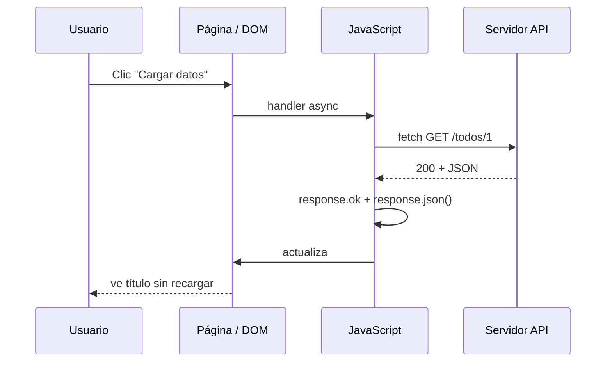
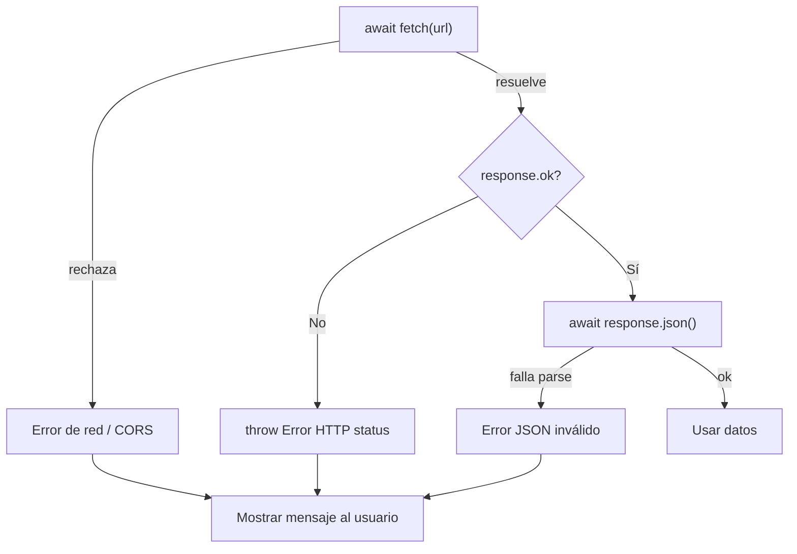
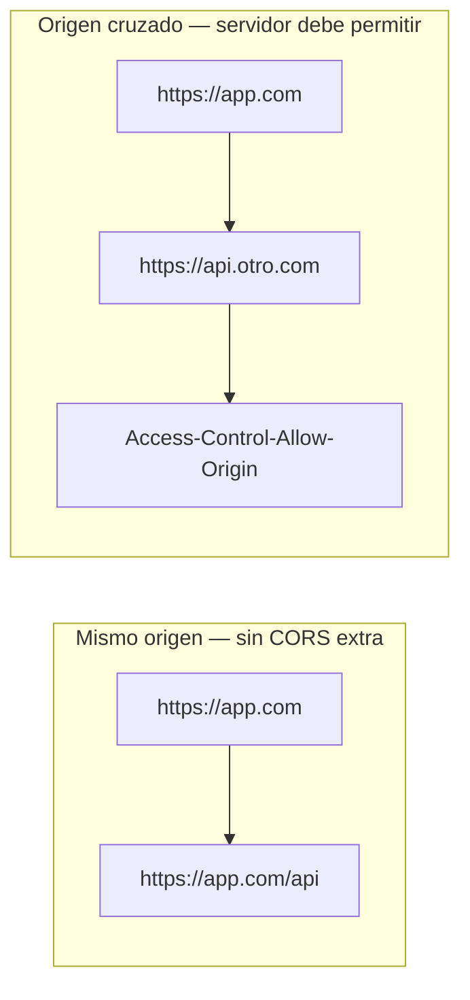

## Conceptos clave

- **AJAX (Asynchronous JavaScript And XML):** enfoque para pedir datos al servidor **sin recargar toda la página**. JavaScript envía una petición HTTP en segundo plano y actualiza solo la parte del DOM que hace falta. El nombre menciona XML por historia; hoy casi todo es **JSON**.
- **Petición HTTP en el navegador:** el front pide un recurso (URL) con un **método** (`GET`, `POST`, …), opcionalmente **cabeceras** (`headers`) y, en `POST`/`PUT`, un **cuerpo** (`body`). El servidor responde con un **código de estado** (`200`, `404`, `500`…) y un cuerpo (texto, JSON, HTML).
- **`fetch(url, options)`:** API moderna del navegador para HTTP. Devuelve una **Promise** que se resuelve con un objeto `Response` — no con los datos ya parseados. Encaja con promesas y `async/await` de la lección 11.
- **Flujo típico con `fetch`:** (1) llamar `fetch`, (2) comprobar `response.ok` o el rango de `status`, (3) leer el cuerpo con `.json()`, `.text()` u otro método, (4) usar los datos en la UI o en lógica.
- **`response.ok`:** atajo booleano: `true` si `status` está entre 200 y 299. **`fetch` no rechaza la Promise por un 404 o 500** — hay que comprobar el estado manualmente.
- **GET vs POST:** `GET` pide datos (sin cuerpo en la práctica didáctica); idempotente y cacheable. `POST` envía datos al servidor (formulario, crear recurso) con `body` y suele usar `Content-Type: application/json` cuando el cuerpo es JSON.
- **Cabeceras (`headers`):** metadatos de la petición o respuesta. Ejemplos: `Content-Type: application/json` (el cuerpo es JSON), `Accept: application/json` (prefiero JSON en la respuesta). En PBPEW basta el objeto plano en el segundo argumento de `fetch`.
- **JSON en la respuesta:** muchas APIs devuelven `Content-Type: application/json`. Tras validar `ok`, se usa `const datos = await response.json()` — devuelve objeto o array de JavaScript (relacionado con lección 07).
- **JSON en el cuerpo (POST):** serializar con `JSON.stringify(objeto)` y enviar en `body`; el servidor interpreta según `Content-Type`.
- **`async/await` con `fetch`:** función `async` + `await fetch(...)` hace el código lineal y legible. Errores de red o lanzados con `throw` se capturan con `try/catch` o `.catch()` al llamar la función.
- **Manejo de errores:** distinguir (a) **error de red** (`fetch` rechaza — sin conexión, CORS bloqueado, URL inválida), (b) **HTTP no exitoso** (`!response.ok` — 404, 500), (c) **JSON inválido** (`response.json()` lanza). La UI debe mostrar mensaje claro, no quedarse en blanco.
- **XMLHttpRequest (XHR):** API legada, más verbosa (`open`, `send`, callbacks `onload`). Aún aparece en código antiguo y en algunas librerías. En código nuevo preferir `fetch`.
- **CORS (Cross-Origin Resource Sharing):** política del navegador. Una página en `https://mi-sitio.com` solo puede llamar por `fetch` a otro origen (dominio/puerto distinto) si el **servidor destino** envía cabeceras que lo permiten (`Access-Control-Allow-Origin`). Sin eso, el navegador bloquea la respuesta aunque el servidor haya contestado.
- **Origen y demos locales:** abrir HTML como `file://` o sin servidor estático puede romper peticiones. Usar servidor local (`npx serve`, Live Server) y APIs públicas que permitan CORS (p. ej. jsonplaceholder.typicode.com).
- **Cierre del track núcleo:** esta lección une DOM, eventos, asincronía y datos remotos — base para los **proyectos** PBPEW que siguen.

## Errores comunes

- **Asumir que `fetch` lanza error en 404/500:** solo rechaza en fallos de red; hay que comprobar `response.ok` o `response.status`.
- **Olvidar `await` en `response.json()`:** sin `await` obtienes una Promise, no el objeto — `console.log(datos.titulo)` falla o muestra `undefined`.
- **Llamar `.json()` dos veces en la misma `Response`:** el cuerpo solo se puede leer una vez; guarda el resultado en una variable.
- **POST sin `Content-Type` ni `JSON.stringify`:** enviar un objeto directo en `body` no produce JSON válido; hace falta `JSON.stringify` y cabecera `application/json`.
- **Ignorar errores de red:** sin `try/catch` o `.catch`, un fallo de CORS o sin conexión deja la UI colgada o un error no capturado en consola.
- **Mostrar datos antes de que termine `fetch`:** el código después de `await fetch` sí espera; el código **fuera** de la función `async` no — actualizar el DOM dentro del flujo async o tras resolver la Promise.
- **Confundir AJAX con una librería:** AJAX es el **patrón**; `fetch` y XHR son **herramientas** para implementarlo.
- **Probar contra API propia sin CORS configurado:** el error en consola menciona CORS; la solución está en el servidor o usar un proxy/API pública de práctica.
- **Usar `GET` con cuerpo:** algunos servidores lo ignoran; para enviar datos usar `POST` (o el método que documente la API).
- **No validar la forma del JSON:** `await res.json()` puede parsear bien pero faltar campos; comprobar propiedades antes de pintar en el DOM.

## Casos reales

### 1. Dashboard que muestra “undefined” tras desplegar a producción

Un equipo muestra el nombre del usuario con `fetch("/api/perfil").then(r => r.json()).then(u => titulo.textContent = u.nombre)`. En staging funciona; en producción la API devuelve `401` sin cuerpo JSON. Como no comprueban `r.ok`, `r.json()` falla o `u` es `null` y la UI muestra “undefined”. Corrigen con: si `!r.ok`, mostrar “Sesión expirada” y redirigir al login; solo parsean JSON cuando el status es exitoso.

**Decisión clave:** tratar códigos HTTP y errores de parseo como parte del contrato de la UI, no solo “si no hay excepción, todo bien”.

### 2. Formulario de contacto que “envía” pero el servidor no recibe JSON

El front hace `fetch("/api/contacto", { method: "POST", body: { email, mensaje } })`. El backend espera JSON pero recibe `[object Object]` o cuerpo vacío. Añaden `headers: { "Content-Type": "application/json" }` y `body: JSON.stringify({ email, mensaje })`. El ticket de soporte deja de aparecer en logs como “parse error”.

**Lección:** POST con JSON requiere serialización explícita y cabecera coherente con lo que el servidor espera.

## Ejemplos de código sugeridos

### GET básico con `fetch` y comprobación de estado

```javascript
fetch("https://jsonplaceholder.typicode.com/todos/1")
  .then((response) => {
    if (!response.ok) {
      throw new Error("HTTP " + response.status);
    }
    return response.json();
  })
  .then((todo) => {
    console.log(todo.title);
  })
  .catch((err) => {
    console.error("Error:", err.message);
  });
```

### GET con `async/await` (recomendado en PBPEW)

```javascript
async function obtenerTodo(id) {
  try {
    const response = await fetch(
      `https://jsonplaceholder.typicode.com/todos/${id}`
    );
    if (!response.ok) {
      throw new Error("HTTP " + response.status);
    }
    const todo = await response.json();
    return todo;
  } catch (error) {
    console.error("No se pudo cargar el todo:", error);
    return null;
  }
}

obtenerTodo(1).then((todo) => {
  if (todo) console.log(todo.title);
});
```

### POST con JSON y cabeceras

```javascript
async function crearPost(titulo, cuerpo) {
  const response = await fetch("https://jsonplaceholder.typicode.com/posts", {
    method: "POST",
    headers: {
      "Content-Type": "application/json",
    },
    body: JSON.stringify({
      title: titulo,
      body: cuerpo,
      userId: 1,
    }),
  });

  if (!response.ok) {
    throw new Error("Error al crear: " + response.status);
  }

  const creado = await response.json();
  console.log("ID asignado (simulado):", creado.id);
  return creado;
}
```

### Actualizar el DOM tras AJAX (patrón típico)

```javascript
const tituloEl = document.querySelector("#titulo-todo");
const boton = document.querySelector("#cargar");

boton.addEventListener("click", async () => {
  tituloEl.textContent = "Cargando…";
  try {
    const res = await fetch("https://jsonplaceholder.typicode.com/todos/1");
    if (!res.ok) throw new Error("HTTP " + res.status);
    const data = await res.json();
    tituloEl.textContent = data.title;
  } catch (e) {
    tituloEl.textContent = "Error al cargar datos";
    console.error(e);
  }
});
```

### XMLHttpRequest mínimo (solo referencia legado)

```javascript
const xhr = new XMLHttpRequest();
xhr.open("GET", "https://jsonplaceholder.typicode.com/todos/1");
xhr.onload = function () {
  if (xhr.status >= 200 && xhr.status < 300) {
    const data = JSON.parse(xhr.responseText);
    console.log(data.title);
  } else {
    console.error("HTTP", xhr.status);
  }
};
xhr.onerror = function () {
  console.error("Error de red");
};
xhr.send();
```

### Comparación mental: XHR vs `fetch`

```javascript
// fetch: Promise nativa, API más corta, encaja con async/await
// XHR: callbacks, más líneas, aún en código legacy

// En proyectos nuevos del curso: usar fetch
```

## Ejercicios de práctica

- **tipo:** reflexion — ¿Por qué AJAX mejoró la experiencia frente a recargar la página entera al enviar un formulario? (respuesta esperada: solo se actualiza la zona necesaria; menos parpadeo y más rápido percibido).
- **tipo:** reflexion — Explica por qué `fetch` puede resolver con `response.status === 404` sin entrar en `.catch()` si no lanzas error manualmente.
- **tipo:** codigo — Escribe `async function getTodo(id)` que haga GET a `https://jsonplaceholder.typicode.com/todos/${id}`, compruebe `ok`, devuelva el objeto JSON o `null` si falla.
- **tipo:** codigo — Con el mismo endpoint, muestra `todo.title` en un `console.log` usando `.then()` encadenado (sin `async/await`).
- **tipo:** codigo — POST a `https://jsonplaceholder.typicode.com/posts` con `title: "Hola"`, `body: "Mundo"`, `userId: 1`; imprime el `id` de la respuesta simulada.
- **tipo:** completar-codigo — Completa: `const res = await fetch(url); if (!res.___) throw new Error("HTTP " + res.status); const data = await res.___();` → `ok`, `json`.
- **tipo:** completar-codigo — Completa el POST: `body: JSON.___({ nombre: "Ana" })` y cabecera `Content-Type: application/___` → `stringify`, `json`.
- **tipo:** ordenar-pasos — Ordena el flujo correcto: (a) `await response.json()`, (b) `await fetch(url)`, (c) comprobar `response.ok`, (d) usar datos en la UI.
- **tipo:** diagrama — Dibuja secuencia: usuario → clic → `fetch` → servidor → JSON → actualización DOM.
- **tipo:** reflexion — ¿Qué es CORS y quién debe “permitirlo”: el navegador del usuario, tu JavaScript o el servidor de la API?

## Animación o visual sugerida

- **StepReveal — flujo `fetch` GET:** paso 1 usuario hace clic → paso 2 `fetch` sale del navegador → paso 3 servidor responde 200 + JSON → paso 4 `response.json()` → paso 5 texto en el DOM.
- **CompareTable — XMLHttpRequest vs `fetch`:**

  | Criterio | XMLHttpRequest | `fetch` |
  |----------|----------------|---------|
  | Estilo | Callbacks (`onload`, `onerror`) | Promises / `async/await` |
  | API | Verbosa (`open`, `send`) | Más compacta |
  | Errores HTTP | Revisar `status` manualmente | Igual: revisar `ok` / `status` |
  | Uso en PBPEW | Solo mención legado | Estándar del curso |

- **CompareTable — GET vs POST (resumen):**

  | | GET | POST |
  |--|-----|------|
  | Uso típico | Leer / listar | Crear / enviar formulario |
  | Cuerpo | No (en práctica PBPEW) | Sí (`JSON.stringify`) |
  | Cabecera frecuente | `Accept: application/json` | `Content-Type: application/json` |

- **DemoEnVivoApiSection:** botón “Cargar título de ejemplo” que llama jsonplaceholder y pinta el título en pantalla; estados: idle, loading, éxito, error (red o HTTP).
- **Callout — CORS:** diagrama simple mismo origen vs origen cruzado; nota “si falla en `file://`, usa servidor local”.

## Diagrama Mermaid (si aplica)

### Flujo AJAX con `fetch` y DOM



### Decisión de errores tras `fetch`



### Origen y CORS (conceptual)



## Reto integrador

**“Mini panel de tareas remotas”**

En una página HTML (o sección de lección) con servidor local:

1. **UI:** input `#nuevo-titulo`, botón “Añadir”, lista `#lista-tareas`, zona `#estado` para mensajes (cargando / error).
2. **Cargar al inicio:** `GET https://jsonplaceholder.typicode.com/todos?_limit=5` — pinta cada `title` en `#lista-tareas` como `<li>`. Muestra “Cargando…” mientras tanto.
3. **Añadir:** al clic, `POST` a `https://jsonplaceholder.typicode.com/todos` con `title` del input, `completed: false`, `userId: 1`; cabeceras y `JSON.stringify` correctos. Al éxito, añade el título a la lista (aunque el id sea simulado) y limpia el input.
4. **Errores:** si `!response.ok` o fallo de red, escribe en `#estado` un mensaje claro (no dejes la lista vacía sin explicación). Opcional: simular error desconectando red o usando URL inválida en una variante de prueba.
5. **Async:** implementa con `async/await` y una función `async function cargarTareas()` reutilizable.

**Criterio de éxito:** GET y POST con `fetch`, comprobación de `ok`, JSON parseado, manejo de errores visible, DOM actualizado sin recargar la página. Sin jQuery ni librerías HTTP externas.

## Preguntas sugeridas para quiz (5)

1. **¿Qué devuelve `fetch(url)` cuando el servidor responde con HTTP 404?**
   - A) Rechaza la Promise inmediatamente
   - B) Resuelve con un `Response` cuyo `ok` es `false`
   - C) Devuelve `null`
   - D) Lanza `SyntaxError`
   - **Correcta:** B
   - **Feedback:** `fetch` solo rechaza en errores de red (o similares). Un 404 sigue siendo una respuesta HTTP válida; debes comprobar `response.ok` o `status`.

2. **¿Cuál es la forma correcta de enviar un objeto JavaScript como JSON en un POST con `fetch`?**
   - A) `body: objeto` sin más
   - B) `body: JSON.stringify(objeto)` y `Content-Type: application/json`
   - C) `body: objeto.toString()`
   - D) Solo `headers: { JSON: true }`
   - **Correcta:** B
   - **Feedback:** El cuerpo HTTP es texto; hay que serializar con `JSON.stringify` y decir al servidor el tipo con `Content-Type`.

3. **Tras `const res = await fetch(url)` con respuesta 200 y cuerpo JSON, ¿qué expresión obtiene el objeto parseado?**
   - A) `res.data`
   - B) `res.body`
   - C) `await res.json()`
   - D) `JSON.parse(res)`
   - **Correcta:** C
   - **Feedback:** `Response` expone métodos asíncronos `.json()`, `.text()`, etc. No hay propiedad `.data` automática.

4. **¿Qué describe mejor AJAX en el contexto del curso?**
   - A) Una librería que hay que instalar con npm
   - B) Un patrón: pedir datos en segundo plano y actualizar parte de la página sin recarga completa
   - C) Un reemplazo de HTML5
   - D) Solo sirve para archivos XML
   - **Correcta:** B
   - **Feedback:** AJAX es el enfoque; `fetch` y XHR son medios para implementarlo. Hoy las respuestas suelen ser JSON.

5. **Una página en `https://mi-app.com` no puede leer la respuesta de `fetch("https://api.externa.com/datos")`. ¿Cuál es la causa más habitual en el navegador?**
   - A) JavaScript no soporta HTTPS
   - B) Falta `async` en la función
   - C) El servidor no permite CORS para ese origen
   - D) Hay que usar XMLHttpRequest obligatoriamente
   - **Correcta:** C
   - **Feedback:** El navegador bloquea respuestas de otro origen si el servidor no envía cabeceras CORS adecuadas. No es un bug de `async/await`.

## Referencias

- Contenido TSX migrado: `src/components/teaching/lessons/pbpew/12-ajax-fetch/`
- Secciones existentes (expandir según brief): `QueEsAjaxSection`, `XmlhttprequestLegadoSection`, `DemoEnVivoApiSection`, `ResumenSection`
- Secciones sugeridas para layout-spec: `FetchGetSection`, `FetchPostSection`, `ManejoErroresSection`, `CorsBasicoSection` (o integrar en secciones existentes)
- Legacy (insumo): `kb/archive/legacy-pages/teaching/pbpew/12-ajax-fetch.html`
- MDN — fetch: https://developer.mozilla.org/es/docs/Web/API/fetch
- MDN — Response: https://developer.mozilla.org/es/docs/Web/API/Response
- MDN — XMLHttpRequest: https://developer.mozilla.org/es/docs/Web/API/XMLHttpRequest
- MDN — CORS: https://developer.mozilla.org/es/docs/Web/HTTP/CORS
- API de práctica: https://jsonplaceholder.typicode.com/
- Lección anterior: `11-asincronia` (promesas, `async/await`, temporizadores)
- Lecciones relacionadas: `07-arrays-json-objetos` (JSON), `10-dom-y-eventos` (actualizar UI tras eventos)
- Siguiente en el track: proyectos PBPEW (última lección núcleo; `next: null` en `lesson-meta.ts`)
