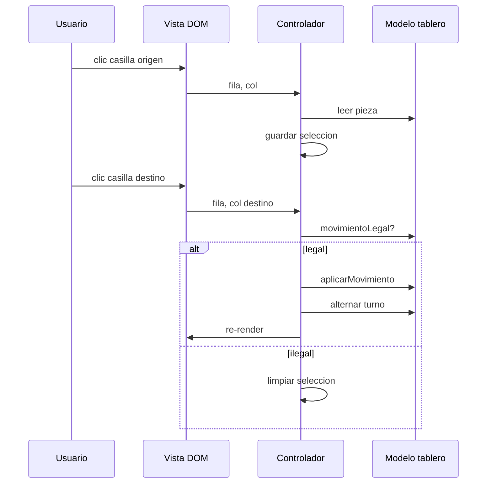
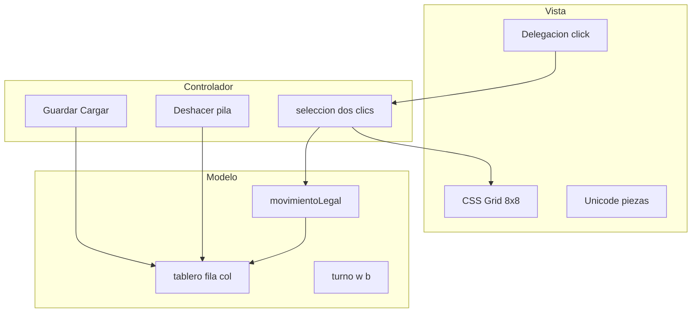
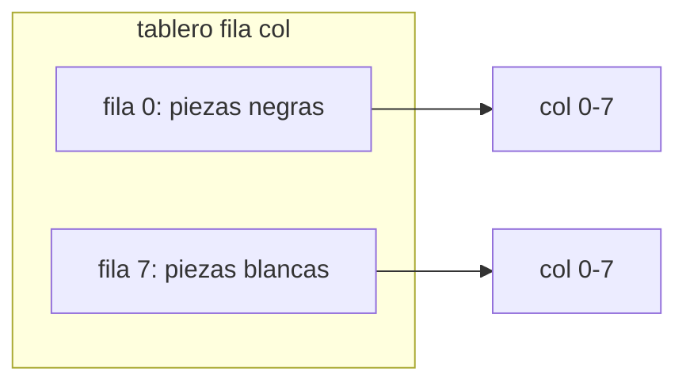
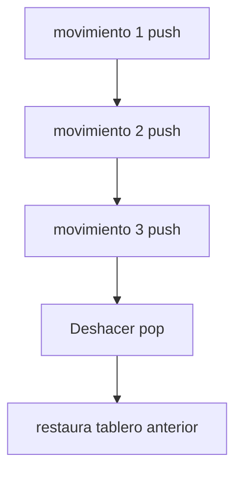

## Conceptos clave

- **Proyecto integrador capstone:** el más complejo del track PBPEW. Combina representación de datos (matriz 2D), renderizado DOM, eventos de clic, validación con condicionales, funciones reutilizables, estado mutable controlado, estructuras auxiliares (pila para deshacer, `localStorage` para guardar) y —opcionalmente— clases para modelar piezas.
- **Tablero como matriz 2D:** convención PBPEW `tablero[fila][col]` con `fila` y `col` entre `0` y `7`. Cada celda guarda `null` (vacía) o un código de pieza, p. ej. `"wP"` (peón blanco), `"bK"` (rey negro). La matriz es la **fuente de verdad**; el DOM solo refleja su estado.
- **Posición inicial:** array de 8 filas × 8 columnas con la disposición estándar (torres en esquinas, peones en fila 1 y 6, rey y reina en el centro). Puede definirse literal o generarse con bucles (lección 5).
- **Coordenadas fila/columna vs notación algebraica:** en código interno usa índices numéricos `0–7`; en UI puedes mostrar `a1–h8` con `String.fromCharCode(97 + col) + (8 - fila)`. No mezclar ambos sistemas sin funciones de conversión explícitas.
- **Renderizado del tablero:** contenedor con CSS Grid `8×8` o tabla semántica. Por cada celda: `data-fila` y `data-col` (o `data-square="e4"`) para identificar clics sin depender del texto visible.
- **Piezas en pantalla:** símbolos Unicode (`♔♕♖♗♘♙` y variantes negras) vía `textContent` — seguro y sin imágenes externas. Alternativa: clases CSS con `background-image` (reto visual avanzado).
- **Estado de la partida (objeto):** además del tablero, guarda `turno` (`"w"` | `"b"`), `seleccion` (`{ fila, col } | null`), `historial` (array o pila de movimientos), `jaque` (booleano opcional). Un solo objeto `estado` evita variables globales sueltas (lección 7).
- **Flujo clic → mover (dos toques):** primer clic en pieza propia → guardar selección y resaltar casilla (`classList.add("seleccionada")`). Segundo clic en destino → validar movimiento → si es legal, actualizar matriz, limpiar selección, alternar turno, volver a pintar.
- **Delegación de eventos:** un solo `addEventListener("click")` en `#tablero`; leer `event.target.closest("[data-fila]")` para saber qué casilla se pulsó (lección 10). Escala si regeneras el tablero entero tras cada movimiento.
- **Validación básica de movimiento (MVP):** funciones puras `esDestinoValido(tablero, origen, destino, pieza)` que comprueben: índices en rango, no capturar pieza propia, reglas mínimas por tipo. Empezar con **rey** (1 casilla en cualquier dirección) y **peón** (1 adelante, 2 desde inicio, captura diagonal) antes de torre/alfil/caballo.
- **Actualizar tablero:** patrón **copiar o mutar con cuidado** — `tablero[destino.fila][destino.col] = pieza; tablero[origen.fila][origen.col] = null`. Re-renderizar todas las casillas o solo las afectadas.
- **Turnos:** tras movimiento legal, `estado.turno = estado.turno === "w" ? "b" : "w"`. Rechazar selección si la pieza no coincide con el color del turno actual.
- **Pila de deshacer (LIFO):** antes de aplicar un movimiento, `historial.push(copiaDelEstado)` o `push({ origen, destino, piezaCapturada })`. Botón "Deshacer" hace `pop` y restaura (lección 9).
- **Persistencia con `localStorage`:** `JSON.stringify(estado)` al guardar; `JSON.parse` al cargar. Manejar `try/catch` si el JSON está corrupto (lección 5 + 12). Clave sugerida: `pbpew-ajedrez-partida`.
- **Promoción de peón (simplificada):** si un peón llega a la última fila, reemplazar automáticamente por dama (`"wQ"` / `"bQ"`) — suficiente para PBPEW; selector de pieza es reto extra.
- **Jaque y fin de partida (nivel avanzado):** detección de jaque al rey requiere simular ataques enemigos — costoso de cero. Para demo docente: integrar librería **chess.js** solo en la capa de reglas, manteniendo tu renderizado DOM propio. El stub TSX actual menciona chess.js como referencia de jaque/mate.
- **Clases (opcional, lección 8):** `class Pieza { constructor(tipo, color) { ... } movimientos(tablero, fila, col) { ... } }` o `class Tablero { constructor() { this.grid = ... } render(contenedor) { ... } }`. Objetos literales + funciones suelen bastar para el MVP; las clases organizan mejor cuando añades 6 tipos de pieza.
- **Separación de capas recomendada:** `modelo.js` (matriz, reglas, historial) · `vista.js` (DOM, clases CSS) · `controlador.js` (listeners, orquestación). Facilita pruebas y el reto de conectar chess.js solo al modelo.
- **Progresión didáctica del proyecto:** (1) tablero estático → (2) clic y selección → (3) movimiento de una pieza con reglas mínimas → (4) turnos y varias piezas → (5) deshacer/guardar → (6) jaque/mate con chess.js o lógica propia reducida.

## Errores comunes

- **Invertir fila y columna:** `tablero[col][fila]` mueve piezas a posiciones incorrectas y rompe la validación. Convención fija: primer índice = fila (0 arriba o 0 abajo — elige una y documenta).
- **Fila 0 arriba vs abajo:** el array tiene fila `0` en la parte superior del array, pero en ajedrez clásico `a1` está abajo. Si el render no invierte filas, las piezas blancas aparecen del lado negro.
- **Mutar el tablero durante la validación:** una función de prueba que mueve piezas temporalmente y olvida revertir deja el estado corrupto. Validar sobre copia superficial (`tablero.map(fila => [...fila])`) o calcular sin mutar.
- **Re-render completo sin limpiar clases:** casillas siguen marcadas como `seleccionada` o `ultimo-movimiento`. Resetear clases en cada pintado o togglear solo las afectadas.
- **Listeners duplicados:** llamar `render()` que añade un nuevo `addEventListener` cada vez → un clic dispara N veces. Registrar el listener **una vez** en el contenedor padre (delegación).
- **Usar `innerHTML` con datos dinámicos:** innecesario para Unicode; riesgo XSS si mezclas nombres de usuario. Preferir `textContent` para símbolos de pieza.
- **Implementar todas las reglas del ajedrez de golpe:** bloqueo típico del alumno. Entregar valor con tablero + 2–3 piezas bien hechas antes de enroque, jaque, mate y regla de captura al paso.
- **No validar turno:** permite mover piezas negras en turno blanco.
- **Olvidar pieza capturada al deshacer:** el `pop` debe restaurar también la celda de captura y el turno previo.
- **`localStorage` sin comprobar `null`:** primera carga → `JSON.parse(null)` o datos inexistentes. Ramificar: si no hay partida guardada, posición inicial.
- **Confundir índice plano con 2D:** `tablero[i]` en array plano de 64 vs `tablero[fila][col]` — no mezclar modelos sin función `aIndice(fila, col)`.
- **Pérdida de `this` en callbacks:** si usas clases, `tablero.onClick` pasado suelto a `addEventListener` pierde contexto (lección 8). Usar flecha o `bind`.

## Casos reales

### 1. App de ajedrez online: el bug de coordenadas invertidas

Un equipo junior representa el tablero como `squares[64]` pero pinta con `fila = col % 8` y `col = Math.floor(col / 8)` intercambiados. En QA los movimientos “legales” en backend (FEN estándar) fallan en frontend: el caballo en `b1` aparece en `a2`. Tres días de depuración hasta centralizar `aCoordenadas(indice)` y `aIndice(fila, col)` con tests unitarios.

**Decisión clave:** una sola convención documentada y funciones de conversión compartidas entre modelo, vista y API — nunca repetir aritmética de índices en cada handler.

### 2. Guardar partida en `localStorage` tras cierre accidental

Una PWA de torneo escolar guarda el estado al cada movimiento con `localStorage.setItem`. Un alumno cierra la pestaña a mitad de partida; al volver, `JSON.parse` falla porque una versión anterior guardó un objeto con referencias circulares (historial enlazado a padres). Añaden esquema versionado `{ version: 1, tablero, turno, historial }` y `try/catch` con fallback a nueva partida.

**Lección:** persistir solo datos serializables (arrays planos, strings, números); validar al cargar; botones explícitos "Guardar" / "Cargar" / "Nueva partida" como en el stub del proyecto.

## Ejemplos de código sugeridos

### Posición inicial como matriz 2D

```javascript
const PIEZA_VACIA = null;

const POSICION_INICIAL = [
  ["bR", "bN", "bB", "bQ", "bK", "bB", "bN", "bR"],
  ["bP", "bP", "bP", "bP", "bP", "bP", "bP", "bP"],
  [PIEZA_VACIA, PIEZA_VACIA, PIEZA_VACIA, PIEZA_VACIA, PIEZA_VACIA, PIEZA_VACIA, PIEZA_VACIA, PIEZA_VACIA],
  [PIEZA_VACIA, PIEZA_VACIA, PIEZA_VACIA, PIEZA_VACIA, PIEZA_VACIA, PIEZA_VACIA, PIEZA_VACIA, PIEZA_VACIA],
  [PIEZA_VACIA, PIEZA_VACIA, PIEZA_VACIA, PIEZA_VACIA, PIEZA_VACIA, PIEZA_VACIA, PIEZA_VACIA, PIEZA_VACIA],
  [PIEZA_VACIA, PIEZA_VACIA, PIEZA_VACIA, PIEZA_VACIA, PIEZA_VACIA, PIEZA_VACIA, PIEZA_VACIA, PIEZA_VACIA],
  ["wP", "wP", "wP", "wP", "wP", "wP", "wP", "wP"],
  ["wR", "wN", "wB", "wQ", "wK", "wB", "wN", "wR"],
];

const SIMBOLOS = {
  wK: "♔", wQ: "♕", wR: "♖", wB: "♗", wN: "♘", wP: "♙",
  bK: "♚", bQ: "♛", bR: "♜", bB: "♝", bN: "♞", bP: "♟",
};
```

### Renderizar tablero en DOM (CSS Grid + delegación)

```javascript
function crearTableroHTML(contenedor, tablero) {
  contenedor.innerHTML = "";
  contenedor.className = "tablero-ajedrez"; // display: grid; grid-template-columns: repeat(8, 1fr);

  for (let fila = 0; fila < 8; fila++) {
    for (let col = 0; col < 8; col++) {
      const celda = document.createElement("button");
      celda.type = "button";
      celda.dataset.fila = String(fila);
      celda.dataset.col = String(col);
      celda.classList.add((fila + col) % 2 === 0 ? "clara" : "oscura");

      const pieza = tablero[fila][col];
      celda.textContent = pieza ? SIMBOLOS[pieza] : "";
      contenedor.appendChild(celda);
    }
  }
}

const contenedor = document.querySelector("#tablero");
crearTableroHTML(contenedor, POSICION_INICIAL);

contenedor.addEventListener("click", (e) => {
  const celda = e.target.closest("[data-fila]");
  if (!celda) return;
  const fila = Number(celda.dataset.fila);
  const col = Number(celda.dataset.col);
  manejarClic(fila, col);
});
```

### Estado y flujo de dos clics

```javascript
const estado = {
  tablero: POSICION_INICIAL.map((fila) => [...fila]),
  turno: "w",
  seleccion: null,
};

function colorDePieza(codigo) {
  return codigo ? codigo[0] : null; // "w" o "b"
}

function manejarClic(fila, col) {
  const pieza = estado.tablero[fila][col];

  if (!estado.seleccion) {
    if (pieza && colorDePieza(pieza) === estado.turno) {
      estado.seleccion = { fila, col };
    }
    return;
  }

  const { fila: f0, col: c0 } = estado.seleccion;
  if (movimientoLegal(estado.tablero, f0, c0, fila, col)) {
    aplicarMovimiento(estado, f0, c0, fila, col);
    estado.turno = estado.turno === "w" ? "b" : "w";
  }
  estado.seleccion = null;
  crearTableroHTML(contenedor, estado.tablero);
}
```

### Validación mínima: rey (1 casilla)

```javascript
function movimientoLegal(tablero, f0, c0, f1, c1) {
  if (f1 < 0 || f1 > 7 || c1 < 0 || c1 > 7) return false;

  const pieza = tablero[f0][c0];
  const destino = tablero[f1][c1];
  if (!pieza) return false;
  if (destino && colorDePieza(destino) === colorDePieza(pieza)) return false;

  const tipo = pieza[1]; // "K", "P", "R", ...
  const df = Math.abs(f1 - f0);
  const dc = Math.abs(c1 - c0);

  if (tipo === "K") return df <= 1 && dc <= 1;
  // ampliar con peón, torre, etc.
  return false;
}

function aplicarMovimiento(estado, f0, c0, f1, c1) {
  const pieza = estado.tablero[f0][c0];
  estado.tablero[f1][c1] = pieza;
  estado.tablero[f0][c0] = null;

  // promoción automática a dama
  if (pieza === "wP" && f1 === 0) estado.tablero[f1][c1] = "wQ";
  if (pieza === "bP" && f1 === 7) estado.tablero[f1][c1] = "bQ";
}
```

### Peón: adelante y captura diagonal (ampliación)

```javascript
function movimientoPeon(tablero, f0, c0, f1, c1, color) {
  const dir = color === "w" ? -1 : 1;
  const filaInicio = color === "w" ? 6 : 1;
  const destino = tablero[f1][c1];

  if (c0 === c1 && !destino) {
    if (f1 === f0 + dir) return true;
    if (f0 === filaInicio && f1 === f0 + 2 * dir && !tablero[f0 + dir][c0]) return true;
  }
  if (Math.abs(c1 - c0) === 1 && f1 === f0 + dir && destino && colorDePieza(destino) !== color) {
    return true;
  }
  return false;
}
```

### Pila de deshacer

```javascript
const historial = [];

function registrarMovimiento(estado) {
  historial.push({
    tablero: estado.tablero.map((fila) => [...fila]),
    turno: estado.turno,
  });
}

function deshacer(estado) {
  const anterior = historial.pop();
  if (!anterior) return;
  estado.tablero = anterior.tablero;
  estado.turno = anterior.turno;
  estado.seleccion = null;
}
```

### Guardar y cargar en `localStorage`

```javascript
const CLAVE = "pbpew-ajedrez-partida";

function guardarPartida(estado) {
  const datos = {
    version: 1,
    tablero: estado.tablero,
    turno: estado.turno,
  };
  localStorage.setItem(CLAVE, JSON.stringify(datos));
}

function cargarPartida(estado) {
  try {
    const raw = localStorage.getItem(CLAVE);
    if (!raw) return false;
    const datos = JSON.parse(raw);
    if (!datos.tablero || !datos.turno) return false;
    estado.tablero = datos.tablero;
    estado.turno = datos.turno;
    return true;
  } catch {
    return false;
  }
}
```

### Clase opcional `Pieza` (organización avanzada)

```javascript
class Pieza {
  constructor(tipo, color) {
    this.tipo = tipo;
    this.color = color;
  }
  codigo() {
    return this.color + this.tipo;
  }
  puedeMoverA(tablero, f0, c0, f1, c1) {
    if (this.tipo === "K") {
      return Math.abs(f1 - f0) <= 1 && Math.abs(c1 - c0) <= 1;
    }
    return false;
  }
}
```

### Integración opcional chess.js (solo reglas)

```javascript
// npm: chess.js — usar solo para validar FEN/movimientos UCI en reto avanzado
import { Chess } from "chess.js";

const juego = new Chess();
// juego.move({ from: "e2", to: "e4" });
// juego.in_check(), juego.isGameOver()
// Sincronizar tu matriz DOM con juego.board() tras cada movimiento legal
```

## Ejercicios de práctica

- **tipo:** reflexion — ¿Por qué la matriz `tablero[fila][col]` debe ser la fuente de verdad y no las posiciones visuales de los nodos DOM? (respuesta esperada: el DOM es solo vista; si solo mueves nodos sin actualizar datos, el estado lógico y la pantalla se desincronizan).
- **tipo:** reflexion — Explica el flujo de dos clics (seleccionar → mover) y qué pasa si el segundo clic es ilegal.
- **tipo:** diagrama — Dibuja una matriz 8×8 e indica qué celda es `tablero[0][0]` y cuál `tablero[7][7]` según tu convención de render.
- **tipo:** codigo — Crea un array 8×8 de `null` y coloca `"wK"` en `tablero[7][4]` y `"bK"` en `tablero[0][4]`.
- **tipo:** codigo — Escribe `function simbolo(codigo)` que devuelva el Unicode correcto o `""` si es `null`.
- **tipo:** codigo — Renderiza un `#tablero` con 64 celdas `button`, alternando clases `clara`/`oscura` con un bucle anidado.
- **tipo:** codigo — Implementa `esCasillaPropia(tablero, fila, col, turno)` que devuelva `true` si hay pieza del color del turno.
- **tipo:** codigo — Añade delegación: un listener en `#tablero` que imprima `fila,col` del `dataset` al hacer clic.
- **tipo:** completar-codigo — Completa validación de rey: `return df <= ___ && dc <= ___` → `1`, `1`.
- **tipo:** completar-codigo — Completa turno: `estado.turno = estado.turno === "w" ? ___ : ___` → `"b"`, `"w"`.
- **tipo:** ordenar-pasos — Ordena el movimiento legal: (a) alternar turno, (b) usuario clic destino, (c) validar con `movimientoLegal`, (d) actualizar matriz, (e) re-renderizar, (f) usuario clic origen.
- **tipo:** codigo — Implementa `deshacer` con array como pila: `push` antes de mover, `pop` al pulsar botón.
- **tipo:** codigo — Guarda `{ tablero, turno }` en `localStorage` con clave `pbpew-ajedrez-partida`.
- **tipo:** reflexion — ¿Cuándo tendría sentido usar chess.js en lugar de escribir todas las reglas a mano?

## Animación o visual sugerida

- **Demo interactiva prioritaria — tablero simplificado:** componente embebido 8×8 con piezas Unicode, clic para seleccionar (resaltado `--color-accent`) y segundo clic para mover con reglas mínimas de rey o peón. Barra: "Nueva partida" | "Deshacer" | "Guardar" | "Cargar". Mínimo viable antes de texto largo.
- **StepReveal — flujo dos clics:** paso 1 tablero inicial → paso 2 clic pieza blanca (selección) → paso 3 clic destino vacío → paso 4 matriz actualizada y turno negro → paso 5 clic ilegal rechazado.
- **CompareTable — matriz 2D vs array plano 64:**

  | Criterio | `tablero[fila][col]` | `casillas[64]` plano |
  |----------|----------------------|----------------------|
  | Legibilidad | Alta (`tablero[3][4]`) | Requiere `fila=Math.floor(i/8)` |
  | Renderizado | Bucles anidados naturales | Un solo bucle |
  | Copia para deshacer | `map` por fila | `slice()` o spread |
  | Caso PBPEW | **Recomendado** | Válido si documentas conversión |

- **CompareTable — reglas propias vs chess.js:**

  | Criterio | Validación manual | chess.js |
  |----------|-------------------|----------|
  | Aprendizaje JS/DOM | Máximo | Menor en reglas |
  | Reglas completas | Muy laborioso | Listo |
  | Uso PBPEW | MVP y peón/rey/torre | Reto final jaque/mate |
  | Dependencia | Ninguna | npm CDN |

- **MermaidDiagram — arquitectura modelo-vista-controlador** (alinear sección de diseño).
- **StepReveal — pila deshacer:** push estado → mover → push → mover → pop restaura penúltimo tablero.

## Diagrama Mermaid (si aplica)

### Flujo clic → validar → actualizar



### Capas del proyecto



### Matriz e índices (convención fila 0 = fila superior del array)



### Pila LIFO deshacer



## Reto integrador

**“Ajedrez en el navegador” — capstone PBPEW (tres niveles)**

### Nivel A — Demo obligatoria (prioridad lesson layout)

1. HTML: `#tablero`, botones `#nueva`, `#deshacer`, `#guardar`, `#cargar`, `#estado` (texto: turno / mensaje).
2. Modelo: `tablero` 8×8, `POSICION_INICIAL`, `estado` con `turno` y `seleccion`.
3. Vista: render completo con Unicode; casillas claras/oscuras; clase `.seleccionada` en la pieza elegida.
4. Control: delegación de clics; movimiento legal al menos para **rey** y **peón**; alternar turno; captura eliminando pieza enemiga.
5. Promoción: peón a dama al llegar a la última fila (automática).
6. Re-render tras cada movimiento legal.

### Nivel B — Persistencia e historial

7. Antes de cada movimiento legal, `historial.push` copia superficial del tablero + turno.
8. "Deshacer" restaura con `pop` (mínimo un nivel; ideal varios).
9. "Guardar" / "Cargar" con `localStorage` y `JSON`; "Nueva partida" resetea a inicial.
10. Manejo de error si carga falla (mensaje en `#estado`, no romper la app).

### Nivel C — Desafíos profundos (elige uno o más)

11. **Reglas ampliadas:** torre (línea recta libre), alfil (diagonal), caballo (L), dama (torre+alfil) — sin atravesar piezas propias (excepto caballo).
12. **Jaque simplificado:** tras mover, comprobar si el rey enemigo está bajo ataque (reutiliza lógica de movimientos sin aplicarlos).
13. **chess.js:** motor de reglas; tu DOM solo refleja `chess.board()`; botones Nueva/Deshacer integrados con `chess.undo()` si aplica.
14. **UX:** resaltar último movimiento, casillas legales al seleccionar (lista de destinos válidos), contador de movimientos.
15. **Clases:** refactor a `class Tablero` y subclases o métodos por tipo de pieza con `extends` (lección 8).

**Criterio de éxito mínimo (Nivel A):** matriz 2D coherente, render 8×8, delegación de eventos, dos clics, validación no trivial, turnos, sin variables globales desordenadas, `textContent` para piezas.

**Criterio excelencia:** Nivel B completo + al menos un ítem de Nivel C documentado en comentarios.

**Integración curricular explícita:**

| Lección | Aplicación en el proyecto |
|---------|---------------------------|
| 01–02 | DOM, script en página |
| 03–04 | tipos, `if`, operadores en validación |
| 05 | bucles render, `try/catch` en carga |
| 06 | callbacks en listeners |
| 07 | matriz, objetos estado, JSON |
| 08 | clases opcionales para piezas |
| 09 | pila deshacer |
| 10 | delegación, `classList`, `dataset` |
| 11–12 | async opcional; `localStorage` + JSON |

## Preguntas sugeridas para quiz (5)

1. **¿Qué estructura es la fuente de verdad del estado del tablero en este proyecto?**
   - A) El HTML generado en `#tablero`
   - B) Un array 2D `tablero[fila][col]` en JavaScript
   - C) Las clases CSS de cada casilla
   - D) `localStorage` en todo momento
   - **Correcta:** B
   - **Feedback:** El DOM refleja el modelo; la lógica lee y escribe la matriz. `localStorage` solo persiste una copia serializada.

2. **¿Por qué conviene un solo `addEventListener("click")` en el contenedor del tablero?**
   - A) Porque los botones no soportan clics
   - B) Delegación: funciona con celdas recreadas al re-render sin re-enlazar N listeners
   - C) Es obligatorio por chess.js
   - D) Para evitar usar `dataset`
   - **Correcta:** B
   - **Feedback:** Al regenerar el tablero, los nodos nuevos siguen burbujeando al padre; un listener central escala (lección 10).

3. **Un peón blanco en `tablero[6][4]` se mueve “adelante” en el modelo con fila decreciente. ¿Qué error típico causa que vaya al revés?**
   - A) Usar `textContent` en lugar de `innerHTML`
   - B) Invertir fila/columna o mezclar fila 0 arriba del array con fila 0 abajo del tablero visual
   - C) No usar `const`
   - D) Olvidar `preventDefault` en un formulario
   - **Correcta:** B
   - **Feedback:** La convención fila/col debe ser consistente entre matriz, validación y render.

4. **¿Qué patrón de la lección 9 usa el botón "Deshacer"?**
   - A) Cola FIFO
   - B) Pila LIFO
   - C) `Set` de movimientos únicos
   - D) `Map` clave-valor de piezas
   - **Correcta:** B
   - **Feedback:** El último movimiento guardado es el primero en revertirse (`push` al mover, `pop` al deshacer).

5. **Al guardar la partida en `localStorage`, ¿qué formato es el adecuado?**
   - A) Guardar el elemento DOM directamente
   - B) `JSON.stringify` de un objeto con `tablero` y `turno`
   - C) Solo el string FEN sin turno
   - D) Un `Map` sin convertir
   - **Correcta:** B
   - **Feedback:** `localStorage` guarda strings; serializa datos planos con JSON. Al cargar, `JSON.parse` y validar (lección 12).

## Referencias

- Stub TSX actual: `src/components/teaching/lessons/pbpew/proyectos/ajedrez/`
- Secciones sugeridas para layout-spec: `ObjetivosSection`, `DemoTableroSection` (prioritaria), `ModeloMatrizSection`, `RenderizadoSection`, `EventosClicSection`, `ValidacionMovimientosSection`, `DeshacerYLocalStorageSection`, `RetoAvanzadoSection`, `CierreSection`
- Otros proyectos PBPEW (complejidad creciente): `proyectos/calculadora` (101), `proyectos/piedra-papel-tijera` (102), `proyectos/todo-list` (103) — **ajedrez es el más complejo (100)**
- Lecciones base: `07-arrays-json-objetos`, `09-estructuras-de-datos`, `10-dom-y-eventos`, `12-ajax-fetch`
- MDN — CSS Grid: https://developer.mozilla.org/es/docs/Web/CSS/CSS_grid_layout
- MDN — `data-*` attributes: https://developer.mozilla.org/es/docs/Learn_web_development/Howto/Solve_HTML_problems/Use_data_attributes
- MDN — `localStorage`: https://developer.mozilla.org/es/docs/Web/API/Window/localStorage
- chess.js (reglas completas, reto avanzado): https://github.com/jhlywa/chess.js
- Wikipedia — Reglas del ajedrez (referencia alumno): https://es.wikipedia.org/wiki/Ajedrez
- Pipeline status: `kb/education/pipeline/pbpew/status.md`
