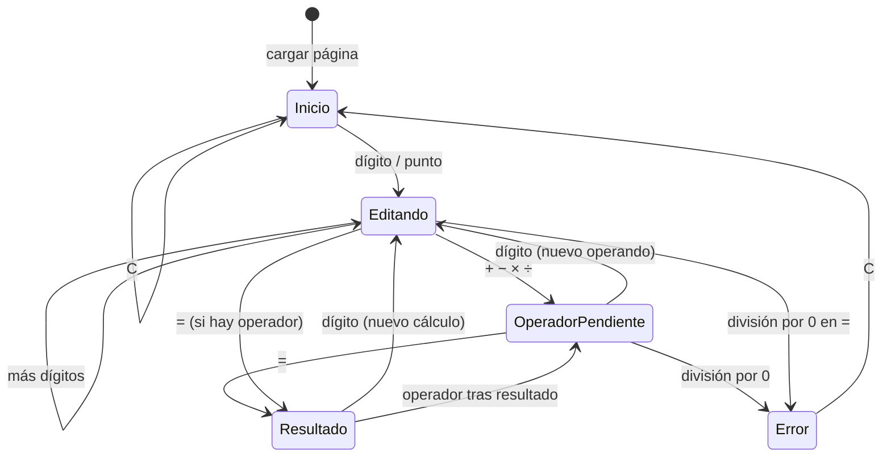
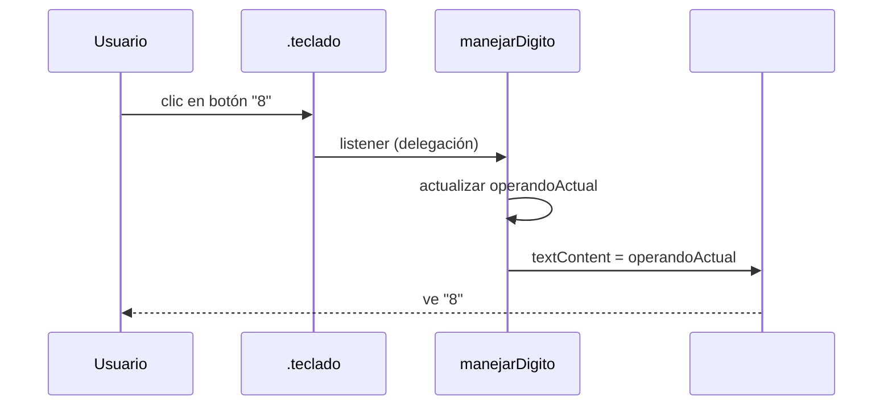
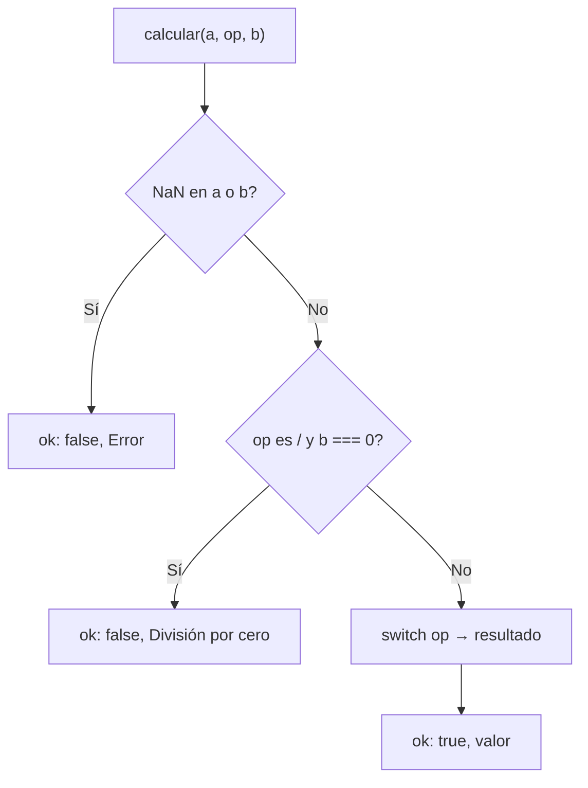

## Conceptos clave

- **Proyecto integrador PBPEW:** primera de cuatro lecciones-proyecto. Aplica en un solo artefacto lo visto en lecciones 01–12: variables, operadores, funciones, DOM, eventos y manejo básico de errores. No introduce APIs nuevas; consolida patrones del front sin servidor.
- **UI de calculadora:** pantalla de lectura (`#display`) + rejilla de botones (dígitos `0`–`9`, punto decimal, operadores `+` `−` `×` `÷`, `C` limpiar, `=` calcular). El HTML define estructura; JavaScript define comportamiento.
- **Estado en variables (no solo en el DOM):** además del texto visible en pantalla, el programa guarda en memoria al menos: **operando actual** (string o número en edición), **operando anterior** (guardado al pulsar operador), **operador pendiente** (`+`, `-`, `*`, `/`) y un flag **esperandoNuevoOperando** (tras operador o `=`, el siguiente dígito reemplaza la pantalla en lugar de concatenar). Alternativa didáctica válida: una sola variable `expresion` que se va armando — en PBPEW preferir el modelo de tres campos + flag por claridad pedagógica.
- **`textContent` en la pantalla:** actualizar el display con `display.textContent = valor` evita interpretar HTML y es seguro para mostrar números y mensajes de error (`"Error"`, `"División por cero"`).
- **`parseFloat` y validación:** al evaluar, convertir cadenas numéricas con `parseFloat(operando)`. Comprobar `Number.isNaN(resultado)` antes de mostrar. El punto decimal: permitir un solo `.` por operando; `parseFloat("12.")` → `12` (aceptable en demo).
- **Operadores aritméticos:** `+`, `-`, `*`, `/` en JavaScript. En UI mostrar `×` y `÷` pero mapear internamente a `*` y `/`. Encadenar operaciones: al pulsar un segundo operador sin `=`, calcular primero el resultado intermedio (comportamiento tipo calculadora básica).
- **`addEventListener("click", …)`:** cada botón (o un contenedor padre con **delegación**) dispara lógica según el valor pulsado. Patrón PBPEW: un listener en `.teclado` y `event.target.closest("button")` + `data-action` / `data-value` para escalar sin 16 listeners sueltos.
- **Funciones puras de cálculo:** separar `calcular(a, operador, b)` que devuelve número o lanza / devuelve señal de error. La capa DOM solo lee botones, actualiza estado y llama a `calcular`. Facilita pruebas mentales y reutilización (lección 06).
- **División por cero:** `10 / 0` en JavaScript → `Infinity` (no lanza excepción). La calculadora debe **detectar** divisor `0` antes o tras la operación y mostrar mensaje claro en pantalla, resetear estado y no dejar `Infinity` visible sin explicación.
- **`C` (clear):** reinicia operando actual, anterior, operador pendiente y flag; pantalla `"0"`. Opcional avanzado: `CE` solo borra dígito actual — no obligatorio en PBPEW.
- **Teclado (opcional en reto):** `keydown` con `event.key` — refuerzo, no requisito mínimo del demo base.
- **Sin `eval()`:** no usar `eval(expresion)` ni `Function()` para evaluar; construir lógica con `if/switch` y operadores — evita riesgos de seguridad y refuerza control de flujo (lección 04).

## Errores comunes

- **Leer el display como única fuente de verdad:** concatenar solo en pantalla sin variables de estado produce bugs al encadenar operadores (`12 + 3` luego `×` sin recalcular). Mantener estado en variables y sincronizar el DOM al final de cada acción.
- **Comparar flotantes con `===` tras operaciones:** `0.1 + 0.2` no es exactamente `0.3`. En calculadora básica usar `toFixed` al mostrar (p. ej. 8 decimales máx.) o aceptar redondeo visible; no exigir precisión binaria perfecta.
- **Varios listeners en cada botón dentro de un bucle sin delegación:** funciona en demo estática pero es verboso; si se regenera el DOM hay que re-enlazar. Preferir delegación en el contenedor.
- **Olvidar `event.target` cuando el clic cae en un hijo:** si el botón tiene `<span>`, `target` puede no ser el `button`; usar `closest("button")` y comprobar `null`.
- **No resetear tras error:** si se mostró `"División por cero"`, el siguiente dígito debe empezar estado limpio (flag `esperandoNuevoOperando` o reset explícito).
- **Permitir múltiples puntos decimales:** `"12.3.4"` rompe `parseFloat`; validar antes de concatenar `.`.
- **Usar `innerHTML` en el display:** innecesario y arriesgado si algún día el valor viene de fuera; usar `textContent`.
- **Confundir `+` con concatenación:** en la fase de **armar operando** todo es string; convertir a número solo al **calcular** con `parseFloat`.
- **No manejar clic en `=` sin operador pendiente:** repetir último resultado o ignorar — documentar comportamiento (PBPEW: si no hay operador, no hacer nada o repetir operando actual).
- **Script antes del DOM:** enlazar eventos solo cuando existan `#display` y `.teclado` (script al final del body, `defer` o `DOMContentLoaded`).

## Casos reales

### 1. Widget de cotización en dashboard financiero

Un fintech muestra un mini-calc para probar comisiones: el usuario ingresa monto y porcentaje. En la primera versión el equipo actualizaba solo un `<input>` y leían el valor con `.value` en cada clic, pero mezclaron estado en el input y en variables globales sueltas. Al pulsar “%” dos veces seguidas, la pantalla mostraba `150%%` y `parseFloat` devolvía `NaN`. Reestructuraron con el mismo patrón que una calculadora: **operando en edición**, **operando guardado**, **operación pendiente**, validación antes de `parseFloat`, mensaje `"Entrada no válida"` y botón `C` que resetea todo.

**Decisión clave:** tratar la UI como reflejo del estado en memoria, no como base de datos.

### 2. App de propinas que muestra `Infinity` en producción

La calculadora de propinas dividía la cuenta entre número de comensales sin validar cero comensales. `total / 0` mostraba `Infinity` en pantalla; usuarios reportaron “la app está rota”. Añadieron guarda explícita: si el divisor es `0`, mostrar mensaje localizado, bloquear `=` hasta `C`, y registrar el caso en analytics. Misma lección que división por cero en este proyecto.

**Lección:** en JavaScript la división por cero no lanza error; la UX debe anticipar el caso.

## Ejemplos de código sugeridos

### HTML mínimo de la calculadora

```html
<div class="calculadora">
  <output id="display" class="pantalla" aria-live="polite">0</output>
  <div class="teclado" role="group" aria-label="Teclado calculadora">
    <button type="button" data-action="clear">C</button>
    <button type="button" data-action="operator" data-value="/">÷</button>
    <button type="button" data-action="operator" data-value="*">×</button>
    <button type="button" data-action="digit" data-value="7">7</button>
    <!-- … resto de dígitos y operadores … -->
    <button type="button" data-action="equals">=</button>
  </div>
</div>
```

### Estado inicial y referencias DOM

```javascript
const display = document.querySelector("#display");
const teclado = document.querySelector(".teclado");

let operandoActual = "0";
let operandoAnterior = "";
let operadorPendiente = null;
let esperandoNuevoOperando = false;

function actualizarPantalla() {
  display.textContent = operandoActual;
}
```

### Función de cálculo con guarda de división por cero

```javascript
function calcular(a, operador, b) {
  const x = parseFloat(a);
  const y = parseFloat(b);
  if (Number.isNaN(x) || Number.isNaN(y)) {
    return { ok: false, mensaje: "Error" };
  }
  if (operador === "/" && y === 0) {
    return { ok: false, mensaje: "División por cero" };
  }
  let resultado;
  switch (operador) {
    case "+":
      resultado = x + y;
      break;
    case "-":
      resultado = x - y;
      break;
    case "*":
      resultado = x * y;
      break;
    case "/":
      resultado = x / y;
      break;
    default:
      return { ok: false, mensaje: "Error" };
  }
  return { ok: true, valor: resultado };
}
```

### Delegación de eventos en el teclado

```javascript
teclado.addEventListener("click", (event) => {
  const boton = event.target.closest("button");
  if (!boton || !teclado.contains(boton)) return;

  const accion = boton.dataset.action;

  if (accion === "digit") {
    manejarDigito(boton.dataset.value);
  } else if (accion === "operator") {
    manejarOperador(boton.dataset.value);
  } else if (accion === "equals") {
    manejarIgual();
  } else if (accion === "clear") {
    limpiar();
  }
});
```

### Manejar dígito y punto decimal

```javascript
function manejarDigito(digito) {
  if (esperandoNuevoOperando) {
    operandoActual = digito;
    esperandoNuevoOperando = false;
  } else {
    operandoActual =
      operandoActual === "0" ? digito : operandoActual + digito;
  }
  actualizarPantalla();
}

function manejarPunto() {
  if (esperandoNuevoOperando) {
    operandoActual = "0.";
    esperandoNuevoOperando = false;
  } else if (!operandoActual.includes(".")) {
    operandoActual += ".";
  }
  actualizarPantalla();
}
```

### Encadenar operador (calcular antes si ya hay uno pendiente)

```javascript
function manejarOperador(nuevoOperador) {
  if (operadorPendiente !== null && !esperandoNuevoOperando) {
    const res = calcular(
      operandoAnterior,
      operadorPendiente,
      operandoActual
    );
    if (!res.ok) {
      mostrarError(res.mensaje);
      return;
    }
    operandoActual = String(res.valor);
    actualizarPantalla();
  }
  operandoAnterior = operandoActual;
  operadorPendiente = nuevoOperador;
  esperandoNuevoOperando = true;
}
```

### Igual y limpiar

```javascript
function manejarIgual() {
  if (operadorPendiente === null) return;
  const res = calcular(
    operandoAnterior,
    operadorPendiente,
    operandoActual
  );
  if (!res.ok) {
    mostrarError(res.mensaje);
    return;
  }
  operandoActual = String(res.valor);
  operadorPendiente = null;
  operandoAnterior = "";
  esperandoNuevoOperando = true;
  actualizarPantalla();
}

function limpiar() {
  operandoActual = "0";
  operandoAnterior = "";
  operadorPendiente = null;
  esperandoNuevoOperando = false;
  actualizarPantalla();
}

function mostrarError(mensaje) {
  operandoActual = mensaje;
  operadorPendiente = null;
  operandoAnterior = "";
  esperandoNuevoOperando = true;
  actualizarPantalla();
}
```

## Ejercicios de práctica

- **tipo:** reflexion — ¿Por qué conviene guardar el estado de la calculadora en variables JavaScript y no solo leer/escribir el texto del `#display` en cada clic? (respuesta esperada: el display es vista; el estado lógico incluye operador pendiente y flags que no siempre se ven en pantalla).
- **tipo:** reflexion — ¿Qué ocurre en JavaScript con `8 / 0` y por qué la calculadora debe comprobar el divisor explícitamente?
- **tipo:** ordenar-pasos — Ordena el flujo al pulsar `7`, luego `+`, luego `3`, luego `=`: (a) guardar operador y marcar `esperandoNuevoOperando`, (b) mostrar `3` como nuevo operando, (c) `calcular(7, +, 3)`, (d) concatenar `7` en operando actual, (e) mostrar resultado `10`.
- **tipo:** completar-codigo — Completa la guarda: `if (operador === "/" && ___ === 0) { return { ok: false, mensaje: "División por cero" }; }` → `y` (o `parseFloat(b)`).
- **tipo:** completar-codigo — Completa delegación: `const boton = event.target.___("button");` → `closest`.
- **tipo:** completar-codigo — Completa pantalla segura: `display.___ = operandoActual;` → `textContent`.
- **tipo:** codigo — Escribe `function limpiar()` que resetee las cuatro piezas de estado y deje la pantalla en `"0"`.
- **tipo:** codigo — Escribe `manejarDigito(digito)` que, si `esperandoNuevoOperando` es true, reemplace el operando; si no, concatene salvo que la pantalla sea `"0"` (entonces reemplaza).
- **tipo:** codigo — Implementa `calcular(a, operador, b)` solo con `switch`, devolviendo `{ ok, valor }` o `{ ok: false, mensaje }` para divisor cero y NaN.
- **tipo:** diagrama — Dibuja diagrama de estados: Inicio → Editando operando → Operador seleccionado → (Igual → Resultado) y rama Error.
- **tipo:** codigo — Añade `manejarPunto()` que impida dos puntos en el mismo operando.
- **tipo:** reflexion — ¿Por qué evitamos `eval()` para evaluar la expresión?

### CodeChallenge (prioridad alta — layout)

- **id:** `cc-calc-delegacion-listener` — **tipo:** completar-codigo — Plantilla:

```javascript
const teclado = document.querySelector(".teclado");
teclado.addEventListener("{{blank1}}", (event) => {
  const boton = event.target.{{blank2}}("button");
  if (!boton) return;
  const accion = boton.dataset.{{blank3}};
  if (accion === "digit") manejarDigito(boton.dataset.value);
});
```

Blanks: `click`, `closest`, `action`. Hints: (1) evento de ratón en botones, (2) sube al botón si el clic cae en un hijo, (3) atributo `data-action` en HTML.

- **id:** `cc-calc-calcular-switch` — **tipo:** completar-codigo — Completar ramas del `switch` en `calcular`: cases `"+"`, `"-"`, `"*"`, `"/"` con operaciones aritméticas; antes del switch, validar NaN y divisor cero en `/`.

- **id:** `cc-calc-estado-inicial` — **tipo:** completar-codigo — Completar inicialización:

```javascript
let operandoActual = "{{blank1}}";
let operandoAnterior = "{{blank2}}";
let operadorPendiente = {{blank3}};
let esperandoNuevoOperando = {{blank4}};
```

Blanks: `0`, `""`, `null`, `false`.

### PracticeExercise (prioridad alta — layout)

- **id:** `pe-calc-flujo-operador` — **tipo:** reflexion — Tras pulsar `12` `+` `5`, describe qué variables cambian (`operandoActual`, `operandoAnterior`, `operadorPendiente`, `esperandoNuevoOperando`) antes de pulsar `=`. 2 hints. Success: menciona que `operandoAnterior` guarda `12`, operador `+`, flag true y pantalla sigue mostrando `5` como operando en edición.

- **id:** `pe-calc-debug-display` — **tipo:** codigo — Se da un fragmento buggy que solo hace `display.textContent += digito` sin estado. El alumno escribe en 5–8 líneas qué falla al encadenar `3 * 4 + 2` y qué variables añadiría.

- **id:** `pe-calc-division-cero` — **tipo:** codigo — Escribe el bloque `if` que detecta división por cero antes de calcular y llama a `mostrarError("División por cero")`.

- **id:** `pe-calc-parseFloat` — **tipo:** reflexion — ¿Por qué `parseFloat("12.5.3")` devuelve `12.5` y cómo previene la calculadora el segundo punto?

- **id:** `pe-calc-textcontent-vs-innerhtml` — **tipo:** reflexion — En una sola frase: ¿por qué `textContent` es preferible al `innerHTML` en la pantalla?

## Animación o visual sugerida

- **DemoCalculadoraSection (prioridad máxima):** calculadora funcional embebida en la lección — mismos botones que el proyecto (`C`, dígitos, `.`, `+` `−` `×` `÷`, `=`). Implementación cliente con React state o vanilla en `useEffect`; debe ser **usable** (no imagen estática). Estados visibles: normal, resultado, error (`División por cero`). Accesibilidad: `aria-live="polite"` en pantalla.
- **StepReveal — “Construye la calculadora en 6 pasos”:**
  1. Maqueta HTML (`#display` + botones con `data-action`).
  2. Selecciona nodos y define variables de estado.
  3. Enlaza un listener con delegación en `.teclado`.
  4. Implementa dígitos y punto decimal.
  5. Implementa operadores y `=` con `calcular()`.
  6. Añade `C` y manejo de división por cero.
- **StepReveal — flujo de un clic en `=`:**
  1. Leer `operandoAnterior`, `operadorPendiente`, `operandoActual`.
  2. Llamar `calcular(...)`.
  3. Si error → pantalla mensaje y reset lógico.
  4. Si ok → mostrar resultado, limpiar operador pendiente.
- **CompareTable — responsabilidades HTML vs JS:**

  | Capa | Responsabilidad |
  |------|-----------------|
  | HTML | Estructura, etiquetas de botones, `data-*` |
  | CSS | Rejilla, tamaño táctil, contraste |
  | JS | Estado, listeners, cálculo, errores |
  | DOM (`#display`) | Vista del estado — no base de datos |

- **Callout — sin `eval`:** recordatorio de seguridad y aprendizaje de control de flujo.

## Diagrama Mermaid (si aplica)

### Máquina de estados simplificada



### Secuencia: clic en dígito con delegación



### Flujo de decisión en `calcular`



## Reto integrador

**“Calculadora interactiva completa”**

Construye la calculadora en un único HTML + JS (o sección de lección equivalente), sin librerías de terceros ni `eval`.

**Requisitos funcionales**

1. **UI:** pantalla `#display` y teclado con `C`, dígitos `0`–`9`, `.`, `+`, `−`, `×`, `÷`, `=`. Layout legible en móvil (botones mín. ~44px).
2. **Estado:** variables `operandoActual`, `operandoAnterior`, `operadorPendiente`, `esperandoNuevoOperando` (o documentar variante `expresion` si se usa, con la misma claridad).
3. **Eventos:** `addEventListener` con **delegación** en el contenedor del teclado; `data-action` / `data-value` en botones.
4. **Operaciones:** suma, resta, multiplicación, división; encadenar operaciones sin pulsar `=` entre cada par (comportamiento básico).
5. **Errores:** división por cero → mensaje visible `"División por cero"`; entrada inválida → `"Error"`; botón `C` restaura estado inicial desde cualquier estado.
6. **Código limpio:** función `calcular(a, operador, b)` separada de la manipulación DOM; función `actualizarPantalla()`.
7. **Extra (opcional):** historial de las últimas 3 operaciones en un `<ul id="historial">`; soporte de teclado numérico.

**Criterio de éxito:** demo usable en navegador; sin errores en consola en flujo normal; división por cero manejada; estado coherente tras `C` y tras `=`; código legible en funciones pequeñas.

**Entrega sugerida en lección:** el alumno puede copiar desde la demo embebida o construir en paralelo; `RetoIntegradorSection` enlaza checklist y espacio de reflexión final (qué parte fue más difícil: estado, eventos o errores).

## Preguntas sugeridas para quiz (5)

1. **¿Cuál es el rol principal de `operadorPendiente` en la calculadora?**
   - A) Guardar el color del botón pulsado
   - B) Recordar qué operación aplicar entre el operando anterior y el actual
   - C) Sustituir a `parseFloat`
   - D) Evitar que el DOM se actualice
   - **Correcta:** B
   - **Feedback:** El operador pendiente conecta el primer número con el segundo cuando el usuario pulsa `=` o encadena otra operación.

2. **¿Por qué usar delegación de eventos en `.teclado`?**
   - A) Porque un solo botón puede tener solo un listener en JavaScript
   - B) Para manejar clics en botones actuales y futuros con un solo listener en el contenedor
   - C) Porque `click` no funciona en `<button>`
   - D) Para no usar `addEventListener`
   - **Correcta:** B
   - **Feedback:** Un listener en el padre lee `event.target` / `closest("button")` y reduce enlace repetitivo.

3. **Tras `const x = parseFloat("12.5");`, ¿qué valor tiene `x`?**
   - A) `"12.5"` (string)
   - B) `12.5` (number)
   - C) `NaN` siempre
   - D) `125`
   - **Correcta:** B
   - **Feedback:** `parseFloat` convierte cadena numérica válida a número de punto flotante.

4. **¿Qué debe hacer la calculadora ante `5 ÷ 0` antes de mostrar el resultado?**
   - A) Confiar en que JavaScript lanzará un error automático
   - B) Mostrar `Infinity` sin comentario
   - C) Detectar divisor cero y mostrar un mensaje de error controlado
   - D) Ignorar el clic en `=`
   - **Correcta:** C
   - **Feedback:** `10 / 0` da `Infinity` sin excepción; la UX debe validar el divisor y resetear estado.

5. **¿Qué propiedad del DOM es más adecuada para mostrar el número en pantalla?**
   - A) `innerHTML` con plantilla HTML
   - B) `textContent`
   - C) `outerHTML`
   - D) `hidden`
   - **Correcta:** B
   - **Feedback:** `textContent` muestra texto sin interpretar etiquetas; basta para números y mensajes de error.

## Referencias

- Contenido TSX migrado: `src/components/teaching/lessons/pbpew/proyectos/calculadora/`
- Sección existente (reemplazar stub estático): `sections/ContenidoSection.tsx` → dividir en secciones según layout-spec
- Secciones sugeridas para layout-spec: `ObjetivoProyectoSection`, `EstadoYDomSection`, `DemoCalculadoraSection`, `CodigoGuiadoSection`, `PracticaProfundaSection` (`CodeChallenge` ×2–3, `PracticeExercise` ×3–5), `RetoIntegradorSection`, `CompruebaTuComprensionSection` (`Quiz`)
- Meta lección: `lesson-meta.ts` — `order: 101`, `slug: proyectos/calculadora`
- Pipeline status: `kb/education/pipeline/pbpew/status.md` — marcar brief done tras layout
- Lecciones núcleo reutilizadas: `10-dom-y-eventos` (delegación, `textContent`), `04-operadores-y-decisiones` (aritmética, división por cero), `03-variables-y-tipos` (`parseFloat`, NaN), `06-funciones-y-callbacks` (función `calcular`)
- MDN — `parseFloat`: https://developer.mozilla.org/es/docs/Web/JavaScript/Reference/Global_Objects/parseFloat
- MDN — `addEventListener`: https://developer.mozilla.org/es/docs/Web/API/EventTarget/addEventListener
- MDN — `textContent`: https://developer.mozilla.org/es/docs/Web/API/Node/textContent
- Siguiente proyecto PBPEW: `proyectos/todo-list` (orden 102)
