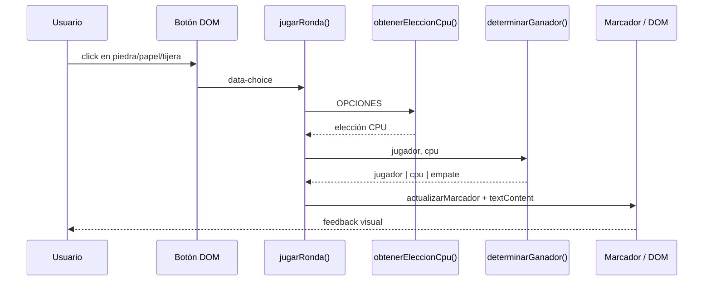
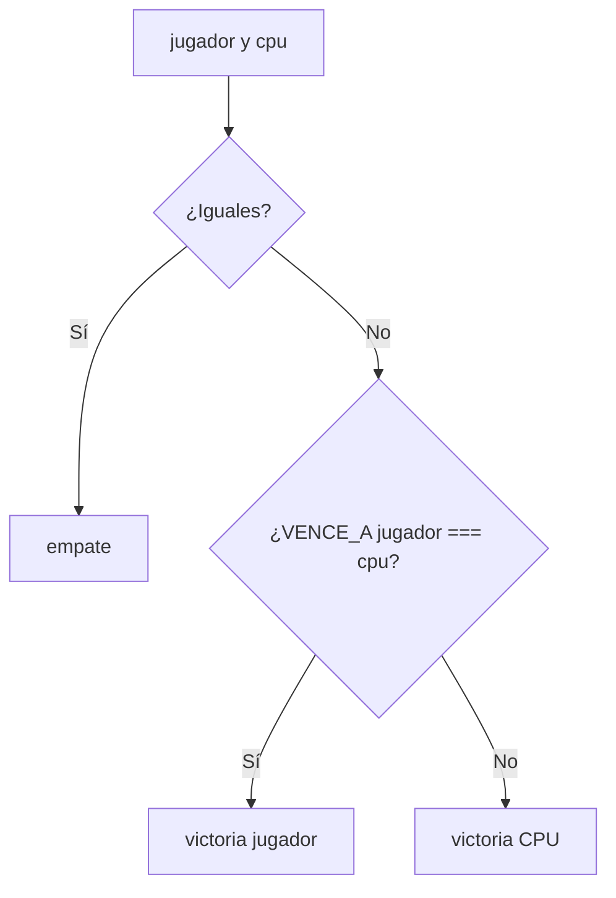
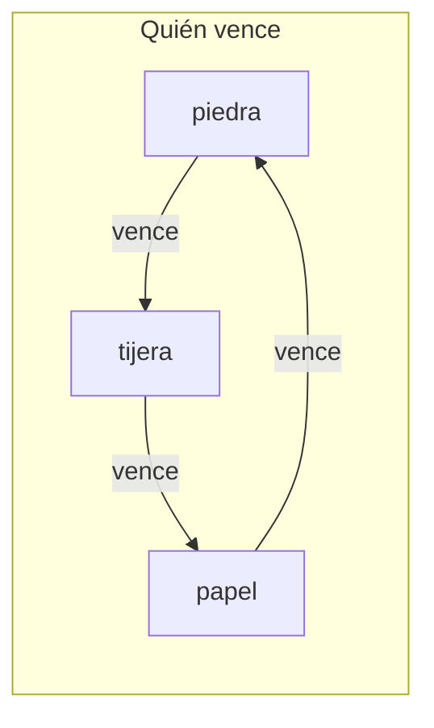

## Conceptos clave

**Proyecto integrador PBPEW** — aplica en un solo mini-juego lo visto en las 12 lecciones núcleo: variables de estado, decisiones, funciones, arrays, DOM, eventos y (opcional) extensiones con asincronía.

- **Modelo del juego:** dos jugadores eligen en secreto entre tres opciones discretas (`piedra`, `papel`, `tijera`). La CPU simula al oponente con elección **aleatoria** en cada ronda.
- **Reglas de comparación (ganador):** piedra vence tijera; tijera vence papel; papel vence piedra; misma elección → empate. No hay “valor numérico” intrínseco — la lógica es relacional (`jugador` vs `cpu`).
- **Elección aleatoria de la CPU:** `Math.random()` devuelve un número en `[0, 1)`. Patrón PBPEW: `const indice = Math.floor(Math.random() * opciones.length)` y luego `opciones[indice]`. `Math.floor` evita índices fuera del array.
- **Estado del marcador:** tres contadores (`victorias`, `empates`, `derrotas`) declarados con `let` en el scope del script (o módulo). Se incrementan **solo** tras determinar el resultado de la ronda — nunca antes de comparar.
- **Funciones con responsabilidad única:**
  - `obtenerEleccionCpu(opciones)` — devuelve string aleatorio.
  - `determinarGanador(jugador, cpu)` — devuelve `"jugador"`, `"cpu"` o `"empate"`.
  - `actualizarMarcador(resultado)` — muta contadores y devuelve el objeto de puntuación (o void + lectura posterior).
  - `renderizarRonda(jugador, cpu, resultado)` — escribe en el DOM mensaje y emojis/texto de la ronda.
- **Estructura de reglas mantenible:** objeto o `Map` de “qué vence a qué” (`{ piedra: "tijera", tijera: "papel", papel: "piedra" }`) evita cadenas gigantes de `if/else if`. Alternativa pedagógica: `if/else` explícito para las 9 combinaciones — válido en el reto inicial.
- **DOM y feedback inmediato:** botones (o tarjetas clicables) para cada opción; zonas de salida `#resultado`, `#jugada-jugador`, `#jugada-cpu`, `#marcador`. Actualizar con `textContent` (seguro) y `classList` para resaltar victoria/empate/derrota.
- **Eventos:** un `addEventListener("click", ...)` por botón de jugada **o** delegación en un contenedor `#opciones` con `data-choice` en cada botón. El handler lee la elección del usuario, invoca la lógica de ronda y actualiza UI — **no** ejecutar `jugarRonda()` al cargar el script sin clic.
- **Flujo de una ronda:** (1) usuario elige → (2) CPU elige al azar → (3) comparar → (4) actualizar marcador → (5) pintar resultado en DOM. Orden fijo; saltar pasos produce bugs visibles (marcador sin mensaje, etc.).
- **Constantes:** `const OPCIONES = ["piedra", "papel", "tijera"]` y mapas emoji (`✊`, `✋`, `✌️`) en objetos de solo lectura.
- **Validación defensiva:** si `determinarGanador` recibe un valor no listado en `OPCIONES`, devolver `null` o lanzar error controlado y mostrar mensaje en UI — evita `undefined` silencioso en producción.
- **Extensiones opcionales (post-núcleo):** botón “Reiniciar marcador”; historial de últimas N jugadas en un `<ul>`; CPU “inteligente” que pondera según frecuencia del jugador (arrays + bucles); guardar marcador en `localStorage` (preview persistencia); animación con `setTimeout` entre “pensando…” y revelar jugada CPU (lección 11).

## Errores comunes

- **Llamar la lógica de juego al cargar la página:** `jugarRonda("piedra")` fuera de un listener ejecuta una ronda sin interacción y distorsiona el marcador inicial.
- **Índice aleatorio incorrecto:** `Math.random() * 3` sin `Math.floor` o con rango `* 4` provoca `undefined` al acceder al array.
- **Comparar con `==` o invertir la regla:** `if (jugador == cpu)` para empate está bien con strings constantes, pero mezclar `"Piedra"` y `"piedra"` rompe la lógica — normalizar a minúsculas o usar valores `data-choice` idénticos.
- **Lógica de victoria duplicada e inconsistente:** comprobar victoria del jugador en un sitio y derrota en otro con condiciones distintas; unificar en `determinarGanador`.
- **Actualizar el DOM antes de calcular el resultado:** el usuario ve “¡Ganaste!” con jugadas aún no comparadas.
- **Olvidar empate:** solo contemplar ganar/perder deja el contador de empates congelado y confunde en estadísticas.
- **Mutar marcador en el listener sin función:** tres `if` sueltos en cada botón duplican código; al cambiar reglas hay que editar tres sitios.
- **`innerHTML` con datos dinámicos:** innecesario para emojis fijos; si se muestra historial de texto libre, preferir `textContent`.
- **`querySelector` sin comprobar `null`:** si el HTML de práctica no incluye `#marcador`, el script lanza `TypeError` en la primera ronda.
- **Listener con `jugar("piedra")` en lugar de `jugar`:** `addEventListener("click", jugar("piedra"))` ejecuta al registrar — patrón de callbacks lección 06.
- **Reutilizar variable de ronda:** no resetear mensajes o clases CSS de la ronda anterior hace que brillen estilos de victoria y derrota a la vez.

## Casos reales

### 1. Minijuego promocional: marcador que “miente”

Una campaña de marketing publica un piedra-papel-tijera en la landing para sortear descuentos. El equipo implementa la comparación en el handler del botón y olvida el caso empate: cuando hay empate, no entra en ninguna rama y el span `#resultado` conserva el texto “¡Ganaste!” de la ronda anterior. Usuarios denuncian fraude en redes.

**Decisión clave:** centralizar resultado en `determinarGanador` con tres salidas explícitas y siempre llamar a `renderizarRonda` al final, incluso en empate. En producto real, auditar que la UI refleje el estado calculado, no el anterior.

### 2. A/B test de botones: delegación vs N listeners

Un dashboard de juegos casual añade modo “torneo” con 50 mesas en DOM. Cada mesa tiene tres botones; el script enlaza listeners en un bucle al montar la vista. Al re-renderizar una mesa vía plantilla, los botones nuevos no responden. Migran a **un listener** en el contenedor padre que lee `event.target.closest("[data-choice]")`.

**Lección:** el mismo patrón de delegación de lección 10 escala cuando el tablero crece o se actualiza dinámicamente — aplicable si el proyecto añade historial de partidas en lista.

## Ejemplos de código sugeridos

### Constantes y estado inicial

```javascript
const OPCIONES = ["piedra", "papel", "tijera"];

const EMOJI = {
  piedra: "✊",
  papel: "✋",
  tijera: "✌️",
};

let marcador = { victorias: 0, empates: 0, derrotas: 0 };
```

### Elección aleatoria de la CPU

```javascript
function obtenerEleccionCpu(opciones) {
  const indice = Math.floor(Math.random() * opciones.length);
  return opciones[indice];
}

// Prueba rápida en consola:
// for (let i = 0; i < 10; i++) console.log(obtenerEleccionCpu(OPCIONES));
```

### Reglas con objeto (mantenible)

```javascript
const VENCE_A = {
  piedra: "tijera",
  tijera: "papel",
  papel: "piedra",
};

function determinarGanador(jugador, cpu) {
  if (jugador === cpu) return "empate";
  if (VENCE_A[jugador] === cpu) return "jugador";
  return "cpu";
}
```

### Alternativa pedagógica: `if/else` explícito

```javascript
function determinarGanador(jugador, cpu) {
  if (jugador === cpu) return "empate";
  if (
    (jugador === "piedra" && cpu === "tijera") ||
    (jugador === "tijera" && cpu === "papel") ||
    (jugador === "papel" && cpu === "piedra")
  ) {
    return "jugador";
  }
  return "cpu";
}
```

### Actualizar marcador y DOM

```javascript
function actualizarMarcador(resultado) {
  if (resultado === "jugador") marcador.victorias += 1;
  else if (resultado === "cpu") marcador.derrotas += 1;
  else marcador.empates += 1;
}

function renderizarRonda(jugador, cpu, resultado) {
  const elJugador = document.querySelector("#jugada-jugador");
  const elCpu = document.querySelector("#jugada-cpu");
  const elResultado = document.querySelector("#resultado");
  const elMarcador = document.querySelector("#marcador");

  elJugador.textContent = `Tú: ${EMOJI[jugador]} ${jugador}`;
  elCpu.textContent = `CPU: ${EMOJI[cpu]} ${cpu}`;

  const mensajes = {
    jugador: "¡Ganaste esta ronda!",
    cpu: "Gana la CPU.",
    empate: "Empate.",
  };
  elResultado.textContent = mensajes[resultado];

  elMarcador.textContent =
    `Victorias: ${marcador.victorias} · Empates: ${marcador.empates} · Derrotas: ${marcador.derrotas}`;
}
```

### Orquestar una ronda (función principal)

```javascript
function jugarRonda(eleccionJugador) {
  const eleccionCpu = obtenerEleccionCpu(OPCIONES);
  const resultado = determinarGanador(eleccionJugador, eleccionCpu);
  actualizarMarcador(resultado);
  renderizarRonda(eleccionJugador, eleccionCpu, resultado);
}
```

### Eventos en botones (patrón PBPEW)

```javascript
const contenedor = document.querySelector("#opciones");

contenedor.addEventListener("click", (evento) => {
  const boton = evento.target.closest("[data-choice]");
  if (!boton) return;

  const eleccion = boton.dataset.choice; // "piedra" | "papel" | "tijera"
  jugarRonda(eleccion);
});
```

### HTML mínimo de referencia

```html
<div id="opciones">
  <button type="button" data-choice="piedra">✊ Piedra</button>
  <button type="button" data-choice="papel">✋ Papel</button>
  <button type="button" data-choice="tijera">✌️ Tijera</button>
</div>
<p id="jugada-jugador">Tú: —</p>
<p id="jugada-cpu">CPU: —</p>
<p id="resultado">Elige una opción.</p>
<p id="marcador">Victorias: 0 · Empates: 0 · Derrotas: 0</p>
```

### Extensión: “CPU pensando” con `setTimeout` (opcional)

```javascript
function jugarRondaConRetraso(eleccionJugador) {
  const elCpu = document.querySelector("#jugada-cpu");
  elCpu.textContent = "CPU: pensando…";

  setTimeout(() => {
    const eleccionCpu = obtenerEleccionCpu(OPCIONES);
    const resultado = determinarGanador(eleccionJugador, eleccionCpu);
    actualizarMarcador(resultado);
    renderizarRonda(eleccionJugador, eleccionCpu, resultado);
  }, 400);
}
```

## Ejercicios de práctica

- **tipo:** reflexion — ¿Por qué conviene separar `determinarGanador` de `actualizarMarcador`? (respuesta esperada: una calcula lógica pura; la otra muta estado y facilita pruebas y cambios de reglas).
- **tipo:** reflexion — Explica qué devuelve `Math.floor(Math.random() * 3)` y por qué es seguro como índice de un array de 3 elementos.
- **tipo:** codigo — Escribe `obtenerEleccionCpu(["piedra", "papel", "tijera"])` que devuelva siempre un valor del array.
- **tipo:** codigo — Implementa `determinarGanador("papel", "piedra")` que devuelva `"jugador"`.
- **tipo:** codigo — Dado `let v = 0`, incrementa `v` solo cuando el resultado sea `"jugador"` usando `if`.
- **tipo:** codigo — Selecciona `#marcador` y asigna `textContent` con plantilla: `` `Victorias: ${marcador.victorias}` ``.
- **tipo:** completar-codigo — Completa: `const i = Math.___(Math.random() * OPCIONES.length);` → `floor`.
- **tipo:** completar-codigo — Completa: `boton.addEventListener("click", () => jugarRonda(boton.dataset.___));` → `choice` (con `data-choice` en HTML).
- **tipo:** ordenar-pasos — Ordena el flujo de una ronda: (a) usuario hace clic, (b) CPU elige al azar, (c) se actualiza `#marcador`, (d) se compara jugador vs CPU, (e) se muestra mensaje en `#resultado`.
- **tipo:** diagrama — Dibuja tres botones conectados a una función `jugarRonda` y desde ahí a `determinarGanador` y al DOM.
- **tipo:** codigo — Añade validación: si `eleccionJugador` no está en `OPCIONES`, muestra en `#resultado` “Opción no válida” y no modifiques el marcador.
- **tipo:** codigo — Implementa botón `#reiniciar` que ponga los tres contadores en 0 y resetee los textos de la UI.

## Animación o visual sugerida

- **Demo interactiva principal (`PracticeExercise` / componente dedicado):** juego piedra-papel-tijera jugable en página — tres botones, panel de jugadas, mensaje de ronda y marcador persistente durante la sesión. **Prioridad máxima del layout.** Debe funcionar sin consola.
- **StepReveal — una ronda completa:** paso 1 clic del usuario → paso 2 `Math.random` elige CPU → paso 3 `determinarGanador` → paso 4 incremento de contador → paso 5 `textContent` en pantalla.
- **CompareTable — `if/else` explícito vs objeto `VENCE_A`:**

  | Criterio | Cadenas `if/else` | Objeto / `Map` de reglas |
  |----------|-------------------|---------------------------|
  | Legibilidad con 3 opciones | Alta | Alta |
  | Escalar a más símbolos | Baja (combinaciones explotan) | Alta |
  | Riesgo de regla invertida | Medio (copy-paste) | Bajo si el mapa es la única fuente |
  | Adecuado para PBPEW inicial | Sí (didáctico) | Sí (refactor sugerido) |

- **CompareTable — actualizar estado vs re-render completo:**

  | Enfoque | Este proyecto | Cuándo |
  |---------|---------------|--------|
  | Mutar `marcador` + actualizar nodos existentes | Recomendado | Pocos elementos en DOM |
  | Borrar y recrear todo el HTML cada ronda | Evitar | Innecesario y propenso a perder listeners |

- **MermaidDiagram — flujo de evento clic → resultado (secuencia).**
- **MermaidDiagram — tabla de victorias (matriz 3×3)** como referencia visual estática junto al demo.

## Diagrama Mermaid (si aplica)

### Secuencia: una ronda



### Flujo de decisión (determinar ganador)



### Matriz de resultados (referencia)



## Reto integrador

**“Piedra, papel o tijera en el navegador”**

Construye el proyecto completo en HTML + JS (o bloque embebido en la lección) sin librerías externas.

### Requisitos obligatorios

1. **UI:** tres controles de elección (botones con `data-choice`), zonas `#jugada-jugador`, `#jugada-cpu`, `#resultado`, `#marcador`.
2. **Aleatoriedad:** la CPU elige con `Math.random()` y array `OPCIONES` — no hardcodear la jugada de la CPU.
3. **Lógica:** función `determinarGanador` con retorno `"jugador"`, `"cpu"` o `"empate"`; reglas correctas de piedra-papel-tijera.
4. **Marcador:** objeto o tres variables `let`; persisten entre rondas hasta reinicio manual o recarga de página.
5. **DOM:** actualizar textos con `textContent`; opcional `classList` en `#resultado` (`ganaste`, `perdiste`, `empate`).
6. **Eventos:** `addEventListener`; prohibido `onclick` inline en HTML para la lógica principal.
7. **Funciones:** al menos `obtenerEleccionCpu`, `determinarGanador`, `jugarRonda` (o equivalente con nombres claros).

### Criterios de éxito

- Tras 10 rondas manuales, los tres contadores suman 10.
- Empate incrementa solo `empates`, no victorias ni derrotas.
- Clic repetido en la misma opción produce jugadas CPU distintas en la mayoría de rondas (aleatoriedad visible).
- Sin errores en consola al jugar.

### Extensiones (nivel avanzado — retos opcionales en la lección)

1. **Historial:** `appendChild` de `<li>` con resumen de cada ronda en `#historial`; delegación para no re-enlazar.
2. **Reinicio:** botón que resetea marcador y limpia historial.
3. **CPU adaptativa:** contar frecuencia de elecciones del jugador y elegir la opción que más suele vencer al usuario (arrays + bucles, lección 07–09).
4. **Suspense:** mostrar “CPU pensando…” 300–500 ms antes de revelar (lección 11).
5. **Persistencia:** guardar marcador en `localStorage` y restaurar al cargar (preview más allá del núcleo).

## Preguntas sugeridas para quiz (5)

1. **¿Qué patrón es correcto para elegir un índice aleatorio válido en `OPCIONES` de longitud 3?**
   - A) `Math.random() * 4`
   - B) `Math.floor(Math.random() * 3)`
   - C) `Math.ceil(Math.random() * 3)`
   - D) `Math.random() + 1`
   - **Correcta:** B
   - **Feedback:** `Math.floor(Math.random() * n)` produce enteros de `0` a `n - 1`, válidos como índices del array.

2. **Si el jugador elige `tijera` y la CPU `papel`, ¿qué devuelve `determinarGanador` con las reglas estándar?**
   - A) `"empate"`
   - B) `"cpu"`
   - C) `"jugador"`
   - D) `undefined`
   - **Correcta:** C
   - **Feedback:** Tijera vence a papel; la victoria es del jugador.

3. **¿Dónde debe incrementarse `marcador.victorias`?**
   - A) En el momento del clic, antes de conocer la jugada de la CPU
   - B) Solo cuando `determinarGanador` devuelve `"jugador"`
   - C) En cada ronda, sin importar el resultado
   - D) Solo al recargar la página
   - **Correcta:** B
   - **Feedback:** El marcador refleja el resultado calculado; actualizar antes de comparar falsea las estadísticas.

4. **¿Cuál es la forma PBPEW de reaccionar al clic en “Piedra” sin mezclar HTML y JS?**
   - A) `<button onclick="jugar('piedra')">`
   - B) `button.click = jugar('piedra')`
   - C) `addEventListener("click", () => jugarRonda("piedra"))` o delegación con `data-choice`
   - D) `innerHTML` con script embebido en el botón
   - **Correcta:** C
   - **Feedback:** `addEventListener` separa comportamiento del marcado y evita ejecutar la ronda al cargar si pasas la referencia mal.

5. **¿Qué propiedad del DOM es la más adecuada para mostrar el mensaje “Empate.” tras una ronda?**
   - A) `innerHTML` con HTML del usuario
   - B) `textContent`
   - C) `outerHTML` del body
   - D) `document.write`
   - **Correcta:** B
   - **Feedback:** `textContent` muestra texto plano de forma segura; es suficiente para mensajes fijos del juego.

## Referencias

- Componente TSX actual (placeholder): `src/components/teaching/lessons/pbpew/proyectos/piedra-papel-tijera/`
- Meta: `src/components/teaching/lessons/pbpew/proyectos/piedra-papel-tijera/lesson-meta.ts` (`order: 102`)
- Lecciones núcleo aplicadas: `04-operadores-y-decisiones`, `06-funciones-y-callbacks`, `10-dom-y-eventos`
- Estándares pedagógicos: `kb/education/pedagogy-standards.md` (demo jugable + quiz 5 + visual)
- MDN — Math.random: https://developer.mozilla.org/es/docs/Web/JavaScript/Reference/Global_Objects/Math/random
- MDN — Math.floor: https://developer.mozilla.org/es/docs/Web/JavaScript/Reference/Global_Objects/Math/floor
- MDN — data-* attributes: https://developer.mozilla.org/es/docs/Web/HTML/Global_attributes/data-*
- MDN — addEventListener: https://developer.mozilla.org/es/docs/Web/API/EventTarget/addEventListener
- Proyectos hermanos PBPEW: `proyectos/calculadora` (101), `proyectos/todo-list` (103), `proyectos/ajedrez` (100)
- Pipeline status: `kb/education/pipeline/pbpew/status.md`
