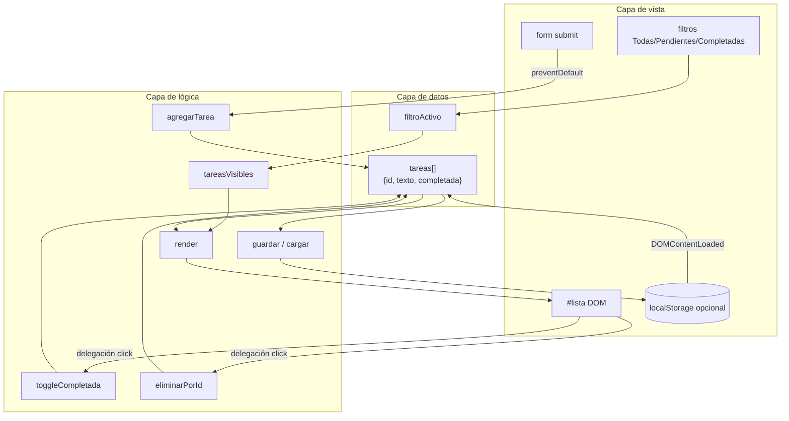
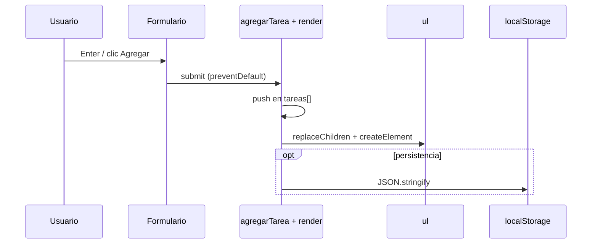

## Conceptos clave

- **Proyecto integrador PBPEW:** primera app de gestión de estado en el navegador. No introduces frameworks; unes **array de objetos** (lección 7) con **manipulación del DOM y eventos** (lección 10) en un flujo completo add → render → toggle → remove → filter.
- **Fuente de verdad en memoria:** el estado vive en un array JS, p. ej. `let tareas = []`. Cada tarea es un objeto literal con al menos `{ id, texto, completada }`. El DOM es la **vista** que refleja ese array; no es la base de datos.
- **Modelo de tarea recomendado:**

  ```javascript
  { id: 1, texto: "Estudiar DOM", completada: false }
  ```

  - `id` — identificador estable (número incremental o `Date.now()` / `crypto.randomUUID()` si el navegador lo permite).
  - `texto` — string del usuario; siempre mostrar con `textContent`, nunca `innerHTML` con entrada libre.
  - `completada` — boolean para estilos (`classList`) y filtros Pendientes / Completadas.
- **Flujo CRUD mínimo:**
  - **Create:** leer input → validar (no vacío, trim) → `push` al array → `render()`.
  - **Read:** `render()` pinta la lista desde el array.
  - **Update:** toggle `completada` al clic en el texto o checkbox → `render()`.
  - **Delete:** quitar del array por `id` (`.filter`) → `render()`.
- **`render()` como patrón central:** vaciar el contenedor (`lista.innerHTML = ""` solo en el contenedor controlado, o `replaceChildren()`), recorrer `tareas` con `.forEach` o `.map` y crear nodos con `createElement` + `textContent`. Evita duplicar lógica en cada acción.
- **Formulario sin recarga:** `<form id="form-tarea">` con `submit` + `event.preventDefault()`. Alternativa válida: botón `type="button"`; en PBPEW preferir formulario semántico con `preventDefault`.
- **Delegación de eventos:** un listener en `#lista` para clics en `.eliminar` y/o toggle de completada (`event.target.closest(...)`). Escala si re-renderizas la lista entera.
- **Filtros de vista (Todas / Pendientes / Completadas):** variable `filtroActivo` (`"todas" | "pendientes" | "completadas"`). En `render()`, mostrar `tareas.filter(...)` según el filtro; los datos en el array **no** se borran al filtrar.
- **Contadores:** `#total` o badges por filtro (`tareas.length`, `tareas.filter(t => !t.completada).length`, etc.).
- **Persistencia opcional (`localStorage`):** tras cada mutación, `localStorage.setItem("pbpew-tareas", JSON.stringify(tareas))`; al cargar, `JSON.parse` con `try/catch` y array vacío por defecto. Conecta serialización JSON (lección 7) con UX real.
- **Puente lección 12:** hoy el estado es local; mañana el mismo modelo podría sincronizarse con `fetch` a una API REST. Mantén funciones puras (`agregarTarea`, `eliminarTarea`) separadas de `render()` y `guardar()` para facilitar esa evolución.
- **Objetivos medibles (proyecto):**
  - Añadir y eliminar tareas sin recargar la página.
  - Marcar tareas como completadas con feedback visual.
  - Filtrar entre Todas, Pendientes y Completadas.
  - (Opcional) Recuperar la lista tras recargar gracias a `localStorage`.

## Errores comunes

- **El DOM como única fuente de verdad:** añades `<li>` con `appendChild` pero no actualizas un array; al filtrar o persistir no sabes qué hay. Solución: mutar array primero, luego `render()`.
- **Olvidar `preventDefault` en el formulario:** la página recarga y pierdes el estado en memoria (y da la impresión de que JS “no funciona”).
- **`innerHTML` con el texto del usuario:** riesgo XSS. Usar `textContent` en el nodo del título de la tarea.
- **Eliminar por índice del DOM tras filtrar:** el índice visual no coincide con el del array completo. Eliminar siempre por `id` estable.
- **No validar input vacío:** se crean tareas en blanco o solo espacios. Usar `texto.trim()` y salir temprano si `!texto`.
- **Listeners nuevos en cada `render()`:** si enlazas click en cada `<li>` dentro de `render()` sin limpiar, acumulas listeners duplicados. Preferir **un** listener delegado en el contenedor padre.
- **Mutar array filtrado:** `const visibles = tareas.filter(...); visibles.pop()` no quita del array original. Operar sobre `tareas` por `id`.
- **Guardar en `localStorage` sin serializar:** `setItem("tareas", tareas)` convierte a string `"[object Object]"`. Usar `JSON.stringify`.
- **Parsear sin manejar JSON corrupto:** `JSON.parse` lanza si el usuario editó DevTools → envolver en `try/catch` y resetear a `[]`.
- **Confundir filtro con borrado:** ocultar completadas no es lo mismo que eliminarlas del array.
- **Re-render completo vs actualizar un nodo:** para PBPEW está bien re-renderizar la lista entera si es corta; en listas enormes se optimizaría (fuera de alcance).

## Casos reales

### 1. Panel de soporte: tareas que “desaparecen” al cambiar de pestaña

Un equipo construye una lista de tickets en el front sin modelo en memoria: cada alta hace `appendChild` y cada filtro oculta nodos con `display: none`. Al marcar “Solo abiertos”, los cerrados quedan en el DOM pero invisibles; al contar pendientes usan `querySelectorAll("li:not(.oculto)")` y los totales no cuadran con el backend. Refactorizan con `tickets[]` en JS, `render()` según filtro y un solo `fetch` al guardar.

**Decisión clave:** separar **datos** (array), **vista** (`render`) y **acciones** (handlers). El filtro es una vista, no un borrado.

### 2. App de notas que pierde todo al refrescar

Los usuarios cierran el navegador y pierden la lista porque solo existía en el DOM. Producto pide “que se quede guardado”. El dev añade `localStorage` pero olvida llamar `guardar()` tras eliminar — al recargar, la tarea “revive”. QA reporta inconsistencia.

**Lección:** persistir **después de cada mutación** del array (add, toggle, delete) o tras una función `commit()` central. Mismo patrón que el carrito en lección 7.

## Ejemplos de código sugeridos

### HTML mínimo del proyecto

```html
<main id="app">
  <h1>Mis tareas</h1>
  <form id="form-tarea">
    <input id="input-tarea" type="text" placeholder="Nueva tarea" maxlength="120" required />
    <button type="submit">Agregar</button>
  </form>
  <nav id="filtros" aria-label="Filtrar tareas">
    <button type="button" data-filtro="todas" class="activo">Todas</button>
    <button type="button" data-filtro="pendientes">Pendientes</button>
    <button type="button" data-filtro="completadas">Completadas</button>
  </nav>
  <p id="resumen">0 pendientes · 0 completadas</p>
  <ul id="lista"></ul>
</main>
```

### Estado, alta y render

```javascript
let tareas = [];
let filtroActivo = "todas";
let siguienteId = 1;

const form = document.querySelector("#form-tarea");
const input = document.querySelector("#input-tarea");
const lista = document.querySelector("#lista");
const resumen = document.querySelector("#resumen");

function tareasVisibles() {
  if (filtroActivo === "pendientes") return tareas.filter((t) => !t.completada);
  if (filtroActivo === "completadas") return tareas.filter((t) => t.completada);
  return tareas;
}

function actualizarResumen() {
  const pendientes = tareas.filter((t) => !t.completada).length;
  const completadas = tareas.filter((t) => t.completada).length;
  resumen.textContent = `${pendientes} pendientes · ${completadas} completadas`;
}

function render() {
  lista.replaceChildren();
  tareasVisibles().forEach((tarea) => {
    const li = document.createElement("li");
    li.dataset.id = String(tarea.id);
    if (tarea.completada) li.classList.add("completada");

    const texto = document.createElement("span");
    texto.className = "texto";
    texto.textContent = tarea.texto;

    const btnEliminar = document.createElement("button");
    btnEliminar.type = "button";
    btnEliminar.className = "eliminar";
    btnEliminar.setAttribute("aria-label", "Eliminar tarea");
    btnEliminar.textContent = "×";

    li.append(texto, btnEliminar);
    lista.appendChild(li);
  });
  actualizarResumen();
}

function agregarTarea(texto) {
  const limpio = texto.trim();
  if (!limpio) return;
  tareas.push({ id: siguienteId++, texto: limpio, completada: false });
  render();
  guardar(); // opcional
}

form.addEventListener("submit", (e) => {
  e.preventDefault();
  agregarTarea(input.value);
  input.value = "";
  input.focus();
});
```

### Delegación: eliminar y marcar completada

```javascript
lista.addEventListener("click", (e) => {
  const btn = e.target.closest("button.eliminar");
  if (btn) {
    const id = Number(btn.closest("li").dataset.id);
    tareas = tareas.filter((t) => t.id !== id);
    render();
    guardar();
    return;
  }

  const texto = e.target.closest("span.texto");
  if (texto) {
    const id = Number(texto.closest("li").dataset.id);
    const tarea = tareas.find((t) => t.id === id);
    if (tarea) {
      tarea.completada = !tarea.completada;
      render();
      guardar();
    }
  }
});
```

### Filtros en la barra de navegación

```javascript
const filtros = document.querySelector("#filtros");

filtros.addEventListener("click", (e) => {
  const btn = e.target.closest("button[data-filtro]");
  if (!btn) return;
  filtroActivo = btn.dataset.filtro;
  filtros.querySelectorAll("button").forEach((b) => b.classList.remove("activo"));
  btn.classList.add("activo");
  render();
});
```

### Persistencia opcional con localStorage

```javascript
const STORAGE_KEY = "pbpew-tareas";

function guardar() {
  localStorage.setItem(STORAGE_KEY, JSON.stringify(tareas));
}

function cargar() {
  try {
    const raw = localStorage.getItem(STORAGE_KEY);
    if (!raw) return;
    const datos = JSON.parse(raw);
    if (!Array.isArray(datos)) return;
    tareas = datos;
    siguienteId = tareas.reduce((max, t) => Math.max(max, t.id), 0) + 1;
  } catch {
    tareas = [];
  }
}

document.addEventListener("DOMContentLoaded", () => {
  cargar();
  render();
});
```

### Enter en el input (refuerzo lección 10)

El `submit` del formulario ya captura Enter. Si usas solo botón suelto, escucha `keydown`:

```javascript
input.addEventListener("keydown", (e) => {
  if (e.key === "Enter") {
    e.preventDefault();
    agregarTarea(input.value);
    input.value = "";
  }
});
```

## Ejercicios de práctica

- **tipo:** reflexion — ¿Por qué conviene guardar las tareas en un array en lugar de leer solo lo que hay en el `<ul>`? (respuesta esperada: el array es la fuente de verdad; facilita filtrar, contar, persistir y sincronizar con API).
- **tipo:** reflexion — ¿Qué diferencia hay entre filtrar tareas y eliminarlas del array?
- **tipo:** codigo — Crea `const tareas = [{ id: 1, texto: "A", completada: false }]` y escribe `eliminarPorId(1)` que devuelva un **nuevo** array sin esa tarea usando `.filter`.
- **tipo:** codigo — Escribe `toggleCompletada(id)` que invierta `completada` en el objeto correcto dentro de `tareas` (mutación controlada + `render()`).
- **tipo:** completar-codigo — Completa: `form.addEventListener("submit", (e) => { e.___(); agregarTarea(input.value); });` → `preventDefault`.
- **tipo:** completar-codigo — Completa: `localStorage.setItem("tareas", JSON.___(tareas));` → `stringify`.
- **tipo:** ordenar-pasos — Ordena el flujo al pulsar Agregar: (a) `render()`, (b) usuario envía formulario, (c) `push` al array, (d) `preventDefault`, (e) leer y validar texto.
- **tipo:** diagrama — Dibuja tres cajas: Array `tareas`, función `render()`, DOM `#lista`; flechas en ambos sentidos indicando qué inicia cada actualización.
- **tipo:** codigo — Implementa `contarPendientes(tareas)` con `.filter` o `.reduce` sin tocar el DOM.
- **tipo:** reflexion — Si mañana sincronizas con `fetch`, ¿qué funciones separarías de la lógica de pintado?

## Animación o visual sugerida

- **Demo interactiva obligatoria — `TodoListDemo` (prioridad máxima):** réplica funcional embebida en la lección (no solo captura estática). Debe permitir:
  - Escribir tarea y agregar (form + `preventDefault`).
  - Ver lista renderizada desde estado interno.
  - Marcar completada (clic en texto o checkbox visual).
  - Eliminar con botón × (delegación).
  - Pestañas o botones **Todas / Pendientes / Completadas** con contadores.
  - Mensaje vacío contextual (“No hay pendientes”).
  - (Opcional en demo) toggle “Persistir en localStorage” o botón “Simular recarga” que demuestre recuperación.
- **StepReveal — ciclo de una acción:** paso 1 usuario envía formulario → paso 2 mutar array → paso 3 `render()` → paso 4 (opcional) `guardar()` → paso 5 DOM actualizado sin recarga.
- **CompareTable — estado vs DOM:**

  | Criterio | Solo DOM (`appendChild`) | Array + `render()` |
  |----------|--------------------------|-------------------|
  | Filtrar | Frágil (ocultar nodos) | `.filter` + re-pintar |
  | Persistir | Difícil de serializar | `JSON.stringify(tareas)` |
  | Eliminar por id | Índices inconsistentes | `.filter(t => t.id !== id)` |
  | Patrón PBPEW | Evitar como única fuente | Preferido |

- **MermaidDiagram — arquitectura del proyecto** (ver sección siguiente).
- **PracticeExercise embebido:** versión reducida para que el estudiante complete `agregarTarea` o `render()` con tests visuales (lista crece, contador sube).

## Diagrama Mermaid (si aplica)

### Arquitectura: modelo → vista → persistencia



### Secuencia: agregar tarea



## Reto integrador

**«Lista de tareas PBPEW»** — implementación completa en un solo HTML + JS (o bloques en la lección). Integra lecciones 01–12 en un mini-producto.

### Nivel base (obligatorio)

1. Estructura: formulario `#form-tarea`, input, botón Agregar, `#lista`, `#resumen` con totales.
2. Array `tareas` con objetos `{ id, texto, completada }`.
3. `submit` con `preventDefault`; no aceptar texto vacío (`trim`).
4. `render()` desde el array; `textContent` para el texto de la tarea.
5. Eliminar con delegación en `#lista` (botón `.eliminar` + `closest`).
6. Toggle `completada` al clic en el texto; clase CSS `.completada` (tachado u opacidad).

### Nivel intermedio

7. Filtros **Todas / Pendientes / Completadas** sin borrar datos del array.
8. Resumen: `N pendientes · M completadas`.
9. Limpiar input y devolver foco tras agregar.
10. Estado vacío por filtro (“No hay tareas completadas aún”).

### Nivel avanzado (desafíos profundos)

11. **Persistencia:** `localStorage` con clave `pbpew-tareas`; cargar al inicio; `try/catch` en `parse`; recalcular `siguienteId`.
12. **Editar en línea:** doble clic en el texto abre `<input>`; Enter guarda, Escape cancela; validar no vacío.
13. **Atajo de teclado:** `Ctrl+Backspace` o botón “Limpiar completadas” que hace `tareas = tareas.filter(t => !t.completada)`.
14. **Orden:** añadir `creadaEn: Date.now()` y botón para ordenar pendientes por más recientes primero.
15. **Preparación API (sin fetch obligatorio):** función `exportarJson()` que hace `console.log(JSON.stringify(tareas, null, 2))` simulando payload REST.
16. **Accesibilidad mínima:** `aria-label` en eliminar, `aria-pressed` o clase `activo` en el filtro seleccionado.

**Criterio de éxito:** una sola fuente de verdad en el array; DOM siempre derivado de `render()`; formulario sin recarga; delegación para acciones por ítem; filtros funcionales; código listo para añadir `localStorage` o `fetch` sin reescribir todo.

**Entrega sugerida en lección:** `PracticeExercise` con checklist autoevaluable + enlace a repo/plantilla opcional.

## Preguntas sugeridas para quiz (5)

1. **¿Cuál debe ser la fuente de verdad de las tareas en este proyecto?**
   - A) El número de `<li>` en el DOM
   - B) Un array de objetos en JavaScript
   - C) El valor del input
   - D) `localStorage` siempre, aunque no se haya guardado
   - **Correcta:** B
   - **Feedback:** El array modela el estado; el DOM solo lo muestra. `localStorage` es una copia opcional persistida.

2. **¿Qué hace `event.preventDefault()` en el `submit` del formulario de nueva tarea?**
   - A) Borra el array de tareas
   - B) Evita la recarga de la página
   - C) Deshabilita el teclado
   - D) Guarda automáticamente en el servidor
   - **Correcta:** B
   - **Feedback:** Sin `preventDefault`, el navegador recarga y pierdes el estado en memoria.

3. **Para eliminar la tarea con `id: 3`, ¿qué patrón es el más seguro?**
   - A) `tareas.splice(3, 1)` siempre
   - B) `tareas = tareas.filter(t => t.id !== 3)`
   - C) `lista.children[3].remove()` sin tocar el array
   - D) `delete tareas[3]`
   - **Correcta:** B
   - **Feedback:** Filtrar por `id` mantiene coherencia aunque cambie el orden o el filtro activo.

4. **Al mostrar el texto que escribió el usuario en un `<span>`, ¿qué propiedad debes usar?**
   - A) `innerHTML`
   - B) `outerHTML`
   - C) `textContent`
   - D) `insertAdjacentHTML`
   - **Correcta:** C
   - **Feedback:** `textContent` no interpreta HTML; reduce riesgo XSS con entrada libre.

5. **¿Qué ocurre al activar el filtro “Pendientes”?**
   - A) Se borran las tareas completadas del array
   - B) Solo cambia qué tareas muestra `render()`; el array completo sigue intacto
   - C) Se vacía `localStorage`
   - D) Se desactiva `preventDefault`
   - **Correcta:** B
   - **Feedback:** El filtro afecta la vista (`tareasVisibles`), no elimina datos del modelo.

## Referencias

- Contenido TSX (stub): `src/components/teaching/lessons/pbpew/proyectos/todo-list/`
- Secciones sugeridas para layout-spec: `ObjetivosSection`, `ArquitecturaSection`, `TodoListDemoSection` (demo interactiva principal), `ModeloDatosSection`, `FormularioYEstadoSection`, `RenderYDelegacionSection`, `FiltrosSection`, `PersistenciaOpcionalSection`, `RetoSection`, `CierreSection`
- Lecciones núcleo integradas: `07-arrays-json-objetos`, `10-dom-y-eventos`, `12-ajax-fetch`
- Reto previo (lección 10): mini lista DOM en `10-dom-y-eventos` — este proyecto añade modelo, filtros y persistencia
- MDN — Web Storage API: https://developer.mozilla.org/es/docs/Web/API/Window/localStorage
- MDN — JSON: https://developer.mozilla.org/es/docs/Web/JavaScript/Reference/Global_Objects/JSON
- MDN — Event delegation: https://developer.mozilla.org/es/docs/Learn_web_development/Core/Scripting/Event_bubbling#event_delegation
- MDN — createElement: https://developer.mozilla.org/es/docs/Web/API/Document/createElement
- MDN — preventDefault: https://developer.mozilla.org/es/docs/Web/API/Event/preventDefault
- Proyectos hermanos PBPEW: `proyectos/calculadora` (101), `proyectos/piedra-papel-tijera` (102)
