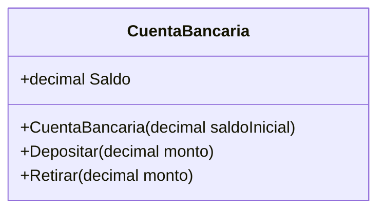
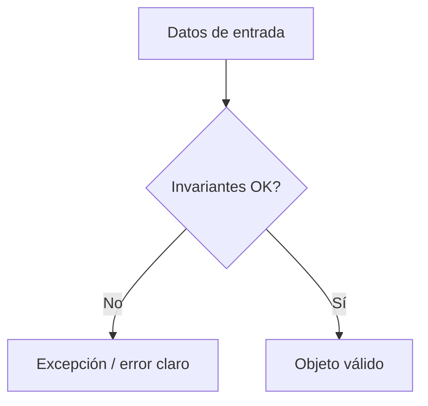
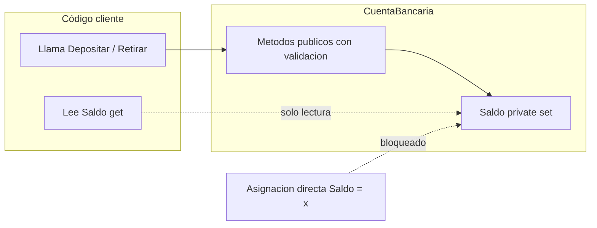

## Conceptos clave

- **Encapsulamiento:** principio de **controlar el acceso** al estado interno de un objeto. Ocultas detalles de implementación y expones solo lo necesario mediante métodos y propiedades públicas. La idea central: **nadie debería poder poner al objeto en un estado inválido** desde afuera.
- **Estado interno vs interfaz pública:** el estado vive en campos/propiedades (idealmente no mutables desde fuera); la interfaz pública son operaciones con nombres del dominio (`Depositar`, `Retirar`, `CancelarReserva`) que validan antes de cambiar el estado.
- **Modificadores de acceso en C#:**
  - `public` — visible desde cualquier código que tenga referencia al tipo.
  - `private` — solo dentro de la misma clase (default para miembros de clase si no se indica otro).
  - `protected` — la clase y sus derivadas (preview para lección herencia).
  - `internal` — dentro del mismo ensamblado (proyecto).
  - Combinaciones: `protected internal`, `private protected`.
- **Propiedades (`property`):** sintaxis C# que encapsula lectura/escritura con `get` y `set`. Sustituyen getters/setters verbosos de Java/C++ manteniendo control de acceso.
- **`{ get; private set; }`:** patrón frecuente — cualquiera puede **leer** el valor, pero solo la clase puede **modificarlo** (vía constructor o métodos internos).
- **Auto-propiedad:** `public decimal Saldo { get; private set; }` — el compilador genera un campo de respaldo. Útil cuando no necesitas lógica extra en get/set.
- **Propiedad con campo privado explícito:** cuando `set` requiere validación o transformación; el campo privado (`_saldo`) guarda el dato y la propiedad pública controla el acceso.
- **Getters y setters clásicos:** en C# moderno se prefieren propiedades; los métodos `ObtenerSaldo()` / `EstablecerSaldo()` solo si el dominio lo exige o por compatibilidad con APIs antiguas.
- **Invariante:** regla que **siempre** debe cumplirse para que el objeto sea válido (`Saldo >= 0`, `Fin > Inicio`, `Cantidad >= 0`). Se valida en el **constructor** y en todo **método que muta estado**.
- **DTO vs objeto de dominio:** un DTO (Data Transfer Object) solo transporta datos sin reglas — encapsulamiento estricto no aplica. Un objeto de dominio (cuenta, reserva, inventario) casi siempre requiere encapsulamiento.
- **Reducir acoplamiento:** los consumidores dependen del contrato público (qué operaciones existen), no de cómo se guarda el dato por dentro. Puedes cambiar la implementación interna sin romper código cliente.
- **Señales de buen uso:** `private set`, métodos con intención de dominio, validación junto al dato, excepciones claras (`ArgumentException`, `InvalidOperationException`).
- **Señales de mal uso:** setters públicos para todo, validación repetida en cada capa que usa el objeto, campos `public` mutables.

## Errores comunes

- **Setter público en todo:** `public decimal Saldo { get; set; }` permite `cuenta.Saldo = -999` desde cualquier parte — rompe la invariante de saldo no negativo.
- **Validar solo en la UI o en el controlador:** si el servicio también puede mutar el objeto sin pasar por la validación de la vista, el bug reaparece. La regla debe vivir **en el objeto**.
- **Confundir encapsular con esconder todo:** encapsular no es hacer todo `private` sin exponer nada útil; debes ofrecer operaciones públicas que expresen intención.
- **Propiedad con `set` público “por comodidad”:** en POCOs de EF o serialización se tolera, pero en dominio es deuda técnica. Preferir métodos de dominio o `private set`.
- **Olvidar validar en el constructor:** un objeto puede nacer inválido (`new CuentaBancaria(-100)`) si no validas al crear.
- **Invariantes solo documentadas:** comentarios del tipo “no poner saldo negativo” sin código — alguien eventualmente lo hará.
- **Exponer colecciones mutables:** `public List<Item> Items { get; set; }` permite que afuera hagan `cuenta.Items.Clear()`. Exponer `IReadOnlyList<T>` o métodos `Agregar`/`Quitar` controlados.
- **Lógica de negocio en el `set` de una propiedad sin mensaje claro:** `set` que lanza excepción genérica confunde al depurador. Usar mensajes con contexto (`"Fin ({fin}) debe ser posterior a Inicio ({inicio})"`).
- **Mezclar responsabilidades:** la clase valida saldo **y** formatea reportes PDF — la validación se dispersa. Mantener mutación y reglas en un solo lugar del dominio.
- **Asumir que `protected` encapsula hacia afuera:** las clases hijas pueden acceder a `protected` members; diseña la API pensando en herencia (lección 3).

## Casos reales

### 1. Incidente bancario: saldo negativo por setter público

Un equipo junior expone `public decimal Saldo { get; set; }` en `CuentaBancaria` para “facilitar tests”. Un módulo de migración de datos legacy ejecuta `cuenta.Saldo = cuenta.Saldo - ajuste` sin validar fondos. En producción aparecen cuentas con saldo `-847.50`. El reporte regulatorio falla; soporte debe corregir manualmente miles de registros.

**Decisión clave:** cambiar a `public decimal Saldo { get; private set; }`, forzar `Depositar`/`Retirar` con validación, y rechazar en code review cualquier asignación directa a `Saldo` fuera de la clase. El encapsulamiento convierte un bug silencioso en excepción localizada al punto de mutación.

### 2. Reservas de hotel: fechas invertidas en integración API

Un partner envía reservas vía JSON. El DTO se mapea a `Reserva` con propiedades públicas mutables. Un bug en el partner intercambia `inicio` y `fin`. El sistema guarda reservas con `Fin < Inicio`. Facturación calcula noches negativas; el canal de OTAs muestra “0 noches” y cancelaciones masivas.

**Decisión clave:** modelo de dominio `Reserva` con fechas de solo lectura (`public DateTime Inicio { get; }`) y validación en constructor: `if (fin <= inicio) throw new ArgumentException(...)`. La integración falla rápido con mensaje claro en lugar de persistir datos imposibles.

## Ejemplos de código sugeridos

### Cuenta bancaria — encapsulamiento básico (`private set`)

```csharp
using System;

public class CuentaBancaria
{
    public decimal Saldo { get; private set; }

    public CuentaBancaria(decimal saldoInicial)
    {
        if (saldoInicial < 0)
            throw new ArgumentException("Saldo inicial inválido");
        Saldo = saldoInicial;
    }

    public void Depositar(decimal monto)
    {
        if (monto <= 0)
            throw new ArgumentException("Monto inválido");
        Saldo += monto;
    }

    public void Retirar(decimal monto)
    {
        if (monto <= 0)
            throw new ArgumentException("Monto inválido");
        if (monto > Saldo)
            throw new InvalidOperationException("Fondos insuficientes");
        Saldo -= monto;
    }
}
```

### Anti-ejemplo — setter público rompe invariante

```csharp
public class CuentaInsegura
{
    public decimal Saldo { get; set; } // cualquiera puede asignar
}

// Uso problemático:
var c = new CuentaInsegura { Saldo = -999 };
```

### Propiedad con campo privado y validación en `set`

```csharp
public class Producto
{
    private int _cantidad;

    public int Cantidad
    {
        get => _cantidad;
        private set
        {
            if (value < 0)
                throw new ArgumentOutOfRangeException(nameof(value), "Cantidad no puede ser negativa");
            _cantidad = value;
        }
    }

    public void AjustarStock(int delta)
    {
        Cantidad += delta; // usa el setter privado vía método público
    }
}
```

### Reserva — invariante de fechas en constructor

```csharp
using System;

public class Reserva
{
    public DateTime Inicio { get; }
    public DateTime Fin { get; }

    public Reserva(DateTime inicio, DateTime fin)
    {
        if (fin <= inicio)
            throw new ArgumentException(
                $"Fin ({fin:yyyy-MM-dd}) debe ser posterior a Inicio ({inicio:yyyy-MM-dd})");
        Inicio = inicio;
        Fin = fin;
    }
}
```

### Modificadores de acceso — visibilidad típica

```csharp
public class EjemploAcceso
{
    private string _datoInterno;           // solo esta clase
    protected int contadorHijos;           // esta clase + derivadas
    internal Guid idSesion;                // mismo proyecto
    public string Nombre { get; private set; } // lectura pública, escritura interna
}
```

### Límite diario de retiro (extensión del ejemplo cuenta)

```csharp
public class CuentaConLimiteDiario : CuentaBancaria
{
    private const decimal LimiteDiario = 200m;
    private decimal _retiradoHoy;

    public CuentaConLimiteDiario(decimal saldoInicial) : base(saldoInicial) { }

    public new void Retirar(decimal monto)
    {
        if (_retiradoHoy + monto > LimiteDiario)
            throw new InvalidOperationException(
                $"Límite diario excedido. Retirado hoy: {_retiradoHoy}, límite: {LimiteDiario}");
        base.Retirar(monto);
        _retiradoHoy += monto;
    }
}
```

## Ejercicios de práctica

- **tipo:** reflexion — Explica con tus palabras por qué un cajero automático es analogía de encapsulamiento. ¿Qué operaciones expone y qué oculta?
- **tipo:** reflexion — ¿Cuándo un DTO no necesita encapsulamiento estricto y cuándo sí conviene un objeto de dominio encapsulado?
- **tipo:** codigo — Implementa `CuentaBancaria` con `Saldo { get; private set; }`, constructor que rechace saldo inicial negativo, y métodos `Depositar`/`Retirar`. Prueba en `Main` un retiro válido e intenta `cuenta.Saldo = -100` (debe fallar en compilación).
- **tipo:** completar-codigo — Completa la validación en el constructor de `Reserva`: `if (fin <= inicio) throw new ArgumentException("...");`
- **tipo:** codigo — Agrega a `CuentaBancaria` la regla de límite diario (`LimiteDiario = 200`, campo `_retiradoHoy`). Tres retiros de 80 deben fallar en el tercero.
- **tipo:** ordenar-pasos — Ordena el flujo al crear un objeto con invariantes: (a) validar datos de entrada, (b) asignar a campos/propiedades, (c) recibir datos en constructor, (d) si falla validación lanzar excepción, (e) objeto listo para usar.
- **tipo:** diagrama — Dibuja caja “cliente” con flechas solo hacia métodos públicos (`Depositar`, `Retirar`) y campo `Saldo` marcado como no accesible directamente desde fuera.
- **tipo:** reflexion — Compara `public decimal Saldo { get; set; }` vs `public decimal Saldo { get; private set; }`. ¿Qué invariante protege el segundo y no el primero?

## Animación o visual sugerida

- **CompareTable — setter público vs encapsulación con métodos de dominio:**

  | Aspecto | `Saldo { get; set; }` | `Saldo { get; private set; }` + `Retirar`/`Depositar` |
  |---------|------------------------|--------------------------------------------------------|
  | Quién puede cambiar saldo | Cualquier código | Solo la clase |
  | Validación | Dispersa o inexistente | Centralizada |
  | Estado inválido posible | Sí (`Saldo = -999`) | No (excepción al retirar) |
  | Cambio interno de implementación | Rompe si alguien asignó directo | Clientes usan métodos estables |

- **StepReveal — ciclo de una operación encapsulada (`Retirar`):**
  1. Cliente llama `cuenta.Retirar(30)`.
  2. Método valida `monto > 0`.
  3. Método comprueba invariante `monto <= Saldo`.
  4. Si OK, actualiza `Saldo` internamente.
  5. Cliente solo ve el nuevo saldo vía `get`, nunca asigna directo.

- **MermaidDiagram — clase `CuentaBancaria`:** ver sección Diagrama Mermaid (classDiagram).

- **MermaidDiagram — flujo de validación de invariantes:** ver sección Diagrama Mermaid (flowchart al crear `Reserva`).

## Diagrama Mermaid (si aplica)

### Clase CuentaBancaria (interfaz pública)



### Flujo: validar invariantes al crear objeto



### Encapsulamiento — quién accede a qué



## Reto integrador

**“Auditar el módulo de inventario”**

Te entregan este código de un sistema de almacén. QA reporta: stock negativo en reportes, cantidades que “saltan” sin trazabilidad, y un script de mantenimiento que hace `producto.Cantidad = 0` sin pasar por reglas.

```csharp
public class Producto
{
    public string Sku { get; set; }
    public int Cantidad { get; set; }
    public decimal PrecioUnitario { get; set; }
}

public class InventarioService
{
    public void RegistrarSalida(Producto producto, int unidades)
    {
        if (producto.Cantidad >= unidades) // validación duplicada en otro servicio también
            producto.Cantidad -= unidades;
    }

    public void AjusteManual(Producto producto, int nuevaCantidad)
    {
        producto.Cantidad = nuevaCantidad; // sin validar negativos
    }
}
```

**Tareas:**

1. Refactoriza `Producto` para proteger `Cantidad` con encapsulamiento: lectura pública, escritura solo vía métodos (`Ingresar`, `Retirar`, `Ajustar` con validación).
2. Define al menos **dos invariantes** explícitas (ej. `Cantidad >= 0`, `PrecioUnitario > 0`) y valídalas en constructor o métodos mutadores.
3. Elimina la validación duplicada de `InventarioService` — el servicio debe confiar en que `Producto` rechaza operaciones inválidas.
4. Escribe un `Main` que demuestre: retiro válido, retiro que lanza excepción por stock insuficiente, e intento de cantidad negativa en ajuste.

**Criterio de éxito:** ningún código externo puede asignar `Cantidad` directamente; invariantes se aplican en un solo lugar; excepciones con mensajes claros; `InventarioService` queda más simple porque la lógica vive en el dominio.

## Preguntas sugeridas para quiz (5)

1. **V/F: Encapsular significa esconder todo sin exponer nada al exterior.**
   - A) Verdadero
   - B) Falso
   - **Correcta:** B
   - **Feedback:** Encapsular es controlar el acceso: ocultas detalles internos pero expones una interfaz pública segura (métodos y propiedades de lectura).

2. **¿Cuál es una señal de buen encapsulamiento en C#?**
   - A) Setters públicos para todos los campos
   - B) Métodos que expresan intención del dominio y validan antes de mutar
   - C) Campos `public` para evitar boilerplate
   - D) Validar solo en la capa de presentación
   - **Correcta:** B
   - **Feedback:** Nombres como `Retirar` y `Depositar` comunican intención y centralizan reglas. Setters públicos y campos públicos permiten estados inválidos.

3. **V/F: El encapsulamiento ayuda a cambiar la implementación interna sin romper a los consumidores del objeto.**
   - A) Verdadero
   - B) Falso
   - **Correcta:** A
   - **Feedback:** Si los clientes usan métodos públicos estables en lugar de tocar campos internos, puedes refactorizar por dentro manteniendo el contrato.

4. **¿Dónde conviene validar invariantes como `Saldo >= 0`?**
   - A) Solo en comentarios de documentación
   - B) En el constructor y en métodos que cambian el estado
   - C) En cualquier capa, cuando te acuerdes
   - D) Solo en tests unitarios
   - **Correcta:** B
   - **Feedback:** Toda mutación de estado debe pasar por puntos que reafirman las reglas. El constructor cubre el nacimiento del objeto; los mutadores cubren cambios posteriores.

5. **¿Qué patrón C# impide `cuenta.Saldo = -100` desde fuera de la clase pero permite leer el saldo?**
   - A) `public decimal Saldo { get; set; }`
   - B) `private decimal Saldo { get; set; }`
   - C) `public decimal Saldo { get; private set; }`
   - D) `public decimal GetSaldo() { return _saldo; }` sin campo
   - **Correcta:** C
   - **Feedback:** `get` público expone lectura; `private set` restringe escritura a la propia clase. La opción A permite asignación externa; B no permite lectura pública directa.

## Referencias

- Fuente pedagógica: `kb/education/sources/clases/poo/02-encapsulamiento.md`
- TSX migrado: `src/components/teaching/lessons/poo/encapsulamiento/`
- Secciones actuales: `EncapsulamientoQueEsYSection`, `InvariantesReglasQueElSection`
- Lección anterior: `fundamentos` (clase, objeto, constructor, estado)
- Lección siguiente: `herencia` (`protected`, extensión de clases base)
- Microsoft Learn — Propiedades: https://learn.microsoft.com/es-es/dotnet/csharp/programming-guide/classes-and-structs/properties
- Microsoft Learn — Modificadores de acceso: https://learn.microsoft.com/es-es/dotnet/csharp/language-reference/keywords/access-modifiers
- Microsoft Learn — Encapsulación (OOP): https://learn.microsoft.com/es-es/dotnet/csharp/fundamentals/object-oriented/
