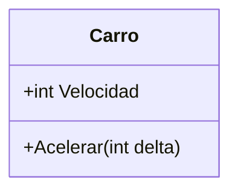
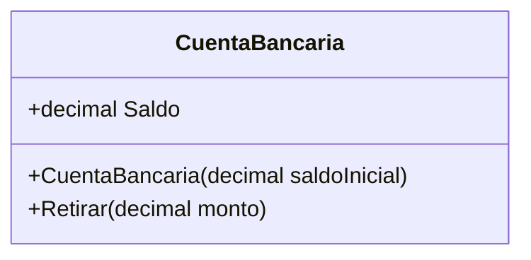
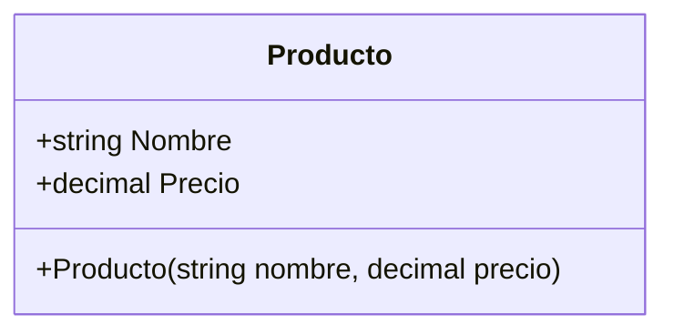
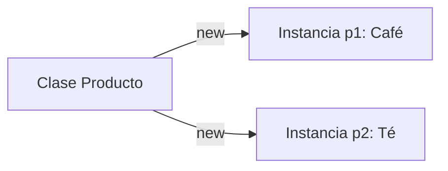
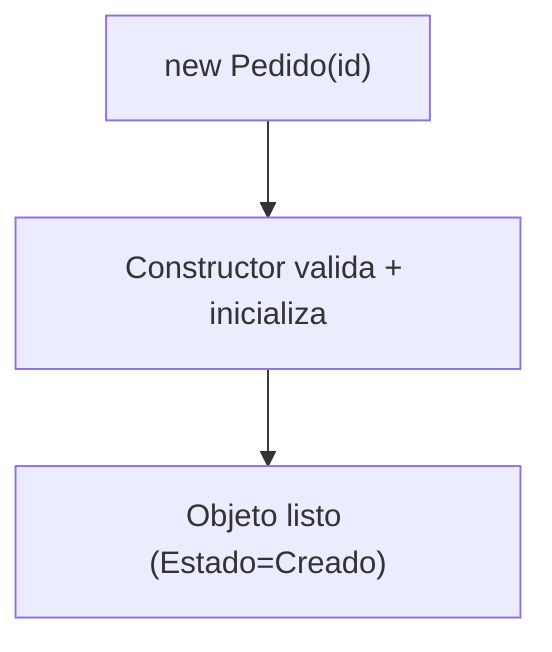

## Conceptos clave

- **Programación Orientada a Objetos (POO):** estilo de programación que organiza el software alrededor de **objetos** — entidades del dominio (Pedido, Usuario, Carrito) con **estado** (datos internos) y **comportamiento** (métodos). Modela el mundo como “cosas” con datos + acciones, agrupa responsabilidades y facilita reutilización y extensión sin copiar código.
- **Beneficios de POO:** reduce caos (unidades con responsabilidades claras), evita inconsistencias (el objeto protege sus reglas/invariantes), diseña para el cambio (nuevas variantes sin tocar todo el sistema). Aplica cuando hay reglas de negocio, estados válidos/inválidos y entidades que “hacen” cosas; no cuando el problema es pura transformación de datos (pipeline funcional simple).
- **Objeto:** instancia viva en memoria que representa algo del dominio. Tiene **identidad** (es “ese” objeto), **estado** (datos actuales) y **comportamiento** (métodos). Encapsula reglas: “solo se retira si hay saldo”, “un pedido no se envía sin pagar”. Evitar objetos anémicos (solo propiedades + reglas dispersas en servicios gigantes).
- **Clase:** el **molde** — definición de tipo que especifica qué datos (campos/propiedades) y qué acciones (métodos) tendrá cada objeto. No es el objeto; es la plantilla reutilizable. Una clase con responsabilidad clara (alta cohesión) es buen diseño; una clase “Dios” (reglas + I/O + UI + DB) es anti-patrón.
- **Instancia:** objeto **concreto** creado desde una clase con `new`. Dos instancias de la misma clase pueden tener estados distintos (`p1` café, `p2` té). Sirve para representar múltiples elementos del mismo tipo en colecciones y procesos.
- **Constructor:** método especial con el mismo nombre de la clase, sin tipo de retorno, que se ejecuta al crear el objeto (`new`). Deja el objeto en **estado válido**, valida entradas y asigna valores iniciales. Buen uso: validar lo esencial; mal uso: I/O pesada (HTTP, DB, archivos) en el constructor.
- **Estado vs comportamiento:** propiedades/campos = estado; métodos = comportamiento. Preferir métodos con intención (`Pagar()`, `Retirar()`) sobre setters públicos masivos que rompen el control del objeto.
- **Convenciones C#:** `dotnet console`, PascalCase para clases y métodos públicos, camelCase para variables locales y parámetros, `new` para instanciar, propiedades con `{ get; private set; }` para proteger estado.

## Errores comunes

- **Confundir clase con objeto:** la clase es la receta; el objeto es la galleta horneada. `Producto` es la clase; `new Producto("Café", 5.5m)` crea una instancia/objeto.
- **Exponer todo con `public set`:** permite que cualquier código ponga valores inválidos (velocidad negativa, saldo negativo). Rompe el encapsulamiento y las invariantes del dominio.
- **Olvidar inicializar estado en el constructor:** dejar propiedades sin valor o en estado inválido obliga a “arreglar” el objeto después de crearlo — frágil y propenso a bugs.
- **Crear instancias sin necesidad de estado:** si solo agrupas funciones sin datos, quizá basta un helper estático; no fuerces POO donde no aporta identidad ni reglas.
- **Constructor con lógica pesada:** leer archivos, llamar APIs o abrir conexiones DB al `new` hace lenta y frágil la creación; el constructor debe validar e inicializar, no orquestar el sistema.
- **Objeto anémico:** clase con solo propiedades públicas y toda la lógica en servicios externos. Pierdes el beneficio central de POO: reglas junto a los datos.
- **Asumir que dos instancias comparten estado:** cada `new` crea un objeto independiente; modificar `p1` no cambia `p2` automáticamente.
- **Usar strings libres para estados:** `Estado = "Pagado"` sin validar permite valores inválidos; más adelante conviene `enum` o tipos fuertes.

## Casos reales

### 1. E-commerce: saldo negativo por setter público

Un equipo migra un módulo de carrito de funciones sueltas a clases, pero deja `public decimal Saldo { get; set; }` en `CuentaBancaria`. Un bug en el checkout hace `cuenta.Saldo = -100` directamente. Los pedidos se procesan con saldo inválido hasta que auditoría detecta inconsistencias en reportes financieros.

**Decisión clave:** proteger estado con `private set` y exponer solo métodos (`Retirar`, `Depositar`) que validen montos y fondos. Refuerza que el objeto debe controlar sus reglas, no el código externo.

### 2. Sistema de pedidos: constructor vacío y estados inválidos

Un microservicio crea `Pedido` con constructor por defecto y luego llama setters desde otro servicio. A veces el pedido queda sin `Id`, con `Estado` null o ya “Pagado” sin pasar por el flujo. Soporte recibe tickets de “no puedo enviar el pedido” porque el estado nunca fue coherente desde el nacimiento del objeto.

**Decisión clave:** constructor que exija `id` válido y deje `Estado = "Creado"` (o enum equivalente). Un objeto debe nacer listo para usar, no “a medias”.

## Ejemplos de código sugeridos

### POO mínima: Carro con estado protegido

<!-- code: csharp -->
```csharp
using System;

public class Carro
{
    public int Velocidad { get; private set; }

    public void Acelerar(int delta)
    {
        if (delta <= 0) throw new ArgumentException("delta debe ser positivo");
        Velocidad += delta;
    }
}

public class Program
{
    public static void Main()
    {
        var carro = new Carro();
        carro.Acelerar(10);
        Console.WriteLine(carro.Velocidad); // 10
    }
}
```

### Objeto con reglas de negocio: CuentaBancaria

<!-- code: csharp -->
```csharp
using System;

public class CuentaBancaria
{
    public decimal Saldo { get; private set; }

    public CuentaBancaria(decimal saldoInicial)
    {
        if (saldoInicial < 0) throw new ArgumentException("Saldo inicial inválido");
        Saldo = saldoInicial;
    }

    public void Retirar(decimal monto)
    {
        if (monto <= 0) throw new ArgumentException("Monto inválido");
        if (monto > Saldo) throw new InvalidOperationException("Fondos insuficientes");
        Saldo -= monto;
    }
}
```

### Clase como molde: múltiples Producto

<!-- code: csharp -->
```csharp
using System;

public class Producto
{
    public string Nombre { get; }
    public decimal Precio { get; }

    public Producto(string nombre, decimal precio)
    {
        if (string.IsNullOrWhiteSpace(nombre)) throw new ArgumentException("Nombre requerido");
        if (precio < 0) throw new ArgumentException("Precio inválido");
        Nombre = nombre;
        Precio = precio;
    }
}

public class Program
{
    public static void Main()
    {
        var cafe = new Producto("Café", 5.5m);
        var te = new Producto("Té", 4.0m);
        Console.WriteLine($"{cafe.Nombre} - {cafe.Precio}");
        Console.WriteLine($"{te.Nombre} - {te.Precio}");
    }
}
```

### Instancias independientes en colección

<!-- code: csharp -->
```csharp
using System;
using System.Collections.Generic;

// Asume clase Producto definida arriba
var catalogo = new List<Producto>
{
    new Producto("Café", 5.5m),
    new Producto("Té", 4.0m),
    new Producto("Jugo", 6.0m)
};

foreach (var p in catalogo)
    Console.WriteLine(p.Nombre);
```

### Constructor que garantiza estado válido: Pedido

<!-- code: csharp -->
```csharp
using System;

public class Pedido
{
    public string Id { get; }
    public string Estado { get; private set; }

    public Pedido(string id)
    {
        if (string.IsNullOrWhiteSpace(id)) throw new ArgumentException("Id requerido");
        Id = id;
        Estado = "Creado";
    }

    public void Pagar()
    {
        if (Estado != "Creado") throw new InvalidOperationException("Solo se paga un pedido creado");
        Estado = "Pagado";
    }
}
```

### Anti-ejemplo: setter público rompe invariantes

<!-- code: csharp -->
```csharp
// Evitar: cualquiera puede poner velocidad negativa
public class CarroMalo
{
    public int Velocidad { get; set; } // ← rompe el control del objeto
}
```

## Ejercicios de práctica

- **tipo:** reflexion — Explica con tus palabras qué gana un proyecto al modelar un “carrito de compras” como objeto en lugar de variables sueltas (`total`, `items`, `descuento`) repartidas por funciones.
- **tipo:** reflexion — ¿Cuándo POO **no** sería la mejor opción? Da un ejemplo de problema de transformación de datos donde un enfoque funcional simple bastaría.
- **tipo:** reflexion — Analogía receta vs galleta: ¿qué parte es la clase y qué parte es la instancia en `var cafe = new Producto("Café", 5.5m);`?
- **tipo:** codigo — Crea un `Carro`, llama `Acelerar(10)` y muestra `Velocidad` en consola. Luego intenta `Acelerar(-5)` y observa la excepción.
- **tipo:** codigo — Implementa `Depositar(decimal monto)` en `CuentaBancaria` rechazando montos ≤ 0. Prueba depósito y retiro válidos.
- **tipo:** codigo — Crea `var cuenta = new CuentaBancaria(50);` y llama `Retirar(80);`. Mejora el mensaje de error para incluir saldo actual y monto solicitado.
- **tipo:** codigo — Crea una `List<Producto>` con 3 instancias e imprime los nombres con `foreach`.
- **tipo:** codigo — Crea `var p = new Pedido("");` y ajusta el mensaje de validación. Crea `var p2 = new Pedido("P-1");`, llama `Pagar()` dos veces; la segunda debe fallar con excepción clara.
- **tipo:** diagrama — Dibuja o etiqueta: Clase `Producto` → flechas `new` → instancias `p1`, `p2` con nombres y precios distintos.
- **tipo:** ordenar-pasos — Ordena el ciclo de vida: (a) constructor valida e inicializa, (b) objeto listo en memoria, (c) `new Pedido(id)`, (d) métodos como `Pagar()` modifican estado con reglas.
- **tipo:** completar-codigo — Completa: `var cafe = ___ Producto("Café", 5.5m);` y `public ___ Saldo { get; private set; }` → `new`, `decimal`.

## Animación o visual sugerida

- **CompareTable — clase vs instancia vs objeto:**

  | Término | Qué es | Ejemplo |
  |---------|--------|---------|
  | Clase | Molde / definición de tipo | `class Producto` |
  | Instancia | Objeto concreto creado con `new` | `var cafe = new Producto(...)` |
  | Objeto | Entidad en memoria con identidad, estado y comportamiento | `cafe` con su `Nombre` y `Precio` actuales |

- **StepReveal — creación de objeto:** (1) defines la clase, (2) escribes `new Producto(...)`, (3) se ejecuta el constructor, (4) el objeto queda listo en memoria, (5) llamas métodos que respetan reglas.
- **MermaidDiagram — POO Carro:** diagrama de clase `Carro` con `Velocidad` y `Acelerar(int)` (sección 1).
- **MermaidDiagram — flujo constructor Pedido:** `new Pedido(id)` → constructor valida → `Estado = "Creado"` → objeto listo.
- **MermaidDiagram — clase a instancias:** `Clase Producto` con flechas `new` a `p1` y `p2` (sección 4).

## Diagrama Mermaid (si aplica)

### Clase Carro (estado + comportamiento)



### Clase CuentaBancaria



### Clase Producto (molde)



### Clase → instancias



### Flujo del constructor



## Reto integrador

**“Diseña tu primer dominio”**

Un restaurante necesita un sistema simple de pedidos en consola. Debes modelar:

1. Clase `Producto` con `Nombre`, `Precio` y constructor que rechace nombre vacío y precio negativo.
2. Clase `Pedido` con `Id`, `Estado` (inicia en `"Creado"`) y constructor que exija `id` válido.
3. Método `Pagar()` en `Pedido` que solo permita pagar si `Estado == "Creado"` y luego cambie a `"Pagado"`.
4. En `Main`: crea al menos 2 `Producto`, 1 `Pedido` válido, págalo una vez con éxito e intenta pagarlo de nuevo (debe fallar).

**Criterio de éxito:** distingue clase/instancia, constructor deja estado válido, métodos protegen reglas, excepciones con mensajes claros, código compila con `dotnet run`.

**Extensión opcional:** lista `List<Producto>` con 3 ítems del menú e imprime el catálogo antes de crear el pedido.

## Preguntas sugeridas para quiz (5)

1. **¿Qué define mejor a un objeto en POO?**
   - A) Solo datos
   - B) Datos + comportamiento
   - C) Solo funciones
   - D) Solo el constructor
   - **Correcta:** B
   - **Feedback:** Un objeto combina estado (propiedades) y comportamiento (métodos). No es un simple contenedor de datos ni solo funciones sueltas.

2. **V/F: En POO, un objeto siempre debe exponer todos sus datos con `public set`.**
   - A) Verdadero
   - B) Falso
   - **Correcta:** B
   - **Feedback:** Exponer `public set` rompe el encapsulamiento. El objeto debe controlar cómo cambia su estado (p. ej. `private set` + métodos validados).

3. **¿Qué keyword crea una instancia en C#?**
   - A) `class`
   - B) `new`
   - C) `using`
   - D) `static`
   - **Correcta:** B
   - **Feedback:** `new Producto(...)` invoca el constructor y crea un objeto en memoria. `class` define el molde; no crea instancias.

4. **¿Cuándo se ejecuta el constructor?**
   - A) Al compilar el proyecto
   - B) Al crear el objeto con `new`
   - C) Al cerrar la aplicación
   - D) Solo si llamas un método `Init()`
   - **Correcta:** B
   - **Feedback:** El constructor corre automáticamente en la creación (`new`). Su rol es dejar el objeto en estado válido desde el inicio.

5. **¿Cuál es un beneficio típico de POO bien aplicada?**
   - A) Menos reglas de negocio
   - B) Cambios más localizados y mantenibles
   - C) Eliminar la necesidad de validar datos
   - D) Evitar usar clases
   - **Correcta:** B
   - **Feedback:** Agrupar datos y reglas en objetos localiza cambios. POO no elimina validaciones; las concentra donde corresponde.

## Referencias

- Fuente docente: `kb/education/sources/clases/poo/01-fundamentos.md`
- TSX migrado: `src/components/teaching/lessons/poo/fundamentos/`
- Secciones: `QueEsLaProgramacionSection`, `QueEsUnObjetoSection`, `QueEsUnaClaseSection`, `QueEsUnaInstanciaSection`, `QueEsUnConstructorSection`
- Microsoft Learn — Clases y objetos (C#): https://learn.microsoft.com/es-es/dotnet/csharp/fundamentals/object-oriented/
- Microsoft Learn — Constructores (C#): https://learn.microsoft.com/es-es/dotnet/csharp/programming-guide/classes-and-structs/constructors
- Lección siguiente: `encapsulamiento` (protección de estado y visibilidad de miembros)
