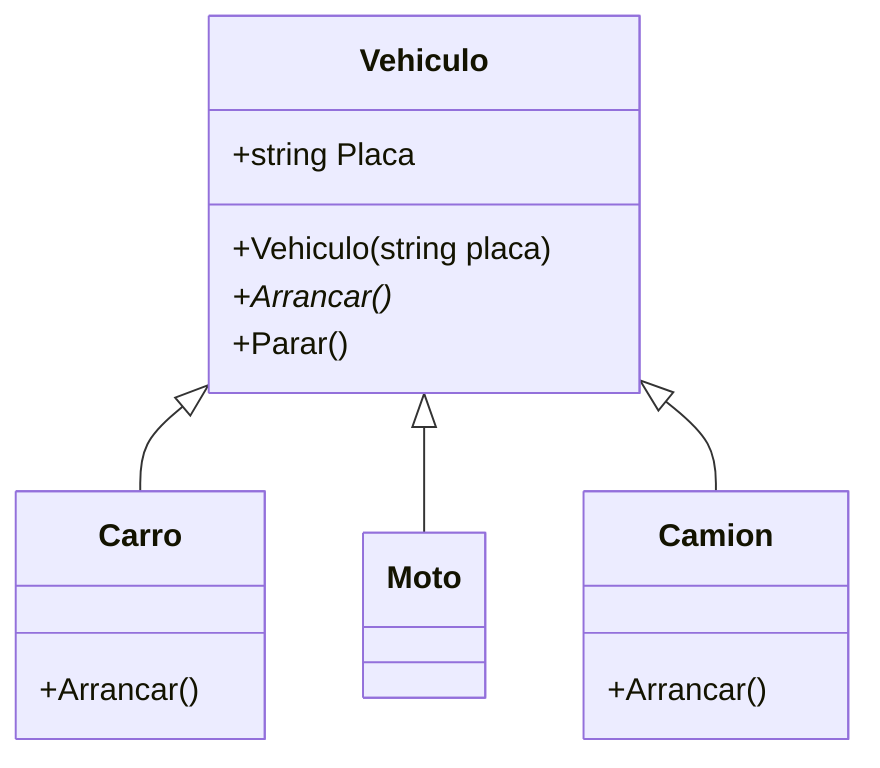
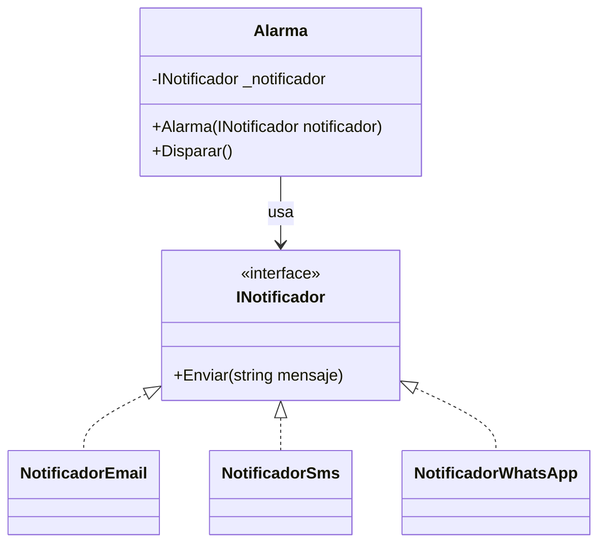
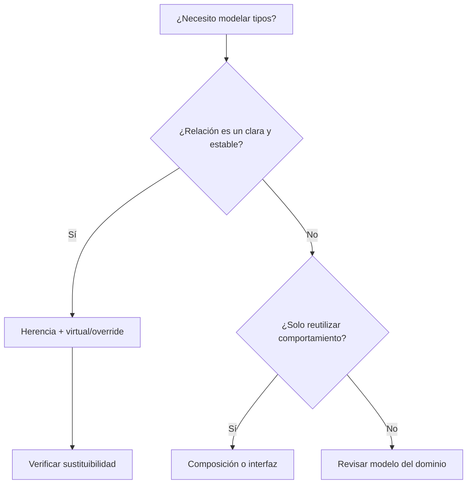

## Conceptos clave

- **Herencia:** mecanismo donde una **clase derivada** (hija) obtiene estado y comportamiento de una **clase base** (padre). En C#: `class Carro : Vehiculo { }`.
- **Relación “es un” (is-a):** un `Carro` **es un** `Vehiculo`; un `Moto` **es un** `Vehiculo`. No confundir con “tiene un” (composición).
- **Reutilización con sentido:** compartir lógica común (`Placa`, `Arrancar`) sin duplicar en cada subclase.
- **Especialización:** la derivada añade o redefine comportamiento propio del dominio (`Carro` arranca distinto que `Moto`).
- **Constructor y `base(...)`:** si la base exige parámetros, la derivada debe invocar `base(placa)` en su constructor antes de añadir lógica propia.
- **`virtual` en la base:** marca un método que **puede** redefinirse en derivadas. Sin `virtual` (ni `abstract`), no hay polimorfismo real en override.
- **`override` en la derivada:** reemplaza la implementación del método base respetando la firma. Habilita comportamiento distinto por tipo en tiempo de ejecución.
- **Polimorfismo (preview):** variable de tipo base puede apuntar a instancia derivada: `Vehiculo v = new Carro("ABC-123");` — la llamada a `v.Arrancar()` ejecuta la versión del tipo real (`Carro`).
- **Sustituibilidad (preview LSP):** la derivada debe poder usarse donde se espera la base **sin romper expectativas** (mismos contratos, invariantes respetadas).
- **Acoplamiento:** herencia profunda ata las derivadas a la base; un cambio en `Vehiculo` puede propagarse a muchas clases.
- **Cuándo NO heredar:** si solo buscas reutilizar código, si el “es un” es forzado o inestable, o si necesitas combinar capacidades heterogéneas → preferir **composición**.
- **Composición:** un objeto **usa** otro como parte (`Alarma` **tiene** un `INotificador`). Varias implementaciones (`Email`, `Sms`, `WhatsApp`) sin tocar `Alarma`.
- **Interfaz como contrato:** `INotificador` define `Enviar(string)`; las clases concretas implementan. Inyección por constructor desacopla `Alarma` del canal concreto.

## Errores comunes

- **Heredar solo para copiar código:** `class ReportePdf : UtilidadesString` cuando no hay relación “es un” — mejor extraer método estático o componer un helper.
- **Olvidar `base(...)` en el constructor:** `public Carro(string placa) { }` sin `: base(placa)` → error de compilación si la base no tiene constructor sin parámetros.
- **`override` sin `virtual`/`abstract` en la base:** el compilador rechaza el override; confundir con `new` (ocultamiento) que no da polimorfismo.
- **Romper expectativas de la base:** `class Cuadrado : Rectangulo` con `Ancho` y `Alto` independientes viola la idea de “rectángulo” — antipatrón clásico de herencia mala.
- **Jerarquías profundas o rígidas:** `Animal` → `Mamifero` → `Domestico` → `PerroGolden` → … dificulta cambios y pruebas.
- **Confundir “tiene un” con “es un”:** `class Celular : Camara` — un celular no es una cámara; tiene una cámara (composición).
- **Modificar la base y romper derivadas:** cambiar firma o semántica de `Arrancar()` sin revisar todas las hijas.
- **Usar herencia para “mezclar” capacidades:** `PatoElectricoConBluetoothConGPS` — explosión de subclases; mejor interfaces + composición.
- **Asumir que herencia = encapsulamiento:** campos `protected` expuestos a toda la jerarquía pueden saltarse invariantes; preferir `private` + métodos protegidos bien diseñados.

## Casos reales

### 1. Flota de transporte: jerarquía que rompe el dominio

Un sistema de logística modela `Vehiculo` → `Camion` → `CamionRefrigerado`. El equipo añade `CamionRefrigeradoElectrico` y descubre que `Arrancar()` en la base asume motor de combustión; `Parar()` en `Camion` libera remolque pero `Moto` no tiene remolque y lanza excepción si hereda el mismo método sin adaptar.

**Incidente:** el dashboard llama `foreach (var v in flota) v.Parar()` y falla en motos tras el refactor.

**Lección:** heredar solo cuando el “es un” es estable y los contratos de la base aplican a **todas** las derivadas. Si el comportamiento diverge mucho, composición (motor, sistema de frenado) o interfaces específicas evitan cascadas de `override` vacíos o excepciones.

### 2. Alertas de monitoreo: decisión herencia vs composición

Un servicio de alertas necesita enviar por email, SMS y luego WhatsApp. Un desarrollador propone `AlarmaEmail : AlarmaBase`, `AlarmaSms : AlarmaBase`. Añadir WhatsApp implica nueva subclase y duplicar lógica de `Disparar()`.

**Decisión empresarial:** refactor a `Alarma` con `INotificador` inyectado. Nuevos canales = nueva clase que implementa la interfaz; `Alarma` no cambia.

**Lección:** “necesito reutilizar envío” no implica “necesito heredar”. Composición + interfaz reduce acoplamiento y acelera extensión (principio abierto/cerrado, preview SOLID).

## Ejemplos de código sugeridos

### Herencia mínima: Vehiculo, Carro, Moto

```csharp
using System;

public class Vehiculo
{
    public string Placa { get; }

    public Vehiculo(string placa)
    {
        if (string.IsNullOrWhiteSpace(placa))
            throw new ArgumentException("Placa requerida");
        Placa = placa;
    }

    public virtual void Arrancar()
    {
        Console.WriteLine("Vehículo arrancando...");
    }
}

public class Carro : Vehiculo
{
    public Carro(string placa) : base(placa) { }

    public override void Arrancar()
    {
        Console.WriteLine("Carro arrancando (inyección + encendido)...");
    }
}

public class Moto : Vehiculo
{
    public Moto(string placa) : base(placa) { }
}
```

### Polimorfismo con tipo base

```csharp
Vehiculo v1 = new Carro("ABC-123");
Vehiculo v2 = new Moto("XYZ-999");

v1.Arrancar(); // Carro arrancando...
v2.Arrancar(); // Vehículo arrancando... (implementación base)
```

### Método común sin override: Parar()

```csharp
public class Vehiculo
{
    // ... constructor y Arrancar virtual ...

    public void Parar()
    {
        Console.WriteLine("Vehículo detenido.");
    }
}
// Todas las derivadas heredan Parar() igual; no hace falta override.
```

### Lista polimórfica y foreach

```csharp
using System.Collections.Generic;

var flota = new List<Vehiculo>
{
    new Carro("ABC-123"),
    new Moto("XYZ-999"),
    new Camion("TRL-001") // Camion : Vehiculo con override de Arrancar
};

foreach (var v in flota)
    v.Arrancar();
```

### Composición: Alarma + INotificador

```csharp
using System;

public interface INotificador
{
    void Enviar(string mensaje);
}

public class NotificadorEmail : INotificador
{
    public void Enviar(string mensaje) =>
        Console.WriteLine($"Email: {mensaje}");
}

public class NotificadorSms : INotificador
{
    public void Enviar(string mensaje) =>
        Console.WriteLine($"SMS: {mensaje}");
}

public class Alarma
{
    private readonly INotificador _notificador;

    public Alarma(INotificador notificador)
    {
        _notificador = notificador ?? throw new ArgumentNullException(nameof(notificador));
    }

    public void Disparar() => _notificador.Enviar("Alerta!");
}
```

### Extender sin modificar Alarma: NotificadorWhatsApp

```csharp
public class NotificadorWhatsApp : INotificador
{
    public void Enviar(string mensaje) =>
        Console.WriteLine($"WhatsApp: {mensaje}");
}

// Uso:
var alarma = new Alarma(new NotificadorWhatsApp());
alarma.Disparar();
```

## Ejercicios de práctica

- **tipo:** reflexion — Explica con tus palabras la diferencia entre “es un” y “tiene un”. Da un ejemplo de dominio (biblioteca, hospital, e-commerce) para cada uno.
- **tipo:** reflexion — ¿Por qué `Moto` puede usar `Arrancar()` de la base sin `override`, pero `Carro` define el suyo? ¿Qué decide el programador?
- **tipo:** codigo — Crea `Camion : Vehiculo` con constructor que llama `base(placa)` y `override` de `Arrancar()` con mensaje propio. Instancia y prueba en `Main`.
- **tipo:** codigo — Añade `Parar()` en `Vehiculo` (sin virtual). Verifica que `Carro` y `Moto` lo heredan sin redefinir.
- **tipo:** completar-codigo — Completa la lista polimórfica:
  ```csharp
  var flota = new List<Vehiculo> { new Carro("A"), new ___, new ___ };
  foreach (var v in flota) v.___();
  ```
- **tipo:** diagrama — Dibuja (papel o Mermaid) `Vehiculo <|-- Carro`, `Vehiculo <|-- Moto`, `Vehiculo <|-- Camion` con al menos un método `virtual` y uno heredado sin override.
- **tipo:** ordenar-pasos — Ordena el flujo al construir `new Carro("ABC-123")`: (a) se ejecuta constructor de `Carro`, (b) se invoca `base("ABC-123")`, (c) se asigna `Placa` en `Vehiculo`, (d) objeto listo para usar.
- **tipo:** codigo — Implementa `NotificadorWhatsApp : INotificador` y `new Alarma(new NotificadorWhatsApp()).Disparar()` sin editar `Alarma`.
- **tipo:** reflexion — Nombra dos señales de **mal** uso de herencia y dos de **buen** uso según la lección.

## Animación o visual sugerida

- **StepReveal — construcción de una derivada:**
  1. Cliente llama `new Carro("ABC-123")`.
  2. Entra constructor `Carro` → delega en `base(placa)`.
  3. `Vehiculo` valida placa y fija `Placa`.
  4. Objeto `Carro` listo; tipo declarado puede ser `Vehiculo` o `Carro`.

- **CompareTable — herencia vs composición:**

  | Criterio | Herencia (`: Base`) | Composición (`tiene un`) |
  |----------|---------------------|---------------------------|
  | Relación | “Es un” | “Tiene un” / “Usa un” |
  | Reutilización | Comportamiento de la base | Delegar en objeto interno |
  | Extensión | Nuevas subclases | Nuevas implementaciones de interfaz |
  | Acoplamiento | Alto con jerarquía profunda | Menor si dependes de abstracción |
  | Riesgo típico | Romper contrato de la base | Más clases pequeñas que coordinar |

- **MermaidDiagram — sección 1:** jerarquía `Vehiculo` / `Carro` / `Moto` (ver Diagrama Mermaid).

- **MermaidDiagram — sección 2:** `Alarma` → `INotificador` con implementaciones (ver Diagrama Mermaid).

- **StepReveal — llamada polimórfica:** variable `Vehiculo v = new Carro(...)` → `v.Arrancar()` → resolución en runtime a `Carro.Arrancar`.

## Diagrama Mermaid (si aplica)

### Jerarquía de vehículos (herencia)



### Composición: Alarma y notificadores



### Decisión de diseño (flujo)



## Reto integrador

**“Sistema de flota y alertas”**

Un taller de POO pide un prototipo en consola (.NET) que combine herencia bien aplicada y composición donde corresponda.

**Parte A — Dominio vehículos**

1. Clase base `Vehiculo` con `Placa`, constructor validado, `virtual void Arrancar()` y `void Parar()`.
2. Derivadas `Carro`, `Moto` y `Camion` con `override` de `Arrancar()` (mensajes distintos y creíbles).
3. Método estático o local que reciba `List<Vehiculo>` y ejecute `Arrancar()` y luego `Parar()` en cada elemento.

**Parte B — Alertas (sin herencia entre canales)**

4. Interfaz `INotificador` con `Enviar(string)`.
5. Implementaciones `NotificadorEmail`, `NotificadorSms`, `NotificadorWhatsApp`.
6. Clase `Alarma` con constructor que recibe `INotificador` y método `Disparar()`.
7. En `Main`, crea al menos dos alarmas con notificadores distintos y dispara ambas.

**Parte C — Criterio de diseño**

8. En un comentario o párrafo breve, justifica por qué **no** hiciste `AlarmaEmail : AlarmaBase` y por qué `Camion` **sí** hereda de `Vehiculo`.

**Criterio de éxito:** compila en `dotnet run`; cada vehículo imprime su `Arrancar()`; `Parar()` funciona sin override; nuevos notificadores se añaden sin editar `Alarma`; la justificación distingue “es un” vs “tiene un”.

## Preguntas sugeridas para quiz (5)

1. **¿Herencia representa mejor qué tipo de relación?**
   - A) “Tiene un”
   - B) “Es un”
   - C) “Usa temporalmente”
   - D) “Es igual a”
   - **Correcta:** B
   - **Feedback:** Herencia modela especialización: un `Carro` es un `Vehiculo`. “Tiene un” corresponde a composición.

2. **En C#, ¿qué combinación permite polimorfismo con redefinición de método?**
   - A) Método normal en base + `override` en hija
   - B) `virtual` en base + `override` en hija
   - C) `override` en base + `virtual` en hija
   - D) Solo `new` en hija
   - **Correcta:** B
   - **Feedback:** La base debe marcar el método como `virtual` (o `abstract`); la derivada usa `override`. `new` oculta pero no polimorfiza igual.

3. **V/F: La herencia se usa solo para evitar duplicar código.**
   - **Correcta:** Falso
   - **Feedback:** Reutilizar código es un beneficio secundario; el criterio principal es una relación “es un” válida y sustituibilidad. Si solo copias código, composición suele ser mejor.

4. **“Un celular tiene cámara, GPS y batería.” ¿Qué patrón encaja mejor?**
   - A) Herencia múltiple de `Camara`, `Gps`, `Bateria`
   - B) Composición / agregación
   - C) `class Camara : Celular`
   - D) Solo namespaces
   - **Correcta:** B
   - **Feedback:** El celular no es una cámara; la incorpora. En C# se modela con campos o interfaces y composición (lección 4 profundiza asociación/agregación/composición).

5. **Dado `Vehiculo v = new Carro("X"); v.Arrancar();` con `Arrancar` virtual/override, ¿qué ocurre?**
   - A) Siempre se ejecuta `Vehiculo.Arrancar`
   - B) Se ejecuta `Carro.Arrancar` (tipo real del objeto)
   - C) Error de compilación
   - D) Se ejecutan ambos en orden
   - **Correcta:** B
   - **Feedback:** La variable es de tipo base pero el objeto es `Carro`; el dispatch en runtime llama al override correcto (polimorfismo).

## Referencias

- Fuente pedagógica: `kb/education/sources/clases/poo/03-herencia.md`
- Lección anterior: `encapsulamiento` — invariantes y contrato antes de exponer jerarquías
- Lección siguiente: `asociacion-agregacion-composicion` — matiza “tiene un” (asociación, agregación, composición)
- TSX existente: `src/components/teaching/lessons/poo/herencia/`
- Secciones: `HerenciaQueEsYSection`, `CuandoNoUsarHerenciaSection`
- Microsoft Learn — Herencia (C#): https://learn.microsoft.com/es-es/dotnet/csharp/fundamentals/object-oriented/inheritance
- Microsoft Learn — Polimorfismo: https://learn.microsoft.com/es-es/dotnet/csharp/fundamentals/object-oriented/polymorphism
- Microsoft Learn — Interfaces: https://learn.microsoft.com/es-es/dotnet/csharp/fundamentals/types/interfaces
- Topic expert: `kb/agents/topic-experts/poo-csharp.md`
