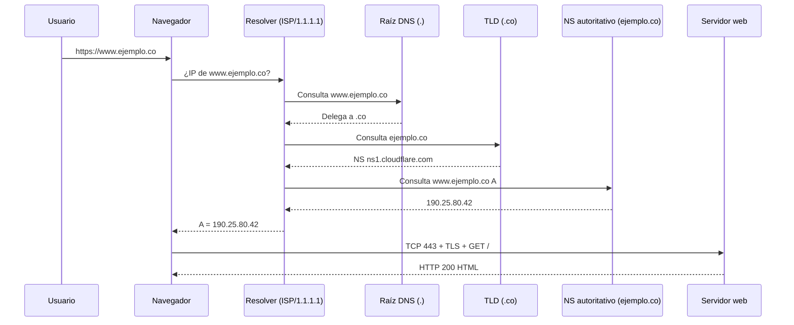
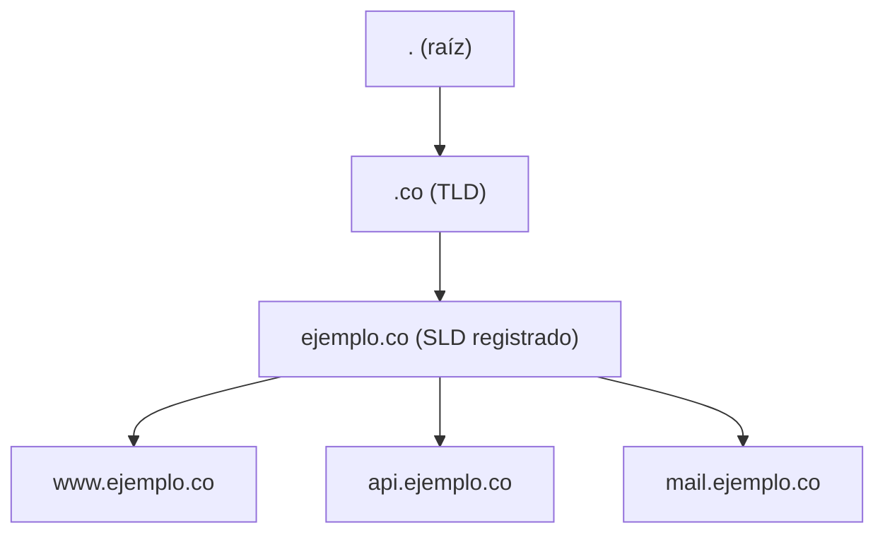

## Objetivos medibles

Al finalizar la lección el estudiante podrá:

1. Comparar **navegadores web** y sus **motores de renderizado** (Blink, Gecko, WebKit); configurar cookies, caché y privacidad; usar DevTools (Red, Consola, Almacenamiento) para diagnosticar problemas.
2. Explicar qué es una **dirección IP**, su composición en **IPv4** (octetos, bits) y **IPv6** (hexadecimal, 128 bits); distinguir IP pública, privada, fija y dinámica.
3. Consultar la IP local y pública con comandos en **Windows** (`ipconfig`) y **Linux** (`ip addr`, `curl ifconfig.me`).
4. Describir la **estructura de un dominio** (subdominio, SLD, TLD), tipos de TLD y ventajas de un dominio propio; registrar un dominio en LATAM (p. ej. `.co` vía NIC Colombia).
5. Explicar el **flujo DNS** paso a paso (URL → resolver → respuesta A) y configurar **registros DNS** (A, AAAA, CNAME, MX, TXT, NS, SOA) con nameservers y subdominios.

## Conceptos clave

### 1. Navegadores web

#### Qué es

Un **navegador web** es una aplicación cliente que interpreta documentos hipertexto (HTML, CSS, JavaScript), gestiona sesiones con servidores remotos y presenta la interfaz al usuario. Es el punto de entrada más común al modelo cliente-servidor en la web.

#### Para qué sirve / Por qué importa

Sin navegador (o cliente equivalente), el usuario no puede consumir sitios ni APIs desde una interfaz gráfica. Para un administrador de servicios web, entender el navegador permite diagnosticar si un fallo es del servidor, de la red, de la caché local o de extensiones que alteran el tráfico.

#### Cómo funciona

1. El usuario escribe una URL o hace clic en un enlace.
2. El navegador resuelve el dominio (DNS), abre conexión TCP/TLS y envía peticiones HTTP(S).
3. Recibe HTML, CSS, JS, imágenes y otros recursos; el **motor de renderizado** construye el DOM, aplica estilos y ejecuta scripts.
4. Almacena cookies, caché y datos locales según políticas de sitio y configuración del usuario.

#### Estructura / Composición

| Componente | Función |
|----------|---------|
| **UI** | Barra de direcciones, pestañas, favoritos |
| **Motor de red** | DNS, HTTP, TLS, caché HTTP |
| **Motor de renderizado** | Layout, pintura, composición de capas |
| **Motor JavaScript** | Ejecuta scripts (V8, SpiderMonkey, JavaScriptCore) |
| **Almacenamiento** | Cookies, `localStorage`, IndexedDB, Service Workers |

#### Tipos / Variantes (navegadores y motores)

| Navegador | Motor de renderizado | Motor JS | Notas |
|-----------|---------------------|----------|-------|
| **Chrome** | Blink (fork de WebKit) | V8 | Mayor cuota de mercado; DevTools de referencia |
| **Edge** | Blink | V8 | Sucesor de Edge Legacy (EdgeHTML); integración Windows |
| **Opera** | Blink | V8 | Basado en Chromium; VPN y ahorro de datos integrados |
| **Brave** | Blink | V8 | Chromium con bloqueo de rastreadores por defecto |
| **Firefox** | **Gecko** | SpiderMonkey | Motor independiente; fuerte en privacidad y estándares abiertos |
| **Safari** | **WebKit** | JavaScriptCore | Predeterminado en macOS/iOS; motor base de Blink |

**Motores clave:**
- **Blink** — fork de WebKit mantenido por Google; usado por Chrome, Edge, Opera, Brave.
- **Gecko** — Mozilla; motor propio de Firefox.
- **WebKit** — Apple; base histórica de Safari y ancestro de Blink.

#### Ventajas y desventajas (por enfoque)

| Enfoque | Ventaja | Desventaja |
|---------|---------|------------|
| Chromium/Blink (Chrome, Edge, Brave) | Compatibilidad amplia con sitios modernos; DevTools potentes | Monocultivo: muchos sitios se prueban solo en Chromium |
| Firefox/Gecko | Independencia del ecosistema Google; buen soporte de estándares | Algunos sitios corporativos optimizan solo para Chrome |
| Safari/WebKit | Rendimiento y batería en Apple; políticas estrictas de privacidad | En Windows/Linux no está disponible; diferencias en APIs web |

#### Ejemplo concreto

Un desarrollador abre DevTools → pestaña **Red**, recarga `https://tienda.ejemplo.co` y ve: resolución DNS, TLS, `GET /` (200), luego 40+ peticiones de assets. Si una imagen devuelve 404, el problema es del servidor o la ruta, no del motor del navegador.

#### Señales de buen y mal uso

- **Buen uso:** limpiar caché solo al diagnosticar; revisar Red/Consola antes de culpar al backend; probar en un segundo navegador sin extensiones.
- **Mal uso:** culpar al servidor sin revisar caché del navegador; extensiones de bloqueo de ads/scripts que rompen sitios legítimos; desactivar JavaScript globalmente y esperar que SPAs funcionen.

**Configuración relevante:** cookies (sesión, preferencias), caché (acelera recargas pero oculta cambios recientes), privacidad (terceros, rastreadores), DevTools (Red, Consola, Almacenamiento).

---

### 2. Dirección IP (IPv4)

#### Qué es

Una **dirección IP** (Internet Protocol) es un identificador numérico asignado a cada interfaz de red conectada a una red IP. Permite que routers y hosts enruten paquetes hasta el destino correcto — la "dirección postal" de un equipo en Internet o en una red local.

#### Para qué sirve / Por qué importa

Toda comunicación cliente-servidor en Internet necesita una IP de destino. El DNS traduce nombres legibles (`ejemplo.com`) a IP; sin IP no hay conexión TCP. Distinguir IP pública vs privada evita errores al exponer servicios o al diagnosticar conectividad.

#### Cómo funciona

1. El emisor encapsula datos en paquetes con IP origen y destino.
2. Routers consultan tablas de enrutamiento y reenvían hop a hop.
3. En redes locales, DHCP asigna IP dinámica; en servidores de producción suele usarse IP fija o reserva DHCP.

#### Estructura / Composición (IPv4)

IPv4 usa **32 bits** divididos en **4 octetos** de **8 bits** cada uno, separados por puntos en notación decimal.

```
192 . 168 . 1 . 1
 │     │     │   └── octeto 4 (8 bits): 0–255
 │     │     └────── octeto 3
 │     └──────────── octeto 2
 └────────────────── octeto 1
Total: 4 × 8 = 32 bits
```

**Conversión decimal ↔ binario (ejemplo `192.168.1.1`):**

| Octeto | Decimal | Binario (8 bits) |
|--------|---------|------------------|
| 1 | 192 | `11000000` |
| 2 | 168 | `10101000` |
| 3 | 1 | `00000001` |
| 4 | 1 | `00000001` |

IP completa en binario: `11000000.10101000.00000001.00000001`

**Visual sugerida:** imagen `public/teaching/configuracion-servicios-web/ipv4-composicion.png` — diagrama de los 4 octetos × 8 bits = 32 bits con ejemplo `192.168.1.1`.

#### Tipos / Variantes

| Tipo | Rango / origen | Uso |
|------|----------------|-----|
| **Pública** | Enrutable en Internet; asignada por ISP | Servidor web, API expuesta, router hacia WAN |
| **Privada** (RFC 1918) | `10.0.0.0/8`, `172.16.0.0/12`, `192.168.0.0/16` | LAN, Wi‑Fi casa/oficina; no enrutable en Internet |
| **Fija (estática)** | Reserva DHCP o configuración manual | Servidores, cámaras IP, impresoras de red |
| **Dinámica** | Asignada por DHCP del router/ISP | PCs, móviles; puede cambiar al reconectar |

#### Ventajas y desventajas

| Tipo | Ventaja | Desventaja |
|------|---------|------------|
| Pública fija | Siempre alcanzable en la misma IP; ideal para DNS A directo | Costo ISP; superficie de ataque si no hay firewall |
| Privada | Seguridad por NAT; sin costo de IP pública por dispositivo | No accesible desde Internet sin port forwarding o túnel |
| Dinámica | Simple para usuarios finales | Cambia la IP; rompe DNS si no hay DDNS o IP fija |

#### Ejemplo concreto

Un estudiante ejecuta `ipconfig` en Windows y ve `192.168.1.45` — es IP **privada** de su PC en la red Wi‑Fi. Luego `curl ifconfig.me` devuelve `190.25.80.42` — IP **pública** del router vista desde Internet.

#### Señales de buen y mal uso

- **Buen uso:** consultar IP pública al configurar registro A; usar IP privada solo detrás de NAT; reservar IP fija en router para servidor casero.
- **Mal uso:** creer que `192.168.x.x` es la IP que ve el mundo ("mi IP es 192.168.1.5 y ya estoy en Internet"); exponer servicios sensibles en IP pública sin firewall; confundir IP del router con IP del servidor web detrás de proxy.

---

### 3. IPv6

#### Qué es

**IPv6** (Internet Protocol version 6) es la evolución de IPv4 que usa direcciones de **128 bits**, escritas en **notación hexadecimal** con ocho grupos de 16 bits separados por dos puntos.

#### Para qué sirve / Por qué importa

IPv4 tiene ~4.300 millones de direcciones; con el crecimiento de móviles, IoT y cloud se agotó el espacio. IPv6 ofrece un espacio de direcciones prácticamente ilimitado y simplifica el enrutamiento en redes modernas. Los servicios web deben soportar **registros AAAA** además de **A**.

#### Cómo funciona

Misma lógica de enrutamiento que IPv4, pero con cabeceras optimizadas y direcciones más largas. Los clientes intentan IPv6 si hay registro AAAA; muchos proveedores ofrecen **dual stack** (IPv4 + IPv6 en paralelo).

#### Estructura / Composición

Formato: `XXXX:XXXX:XXXX:XXXX:XXXX:XXXX:XXXX:XXXX` (8 grupos × 16 bits = 128 bits).

Ejemplo completo: `2001:0db8:85a3:0000:0000:8a2e:0370:7334`

**Abreviaciones:**
- Ceros a la izquierda en un grupo se omiten: `0db8` → `db8`
- Secuencia de grupos `0000` consecutivos → `::` (una sola vez por dirección)

Ejemplo abreviado: `2001:db8:85a3::8a2e:370:7334`

#### Tipos / Variantes

| Tipo | Prefijo típico | Uso |
|------|----------------|-----|
| Global unicast | `2000::/3` | Internet público (equivalente a IP pública IPv4) |
| Link-local | `fe80::/10` | Comunicación en el mismo enlace |
| Unique local | `fc00::/7` | Similar a privadas RFC 1918 |

#### Ventajas y desventajas

| Ventaja | Desventaja |
|---------|------------|
| Espacio de direcciones enorme | No todo ISP y red corporativa lo soporta igual |
| Sin NAT obligatorio en teoría | Migración dual-stack añade complejidad |
| Mejoras en cabecera y autoconfiguración | Herramientas y documentación aún más orientadas a IPv4 en LATAM |

#### Ejemplo concreto

Registro DNS **AAAA** para el mismo host:

```
www.ejemplo.co.  300  IN  AAAA  2001:db8:85a3::1
```

#### Señales de buen y mal uso

- **Buen uso:** publicar A y AAAA en sitios de producción; probar conectividad IPv6 con `ping6` o `curl -6`.
- **Mal uso:** ignorar AAAA y perder tráfico IPv6-only; copiar direcciones sin validar abreviatura `::`; asumir que IPv6 reemplazó IPv4 de la noche a la mañana.

---

### 4. DNS (Domain Name System)

#### Qué es

El **DNS** es el sistema distribuido que traduce **nombres de dominio** legibles (`www.ejemplo.co`) a **direcciones IP** (`190.25.80.42`) y otros datos (correo, verificación, delegación). Es la "guía telefónica" de Internet.

#### Para qué sirve / Por qué importa

Los humanos memorizan dominios; las redes enrutan por IP. Sin DNS, cada cambio de servidor obligaría a actualizar IPs en todos los clientes. DNS permite mover servicios entre hosts manteniendo el mismo nombre.

#### Cómo funciona — flujo paso a paso (URL → resolver → respuesta A)

1. **Usuario** escribe `https://www.tienda.ejemplo.co/productos` en el navegador.
2. **Navegador** consulta su caché DNS local; si no hay entrada, pregunta al **resolver** del SO (o DoH/DoT según configuración).
3. **Resolver recursivo** (p. ej. del ISP o `1.1.1.1`) busca la respuesta:
   - Consulta un **servidor raíz** (`.`) → devuelve delegación a servidores **TLD** (`.co`).
   - Consulta TLD **`.co`** → devuelve delegación a **nameservers** del dominio `ejemplo.co`.
   - Consulta **NS** de `ejemplo.co` → obtiene registro **A** (o **AAAA**) de `www.tienda.ejemplo.co`.
4. **Respuesta A:** `www.tienda.ejemplo.co` → `190.25.80.42`.
5. **Navegador** abre TCP/TLS a esa IP y envía `GET /productos`.

**Los 13 servidores raíz DNS** (letras A–M, operados por distintas organizaciones) son el punto de entrada de la jerarquía DNS global. No resuelven dominios completos; delegan a TLD. Ejemplos: `a.root-servers.net`, `b.root-servers.net`, … `m.root-servers.net`. En la práctica, anycast replica estos servidores en cientos de ubicaciones.

#### Estructura / Composición

Jerarquía: **Raíz (.)** → **TLD (.co, .com)** → **Dominio registrado (ejemplo.co)** → **Subdominio (www, api, mail)**.

Cada zona autoritativa publica registros en archivos o paneles DNS.

#### Tipos / Variantes

| Rol | Descripción |
|-----|-------------|
| Resolver recursivo | Hace el trabajo de búsqueda por el cliente (ISP, Cloudflare `1.1.1.1`, Google `8.8.8.8`) |
| Servidor autoritativo | Tiene la "verdad" de una zona (`ejemplo.co`) |
| Caché DNS | Almacena respuestas con TTL para reducir latencia |

#### Ventajas y desventajas

| Ventaja | Desventaja |
|---------|------------|
| Nombres estables aunque cambie la IP | Propagación y caché pueden tardar (minutos a 48 h) |
| Delegación por subdominio y servicio | Configuración incorrecta tumba sitio y correo |
| Estándar universal | Vector de ataque (DNS spoofing, hijacking) si no hay DNSSEC |

#### Ejemplo concreto

```bash
# Consulta directa al resolver (Linux/macOS)
dig www.ejemplo.co A +short
# 190.25.80.42

dig ejemplo.co NS +short
# ns1.proveedor-dns.net.
# ns2.proveedor-dns.net.
```

#### Señales de buen y mal uso

- **Buen uso:** entender TTL antes de migrar; verificar con `dig`/`nslookup` desde varias redes; delegar nameservers al proveedor correcto tras comprar dominio.
- **Mal uso:** editar registro A y esperar cambio instantáneo global; duplicar registros MX en dos proveedores; olvidar que el navegador también cachea DNS.

---

### 5. Dominio

#### Qué es

Un **dominio** es un nombre registrado bajo un **TLD** (Top-Level Domain) que identifica de forma única a una organización o persona en el espacio de nombres DNS. Es la parte que el registrador gestiona y renueva anualmente.

#### Para qué sirve / Por qué importa

Marca, credibilidad y control: `empresa.co` transmite más confianza que `empresa.wordpress.com`. Permite correo corporativo (`@empresa.co`), subdominios (`api.empresa.co`) y certificados TLS propios.

#### Cómo funciona

1. El usuario elige nombre disponible en un **registrador** (NIC Colombia para `.co`, Namecheap, GoDaddy, Cloudflare Registrar).
2. Paga y registra el dominio por 1–10 años.
3. Configura **nameservers** (delegación DNS) hacia el proveedor que hospedará los registros.
4. Publica registros A, MX, TXT, etc.

#### Estructura / Composición

De derecha a izquierda en la jerarquía DNS:

```
api.tienda.ejemplo.co.
│   │     │      └── TLD (Top-Level Domain): .co
│   │     └───────── SLD (Second-Level Domain / dominio registrado): ejemplo
│   └─────────────── subdominio: tienda
└─────────────────── subdominio: api
```

| Parte | Ejemplo | Rol |
|-------|---------|-----|
| **TLD** | `.co`, `.com`, `.org`, `.mx` | Categoría o país |
| **SLD** | `ejemplo` | Nombre que registras |
| **FQDN** | `api.tienda.ejemplo.co` | Nombre completo resoluble |

#### Tipos / Variantes (TLD)

| Categoría | Ejemplos | Cuándo elegir |
|-----------|----------|---------------|
| **Genéricos (gTLD)** | `.com`, `.org`, `.net`, `.io` | Marca global, startups tech |
| **Geográficos (ccTLD)** | `.co` (Colombia), `.mx` (México), `.ar` (Argentina) | Presencia local, SEO regional, requisitos legales |
| **Patrocinados / restringidos** | `.edu`, `.gov` | Instituciones acreditadas |
| **Personalizados (brand)** | `.google`, `.microsoft` | Grandes empresas con TLD propio |

#### Ventajas y desventajas de dominio propio

| Ventaja | Desventaja |
|---------|------------|
| Marca y correo profesional | Costo anual de renovación |
| Control total de DNS y subdominios | Responsabilidad de renovar (riesgo de perder dominio) |
| TLS y APIs bajo tu nombre | Curva de aprendizaje DNS/hosting |

#### Ejemplo concreto

Startup bogotana registra `empresatech.co` en **NIC Colombia**, apunta nameservers a **Cloudflare** y publica `A` → IP del hosting y `MX` → Google Workspace.

#### Señales de buen y mal uso

- **Buen uso:** renovación automática; WHOIS privacy; registrar variantes críticas de marca.
- **Mal uso:** comprar dominio y no configurar NS; usar `.com` cuando el mercado es 100 % Colombia y `.co` refuerza confianza local; registrar en registrador opaco sin acceso a DNS.

---

### 6. Subdominio

#### Qué es

Un **subdominio** es un prefijo bajo un dominio registrado que forma un FQDN independiente en DNS (`api.ejemplo.co`, `mail.ejemplo.co`). Se crea con un registro (típicamente **A**, **AAAA** o **CNAME**) en la zona del dominio padre.

#### Para qué sirve / Por qué importa

Separa servicios sin comprar dominios nuevos: API, blog, staging, correo, CDN. Permite certificados TLS por subdominio y políticas de firewall distintas.

#### Cómo funciona

El administrador añade en la zona `ejemplo.co` un registro para el host `api` → IP o alias. Los resolvers consultan `api.ejemplo.co` como cualquier otro nombre.

#### Estructura / Composición

```
[subdominio].[SLD].[TLD]
     api  . ejemplo . co
```

Puede haber varios niveles: `v2.api.ejemplo.co` (subdominio anidado).

#### Tipos / Variantes (usos habituales)

| Subdominio | Uso típico |
|------------|------------|
| `www` | Sitio web principal (a menudo CNAME al apex o CDN) |
| `api` | Backend REST/GraphQL |
| `mail` | Webmail o puntero MX auxiliar |
| `blog` | CMS separado (WordPress, Ghost) |
| `staging` / `dev` | Entorno de pruebas |
| `cdn` / `static` | Assets estáticos |

#### Ventajas y desventajas

| Ventaja | Desventaja |
|---------|------------|
| Aislamiento de servicios y equipos | Más registros DNS que mantener |
| Sin costo de dominio adicional | Certificados wildcard vs individuales |
| Facilita blue/green y entornos | Subdominio mal configurado expone staging públicamente |

#### Ejemplo concreto

```
api.ejemplo.co.    300  IN  A      190.25.80.50
staging.ejemplo.co. 300  IN  CNAME  servidor-dev.hosting.com.
```

#### Señales de buen y mal uso

- **Buen uso:** `staging` con autenticación o IP restringida; documentar qué subdominio apunta a qué servicio.
- **Mal uso:** dejar `staging.ejemplo.co` indexable en Google con datos reales; CNAME en apex cuando el proveedor exige registro A/ALIAS; subdominios huérfanos tras migración.

---

### 7. Configurar dominio (nameservers y registros DNS)

#### Qué es

**Configurar un dominio** es delegar la zona DNS a uno o más **nameservers** (NS) y publicar **registros** que definen IP, correo, alias y metadatos. Es el puente entre el dominio comprado en el registrador y los servicios reales (web, email, APIs).

#### Para qué sirve / Por qué importa

Sin NS y registros correctos, el dominio no resuelve, el correo rebota y los certificados TLS fallan. Es la primera tarea tras registrar un dominio y antes de ir a producción.

#### Cómo funciona

1. En el **registrador**, cambias los NS al proveedor DNS (Cloudflare, Route53, panel del hosting).
2. Esperas **propagación** (TTL y caché global, típicamente minutos a 48 h).
3. En el panel DNS autoritativo creas registros.
4. Verificas con `dig` y pruebas de navegador/correo.

#### Estructura / Composición — tipos de registro

| Tipo | Propósito | Ejemplo |
|------|-----------|---------|
| **A** | Nombre → IPv4 | `www.ejemplo.co. IN A 190.25.80.42` |
| **AAAA** | Nombre → IPv6 | `www.ejemplo.co. IN AAAA 2001:db8::1` |
| **CNAME** | Alias → otro nombre | `blog.ejemplo.co. IN CNAME hosting.wordpress.com.` |
| **MX** | Servidor de correo (prioridad + host) | `ejemplo.co. IN MX 10 mail.google.com.` |
| **TXT** | Texto libre (SPF, DKIM, verificación) | `ejemplo.co. IN TXT "v=spf1 include:_spf.google.com ~all"` |
| **NS** | Nameserver autoritativo de la zona | `ejemplo.co. IN NS ns1.cloudflare.com.` |
| **SOA** | Start of Authority: metadatos de la zona (serial, refresh, retry, expire, TTL mínimo) | Gestionado por el proveedor; define autoridad primaria |

**Nameservers:** par (o más) de hosts que responden autoritativamente por tu zona. Ejemplo tras migrar a Cloudflare:

```
ejemplo.co.  NS  ada.ns.cloudflare.com.
ejemplo.co.  NS  bob.ns.cloudflare.com.
```

#### Tipos / Variantes (estrategias de delegación)

| Estrategia | Descripción |
|------------|-------------|
| NS en hosting compartido | Simple para sitio único; menos flexible |
| NS en Cloudflare / Route53 | CDN, DDoS, API DNS, múltiples servicios |
| DNS en registrador | Válido para dominios parking; limitado para producción |

#### Ventajas y desventajas

| Ventaja | Desventaja |
|---------|------------|
| Control granular por servicio | Errores de tipeo afectan producción |
| Cambiar IP sin cambiar dominio | Propagación no instantánea |
| TXT para seguridad de correo y verificación | Curva de aprendizaje MX/SPF/DKIM |

#### Ejemplo concreto — zona mínima de producción

```
; Apex y web
ejemplo.co.       3600  IN  A      190.25.80.42
www.ejemplo.co.   3600  IN  CNAME  ejemplo.co.

; Correo Google Workspace
ejemplo.co.       3600  IN  MX  1  aspmx.l.google.com.
ejemplo.co.       3600  IN  TXT     "v=spf1 include:_spf.google.com ~all"

; API en subdominio
api.ejemplo.co.   300   IN  A      190.25.80.50
```

#### Señales de buen y mal uso

- **Buen uso:** TTL bajo (300 s) antes de migración; un solo proveedor autoritativo para MX; documentar zona en repo o wiki.
- **Mal uso:** MX duplicados en dos hosts distintos; CNAME en apex cuando no está soportado; olvidar actualizar A al cambiar de hosting; no verificar propagación con `dig @ns1.proveedor.com`.

---

## Errores comunes

- **Culpar al servidor sin revisar caché del navegador:** el usuario ve versión antigua del sitio; solución: recarga forzada (Ctrl+Shift+R) o ventana privada antes de escalar al backend.
- **Extensiones que bloquean scripts o ads rompen sitios:** uBlock, Privacy Badger o corporativas bloquean APIs legítimas; probar sin extensiones.
- **Confundir IP privada con pública:** `192.168.x.x` no es alcanzable desde Internet; para DNS A se necesita IP pública del servidor o del balanceador.
- **Ignorar propagación DNS:** tras cambiar A o NS, esperar según TTL; verificar con `dig` en resolver externo, no solo en panel.
- **MX duplicados o contradictorios:** correo repartido entre dos proveedores sin migración planificada → pérdida de mensajes.
- **CNAME mal aplicado:** CNAME en apex (`ejemplo.co`) donde el proveedor no ofrece ALIAS/ANAME; usar registro A o función equivalente.
- **No renovar dominio:** sitio y correo caen; riesgo de cybersquatting.
- **Subdominio staging público sin protección:** datos de prueba indexados o atacables.

## Casos reales

### 1. Startup bogotana: registro `.co` y delegación a Cloudflare

Una fintech en Bogotá registra `pagosrapidos.co` en **NIC Colombia**. Configuran nameservers en Cloudflare, publican `A` al VPS en AWS (`54.x.x.x`), `MX` a Google Workspace y `TXT` SPF. Tras 2 h el sitio resuelve globalmente; el equipo usa DevTools → Red para confirmar TLS y ausencia de mixed content.

**Decisión clave:** dominio ccTLD local + DNS gestionado (Cloudflare) para CDN y protección DDoS sin cambiar registrador colombiano.

### 2. PyME en Medellín: IP dinámica vs fija para cámaras IP

Una PyME instala 8 cámaras con app que exige IP fija del NVR. Con DHCP dinámico, el port forwarding del router deja de funcionar tras reinicio. Contratan IP fija con el ISP, reservan `192.168.1.100` en el router para el NVR y actualizan registro **A** de `cctv.empresa.co` a la nueva IP pública.

**Decisión clave:** servicios que deben ser alcanzables 24/7 desde Internet requieren IP pública estable o DDNS, no solo IP privada LAN.

## Ejemplos de código sugeridos

### Consultar IP en Windows

<!-- code: powershell -->
```powershell
ipconfig
ipconfig /all
```

### Consultar IP en Linux

<!-- code: bash -->
```bash
ip addr show
hostname -I
curl -4 ifconfig.me    # IP pública IPv4
curl -6 ifconfig.me    # IP pública IPv6 (si disponible)
```

### Conversión octeto decimal a binario (IPv4)

<!-- code: bash -->
```bash
# Octeto 192 → binario
printf '%08d\n' $(echo "obase=2;192" | bc)
# 11000000
```

### Consultas DNS con dig

<!-- code: bash -->
```bash
dig ejemplo.co A +short
dig ejemplo.co AAAA +short
dig ejemplo.co MX +short
dig www.ejemplo.co CNAME +short
dig ejemplo.co NS +short
dig ejemplo.co SOA +short
```

### Zona DNS de ejemplo (formato BIND)

<!-- code: dns -->
```dns
$ORIGIN ejemplo.co.
@       3600  IN  SOA   ns1.cloudflare.com. admin.ejemplo.co. (
                        2025062301 ; serial
                        7200       ; refresh
                        3600       ; retry
                        1209600    ; expire
                        3600 )     ; minimum TTL
@       3600  IN  NS    ns1.cloudflare.com.
@       3600  IN  NS    ns2.cloudflare.com.
@       3600  IN  A     190.25.80.42
www     3600  IN  CNAME @
api     300   IN  A     190.25.80.50
@       3600  IN  MX    10 aspmx.l.google.com.
@       3600  IN  TXT   "v=spf1 include:_spf.google.com ~all"
```

### Petición HTTP tras resolución DNS (contexto navegador)

<!-- code: http -->
```http
GET /productos HTTP/1.1
Host: www.ejemplo.co
User-Agent: Mozilla/5.0
Accept: text/html
```

## Ejercicios de práctica

- **tipo:** reflexion — Enumera al menos cuatro factores que pueden ralentizar la carga de un sitio en el navegador (motor, extensiones, caché, red, tamaño de assets). ¿Cómo los aislarías uno a uno?
- **tipo:** reflexion — Un compañero dice: «Mi IP es 192.168.0.15, así que ya puedo poner esa IP en el registro A del dominio». ¿Qué le explicas sobre IP privada vs pública?
- **tipo:** diagrama — Dibuja el flujo DNS desde que el usuario escribe `https://api.empresa.co` hasta obtener la IP (raíz → TLD → NS → A).
- **tipo:** ordenar-pasos — Ordena: (a) consulta TLD `.co`, (b) navegador abre TCP a la IP, (c) resolver pregunta a raíz, (d) usuario escribe URL, (e) respuesta A devuelta, (f) consulta NS de `empresa.co`.
- **tipo:** completar-codigo — IPv4 tiene ___ bits, divididos en ___ octetos de ___ bits. La notación `192.168.1.1` en binario empieza con `11000000` en el primer octeto. → 32, 4, 8
- **tipo:** reflexion — ¿Por qué una startup en Colombia podría elegir `.co` en lugar de `.com`? Menciona al menos dos razones (confianza local, disponibilidad de nombre, SEO).
- **tipo:** codigo — Escribe el registro **CNAME** para que `blog.ejemplo.co` apunte a `sites.github.io.` y un **TXT** de verificación `google-site-verification=abc123`.
- **tipo:** reflexion — ¿Qué pasaría si configuras dos registros **MX** con la misma prioridad en proveedores distintos sin migrar buzones?

## Animación o visual sugerida

- **Imagen fija — IPv4:** `public/teaching/configuracion-servicios-web/ipv4-composicion.png` en sección de composición IPv4 (4 octetos × 8 bits).
- **MermaidDiagram — flujo DNS:** secuencia navegador → resolver → raíz → TLD → NS autoritativo → respuesta A.
- **StepReveal — resolución DNS:** revelar paso a paso URL → caché → recursivo → delegaciones → A/AAAA.
- **CompareTable — navegadores/motores:** Chrome/Edge/Brave (Blink) vs Firefox (Gecko) vs Safari (WebKit).
- **CompareTable — IPv4 vs IPv6:** bits, notación, agotamiento, dual stack.
- **CompareTable — registros DNS:** A vs AAAA vs CNAME vs MX vs TXT (cuándo usar cada uno).

## Diagrama Mermaid (si aplica)

### Flujo DNS: URL → resolver → respuesta A



### Jerarquía dominio y subdominios



## Secciones TSX sugeridas

- `ObjetivosSection` — 5 objetivos medibles
- `NavegadoresWebSection` — motores Blink/Gecko/WebKit + CompareTable navegadores
- `Ipv4Section` — composición octetos + imagen `ipv4-composicion.png` + tipos IP
- `Ipv6Section` — 128 bits, notación hex, registro AAAA
- `DnsSection` — 13 raíces, flujo StepReveal + Mermaid secuencia
- `DominioSubdominioSection` — estructura SLD/TLD, usos subdominio, registro .co LATAM
- `ConfigurarDominioSection` — NS, tabla registros A/AAAA/CNAME/MX/TXT/NS/SOA con ejemplos
- `CompruebaTuComprensionSection` — quiz integrado + PracticeExercise

## Reto integrador

**"Pon en línea la presencia web de una agencia en Cali"**

La agencia `creativosvalle.co` acaba de registrar el dominio en NIC Colombia. Necesitan: sitio en `www`, API en `api`, correo `@creativosvalle.co` con Google Workspace y entorno `staging` para el equipo.

1. Dibuja la **estructura de dominio** (TLD, SLD, subdominios necesarios).
2. Indica qué **nameservers** delegarías (ej. Cloudflare) y por qué.
3. Escribe los registros **A**, **CNAME** (si aplica), **MX** y **TXT** (SPF) mínimos.
4. Explica el **flujo DNS** cuando un cliente en México abre `https://api.creativosvalle.co`.
5. El practicante ve `192.168.1.20` en `ipconfig` y propone usarla en el registro A. **Corrige** el error y di qué IP necesita realmente.
6. Lista **dos comprobaciones** con DevTools o `dig` antes de dar por cerrada la migración.

**Criterio de éxito:** jerarquía DNS clara, registros válidos sin CNAME en apex conflictivo, distinción IP privada/pública, flujo raíz→TLD→NS→A documentado, mención de propagación y TTL.

## Preguntas sugeridas para quiz (5)

1. **¿Cuántos bits tiene una dirección IPv4 y cómo se agrupan en notación decimal?**
   - A) 64 bits en 2 grupos
   - B) 32 bits en 4 octetos de 8 bits
   - C) 128 bits en 8 hexadecimales
   - D) 16 bits en 2 octetos
   - **Correcta:** B
   - **Feedback:** IPv4 = 4 × 8 = 32 bits; cada octeto va de 0 a 255 en decimal.

2. **¿Por qué existe IPv6 además de IPv4?**
   - A) Porque IPv4 no soporta DNS
   - B) Por el agotamiento del espacio de direcciones IPv4 y la necesidad de más direcciones
   - C) Porque IPv6 elimina la necesidad de routers
   - D) Solo para redes Wi‑Fi
   - **Correcta:** B
   - **Feedback:** IPv6 ofrece 128 bits de dirección; convive con IPv4 en dual stack.

3. **En el flujo DNS, ¿qué devuelve un servidor raíz ante una consulta por `www.ejemplo.co`?**
   - A) Directamente la IP del servidor web
   - B) Delegación hacia los servidores del TLD (`.co`)
   - C) El certificado TLS del dominio
   - D) El contenido HTML de la página
   - **Correcta:** B
   - **Feedback:** Los 13 servidores raíz delegan; no resuelven el A final.

4. **¿Qué registro DNS asocia un nombre de host con una dirección IPv4?**
   - A) MX
   - B) CNAME
   - C) A
   - D) TXT
   - **Correcta:** C
   - **Feedback:** Registro **A** → IPv4; **AAAA** → IPv6; **CNAME** es alias a otro nombre.

5. **Un técnico configura `192.168.1.100` en el registro A público de `servidor.empresa.co`. ¿Qué problema hay?**
   - A) Ninguno; es la IP correcta si ping responde
   - B) Es una IP privada RFC 1918; no es enrutable desde Internet
   - C) Falta el registro MX
   - D) Debe ser registro AAAA obligatoriamente
   - **Correcta:** B
   - **Feedback:** Las IP `192.168.x.x` son de red local; desde Internet se necesita la IP pública del servidor o balanceador.

## Referencias

- Fuente docente: `kb/education/sources/clases/configuracion-servicios-web/clase-01-fundamentos-web.md`
- Prerrequisitos: `posw/modelo-cliente-servidor`, `posw/servicios-web`
- Siguiente lección: `clase-02-hosting-correo-https`
- Visual IPv4: `public/teaching/configuracion-servicios-web/ipv4-composicion.png`
- RFC 1918 (direcciones privadas)
- NIC Colombia: registro dominios `.co`
- Pedagogía: `kb/education/pedagogy-standards.md`
