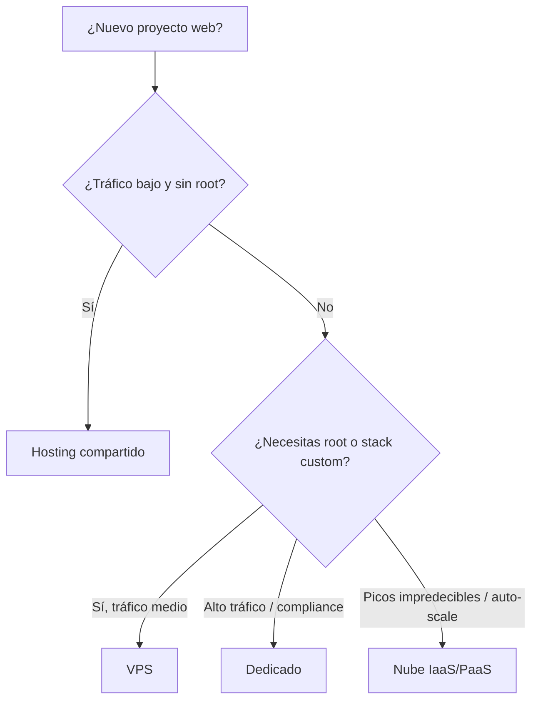
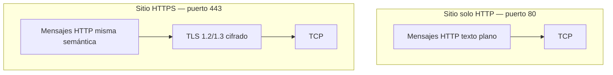
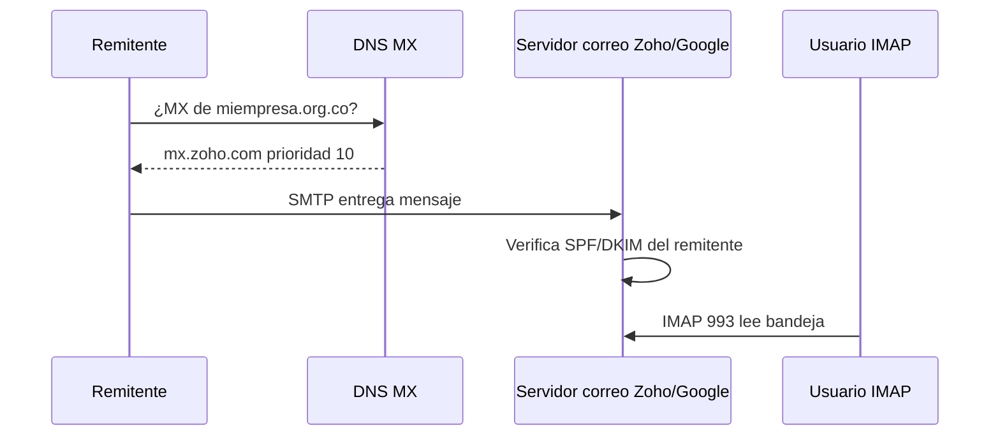
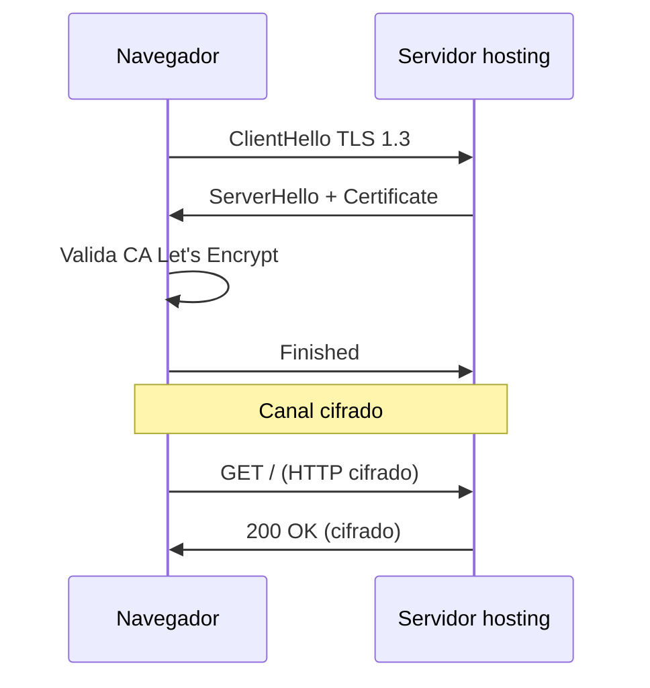

## Objetivos medibles

Al finalizar la lección el estudiante podrá:

1. Definir **hosting** y describir cómo un servidor publica un sitio web 24/7 tras resolver DNS y desplegar archivos.
2. Comparar **hosting compartido, VPS, dedicado y nube (IaaS/PaaS)** y elegir según costo, control, escala y caso de uso.
3. Explicar **HTTP** como protocolo de aplicación (puerto 80, mensajes en texto plano) y su rol en el despliegue web.
4. Describir **HTTPS** como HTTP sobre TLS (puerto 443), su relación con HTTP y por qué es obligatorio en producción.
5. Diferenciar **SSL** (obsoleto) de **TLS** (1.2/1.3), instalar/renovar certificados (Let's Encrypt, certbot) y forzar redirección HTTP→HTTPS.
6. Configurar **correo corporativo**: registros **MX**, **SPF**, **DKIM** y cliente **IMAP/SMTP** sin romper la entrega al migrar.

## Conceptos clave

### 1. Hosting

#### Qué es

**Hosting** (alojamiento web) es un servicio que provee espacio en un servidor conectado a Internet 24/7 para almacenar y servir los archivos, bases de datos y configuraciones de un sitio web. El proveedor mantiene hardware, red, energía y —según el plan— panel de control, backups y certificados.

#### Para qué sirve / Por qué importa

Sin hosting, los archivos de tu proyecto solo existen en tu laptop: nadie en Internet puede acceder a ellos de forma estable. El hosting es el paso operativo que convierte un dominio (resuelto por DNS en la clase anterior) en un sitio accesible mundialmente. Para equipos LATAM, elegir región de datacenter (Bogotá, São Paulo, Miami) impacta latencia y costo en pesos/dólares.

#### Cómo funciona

1. Contratas un plan y recibes IP o nameservers del proveedor.
2. Configuras DNS: registro **A** (o **AAAA**) del dominio apunta a la IP del hosting, o delegas **NS** al proveedor.
3. Subes archivos (FTP/SFTP, panel, Git deploy) y creas la base de datos si aplica.
4. El servidor web (Nginx, Apache, LiteSpeed) escucha en puertos 80/443 y responde peticiones HTTP/HTTPS.
5. Activas TLS y optimizas (CDN, compresión, caché) según tráfico.

#### Estructura / Composición

Un despliegue típico incluye:

| Componente | Función |
|------------|---------|
| Servidor web | Sirve HTML, estáticos, proxy a apps |
| Runtime | PHP, Node.js, Python según stack |
| Base de datos | MySQL, PostgreSQL, MongoDB |
| Panel | cPanel, Plesk, o solo SSH |
| Almacenamiento | SSD/NVMe, cuota de disco |
| Red | Ancho de banda, IP pública, firewall |

#### Tipos / Variantes

Ver sección **Tipos de hosting** (compartido, VPS, dedicado, nube) más abajo.

#### Ventajas y desventajas (visión general)

| Ventaja | Desventaja |
|---------|------------|
| Disponibilidad 24/7 sin mantener hardware propio | Costo recurrente y dependencia del proveedor |
| Paneles que simplifican SSL y correo | Planes baratos pueden compartir recursos y ralentizar picos |
| Escalado posible (VPS/nube) | Migrar mal puede romper DNS, correo o certificados |

#### Ejemplo concreto

Tienda en Medellín contrata hosting en proveedor colombiano con datacenter en Bogotá. Apunta `tienda.co` (registro A) a `190.x.x.x`, sube WordPress por SFTP, crea MySQL en cPanel y activa Let's Encrypt desde el panel. Usuarios en Antioquia cargan la página en ~40 ms vs ~180 ms si el servidor estuviera en Europa.

#### Señales de buen y mal uso

| Buen uso | Mal uso |
|----------|---------|
| Backups automáticos probados con restauración | Sin backups; confiar solo en el disco del hosting |
| SSD, SSL activo, región cercana a la audiencia | Elegir solo por precio más bajo ignorando latencia |
| Credenciales SFTP/SSH fuertes, no FTP plano | Subir archivos por FTP sin cifrar en redes públicas |
| Monitorear espacio en disco y límites de BD | Llenar disco con logs sin rotación |

---

### 2. Tipos de hosting: compartido, VPS, dedicado, nube

#### Qué es

Clasificación según **cuántos recursos compartes**, **nivel de control** del sistema operativo y **modelo de facturación/escala**.

#### Para qué sirve / Por qué importa

Elegir mal el tipo genera sobrecosto (VPS para un blog estático) o incidentes (compartido para e-commerce con picos de Black Friday). La decisión combina presupuesto, tráfico esperado, compliance y habilidades del equipo.

#### Cómo funciona (criterio de elección)



#### Tipos / Variantes — ventajas y desventajas

##### Hosting compartido

| Ventajas | Desventajas |
|----------|-------------|
| Muy económico (USD 3–15/mes en LATAM) | CPU/RAM/disco compartidos con otros sitios |
| Panel listo: correo, SSL, BD en clics | Sin acceso root; versiones de PHP/Node fijas |
| Ideal para WordPress, landing, portafolios | Un vecino con tráfico alto puede afectar rendimiento |
| Soporte en español en proveedores regionales | Límites estrictos de procesos y conexiones BD |

**Ideal para:** blogs, ONG, sitios informativos, MVPs con poco tráfico.

##### VPS (Virtual Private Server)

| Ventajas | Desventajas |
|----------|-------------|
| Recursos garantizados (vCPU, RAM) | Requiere administrar SO, parches, firewall |
| Acceso root; instalar Nginx, Node, Docker | Más caro que compartido (USD 10–50/mes) |
| Buen laboratorio para aprender administración | Tú eres responsable de seguridad y backups |
| IP dedicada; aislamiento de otros clientes | Escalado vertical manual (cambiar plan) |

**Ideal para:** APIs pequeñas, tiendas con tráfico medio, equipos que ya dominan SSH.

##### Servidor dedicado

| Ventajas | Desventajas |
|----------|-------------|
| Hardware físico exclusivo | Costo alto (cientos USD/mes) |
| Máximo rendimiento y control | Tiempo de aprovisionamiento mayor |
| Cumplimiento estricto (datos en servidor propio) | Mantenimiento de hardware si falla disco/RAID |
| Sin vecinos ruidosos | Escalar = comprar otra máquina |

**Ideal para:** alto tráfico, bases de datos pesadas, requisitos legales de residencia de datos.

##### Nube (IaaS / PaaS)

| Ventajas | Desventajas |
|----------|-------------|
| **IaaS** (AWS EC2, GCP Compute, Azure VM): VMs elásticas, snapshots | Facturación por uso puede sorprender sin alertas |
| **PaaS** (Heroku, Railway, Vercel): deploy Git, menos ops | Menos control del SO en PaaS |
| Auto-scaling, balanceadores, CDN integrados | Curva de aprendizaje y vendor lock-in |
| Regiones globales (sa-east-1 São Paulo) | Egress de datos puede encarecer transferencias |

**Ideal para:** startups con picos, SaaS, equipos que priorizan velocidad de deploy sobre costo fijo.

#### Ejemplo concreto

ONG en Bogotá con sitio informativo y 500 visitas/día → **compartido** + Cloudflare CDN gratis. Startup fintech en CDMX con API Node y picos → **VPS** o **IaaS** en región cercana con auto-scaling del balanceador.

#### Señales de buen y mal uso

| Buen uso | Mal uso |
|----------|---------|
| Compartido para sitio estático; VPS cuando necesitas cron custom | VPS para un blog que nadie administra |
| Revisar SLA y ubicación del datacenter | Dedicado para proyecto escolar sin tráfico |
| Alertas de facturación en nube | PaaS caro para sitio PHP legacy no soportado |

---

### 3. HTTP (HyperText Transfer Protocol)

#### Qué es

**HTTP** es el protocolo de **capa de aplicación** que define el formato de mensajes entre cliente (navegador, `curl`) y servidor web. Es **stateless**: cada petición es independiente. Puerto por defecto: **80**. Los mensajes viajan en **texto plano** (sin cifrado TLS).

#### Para qué sirve / Por qué importa

HTTP es el lenguaje con el que el navegador pide `index.html`, APIs JSON, imágenes y CSS. Al desplegar en hosting, el servidor debe responder correctamente en el puerto 80 (o redirigir a 443). Entender HTTP ayuda a diagnosticar errores 404, 500 y cabeceras de caché.

#### Cómo funciona

1. Cliente abre conexión **TCP** al puerto 80 del servidor.
2. Envía una **request** (método, ruta, cabeceras, cuerpo opcional).
3. Servidor procesa y devuelve **response** (código de estado, cabeceras, cuerpo).
4. Conexión puede cerrarse o reutilizarse (HTTP/1.1 keep-alive, HTTP/2 multiplexado).

#### Estructura / Composición

**Request:**
```
MÉTODO RUTA HTTP/VERSIÓN
Cabecera: valor
...
(cuerpo opcional)
```

**Response:**
```
HTTP/VERSIÓN CÓDIGO RAZÓN
Cabecera: valor
...
(cuerpo)
```

Versiones comunes: HTTP/1.1, HTTP/2 (multiplexación), HTTP/3 (sobre QUIC).

#### Tipos / Variantes

En esta lección el foco es HTTP como transporte de la aplicación web en hosting; métodos detallados (GET, POST, PUT…) se profundizan en POSW `http-metodos-status`.

#### Ventajas y desventajas

| Ventajas | Desventajas |
|----------|-------------|
| Simple de depurar (mensajes legibles) | Sin cifrado: credenciales y cookies visibles en red |
| Universal; todo hosting lo soporta | Vulnerable a interceptación en Wi-Fi pública |
| Aceptable en `localhost` para desarrollo | **No** aceptable en producción para datos sensibles |

#### Ejemplo concreto

Tras subir archivos al hosting, el estudiante prueba:

<!-- code: bash -->
```bash
curl -v http://miempresa.com.co/
# Debe devolver HTTP/1.1 200 OK (o 301 si redirige a HTTPS)
```

#### Señales de buen y mal uso

| Buen uso | Mal uso |
|----------|---------|
| HTTP solo en desarrollo local | Login o pagos por HTTP en producción |
| Redirigir todo HTTP→HTTPS en hosting real | Servir sitio mixto: página HTTPS con API HTTP |
| Revisar códigos de estado al desplegar | Asumir que "carga en el navegador" = configuración correcta |

---

### 4. HTTPS (HTTP Secure)

#### Qué es

**HTTPS** es **HTTP ejecutándose sobre una capa de cifrado TLS**. Puerto por defecto: **443**. La URL usa el esquema `https://`. El navegador muestra candado cuando el certificado es válido y confiable.

#### Para qué sirve / Por qué importa

Protege **confidencialidad** (nadie lee el tráfico en tránsito), **integridad** (detecta alteraciones) y **autenticación del servidor** (el sitio es quien dice ser, no un impostor). Google penaliza sitios sin HTTPS en SEO; navegadores marcan HTTP como "No seguro". En LATAM, pasarelas de pago y bancos exigen HTTPS para integraciones.

#### Cómo funciona

1. Cliente conecta por TCP al puerto **443**.
2. **Handshake TLS** negocia versión, cifrados y claves; servidor presenta **certificado**.
3. Navegador valida certificado contra CAs de confianza.
4. Canal cifrado establecido → mensajes **HTTP idénticos en semántica** pero cifrados en la red.
5. Servidor web (Nginx/Apache) termina TLS y pasa la request HTTP al backend.

#### Relación con HTTP

| Aspecto | HTTP | HTTPS |
|---------|------|-------|
| Semántica | GET, POST, headers, códigos | **La misma** |
| Puerto | 80 | 443 |
| Cifrado | No | Sí (TLS debajo) |
| Certificado | No requerido | Requerido (CA o Let's Encrypt) |
| URL | `http://` | `https://` |

HTTPS **no reemplaza** HTTP como protocolo de aplicación; lo **envuelve** con TLS. Una vez establecido el túnel, el servidor sigue hablando HTTP internamente.

#### Estructura / Composición en el hosting

- Certificado (`.crt` / fullchain)
- Clave privada (`.key`, nunca pública)
- Cadena intermedia (CA bundle)
- Configuración virtual host (Nginx `listen 443 ssl`)
- Regla redirect 80→443

#### Ventajas y desventajas

| Ventajas | Desventajas |
|----------|-------------|
| Protección en tránsito; confianza del usuario | Certificados deben renovarse (LE: ~90 días) |
| Let's Encrypt gratuito | Configuración incorrecta → errores de cadena |
| Requisito para HTTP/2 en muchos servidores | Overhead mínimo de handshake (mitigado con TLS 1.3) |

#### Ejemplo concreto

Migración de hosting: tras copiar archivos, el sitio carga por HTTP pero no HTTPS. En cPanel → SSL/TLS → AutoSSL, o con certbot en VPS. Luego regla Nginx:

<!-- code: nginx -->
```nginx
server {
    listen 80;
    server_name tienda.com.co www.tienda.com.co;
    return 301 https://$host$request_uri;
}
```

#### Señales de buen y mal uso

| Buen uso | Mal uso |
|----------|---------|
| HTTPS en todo el sitio; HSTS en prod madura | Certificado vencido sin cron `certbot renew` |
| Renovar antes de 30 días al vencimiento | Mixed content: imágenes `http://` en página HTTPS |
| Probar con SSL Labs o `curl -vI https://...` | Instalar cert solo en `www` y olvidar apex |

---

### 5. SSL y TLS

#### Qué es

- **SSL** (Secure Sockets Layer): protocolo de cifrado histórico (Netscape, SSL 2.0/3.0). **Obsoleto** por vulnerabilidades (POODLE, etc.).
- **TLS** (Transport Layer Security): sucesor estandarizado por IETF (TLS 1.0 → 1.3). Es lo que realmente usa **HTTPS** hoy.

En la industria se dice coloquialmente "certificado SSL", pero técnicamente se instala **TLS 1.2 o 1.3**.

#### Para qué sirve / Por qué importa

TLS cifra el canal entre cliente y servidor. Sin TLS válido, hosting y correo (SMTP/IMAP con SSL) quedan expuestos. Proveedores y estándares (PCI-DSS, OWASP) exigen TLS moderno; SSL 3.0 y TLS 1.0/1.1 están deprecados desde 2020.

#### Cómo funciona (resumen handshake TLS 1.3)

1. **ClientHello** — versiones y cipher suites soportadas.
2. **ServerHello + Certificate** — elige parámetros y envía certificado.
3. **Finished** — ambas partes confirman; canal simétrico activo.
4. Tráfico HTTP cifrado sobre ese canal.

#### Diferencias SSL vs TLS

| Criterio | SSL (2.0/3.0) | TLS (1.2/1.3) |
|----------|---------------|---------------|
| Estado 2025 | **Prohibido** | **Aceptable** (1.2/1.3) |
| Handshake | Más lento, cifrados débiles | 1.3: 1-RTT, PFS obligatorio |
| Estándar | Propietario / obsoleto | IETF RFC 8446 (1.3) |
| En paneles hosting | Opción "SSL" suele mean TLS | Configurar mínimo TLS 1.2 |

#### Estructura / Composición del certificado

- **Sujeto (CN/SAN):** dominios cubiertos (`ejemplo.com`, `www.ejemplo.com`)
- **Emisor:** CA (Let's Encrypt, DigiCert, etc.)
- **Validez:** fechas notBefore / notAfter
- **Clave pública** del servidor + firma de la CA
- **Clave privada** guardada solo en el servidor

#### Validación al emitir (Let's Encrypt)

| Método | Cómo funciona |
|--------|---------------|
| **HTTP-01** | Archivo en `/.well-known/acme-challenge/` |
| **DNS-01** | Registro TXT `_acme-challenge.dominio` |
| **Email** | Menos común en automatización |

#### Ventajas y desventajas

| TLS 1.2/1.3 + Let's Encrypt | SSL obsoleto / cert autofirmado en prod |
|-----------------------------|----------------------------------------|
| Gratis, renovación con certbot | SSL 3.0: vulnerabilidades conocidas |
| Confianza del navegador | Autofirmado: advertencia roja al usuario |
| Cumple estándares actuales | TLS 1.0: rechazado por navegadores modernos |

#### Ejemplo concreto

<!-- code: bash -->
```bash
# Instalar y obtener certificado (VPS con Nginx, Ubuntu)
sudo apt install certbot python3-certbot-nginx
sudo certbot --nginx -d ong.org.co -d www.ong.org.co

# Verificar renovación automática
sudo certbot renew --dry-run

# Comprobar versión TLS negociada
openssl s_client -connect ong.org.co:443 -tls1_2 </dev/null 2>/dev/null | grep Protocol
```

#### Señales de buen y mal uso

| Buen uso | Mal uso |
|----------|---------|
| TLS 1.2+ únicamente; deshabilitar SSLv3 | Panel con "SSL 3.0" habilitado "por compatibilidad" |
| Cron semanal `certbot renew` | Cert vencido en Black Friday sin monitor |
| Cadena completa (fullchain.pem) | Instalar solo `.crt` sin intermediarios → error en móviles |

---

### 6. Correo corporativo: MX, SPF, DKIM, IMAP/SMTP

#### Qué es

**Correo corporativo** usa direcciones `@tudominio.com` (no `@gmail.com`) gestionadas por un proveedor (Google Workspace, Microsoft 365, Zoho, cPanel del hosting). La entrega y autenticidad dependen de registros **DNS** y protocolos de acceso **IMAP** (entrada) y **SMTP** (salida).

#### Para qué sirve / Por qué importa

Transmite profesionalismo (`ventas@empresa.co`), centraliza buzones al crecer el equipo y permite políticas de seguridad (2FA, retención, DLP). Sin MX/SPF/DKIM correctos, el correo llega a spam o se pierde al migrar proveedores — error frecuente en PYMEs LATAM.

#### Cómo funciona

**Flujo de correo entrante:**
1. Remitente envía a `contacto@miempresa.com`.
2. DNS consulta registros **MX** del dominio → servidor de correo del proveedor.
3. Servidor receptor valida **SPF** (¿envía desde IP autorizada?) y **DKIM** (firma criptográfica del mensaje).
4. Mensaje se deposita en buzón; usuario lo lee vía webmail o **IMAP**.

**Flujo de correo saliente:**
1. Cliente (Outlook, Thunderbird) usa **SMTP** autenticado al proveedor.
2. Proveedor firma con **DKIM** y envía respetando **SPF**.

#### Estructura / Composición de registros DNS

##### MX (Mail Exchange)

Indica **qué servidor recibe** correo para el dominio. Prioridad numérica menor = preferido.

<!-- code: dns -->
```dns
; Zoho Mail — ejemplo ONG .org.co
miempresa.org.co.  3600  IN  MX  10  mx.zoho.com.
miempresa.org.co.  3600  IN  MX  20  mx2.zoho.com.
```

##### SPF (Sender Policy Framework)

Registro **TXT** que lista servidores autorizados para enviar correo **por tu dominio**.

<!-- code: dns -->
```dns
miempresa.org.co.  3600  IN  TXT  "v=spf1 include:zoho.com ~all"
```

- `include:` delega en otro dominio (Google, Zoho).
- `~all` softfail para no autorizados; `-all` hardfail (más estricto).

##### DKIM (DomainKeys Identified Mail)

Registro **TXT** con clave pública; el proveedor firma cada mensaje saliente con la clave privada. Receptores verifican integridad y origen.

<!-- code: dns -->
```dns
; Nombre típico: selector._domainkey.dominio
zmail._domainkey.miempresa.org.co.  3600  IN  TXT  "v=DKIM1; k=rsa; p=MIGfMA0GCSq..."
```

##### IMAP y SMTP (acceso del usuario)

| Protocolo | Rol | Puertos típicos |
|-----------|-----|-----------------|
| **IMAP** | Sincroniza bandeja, carpetas, leído/no leído | 993 (SSL/TLS) |
| **SMTP** | Envía correo saliente | 587 (STARTTLS) o 465 (SSL) |

<!-- code: text -->
```text
IMAP entrante: imap.gmail.com:993 (SSL) — usuario: contacto@miempresa.com
SMTP saliente: smtp.gmail.com:587 (STARTTLS) — autenticación obligatoria
Contraseña: de aplicación si hay 2FA (no la personal)
```

#### Tipos / Variantes de proveedor

| Proveedor | Perfil | Nota LATAM |
|-----------|--------|------------|
| Google Workspace | Integración Gmail, Drive | Facturación USD; dominio .com.co común |
| Microsoft 365 | Outlook, Teams | Común en empresas con licencias M365 |
| Zoho Mail | Económico para ONG/startup | Plan gratuito limitado; popular en ONG |
| cPanel del hosting | Incluido en compartido | Menos features; SPF/DKIM manual |

#### Ventajas y desventajas

| Correo en proveedor dedicado (Google/Zoho) | Correo solo en hosting compartido |
|--------------------------------------------|-----------------------------------|
| Mejor entregabilidad y antispam | Límites de envío bajos |
| DKIM/SPF guiados en panel | Más propenso a listas negras compartidas |
| Escalable al crecer equipo | Migrar sitio puede olvidar MX |

#### Ejemplo concreto

ONG en Cali migra de correo del hosting a Zoho Mail:

1. Crear cuenta Zoho y verificar dominio (TXT).
2. **Antes de cambiar MX:** exportar buzones antiguos.
3. Actualizar MX a Zoho; esperar propagación (TTL, hasta 48 h).
4. Añadir SPF y DKIM desde panel Zoho.
5. Configurar IMAP/SMTP en celulares del equipo.

#### Señales de buen y mal uso

| Buen uso | Mal uso |
|----------|---------|
| Un solo conjunto de MX activo | MX duplicados de hosting viejo + Zoho → correo perdido |
| SPF + DKIM + DMARC (avanzado) alineados | SPF con demasiados `include` (>10 lookups) |
| Contraseñas de aplicación con 2FA | Usar contraseña personal en SMTP |
| Probar envío a Gmail y revisar cabeceras `Authentication-Results` | Cambiar MX sin avisar al equipo durante horario laboral |

---

### 7. Optimización en hosting (complemento operativo)

- **CDN** (Cloudflare): cachea estáticos en nodos cercanos (Miami para Centroamérica).
- **Compresión** Gzip/Brotli en Nginx/Apache.
- **HTTP/2 y HTTP/3**: multiplexación y menor latencia.
- **Caché** servidor y cabeceras `Cache-Control`.
- **Región**: datacenter Bogotá/Miami para audiencia Colombia vs Europa.

## Errores comunes

- **MX duplicados al migrar correo:** dejar registros del hosting anterior junto con Google/Zoho; parte del correo nunca llega.
- **Certificado vencido sin cron de renovación:** sitio "No seguro" tras 90 días con Let's Encrypt.
- **Hosting compartido sin backups:** ransomware o error humano borra sitio sin recuperación.
- **FTP plano en café Wi-Fi:** credenciales de hosting interceptadas; usar SFTP/SSH.
- **SPF sin incluir el proveedor nuevo:** correo saliente marcado como spam tras migración.
- **HTTPS solo en homepage:** subrutas o assets en HTTP (mixed content).
- **Confundir registro A del sitio con MX del correo:** el sitio puede estar en una IP y el correo en otro proveedor — es correcto, pero hay que configurar cada uno.
- **No probar `certbot renew --dry-run`:** cron roto descubierto el día del vencimiento.

## Casos reales

### 1. Tienda Medellín: hosting local + Cloudflare CDN

E-commerce de ropa usa hosting en proveedor colombiano (datacenter Bogotá) con plan compartido optimizado. Tráfico crece en campaña de Instagram; imágenes pesadas saturan ancho de banda.

**Decisión:** activar **Cloudflare** (plan free) como CDN/proxy: assets estáticos desde edge en Miami y Bogotá, compresión Brotli, SSL full strict. Mantienen hosting compartido para PHP/WooCommerce; latencia percibida baja 60% sin migrar a VPS aún.

**Conceptos aplicados:** hosting compartido, HTTP/2 vía Cloudflare, HTTPS terminado en edge, región LATAM.

### 2. ONG Bogotá: Zoho Mail y dominio `.org.co`

ONG `fundacionejemplo.org.co` usa correo `@gmail.com` para donaciones; donantes desconfían. Contratan dominio `.org.co` y Zoho Mail gratuito.

**Incidente:** configuraron MX de Zoho pero dejaron MX del hosting anterior con prioridad 10. Mitad del correo a `info@` nunca llega durante dos semanas.

**Resolución:** eliminar MX viejos, un solo par MX Zoho, SPF `include:zoho.com`, DKIM del panel. Verificar con `dig MX fundacionejemplo.org.co` y envío de prueba.

**Conceptos aplicados:** MX, SPF, DKIM, propagación DNS.

### 3. Migración hosting: «No seguro» tras cambiar servidor

Consultora en Lima migra WordPress a nuevo VPS. Sitio carga por IP y dominio en HTTP. Clientes reportan "No seguro" y formulario de contacto no envía (mixed content + cert autofirmado).

**Diagnóstico:** certificado no instalado en nuevo Nginx; imágenes hardcodeadas `http://`; sin redirect 80→443.

**Resolución:** `certbot --nginx`, actualizar URLs en BD a HTTPS, regla redirect, probar con navegador incógnito.

**Conceptos aplicados:** HTTPS, TLS, HTTP vs HTTPS, despliegue hosting.

## Ejemplos de código sugeridos

### Petición HTTP en texto plano (puerto 80)

<!-- code: http -->
```http
GET /index.html HTTP/1.1
Host: tienda.com.co
User-Agent: curl/8.5.0
Accept: text/html
Connection: close
```

### Misma semántica sobre HTTPS (cifrada en red)

<!-- code: http -->
```http
GET /api/productos HTTP/1.1
Host: tienda.com.co
Accept: application/json
# Viaja cifrado por TLS 1.3 tras el handshake
```

### Subida segura al hosting (SFTP)

<!-- code: bash -->
```bash
sftp usuario@190.48.xxx.xxx
# put -r ./dist/* /var/www/tienda.com.co/public_html/
```

### Registros DNS correo completo (ejemplo Zoho)

<!-- code: dns -->
```dns
; Verificación dominio
miempresa.org.co.     IN TXT "zoho-verification=zb12345678.zmverify.zoho.com"

; Correo entrante
miempresa.org.co.     IN MX 10 mx.zoho.com.
miempresa.org.co.     IN MX 20 mx2.zoho.com.

; Autenticación envío
miempresa.org.co.     IN TXT "v=spf1 include:zoho.com ~all"
zmail._domainkey.miempresa.org.co. IN TXT "v=DKIM1; k=rsa; p=MIIBIjAN..."
```

### Nginx: SSL + redirect HTTP→HTTPS

<!-- code: nginx -->
```nginx
server {
    listen 443 ssl http2;
    server_name tienda.com.co;
    ssl_certificate     /etc/letsencrypt/live/tienda.com.co/fullchain.pem;
    ssl_certificate_key /etc/letsencrypt/live/tienda.com.co/privkey.pem;
    ssl_protocols       TLSv1.2 TLSv1.3;
    root /var/www/tienda.com.co;
}

server {
    listen 80;
    server_name tienda.com.co;
    return 301 https://$host$request_uri;
}
```

### Apache (.htaccess) redirect

<!-- code: apache -->
```apache
RewriteEngine On
RewriteCond %{HTTPS} off
RewriteRule ^ https://%{HTTP_HOST}%{REQUEST_URI} [L,R=301]
```

### Diagnóstico DNS correo

<!-- code: bash -->
```bash
dig MX miempresa.org.co +short
dig TXT miempresa.org.co +short | grep spf
dig TXT zmail._domainkey.miempresa.org.co +short
```

## Ejercicios de práctica

- **tipo:** ordenar-pasos — Ordena configuración correo corporativo con Google Workspace: (a) crear buzones (b) TXT verificación (c) contratar plan (d) registros MX (e) SPF y DKIM.
- **tipo:** reflexion — ¿Por qué una tienda pequeña en Medellín podría empezar en hosting compartido y cuándo migraría a VPS? Menciona costo, tráfico y control.
- **tipo:** reflexion — Tras migrar hosting, el sitio muestra «No seguro». Lista al menos tres causas posibles relacionadas con TLS/HTTPS.
- **tipo:** diagrama — Dibuja la pila: HTTP sobre TLS sobre TCP puerto 443 vs HTTP sobre TCP puerto 80.
- **tipo:** completar-codigo — Completa: "El registro DNS que indica el servidor de correo entrante es ___; el que autoriza servidores de envío es ___ (tipo TXT)." → MX, SPF.
- **tipo:** reflexion — ¿Qué pasaría si dejas registros MX del hosting viejo y del proveedor nuevo al mismo tiempo?
- **tipo:** codigo — Escribe el comando `certbot` para obtener certificado Let's Encrypt para `ejemplo.com` y `www.ejemplo.com` con plugin Nginx.
- **tipo:** reflexion — ¿Por qué decimos "certificado SSL" pero debemos configurar TLS 1.2+?

## Animación o visual sugerida

- **CompareTable — tipos de hosting:** compartido, VPS, dedicado, nube (costo, control, escala, ideal para).
- **StepReveal — despliegue en hosting:** contratar → DNS → subir archivos → BD → HTTPS.
- **StepReveal — correo corporativo:** proveedor → TXT verificación → MX → SPF/DKIM → buzones → IMAP/SMTP.
- **StepReveal — certificado Let's Encrypt:** validación HTTP-01/DNS-01 → instalar → redirect → renovación cron.
- **MermaidDiagram — pila HTTP vs HTTPS** y flujo elección tipo de hosting.

## Diagrama Mermaid (si aplica)

### Pila HTTP vs HTTPS



### Flujo correo entrante (MX → buzón)



### Handshake TLS simplificado (post-instalación cert)



## Secciones TSX sugeridas

- `ObjetivosSection` — 6 objetivos medibles + prerrequisito DNS
- `HostingSection` — qué es, tipos CompareTable, despliegue StepReveal, optimización CDN
- `HttpHttpsSection` — HTTP definición, relación HTTPS, pila Mermaid (mejora contenido actual)
- `SslTlsSection` — SSL vs TLS, versiones, por qué importan
- `ProtocolosHttpsSection` — instalación certbot, validación, redirect, renovación
- `CorreoCorporativoSection` — MX/SPF/DKIM, IMAP/SMTP, StepReveal configuración
- `CompruebaTuComprensionSection` — PracticeExercise ×2+
- `RetoIntegradorSection` — escenario tienda + correo + HTTPS
- `CierreSection` + `MiniquizSection` — Quiz 5 preguntas

## Reto integrador

**"Lanza la presencia digital de `artesaniasdelcaribe.co`"**

Contexto: cooperativa en Cartagena vende artesanías. Tienen dominio `.co`, presupuesto limitado y 3 personas que necesitan correo `@artesaniasdelcaribe.co`.

**Entregables que debes proponer:**

1. **Tipo de hosting** justificado (tráfico bajo, catálogo WordPress, presupuesto PYME).
2. **Pasos de despliegue:** DNS (A/NS), subida archivos, BD, HTTPS.
3. **Proveedor de correo** (Zoho/Google/hosting) con registros **MX**, **SPF** y **DKIM** de ejemplo.
4. **Configuración IMAP/SMTP** para la gerente en Outlook móvil.
5. **Plan TLS:** Let's Encrypt, redirect HTTP→HTTPS, cron renovación.
6. **Un riesgo** si mezclan MX viejos al migrar y **cómo evitarlo**.

**Criterio de éxito:** hosting coherente con escala, HTTPS completo, correo con autenticación DNS correcta, sin MX duplicados, al menos un comando `certbot` o paso de panel SSL.

## Preguntas sugeridas para quiz (5)

1. **¿Qué registro DNS dirige el correo entrante a un servidor?**
   - A) A
   - B) CNAME
   - C) MX
   - D) NS
   - **Correcta:** C
   - **Feedback:** MX (Mail Exchange) indica qué servidor recibe correo para el dominio; prioridad menor = preferido.

2. **¿Qué tipo de hosting comparte CPU, RAM y disco con otros sitios en el mismo servidor?**
   - A) Dedicado
   - B) VPS
   - C) Compartido
   - D) Bare metal exclusivo
   - **Correcta:** C
   - **Feedback:** En hosting compartido varios sitios coexisten en una misma máquina; es económico pero con recursos compartidos.

3. **¿Cuál es la relación correcta entre HTTP y HTTPS?**
   - A) HTTPS es un protocolo distinto que reemplaza los métodos GET y POST
   - B) HTTPS es HTTP con la misma semántica, cifrado por TLS en el puerto 443
   - C) HTTP es más seguro porque no usa certificados
   - D) Solo HTTPS puede servir archivos HTML
   - **Correcta:** B
   - **Feedback:** HTTPS envuelve HTTP con TLS; métodos y cabeceras son los mismos, el canal de red va cifrado.

4. **¿Qué registro TXT ayuda a que receptores confíen en que tu servidor está autorizado para enviar correo por tu dominio?**
   - A) AAAA
   - B) SPF (`v=spf1 ...`)
   - C) CNAME
   - D) PTR
   - **Correcta:** B
   - **Feedback:** SPF lista servidores autorizados para enviar; sin él, Gmail/Outlook pueden marcar como spam o spoofing.

5. **¿Qué debes renovar periódicamente al usar Let's Encrypt en producción?**
   - A) El dominio en el registrador cada mes
   - B) El certificado TLS (cada ~90 días; automatizar con `certbot renew`)
   - C) La IP pública del router doméstico
   - D) La contraseña del navegador
   - **Correcta:** B
   - **Feedback:** Let's Encrypt emite certificados de 90 días; un cron de renovación evita el candado roto y caída de confianza.

**Pregunta bonus (reflexión «¿por qué…?»):** ¿Por qué no debes dejar registros MX del proveedor anterior al migrar a Google Workspace? — Porque el correo entrante se reparte impredeciblemente y parte se pierde o va al buzón viejo.

## Referencias

- Fuente docente: `kb/education/sources/clases/configuracion-servicios-web/clase-02-hosting-correo-https.md`
- Prerrequisito: `clase-01-fundamentos-web` (DNS, dominios, IP)
- Siguiente: `clase-03-administracion-remota` (SSH, SFTP, paneles nube)
- Relacionadas POSW: `protocolos-seguridad`, `modelo-cliente-servidor`
- TSX actual: `src/components/teaching/lessons/configuracion-servicios-web/clase-02-hosting-correo-https/`
- Let's Encrypt: https://letsencrypt.org/docs/
- MDN — HTTPS: https://developer.mozilla.org/es/docs/Glossary/HTTPS
- Google — SPF/DKIM: https://support.google.com/a/answer/33786
- RFC 8446 — TLS 1.3: https://www.rfc-editor.org/rfc/rfc8446
