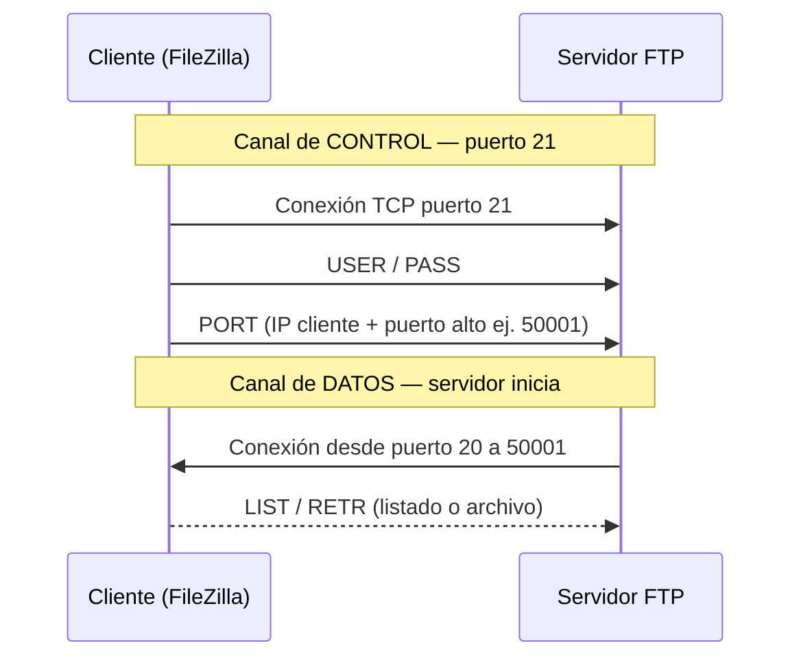
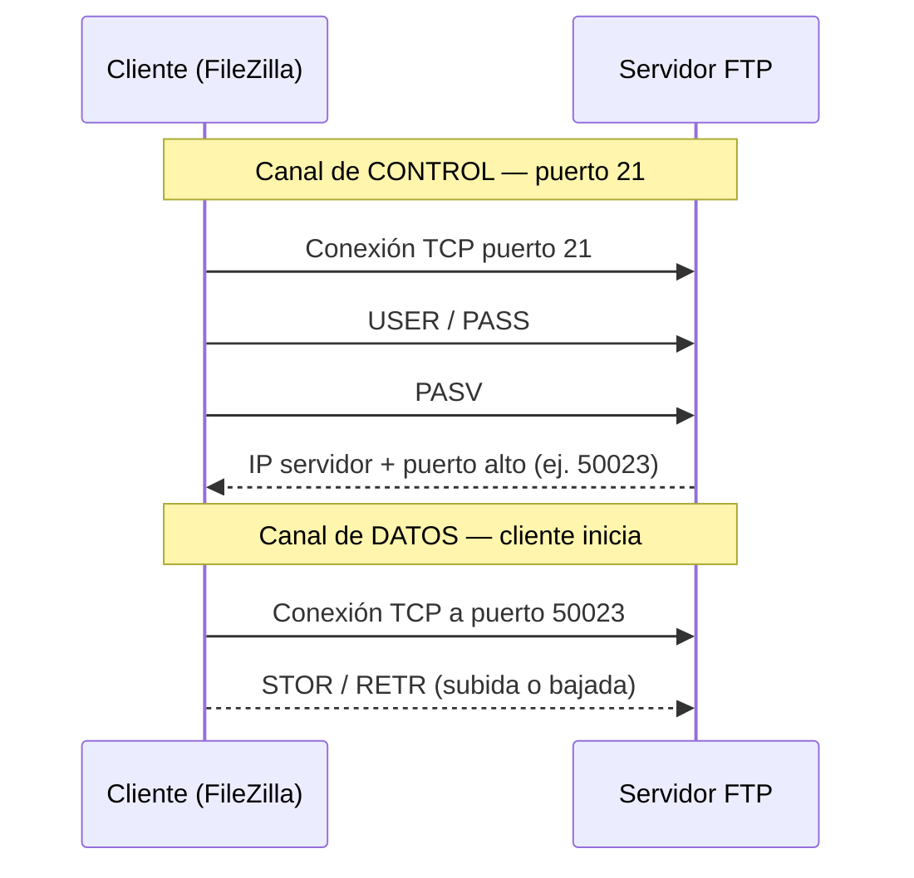
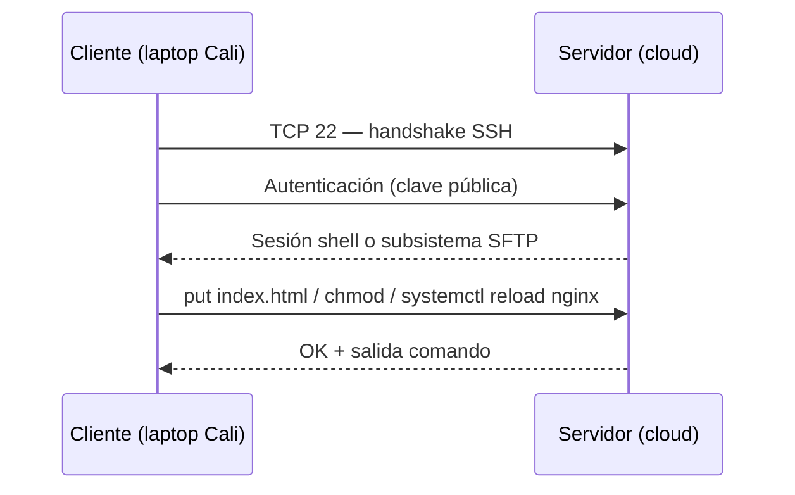
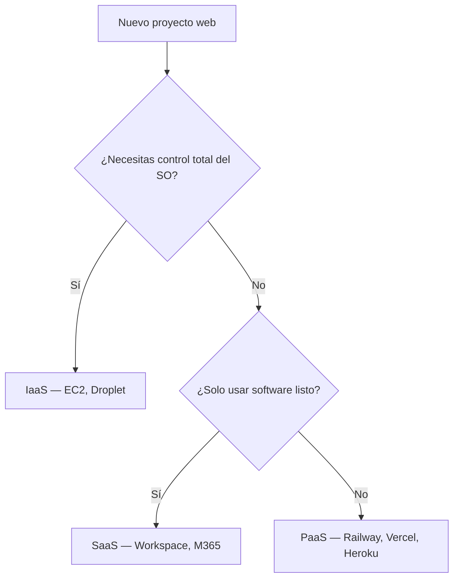

## Objetivos medibles

Al finalizar la lección el estudiante podrá:

1. Explicar los **principios de computación en la nube** (NIST) y distinguir **IaaS, PaaS y SaaS** con ejemplos reales y criterio de elección.
2. Describir el **modelo cliente-servidor** aplicado a administración remota: quién inicia la conexión, qué protocolo usa y qué servicio escucha.
3. Comparar **FTP, SFTP y SSH**: puertos, cifrado, casos de uso y por qué FTP plano no debe usarse en producción.
4. Configurar acceso remoto con **SSH** (claves, `authorized_keys`, hardening básico) y transferir archivos con **SFTP/FileZilla**.
5. Elegir la herramienta adecuada de **administración remota** (PuTTY, FileZilla, cPanel, RDP, VNC) según el escenario y aplicar buenas prácticas de seguridad.

## Conceptos clave

### 1. Computación en la nube

#### Qué es

La **computación en la nube** es la entrega bajo demanda de recursos de TI (servidores, almacenamiento, bases de datos, redes, software) a través de Internet, con pago por uso y provisión casi instantánea, sin que el usuario administre físicamente el hardware.

#### Para qué sirve / Por qué importa

Permite a startups, agencias y equipos de desarrollo en LATAM lanzar servicios sin comprar servidores en datacenter local. Un dev en Cali puede desplegar una API en DigitalOcean (Virginia o São Paulo) en minutos, pagando solo las horas de uso.

#### Cómo funciona

El proveedor cloud opera datacenters regionales. El cliente crea recursos vía panel web o API (CLI, Terraform). La red pública o privada (VPC) conecta instancias, balanceadores y almacenamiento. La facturación se basa en consumo medido (horas de VM, GB almacenados, requests).

#### Estructura / Composición — Principios NIST (esenciales)

| Principio | Significado en la práctica |
|-----------|---------------------------|
| **Autoservicio bajo demanda** | Crear una VM o bucket S3 sin ticket al proveedor |
| **Acceso amplio por red** | Administrar desde laptop, oficina o café vía Internet |
| **Agrupación de recursos (pooling)** | Tu VM comparte físico con otros clientes; tú ves recursos lógicos |
| **Elasticidad rápida** | Escalar de 1 a 10 instancias en pico de ventas |
| **Servicio medido** | Dashboard de costos por hora/GB/request |

#### Ventajas y desventajas

| Ventajas | Desventajas |
|----------|-------------|
| CapEx → OpEx: sin inversión inicial en hardware | Costos pueden crecer sin control de presupuesto |
| Escala global (regiones Miami, São Paulo, Bogotá vía partners) | Dependencia del proveedor (vendor lock-in parcial) |
| Alta disponibilidad y backups gestionados | Latencia si el datacenter está lejos del usuario final |
| Actualizaciones de infra sin downtime físico | Curva de aprendizaje (IAM, redes, seguridad cloud) |

#### Ejemplo concreto

Una fintech en Medellín migra su API de un servidor en oficina a AWS EC2 en `us-east-1`. Durante el día escala de `t3.small` a `t3.medium`; los fines de semana reduce instancias y ahorra ~40% en compute.

#### Señales de buen y mal uso

- **Buen uso:** elegir región cercana a usuarios LATAM, etiquetar recursos, alertas de presupuesto, backups automatizados.
- **Mal uso:** dejar instancias 24/7 sin uso, credenciales root en repositorio Git, puertos de administración abiertos a `0.0.0.0/0`.

---

### 2. IaaS, PaaS y SaaS

#### Qué es

Modelos de servicio cloud que definen **qué capas gestiona el proveedor** y **qué gestiona el cliente**:

- **IaaS (Infrastructure as a Service):** infraestructura virtualizada (VMs, redes, discos).
- **PaaS (Platform as a Service):** plataforma para desplegar aplicaciones sin administrar SO ni runtime.
- **SaaS (Software as a Service):** aplicación lista para usar vía navegador o cliente ligero.

#### Para qué sirve / Por qué importa

Elegir mal el modelo genera sobrecarga operativa o falta de control. Un equipo que necesita solo hospedar un sitio estático no debería administrar un IaaS completo si un PaaS (Vercel, Netlify) resuelve el caso.

#### Tipos / Variantes — Tabla comparativa

| Criterio | IaaS | PaaS | SaaS |
|----------|------|------|------|
| **Ejemplos** | AWS EC2, DigitalOcean Droplet, Azure VM, Google Compute Engine | Heroku, Google App Engine, Railway, Vercel (apps), Render | Google Workspace, Microsoft 365, Salesforce, Notion |
| **Tú gestionas** | SO, runtime, app, datos (parcial) | App y datos; runtime parcial | Solo configuración y datos de usuario |
| **Proveedor gestiona** | Hypervisor, red física, hardware | SO, parches, escalado de plataforma | Todo el stack de aplicación |
| **Control** | Máximo | Medio | Mínimo |
| **Velocidad de despliegue** | Lenta (configurar VM, firewall, SSH) | Rápida (`git push`) | Inmediata (registro y uso) |

#### Cuándo elegir cada uno

- **IaaS:** necesitas control total (firewall custom, múltiples servicios en una VM, compliance estricto, VPN site-to-site).
- **PaaS:** equipo pequeño que despliega API o frontend sin querer parchear Linux ni configurar Nginx manualmente.
- **SaaS:** correo corporativo, CRM, herramientas de productividad; no quieres operar software.

#### Ejemplo concreto (LATAM)

| Escenario | Modelo recomendado | Por qué |
|-----------|-------------------|---------|
| Agencia en Bogotá con WordPress en hosting compartido + cPanel | SaaS/hosting gestionado | Panel y stack ya administrados |
| Startup Node.js que hace deploy desde GitHub | PaaS (Railway, Render) | Sin administrar servidor |
| Banco con política de hardening propio en RHEL | IaaS (VM dedicada en cloud) | Control de SO y auditoría |

#### Señales de buen y mal uso

- **Buen uso:** PaaS para MVP; IaaS cuando el contrato exige control de SO; SaaS para correo y colaboración.
- **Mal uso:** IaaS para un blog estático de 3 páginas; PaaS para cargas que requieren kernel custom; SaaS para datos ultra-sensibles sin evaluar residencia y cifrado.

---

### 3. Modelo cliente-servidor (en administración remota)

#### Qué es

Paradigma donde un **cliente** inicia solicitudes y un **servidor** escucha en un puerto y responde. En administración remota, tu laptop es casi siempre el cliente; el VPS o hosting es el servidor.

#### Para qué sirve / Por qué importa

Toda sesión SSH, transferencia SFTP o login en cPanel sigue este modelo. Entenderlo evita confusiones: «¿por qué debo abrir el puerto 22 en el firewall del servidor y no en mi PC?» — porque el servidor escucha; el cliente conecta hacia afuera.

#### Cómo funciona

1. El **servidor** ejecuta un daemon (`sshd`, `vsftpd`, panel web en Apache/Nginx).
2. El daemon **escucha** en un puerto (22 SSH, 21 FTP, 443 HTTPS para cPanel).
3. El **cliente** (PuTTY, FileZilla, navegador) resuelve DNS/IP y abre conexión TCP.
4. Tras autenticación (clave, contraseña, MFA), el cliente envía comandos o peticiones; el servidor ejecuta y devuelve resultado.

#### Estructura / Composición

```
[Cliente: PuTTY / FileZilla / Navegador]
        │  TCP + protocolo (SSH / SFTP / HTTPS)
        ▼
[Servidor: VPS / hosting]
        ├── sshd (puerto 22)
        ├── vsftpd (puerto 21) — evitar en producción sin cifrar
        └── Apache/Nginx + cPanel (puerto 443)
```

#### Ejemplo concreto

Dev en Cali con IP dinámica de ISP → cliente SSH. VPS en DigitalOcean (IP fija `157.245.x.x`) → servidor. Comando: `ssh -i ~/.ssh/id_ed25519 deploy@157.245.x.x`. El cliente inicia; `sshd` acepta si la clave pública está en `~/.ssh/authorized_keys`.

#### Señales de buen y mal uso

- **Buen uso:** identificar siempre cliente vs servidor al diagnosticar «connection refused» (servicio no escucha o firewall bloquea).
- **Mal uso:** abrir puertos en el router de casa pensando que eso «habilita SSH al servidor» (es al revés: el servidor debe permitir entrada en 22).

---

### 4. FTP (File Transfer Protocol)

#### Qué es

Protocolo de aplicación (capa 7) para **transferir archivos** entre hosts, definido originalmente en los años 70. Usa **puerto 21** para control (comandos) y **puerto 20** (modo activo) o puertos dinámicos altos (modo pasivo) para datos.

#### Para qué sirve / Por qué importa

Históricamente fue el estándar para subir sitios a hosting compartido. Hoy se encuentra en legado y paneles antiguos, pero **no debe usarse en producción** sin cifrado: usuario y contraseña viajan en texto plano.

#### Cómo funciona — Modo activo vs pasivo

**Modo activo (Active):**
1. Cliente conecta al puerto **21** del servidor (canal de control).
2. Cliente informa su IP y un puerto local alto (ej. 50001) con comando `PORT`.
3. El **servidor** inicia conexión de datos desde puerto **20** hacia el puerto del cliente.
4. Problema: firewalls/NAT del cliente bloquean la conexión entrante del servidor → fallos frecuentes en redes domésticas LATAM.

**Modo pasivo (Passive):**
1. Cliente conecta al puerto **21** (control).
2. Servidor responde con `PASV` e indica IP + puerto alto propio (ej. 50000–51000).
3. El **cliente** inicia la segunda conexión hacia ese puerto del servidor.
4. Funciona mejor detrás de NAT porque ambas conexiones las inicia el cliente.

#### Estructura / Composición

| Canal | Puerto típico | Contenido |
|-------|---------------|-----------|
| Control | 21 | USER, PASS, LIST, RETR, STOR |
| Datos (activo) | 20 → puerto cliente | Archivo o listado |
| Datos (pasivo) | 50000+ en servidor | Archivo o listado |

#### Ventajas y desventajas

| Ventajas | Desventajas |
|----------|-------------|
| Ampliamente soportado en hosting antiguo | **Sin cifrado** en FTP plano |
| FileZilla y clientes gráficos maduros | Credenciales interceptables (sniffing en Wi‑Fi público) |
| Modo pasivo atraviesa NAT del cliente | Modo activo falla con firewalls estrictos |

#### Ejemplo concreto

Técnico en una cyber de Barranquilla usa FileZilla en modo **pasivo** contra `ftp.empresa.com.co:21`. Aunque la transferencia funcione, un atacante en la misma red podría capturar la contraseña → migrar a **SFTP puerto 22**.

#### Señales de buen y mal uso

- **Buen uso:** solo en laboratorio o red aislada; preferir SFTP/FTPS en cualquier entorno real.
- **Mal uso:** FTP plano sobre Internet para desplegar producción; dejar puerto 21 abierto a todo el mundo sin necesidad.

---

### 5. SFTP (SSH File Transfer Protocol)

#### Qué es

Protocolo para **transferir y gestionar archivos** sobre un canal **cifrado SSH**. No confundir con FTPS (FTP + TLS). SFTP es subsistema de SSH en el **puerto 22** (por defecto).

#### Para qué sirve / Por qué importa

Es el método recomendado para subir código, `.env` de plantilla, backups y assets a un VPS o hosting que expone SSH. Cifra autenticación y contenido de archivos.

#### Cómo funciona

1. Cliente establece sesión **SSH** (handshake, intercambio de claves, autenticación).
2. Cliente solicita subsistema `sftp`.
3. Comandos (`put`, `get`, `ls`, `chmod`) viajan cifrados dentro del túnel SSH.
4. Un solo puerto (22) simplifica firewall frente a FTP (21 + rango pasivo).

#### Estructura / Composición

| Capa | Protocolo |
|------|-----------|
| Aplicación | SFTP (comandos de archivo) |
| Seguridad | SSH (cifrado simétrico + autenticación) |
| Transporte | TCP puerto 22 |

#### Ventajas y desventajas

| Ventajas | Desventajas |
|----------|-------------|
| Cifrado extremo a extremo | Requiere SSH habilitado en servidor |
| Misma clave SSH para terminal y archivos | Sin resume parcial estándar como algunos clientes FTP avanzados |
| Auditoría centralizada en logs de `sshd` | Hosting compartido a veces solo ofrece FTP legado |

#### Ejemplo concreto

En FileZilla: Protocolo **SFTP**, host `vps.agencia.co`, puerto **22**, autenticación por **archivo de clave** (`id_ed25519`). Subir `dist/` de React al `/var/www/html`.

#### Señales de buen y mal uso

- **Buen uso:** claves SSH en lugar de contraseña; permisos `chmod 600` en clave privada.
- **Mal uso:** elegir «FTP» en FileZilla por inercia; compartir la misma contraseña de cPanel y SFTP.

---

### 6. SSH (Secure Shell)

#### Qué es

Protocolo de red para **acceso remoto seguro** a línea de comandos y túneles. Sustituye a Telnet (puerto 23, sin cifrar). Implementación libre más usada: **OpenSSH** (cliente y servidor).

#### Para qué sirve / Por qué importa

Administración de VPS, despliegues, revisión de logs, reinicio de servicios y copias con `scp`/`rsync` sobre SSH. Es la herramienta diaria del desarrollador backend en LATAM que opera servidores en Miami o São Paulo.

#### Cómo funciona

1. **TCP** al puerto 22 (o custom).
2. **Handshake SSH:** intercambio de versiones y algoritmos.
3. **Verificación de host:** el servidor presenta huella (fingerprint); el cliente la compara con `known_hosts`.
4. **Autenticación:** clave pública (recomendado) o contraseña.
5. **Canal de sesión:** shell interactivo o comando remoto (`ssh user@host 'systemctl status nginx'`).

#### Estructura / Composición

| Componente | Ubicación | Rol |
|------------|-----------|-----|
| Clave privada | Cliente (`~/.ssh/id_ed25519`) | Nunca compartir |
| Clave pública | Servidor (`~/.ssh/authorized_keys`) | Identifica al cliente autorizado |
| `sshd` | Servidor | Daemon que escucha |
| `ssh` / PuTTY | Cliente | Inicia conexión |

#### Tipos / Variantes de cliente

- **OpenSSH** (Linux, macOS, Windows 10+ nativo)
- **PuTTY** (Windows clásico, `.ppk` convertible a OpenSSH)
- **WSL** (Ubuntu dentro de Windows, usa OpenSSH)

#### Ventajas y desventajas

| Ventajas | Desventajas |
|----------|-------------|
| Cifrado fuerte y ampliamente auditado | Mal configurado: brute force en puerto 22 |
| Port forwarding y túneles | Gestión de claves en equipos rotativos requiere proceso |
| Estándar en cloud y CI/CD | Root login habilitado = riesgo crítico |

#### Ejemplo concreto

<!-- code: bash -->
```bash
# Generar par de claves Ed25519
ssh-keygen -t ed25519 -C "dev@cali.agencia.com" -f ~/.ssh/id_ed25519

# Copiar clave pública al servidor (primera vez)
ssh-copy-id -i ~/.ssh/id_ed25519.pub deploy@157.245.80.42

# Conexión con clave explícita
ssh -i ~/.ssh/id_ed25519 deploy@157.245.80.42

# Hardening en servidor (fragmento)
# /etc/ssh/sshd_config
# PermitRootLogin no
# PasswordAuthentication no
# PubkeyAuthentication yes
```

#### Señales de buen y mal uso

- **Buen uso:** claves Ed25519, usuario no-root con `sudo`, `ufw allow 22/tcp` solo desde IP oficina o VPN, fail2ban.
- **Mal uso:** contraseña `admin123`, root login, puerto 22 abierto a `0.0.0.0/0` sin rate limiting.

---

### 7. Administración remota — Herramientas y casos de uso

#### Qué es

Conjunto de **métodos y aplicaciones** para operar un servidor o hosting sin acceso físico al datacenter: terminal (SSH), transferencia de archivos (SFTP), escritorio remoto (RDP/VNC) y **paneles web** (cPanel, Plesk, paneles cloud).

#### Para qué sirve / Por qué importa

En LATAM, la mayoría de equipos no están junto al servidor: hosting en Miami, equipo en Ciudad de México o Lima. La administración remota es el único canal operativo 24/7.

#### Tipos / Variantes — Cuándo usar cada herramienta

| Herramienta | Protocolo / canal | Para qué | Cómo se usa (resumen) |
|-------------|-------------------|----------|------------------------|
| **PuTTY** | SSH (22) | Terminal en Windows sin WSL | Host, puerto, clave `.ppk` o contraseña → sesión shell |
| **OpenSSH / terminal** | SSH | Terminal en Linux/macOS/WSL | `ssh user@host` |
| **FileZilla** | SFTP (22), evitar FTP plano | Subir/bajar archivos, permisos | Site Manager → SFTP → host, usuario, clave |
| **WinSCP** | SFTP/SCP | Similar a FileZilla en Windows | Sesión guardada con clave SSH |
| **cPanel** | HTTPS (443) | Hosting compartido: correo, DNS, archivos, BD | Navegador → login → File Manager / phpMyAdmin |
| **Plesk** | HTTPS (443) | Alternativa a cPanel en VPS | Panel web multi-sitio |
| **RDP** | 3389 | Escritorio Windows Server | Cliente Escritorio remoto → IP + credenciales |
| **VNC** | 5900+ | Escritorio Linux/GUI remoto | Viewer + contraseña VNC (menos seguro que SSH) |

#### Cómo funciona — Flujo típico agencia LATAM

1. **Sitio en hosting compartido:** cPanel para archivos y correo; sin SSH root.
2. **API en VPS DigitalOcean:** SSH (PuTTY/OpenSSH) para logs y `docker compose`; FileZilla SFTP para assets.
3. **Windows Server en Azure:** RDP para GUI; PowerShell remoto en entornos enterprise.

#### Ventajas y desventajas de paneles vs SSH

| Paneles (cPanel) | SSH + SFTP |
|------------------|------------|
| Curva baja para no-devs | Control total y scriptable |
| MFA y backups integrados a veces | Requiere conocimiento Linux |
| Limitado en hosting compartido | Ideal para VPS y automatización |

#### Ejemplo concreto

Agencia en Medellín con clientes en hosting colombiano: diseñadores usan **cPanel File Manager**; desarrollador usa **SFTP** al mismo servidor para deploy de Node. VPS de staging: solo **SSH** + **FileZilla SFTP**, cPanel no instalado.

#### Señales de buen y mal uso

- **Buen uso:** MFA en panel, restringir cPanel por IP, VPN antes de RDP, SFTP con claves.
- **Mal uso:** cPanel en `https://IP:2083` expuesto sin restricción; RDP abierto a Internet sin VPN; reutilizar contraseña de correo en SSH.

---

## Errores comunes

- **FTP sin cifrar en producción:** credenciales y archivos visibles en la red; usar SFTP o FTPS.
- **Confundir SFTP con FTPS:** SFTP = sobre SSH (puerto 22); FTPS = FTP con capa TLS.
- **SSH con contraseña débil y `PermitRootLogin yes`:** objetivo #1 de bots de fuerza bruta.
- **Puerto 22 abierto a `0.0.0.0/0` sin fail2ban:** miles de intentos diarios en VPS con IP pública.
- **FileZilla en modo FTP por defecto:** verificar que el sitio guardado dice **SFTP**.
- **Olvidar modo pasivo en FTP legado:** transferencias fallan en NAT doméstico; aun así, migrar a SFTP.
- **Exponer cPanel/RDP sin MFA ni filtro IP:** paneles son objetivo de credential stuffing.
- **Subir clave privada SSH al servidor o a GitHub:** solo la pública va en `authorized_keys`.

## Casos reales

### 1. Dev remoto en Cali administra VPS en DigitalOcean vía SSH

Carlos, desarrollador freelance, mantiene la API de un cliente retail en un Droplet en Nueva York. Desde su PC en Cali:

1. Genera clave Ed25519 y registra la pública en el Droplet al crearlo.
2. Conecta con `ssh deploy@157.245.80.42` para ver logs de PM2.
3. Usa FileZilla en **SFTP** para subir builds del frontend a `/var/www/app`.
4. Firewall `ufw`: solo 22, 80, 443; fail2ban activo.

**Incidente evitado:** rechazó habilitar FTP en puerto 21 que el cliente «usaba antes en hosting compartido»; documentó que SFTP usa el mismo 22 ya abierto.

### 2. Agencia en Bogotá con cPanel en hosting compartido colombiano

Agencia de 8 personas, sitios WordPress de clientes locales. Perfil mixto:

- **Diseñadores:** cPanel → File Manager, instalador WordPress, correo `@cliente.com.co`.
- **Dev senior:** SFTP con clave dedicada por sitio, sin compartir contraseña de cPanel.
- **Política:** MFA en cPanel, acceso panel solo desde IP de oficina tras incidente de login desde Rusia en log.

**Decisión clave:** nuevos proyectos con tráfico medio migran a VPS con SSH; cPanel solo donde el cliente paga hosting compartido económico.

## Ejemplos de código sugeridos

### Generación y uso de clave SSH

<!-- code: bash -->
```bash
ssh-keygen -t ed25519 -C "tu-email@empresa.co"
chmod 600 ~/.ssh/id_ed25519
cat ~/.ssh/id_ed25519.pub   # pegar en panel cloud o authorized_keys
ssh -i ~/.ssh/id_ed25519 usuario@servidor.ejemplo.co
```

### Copia segura de archivos (SCP sobre SSH)

<!-- code: bash -->
```bash
# Subir carpeta build al servidor
scp -i ~/.ssh/id_ed25519 -r ./dist/ deploy@157.245.80.42:/var/www/html/

# Descargar logs
scp deploy@157.245.80.42:/var/log/nginx/error.log ./error.log
```

### Configuración mínima sshd (servidor)

<!-- code: bash -->
```bash
# /etc/ssh/sshd_config — fragmentos recomendados
PermitRootLogin no
PasswordAuthentication no
PubkeyAuthentication yes
MaxAuthTries 3

sudo systemctl reload sshd
```

### FileZilla — parámetros de sesión SFTP (referencia textual)

<!-- code: text -->
```
Protocolo: SFTP - SSH File Transfer Protocol
Host: vps.miempresa.co
Puerto: 22
Tipo de inicio de sesión: Archivo de clave
Usuario: deploy
Archivo de clave: /home/user/.ssh/id_ed25519
```

### Comparación rápida en terminal (puertos)

<!-- code: bash -->
```bash
# Ver qué escucha el servidor
sudo ss -tlnp | grep -E ':21|:22|:443'

# Prueba de conectividad SSH
ssh -v deploy@servidor.ejemplo.co
```

## Ejercicios de práctica

- **tipo:** completar-codigo — Completa el comando para conectar con clave privada explícita: `ssh ___ ~/.ssh/id_ed25519 deploy@203.0.113.10` → `-i`
- **tipo:** reflexion — ¿Por qué SFTP es preferible a FTP plano cuando subes código desde una red Wi‑Fi pública en un café de Lima?
- **tipo:** reflexion — Tu startup tiene 3 desarrolladores y un MVP en Node.js sin requisitos de SO custom. ¿Recomendarías IaaS o PaaS? Justifica con un criterio de tiempo y operación.
- **tipo:** ordenar-pasos — Ordena el flujo SSH con clave pública: (a) cliente inicia TCP a puerto 22, (b) servidor verifica clave en `authorized_keys`, (c) usuario genera par con `ssh-keygen`, (d) shell remoto disponible, (e) copiar `.pub` al servidor.
- **tipo:** diagrama — Dibuja (o describe) las dos conexiones TCP en FTP modo pasivo vs modo activo; indica quién inicia cada una.
- **tipo:** codigo — Escribe el comando `scp` para subir `index.html` a `/var/www/html/` en `user@192.0.2.50` usando la clave `~/.ssh/deploy_key`.

## Animación o visual sugerida

- **MermaidDiagram — FTP activo vs pasivo:** dos secuencias lado a lado (obligatorio en lección).
- **CompareTable — FTP vs SFTP vs FTPS:** puerto, cifrado, autenticación, uso recomendado.
- **StepReveal — Flujo SSH:** `ssh-keygen` → copiar `.pub` → `ssh` → shell remoto → SFTP en FileZilla.
- **CompareTable — IaaS vs PaaS vs SaaS:** control, ejemplos, cuándo elegir.
- **StepReveal — Caso agencia:** cPanel para diseño vs SSH/SFTP para deploy.

## Diagrama Mermaid (si aplica)

### FTP modo activo (Active)



### FTP modo pasivo (Passive) — recomendado si debes usar FTP



### Modelo cliente-servidor — SSH/SFTP



### Elección IaaS / PaaS / SaaS



## Secciones TSX sugeridas

- `ObjetivosSection` — 5 objetivos medibles + prerrequisitos
- `NubeSection` — principios NIST, ventajas/desventajas, tabla IaaS/PaaS/SaaS
- `ModeloClienteServidorRemotoSection` — roles en SSH/SFTP/cPanel
- `FtpSection` — qué es, activo vs pasivo, Mermaid doble + Callout «no producción»
- `SftpSection` — sobre SSH, FileZilla SFTP, CompareTable FTP/SFTP/FTPS
- `SshSection` — keygen, authorized_keys, hardening, CodeChallenge comando SSH
- `HerramientasAdminRemotaSection` — PuTTY, FileZilla, cPanel, RDP, VNC en tarjetas
- `CasosRealesLatamSection` — Cali/DigitalOcean + agencia cPanel Bogotá
- `RetoIntegradorSection` — escenario VPS + política de acceso
- `CompruebaTuComprensionSection` — Quiz 5 preguntas

## Reto integrador

**"Diseña el plan de administración remota para una agencia en Medellín"**

Contexto: la agencia tiene (A) 12 sitios WordPress en hosting compartido con cPanel en Colombia, y (B) una API Node.js en un VPS DigitalOcean en NYC para un cliente e-commerce.

**Tareas:**

1. Para cada entorno (A y B), indica: herramienta principal, protocolo, puerto y tipo de autenticación recomendada.
2. Justifica por qué **no** habilitarías FTP plano en el VPS aunque el hosting compartido aún lo ofrezca.
3. Propón reglas de firewall (`ufw` o equivalente) para el VPS (mínimo 3 puertos/reglas).
4. El diseñador junior pide «la contraseña root del servidor» para subir fotos. Redacta la respuesta correcta y la alternativa segura.
5. El cliente pregunta si conviene migrar la API a **Heroku (PaaS)**. Responde con un criterio IaaS vs PaaS aplicado a su caso.

**Criterio de éxito:** SFTP/SSH en VPS con claves y sin root; cPanel con MFA y SFTP para dev; FTP plano rechazado en producción; firewall documentado; distinción clara IaaS actual vs PaaS propuesto.

## Preguntas sugeridas para quiz (5)

1. **¿Qué pasaría si usas FTP plano (puerto 21) desde una red Wi‑Fi pública para subir código de producción?**
   - A) Los archivos se comprimen automáticamente y viajan más rápido
   - B) Usuario y contraseña pueden ser interceptados porque el canal no está cifrado
   - C) El servidor bloquea la conexión por defecto
   - D) FTP siempre usa el mismo cifrado que HTTPS
   - **Correcta:** B
   - **Feedback:** FTP legado envía credenciales en texto claro. En redes no confiables debes usar SFTP o FTPS.

2. **En FTP modo pasivo, ¿quién inicia la conexión de datos?**
   - A) El servidor desde el puerto 20 hacia el cliente
   - B) El cliente hacia un puerto alto indicado por el servidor
   - C) Ninguno; es una sola conexión en puerto 21
   - D) El router del ISP automáticamente
   - **Correcta:** B
   - **Feedback:** En pasivo el servidor anuncia un puerto alto con PASV y el cliente conecta hacia él; funciona mejor detrás de NAT.

3. **¿Cuál es la diferencia principal entre IaaS y PaaS?**
   - A) IaaS solo sirve para correo electrónico
   - B) En IaaS gestionas el sistema operativo y la infra virtual; en PaaS despliegas la app sobre plataforma gestionada
   - C) PaaS no permite bases de datos
   - D) IaaS es siempre gratis
   - **Correcta:** B
   - **Feedback:** IaaS = VMs y redes bajo tu administración; PaaS = runtime y escalado de plataforma los lleva el proveedor (Heroku, App Engine).

4. **¿Por qué se recomienda autenticación por clave pública en SSH en lugar de solo contraseña?**
   - A) Las claves públicas son más cortas y fáciles de memorizar
   - B) Resiste mejor ataques automatizados de fuerza bruta y evita reutilizar contraseñas débiles
   - C) SSH sin clave no cifra la sesión
   - D) Las contraseñas no están permitidas en ningún servidor Linux
   - **Correcta:** B
   - **Feedback:** La clave privada no viaja en cada intento; combinar con `PasswordAuthentication no` reduce superficie de ataque.

5. **Un diseñador sin experiencia Linux debe subir imágenes a WordPress en hosting compartido. ¿Herramienta más adecuada sin abrir SSH root?**
   - A) PuTTY con usuario root
   - B) cPanel File Manager o SFTP con cuenta limitada del hosting
   - C) FTP plano en cyber café sin cifrado
   - D) RDP al servidor del datacenter
   - **Correcta:** B
   - **Feedback:** cPanel o SFTP con usuario de hosting permiten gestionar archivos sin shell root; RDP no aplica en hosting compartido típico.

## Referencias

- Fuente docente: `kb/education/sources/clases/configuracion-servicios-web/clase-03-administracion-remota.md`
- Índice curso: `kb/education/sources/clases/configuracion-servicios-web/00-indice.md`
- Prerrequisitos: `clase-01-fundamentos-web` (IP, DNS), `clase-02-hosting-correo-https` (hosting, TLS)
- Siguiente lección: `clase-04-virtualizacion-diagnostico`
- Lecciones relacionadas POSW: `modelo-cliente-servidor`, `protocolos-seguridad`, `herramientas-desarrollo`
- NIST cloud definition: [https://nvlpubs.nist.gov/nistpubs/Legacy/SP/nistspecialpublication800-145.pdf](https://nvlpubs.nist.gov/nistpubs/Legacy/SP/nistspecialpublication800-145.pdf)
- OpenSSH manual: [https://www.openssh.com/manual.html](https://www.openssh.com/manual.html)
