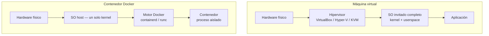
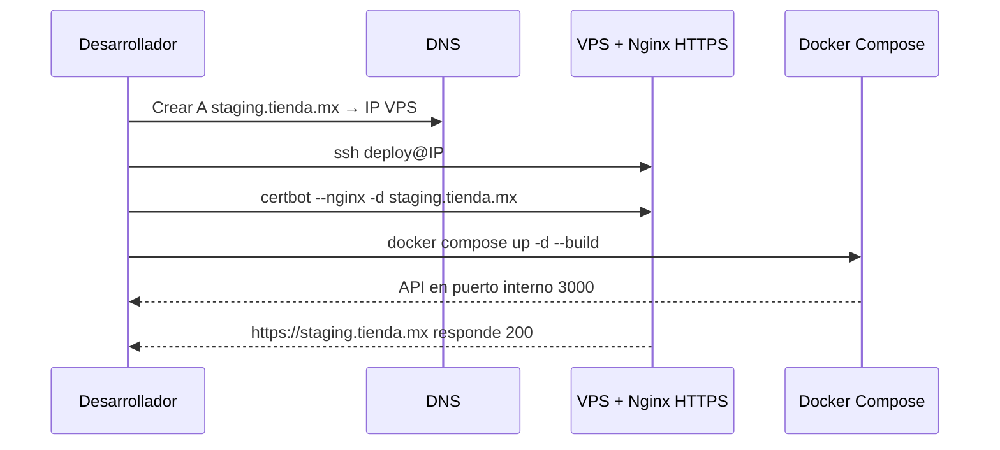

## Objetivos medibles

Al finalizar la lección el estudiante podrá:

1. **Definir** qué es un contenedor, cómo se diferencia de una máquina virtual y cuándo conviene cada enfoque.
2. **Describir** Docker (imagen, contenedor, Dockerfile, Docker Compose) y ejecutar un stack de staging con `docker compose up`.
3. **Crear** una VM de laboratorio con snapshots (VirtualBox/Hyper-V) para practicar SSH y hosting sin riesgo en el host.
4. **Diagnosticar** fallos por capa (DNS, TLS, MX, SSH, contenedores, caché) usando síntoma → causa → acción.
5. **Completar** el reto integrador: subdominio staging → DNS → VPS con Nginx HTTPS → deploy SSH → `docker compose` con app de prueba.

## Conceptos clave

### 1. Contenedores: qué son

#### Qué es

Un **contenedor** empaqueta una aplicación junto con sus dependencias (binarios, librerías, variables de entorno, configuración) en una **imagen** portable. Al ejecutarse, el contenedor corre como proceso aislado que **comparte el kernel del sistema operativo host** — no virtualiza hardware ni un SO completo.

#### Para qué sirve / Por qué importa

En LATAM, equipos pequeños despliegan en VPS regionales (DigitalOcean, AWS sa-east-1, proveedores locales) sin presupuesto para clusters. Un contenedor garantiza que la API que funciona en la laptop del desarrollador en Bogotá se comporte igual en el servidor de São Paulo. Reduce el clásico *"en mi máquina sí corre"*.

#### Cómo funciona

1. Se construye una **imagen** (plantilla inmutable) a partir de un Dockerfile o se descarga de un registro (Docker Hub).
2. `docker run` crea un **contenedor** (instancia en ejecución) a partir de esa imagen.
3. El motor de contenedores (containerd/runc en Docker) usa **namespaces** y **cgroups** del kernel Linux para aislar procesos, red y sistema de archivos sin arrancar un SO invitado.

#### Estructura / Composición

| Elemento | Rol |
|----------|-----|
| **Imagen** | Plantilla de solo lectura (capas apiladas) |
| **Contenedor** | Instancia en ejecución de una imagen |
| **Registro** | Repositorio remoto de imágenes (Docker Hub, GHCR) |
| **Volumen** | Persistencia de datos fuera del ciclo de vida del contenedor |
| **Red** | Comunicación entre contenedores y el host |

#### Ventajas y desventajas

| Ventajas | Desventajas |
|----------|-------------|
| Arranque en segundos | Requiere kernel compatible (Linux nativo o WSL 2 en Windows) |
| Imagen reproducible dev → CI → prod | No sustituye una VM si necesitas otro SO o kernel |
| Menor consumo de RAM/CPU que una VM | Curva de aprendizaje (redes, volúmenes, permisos) |
| Escalado horizontal (más réplicas) | Orquestación manual no escala; Compose/K8s para muchos servicios |

#### Ejemplo concreto

Una fintech en Medellín empaqueta su API Node.js en una imagen `node:20-alpine`. En staging corre un contenedor; en producción, tres réplicas detrás de Nginx. Misma imagen, distinto `docker compose` o variables de entorno.

#### Señales de buen y mal uso

- **Buen uso:** imagen pequeña (Alpine), usuario no-root, variables sensibles fuera de la imagen, healthcheck definido.
- **Mal uso:** contenedor como root sin necesidad, secretos hardcodeados en Dockerfile, imagen de 2 GB con SO completo innecesario, tratar el contenedor como VM persistente sin volúmenes.

---

### 2. Docker: qué es, Dockerfile y Docker Compose

#### Qué es

**Docker** es la plataforma más extendida para crear, distribuir y ejecutar contenedores. Incluye:

- **Docker Engine:** daemon que gestiona imágenes y contenedores.
- **Docker CLI:** comandos `docker build`, `docker run`, `docker compose`.
- **Docker Desktop:** entorno gráfico para Windows/macOS (usa WSL 2 o hypervisor ligero).

**Kubernetes (K8s)** orquesta cientos de contenedores en clusters; **Docker Compose** orquesta pocos servicios en un solo host — ideal para staging y laboratorio POSW.

#### Para qué sirve / Por qué importa

Docker estandariza el despliegue en el curso: el estudiante no instala Node, PostgreSQL ni Nginx directamente en el VPS de prueba; levanta un `docker-compose.yml` y replica el entorno en minutos. Es el puente entre administración remota (clase 3) y el stack web completo.

#### Cómo funciona — Dockerfile

El **Dockerfile** es un script declarativo que define cómo construir la imagen:

1. `FROM` — imagen base.
2. `WORKDIR` — directorio de trabajo.
3. `COPY` / `ADD` — archivos al contexto de build.
4. `RUN` — comandos durante la construcción.
5. `EXPOSE` — puerto documentado.
6. `CMD` / `ENTRYPOINT` — comando al arrancar el contenedor.

#### Cómo funciona — Docker Compose

**Docker Compose** lee un archivo `docker-compose.yml` y levanta varios servicios (app, base de datos, proxy) con redes y volúmenes compartidos. Un solo `docker compose up -d` despliega el stack.

#### Tipos / Variantes

| Herramienta | Alcance | Cuándo usarla |
|-------------|---------|---------------|
| `docker run` | Un contenedor | Prueba rápida, laboratorio |
| Dockerfile + `docker build` | Imagen propia | App custom |
| Docker Compose | Multi-servicio, un host | Staging, desarrollo local |
| Kubernetes | Cluster, autoescalado | Producción a escala (mención) |

#### Ejemplo concreto — comandos básicos

Ver sección **Ejemplos de código sugeridos** (Dockerfile, compose.yml, bash).

#### Señales de buen y mal uso

- **Buen uso:** `.dockerignore`, multi-etapa para reducir tamaño, `depends_on` con healthcheck, puertos mapeados explícitos (`8080:80`).
- **Mal uso:** `latest` sin fijar versión en producción, montar `/` del host, olvidar `docker compose down` y dejar contenedores huérfanos consumiendo puertos.

---

### 3. Diferencias contenedor vs máquina virtual

#### Qué es

Una **máquina virtual (VM)** emula hardware completo mediante un **hipervisor** (VirtualBox, Hyper-V, KVM, VMware) y ejecuta un **sistema operativo invitado** independiente con su propio kernel. Un **contenedor** comparte el kernel del host y solo aísla el espacio de procesos del usuario.

#### Para qué sirve / Por qué importa

Elegir mal cuesta tiempo y dinero: una startup en CDMX no necesita una VM Windows completa para servir una API Node; un contenedor basta. Pero si el laboratorio requiere practicar Ubuntu Server + `systemd` + firewall como en un VPS real, la VM reproduce mejor ese escenario.

#### Cómo funciona (comparación de capas)

Ver **Diagrama Mermaid — VM vs contenedor**.

#### Tipos / Variantes de hipervisores

| Hipervisor | Plataforma | Uso típico en POSW |
|------------|------------|-------------------|
| VirtualBox | Win/macOS/Linux | Laboratorio gratuito, snapshots |
| Hyper-V | Windows Pro/Enterprise | VMs en equipos institucionales |
| KVM | Linux | Base de muchos clouds |
| VMware Workstation/Fusion | Multi | Rendimiento y snapshots avanzados |

#### Ventajas y desventajas

| Criterio | VM | Contenedor |
|----------|-----|------------|
| SO | Completo por instancia | Comparte kernel del host |
| Tamaño | Gigabytes | Megabytes |
| Arranque | Minutos | Segundos |
| Aislamiento | Fuerte (hardware virtualizado) | Proceso/red (namespaces) |
| Uso típico | SO distinto, laboratorio GUI, legacy | Microservicios, APIs, staging web |
| Snapshots | Sí (estado de disco completo) | No equivalente; imágenes inmutables |

#### Ejemplo concreto

**Escenario VM:** practicar `certbot --nginx` en Ubuntu Server 22.04 dentro de VirtualBox antes de tocar el VPS de la universidad. Snapshot «limpio» antes de romper `ufw`.

**Escenario contenedor:** levantar `nginx:alpine` + API en staging con Compose; si falla, `docker compose down && docker compose up` en segundos.

#### Señales de buen y mal uso

- **Elegir VM cuando:** necesitas kernel/SO distinto al host, GUI completa, simular servidor bare-metal, probar Hyper-V en Windows.
- **Elegir contenedor cuando:** empaquetar app web/API, CI/CD, mismo kernel Linux en host y destino, despliegue rápido en VPS.

---

### 4. Virtualización (VMs) y troubleshooting integrador

#### Qué es

La **virtualización de SO** permite ejecutar varias máquinas lógicas sobre un host físico. En POSW se usa para **laboratorio seguro**: experimentar con SSH, Nginx y firewall sin comprometer el equipo principal.

El **troubleshooting integrador** aplica la metodología de capas del curso completo: DNS → hosting/TLS → correo → SSH → contenedores/VM → caché cliente.

#### Para qué sirve / Por qué importa

La clase 4 cierra el curso integrando dominio, hosting HTTPS, administración remota y contenedores. Un operador en Buenos Aires que ve «sitio caído» debe saber si el fallo está en propagación DNS, certificado vencido o contenedor que no escucha el puerto — no reiniciar todo al azar.

#### Cómo funciona — metodología de diagnóstico

1. **Reproducir** el fallo y anotar el mensaje exacto (navegador, cliente correo, terminal).
2. **Acotar la capa:** ¿DNS resuelve? ¿HTTPS válido? ¿Puerto abierto? ¿Servicio activo?
3. **Consultar logs:** DevTools → Red, `journalctl -u nginx`, `docker logs`, panel del hosting.
4. **Un cambio a la vez** y verificar antes del siguiente.
5. **Documentar** la solución (runbook interno).

#### Estructura — tabla de diagnóstico por síntoma

| Síntoma | Capa | Causa probable | Acción de diagnóstico | Corrección |
|---------|------|----------------|----------------------|------------|
| Dominio no abre / no resuelve | DNS | Registro A/CNAME incorrecto, TTL alto, propagación pendiente | `dig ejemplo.com`, `nslookup`, herramientas online (whatsmydns.net) | Corregir registro; esperar TTL; limpiar caché DNS local (`ipconfig /flushdns`, `systemd-resolve --flush-caches`) |
| Sitio carga por IP pero no por dominio | DNS | Mismo que arriba; caché del resolver | Comparar `curl http://IP` vs `curl http://dominio` | Arreglar zona DNS; verificar que A apunta a IP correcta |
| Navegador muestra «No seguro» / certificado inválido | TLS | Certificado vencido, SAN incorrecto, HTTP sin redirección | `openssl s_client -connect dominio:443`, revisar fechas en DevTools → Seguridad | `certbot renew` o `certbot --nginx`; forzar HTTPS en Nginx |
| Correo rebota o va a spam | Correo/DNS | MX incorrectos, SPF/DKIM ausentes, MX duplicados entre proveedores | `dig MX dominio`, revisar TXT SPF en panel DNS | Un solo proveedor MX; añadir SPF/DKIM; eliminar registros obsoletos |
| `ssh: Connection refused` | SSH/Red | `sshd` detenido, firewall, puerto erróneo, security group | `ssh -v usuario@IP`, `systemctl status ssh`, `ufw status` | Iniciar servicio; abrir puerto 22; verificar IP y clave |
| FileZilla no conecta | SFTP | FTP plano bloqueado, protocolo o credenciales incorrectas | Confirmar SFTP puerto 22, no FTP 21 | Usar SFTP con clave SSH; verificar usuario |
| Contenedor caído / puerto no responde | Contenedor | Imagen corrupta, puerto no mapeado, proceso crash al inicio | `docker ps -a`, `docker logs <nombre>`, `docker port <nombre>` | Revisar Dockerfile/CMD; mapear `-p 8080:80`; `docker compose up` de nuevo |
| `docker run` falla en Windows | Host/Docker | WSL 2 o virtualización deshabilitada en BIOS | Mensaje de Docker Desktop, `wsl --status` | Habilitar virtualización; `wsl --install`; reiniciar Docker Desktop |
| VM sin red | VM | Adaptador NAT/bridge mal configurado | `ping` gateway desde invitado; revisar configuración VirtualBox/Hyper-V | Cambiar modo de red; reinstalar guest additions si aplica |
| Sitio muestra versión antigua | Caché | Caché navegador o CDN | Hard refresh; comparar en ventana incógnito | Ctrl+Shift+R; purgar CDN; revisar cabeceras `Cache-Control` |

#### Regla de oro

No cambies nameservers y MX el mismo día sin backup de registros. Exporta la zona DNS antes de migrar correo o hosting.

#### Señales de buen y mal uso

- **Buen diagnóstico:** parte del síntoma, confirma capa con una herramienta (`dig`, `curl -vI`, `docker logs`), documenta.
- **Mal diagnóstico:** reiniciar servidor sin revisar logs, cambiar DNS y TLS simultáneamente, asumir «propagación» sin verificar el registro.

## Errores comunes

- **Confundir contenedor con VM:** esperar instalar Windows dentro de un contenedor Linux (no aplica; usar VM).
- **Olvidar mapear puertos:** la app corre dentro del contenedor pero `localhost:8080` no responde porque falta `-p 8080:80`.
- **Imagen sin tag fijo en producción:** `nginx:latest` cambia sin aviso; usar `nginx:1.25-alpine`.
- **Contenedor como root:** riesgo si el proceso es comprometido; crear usuario en Dockerfile.
- **Snapshots de VM sin nomenclatura:** «Snapshot 1» no dice si es pre-`ufw` o post-Nginx; nombrar con fecha y propósito.
- **Diagnosticar TLS cuando el fallo es DNS:** el certificado nunca se consulta si el dominio no resuelve.
- **MX duplicados tras migrar correo:** correo repartido entre Google y hosting viejo; rebotes intermitentes.
- **Hard refresh como única solución de caché:** olvidar CDN o proxy inverso que también cachea.

## Casos reales

### 1. E-commerce en Lima: staging con Docker antes del Black Friday

**Contexto:** Tienda `moda.pe` con VPS en sa-east-1. El equipo despliega manualmente por SSH y en el evento anterior la versión en producción no coincidía con la probada en local.

**Incidente:** En staging no existía; los cambios iban directo a producción. Un error en variables de entorno tumbaron el checkout 2 horas.

**Decisión:** Crear subdominio `staging.moda.pe` → registro A al mismo VPS → Nginx reverse proxy → `docker compose` con imagen etiquetada `moda-api:v1.4.2`. Deploy: `git pull` + `docker compose up -d --build` solo tras prueba en staging.

**Lección:** Contenedor + Compose no reemplaza DNS ni HTTPS; integra con lo aprendido en clases 1–3.

### 2. Consultora en Santiago: certificado vencido con DNS correcto

**Contexto:** Cliente reporta «sitio no seguro». El desarrollador asume problema de DNS porque «ayer cambiaron el hosting».

**Diagnóstico:** `dig cliente.cl` resuelve bien. `curl -vI https://cliente.cl` muestra certificado expirado hace 12 días. Let's Encrypt no tenía cron de renovación.

**Acción:** `certbot renew --dry-run` → agregar timer systemd → `certbot renew` → verificar en navegador. Documentar en runbook.

**Lección:** IP que responde y DNS correcto no implican TLS válido; acotar capa antes de tocar registros.

## Ejemplos de código sugeridos

### Dockerfile — API Node.js para staging

<!-- code: dockerfile -->
```dockerfile
FROM node:20-alpine AS base
WORKDIR /app

COPY package*.json ./
RUN npm ci --only=production

COPY . .
RUN addgroup -S app && adduser -S app -G app
USER app

EXPOSE 3000
CMD ["node", "server.js"]
```

### docker-compose.yml — app + PostgreSQL + Nginx

<!-- code: yaml -->
```yaml
services:
  api:
    build: .
    environment:
      DATABASE_URL: postgres://app:secret@db:5432/staging
      NODE_ENV: staging
    depends_on:
      db:
        condition: service_healthy
    networks:
      - backend

  db:
    image: postgres:16-alpine
    environment:
      POSTGRES_USER: app
      POSTGRES_PASSWORD: secret
      POSTGRES_DB: staging
    volumes:
      - pgdata:/var/lib/postgresql/data
    healthcheck:
      test: ["CMD-SHELL", "pg_isready -U app"]
      interval: 5s
      retries: 5
    networks:
      - backend

  web:
    image: nginx:1.25-alpine
    ports:
      - "8080:80"
    volumes:
      - ./nginx.conf:/etc/nginx/conf.d/default.conf:ro
    depends_on:
      - api
    networks:
      - backend

volumes:
  pgdata:

networks:
  backend:
```

### Comandos Docker esenciales

<!-- code: bash -->
```bash
# Construir imagen desde Dockerfile
docker build -t mi-api:staging .

# Primer contenedor de prueba
docker pull nginx:alpine
docker run -d -p 8080:80 --name web nginx:alpine
docker ps
docker logs web

# Stack completo con Compose
docker compose up -d --build
docker compose ps
docker compose logs -f api
docker compose down
```

### Deploy por SSH + Compose (flujo integrador)

<!-- code: bash -->
```bash
# Desde la laptop del desarrollador
ssh deploy@190.25.80.42
cd /opt/staging-tienda
git pull origin main
docker compose pull
docker compose up -d --build
curl -I http://localhost:8080/health
```

### Diagnóstico por capa

<!-- code: bash -->
```bash
# DNS
dig +short staging.tienda.com.co A
dig MX tienda.com.co

# TLS
curl -vI https://staging.tienda.com.co 2>&1 | grep -E 'expire|SSL'

# Contenedor caído
docker ps -a
docker logs tienda-api-1 --tail 50

# SSH verboso
ssh -v deploy@190.25.80.42
```

### Snapshot de VM (VirtualBox — referencia)

<!-- code: bash -->
```bash
# Crear snapshot desde CLI (opcional en laboratorio)
VBoxManage snapshot "Ubuntu-Lab" take "pre-nginx-$(date +%Y%m%d)" --description "Antes de instalar Nginx"
```

## Ejercicios de práctica

- **tipo:** diagrama — Dibuja las capas de una VM (hardware → hipervisor → SO invitado → app) vs contenedor (hardware → SO host → motor Docker → contenedor). Indica dónde comparten kernel.
- **tipo:** reflexion — ¿Por qué un contenedor arranca en segundos y una VM en minutos? Relaciona con kernel compartido vs SO invitado completo.
- **tipo:** comparativa — Completa una tabla VM vs contenedor en: tamaño disco, aislamiento, caso de uso para staging de API, necesidad de snapshots.
- **tipo:** codigo — Escribe un `Dockerfile` mínimo que copie `index.html` a `nginx:alpine` y exponga puerto 80.
- **tipo:** completar-codigo — Completa el `docker-compose.yml`: falta mapear puerto `8080:80` en servicio `web` y `depends_on` de `api` hacia `db`.
- **tipo:** ordenar-pasos — Ordena diagnóstico «dominio resuelve pero certificado expirado»: (a) `certbot renew`, (b) confirmar DNS con `dig`, (c) verificar fechas con `curl -vI`, (d) probar en navegador incógnito.
- **tipo:** reflexion — ¿Qué pasaría si levantas `docker compose up` sin healthcheck en PostgreSQL y la API arranca antes que la BD?
- **tipo:** diagnostico — Síntoma: `curl http://IP` funciona, `curl http://dominio` falla. Escribe tres comprobaciones en orden y la causa más probable.

## Animación o visual sugerida

- **MermaidDiagram — VM vs contenedor:** capas hardware/hipervisor/SO (comparativa lateral).
- **CompareTable — VM vs contenedor:** SO, tamaño, arranque, uso típico (ya en TSX `ContenedoresSection`).
- **StepReveal — Docker Desktop en Windows:** requisitos → WSL 2 → `hello-world` (ya en TSX).
- **StepReveal — Crear VM de laboratorio:** ISO → RAM/disco → snapshots → probar Nginx (ya en TSX `VirtualizacionSection`).
- **CompareTable — Troubleshooting:** tabla síntoma/causa/solución expandida (mejorar `SolucionProblemasSection`).

## Diagrama Mermaid (si aplica)

### VM vs contenedor — capas



### Flujo reto integrador — staging



## Secciones TSX sugeridas

- `ObjetivosSection` — 5 objetivos medibles
- `ContenedoresSection` — bloques pedagógicos contenedor + Docker + CompareTable VM vs contenedor + StepReveal Docker Desktop + CodeFiddle bash; **añadir** subsección Dockerfile y Compose con `CodeFiddle` (dockerfile/yaml)
- `VirtualizacionSection` — VM, hipervisores, StepReveal laboratorio, `PracticeExercise` cuándo elegir VM
- `SolucionProblemasSection` — tabla diagnóstico expandida (8+ filas), metodología 5 pasos, `PracticeExercise` dominio vs IP
- `RetoIntegradorSection` — stack staging completo + `PracticeExercise` documentación
- `CompruebaTuComprensionSection` / `MiniquizSection` — quiz 5 preguntas
- `CierreSection` — cierre del curso POSW configuración
- `GuiaDocenteSection` — bloques de tiempo 0–20 / 20–45 / 45–70 / 70–110 / 110–120 min

## Reto integrador

**«Stack staging para startup LATAM»**

Una startup en Guadalajara lanza `tienda.ejemplo.mx` y necesita entorno de pruebas en `staging.tienda.ejemplo.mx` antes de producción.

### Requisitos

1. **DNS:** registro A de `staging` apuntando al VPS; documentar TTL elegido.
2. **HTTPS:** Nginx en VPS con certificado Let's Encrypt (`certbot --nginx`).
3. **Deploy:** acceso por SSH con clave (sin contraseña root); usuario `deploy` con permisos Docker.
4. **Contenedores:** `docker-compose.yml` con API de prueba (Node o nginx estático) + healthcheck.
5. **Fallo simulado:** documentar un incidente (ej. certificado expirado, contenedor sin puerto mapeado, DNS sin propagar) y cómo lo diagnosticaste con la tabla de la lección.

### Entregables

- Lista de registros DNS (mínimo A para staging).
- Fragmento de `Dockerfile` o `docker-compose.yml` usado.
- Comandos: `ssh`, `certbot`, `docker compose up`, herramienta de diagnóstico (`dig`, `docker logs`, etc.).
- Decisión justificada: ¿por qué contenedor para staging y no VM completa?

### Criterio de éxito

DNS coherente, HTTPS activo en staging, deploy reproducible por SSH + Compose, fallo simulado resuelto con metodología por capas documentada.

## Preguntas sugeridas para quiz (5)

1. **¿Ventaja principal de un contenedor Docker frente a una VM?**
   - A) Virtualiza un SO completo distinto al host
   - B) Arranque rápido y menor consumo al compartir kernel
   - C) No requiere imágenes
   - D) Elimina la necesidad de red
   - **Correcta:** B
   - **Feedback:** Los contenedores comparten el kernel del host; las VMs virtualizan hardware y SO completo.

2. **El dominio no resuelve pero la IP responde ping. ¿Qué revisar primero?**
   - A) Certificado TLS
   - B) Registros DNS y propagación
   - C) `docker logs`
   - D) Caché del navegador
   - **Correcta:** B
   - **Feedback:** Si la IP funciona pero el nombre no, el problema suele estar en DNS, no en TLS ni en contenedores.

3. **¿Para qué sirven los snapshots en una VM de laboratorio?**
   - A) Acelerar Internet
   - B) Restaurar un estado conocido antes de experimentos
   - C) Renovar certificados TLS
   - D) Configurar registros MX
   - **Correcta:** B
   - **Feedback:** Un snapshot guarda el estado del disco para volver atrás si una práctica de SSH o firewall sale mal.

4. **¿Qué pasaría si la API en Compose arranca antes que PostgreSQL sin healthcheck?**
   - A) Docker instala PostgreSQL automáticamente
   - B) La API puede fallar al conectar y quedar en crash loop hasta reinicio manual
   - C) Nginx renueva el certificado solo
   - D) El kernel del host cambia a Windows
   - **Correcta:** B
   - **Feedback:** Sin `depends_on` + healthcheck, la app puede intentar conectar a una BD que aún no escucha. `depends_on: condition: service_healthy` mitiga esto.

5. **En el reto integrador, ¿qué debe forzarse en producción además del staging funcional?**
   - A) FTP en puerto 21
   - B) HTTP sin cifrar para mayor velocidad
   - C) HTTPS en todo el tráfico web
   - D) SSH con contraseña de root
   - **Correcta:** C
   - **Feedback:** HTTPS protege datos en tránsito; es estándar en producción. SSH debe usar claves, no root por contraseña.

## Referencias

- Fuente docente: `kb/education/sources/clases/configuracion-servicios-web/clase-04-virtualizacion-diagnostico.md`
- Prerrequisitos: `clase-01-fundamentos-web`, `clase-02-hosting-correo-https`, `clase-03-administracion-remota`
- Profundizar Docker avanzado: `posw/herramientas-desarrollo` (Dockerfile multi-etapa, empaquetado React)
- Quiz implementado: `src/lib/teaching-quizzes/configuracion-servicios-web.ts` → clave `clase-04-virtualizacion-diagnostico`
- TSX actual: `src/components/teaching/lessons/configuracion-servicios-web/clase-04-virtualizacion-diagnostico/`
- Documentación: [Docker Docs](https://docs.docker.com/), [Docker Compose](https://docs.docker.com/compose/), [VirtualBox Manual](https://www.virtualbox.org/manual/)
