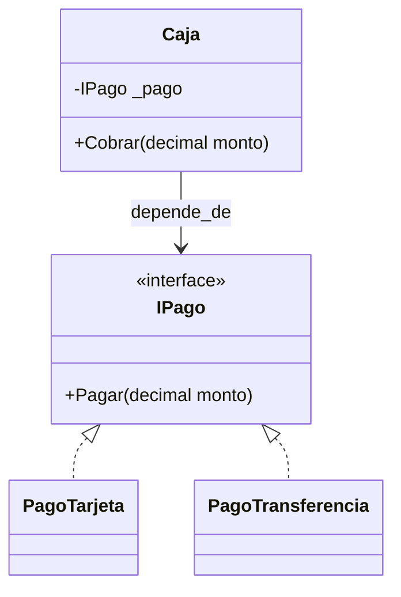
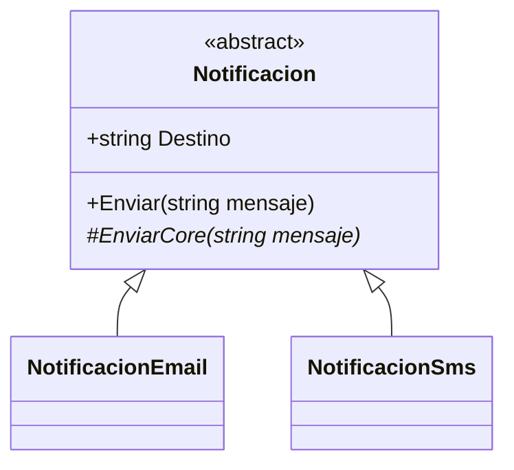
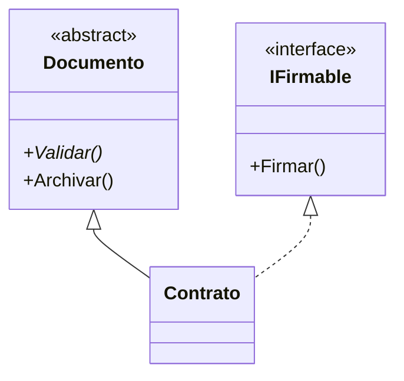

## Conceptos clave

- **Abstracción:** enfocarse en lo **esencial** del concepto y ocultar detalles accidentales; en código, **programar contra un contrato** (interfaz o clase base) en vez de una implementación concreta.
- **Contrato:** define **qué** se puede hacer, no **cómo** — permite cambiar implementaciones sin romper al cliente (`Caja` depende de `IPago`, no de `PagoTarjeta`).
- **Reducir acoplamiento:** el consumidor no conoce detalles del proveedor; nuevas variantes se añaden con clases nuevas, no editando al cliente.
- **Clase abstracta (`abstract class`):** no se instancia con `new`; puede tener **estado**, constructores, métodos con cuerpo y métodos `abstract` obligatorios en derivadas.
- **Template Method (preview):** flujo común en la base (`Enviar` valida y registra) con paso variable en derivada (`EnviarCore`).
- **Interfaz (`interface`):** contrato de **capacidad** — “qué puede hacer” un tipo; una clase puede implementar **varias** interfaces.
- **Inyección por constructor:** pasar `IPago` o `ILogger` al crear el servicio desacopla implementación de uso.
- **Cuándo abstraer:** hay **variaciones reales** de implementación; el cliente necesita una capacidad, no una clase concreta.
- **Abstracción prematura:** interfaces o abstractas sin segunda implementación prevista — complejidad sin beneficio.
- **Clase abstracta vs interfaz:** abstracta cuando hay **código y estado compartido**; interfaz cuando solo necesitas contrato y posible multi-rol.
- **Segregación (preview SOLID):** interfaces gigantes (`IManagerDeTodo`) obligan a implementar métodos no usados — preferir contratos pequeños y focalizados.

## Errores comunes

- **Abstraer “por si acaso”:** crear `IPersona`, `IPersonaRepository`, `IPersonaFactory` sin variaciones reales.
- **Clase abstracta vacía de comportamiento:** solo para prohibir `new` cuando una interfaz bastaría.
- **Interfaz con docenas de miembros:** nadie la implementa completa; rompe mantenibilidad y tests.
- **Cliente que instancia concretos:** `new Caja(new PagoTarjeta())` en un solo sitio está bien en `Main`; el **dominio** `Caja` no debe hacer `new PagoTarjeta()` internamente.
- **Confundir `abstract` con `virtual`:** `abstract` **obliga** implementación en derivada; `virtual` ofrece default sobrescribible.
- **Intentar `new Notificacion()`** si `Notificacion` es abstract — error de compilación.
- **Herencia profunda solo para compartir un método:** tres niveles de abstractas sin flujo común real.
- **Duplicar contrato en interfaz y clase abstracta sin criterio:** elegir uno según estado/código compartido, no ambos por costumbre.
- **Interfaces como marcadores sin métodos útiles:** en C# moderno preferir tipos concretos o atributos; un contrato debe exponer comportamiento.
- **Olvidar validación en el flujo común de la abstracta:** cada derivada repite las mismas reglas en lugar de centralizarlas en la base.

## Casos reales

### 1. Pasarela de pagos: de `switch` a contrato

Un checkout inicial usa `if (tipo == "tarjeta") ... else if (tipo == "transferencia")`. Cada nuevo método de pago obliga a editar `Checkout`, `Facturacion` y tests E2E. Un bug en producción mezcla lógica de Nequi con tarjeta porque alguien copió un bloque `if`.

**Decisión:** introducir `IPago` / `IPasarelaPago` con implementaciones por proveedor; `Caja` y `Checkout` solo llaman `Pagar(monto)`. Añadir PSE o efectivo = nueva clase, sin tocar cliente.

**Lección:** abstracción paga cuando las variaciones son reales y el cliente debe permanecer estable.

### 2. Notificaciones: abstracta con flujo común vs interfaz suelta

El equipo debate `INotificacion` con `Enviar` vs `abstract class Notificacion` con validación de mensaje, logging y `EnviarCore` abstracto. Con solo interfaz, cada canal (`Email`, `Sms`, `Push`) duplica validación y formato de log.

**Decisión:** clase abstracta `Notificacion` con `Enviar` no sobrescribible y `EnviarCore` protegido; canales solo implementan el envío real. Para capacidades transversales (`IRegistrableEnAuditoria`) se añade interfaz aparte.

**Lección:** abstracta cuando hay **plantilla de algoritmo** compartida; interfaz adicional cuando una capacidad cruza jerarquías distintas.

## Ejemplos de código sugeridos

### Abstracción con interfaz: IPago y Caja

```csharp
using System;

public interface IPago
{
    void Pagar(decimal monto);
}

public class PagoTarjeta : IPago
{
    public void Pagar(decimal monto) => Console.WriteLine($"Pagando {monto} con tarjeta");
}

public class PagoTransferencia : IPago
{
    public void Pagar(decimal monto) => Console.WriteLine($"Pagando {monto} por transferencia");
}

public class Caja
{
    private readonly IPago _pago;

    public Caja(IPago pago) => _pago = pago ?? throw new ArgumentNullException(nameof(pago));

    public void Cobrar(decimal monto) => _pago.Pagar(monto);
}
```

### Clase abstracta: Notificacion (Template Method)

```csharp
using System;

public abstract class Notificacion
{
    public string Destino { get; }

    protected Notificacion(string destino)
    {
        if (string.IsNullOrWhiteSpace(destino)) throw new ArgumentException("Destino requerido");
        Destino = destino;
    }

    public void Enviar(string mensaje)
    {
        if (string.IsNullOrWhiteSpace(mensaje)) throw new ArgumentException("Mensaje requerido");
        Console.WriteLine($"Preparando notificación para {Destino}...");
        EnviarCore(mensaje);
        Console.WriteLine("Notificación enviada.");
    }

    protected abstract void EnviarCore(string mensaje);
}

public class NotificacionEmail : Notificacion
{
    public NotificacionEmail(string destino) : base(destino) { }

    protected override void EnviarCore(string mensaje) =>
        Console.WriteLine($"Email a {Destino}: {mensaje}");
}

public class NotificacionSms : Notificacion
{
    public NotificacionSms(string destino) : base(destino) { }

    protected override void EnviarCore(string mensaje) =>
        Console.WriteLine($"SMS a {Destino}: {mensaje}");
}
```

### Interfaz e inyección: ILogger y Servicio

```csharp
using System;

public interface ILogger
{
    void Info(string mensaje);
}

public class LoggerConsola : ILogger
{
    public void Info(string mensaje) => Console.WriteLine($"INFO: {mensaje}");
}

public class LoggerSilencioso : ILogger
{
    public void Info(string mensaje) { /* sin salida — útil en tests */ }
}

public class LoggerArchivo : ILogger
{
    public void Info(string mensaje) => Console.WriteLine($"[archivo] {mensaje}");
}

public class Servicio
{
    private readonly ILogger _logger;

    public Servicio(ILogger logger) => _logger = logger;

    public void Ejecutar() => _logger.Info("Ejecutando...");
}
```

### Abstracta + interfaz en el mismo tipo (preview)

```csharp
public interface IFirmable
{
    void Firmar();
}

public abstract class Documento
{
    public abstract void Validar();
    public void Archivar() => Console.WriteLine("Archivado.");
}

public class Contrato : Documento, IFirmable
{
    public override void Validar() => Console.WriteLine("Contrato válido.");
    public void Firmar() => Console.WriteLine("Firmado.");
}
```

## Objetivos de aprendizaje medibles

Al finalizar la lección, el estudiante podrá:

- **Explicar** abstracción como ocultamiento de detalle y programación contra contratos en C#.
- **Implementar** una interfaz con al menos dos implementaciones y un cliente que dependa solo del contrato (`Caja` + `IPago`).
- **Diseñar** una clase abstracta con flujo común y método `abstract` obligatorio en derivadas (`Notificacion` / `EnviarCore`).
- **Comparar** criterios de elección entre clase abstracta e interfaz según estado compartido, multi-rol y extensión.
- **Detectar** abstracción prematura e interfaces sobredimensionadas en un diseño dado.

## Prerrequisitos

- **Lección `asociacion-agregacion-composicion`:** composición e inyección de dependencias (`Alarma` + `INotificador` en herencia).
- **Lección `herencia`:** `virtual`/`override`, relación “es un”.
- **Lección `encapsulamiento`:** constructores con validación, campos readonly.

## Secciones sugeridas

| orden | heading sugerido | componente TSX sugerido | foco pedagógico |
|-------|------------------|-------------------------|-----------------|
| 1 | Objetivos del tema | `ObjetivosDelTemaSection` | Objetivos + callout “abstraer con variación real” |
| 2 | Abstracción: contrato y desacoplamiento | `AbstraccionSection` | `IPago`/`Caja`, variante `PagoTransferencia` |
| 3 | Clases abstractas | `ClasesAbstractasSection` | `Notificacion`, Template Method, `NotificacionSms` |
| 4 | Interfaces | `InterfacesSection` | `ILogger`, múltiples implementaciones, inyección |
| 5 | Clase abstracta vs interfaz | `AbstractaVsInterfazSection` | CompareTable + `Documento`/`IFirmable` |
| 6 | Resumen | `ResumenSection` | Cuándo usar cada mecanismo |
| 7 | Comprueba tu comprensión | `CompruebaTuComprensionSection` | 3 ejercicios |
| 8 | Reto integrador | `RetoIntegradorSection` | Caja multi-pago + notificaciones |
| 9 | Cierre | `CierreSection` | Puente a polimorfismo |
| 10 | Mini-quiz | `MiniquizFinalSection` | `QuizSection slug="abstraccion-clases-abstractas-interfaces"` |

## Ejercicios de práctica

### Comprueba tu comprensión (3)

- **tipo:** codigo — Implementa `PagoTransferencia : IPago` y verifica que `Caja` no se editó al usarla en `Main`.
- **tipo:** codigo — Crea `NotificacionSms` con validación mínima de destino (ej. debe empezar con `+`) y úsala en `Main`.
- **tipo:** reflexion — Para `Reporte`, `Factura` y `Contrato`: indica si usarías clase abstracta, interfaz o ambas; justifica en 3 bullets por tipo.

### Reto integrador

Ver sección **Reto integrador** al final.

## Animación o visual sugerida

- **CompareTable — clase abstracta vs interfaz:**

  | Criterio | Clase abstracta | Interfaz |
  |----------|-----------------|----------|
  | Instanciable con `new` | No | No (la interfaz sola) |
  | Estado / campos compartidos | Sí | No |
  | Código común en base | Sí | No (solo contrato) |
  | Múltiples “roles” por clase | Una base | Varias interfaces |
  | Caso típico | Template Method | Capacidad intercambiable |

- **StepReveal — extender sin tocar cliente:** `new Caja(new PagoTarjeta())` → añadir `PagoTransferencia` → mismo `Cobrar` → distinta salida.

- **MermaidDiagram — Caja depende de IPago** (ver Diagrama Mermaid).

## Diagrama Mermaid (si aplica)

### Abstracción con interfaz



### Clase abstracta Notificacion



### Documento abstracto + IFirmable



## Reto integrador

**“Caja registradora y alertas de sistema”**

Prototipo .NET que combine interfaces y clase abstracta sin mezclar responsabilidades.

**Parte A — Pagos (interfaz)**

1. `IPago` con `Pagar(decimal monto)`.
2. Implementaciones `PagoTarjeta`, `PagoTransferencia`, `PagoEfectivo`.
3. `Caja` con constructor que recibe `IPago`; en `Main`, tres cajas con métodos distintos cobrando el mismo monto.

**Parte B — Notificaciones (clase abstracta)**

4. `abstract class Notificacion` con `Enviar` (flujo común) y `EnviarCore` abstracto.
5. `NotificacionEmail` y `NotificacionSms`; al menos una validación en la base (mensaje no vacío).

**Parte C — Logging (interfaz auxiliar)**

6. `ILogger` con `Info(string)`; `Servicio` que recibe `ILogger` en constructor.
7. `LoggerConsola` y `LoggerSilencioso`; demostrar `Servicio` sin cambios al intercambiar logger.

**Parte D — Criterio de diseño**

8. Comentario breve: por qué pagos usan **interfaz** y notificaciones usan **clase abstracta** en este diseño.

**Criterio de éxito:** compila; nuevos pagos y loggers sin editar `Caja` ni `Servicio`; flujo común de notificación no duplicado en derivadas; justificación coherente con la lección.

## Preguntas sugeridas para quiz (5)

1. **V/F: Abstraer significa agregar más detalles de implementación al cliente.**
   - **Correcta:** Falso
   - **Feedback:** Abstraer oculta detalles y expone lo esencial; el cliente opera sobre el contrato.

2. **¿Qué es un buen motivo para introducir una abstracción?**
   - A) “Por si acaso” sin segunda implementación
   - B) Hay variaciones reales de implementación
   - C) Evitar nombres de clase largos
   - D) Reemplazar encapsulamiento
   - **Correcta:** B
   - **Feedback:** Sin variación real, la abstracción suele ser prematura.

3. **¿Qué keyword obliga a las derivadas a implementar un método sin cuerpo en la base?**
   - A) `virtual`
   - B) `abstract`
   - C) `override`
   - D) `sealed`
   - **Correcta:** B
   - **Feedback:** `abstract` en la base fuerza implementación; `virtual` ofrece implementación por defecto.

4. **V/F: Puedes crear `new Notificacion("x")` si `Notificacion` es una clase abstracta.**
   - **Correcta:** Falso
   - **Feedback:** Las clases abstractas no se instancian directamente; usas derivadas concretas.

5. **¿Cuándo conviene preferir interfaz sobre clase abstracta?**
   - A) Necesitas compartir mucho estado y código en la base
   - B) Solo necesitas un contrato de capacidad y posible multi-rol
   - C) Nunca; siempre abstracta
   - D) Cuando no hay métodos
   - **Correcta:** B
   - **Feedback:** Interfaz para contrato puro; abstracta cuando hay implementación y estado compartidos.

## Referencias

- Fuente pedagógica: `kb/education/sources/clases/poo/05-abstraccion-clases-abstractas-interfaces.md`
- Lección anterior: `asociacion-agregacion-composicion`
- Lección siguiente: `polimorfismo`
- Microsoft Learn — Interfaces: https://learn.microsoft.com/es-es/dotnet/csharp/fundamentals/types/interfaces
- Microsoft Learn — Clases abstractas: https://learn.microsoft.com/es-es/dotnet/csharp/language-reference/keywords/abstract
- Topic expert: `kb/agents/topic-experts/poo-csharp.md`
