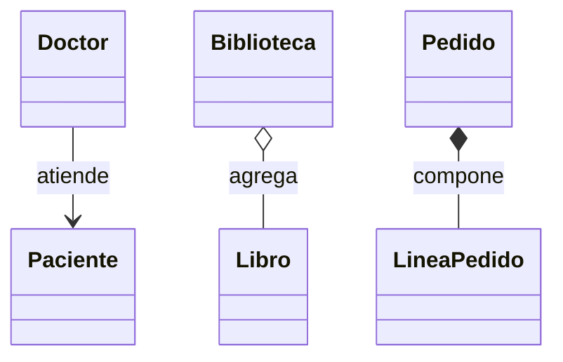
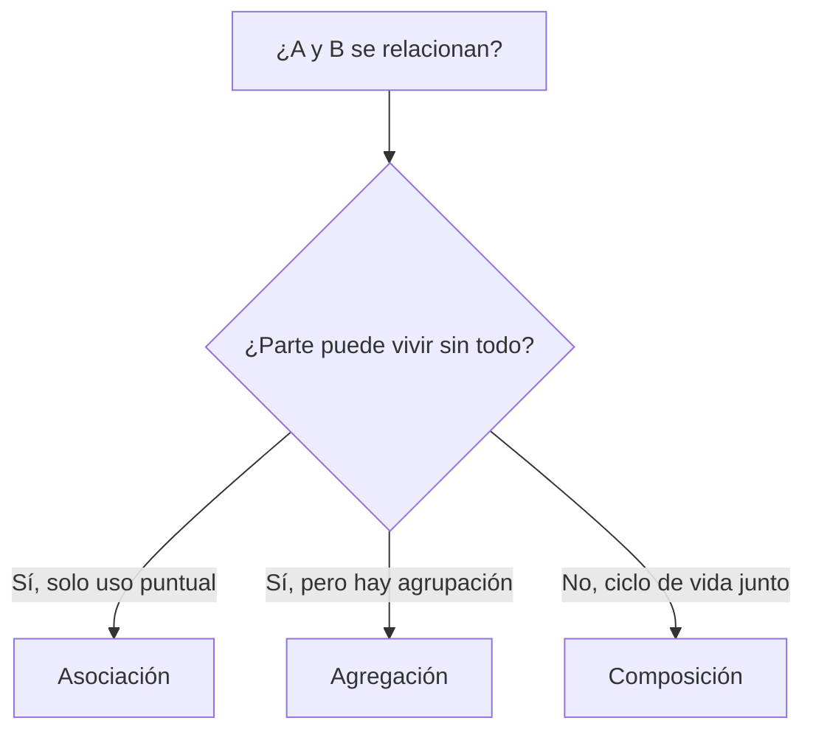

## Conceptos clave

- **Relacionar vs heredar:** muchos diseños POO no son “es un” sino **cómo dos objetos colaboran** — uso, pertenencia débil o parte indisoluble.
- **Asociación:** relación general donde A **conoce o usa** a B sin propiedad fuerte ni ciclo de vida compartido. Ejemplo: `Doctor.Atender(Paciente)`.
- **Agregación:** relación todo–parte **débil** — el todo agrupa partes que **pueden existir sin él**. Ejemplo: `Biblioteca` agrega `Libro` creados afuera.
- **Composición:** relación todo–parte **fuerte** — la parte no tiene sentido (o no existe en el modelo) sin el todo; el todo suele **crear y controlar** la parte. Ejemplo: `Pedido` compone `LineaPedido`.
- **Ciclo de vida:** criterio decisivo — si B muere o pierde sentido cuando A desaparece → composición; si B sobrevive → agregación o asociación.
- **Propiedad:** en composición el todo “posee” la creación/destrucción de la parte; en agregación solo mantiene referencias.
- **Colaboración temporal:** asociación puede durar una sola operación (parámetro de método) o formalizarse en una clase puente (`Cita` une `Doctor` y `Paciente`).
- **Colecciones internas:** `List<T>` privada + métodos `Agregar`/`Quitar` expresan agregación o composición según **quién instancia** los elementos.
- **Anti-patrón:** exponer `List<LineaPedido>` pública rompe el control del `Pedido` sobre sus líneas (composición mal aplicada).
- **Diagramas UML (preview):** `-->` asociación, `o--` agregación (diamante vacío), `*--` composición (diamante relleno).

## Errores comunes

- **Usar herencia para “tiene un”:** `class Celular : Camara` — confunde relación de parte con especialización.
- **Etiquetar todo como composición:** si las partes se comparten entre varios “todos” o existen antes del todo, es agregación.
- **Etiquetar todo como asociación:** perder la distinción todo–parte cuando hay agrupación real con reglas de pertenencia.
- **Crear objetos parte fuera y forzar composición:** pasar `LineaPedido` ya construida a `Pedido` cuando el dominio exige que solo exista dentro del pedido.
- **Agregación sin poder quitar/reasignar:** si el “todo” nunca libera referencias, el modelo se comporta como composición accidental.
- **Acoplamiento por asociación excesiva:** pasar 10 objetos a cada método en lugar de una clase de contexto (`Cita`, `OrdenCompra`).
- **Confundir agregación con composición por el contenedor:** `Biblioteca` tiene `List<Libro>` y `Pedido` tiene `List<LineaPedido>` — la diferencia está en **origen y ciclo de vida**, no en la sintaxis.
- **Destruir partes al quitar de una agregación:** quitar un libro de la biblioteca no debe “eliminar” el libro del sistema si otros lo referencian.
- **Olvidar validar en el todo compuesto:** `Pedido.AgregarLinea` debe validar producto/cantidad; delegar todo afuera rompe invariantes.

## Casos reales

### 1. E-commerce: carrito vs pedido confirmado

Un marketplace modela inicialmente `CarritoDeCompras : Producto` (herencia múltiple imposible en C#) y luego `Carrito` con `List<Producto>` donde cada línea es el catálogo global. Al confirmar compra, el equipo crea `Pedido` reutilizando las mismas instancias de `Producto` del catálogo como si fueran líneas del pedido.

**Incidente:** un cambio de precio en catálogo altera pedidos históricos; auditoría falla.

**Lección:** `Carrito` **agrega** referencias a `Producto` del catálogo (viven sin el carrito). `Pedido` **compone** `LineaPedido` con precio y cantidad **congelados** al momento de la compra. La relación correcta depende del ciclo de vida y de si la parte es compartida.

### 2. Hospital: consulta sin “contener” al paciente

El sistema modela `Hospital` con herencia `Consulta : Paciente` para “tener” datos del paciente en la consulta. Los reportes mezclan identidad del paciente con la visita; al fusionar historiales se pierde qué médico atendió en cada fecha.

**Decisión:** `Cita` asocia `Doctor`, `Paciente` y `DateTime`; ninguno contiene al otro. `Doctor.Atender(Cita)` formaliza la colaboración temporal.

**Lección:** asociación (o clase de enlace) cuando el vínculo es **evento o contexto**, no propiedad ni “es un”.

## Ejemplos de código sugeridos

### Asociación: Doctor y Paciente

```csharp
using System;

public class Paciente
{
    public string Nombre { get; }
    public Paciente(string nombre) => Nombre = nombre;
}

public class Doctor
{
    public string Nombre { get; }
    public Doctor(string nombre) => Nombre = nombre;

    public void Atender(Paciente paciente)
    {
        Console.WriteLine($"{Nombre} atiende a {paciente.Nombre}");
    }
}
```

### Asociación formalizada: Cita

```csharp
public class Cita
{
    public Doctor Doctor { get; }
    public Paciente Paciente { get; }
    public DateTime Fecha { get; }

    public Cita(Doctor doctor, Paciente paciente, DateTime fecha)
    {
        Doctor = doctor ?? throw new ArgumentNullException(nameof(doctor));
        Paciente = paciente ?? throw new ArgumentNullException(nameof(paciente));
        Fecha = fecha;
    }
}

// Doctor.Atender(Cita cita) imprime fecha + nombres
```

### Agregación: Biblioteca y Libro

```csharp
using System;
using System.Collections.Generic;

public class Libro
{
    public string Titulo { get; }
    public Libro(string titulo) => Titulo = titulo;
}

public class Biblioteca
{
    private readonly List<Libro> _libros = new();

    public void Agregar(Libro libro) => _libros.Add(libro);

    public bool Quitar(string titulo)
    {
        var idx = _libros.FindIndex(l => l.Titulo == titulo);
        if (idx < 0) return false;
        _libros.RemoveAt(idx);
        return true;
    }

    public void Listar()
    {
        foreach (var libro in _libros)
            Console.WriteLine(libro.Titulo);
    }
}
```

### Composición: Pedido y LineaPedido

```csharp
using System;
using System.Collections.Generic;
using System.Linq;

public class LineaPedido
{
    public string Producto { get; }
    public int Cantidad { get; }
    public decimal PrecioUnitario { get; }

    public LineaPedido(string producto, int cantidad, decimal precioUnitario)
    {
        if (string.IsNullOrWhiteSpace(producto)) throw new ArgumentException("Producto requerido");
        if (cantidad <= 0) throw new ArgumentException("Cantidad inválida");
        if (precioUnitario < 0) throw new ArgumentException("Precio inválido");
        Producto = producto;
        Cantidad = cantidad;
        PrecioUnitario = precioUnitario;
    }

    public decimal Subtotal() => Cantidad * PrecioUnitario;
}

public class Pedido
{
    private readonly List<LineaPedido> _lineas = new();

    public void AgregarLinea(string producto, int cantidad, decimal precioUnitario)
    {
        _lineas.Add(new LineaPedido(producto, cantidad, precioUnitario));
    }

    public void QuitarProducto(string producto)
    {
        _lineas.RemoveAll(l => l.Producto == producto);
    }

    public decimal Total() => _lineas.Sum(l => l.Subtotal());
}
```

## Objetivos de aprendizaje medibles

Al finalizar la lección, el estudiante podrá:

- **Distinguir** asociación, agregación y composición usando **ciclo de vida** y **propiedad** como criterios principales.
- **Implementar** los tres patrones en C# con colecciones privadas, parámetros de método o creación interna de partes.
- **Justificar** la elección de relación en un caso de dominio (equipo–jugador, pedido–línea, doctor–paciente) sin recurrir a herencia incorrecta.
- **Identificar** anti-patrones: herencia forzada, listas públicas mutables y composición donde las partes deberían ser independientes.
- **Formalizar** una asociación temporal mediante una clase de enlace (`Cita`) cuando el contexto lo requiere.

## Prerrequisitos

- **Lección `herencia`:** distinguir “es un” de “tiene un”; preview de composición con `INotificador`.
- **Lección `encapsulamiento`:** colecciones privadas, validación en métodos mutadores.
- Proyecto consola .NET funcional (`dotnet run`).

## Secciones sugeridas

| orden | heading sugerido | componente TSX sugerido | foco pedagógico |
|-------|------------------|-------------------------|-----------------|
| 1 | Objetivos del tema | `ObjetivosDelTemaSection` | 5 objetivos + prerrequisitos + callout “relacionar ≠ heredar” |
| 2 | Asociación: colaboración sin propiedad | `AsociacionSection` | Doctor/Paciente, variante `Cita`, diagrama `-->` |
| 3 | Agregación: todo–parte débil | `AgregacionSection` | Biblioteca/Libro, `Quitar`, diagrama `o--` |
| 4 | Composición: todo–parte fuerte | `ComposicionSection` | Pedido/LineaPedido, anti-ejemplo lista pública, diagrama `*--` |
| 5 | Comparación y decisión de diseño | `ComparacionRelacionesSection` | CompareTable + 4 casos (universidad, carrito, factura, sesión) |
| 6 | Resumen | `ResumenSection` | Viñetas decisión rápida |
| 7 | Comprueba tu comprensión | `CompruebaTuComprensionSection` | 3 ejercicios cortos |
| 8 | Reto integrador | `RetoIntegradorSection` | Mini sistema biblioteca + pedidos |
| 9 | Cierre | `CierreSection` | Puente a abstracción (contratos sobre relaciones) |
| 10 | Mini-quiz | `MiniquizFinalSection` | `QuizSection slug="asociacion-agregacion-composicion"` |

## Ejercicios de práctica

### Comprueba tu comprensión (3)

- **tipo:** reflexion — Para `Universidad` y `Departamento`, `CarritoDeCompras` y `Producto`, `Factura` y `LineaFactura`, `Usuario` y `Sesion`: elige asociación, agregación o composición y justifica mencionando ciclo de vida.
- **tipo:** codigo — Implementa `Cita` con `Doctor`, `Paciente`, `DateTime` y cambia `Atender(Paciente)` por `Atender(Cita)` imprimiendo fecha y nombres.
- **tipo:** codigo — En `Biblioteca`, implementa `Quitar(string titulo)`, quita un libro y verifica que el objeto `Libro` sigue usable si otra variable lo referencia.

### Reto integrador

Ver sección **Reto integrador** al final.

## Animación o visual sugerida

- **CompareTable — asociación vs agregación vs composición:**

  | Criterio | Asociación | Agregación | Composición |
  |----------|------------|------------|-------------|
  | Metáfora | “Te uso” | “Te agrupo” | “Estoy hecho de ti” |
  | Parte sin todo | Sí | Sí | No (en el modelo) |
  | Quién crea la parte | Cualquiera | Usualmente afuera | El todo |
  | UML (preview) | `-->` | `o--` | `*--` |

- **StepReveal — agregar libro a biblioteca:** crear `Libro` → `biblioteca.Agregar(libro)` → listar → `Quitar` → libro sigue en memoria si hay otra referencia.

- **StepReveal — línea de pedido:** `pedido.AgregarLinea(...)` → `Pedido` instancia `LineaPedido` internamente → `Total()` suma subtotales.

## Diagrama Mermaid (si aplica)

### Tres relaciones en un vistazo



### Flujo de decisión



## Reto integrador

**“Biblioteca y tienda en consola”**

Prototipo .NET que demuestre los tres tipos de relación en dominios distintos.

**Parte A — Asociación**

1. Clases `Profesor`, `Estudiante`, `Clase` (nombre de materia, `DateTime`, referencias a profesor y lista de estudiantes inscritos).
2. Método `Profesor.Dictar(Clase)` que imprime materia, fecha y cantidad de estudiantes.

**Parte B — Agregación**

3. `Biblioteca` con `Agregar`, `Quitar`, `Listar`; libros creados en `Main` antes de agregarse.
4. Demostrar que tras `Quitar`, una variable local al `Libro` sigue imprimiendo su título.

**Parte C — Composición**

5. `Pedido` que solo crea `LineaPedido` vía `AgregarLinea`; sin exponer la lista.
6. `QuitarProducto`, `Total()` y al menos dos líneas con total correcto en `Main`.

**Parte D — Justificación**

7. Párrafo breve: por qué `Clase` no hereda de `Estudiante` y por qué `LineaPedido` no se pasa ya construida desde `Main`.

**Criterio de éxito:** compila; las tres relaciones son distinguibles en código y justificación; ninguna relación “tiene un” usa herencia.

## Preguntas sugeridas para quiz (5)

1. **V/F: En asociación siempre hay propiedad fuerte del objeto relacionado.**
   - **Correcta:** Falso
   - **Feedback:** Asociación es uso o colaboración sin adueñarse del ciclo de vida. Propiedad fuerte apunta a composición.

2. **¿Qué describe mejor la agregación?**
   - A) “Parte de” con destrucción conjunta obligatoria
   - B) Todo agrupa partes que pueden existir sin él
   - C) Herencia múltiple
   - D) Solo métodos estáticos
   - **Correcta:** B
   - **Feedback:** Ejemplo clásico: equipo–jugador; el jugador puede cambiar de equipo.

3. **¿Cuál par encaja mejor con composición?**
   - A) Biblioteca–Libro
   - B) Pedido–LineaPedido
   - C) Doctor–Paciente en una consulta
   - D) Equipo–Jugador
   - **Correcta:** B
   - **Feedback:** La línea pertenece a un pedido específico y el pedido la crea; no tiene sentido compartida como catálogo.

4. **V/F: En composición, las partes suelen depender del ciclo de vida del todo.**
   - **Correcta:** Verdadero
   - **Feedback:** El todo controla creación y existencia de la parte en el modelo.

5. **`Pedido` expone `public List<LineaPedido> Lineas { get; set; }`. ¿Qué problema principal introduce?**
   - A) Ninguno, es más rápido
   - B) Rompe el control del pedido sobre sus líneas (composición débil)
   - C) Impide usar `foreach`
   - D) Obliga a usar herencia
   - **Correcta:** B
   - **Feedback:** Código externo puede mutar o reemplazar líneas sin pasar por reglas del `Pedido`.

## Referencias

- Fuente pedagógica: `kb/education/sources/clases/poo/04-asociacion-agregacion-composicion.md`
- Lección anterior: `herencia` — “es un” vs “tiene un”
- Lección siguiente: `abstraccion-clases-abstractas-interfaces` — contratos sobre implementaciones
- Microsoft Learn — Relaciones entre objetos: https://learn.microsoft.com/es-es/dotnet/csharp/fundamentals/object-oriented/
- Topic expert: `kb/agents/topic-experts/poo-csharp.md`
