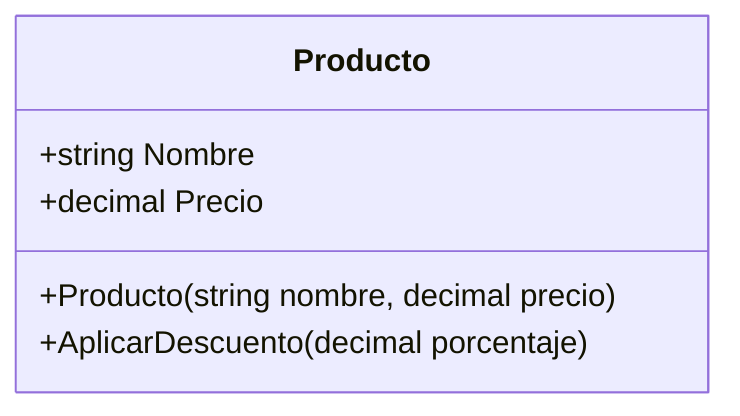
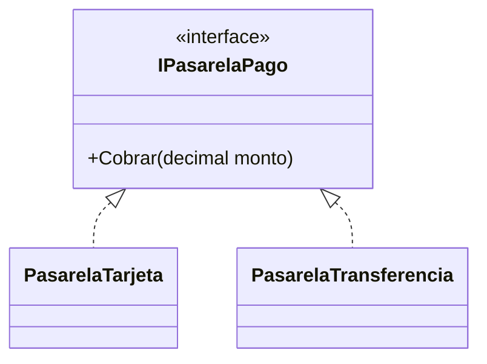
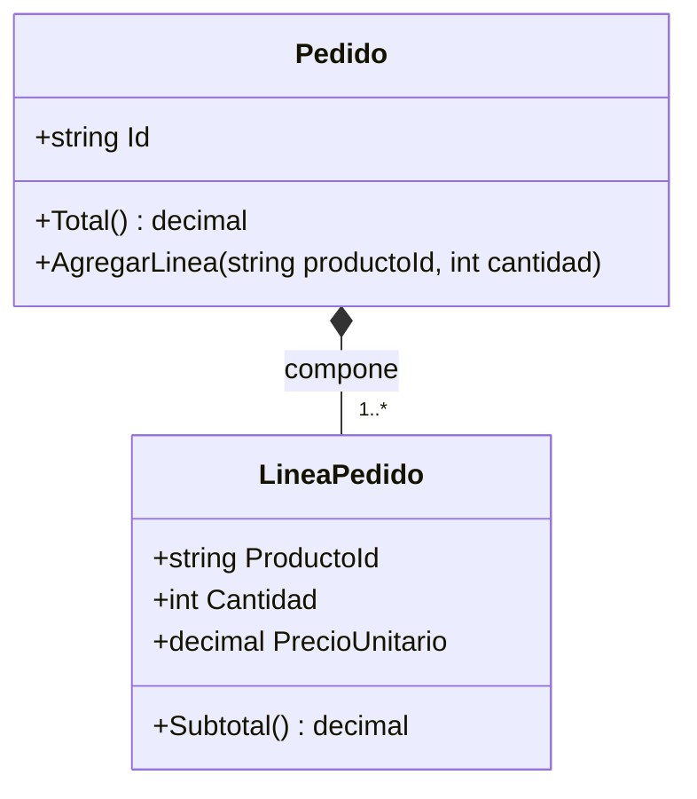
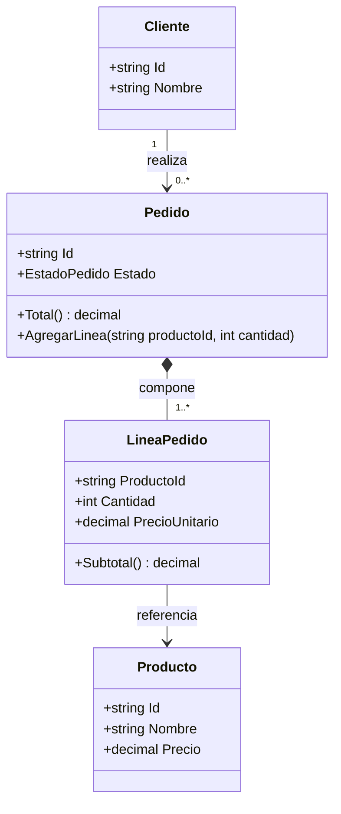
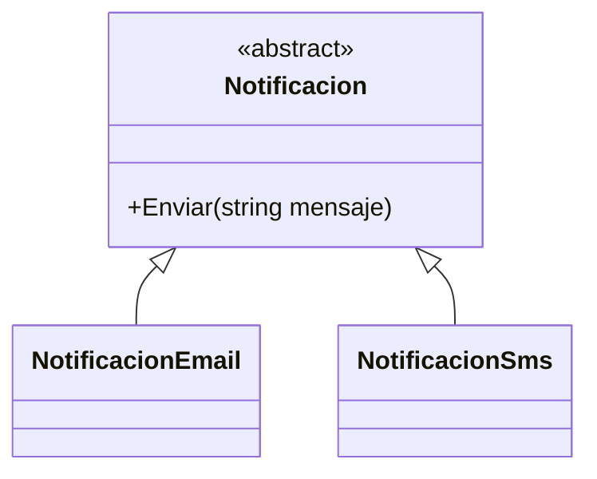
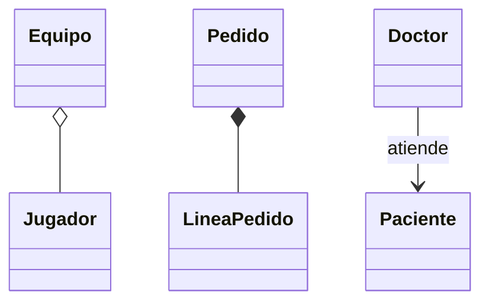

## Conceptos clave

- **Diagrama de clases (UML):** representación visual de **estructura** — clases, atributos, métodos y relaciones — sin detallar algoritmos paso a paso.
- **Comunicación de diseño:** alinear equipo, revisar modelo antes de codificar, documentar dominio; el diagrama es “plano”, no el código ejecutable.
- **Compartimentos UML:** nombre de clase, atributos (datos), métodos (comportamiento); en Mermaid `classDiagram` se modelan en el cuerpo de la clase.
- **Herencia en diagrama:** `Base <|-- Derivada` — triángulo hacia la base; jerarquías visibles de un vistazo.
- **Interfaz en diagrama:** `<<interface>>` + `Interface <|.. ClaseImplementa` — contrato sin implementación forzada en la interfaz.
- **Clase abstracta:** `<<abstract>>` en el diagrama cuando no se instancia directamente.
- **Asociación:** flecha simple entre clases que se relacionan sin implicar propiedad fuerte (`Cliente --> Pedido`).
- **Agregación:** rombo vacío `o--` — parte puede existir fuera del todo (`Equipo o-- Jugador`).
- **Composición:** rombo lleno `*--` — ciclo de vida ligado (`Pedido *-- LineaPedido`).
- **Cardinalidad:** `1`, `0..*`, `1..*` en relaciones para expresar cuántos extremos participan.
- **Mermaid en el curso:** sintaxis `classDiagram` reutilizable en lecciones y briefs; mismo modelo puede mapearse a C#.
- **Diagramas focalizados:** un diagrama por módulo o caso de uso; evitar “mapa del universo” ilegible.
- **Señal de diseño:** demasiados miembros en una clase en el diagrama sugiere baja cohesión (puente a SOLID y modularidad).

## Errores comunes

- **Confundir diagrama con secuencia o actividad:** el diagrama de clases muestra **estructura estática**, no el orden de llamadas en runtime.
- **Diagrama gigante sin foco:** incluir todo el sistema en una sola figura — nadie lo mantiene ni lo lee.
- **Dibujar solo al final:** documentar sin haber pensado el diseño no corrige acoplamiento ya codificado.
- **Herencia vs implementación invertidas:** usar `<|--` para interfaz (debe ser `<|..` hacia implementación).
- **Composición donde hay agregación:** `Equipo` y `Jugador` no suelen ser composición si el jugador existe sin el equipo.
- **Asociación tratada como composición:** asociación no implica que una clase cree a la otra.
- **Omitir cardinalidad:** `Pedido` y `LineaPedido` sin `1..*` deja ambiguo el modelo.
- **Clase “Dios” en el diagrama:** `PedidoService` con 15 métodos de dominios distintos — señal de refactor pendiente.
- **Atributos irrelevantes:** saturar la caja con detalles de implementación (framework, logs) que no son del dominio.
- **Desincronía diagrama-código:** el equipo cambia C# y el Mermaid queda obsoleto — acordar quién actualiza.

## Casos reales

### 1. Refactor de checkout antes de sprint de integraciones

Un equipo de e-commerce debe añadir Nequi y PSE en seis semanas. El `CheckoutService` tiene 1.400 líneas y nadie entiende dependencias. Code review falla porque cada dev imagina relaciones distintas.

**Decisión:** sesión de 90 minutos dibujando `Cliente`, `Pedido`, `LineaPedido`, `Producto`, `IPasarelaPago` y implementaciones. Cardinalidad y composición acordadas antes de tocar código. El diagrama vive en el repo junto al módulo.

**Lección:** diagrama pequeño y actualizado reduce malentendidos y detecta acoplamiento antes del merge.

### 2. Onboarding: de UML a C# en tienda online

Nuevo desarrollador debe implementar `Pedido.Total()` y `AgregarLinea`. Sin diagrama, asume que `Producto` pertenece al `Pedido` por composición y borra catálogo al cancelar pedidos.

**Refactor guiado por diagrama:** `Pedido *-- LineaPedido` (composición), `LineaPedido --> Producto` (referencia/agregación al catálogo). Enum `EstadoPedido` vs clase `EstadoPedido` discutido en la pizarra.

**Lección:** relaciones visuales evitan errores de ciclo de vida y alinean modelo mental con C#.

## Ejemplos de código sugeridos

### Clase Producto (correspondencia diagrama ↔ C#)

```csharp
public class Producto
{
    public string Nombre { get; }
    public decimal Precio { get; private set; }

    public Producto(string nombre, decimal precio)
    {
        Nombre = nombre;
        Precio = precio;
    }

    public void AplicarDescuento(decimal porcentaje)
    {
        if (porcentaje < 0 || porcentaje > 100)
            throw new ArgumentException("Porcentaje inválido");
        Precio -= Precio * (porcentaje / 100m);
    }
}
```

### Diagrama Mermaid — Producto



### Interfaz y implementaciones (pasarelas)



### Composición Pedido — LineaPedido



### Caso integrado tienda (modelo completo)



## Objetivos de aprendizaje medibles

Al finalizar la lección, el estudiante podrá:

- **Explicar** para qué sirve un diagrama de clases y qué **no** representa (comportamiento dinámico detallado).
- **Dibujar** en Mermaid clases con atributos y métodos, herencia (`<|--`) e implementación de interfaz (`<|..`).
- **Distinguir** asociación, agregación (`o--`) y composición (`*--`) con justificación de ciclo de vida.
- **Modelar** un mini-dominio (tienda/pedidos) con cardinalidades y relación a código C# equivalente.
- **Detectar** en un diagrama señales de mal diseño (clases sobrecargadas, jerarquías profundas).

## Prerrequisitos

- **Lección `asociacion-agregacion-composicion`:** asociación, agregación, composición en POO.
- **Lección `override-y-sobrecarga`:** herencia y métodos en jerarquías (reflejados en diagrama).
- **Lección `abstraccion-clases-abstractas-interfaces`:** interfaces y abstractas en UML.
- **Lección `polimorfismo`:** `IPasarelaPago` y variantes como caso recurrente.

## Secciones sugeridas

| orden | heading sugerido | componente TSX sugerido | foco pedagógico |
|-------|------------------|-------------------------|-----------------|
| 1 | Objetivos del tema | `ObjetivosDelTemaSection` | Estructura vs comportamiento, Mermaid |
| 2 | Elementos básicos | `ElementosBasicosSection` | Clase, atributos, métodos, `Producto` |
| 3 | Herencia e interfaces | `HerenciaInterfacesDiagramaSection` | `<|--`, `<<interface>>`, `<|..` |
| 4 | Relaciones | `RelacionesDiagramaSection` | Asociación, agregación, composición |
| 5 | Caso integrado tienda | `CasoIntegradoTiendaSection` | Pedido, líneas, cliente, producto |
| 6 | Resumen | `ResumenSection` | Checklist símbolos Mermaid |
| 7 | Comprueba tu comprensión | `CompruebaTuComprensionSection` | 3 ejercicios |
| 8 | Reto integrador | `RetoIntegradorSection` | Modelar y justificar relaciones |
| 9 | Cierre | `CierreSection` | Puente a `solid-principios` |
| 10 | Mini-quiz | `MiniquizFinalSection` | `QuizSection slug="diagramas-de-clases"` |

## Ejercicios de práctica

### Comprueba tu comprensión (3)

- **tipo:** diagrama — Dibuja en Mermaid `Usuario`, `Carrito` y `Producto`; conecta carrito con varios productos; justifica agregación vs composición.
- **tipo:** diagrama — Añade `AplicarDescuento(decimal porcentaje)` al diagrama de `Producto` y la clase abstracta `Notificacion` con `NotificacionEmail` y `NotificacionSms`.
- **tipo:** reflexion — Para `Doctor` y `Paciente` en una consulta, ¿asociación, agregación o composición? Argumenta ciclo de vida.

### Reto integrador

Ver sección **Reto integrador** al final.

## Animación o visual sugerida

- **CompareTable — tipos de relación UML:**

  | Relación | Símbolo Mermaid | Ciclo de vida | Ejemplo típico |
  |----------|-----------------|---------------|-----------------|
  | Asociación | `-->` | Independientes | Cliente → Pedido |
  | Agregación | `o--` | Parte puede existir sola | Equipo o-- Jugador |
  | Composición | `*--` | Parte muere con el todo | Pedido *-- LineaPedido |

- **StepReveal — de diagrama a C#:**
  1. Caja `Pedido` con métodos en Mermaid.
  2. Flecha composición a `LineaPedido`.
  3. Mapeo a `class Pedido` y `class LineaPedido` en C#.
  4. Validar cardinalidad `1..*`.

- **MermaidDiagram — caso tienda completo** (ver sección Diagrama Mermaid).

## Diagrama Mermaid (si aplica)

### Notificación abstracta + derivadas



### Relaciones recordatorio



## Reto integrador

**“Modelo de pedidos: de UML a diseño C#”**

Actividad de diseño (diagrama + breve mapeo a clases); implementación mínima opcional en consola.

**Parte A — Diagrama base**

1. Dibuja `Cliente`, `Producto`, `LineaPedido`, `Pedido` con atributos esenciales y métodos `Total()`, `AgregarLinea`, `Subtotal()`.
2. Relación `Cliente` → `Pedido` con cardinalidad `1` a `0..*`.
3. `Pedido` → `LineaPedido` como **composición** `1..*`.
4. `LineaPedido` → `Producto` como referencia (no composición al catálogo).

**Parte B — Estado y decisión de diseño**

5. Añade `Estado` a `Pedido` (`Creado`, `Pagado`, `Enviado`).
6. En párrafo corto: ¿`enum EstadoPedido` o clase `EstadoPedido`? Justifica para este dominio.

**Parte C — Contrato de pago**

7. Incluye `<<interface>> IPasarelaPago` con al menos dos implementaciones en el mismo diagrama.
8. Asocia `Pedido` o un `Checkout` con `IPasarelaPago` (flecha a interfaz, no a concreto).

**Parte D — Validación**

9. Lista tres reglas del diagrama que deben cumplirse al escribir C# (ej. no borrar `Producto` al eliminar línea).
10. Señala una clase que podría violar SRP si se le añaden más de cinco responsabilidades — preview lección 9.

**Criterio de éxito:** Mermaid válido; símbolos correctos; cardinalidades presentes; justificación escrita de composición vs agregación; coherencia con lecciones previas del track.

## Preguntas sugeridas para quiz (5)

1. **V/F: Un diagrama de clases muestra principalmente algoritmos y orden de ejecución.**
   - **Correcta:** Falso
   - **Feedback:** Muestra estructura estática: clases, atributos, métodos y relaciones.

2. **¿Qué muestra mejor un diagrama de clases?**
   - A) Estructura y relaciones entre clases
   - B) Logs de ejecución en producción
   - C) Uso de memoria en runtime
   - D) Configuración de CI/CD
   - **Correcta:** A
   - **Feedback:** Es el mapa del modelo de dominio, no el trazo de ejecución.

3. **¿Qué notación Mermaid indica implementación de interfaz?**
   - A) `<|--`
   - B) `<|..`
   - C) `*--`
   - D) `o--`
   - **Correcta:** B
   - **Feedback:** Línea punteada hacia la interfaz (`<|..`) para implementación.

4. **¿Qué relación suele usarse entre `Pedido` y `LineaPedido`?**
   - A) Composición (`*--`)
   - B) Asociación simple sin cardinalidad
   - C) Herencia (`<|--`)
   - D) Ninguna relación
   - **Correcta:** A
   - **Feedback:** Las líneas suelen crearse y destruirse con el pedido.

5. **V/F: Un mismo modelo puede representarse en UML (Mermaid) y traducirse a clases C#.**
   - **Correcta:** Verdadero
   - **Feedback:** El diagrama es vista del diseño; C# es la implementación alineada al modelo.

## Referencias

- Fuente pedagógica: `kb/education/sources/clases/poo/08-diagramas-de-clases.md`
- Lección anterior: `override-y-sobrecarga`
- Lección siguiente: `solid-principios`
- Mermaid — Class diagrams: https://mermaid.js.org/syntax/classDiagram.html
- UML — Class diagrams (overview): https://www.uml-diagrams.org/class-diagrams-overview.html
- Topic expert: `kb/agents/topic-experts/poo-csharp.md`
