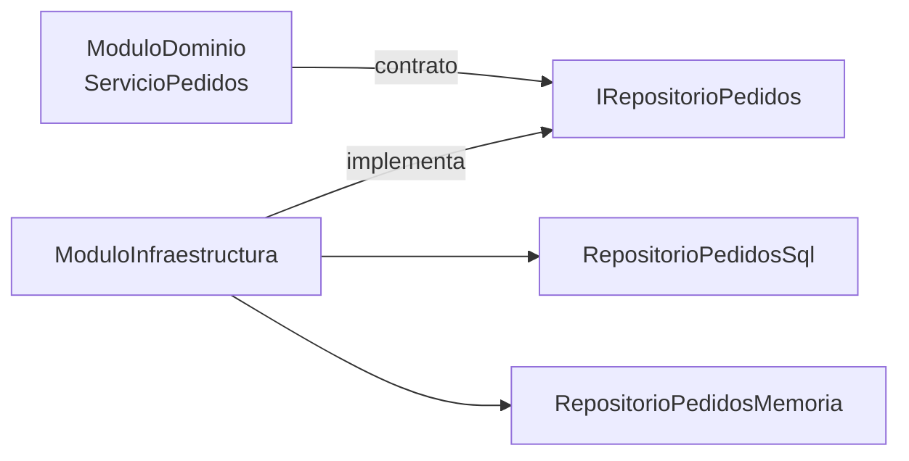
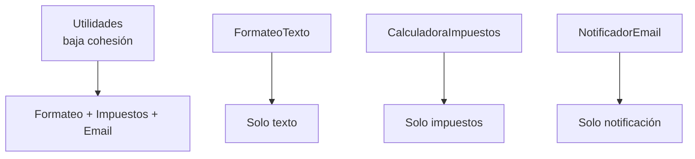
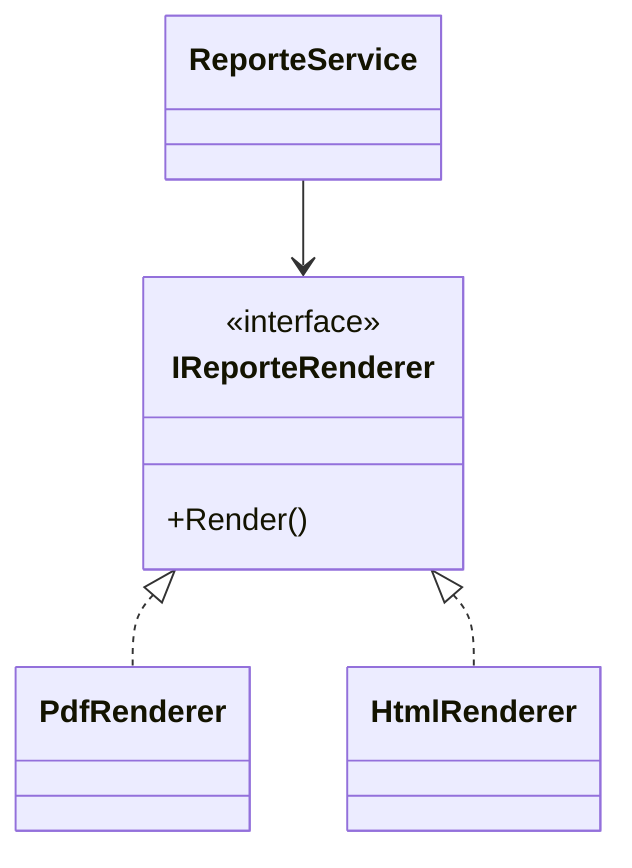

## Conceptos clave

- **Modularidad:** organizar el sistema en **módulos** (piezas) con propósito claro, API definida y límites — qué entra y qué sale.
- **Módulo ≠ carpeta vacía:** modularidad real implica **límites** y dependencias controladas, no solo estructura de directorios.
- **Cohesión:** qué tan **relacionadas** están las responsabilidades **dentro** de una clase o módulo — alta cohesión = un objetivo común.
- **Acoplamiento:** fuerza de **dependencia entre** módulos o clases — se busca **bajo acoplamiento** para cambiar piezas sin efecto dominó.
- **Alta cohesión + bajo acoplamiento:** objetivo de diseño que SOLID y POO apoyan; clases enfocadas con pocas dependencias fuertes.
- **API de módulo:** interfaces públicas (`IRepositorioPedidos`) ocultan detalles (`RepositorioSql`); el dominio no conoce infraestructura.
- **Cambio aislado:** sustituir `RepositorioPedidosMemoria` por `RepositorioPedidosSql` sin tocar `ServicioPedidos` — modularidad + DIP.
- **Clase “Utilidades”:** anti-patrón de **baja cohesión** — mezcla formateo, impuestos y email en un solo lugar.
- **Alto acoplamiento:** `new PdfGenerator()` dentro de `ReporteService` — negocio atado a un formato concreto.
- **Checklist práctico:** un motivo de cambio (SRP), extensión sin tocar cliente (OCP), contratos (DIP/ISP), clases enfocadas (cohesión), pocas dependencias duras (acoplamiento).
- **Cierre del track:** integra fundamentos POO, relaciones, abstracción, polimorfismo, SOLID y modelado visual en criterios de diseño mantenible.

## Errores comunes

- **Muchas carpetas sin límites:** `Services/`, `Helpers/`, `Utils/` que todo importa todo — spaghetti organizado.
- **Clase dios con baja cohesión:** `Utilidades` con formateo, impuestos, logs y SMTP — imposible de testear por partes.
- **`new` de concretos en dominio:** `ReporteService` crea `PdfGenerator` — cambiar a HTML obliga a editar negocio.
- **Módulo que filtra detalles:** `ServicioPedidos` con strings de conexión SQL — rompe modularidad domino/infra.
- **Cohesión confundida con “pocas líneas”:** una clase de 200 líneas **cohesa** puede ser mejor que cinco clases arbitrarias.
- **Acoplamiento cero imposible:** el objetivo es **bajo** acoplamiento útil, no eliminar toda comunicación entre módulos.
- **Ignorar diagrama al modularizar:** sin mapa de dependencias se reintroduce acoplamiento circular.
- **Utils como vertedero:** cada función suelta va a `Utilidades` — crece sin diseño de dominio.
- **Tests acoplados a infra real:** sin interfaces, pruebas requieren DB o red — señal de alto acoplamiento.
- **Refactor solo cosmético:** mover código a archivos distintos sin interfaces ni responsabilidades claras no mejora modularidad.

## Casos reales

### 1. Migración de PDF a HTML en reportes

Un sistema de informes genera solo PDF vía `PdfGenerator` instanciado dentro de `ReporteService`. Legal exige versión HTML accesible en tres semanas. Cada intento de cambio rompe flujos de facturación que compartían la misma clase.

**Decisión:** `IReporteRenderer` con `PdfRenderer` y `HtmlRenderer`; `ReporteService` recibe renderer por constructor. Módulo `Reportes` depende del contrato; módulo `Infraestructura` implementa formatos.

**Lección:** bajo acoplamiento permite cambiar tecnología de salida sin reescribir orquestación de negocio.

### 2. Split de `Utilidades` en equipo paralelo

Cuatro desarrolladores trabajan en el mismo archivo `Utilidades.cs` (formateo, impuestos, notificaciones). Conflictos de merge diarios y bugs cuando `CalcularImpuesto` altera estado usado por `FormatearNombre`.

**Refactor:** `FormateoTexto`, `CalculadoraImpuestos`, `NotificadorEmail` — alta cohesión por clase; `OrquestadorFactura` compone. Diagrama Mermaid acordado en PR.

**Lección:** modularidad con cohesión alta habilita trabajo en paralelo y reduce efectos colaterales.

## Ejemplos de código sugeridos

### Modularidad: dominio separado de infraestructura

```csharp
public interface IRepositorioPedidos
{
    void Guardar(string pedidoId);
}

public class ServicioPedidos
{
    private readonly IRepositorioPedidos _repo;

    public ServicioPedidos(IRepositorioPedidos repo) => _repo = repo;

    public void Crear(string pedidoId) => _repo.Guardar(pedidoId);
}

public class RepositorioPedidosMemoria : IRepositorioPedidos
{
    private readonly List<string> _pedidos = new();
    public void Guardar(string pedidoId) => _pedidos.Add(pedidoId);
}

public class RepositorioPedidosSql : IRepositorioPedidos
{
    public void Guardar(string pedidoId)
        => Console.WriteLine($"SQL: INSERT pedido {pedidoId}");
}
```

### Baja cohesión → alta cohesión

```csharp
// Anti-ejemplo
public class Utilidades
{
    public string FormatearNombre(string nombre) => nombre.Trim().ToUpperInvariant();
    public decimal CalcularImpuesto(decimal valor) => valor * 0.19m;
    public void EnviarEmail(string destino) { }
}

// Mejora
public class FormateoTexto
{
    public string FormatearNombre(string nombre) => nombre.Trim().ToUpperInvariant();
}

public class CalculadoraImpuestos
{
    public decimal Calcular(decimal valor) => valor * 0.19m;
}

public class NotificadorEmail
{
    public void Enviar(string destino) => Console.WriteLine($"Email a {destino}");
}
```

### Alto acoplamiento → bajo acoplamiento (reportes)

```csharp
// Alto acoplamiento
public class ReporteServiceAltoAcoplamiento
{
    private readonly PdfGenerator _pdf = new();
    public void Generar() => _pdf.CrearPdf();
}

public class PdfGenerator
{
    public void CrearPdf() => Console.WriteLine("PDF");
}

// Bajo acoplamiento
public interface IReporteRenderer
{
    void Render();
}

public class PdfRenderer : IReporteRenderer
{
    public void Render() => Console.WriteLine("PDF");
}

public class HtmlRenderer : IReporteRenderer
{
    public void Render() => Console.WriteLine("<html>...</html>");
}

public class ReporteService
{
    private readonly IReporteRenderer _renderer;
    public ReporteService(IReporteRenderer renderer) => _renderer = renderer;
    public void Generar() => _renderer.Render();
}
```

### Composición en Main (borde de la aplicación)

```csharp
IReporteRenderer renderer = new HtmlRenderer();
var reportes = new ReporteService(renderer);
reportes.Generar();

var repo = new RepositorioPedidosMemoria();
var pedidos = new ServicioPedidos(repo);
pedidos.Crear("PED-001");
```

## Objetivos de aprendizaje medibles

Al finalizar la lección, el estudiante podrá:

- **Definir** modularidad, cohesión y acoplamiento y su relación con SOLID y POO.
- **Identificar** baja cohesión (`Utilidades` mezclada) y alto acoplamiento (`new` de concretos en dominio).
- **Proponer** división en módulos/clases con nombres de dominio y 2–3 interfaces de frontera.
- **Implementar** intercambio de implementación (`Memoria`/`Sql`, `Pdf`/`Html`) sin modificar servicio de aplicación.
- **Aplicar** el checklist práctico (SRP, OCP, DIP, ISP, cohesión, acoplamiento) a un mini-sistema mezclado.

## Prerrequisitos

- **Lección `solid-principios`:** SRP, OCP, LSP, ISP, DIP como base del checklist.
- **Lección `diagramas-de-clases`:** diagramar dependencias entre módulos.
- **Lección `abstraccion-clases-abstractas-interfaces`:** contratos e inyección.
- **Lección `polimorfismo`:** variantes intercambiables bajo un contrato.

## Secciones sugeridas

| orden | heading sugerido | componente TSX sugerido | foco pedagógico |
|-------|------------------|-------------------------|-----------------|
| 1 | Objetivos del tema | `ObjetivosDelTemaSection` | Tres pilares + cierre track |
| 2 | Modularidad | `ModularidadSection` | Límites, API, `IRepositorioPedidos` |
| 3 | Cohesión | `CohesionSection` | `Utilidades` → clases enfocadas |
| 4 | Acoplamiento | `AcoplamientoSection` | `IReporteRenderer`, Pdf/Html |
| 5 | Checklist práctico | `ChecklistDisenoSection` | SRP, OCP, DIP, cohesión, acoplamiento |
| 6 | Resumen | `ResumenSection` | Síntesis del track POO completo |
| 7 | Comprueba tu comprensión | `CompruebaTuComprensionSection` | 3 ejercicios |
| 8 | Reto integrador | `RetoIntegradorSection` | Reorganizar mini-sistema |
| 9 | Cierre | `CierreSection` | Cierre del track — sin lección siguiente |
| 10 | Mini-quiz | `MiniquizFinalSection` | `QuizSection slug="modularidad-cohesion-acoplamiento"` |

## Ejercicios de práctica

### Comprueba tu comprensión (3)

- **tipo:** codigo — Crea `RepositorioPedidosSql` (simulado) y úsalo con `ServicioPedidos` sin cambiar esa clase.
- **tipo:** reflexion — Lista 3 responsabilidades de `Utilidades` y propón 3 clases con alta cohesión que las reemplacen.
- **tipo:** codigo — Añade `HtmlRenderer : IReporteRenderer` y cambia solo la composición en `Main`; verifica que `ReporteService` no cambia.

### Reto integrador

Ver sección **Reto integrador** al final.

## Animación o visual sugerida

- **CompareTable — cohesión y acoplamiento:**

  | Métrica | Malo | Bueno |
  |---------|------|-------|
  | Cohesión | `Utilidades` mezclada | `CalculadoraImpuestos` solo impuestos |
  | Acoplamiento | `new PdfGenerator()` en servicio | `IReporteRenderer` inyectado |
  | Modularidad | Todo importa todo | Dominio → contrato ← infra |

- **StepReveal — cambio de repositorio:**
  1. `ServicioPedidos` depende de `IRepositorioPedidos`.
  2. `Main` usa `RepositorioPedidosMemoria`.
  3. Se cambia a `RepositorioPedidosSql` en `Main`.
  4. `ServicioPedidos` sin modificaciones.

- **MermaidDiagram — módulos dominio/infra** (ver Diagrama Mermaid).

## Diagrama Mermaid (si aplica)

### Modularidad domino ↔ infra



### Cohesión: split Utilidades



### Acoplamiento: reportes



### Reto integrador — dependencias objetivo

```mermaid
flowchart TD
  Orq[OrquestadorCompra] --> Calc[CalculadoraTotal]
  Orq --> Desc[AplicadorDescuento]
  Orq --> Repo[IRepositorioPedidos]
  Orq --> Notif[INotificador]
  Orq --> Rep[IReporteRenderer]
  Repo <|.. RepoMem[RepositorioMemoria]
  Notif <|.. NotifConsola[NotificadorConsola]
```

## Reto integrador

**“Reorganiza el mini-sistema de compras”**

Un solo archivo mezcla: calcular total, aplicar descuento, guardar pedido, enviar notificación, generar reporte.

**Parte A — Análisis**

1. Identifica 5 responsabilidades mezcladas en el código inicial.
2. Marca cuáles son dominio vs infraestructura.

**Parte B — Diseño modular**

3. Propón 4–6 clases/módulos con nombres claros (`CalculadoraTotal`, `AplicadorDescuento`, etc.).
4. Define 2–3 interfaces (`IRepositorioPedidos`, `INotificador`, `IReporteRenderer`).
5. Diagrama Mermaid con flechas: dominio **no** debe depender de concretos de infra.

**Parte C — Implementación C#**

6. Implementa servicios con **alta cohesión** (una idea por clase).
7. `OrquestadorCompra` coordina; inyección por constructor.
8. `Main` elige `RepositorioPedidosMemoria`, `NotificadorConsola`, `PdfRenderer` o `HtmlRenderer`.

**Parte D — Checklist y cierre track**

9. Recorre checklist: SRP, OCP (¿nuevo descuento sin editar orquestador?), DIP, cohesión, acoplamiento — marca cumplimiento por ítem.
10. Párrafo final: cómo esta lección conecta con polimorfismo, SOLID y diagramas del track.

**Criterio de éxito:** dominio sin `new` de Sql/Pdf/Smtp; diagrama alineado con código; intercambio de renderer o repositorio solo en `Main`; checklist documentado.

## Preguntas sugeridas para quiz (5)

1. **V/F: Modularidad significa solo crear muchas carpetas en el proyecto.**
   - **Correcta:** Falso
   - **Feedback:** Requiere límites claros, API y dependencias controladas, no solo estructura.

2. **¿Qué ayuda más a la modularidad?**
   - A) Interfaces y límites claros entre módulos
   - B) Importar cualquier clase desde cualquier archivo
   - C) Una sola clase `Utilidades` para todo
   - D) Eliminar todas las interfaces
   - **Correcta:** A
   - **Feedback:** Los contratos definen qué expone cada módulo al resto.

3. **V/F: Alta cohesión suele mejorar legibilidad y mantenimiento.**
   - **Correcta:** Verdadero
   - **Feedback:** Elementos de la clase trabajan hacia el mismo objetivo.

4. **V/F: Usar `new PdfGenerator()` dentro de la lógica de negocio suele aumentar el acoplamiento.**
   - **Correcta:** Verdadero
   - **Feedback:** El dominio queda atado a un detalle de implementación difícil de sustituir.

5. **¿Qué suele reducir el acoplamiento entre módulos?**
   - A) Depender de interfaces en lugar de clases concretas
   - B) Referenciar directamente clases de infraestructura en el dominio
   - C) Centralizar todo en `Utilidades`
   - D) Evitar diagramas de dependencias
   - **Correcta:** A
   - **Feedback:** DIP y contratos permiten cambiar implementaciones en el borde.

## Referencias

- Fuente pedagógica: `kb/education/sources/clases/poo/10-modularidad-cohesion-acoplamiento.md`
- Lección anterior: `solid-principios`
- Lección siguiente: ninguna (cierre del track POO)
- Microsoft Learn — Dependency injection: https://learn.microsoft.com/es-es/dotnet/core/extensions/dependency-injection
- Topic expert: `kb/agents/topic-experts/poo-csharp.md`
