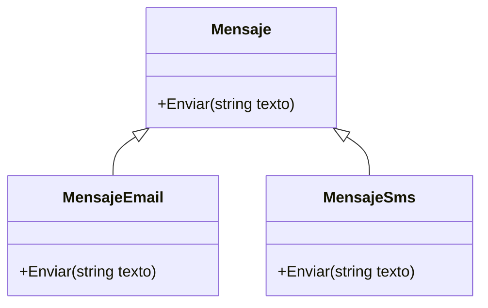
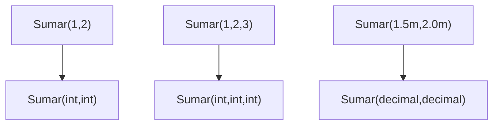
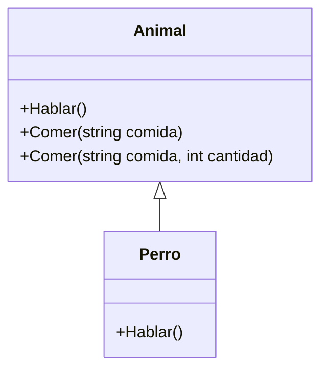

## Conceptos clave

- **Override (sobrescritura):** la clase derivada **reemplaza** la implementación de un método heredado con la **misma firma**; requiere `virtual`/`abstract` en la base y `override` en la derivada.
- **Dispatch en runtime:** con referencia de tipo base (`Mensaje m = new MensajeEmail()`), `m.Enviar()` ejecuta la versión de la instancia real — complemento directo del polimorfismo (lección 6).
- **Overload (sobrecarga):** varios métodos con el **mismo nombre** y **firmas distintas** (número o tipos de parámetros) en la misma clase; **no requiere herencia**.
- **Resolución en compile time:** el compilador elige la sobrecarga según los argumentos de la llamada (`Sumar(1,2)` vs `Sumar(1,2,3)` vs `Sumar(1.5m, 2.0m)`).
- **`params`:** permite `Sumar(params int[] valores)` como sobrecarga variádica; cuidado con ambigüedad si hay otra firma compatible.
- **Misma intención en overload:** todas las sobrecargas deben representar la **misma operación** con distintas formas de entrada, no acciones distintas con el mismo nombre.
- **Override respeta contrato:** la derivada debe cumplir el significado del método base (preview LSP); no “apagar” comportamiento prometido ni lanzar excepciones inesperadas.
- **`new` vs `override`:** `new` **oculta** el método de la base sin dispatch polimórfico; `Animal a = new Perro(); a.Hablar()` con `new` en `Perro` llama a la base si la variable es `Animal`.
- **Coexistencia en una jerarquía:** una clase puede tener **overload** (`Comer(string)` y `Comer(string, int)`) y **override** (`Hablar()`) al mismo tiempo — son mecanismos independientes.
- **Cuándo usar cada uno:** override para especializar comportamiento en familia de tipos; overload para ergonomía de API sin duplicar nombres de operación.

## Errores comunes

- **Confundir override con overload:** override = misma firma + herencia; overload = distinta firma, sin herencia obligatoria.
- **`override` sin `virtual`/`abstract` en la base:** error de compilación o tentación de usar `new` por error.
- **`new` pensando que polimorfiza:** el cliente con referencia base no ve el método “nuevo” de la derivada.
- **Sobrecargas con intenciones distintas:** `Buscar(int id)` que busca usuario y `Buscar(string nombre)` que borra registros — API confusa.
- **Demasiadas sobrecargas:** API difícil de aprender; preferir parámetros opcionales o objeto de opciones cuando crezca.
- **Ambigüedad con `params`:** `Sumar(int a, int b)` vs `Sumar(params int[] valores)` puede confundir al compilador con ciertos argumentos.
- **Override que rompe contrato:** `CalcularTotal()` en derivada devuelve valores incoherentes o lanza donde la base no lo hace.
- **Olvidar `using System.Collections.Generic`:** al usar `List<Mensaje>` en ejercicios de override polimórfico.
- **Asumir que overload se resuelve en runtime:** siempre es decisión del compilador según tipos estáticos de los argumentos.
- **Mezclar ocultamiento y polimorfismo en el mismo método:** `Hablar()` con `override` en un ejercicio y `new` en otro sin entender la diferencia de salida.

## Casos reales

### 1. Canal de notificaciones: override en familia de mensajes

Un sistema de alertas tiene `Mensaje` base con `Enviar(string)`. Producto pide email y SMS con formatos distintos (asunto, prefijo, longitud). El equipo duplica lógica en `if (tipo == "email")` dentro de un solo método de 200 líneas.

**Decisión:** `Mensaje` con `virtual void Enviar(string texto)`; `MensajeEmail` y `MensajeSms` con `override`. Servicio de notificaciones itera `List<Mensaje>` sin ramas por tipo.

**Lección:** override especializa el canal manteniendo un flujo uniforme para el orquestador.

### 2. API de búsqueda: overload para ergonomía sin herencia

Un repositorio de inventario expone búsqueda por id, por nombre y por filtro compuesto. Desarrolladores junior llaman métodos distintos (`BuscarPorId`, `BuscarPorNombre`, `BuscarCompleto`) y el equipo no encuentra la API.

**Decisión:** una clase `BuscadorProducto` con sobrecargas `Buscar(int id)`, `Buscar(string nombre)` y `Buscar(string nombre, decimal precioMax)` — misma intención, firmas distintas. Sin jerarquía de clases.

**Lección:** overload mejora usabilidad sin polimorfismo; el compilador elige la firma en tiempo de compilación.

## Ejemplos de código sugeridos

### Override: mensajes polimórficos

```csharp
using System;
using System.Collections.Generic;

public class Mensaje
{
    public virtual void Enviar(string texto)
        => Console.WriteLine($"Enviando mensaje genérico: {texto}");
}

public class MensajeEmail : Mensaje
{
    public override void Enviar(string texto)
        => Console.WriteLine($"Enviando EMAIL: {texto}");
}

public class MensajeSms : Mensaje
{
    public override void Enviar(string texto)
        => Console.WriteLine($"Enviando SMS: {texto}");
}
```

### Lista polimórfica con override

```csharp
var mensajes = new List<Mensaje>
{
    new MensajeEmail(),
    new MensajeSms()
};

foreach (var m in mensajes)
    m.Enviar("Hola"); // EMAIL, luego SMS
```

### Overload: calculadora con varias firmas

```csharp
using System;

public class Calculadora
{
    public int Sumar(int a, int b) => a + b;
    public int Sumar(int a, int b, int c) => a + b + c;
    public decimal Sumar(decimal a, decimal b) => a + b;
    public int Sumar(params int[] valores)
    {
        var total = 0;
        foreach (var v in valores) total += v;
        return total;
    }
}
```

### Override y overload en la misma jerarquía

```csharp
using System;

public class Animal
{
    public virtual void Hablar() => Console.WriteLine("Sonido genérico");

    public void Comer(string comida) => Console.WriteLine($"Come {comida}");
    public void Comer(string comida, int cantidad)
        => Console.WriteLine($"Come {cantidad} de {comida}");
}

public class Perro : Animal
{
    public override void Hablar() => Console.WriteLine("Guau!");
}

Animal a = new Perro();
a.Hablar();              // Guau! — override, runtime
a.Comer("croquetas");    // overload 1, compile time
a.Comer("croquetas", 2); // overload 2, compile time
```

### `new` vs `override` (contraste pedagógico)

```csharp
public class Animal
{
    public virtual void Hablar() => Console.WriteLine("Sonido genérico");
}

public class GatoMal : Animal
{
    public new void Hablar() => Console.WriteLine("Miau!");
}

Animal refBase = new GatoMal();
refBase.Hablar(); // Sonido genérico — no polimorfiza con new
```

## Objetivos de aprendizaje medibles

Al finalizar la lección, el estudiante podrá:

- **Definir** override como redefinición con misma firma en jerarquía y overload como métodos homónimos con firmas distintas.
- **Implementar** `override` correctamente (`virtual`/`abstract` + `override`) y procesar derivadas en `List<TipoBase>`.
- **Crear** sobrecargas coherentes en una misma clase y predecir qué firma elige el compilador.
- **Distinguir** resolución en **runtime** (override) vs **compile time** (overload) y el efecto de `new` frente a `override`.
- **Evaluar** si un diseño debe usar especialización por herencia (override) o ergonomía de API (overload).

## Prerrequisitos

- **Lección `polimorfismo`:** dispatch en runtime, programar contra contrato, preview `virtual`/`override`.
- **Lección `herencia`:** jerarquía base/derivada, `virtual`, `override`, constructor con `base`.
- **Lección `abstraccion-clases-abstractas-interfaces`:** métodos abstractos como candidatos a override.

## Secciones sugeridas

| orden | heading sugerido | componente TSX sugerido | foco pedagógico |
|-------|------------------|-------------------------|-----------------|
| 1 | Objetivos del tema | `ObjetivosDelTemaSection` | Objetivos + tabla override vs overload |
| 2 | Override (sobrescritura) | `OverrideSection` | `Mensaje`, `MensajeEmail`, `MensajeSms`, lista |
| 3 | Overload (sobrecarga) | `OverloadSection` | `Calculadora`, `params`, compile time |
| 4 | Comparación práctica | `OverrideVsOverloadSection` | `Animal`/`Perro`, `new` vs `override` |
| 5 | Resumen | `ResumenSection` | Herencia, firma, momento de resolución |
| 6 | Comprueba tu comprensión | `CompruebaTuComprensionSection` | 3 ejercicios |
| 7 | Reto integrador | `RetoIntegradorSection` | Sistema de notificaciones + calculadora |
| 8 | Cierre | `CierreSection` | Puente a `diagramas-de-clases` |
| 9 | Mini-quiz | `MiniquizFinalSection` | `QuizSection slug="override-y-sobrecarga"` |

## Ejercicios de práctica

### Comprueba tu comprensión (3)

- **tipo:** codigo — Crea `MensajeSms : Mensaje` con `override` de `Enviar`; añádela a `List<Mensaje>` y verifica salida en `foreach`.
- **tipo:** codigo — Añade `Sumar(params int[] valores)` a `Calculadora`; predice qué firma usa `Sumar(1, 2, 3, 4)` antes de ejecutar.
- **tipo:** reflexion — Con `Animal a = new Perro()` y `Perro p = new Perro()`, ¿cambia la salida de `Hablar()`? Explica override y tipo de referencia.

### Reto integrador

Ver sección **Reto integrador** al final.

## Animación o visual sugerida

- **CompareTable — Override vs Overload:**

  | Aspecto | Override | Overload |
  |---------|----------|----------|
  | Herencia | Requerida | No requerida |
  | Firma | Igual a la base | Distinta |
  | Resolución | Runtime (si ref. base) | Compile time |
  | Keyword típico | `override` | (ninguno extra) |

- **StepReveal — llamada `m.Enviar()` con ref. `Mensaje`:**
  1. Variable declarada como `Mensaje`.
  2. Instancia real `MensajeEmail`.
  3. Dispatch a `override Enviar`.
  4. Salida específica del canal.

- **MermaidDiagram — jerarquía Mensaje** (ver Diagrama Mermaid).

## Diagrama Mermaid (si aplica)

### Override: jerarquía Mensaje



### Overload: resolución por firma



### Animal: override + overload



## Reto integrador

**“Notificaciones y operaciones con override y overload”**

Sistema consola .NET que combine especialización por herencia y API sobrecargada.

**Parte A — Override (notificaciones)**

1. `Mensaje` con `virtual void Enviar(string texto)`.
2. `MensajeEmail` y `MensajeSms` con `override`.
3. Clase `ServicioNotificaciones` con método `EnviarATodos(List<Mensaje> mensajes, string texto)` — bucle sin `if` por tipo.
4. En `Main`, crear lista con ambos canales y ejecutar.

**Parte B — Overload (calculadora de pedidos)**

5. `CalculadoraPedido` con `decimal Total(decimal precio, int cantidad)`.
6. Sobrecarga `decimal Total(decimal precio, int cantidad, decimal descuentoPorcentaje)`.
7. Sobrecarga `decimal Total(params decimal[] precios)` para sumar líneas sueltas.
8. En `Main`, llamar las tres versiones e imprimir resultados coherentes.

**Parte C — Comparación `new` vs `override`**

9. Clase `MensajePush : Mensaje` con `override` correcto.
10. Documentar en comentario qué pasaría si se usara `new` en lugar de `override` con variable `Mensaje`.

**Criterio de éxito:** compila; `foreach` polimórfico sin ramas por tipo; tres sobrecargas de `Total` resolviendo sin ambigüedad; estudiante explica runtime vs compile time.

## Preguntas sugeridas para quiz (5)

1. **V/F: `override` funciona sin herencia.**
   - **Correcta:** Falso
   - **Feedback:** La sobrescritura requiere una clase base y una derivada en jerarquía.

2. **V/F: Para poder sobrescribir, la base debe marcar el método como `virtual` o `abstract`.**
   - **Correcta:** Verdadero
   - **Feedback:** Sin permiso en la base, no hay override polimórfico válido.

3. **¿Qué keyword usa la derivada para reemplazar un método virtual de la base?**
   - A) `overload`
   - B) `override`
   - C) `overload override`
   - D) `virtual`
   - **Correcta:** B
   - **Feedback:** `override` reemplaza la implementación con la misma firma.

4. **V/F: La sobrecarga (overload) se resuelve en tiempo de ejecución según el tipo real del objeto.**
   - **Correcta:** Falso
   - **Feedback:** El compilador elige la sobrecarga por nombre y tipos de argumentos en compile time.

5. **Dado `Animal a = new Perro();` con `Perro` que usa `new void Hablar()` (no `override`), ¿qué ocurre al llamar `a.Hablar()`?**
   - A) Imprime "Guau!" por polimorfismo
   - B) Llama al `Hablar` de `Animal` — `new` no polimorfiza
   - C) Error de compilación
   - D) Elige overload en runtime
   - **Correcta:** B
   - **Feedback:** `new` oculta el método; con referencia `Animal` se invoca la versión de la base.

## Referencias

- Fuente pedagógica: `kb/education/sources/clases/poo/07-override-y-sobrecarga.md`
- Lección anterior: `polimorfismo`
- Lección siguiente: `diagramas-de-clases`
- Microsoft Learn — Override: https://learn.microsoft.com/es-es/dotnet/csharp/language-reference/keywords/override
- Microsoft Learn — Member overloading: https://learn.microsoft.com/es-es/dotnet/csharp/programming-guide/classes-and-structs/member-overloading
- Topic expert: `kb/agents/topic-experts/poo-csharp.md`
