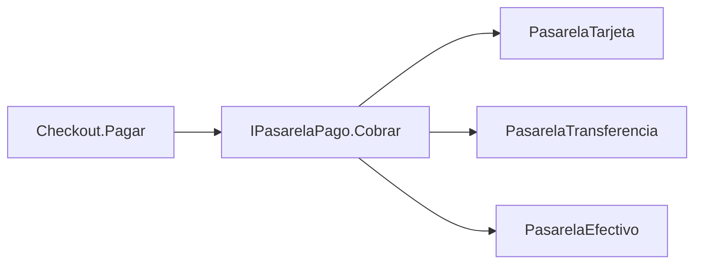
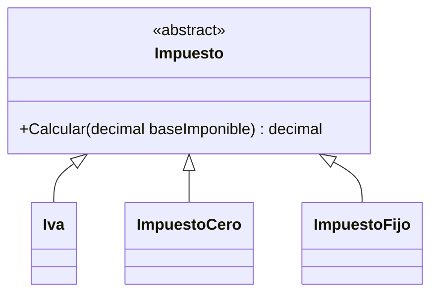
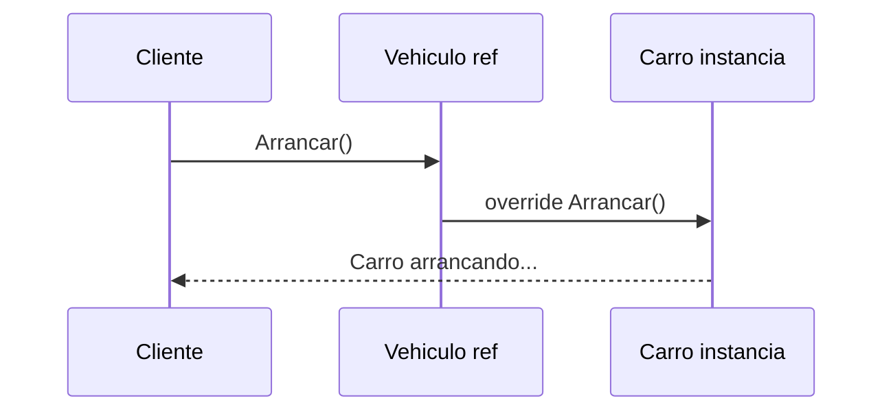

## Conceptos clave

- **Polimorfismo:** “una misma llamada, distintos comportamientos” — el tipo **declarado** dela variable puede ser contrato o base, pero la ejecución usa el tipo **real** del objeto.
- **Dispatch en runtime:** en C#, `checkout.Pagar(100)` sobre `IPasarelaPago` ejecuta la implementación concreta (`PasarelaTarjeta`, `PasarelaTransferencia`, etc.).
- **Programar contra contrato:** el cliente (`Checkout`, `foreach` sobre lista) solo conoce la interfaz o clase abstracta; no necesita `if` por tipo concreto.
- **Extensión sin modificar cliente:** añadir `PasarelaEfectivo` o `ImpuestoFijo` = nueva clase; el bucle o servicio existente sigue igual (principio abierto/cerrado, preview).
- **Polimorfismo con interfaz:** variable `IPasarelaPago` apunta a implementaciones intercambiables; inyección por constructor.
- **Polimorfismo con herencia:** clase base `abstract` o con métodos `virtual`; derivadas `override`; lista `List<Impuesto>` con `Iva` e `ImpuestoCero`.
- **`virtual` + `override`:** la base permite redefinición; sin `virtual`/`abstract`, `override` no compila (u ocultamiento con `new`, que no polimorfiza igual).
- **Colecciones polimórficas:** `List<Impuesto>`, `List<Checkout>` — un solo bucle trata variantes homogéneas bajo un contrato común.
- **Sustituibilidad (LSP preview):** cada implementación debe cumplir el contrato esperado por el cliente que usa el tipo base.
- **Cuándo NO polimorfizar:** un solo caso sin variación prevista; jerarquías confusas que no comparten intención real.
- **Anti-patrón:** `switch` o cadena de `if (obj is TipoX)` en el cliente cuando el contrato ya define el método a invocar.

## Errores comunes

- **Cliente que conoce todas las clases concretas:** `if (pasarela is PasarelaTarjeta)` en `Checkout` anula el beneficio del polimorfismo.
- **`new` en lugar de `override`:** oculta el método de la base sin dispatch polimórfico; `Vehiculo v = new Carro(); v.Arrancar()` llama a la base si se usó `new`.
- **Olvidar `virtual`/`abstract` en la base:** no se puede `override` correctamente; el compilador fuerza `new` o error.
- **Contrato inconsistente:** una implementación de `Cobrar` lanza excepción donde otras cobran — rompe al cliente que itera una lista polimórfica.
- **Lista de tipo concreto:** `List<PasarelaTarjeta>` impide mezclar pasarelas; usar `List<IPasarelaPago>` o tipo base adecuado.
- **Polimorfismo sin abstracción previa:** métodos con el mismo nombre pero sin relación de contrato no es polimorfismo de diseño, solo coincidencia de nombres.
- **Jerarquía abstracta sin “familia real”:** `Impuesto` abstracto con derivadas que no comparten semántica de cálculo.
- **Casting innecesario:** `(PasarelaTarjeta)pasarela` en el cliente para comportamiento extra — señal de contrato incompleto o diseño mezclado.
- **Asumir que el compilador elige por variable:** el tipo de la **variable** no decide en runtime; el tipo del **objeto** sí.
- **Mezclar overload con override:** sobrecarga (`Calcular(int)` vs `Calcular(decimal)`) es distinto tema (lección 7); polimorfismo es redefinición con misma firma en jerarquía.

## Casos reales

### 1. Checkout multi-pasarela sin tocar el núcleo

Un SaaS de facturación integra tarjeta y transferencia. Producto pide Nequi y efectivo en el mismo trimestre. El equipo mantiene un `switch(metodoPago)` de 400 líneas en `CheckoutService`; cada integración rompe tests de regresión.

**Decisión:** `IPasarelaPago` con `Cobrar(decimal)`; registro de implementaciones en composición raíz (`Main` o DI). `Checkout` recibe la pasarela por constructor. Nuevos métodos = nueva clase + registro; `Checkout` intacto.

**Lección:** polimorfismo elimina ramas por tipo en el cliente y acelera integraciones paralelas.

### 2. Motor de impuestos: lista homogénea en facturación

Facturación debe aplicar IVA, exención cero y tarifa fija municipal según línea de producto. Código legacy instancia `Iva` directamente en cada línea; añadir `ImpuestoFijo` obliga a editar cinco servicios.

**Refactor:** `abstract class Impuesto` con `Calcular(decimal baseImponible)`; `List<Impuesto>` en el motor; bucle único `total += imp.Calcular(base)`. Predicción de salida antes de ejecutar valida comprensión de dispatch.

**Lección:** colección polimórfica + contrato común simplifica reglas fiscales variables.

## Ejemplos de código sugeridos

### Polimorfismo con interfaz: pasarelas de pago

```csharp
using System;
using System.Collections.Generic;

public interface IPasarelaPago
{
    string Nombre { get; }
    void Cobrar(decimal monto);
}

public class PasarelaTarjeta : IPasarelaPago
{
    public string Nombre => "Tarjeta";
    public void Cobrar(decimal monto) => Console.WriteLine($"[{Nombre}] cobrando {monto}");
}

public class PasarelaTransferencia : IPasarelaPago
{
    public string Nombre => "Transferencia";
    public void Cobrar(decimal monto) => Console.WriteLine($"[{Nombre}] cobrando {monto}");
}

public class PasarelaEfectivo : IPasarelaPago
{
    public string Nombre => "Efectivo";
    public void Cobrar(decimal monto) => Console.WriteLine($"[{Nombre}] cobrando {monto}");
}

public class Checkout
{
    private readonly IPasarelaPago _pasarela;

    public Checkout(IPasarelaPago pasarela) => _pasarela = pasarela;

    public void Pagar(decimal monto) => _pasarela.Cobrar(monto);
}
```

### Lista polimórfica de checkouts

```csharp
var checkouts = new List<Checkout>
{
    new Checkout(new PasarelaTarjeta()),
    new Checkout(new PasarelaTransferencia()),
    new Checkout(new PasarelaEfectivo())
};

foreach (var c in checkouts)
    c.Pagar(100);
```

### Polimorfismo con clase abstracta: impuestos

```csharp
using System;
using System.Collections.Generic;

public abstract class Impuesto
{
    public abstract decimal Calcular(decimal baseImponible);
}

public class Iva : Impuesto
{
    public override decimal Calcular(decimal baseImponible) => baseImponible * 0.19m;
}

public class ImpuestoCero : Impuesto
{
    public override decimal Calcular(decimal baseImponible) => 0m;
}

public class ImpuestoFijo : Impuesto
{
    private readonly decimal _monto;
    public ImpuestoFijo(decimal monto) => _monto = monto;

    public override decimal Calcular(decimal baseImponible) => _monto;
}
```

### Foreach polimórfico sobre impuestos

```csharp
var impuestos = new List<Impuesto>
{
    new Iva(),
    new ImpuestoCero(),
    new ImpuestoFijo(5m)
};

foreach (var imp in impuestos)
    Console.WriteLine(imp.Calcular(100)); // 19, 0, 5
```

### Preview herencia virtual (conexión lección 3)

```csharp
public class Vehiculo
{
    public virtual void Arrancar() => Console.WriteLine("Vehículo arrancando...");
}

public class Carro : Vehiculo
{
    public override void Arrancar() => Console.WriteLine("Carro arrancando...");
}

Vehiculo v = new Carro();
v.Arrancar(); // Carro arrancando... — dispatch en runtime
```

## Objetivos de aprendizaje medibles

Al finalizar la lección, el estudiante podrá:

- **Definir** polimorfismo como invocación uniforme sobre contrato con comportamiento según el tipo real del objeto.
- **Implementar** polimorfismo con **interfaz** (`IPasarelaPago` + `Checkout`) y con **clase abstracta** (`Impuesto` + derivadas).
- **Construir** colecciones polimórficas y procesarlas con un único bucle sin `switch` por tipo.
- **Extender** el sistema con una nueva implementación (`PasarelaEfectivo`, `ImpuestoFijo`) **sin modificar** el código cliente existente.
- **Distinguir** polimorfismo real (`virtual`/`override`, interfaz) de ocultamiento con `new` o ramas `if` por tipo.

## Prerrequisitos

- **Lección `abstraccion-clases-abstractas-interfaces`:** interfaces, clases abstractas, inyección por constructor.
- **Lección `herencia`:** `virtual`, `override`, preview polimórfico con `Vehiculo`/`Carro`.
- **Lección `asociacion-agregacion-composicion`:** composición de pasarela dentro de `Checkout`.

## Secciones sugeridas

| orden | heading sugerido | componente TSX sugerido | foco pedagógico |
|-------|------------------|-------------------------|-----------------|
| 1 | Objetivos del tema | `ObjetivosDelTemaSection` | Objetivos + callout “misma llamada, distinto comportamiento” |
| 2 | Polimorfismo con interfaces | `PolimorfismoInterfacesSection` | `IPasarelaPago`, `Checkout`, `PasarelaEfectivo` |
| 3 | Polimorfismo con clase abstracta | `PolimorfismoHerenciaSection` | `Impuesto`, lista, `ImpuestoFijo` |
| 4 | Cliente estable y extensión | `ClienteEstableSection` | Anti-patrón `switch`, principio abierto/cerrado (preview) |
| 5 | Resumen | `ResumenSection` | Interfaz vs abstracta en polimorfismo |
| 6 | Comprueba tu comprensión | `CompruebaTuComprensionSection` | 3 ejercicios |
| 7 | Reto integrador | `RetoIntegradorSection` | Checkout + motor de impuestos |
| 8 | Cierre | `CierreSection` | Puente a `override-y-sobrecarga` |
| 9 | Mini-quiz | `MiniquizFinalSection` | `QuizSection slug="polimorfismo"` |

## Ejercicios de práctica

### Comprueba tu comprensión (3)

- **tipo:** codigo — Añade `PasarelaEfectivo : IPasarelaPago` y `new Checkout(new PasarelaEfectivo())` sin editar `Checkout`; verifica el `foreach` de checkouts.
- **tipo:** codigo — Implementa `ImpuestoFijo` con monto constante; predice salida de `imp.Calcular(100)` para `Iva`, `ImpuestoCero` e `ImpuestoFijo(5)` antes de ejecutar.
- **tipo:** reflexion — Explica por qué `List<Impuesto>` puede contener `Iva` e `ImpuestoCero` pero `List<Iva>` no puede contener `ImpuestoCero` polimórficamente.

### Reto integrador

Ver sección **Reto integrador** al final.

## Animación o visual sugerida

- **StepReveal — llamada polimórfica en checkout:**
  1. `Checkout` guarda `IPasarelaPago`.
  2. Cliente llama `Pagar(100)`.
  3. Delegación a `Cobrar` del contrato.
  4. Runtime resuelve implementación concreta (Tarjeta / Transferencia / Efectivo).

- **CompareTable — `if` por tipo vs polimorfismo:**

  | Aspecto | `switch` / `is` en cliente | Polimorfismo |
  |---------|---------------------------|--------------|
  | Nueva variante | Editar cliente | Nueva clase |
  | Acoplamiento | Alto | Bajo (contrato) |
  | Legibilidad del bucle | Ramas crecientes | Una llamada uniforme |
  | Tests | Combinar todas las ramas | Mock del contrato |

- **MermaidDiagram — flujo Checkout → IPasarelaPago** (ver Diagrama Mermaid).

## Diagrama Mermaid (si aplica)

### Polimorfismo con interfaz



### Jerarquía Impuesto



### Dispatch en runtime (herencia)



## Reto integrador

**“Facturación con checkout e impuestos”**

Sistema consola .NET que una pagos polimórficos y cálculo fiscal en un flujo coherente.

**Parte A — Pasarelas (interfaz)**

1. `IPasarelaPago` con `Nombre` y `Cobrar(decimal)`.
2. Al menos tres implementaciones (tarjeta, transferencia, efectivo).
3. `Checkout` con inyección; método `Pagar(decimal)` sin lógica `switch` interna.
4. `List<Checkout>` procesada en bucle en `Main`.

**Parte B — Impuestos (clase abstracta)**

5. `abstract class Impuesto` con `Calcular(decimal baseImponible)`.
6. `Iva` (19%), `ImpuestoCero`, `ImpuestoFijo` (monto fijo).
7. Clase `Factura` con `decimal Base` y `List<Impuesto>`; método `TotalImpuestos()` que itera sin `if` por tipo.

**Parte C — Integración**

8. En `Main`: crear factura con base 100 y dos impuestos; imprimir total impuestos; luego ejecutar dos checkouts con pasarelas distintas.

**Parte D — Extensión demostrada**

9. Añadir `PasarelaNequi` o `ImpuestoReducido` **después** de tener Partes A–C funcionando, sin editar `Checkout` ni `Factura.TotalImpuestos`.

**Criterio de éxito:** compila; bucles sin ramas por tipo concreto; nueva pasarela o impuesto solo añade archivo/clase; salida numérica coherente con reglas definidas.

## Preguntas sugeridas para quiz (5)

1. **V/F: El polimorfismo reduce la necesidad de `if` por tipo en el cliente.**
   - **Correcta:** Verdadero
   - **Feedback:** El cliente invoca el contrato; cada implementación responde distinto sin ramas explícitas.

2. **¿Qué habilita polimorfismo más comúnmente en C#?**
   - A) Variables globales
   - B) Interfaces y clases base abstractas/virtual
   - C) Solo structs
   - D) Namespaces
   - **Correcta:** B
   - **Feedback:** Contrato (interfaz o base) + implementaciones concretas permiten dispatch en runtime.

3. **V/F: El cliente debe conocer todas las clases concretas para beneficiarse del polimorfismo.**
   - **Correcta:** Falso
   - **Feedback:** El cliente depende del contrato; las concretas se instancian en composición o DI.

4. **¿Qué keyword usa la derivada para redefinir un método virtual/abstract de la base?**
   - A) `overload`
   - B) `override`
   - C) `extern`
   - D) `partial`
   - **Correcta:** B
   - **Feedback:** `override` reemplaza la implementación de la base con la misma firma.

5. **Dado `var impuestos = new List<Impuesto> { new Iva(), new ImpuestoCero() };` ¿qué afirmación es correcta?**
   - A) No compila porque los tipos son distintos
   - B) Compila; el foreach puede llamar `Calcular` polimórficamente
   - C) Solo funciona con interfaces, no con abstractas
   - D) Requiere cast a `Iva` en cada elemento
   - **Correcta:** B
   - **Feedback:** Lista del tipo base/contrato admite instancias derivadas; `Calcular` se resuelve por tipo real.

## Referencias

- Fuente pedagógica: `kb/education/sources/clases/poo/06-polimorfismo.md`
- Lección anterior: `abstraccion-clases-abstractas-interfaces`
- Lección siguiente: `override-y-sobrecarga`
- Microsoft Learn — Polimorfismo: https://learn.microsoft.com/es-es/dotnet/csharp/fundamentals/object-oriented/polymorphism
- Microsoft Learn — Interfaces: https://learn.microsoft.com/es-es/dotnet/csharp/fundamentals/types/interfaces
- Topic expert: `kb/agents/topic-experts/poo-csharp.md`
