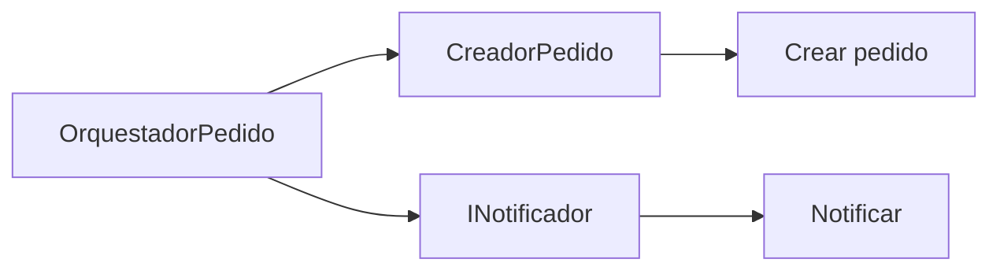
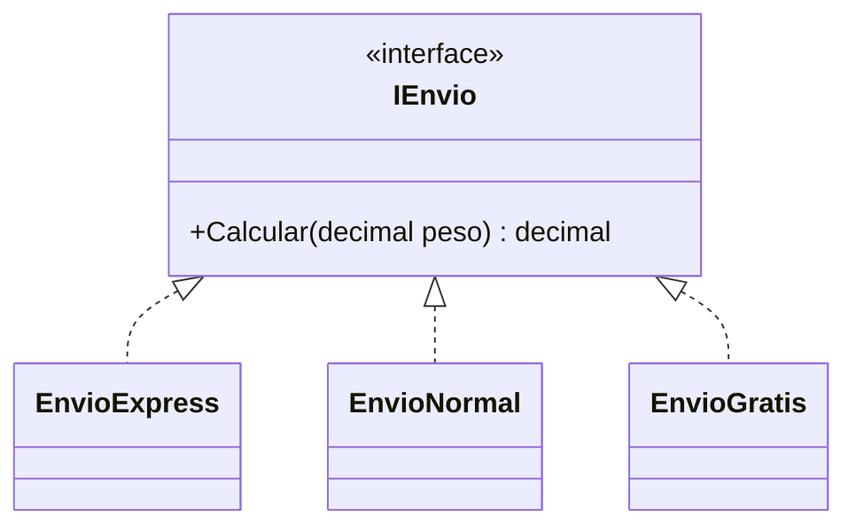
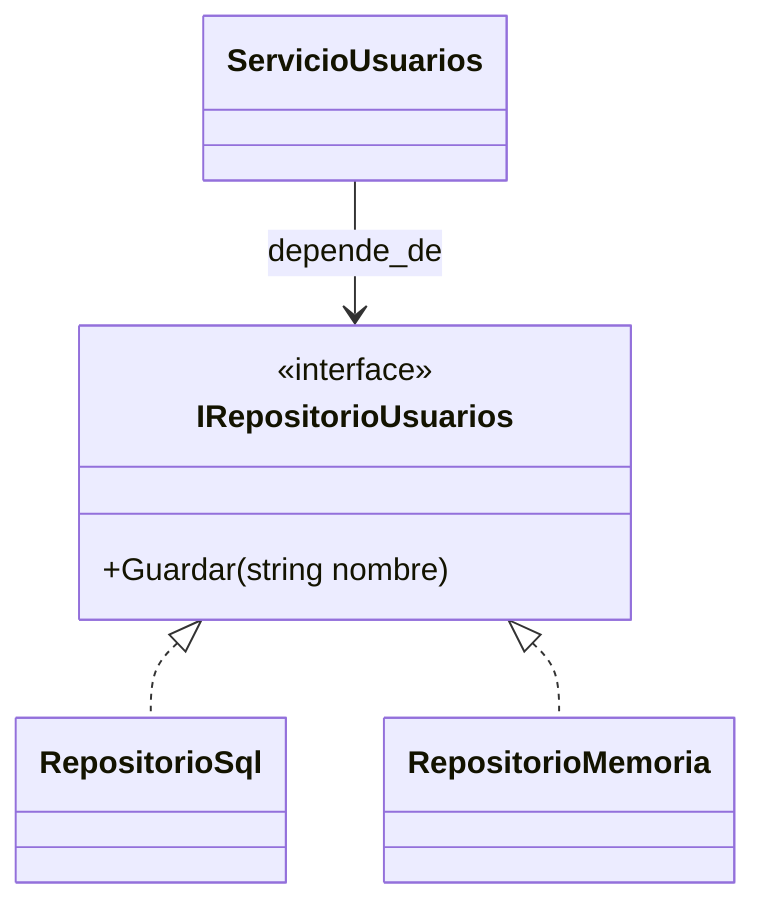
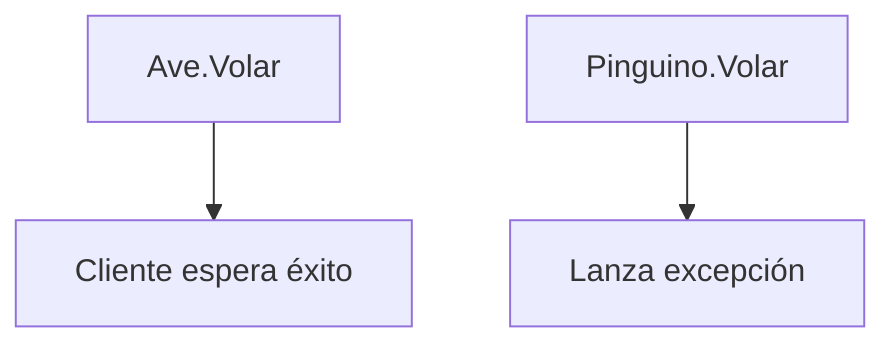

## Conceptos clave

- **SOLID:** cinco principios prácticos para código más fácil de cambiar — menos acoplamiento, más cohesión, contratos claros.
- **S — Single Responsibility (SRP):** una clase debe tener **un motivo principal de cambio**; separar reglas de dominio, orquestación e I/O.
- **O — Open/Closed (OCP):** **abierto a extensión**, **cerrado a modificación** del cliente — nuevas variantes vía nuevas clases, no `switch` creciente.
- **L — Liskov Substitution (LSP):** toda derivada debe poder **sustituir** a la base sin sorprender al cliente — mismo contrato, sin excepciones nuevas ni significados rotos.
- **I — Interface Segregation (ISP):** interfaces **pequeñas y específicas**; no forzar a implementar métodos que la clase no usa.
- **D — Dependency Inversion (DIP):** módulos de alto nivel dependen de **abstracciones**, no de concretos; detalles implementan contratos; inyección por constructor es patrón habitual.
- **SRP ≠ un método:** es un **rol** o responsabilidad coherente; `CreadorPedido` crea, `INotificador` notifica, `OrquestadorPedido` coordina.
- **OCP con polimorfismo:** `IEnvio` + `EnvioExpress` / `EnvioNormal` / `EnvioGratis` — añadir tipo sin editar calculadora con `switch`.
- **LSP y herencia:** `Pinguino : Ave` con `Volar()` que lanza excepción viola sustituibilidad — mejor `IVolador` o modelos separados.
- **ISP vs interfaz “comodín”:** `IImpresoraMultiuso` con fax en impresora básica → dividir en `IImpresora`, `IEscaner`.
- **DIP en capas:** `ServicioUsuarios` recibe `IRepositorioUsuarios`; `RepositorioSql` o `RepositorioMemoria` en el borde de la app.
- **Principios interconectados:** polimorfismo y abstracción habilitan OCP y DIP; SRP e ISP mejoran cohesión; LSP protege polimorfismo real.

## Errores comunes

- **Clase “hace de todo”:** `PedidoService` valida, persiste, envía email y genera PDF — viola SRP y es difícil de testear.
- **`switch` por tipo en muchos lugares:** cada nuevo envío o impuesto obliga a tocar N archivos — viola OCP.
- **Herencia forzada que rompe contrato:** subclase que no puede cumplir método de la base (`Pinguino.Volar`) — viola LSP.
- **Interfaz gigante “por si acaso”:** implementaciones con métodos vacíos o `NotImplementedException` — viola ISP.
- **`new RepositorioSql()` dentro del servicio:** lógica de negocio acoplada a infraestructura — viola DIP.
- **Confundir OCP con “nunca editar código”:** se pueden modificar implementaciones nuevas; el **cliente estable** no debería cambiar por cada variante.
- **SRP llevado al extremo:** una clase por línea de código — buscar **motivos de cambio** reales, no fragmentación artificial.
- **DIP solo con interfaces vacías:** abstracción sin semántica clara no reduce acoplamiento útil.
- **Ignorar LSP al usar polimorfismo:** lista de `Ave` con `Volar()` que falla en una derivada rompe el bucle uniforme.
- **Orquestador que vuelve a mezclar todo:** separar clases pero poner reglas, SQL y SMTP en `OrquestadorPedido` sin límites.

## Casos reales

### 1. Monolito de pedidos: de God class a SRP + DIP

Un ERP interno tiene `PedidoService` con 800 líneas: validación, cálculo, SQL Server, SMTP y PDF. Cada cambio en plantilla de email rompe tests de cálculo de impuestos.

**Decisión:** `CreadorPedido`, `INotificador`, `IRepositorioPedidos`, `OrquestadorPedido` con inyección en `Main`. Tests de dominio con `RepositorioMemoria` y `NotificadorConsola`.

**Lección:** SRP y DIP permiten cambiar infraestructura sin reescribir reglas de negocio.

### 2. Calculadora de envíos: eliminar `switch` con OCP

Logística añade modalidad “gratis” y “same-day” cada trimestre. `CalculadoraEnvio` con `switch(tipo)` duplicado en tres microservicios.

**Refactor:** `IEnvio` con `Calcular(decimal peso)`; clases `EnvioExpress`, `EnvioNormal`, `EnvioGratis`. Registro de estrategias en composición raíz. Nuevos tipos = nueva clase, cliente intacto.

**Lección:** OCP alinea con polimorfismo ya visto; reduce conflictos de merge y regresiones.

## Ejemplos de código sugeridos

### SRP: anti-ejemplo y refactor

```csharp
// Anti-ejemplo — mezcla crear + notificar
public class PedidoService
{
    public void CrearYNotificar(string emailCliente, decimal total)
    {
        if (total <= 0) throw new ArgumentException("Total inválido");
        Console.WriteLine("Guardando pedido...");
        Console.WriteLine($"Enviando email a {emailCliente}...");
    }
}

public class CreadorPedido
{
    public void Crear(decimal total)
    {
        if (total <= 0) throw new ArgumentException("Total inválido");
        Console.WriteLine("Guardando pedido...");
    }
}

public interface INotificador
{
    void Enviar(string destino, string mensaje);
}

public class NotificadorEmail : INotificador
{
    public void Enviar(string destino, string mensaje)
        => Console.WriteLine($"Email a {destino}: {mensaje}");
}

public class OrquestadorPedido
{
    private readonly CreadorPedido _creador;
    private readonly INotificador _notificador;

    public OrquestadorPedido(CreadorPedido creador, INotificador notificador)
    {
        _creador = creador;
        _notificador = notificador;
    }

    public void Procesar(string email, decimal total)
    {
        _creador.Crear(total);
        _notificador.Enviar(email, "Pedido registrado");
    }
}
```

### OCP: envíos sin switch

```csharp
public interface IEnvio
{
    decimal Calcular(decimal peso);
}

public class EnvioExpress : IEnvio
{
    public decimal Calcular(decimal peso) => peso * 10;
}

public class EnvioNormal : IEnvio
{
    public decimal Calcular(decimal peso) => peso * 5;
}

public class EnvioGratis : IEnvio
{
    public decimal Calcular(decimal peso) => peso <= 1 ? 0 : 3;
}
```

### LSP: anti-ejemplo Ave / Pingüino

```csharp
public class Ave
{
    public virtual void Volar() => Console.WriteLine("Volando");
}

public class Pinguino : Ave
{
    public override void Volar()
        => throw new InvalidOperationException("No puedo volar");
}

// Mejor: IVolador solo para aves que vuelan; Pinguino no implementa Volar
```

### ISP: interfaces segregadas

```csharp
public interface IImpresora
{
    void Imprimir(string texto);
}

public interface IEscaner
{
    void Escanear();
}

public class ImpresoraBasica : IImpresora
{
    public void Imprimir(string texto) => Console.WriteLine(texto);
}

public class ImpresoraTodoEnUno : IImpresora, IEscaner
{
    public void Imprimir(string texto) => Console.WriteLine(texto);
    public void Escanear() => Console.WriteLine("Escaneando...");
}
```

### DIP: servicio depende de abstracción

```csharp
public interface IRepositorioUsuarios
{
    void Guardar(string nombre);
}

public class RepositorioSql : IRepositorioUsuarios
{
    public void Guardar(string nombre) { /* SQL simulado */ }
}

public class RepositorioMemoria : IRepositorioUsuarios
{
    private readonly List<string> _usuarios = new();
    public void Guardar(string nombre) => _usuarios.Add(nombre);
}

public class ServicioUsuarios
{
    private readonly IRepositorioUsuarios _repo;

    public ServicioUsuarios(IRepositorioUsuarios repo) => _repo = repo;

    public void Crear(string nombre)
    {
        _repo.Guardar(nombre);
        Console.WriteLine("Usuario creado");
    }
}
```

## Objetivos de aprendizaje medibles

Al finalizar la lección, el estudiante podrá:

- **Enunciar** los cinco principios SOLID y su propósito en mantenibilidad y cambio seguro.
- **Identificar** violaciones típicas (God class, `switch`, interfaz hinchada, `new` de concretos) en fragmentos C#.
- **Refactorizar** un anti-ejemplo hacia SRP + interfaces y orquestación mínima.
- **Aplicar** OCP con contrato + nuevas clases (`IEnvio`, `EnvioGratis`) sin modificar cliente.
- **Reconocer** ruptura de LSP y proponer diseño alternativo (`IVolador`); aplicar DIP con inyección por constructor.

## Prerrequisitos

- **Lección `polimorfismo`:** extensión por nuevas implementaciones, cliente estable.
- **Lección `abstraccion-clases-abstractas-interfaces`:** interfaces, inyección por constructor.
- **Lección `herencia`:** sustituibilidad, `override`, preview LSP.
- **Lección `diagramas-de-clases`:** visualizar dependencias y contratos antes de refactor.

## Secciones sugeridas

| orden | heading sugerido | componente TSX sugerido | foco pedagógico |
|-------|------------------|-------------------------|-----------------|
| 1 | Objetivos del tema | `ObjetivosDelTemaSection` | SOLID como reglas prácticas |
| 2 | S — Responsabilidad única | `SrpSection` | `PedidoService` → `CreadorPedido` + `INotificador` |
| 3 | O — Abierto/Cerrado | `OcpSection` | `IEnvio`, eliminar `switch` |
| 4 | L — Sustitución de Liskov | `LspSection` | `Ave`/`Pinguino`, `IVolador` |
| 5 | I — Segregación de interfaces | `IspSection` | `IImpresora`, `IEscaner` |
| 6 | D — Inversión de dependencias | `DipSection` | `IRepositorioUsuarios`, inyección |
| 7 | Resumen | `ResumenSection` | Tabla mnemotécnica S-O-L-I-D |
| 8 | Comprueba tu comprensión | `CompruebaTuComprensionSection` | 3 ejercicios |
| 9 | Reto integrador | `RetoIntegradorSection` | Mini-sistema refactorizado |
| 10 | Cierre | `CierreSection` | Puente a `modularidad-cohesion-acoplamiento` |
| 11 | Mini-quiz | `MiniquizFinalSection` | `QuizSection slug="solid-principios"` |

## Ejercicios de práctica

### Comprueba tu comprensión (3)

- **tipo:** codigo — Implementa `EnvioGratis : IEnvio` (peso ≤ 1 → 0, si no → 3) sin modificar `EnvioExpress` ni `EnvioNormal`.
- **tipo:** reflexion — ¿Qué principio viola `Pinguino : Ave` con `Volar()` que lanza? Propón rediseño con `IVolador` o clases separadas.
- **tipo:** codigo — Crea `RepositorioMemoria : IRepositorioUsuarios` y usa `ServicioUsuarios` con ella en `Main` (DIP).

### Reto integrador

Ver sección **Reto integrador** al final.

## Animación o visual sugerida

- **CompareTable — antes/después SRP:**

  | Aspecto | `PedidoService` monolítico | Separado SRP + DIP |
  |---------|---------------------------|---------------------|
  | Motivos de cambio | Muchos | Uno por clase |
  | Test sin DB | Difícil | `RepositorioMemoria` |
  | Cambio de email | Toca validación | Solo `INotificador` |

- **StepReveal — OCP al añadir envío:**
  1. Cliente usa `IEnvio`.
  2. Existen `Express` y `Normal`.
  3. Nueva clase `EnvioGratis`.
  4. Cliente sin cambios — solo registro de instancia.

- **MermaidDiagram — DIP ServicioUsuarios** (ver Diagrama Mermaid).

## Diagrama Mermaid (si aplica)

### SRP — flujo de responsabilidades



### OCP — IEnvio



### DIP — repositorio



### LSP — ruptura de contrato



## Reto integrador

**“Tienda refactorizada con SOLID”**

Partir de un mini-monolito y llegar a diseño alineado a los cinco principios.

**Código inicial (proporcionar en lección):** clase `TiendaMonolito` que calcula total con descuento, guarda pedido en consola, envía notificación y elige envío con `switch(tipo)`.

**Parte A — SRP**

1. Extraer `CalculadoraTotal`, `AplicadorDescuento`, `CreadorPedido`, `NotificadorConsola` (o `INotificador`).
2. `OrquestadorTienda` solo coordina; sin reglas de negocio mezcladas con formato de salida.

**Parte B — OCP + ISP**

3. `IEnvio` con `EnvioNormal` y `EnvioExpress`; eliminar `switch` de tipo de envío.
4. `INotificador` pequeña; no incluir métodos de impresión o reporte en la misma interfaz.

**Parte C — LSP + DIP**

5. Si hay jerarquía de productos, asegurar que ninguna derivada rompa `CalcularPrecio()` del contrato base.
6. `IRepositorioPedidos` inyectado en orquestador; `RepositorioConsola` y `RepositorioMemoria` intercambiables en `Main`.

**Parte D — Diagrama y extensión**

7. Diagrama Mermaid con dependencias (dominio → abstracciones ← infra).
8. Añadir `EnvioGratis` y `NotificadorSms` **sin** editar `OrquestadorTienda` (solo composición en `Main`).

**Criterio de éxito:** compila; sin `switch` por tipo de envío en orquestador; clases con un rol claro; nueva estrategia de envío/notificación por nueva clase; diagrama coherente con código.

## Preguntas sugeridas para quiz (5)

1. **¿Qué principio se rompe más cuando una clase “hace de todo”?**
   - A) SRP
   - B) ISP
   - C) DIP
   - D) Ninguno
   - **Correcta:** A
   - **Feedback:** SRP pide un motivo principal de cambio por clase.

2. **¿Qué principio ayuda a agregar un nuevo método de envío sin tocar el cliente?**
   - A) LSP
   - B) OCP
   - C) ISP
   - D) SRP
   - **Correcta:** B
   - **Feedback:** OCP favorece extensión con nuevas clases que implementan el contrato.

3. **V/F: ISP prefiere interfaces pequeñas y específicas por rol.**
   - **Correcta:** Verdadero
   - **Feedback:** Evita que clases implementen métodos que no necesitan.

4. **V/F: DIP recomienda que la lógica de negocio instancie directamente `RepositorioSql`.**
   - **Correcta:** Falso
   - **Feedback:** Alto nivel debe depender de abstracciones; el concreto se elige en el borde.

5. **Si una subclase lanza excepción en un método que la base promete cumplir, ¿qué principio suele violarse?**
   - A) OCP
   - B) LSP
   - C) ISP
   - D) SRP
   - **Correcta:** B
   - **Feedback:** LSP exige sustituibilidad sin sorprender al cliente polimórfico.

## Referencias

- Fuente pedagógica: `kb/education/sources/clases/poo/09-solid-principios.md`
- Lección anterior: `diagramas-de-clases`
- Lección siguiente: `modularidad-cohesion-acoplamiento`
- Microsoft Learn — SOLID (guías de diseño): https://learn.microsoft.com/es-es/dotnet/architecture/modern-web-apps-azure/common-web-application-architectures
- Robert C. Martin — Principles of OOD: https://blog.cleancoder.com/uncle-bob/2020/10/18/Solid-Relevance.html
- Topic expert: `kb/agents/topic-experts/poo-csharp.md`
