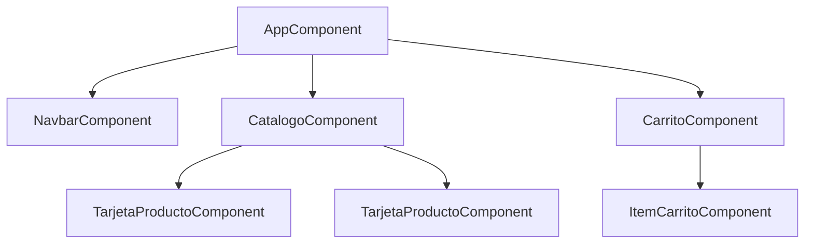

## Objetivos medibles

Al finalizar la lección el estudiante podrá:

1. Describir **Angular** como framework opinionado de Google basado en TypeScript: componentes, módulos, servicios e inyección de dependencias.
2. Estructurar un **componente** con clase TS, plantilla HTML, `@Input`/`@Output` y ciclo de vida (`ngOnInit`, `ngOnDestroy`).
3. Aplicar **directivas estructurales y de atributo** (`*ngIf`, `*ngFor`, `ngClass`, `ngStyle`) en plantillas declarativas.
4. Explicar los **cuatro tipos de data binding** (interpolación, property, event, two-way con `ngModel`).
5. Consumir una **API REST** con `HttpClient`, servicios `@Injectable` y pipes (`currency`, `date`, `async`).

## Conceptos clave

- **Angular:** framework frontend de Google, escrito en TypeScript. Arquitectura de componentes con DI, módulos, servicios y plantillas declarativas. Opinionado: define estructura, testing y despliegue.
- **Angular.js vs Angular 2+:** Angular.js (2010, MVC) está deprecado; Angular moderno (2016+) es componentizado y es el estándar actual.
- **Componente:** unidad básica — clase TypeScript (lógica) + template HTML (vista) + estilos CSS opcionales.
- **`@Component`:** `selector`, `templateUrl`, `styleUrls`; define cómo se inserta en el DOM.
- **`@Input()` / `@Output()`:** comunicación padre → hijo (datos) e hijo → padre (`EventEmitter`).
- **Ciclo de vida:** `ngOnChanges`, `ngOnInit`, `ngDoCheck`, `ngAfterContentInit`, `ngAfterViewInit`, `ngOnDestroy` (limpiar suscripciones).
- **Directivas:** componentes (con template), estructurales (`*ngIf`, `*ngFor`, `*ngSwitch` — modifican DOM), de atributo (`ngClass`, `ngStyle`).
- **Data binding:** interpolación `{{ }}`, property `[prop]`, event `(click)`, two-way `[(ngModel)]`.
- **Pipes:** transforman datos en template sin mutar el original (`currency`, `date`, `async`, `json`).
- **NgModule:** agrupa declaraciones, imports, exports, providers; `AppModule` es raíz. Angular 15+ permite standalone components que reducen módulos.
- **Servicios e inyección de dependencias:** lógica reutilizable y acceso HTTP; `@Injectable({ providedIn: 'root' })` singleton.
- **`HttpClient`:** cliente HTTP tipado con Observables (`Observable<Producto[]>`).
- **Árbol de componentes:** jerarquía `AppComponent` → features → componentes presentacionales.

## Errores comunes

- **Olvidar `ngOnDestroy`:** suscripciones a Observables sin `unsubscribe` causan memory leaks.
- **Mutar `@Input()` en el hijo:** los inputs son de solo lectura; emitir evento al padre para cambios.
- **Usar `*ngFor` sin `trackBy` en listas dinámicas:** re-render innecesario; usar `trackBy` con ID estable.
- **Lógica de negocio en el template:** expresiones complejas en HTML; mover a getters o servicios.
- **No importar `FormsModule`/`ReactiveFormsModule`:** `[(ngModel)]` falla sin el módulo correspondiente.
- **HttpClient sin manejo de errores:** solo `subscribe` en `next`; siempre manejar `error` y estados de carga.
- **Confundir Angular.js con Angular moderno:** documentación y APIs son incompatibles.

## Casos reales

### 1. Banco corporativo: migración a Angular con DI

Un banco adopta Angular para su portal de clientes. Inicialmente cada componente hace `fetch` directo duplicando URLs y headers de autenticación. Un cambio en la API de transferencias obliga a editar 12 componentes.

**Decisión clave:** extraer `TransferenciasService` con `HttpClient` e interceptores JWT; componentes solo consumen Observables; tests unitarios con `HttpClientTestingModule`.

### 2. Catálogo e-commerce: memory leak en SPA

Un catálogo Angular suscribe `productosService.getProductos()` en cada navegación sin cancelar. Tras 30 minutos de uso, la app se vuelve lenta y consume RAM creciente.

**Decisión clave:** `takeUntilDestroyed()` o `Subscription` en `ngOnDestroy`; pipe `async` en template para suscripciones automáticas; auditoría de hooks de ciclo de vida.

## Ejemplos de código sugeridos

### Anatomía de un componente

<!-- code: typescript -->
```typescript
import { Component, OnInit, Input, Output, EventEmitter } from "@angular/core";

@Component({
  selector: "app-tarjeta-producto",
  templateUrl: "./tarjeta-producto.component.html",
  styleUrls: ["./tarjeta-producto.component.scss"]
})
export class TarjetaProductoComponent implements OnInit {
  @Input() nombre: string = "";
  @Input() precio: number = 0;
  @Output() agregarAlCarrito = new EventEmitter<string>();

  descuento: number = 0;

  ngOnInit(): void {
    this.descuento = this.precio > 1000000 ? 0.1 : 0;
  }

  onAgregarClick(): void {
    this.agregarAlCarrito.emit(this.nombre);
  }

  get precioConDescuento(): number {
    return this.precio * (1 - this.descuento);
  }
}
```

### Template del componente

<!-- code: html -->
```html
<div class="tarjeta">
  <h3>{{ nombre }}</h3>
  <p class="precio">{{ precioConDescuento | currency:'COP':'symbol':'1.0-0' }}</p>
  <span *ngIf="descuento > 0" class="badge">
    {{ descuento * 100 }}% descuento
  </span>
  <button (click)="onAgregarClick()">Agregar al carrito</button>
</div>
```

### Directivas estructurales y de atributo

<!-- code: html -->
```html
<div *ngIf="producto; else sinProducto">
  <h2>{{ producto.nombre }}</h2>
</div>
<ng-template #sinProducto>
  <p>No se encontró el producto.</p>
</ng-template>

<div *ngFor="let item of items; let i = index; let par = even"
     [class.fila-par]="par">
  {{ i + 1 }}. {{ item.nombre }}
</div>

<span [ngClass]="{ 'activo': producto.activo, 'agotado': !producto.activo }">
  Estado
</span>
```

### Ciclo de vida: fetch y limpieza

<!-- code: typescript -->
```typescript
export class ProductoDetalleComponent implements OnInit, OnDestroy {
  private subscription = new Subscription();

  ngOnInit(): void {
    this.subscription.add(
      this.productosService.getProducto(this.id)
        .subscribe(producto => this.producto = producto)
    );
  }

  ngOnDestroy(): void {
    this.subscription.unsubscribe();
  }
}
```

### Servicio HTTP con inyección de dependencias

<!-- code: typescript -->
```typescript
@Injectable({ providedIn: "root" })
export class ProductosService {
  private readonly apiUrl = "https://api.ejemplo.com/v1/productos";

  constructor(private http: HttpClient) {}

  getProductos(): Observable<Producto[]> {
    return this.http.get<Producto[]>(this.apiUrl);
  }

  getProducto(id: number): Observable<Producto> {
    return this.http.get<Producto>(`${this.apiUrl}/${id}`);
  }
}
```

### Crear proyecto Angular

<!-- code: bash -->
```bash
npm install -g @angular/cli
ng new mi-tienda --routing --style=scss
cd mi-tienda
ng serve
```

## Ejercicios de práctica

- **tipo:** reflexion — ¿Por qué Angular se considera "framework completo" y React "librería"? Enumera al menos 3 piezas que Angular trae integradas (routing, HTTP, forms, etc.).
- **tipo:** diagrama — Dibuja el árbol de componentes de una tienda: `AppComponent` → navbar, catálogo (tarjetas), carrito.
- **tipo:** completar-codigo — Completa el binding: mostrar imagen dinámica `imagenUrl` → `___`; click en guardar → `___`; two-way en campo búsqueda → `___`.

## Animación o visual sugerida

- **StepReveal — ciclo de vida:** `ngOnChanges` → `ngOnInit` → `ngAfterViewInit` → `ngOnDestroy`.
- **CompareTable — bindings:** interpolación | property | event | two-way (sintaxis y dirección).
- **MermaidDiagram — árbol de componentes** de app de catálogo.

## Diagrama Mermaid (si aplica)

### Árbol de componentes



### Flujo padre-hijo con servicio HTTP

```mermaid
flowchart LR
  PADRE[CatalogoComponent] -->|@Input datos| HIJO[TarjetaProductoComponent]
  HIJO -->|@Output evento| PADRE
  PADRE --> SVC[ProductosService]
  SVC -->|HttpClient| API[REST API]
```

## Secciones TSX sugeridas

- `ObjetivosSection` — 5 objetivos medibles
- `QueEsAngularSection` — definición, Angular.js vs Angular 2+, tabla versiones
- `ComponentesSection` — anatomía TS + HTML, árbol de componentes
- `CicloVidaSection` — timeline hooks, ejemplo `ngOnInit`/`ngOnDestroy`
- `DirectivasSection` — estructurales y de atributo con ejemplos HTML
- `DataBindingsSection` — tabla 4 tipos + formulario `ngModel`
- `PipesSection` — tabla pipes comunes (`currency`, `date`, `async`)
- `ModulosServiciosSection` — NgModule, `ProductosService`, consumo en componente
- `CompruebaTuComprensionSection` — quiz integrado

## Reto integrador

**"Módulo de catálogo Angular para API REST"**

Consumirás `GET /api/v1/productos` y `POST /api/v1/carrito/items`.

1. Genera (en papel o pseudocódigo) `ProductosModule` con declaraciones, imports (`HttpClientModule`, `RouterModule`) y providers.
2. Define `ProductosService` con `getProductos()` y tipado `Producto[]`.
3. Escribe `CatalogoComponent` que en `ngOnInit` cargue productos y maneje estado de error/carga.
4. Crea `TarjetaProductoComponent` con `@Input` nombre/precio y `@Output` agregarAlCarrito.
5. En el template del catálogo usa `*ngFor`, pipe `currency:'COP'` y `ngOnDestroy` o `async` pipe para evitar leaks.

**Criterio de éxito:** separación componente presentacional vs contenedor, servicio único para HTTP, ciclo de vida con limpieza, bindings correctos.

## Preguntas sugeridas para quiz (5)

1. **¿De qué tres partes se compone típicamente un componente Angular?**
   - A) Solo JavaScript y CSS
   - B) Clase TypeScript, plantilla HTML y estilos opcionales
   - C) SQL, HTML y PHP
   - D) Solo template sin lógica
   - **Correcta:** B
   - **Feedback:** El componente encapsula lógica (clase), vista (template) y estilos.

2. **¿Qué hook usarías para cargar datos de una API al iniciar el componente?**
   - A) `ngOnDestroy`
   - B) `ngOnInit`
   - C) `ngAfterViewChecked`
   - D) `constructor` únicamente, sin hooks
   - **Correcta:** B
   - **Feedback:** `ngOnInit` corre una vez tras el primer `ngOnChanges`; ideal para llamadas HTTP iniciales.

3. **¿Qué directiva muestra u oculta elementos en el DOM?**
   - A) `ngClass`
   - B) `*ngIf`
   - C) `ngModel`
   - D) `currency`
   - **Correcta:** B
   - **Feedback:** `*ngIf` es directiva estructural; agrega o quita nodos del DOM.

4. **¿Qué sintaxis es two-way binding?**
   - A) `{{ nombre }}`
   - B) `[src]="url"`
   - C) `[(ngModel)]="busqueda"`
   - D) `(click)="guardar()"`
   - **Correcta:** C
   - **Feedback:** `[(ngModel)]` sincroniza modelo y vista en ambas direcciones.

5. **¿Para qué sirve `@Injectable({ providedIn: 'root' })`?**
   - A) Declara un pipe
   - B) Registra un servicio singleton disponible en toda la app
   - C) Define una directiva estructural
   - D) Compila TypeScript a JavaScript
   - **Correcta:** B
   - **Feedback:** `providedIn: 'root'` crea una instancia única del servicio a nivel aplicación.

## Referencias

- Fuente docente: `kb/education/sources/clases/programacion-orientada-sitios-web/angular.md`
- Prerrequisito: `typescript`
- Lecciones relacionadas: `react`, `frontend`, `backend`, `apis`, `modelo-cliente-servidor`
- Angular docs: https://angular.dev/
