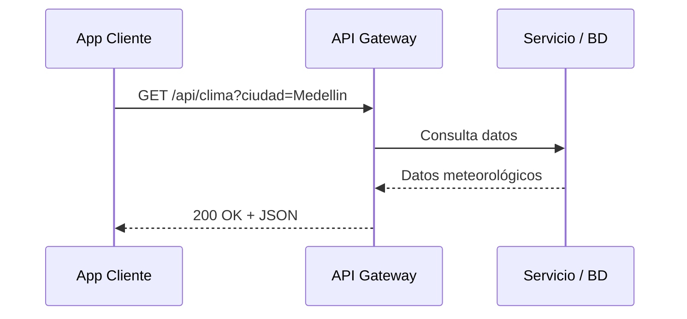
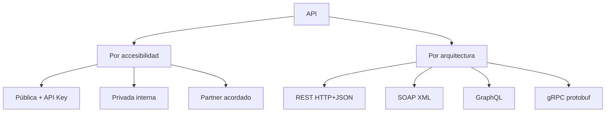

## Objetivos medibles

Al finalizar la lección el estudiante podrá:

1. Definir **API** (Application Programming Interface) como contrato de comunicación entre aplicaciones que oculta la implementación interna.
2. Clasificar APIs por **accesibilidad** (pública, privada, partner) y por **arquitectura** (REST, SOAP, GraphQL, gRPC), enlazando con la lección de tipos de servicios web.
3. Describir el **flujo cliente → API → fuente de datos** con request HTTP y respuesta JSON.
4. Usar **herramientas** (Postman, curl, Swagger UI, Thunder Client) para probar endpoints y documentar contratos.
5. Aplicar **buenas prácticas de diseño** (URIs con sustantivos, versionado, códigos de estado, paginación, OpenAPI) y detectar anti-patrones comunes.

## Conceptos clave

- **API:** conjunto de definiciones y protocolos que permite que dos aplicaciones se comuniquen. Define operaciones disponibles, cómo solicitarlas y qué esperar como respuesta, sin exponer la implementación interna.
- **Analogía del menú:** el cliente no entra a la cocina (backend); pide al mesero (API) usando el vocabulario del menú (endpoints) y recibe la respuesta preparada.
- **Abstracción:** oculta la implementación interna del servicio.
- **Contrato:** define qué se puede pedir y qué se recibirá (método, URI, headers, cuerpo, códigos de estado).
- **Interoperabilidad:** sistemas distintos (móvil, web, servidor) colaboran mediante el mismo contrato.
- **Flujo básico:** App Cliente → HTTP Request (`GET /api/clima?ciudad=Medellin`) → API Gateway/Servidor → Fuente de datos → HTTP Response (JSON) → App Cliente.
- **API pública (Open API):** accesible para cualquier desarrollador, generalmente con API key. Ejemplos: OpenWeatherMap, Google Maps, Stripe.
- **API privada (interna):** solo dentro de la organización; conecta microservicios o sistemas internos; no expuesta al público.
- **API de partner:** acceso restringido a socios comerciales mediante acuerdos (ej. APIs de pago entre plataformas).
- **Por arquitectura:** REST (HTTP + JSON, la más común), SOAP (XML estricto, financiero), GraphQL (cliente define forma de respuesta), gRPC (alto rendimiento, Protocol Buffers).
- **Herramientas GUI:** Postman, Insomnia, Swagger UI, Thunder Client (VS Code), Hoppscotch — diseñar, testear y documentar APIs.
- **Herramientas CLI:** curl, HTTPie — pruebas rápidas, scripting, CI/CD.
- **Librerías de testing:** REST Assured (Java) para tests de integración automatizados.
- **Buenas prácticas:** sustantivos en URIs (`/productos`, no `/obtenerProductos`), versionado (`/api/v1/`), HTTPS en producción, códigos de estado correctos, errores JSON descriptivos, paginación (`?page=1&limit=20`), documentación OpenAPI/Swagger, rate limiting, autenticación con JWT u OAuth 2.0.
- **Anti-patrones:** verbos en URI (`GET /eliminarProducto/42`), siempre 200 con error en cuerpo, exponer datos sensibles internos, no versionar y romper clientes.

## Errores comunes

- **Confundir API con el backend completo:** la API es el contrato expuesto; el backend incluye lógica, base de datos y procesos que la API no revela.
- **Usar verbos en los endpoints:** `GET /obtenerUsuarios` viola convención REST; usar `GET /api/v1/usuarios`.
- **No versionar desde el inicio:** cambios breaking en `/api/productos` rompen todos los clientes; usar `/api/v1/productos`.
- **Probar solo en Postman y no en CI:** curl o REST Assured en pipeline detectan regresiones antes de producción.
- **Documentar después del desarrollo:** OpenAPI desactualizado genera integraciones incorrectas; documentar desde el día uno.
- **Exponer API privada sin autenticación:** microservicios internos también deben validar identidad y permisos.
- **Ignorar rate limiting en APIs públicas:** sin cuotas, un cliente abusivo puede tumbar el servicio para todos.
- **Enviar credenciales de usuario en cada request:** usar tokens (JWT/OAuth) en lugar de usuario/contraseña repetidos.

## Casos reales

### 1. Startup fintech: API pública sin versionado rompe integraciones

Una fintech expone `POST /api/pagos` sin prefijo de versión. Seis meses después cambia el campo `monto` de entero a objeto `{ "valor": 100, "moneda": "COP" }`. Tres partners de pago dejan de procesar transacciones porque sus clientes siguen enviando el formato antiguo.

**Decisión clave:** versionar desde el lanzamiento (`/api/v1/pagos`); publicar cambios breaking en `/api/v2/` con periodo de deprecación; documentar en OpenAPI y notificar por changelog. Los partners migran sin downtime forzado.

### 2. E-commerce: API interna expuesta por error al público

Un equipo despliega el API Gateway de microservicios de inventario con reglas de firewall incorrectas. Un scraper descubre `GET /internal/stock` sin autenticación y extrae niveles de inventario y precios mayoristas.

**Decisión clave:** clasificar APIs como pública, partner o privada; las internas solo en red privada o con mTLS; nunca exponer endpoints `/internal/` sin auth; auditar con herramientas como curl desde internet y escaneo de puertos.

## Ejemplos de código sugeridos

### Flujo de consulta a API pública

<!-- code: http -->
```http
GET /api/clima?ciudad=Medellin HTTP/1.1
Host: api.ejemplo.com
Accept: application/json
X-API-Key: sk_live_abc123XYZ
```

<!-- code: json -->
```json
{
  "ciudad": "Medellin",
  "temperatura": 24,
  "unidad": "C",
  "condicion": "Parcialmente nublado"
}
```

### Pruebas con curl

<!-- code: bash -->
```bash
# GET básico
curl https://api.ejemplo.com/productos

# GET con header de autenticación
curl -H "Authorization: Bearer TOKEN" \
     https://api.ejemplo.com/usuarios/me

# POST con body JSON
curl -X POST https://api.ejemplo.com/productos \
     -H "Content-Type: application/json" \
     -d '{"nombre": "Teclado", "precio": 150000}'

# PATCH
curl -X PATCH https://api.ejemplo.com/productos/42 \
     -H "Content-Type: application/json" \
     -d '{"precio": 130000}'

# DELETE
curl -X DELETE https://api.ejemplo.com/productos/42

# Ver headers de respuesta
curl -I https://api.ejemplo.com/productos
```

### Respuesta de error bien diseñada

<!-- code: json -->
```json
{
  "error": "VALIDATION_ERROR",
  "mensaje": "El precio debe ser mayor a 0.",
  "campos": {
    "precio": "Valor inválido: -500"
  },
  "documentacion": "https://api.ejemplo.com/docs/v1/productos"
}
```

### Consumo desde JavaScript (fetch)

<!-- code: javascript -->
```javascript
async function listarProductos(page = 1, limit = 20) {
  const res = await fetch(
    `https://api.ejemplo.com/api/v1/productos?page=${page}&limit=${limit}`,
    { headers: { Accept: "application/json" } }
  );
  if (!res.ok) throw new Error(`HTTP ${res.status}`);
  return res.json();
}
```

## Ejercicios de práctica

- **tipo:** reflexion — Explica la analogía del menú de restaurante aplicada a una API de clima. ¿Quién es el cliente, el mesero, la cocina y el menú en `GET /api/clima?ciudad=Bogota`?
- **tipo:** completar-codigo — Completa las buenas prácticas: "Listar usuarios → ___ `/api/v1/usuarios`"; "Crear producto → ___ `/api/v1/productos`"; "Nunca usar → ___ `/eliminarProducto/42`".
- **tipo:** ordenar-pasos — Ordena el flujo de prueba de un endpoint nuevo: (a) documentar en OpenAPI, (b) probar con curl, (c) crear colección en Postman, (d) definir URI y método HTTP, (e) agregar test automatizado en CI.

## Animación o visual sugerida

- **StepReveal — flujo API:** Cliente → Request HTTP → Gateway → Servicio → Response JSON.
- **CompareTable — tipos por accesibilidad:** Pública | Privada | Partner (quién accede, ejemplos, riesgo).
- **CompareTable — herramientas:** Postman | curl | Swagger UI | Thunder Client (tipo GUI/CLI, caso de uso).
- **TabbedCodeExample — curl:** tabs GET, POST con auth, PATCH, DELETE.

## Diagrama Mermaid (si aplica)

### Flujo cliente–API–datos



### Clasificación de APIs



## Secciones TSX sugeridas

- `ObjetivosSection` — 5 objetivos medibles
- `QueEsApiSection` — definición, analogía menú, propiedades (abstracción, contrato, interoperabilidad)
- `TiposApiSection` — tarjetas accesibilidad + arquitectura con enlace a tipos-servicios-web
- `HerramientasApiSection` — grid Postman, curl, Swagger, Thunder Client + ejemplos curl
- `DisenoApiSection` — buenas prácticas vs anti-patrones
- `CompruebaTuComprensionSection` — quiz integrado

## Reto integrador

**"Diseña y documenta una API de biblioteca universitaria"**

Un frontend web y una app móvil compartirán la misma API para consultar libros, reservar ejemplares y ver préstamos activos.

1. Clasifica la API (pública, privada o partner) y justifica.
2. Define al menos 5 endpoints con método HTTP, URI versionada y descripción breve (listar libros, buscar por ISBN, crear reserva, ver préstamos del usuario, devolver libro).
3. Escribe un ejemplo de request y response JSON para búsqueda y para error de libro no encontrado (con código HTTP correcto).
4. Indica qué herramienta usarías para probar manualmente y cuál para automatizar en CI.
5. Lista dos anti-patrones que evitarías y la buena práctica equivalente.

**Criterio de éxito:** URIs con sustantivos y versión, códigos HTTP semánticos, paginación en listados, mención de autenticación y rate limiting, herramientas adecuadas por contexto.

## Preguntas sugeridas para quiz (5)

1. **¿Qué propiedad de una API oculta cómo funciona internamente el servidor?**
   - A) Interoperabilidad
   - B) Abstracción
   - C) Versionado
   - D) Paginación
   - **Correcta:** B
   - **Feedback:** La abstracción permite usar la API sin conocer la implementación interna (base de datos, lenguaje, etc.).

2. **¿Cuál es la convención correcta para listar productos en una API REST?**
   - A) `GET /obtenerProductos`
   - B) `POST /api/v1/listar-productos`
   - C) `GET /api/v1/productos`
   - D) `GET /api/v1/productos/eliminar`
   - **Correcta:** C
   - **Feedback:** URIs con sustantivos en plural, método GET para lectura, versionado en la ruta.

3. **¿Qué tipo de API usa típicamente OpenWeatherMap o Stripe?**
   - A) API privada interna
   - B) API pública con API key
   - C) API de partner exclusiva
   - D) Solo SOAP
   - **Correcta:** B
   - **Feedback:** APIs públicas son accesibles a desarrolladores externos, generalmente con registro y API key.

4. **¿Qué herramienta CLI es estándar para probar endpoints desde terminal o scripts?**
   - A) Swagger UI
   - B) Thunder Client
   - C) curl
   - D) Hoppscotch
   - **Correcta:** C
   - **Feedback:** curl es CLI multiplataforma ideal para pruebas rápidas y CI/CD; las demás son principalmente GUI.

5. **Un endpoint devuelve HTTP 200 con `{ "error": true, "mensaje": "No encontrado" }`. ¿Qué anti-patrón es?**
   - A) No versionar la API
   - B) Usar siempre 200 aunque haya errores
   - C) Exponer contraseñas hasheadas
   - D) Omitir paginación
   - **Correcta:** B
   - **Feedback:** El código de estado debe reflejar el resultado real (404 para no encontrado, 422 para validación, etc.).

## Referencias

- Fuente docente: `kb/education/sources/clases/programacion-orientada-sitios-web/apis.md`
- Prerrequisitos: `tipos-servicios-web`
- Lecciones relacionadas: `http-metodos-status`, `tokens`, `rest-principios`
- MDN — Introducción a las APIs web: https://developer.mozilla.org/es/docs/Learn/JavaScript/Client-side_web_APIs/Introduction
- OpenAPI Specification: https://swagger.io/specification/
- Postman Learning Center: https://learning.postman.com/
