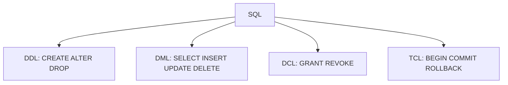
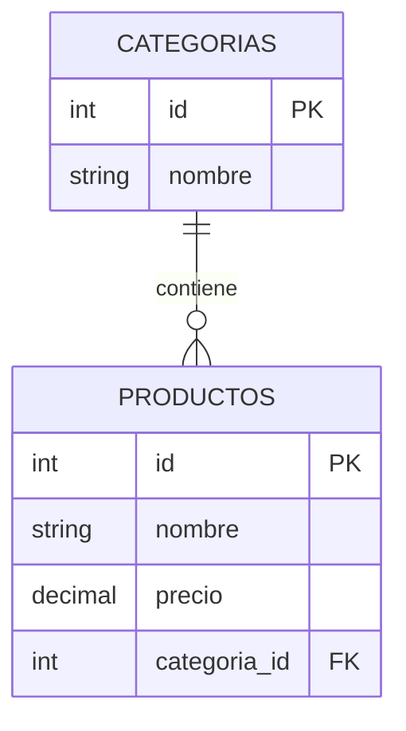

## Objetivos medibles

Al finalizar la lección el estudiante podrá:

1. Clasificar comandos SQL en **DDL, DML, DCL y TCL** y asignar cada operación a su familia.
2. Escribir consultas **DML** con `SELECT`, filtros, `JOIN`, agregaciones y transacciones **ACID** (`BEGIN`/`COMMIT`/`ROLLBACK`).
3. Diseñar tablas con **claves primarias, foráneas y restricciones** que garanticen integridad referencial.
4. Comparar **SQL vs NoSQL** y elegir motor según estructura, consistencia y patrón de escala.
5. Distinguir bases **relacionales fila a fila, columnares y de grafos** y nombrar un caso de uso para cada una.

## Conceptos clave

- **SQL (Structured Query Language):** lenguaje estándar para bases relacionales; cuatro sub-lenguajes por tipo de operación.
- **DDL (Data Definition Language):** define estructura — `CREATE`, `ALTER`, `DROP`, `TRUNCATE`.
- **DML (Data Manipulation Language):** manipula datos — `SELECT`, `INSERT`, `UPDATE`, `DELETE`.
- **DCL (Data Control Language):** permisos — `GRANT`, `REVOKE`.
- **TCL (Transaction Control Language):** transacciones — `BEGIN`, `COMMIT`, `ROLLBACK`, `SAVEPOINT`.
- **ACID:** Atomicidad, Consistencia, Aislamiento, Durabilidad; garantías de transacciones en SQL relacional.
- **Primary Key (PK):** identifica fila única; no NULL ni duplicada.
- **Foreign Key (FK):** referencia PK de otra tabla; integridad referencial.
- **Unique Key:** valores no repetidos (NULL permitido según motor).
- **Composite Key:** PK de varias columnas (ej. `usuario_id + producto_id`).
- **Surrogate vs Natural Key:** artificial (`SERIAL`, UUID) vs significado de negocio (ISBN, NIT).
- **SQL relacional:** tablas, esquema rígido, JOINs, escala vertical; PostgreSQL, MySQL, SQLite.
- **NoSQL:** documentos, clave-valor, columnar, grafos; esquema flexible, escala horizontal; consistencia variable.
- **Regla práctica:** relaciones complejas + transacciones fuertes → SQL; datos variables, escala masiva, tiempo real → NoSQL. Proyectos reales suelen combinar ambos.
- **Bases columnares:** almacenan por columna; ideales para OLAP (`AVG(precio)` sobre millones de filas). BigQuery, ClickHouse, Cassandra.
- **Bases de grafos:** nodos y aristas; recomendaciones, fraude, rutas. Neo4j, Cypher.
- **OLTP vs OLAP:** transacciones operativas (filas) vs analítica (agregaciones masivas).

## Errores comunes

- **Usar `DELETE` sin `WHERE`:** borra toda la tabla; preferir transacción y backup o `TRUNCATE` consciente.
- **Omitir `COMMIT`:** cambios pendientes que otros no ven o se revierten al cerrar sesión.
- **FK sin índice en columna referenciada:** JOINs y validaciones lentas en tablas grandes.
- **Elegir NoSQL solo por moda:** perder JOINs y ACID cuando el dominio es altamente relacional (pedidos, facturación).
- **Confundir `TRUNCATE` con `DELETE`:** `TRUNCATE` vacía rápido y reinicia identidad; no dispara triggers en algunos motores.
- **PK natural inestable:** usar email como PK y romper referencias al cambiar email; mejor surrogate key.
- **Overselling grafos:** usar Neo4j para CRUD tabular simple que PostgreSQL resuelve mejor.
- **Mezclar lógica de negocio crítica sin transacción:** transferencia que debita pero no acredita por error a mitad.

## Casos reales

### 1. Fintech: transferencia sin transacción

Un servicio ejecuta dos `UPDATE` de saldo en cuentas separadas sin `BEGIN/COMMIT`. Tras el primer `UPDATE` hay un timeout de red; el segundo nunca corre. Cliente pierde dinero; auditoría muestra estados inconsistentes.

**Decisión clave:** envolver en transacción TCL; `ROLLBACK` ante cualquier fallo; constraint `CHECK (saldo >= 0)`; usuario de app con permisos DCL mínimos (sin `DROP`).

### 2. E-commerce: PostgreSQL + Redis + MongoDB

Catálogo relacional en PostgreSQL; sesiones y carrito en Redis; logs de clics en MongoDB por esquema variable. El equipo intenta meter logs en tablas SQL rígidas y las migraciones bloquean releases semanales.

**Decisión clave:** SQL para pedidos y stock (ACID); Redis para caché; MongoDB para eventos. Cada motor según forma de datos y consistencia requerida.

## Ejemplos de código sugeridos

### DDL — crear y modificar tablas

<!-- code: sql -->
```sql
CREATE TABLE categorias (
  id    SERIAL PRIMARY KEY,
  nombre VARCHAR(100) NOT NULL UNIQUE
);

CREATE TABLE productos (
  id           SERIAL PRIMARY KEY,
  nombre       VARCHAR(200) NOT NULL,
  precio       DECIMAL(12, 2) NOT NULL CHECK (precio > 0),
  stock        INTEGER DEFAULT 0,
  categoria_id INTEGER REFERENCES categorias(id),
  creado_en    TIMESTAMP DEFAULT NOW()
);

ALTER TABLE productos ADD COLUMN descripcion TEXT;
DROP TABLE IF EXISTS productos CASCADE;
```

### DML — insertar, consultar, actualizar

<!-- code: sql -->
```sql
INSERT INTO productos (nombre, precio, stock, categoria_id)
VALUES ('Laptop Pro 15', 4500000.00, 10, 1);

SELECT p.id, p.nombre, p.precio, c.nombre AS categoria
FROM productos p
INNER JOIN categorias c ON p.categoria_id = c.id
WHERE p.precio BETWEEN 100000 AND 1000000
  AND p.stock > 0
ORDER BY p.precio ASC
LIMIT 10;

UPDATE productos
SET precio = precio * 0.9, stock = stock - 1
WHERE id = 42;

DELETE FROM productos WHERE stock = 0;
```

### Agregaciones con GROUP BY

<!-- code: sql -->
```sql
SELECT
  c.nombre AS categoria,
  COUNT(p.id) AS total_productos,
  AVG(p.precio) AS precio_promedio
FROM productos p
JOIN categorias c ON p.categoria_id = c.id
GROUP BY c.nombre
HAVING COUNT(p.id) > 5
ORDER BY precio_promedio DESC;
```

### DCL y TCL — permisos y transacción

<!-- code: sql -->
```sql
GRANT SELECT, INSERT, UPDATE ON productos TO usuario_app;
REVOKE DELETE ON productos FROM usuario_app;

BEGIN;
UPDATE cuentas SET saldo = saldo - 500000 WHERE id = 1;
UPDATE cuentas SET saldo = saldo + 500000 WHERE id = 2;
COMMIT;
-- ROLLBACK; si algo falla
```

### Consulta desde cliente JavaScript (API como capa)

<!-- code: javascript -->
```javascript
// El frontend NO debe conectar directo a la BD en producción
async function listarProductos() {
  const res = await fetch("/api/productos?stock_gt=0");
  if (!res.ok) throw new Error("Error al consultar productos");
  return res.json();
}
```

### Grafo en Cypher (Neo4j) — recomendaciones

<!-- code: sql -->
```cypher
CREATE (ana:Persona {nombre: "Ana"})
CREATE (luis:Persona {nombre: "Luis"})
CREATE (laptop:Producto {nombre: "Laptop Pro 15"})
CREATE (ana)-[:CONOCE]->(luis)
CREATE (ana)-[:COMPRO {fecha: "2025-01-15"}]->(laptop)
CREATE (luis)-[:COMPRO]->(laptop)

MATCH (ana:Persona {nombre: "Ana"})-[:CONOCE]->(amigo)-[:COMPRO]->(p)
WHERE (ana)-[:COMPRO]->(p)
RETURN amigo.nombre, p.nombre
```

## Ejercicios de práctica

- **tipo:** reflexion — ¿Por qué una transferencia bancaria necesita TCL y las propiedades ACID? Da un escenario de fallo sin transacción.
- **tipo:** completar-codigo — Completa: `SELECT ___, AVG(precio) FROM productos GROUP BY categoria_id HAVING ___ > 3`
- **tipo:** diagrama — Modela `usuarios`, `pedidos` y `detalle_pedido` indicando PK y FK entre tablas.

## Animación o visual sugerida

- **CompareTable — SQL vs NoSQL:** esquema, escala, JOINs, ACID, ejemplos de motores.
- **StepReveal — familias SQL:** DDL → DML → DCL → TCL con un ejemplo cada una.
- **Diagrama ASCII — row-based vs column-based** para consulta `AVG(precio)`.

## Diagrama Mermaid (si aplica)

### Familias SQL



### ER simplificado e-commerce



## Secciones TSX sugeridas

- `ObjetivosSection` — 5 objetivos medibles
- `SqlFamiliasSection` — DDL/DML/DCL/TCL en tarjetas de color
- `DdlSection` — CREATE/ALTER con `CodeBlock`
- `DmlSection` — SELECT, JOIN, agregaciones
- `DclTclAcidSection` — permisos, transacción, tabla ACID
- `SqlVsNosqlSection` — `CompareTable` + regla de selección
- `ClavesSection` — PK, FK, unique, surrogate vs natural
- `ColumnarGrafosSection` — OLTP/OLAP + ejemplo Cypher
- `CompruebaTuComprensionSection` — quiz integrado

## Reto integrador

**"Diseña el modelo de datos de una tienda online"**

Entidades: `categorias`, `productos`, `usuarios`, `pedidos`, `detalle_pedido` (cantidad, precio unitario).

1. Escribe DDL con PK, FK y al menos un `CHECK` (precio > 0).
2. Inserta datos de ejemplo con DML (mínimo 3 productos, 1 pedido con 2 ítems).
3. Consulta: total vendido por categoría (`JOIN` + `SUM`).
4. Simula compra del último ítem en stock con `BEGIN`/`COMMIT` o `ROLLBACK` si stock < 1.
5. Argumenta qué parte iría en SQL vs Redis vs MongoDB si añades carrito temporal y logs de clics.

**Criterio de éxito:** integridad referencial, transacción de stock coherente, consulta agregada correcta, justificación políglota razonada.

## Preguntas sugeridas para quiz (5)

1. **¿A qué familia SQL pertenece `CREATE TABLE`?**
   - A) DML
   - B) DDL
   - C) DCL
   - D) TCL
   - **Correcta:** B
   - **Feedback:** DDL define y modifica la estructura del esquema.

2. **¿Qué garantiza la Atomicidad (A de ACID)?**
   - A) Que las consultas usen índices
   - B) Que todas las operaciones de la transacción ocurren o ninguna
   - C) Que los datos estén cifrados
   - D) Que solo haya una tabla
   - **Correcta:** B
   - **Feedback:** O se confirma todo con COMMIT o se revierte con ROLLBACK.

3. **¿Qué establece una Foreign Key?**
   - A) Que la columna sea única en toda la BD
   - B) Relación e integridad referencial con la PK de otra tabla
   - C) Que la tabla no pueda borrarse
   - D) Permiso de lectura al usuario
   - **Correcta:** B
   - **Feedback:** La FK apunta a una PK válida en la tabla relacionada.

4. **¿Cuándo suele preferirse NoSQL sobre SQL relacional?**
   - A) Facturación con transacciones estrictas
   - B) Esquema muy variable y escala horizontal masiva
   - C) Reportes con muchos JOINs normalizados
   - D) Siempre; SQL está obsoleto
   - **Correcta:** B
   - **Feedback:** NoSQL brilla en flexibilidad y escala; SQL en relaciones y ACID.

5. **¿Qué tipo de base es más adecuada para `AVG(precio)` sobre millones de filas analíticas?**
   - A) Row-based OLTP (PostgreSQL transaccional)
   - B) Columnar OLAP (BigQuery, ClickHouse)
   - C) Solo archivos JSON en disco
   - D) Base de grafos Neo4j
   - **Correcta:** B
   - **Feedback:** Las columnares leen solo las columnas necesarias; ideales para agregaciones masivas.

## Referencias

- Fuente docente: `kb/education/sources/clases/programacion-orientada-sitios-web/bases-de-datos.md`
- Prerrequisito: `herramientas-desarrollo`
- Siguiente lección: `principios-solid`
- Lecciones relacionadas: `backend`, `cache`, `modelo-cliente-servidor`, `herramientas-desarrollo`
- PostgreSQL docs: https://www.postgresql.org/docs/
- Neo4j Cypher: https://neo4j.com/docs/cypher-manual/
