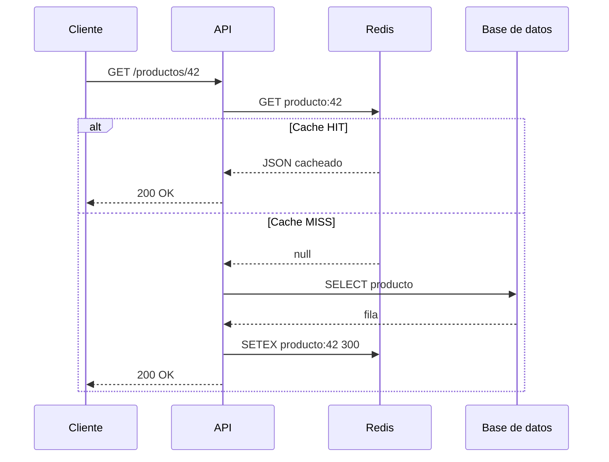
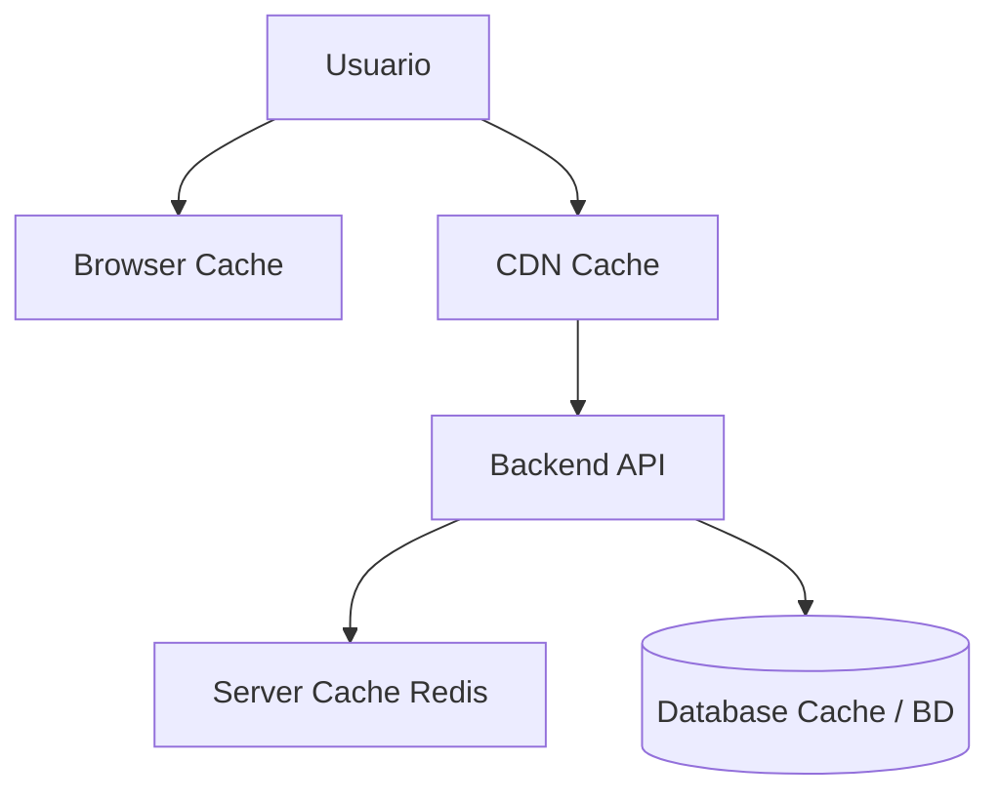

## Objetivos medibles

Al finalizar la lección el estudiante podrá:

1. Definir **caché** como almacenamiento temporal de alta velocidad que reutiliza resultados costosos de computar u obtener.
2. Clasificar los **cuatro tipos** de caché: navegador, servidor, CDN y base de datos; indicar tecnología y caso de uso de cada uno.
3. Calcular e interpretar el **Cache Hit Rate** y relacionar latencia sin caché (100–500 ms) vs con caché Redis (< 1 ms).
4. Configurar **headers HTTP de caché** (`Cache-Control`, `ETag`, `Last-Modified`, `Vary`) y elegir directivas según tipo de dato.
5. Implementar el patrón **cache-aside con Redis** en Node.js y aplicar estrategias de invalidación (TTL, event-based, versioning).

## Conceptos clave

- **Caché:** capa que guarda copias de datos costosos para que solicitudes idénticas futuras se sirvan más rápido. Principio: si ya calculaste o buscaste algo, guarda el resultado y reutilízalo.
- **Analogía de apuntes:** la primera vez lees del libro (lento); después consultas apuntes (rápido). Si el libro se actualiza, los apuntes quedan inválidos (invalidación).
- **Cache Hit Rate:** `(Cache Hits / Total Requests) × 100`. Objetivo en producción: > 90%.
- **Latencia sin caché:** 100–500 ms (consulta DB, red externa).
- **Latencia con caché:** < 1 ms (Redis en memoria).
- **Browser Cache:** almacena assets estáticos (imágenes, CSS, JS, fuentes) en disco local. Controlado por headers HTTP.
- **Server Cache:** el servidor guarda resultados de operaciones costosas (SQL lentas, APIs externas). Tecnologías: **Redis**, Memcached.
- **CDN Cache:** servidores distribuidos globalmente (Cloudflare, CloudFront, Fastly) que cachean contenido cerca del usuario; reduce latencia geográfica.
- **Database Cache:** buffer pool interno (PostgreSQL/MySQL); query caching o vistas materializadas.
- **Redis:** almacén en memoria open-source; strings, hashes, listas, sets, sorted sets, streams; persistencia opcional; estándar de facto en producción.
- **Memcached:** solo strings; más simple; sin persistencia ni replicación; Redis suele ser mejor opción hoy.
- **Service Worker:** intercepta peticiones en el navegador; Cache API para apps offline-first (PWA).
- **Headers HTTP:** `Cache-Control` (directiva principal), `ETag` (versión del recurso), `Last-Modified`, `Expires` (obsoleto), `Vary` (qué headers afectan la caché).
- **Directivas Cache-Control:** `max-age=N`, `no-cache` (revalidar), `no-store` (no cachear), `public` (CDN/proxies), `private` (solo navegador), `must-revalidate`, `immutable` (assets con hash).
- **Qué cachear:** assets estáticos → sí (1 año, immutable); HTML → depende (0–5 min, ETag); API datos estables → sí (5–60 min Redis); datos de usuario → no o TTL corto; tiempo real → no; contraseñas/tokens → NUNCA (`no-store`).
- **Invalidación:** time-based (TTL), event-based (borrar clave al modificar dato), versioning (hash en nombre de asset: `app.a3f9b2.js`).
- **Problema difícil:** "Cache invalidation is one of the two hard problems in Computer Science" — un caché mal invalidado sirve datos incorrectos a usuarios reales.

## Errores comunes

- **Cachear datos sensibles:** tokens, contraseñas o datos personales en CDN o Redis compartido; usar `no-store`.
- **TTL infinito sin estrategia de invalidación:** usuarios ven precios o stock desactualizados tras un cambio en BD.
- **Olvidar invalidar al actualizar:** se modifica un producto en BD pero la clave `producto:42` sigue en Redis.
- **Cachear respuestas personalizadas como públicas:** `Cache-Control: public` en datos del usuario expone información entre usuarios.
- **Confiar solo en TTL para datos críticos:** inventario o saldo bancario necesitan invalidación event-based además de TTL corto.
- **No medir hit rate:** sin métricas no se sabe si el caché aporta valor o solo complejidad.
- **Usar Memcached cuando se necesitan estructuras complejas:** Redis ofrece más tipos de datos y persistencia.

## Casos reales

### 1. E-commerce: Black Friday sin caché tumba la base de datos

Una tienda online sirve el catálogo de 50 000 productos con consulta SQL compleja en cada `GET /productos`. En Black Friday el tráfico x20 satura PostgreSQL; latencia pasa de 200 ms a 8 s; checkout falla.

**Decisión clave:** cache-aside en Redis con TTL 10 min para listados; invalidación event-based al actualizar producto; CDN con `immutable` para assets con hash; objetivo hit rate > 95% en catálogo.

### 2. SaaS de analytics: caché privado mal configurado filtra datos

Un dashboard cachea `GET /api/reportes` con `Cache-Control: public, max-age=3600` en un proxy compartido. Usuario A ve brevemente el reporte de ventas de Usuario B.

**Decisión clave:** `Cache-Control: private, no-store` para datos por usuario; claves Redis con prefijo `reporte:{userId}:`; nunca cachear respuestas autenticadas en CDN pública sin `Vary: Authorization`.

## Ejemplos de código sugeridos

### Cache-aside con Redis (Node.js)

<!-- code: javascript -->
```javascript
const redis = require("redis");
const client = redis.createClient({ url: "redis://localhost:6379" });

async function obtenerProducto(id) {
  const cacheKey = `producto:${id}`;

  const cached = await client.get(cacheKey);
  if (cached) {
    console.log("Cache HIT");
    return JSON.parse(cached);
  }

  console.log("Cache MISS");
  const producto = await db.query(
    "SELECT * FROM productos WHERE id = $1",
    [id]
  );

  await client.setEx(cacheKey, 300, JSON.stringify(producto));
  return producto;
}
```

### Invalidación event-based al actualizar

<!-- code: javascript -->
```javascript
async function actualizarProducto(id, datos) {
  const producto = await db.query(
    "UPDATE productos SET nombre = $1, precio = $2 WHERE id = $3 RETURNING *",
    [datos.nombre, datos.precio, id]
  );
  await client.del(`producto:${id}`);
  await client.del("productos:lista");
  return producto;
}
```

### Respuesta HTTP con caché de asset estático

<!-- code: http -->
```http
HTTP/1.1 200 OK
Content-Type: image/webp
Cache-Control: max-age=31536000, public, immutable
ETag: "v2-a3f9b2c1"
Content-Length: 45820
```

### Respuesta API no cacheable (dato sensible)

<!-- code: http -->
```http
HTTP/1.1 200 OK
Content-Type: application/json
Cache-Control: no-store, no-cache, private
```

### Service Worker básico

<!-- code: javascript -->
```javascript
self.addEventListener("fetch", (event) => {
  event.respondWith(
    caches.match(event.request).then((cached) => {
      return cached || fetch(event.request);
    })
  );
});
```

### Producto en caché (JSON)

<!-- code: json -->
```json
{
  "id": 42,
  "nombre": "Monitor 27\"",
  "precio": 890000,
  "_cached": true,
  "ttl_remaining_sec": 245
}
```

## Ejercicios de práctica

- **tipo:** reflexion — Calcula el Cache Hit Rate si de 10 000 requests, 9 200 fueron HIT y 800 MISS. ¿Cumple el objetivo de > 90%? ¿Qué implica para la carga de la base de datos?
- **tipo:** completar-codigo — Completa las directivas: "Asset con hash en nombre → `Cache-Control: max-age=31536000, public, ___`"; "Token de sesión → `Cache-Control: ___`"; "Catálogo en Redis → TTL ___ segundos (5 min)".
- **tipo:** ordenar-pasos — Ordena el flujo cache-aside: (a) consultar BD, (b) guardar en Redis con TTL, (c) buscar clave en Redis, (d) devolver JSON al cliente, (e) parsear valor si HIT.

## Animación o visual sugerida

- **CompareTable — tipos de caché:** Browser | Server | CDN | DB (dónde vive, qué guarda, tecnología).
- **StepReveal — cache-aside:** Request → Redis GET → HIT/MISS → BD → SET → Response.
- **CompareTable — qué cachear:** tipo de dato, ¿cachear?, TTL, estrategia.

## Diagrama Mermaid (si aplica)

### Flujo cache-aside



### Tipos de caché en la arquitectura



## Secciones TSX sugeridas

- `ObjetivosSection` — 5 objetivos medibles
- `QueEsCacheSection` — definición, analogía apuntes, métricas hit rate y latencia
- `TiposCacheSection` — grid 2×2: Browser, Server, CDN, Database
- `TecnologiasCacheSection` — Redis (código cache-aside), Memcached, Service Worker
- `HeadersCacheSection` — tabla headers y directivas Cache-Control con ejemplos HTTP
- `CuandoCachearSection` — tabla qué cachear + estrategias de invalidación + callout advertencia
- `CompruebaTuComprensionSection` — quiz integrado

## Reto integrador

**"Optimiza el rendimiento de una API de noticias"**

La API `GET /api/v1/articulos` tarda 350 ms (JOIN complejo). Recibe 50 000 requests/hora. El 80% pide los mismos 20 artículos destacados.

1. Identifica qué tipo(s) de caché aplicarías (servidor, CDN, navegador) y por qué.
2. Diseña la clave Redis y el TTL para un artículo individual y para el listado destacado.
3. Escribe pseudocódigo cache-aside para `obtenerArticulo(id)` incluyendo invalidación al publicar o editar.
4. Propón headers HTTP para la imagen de portada (`/assets/img/portada-abc123.webp`) y para `GET /api/v1/usuario/me`.
5. Define cómo medirías el hit rate y qué umbral activaría una revisión de la estrategia.

**Criterio de éxito:** separación clara entre datos públicos cacheables y datos de usuario (`no-store`), TTL justificado, invalidación event-based en escrituras, métricas de hit rate definidas.

## Preguntas sugeridas para quiz (5)

1. **¿Qué mide el Cache Hit Rate?**
   - A) Cuánto pesa el caché en disco
   - B) El porcentaje de requests servidas desde caché sin ir a la fuente original
   - C) La velocidad de Redis en MB/s
   - D) Cuántas claves tiene Memcached
   - **Correcta:** B
   - **Feedback:** Hit Rate = (Hits / Total Requests) × 100. Objetivo típico: > 90%.

2. **¿Qué header HTTP indica que un recurso no debe almacenarse en ningún caché?**
   - A) `Cache-Control: max-age=3600`
   - B) `Cache-Control: public`
   - C) `Cache-Control: no-store`
   - D) `ETag: "abc123"`
   - **Correcta:** C
   - **Feedback:** `no-store` prohíbe almacenar la respuesta; obligatorio para tokens y datos sensibles.

3. **En el patrón cache-aside, ¿qué ocurre en un Cache MISS?**
   - A) Se devuelve error 404 al cliente
   - B) Se consulta la fuente original, se guarda en caché y se devuelve el dato
   - C) Se espera a que expire el TTL
   - D) Se borra toda la base de datos
   - **Correcta:** B
   - **Feedback:** En MISS se obtiene el dato de BD (o API externa), se escribe en Redis con TTL y luego se responde.

4. **¿Qué tecnología es el estándar de facto para caché en servidor en producción?**
   - A) SQLite
   - B) Redis
   - C) FTP
   - D) localStorage del navegador
   - **Correcta:** B
   - **Feedback:** Redis es un almacén en memoria extremadamente rápido (< 1 ms) con estructuras de datos ricas.

5. **Assets estáticos con hash en el nombre (`app.a3f9b2.js`) deberían usar:**
   - A) `Cache-Control: no-store`
   - B) `Cache-Control: max-age=31536000, public, immutable`
   - C) Sin headers de caché
   - D) `Cache-Control: private` solo para CDN
   - **Correcta:** B
   - **Feedback:** El hash en el nombre cambia cuando cambia el contenido; `immutable` permite caché larga sin riesgo de versión vieja.

## Referencias

- Fuente docente: `kb/education/sources/clases/programacion-orientada-sitios-web/cache.md`
- Prerrequisitos: `backend`, `http-headers`
- Lecciones relacionadas: `rest-principios`, `bases-de-datos`, `protocolos-seguridad`
- MDN — HTTP caching: https://developer.mozilla.org/es/docs/Web/HTTP/Caching
- Redis documentation: https://redis.io/docs/
