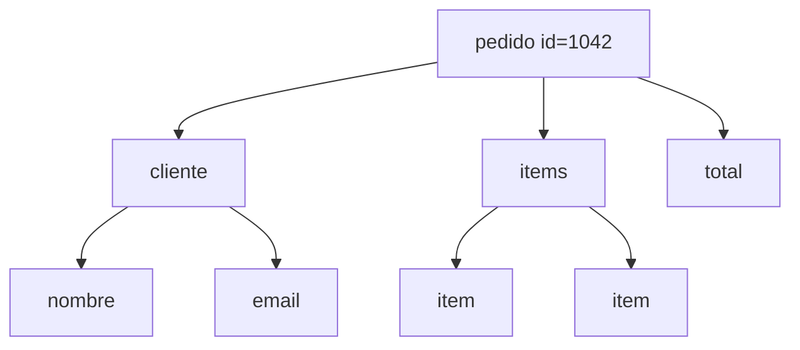
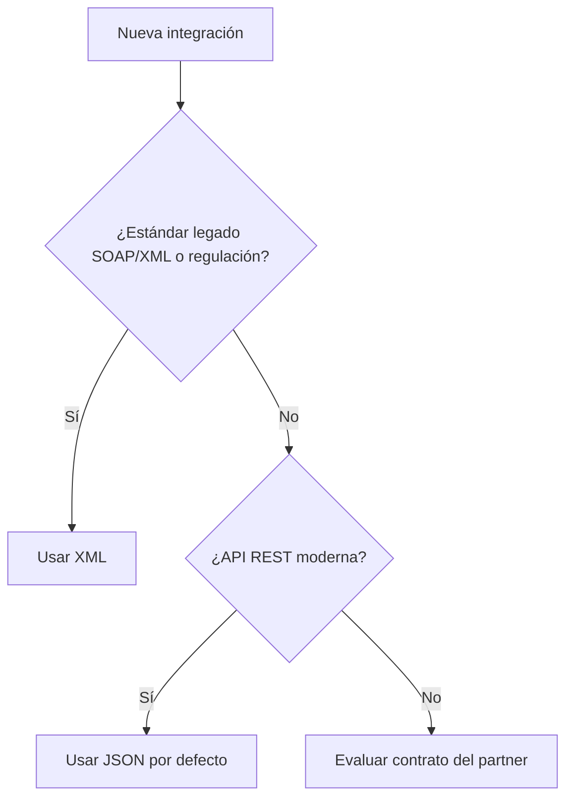

## Objetivos medibles

Al finalizar la lección el estudiante podrá:

1. Definir **XML** y **JSON** como formatos de intercambio de datos y ubicarlos históricamente (W3C 1996 vs formalización JSON ~2001).
2. Leer un documento XML con declaración, elemento raíz, anidación y atributos; y un objeto JSON con tipos nativos (string, number, boolean, null, array, object).
3. Comparar al menos **cinco características** entre XML y JSON (verbosidad, tipos, atributos, comentarios, validación, parsing en JS).
4. Elegir el formato adecuado en un caso dado: API REST nueva (JSON) vs integración SOAP/legado o facturación con estándar XML.
5. Estimar ventaja de tamaño aproximada JSON vs XML para el mismo pedido y parsear JSON con `JSON.parse()` en JavaScript.

## Conceptos clave

- **XML (eXtensible Markup Language):** lenguaje de marcado del W3C (1996) para almacenar y transportar datos legibles por humanos y máquinas. Dominó el intercambio antes de la popularización de JSON.
- **Estructura XML:** declaración (`<?xml version="1.0" encoding="UTF-8"?>`), **un elemento raíz**, elementos anidados jerárquicos y **atributos** en etiquetas de apertura (`<precio moneda="COP">`).
- **Características XML:** autodescriptivo, estrictamente jerárquico (árbol), validable con DTD o XML Schema (XSD), soporta namespaces, verboso (más bytes), ampliamente usado en SOAP, WSDL, configs empresariales (Maven `pom.xml`, Spring).
- **JSON (JavaScript Object Notation):** formato ligero basado en sintaxis de objetos JS, formalizado por Douglas Crockford. Hoy es el **predeterminado** de la mayoría de APIs REST modernas.
- **Características JSON:** sintaxis compacta, tipos nativos (string, number, boolean, null, array, object), parseable con `JSON.parse()` en JS, **sin comentarios** en la especificación estándar, sin atributos ni namespaces, validación opcional con JSON Schema.
- **Comparativa rápida:** XML todo es texto; JSON distingue números y booleanos. XML permite comentarios `<!-- -->`; JSON estándar no. Validación: DTD/XSD vs JSON Schema.
- **Parsing en navegador:** XML con `DOMParser`; JSON con `JSON.parse()` nativo.
- **Regla práctica:** JSON por defecto en nuevas APIs REST; XML si integras SOAP/legado, necesitas metadatos como atributos o el estándar del dominio lo exige (p. ej. facturación electrónica DIAN en Colombia).
- **Casos XML:** SOAP bancario, `pom.xml`, Spring config, OOXML (Word/Excel), RSS/Atom, WSDL.
- **Casos JSON:** APIs REST (GitHub, Stripe), `package.json`, MongoDB, WebSockets, `settings.json` de VS Code.

## Errores comunes

- **Usar XML en APIs REST nuevas sin motivo:** aumenta payload y complejidad de parsing sin beneficio si el ecosistema es moderno.
- **Asumir que JSON admite comentarios:** `//` o `/* */` rompen parsers estrictos; la spec estándar no los permite.
- **Confundir atributos XML con propiedades JSON:** en JSON los metadatos van como campos anidados (`"moneda": "COP"`), no como atributos de etiqueta.
- **Olvidar elemento raíz único en XML:** documentos con múltiples raíces son inválidos.
- **No escapar caracteres especiales en XML:** `<`, `&`, comillas en contenido pueden romper el documento.
- **Enviar JSON mal formado:** comas finales, comillas simples en lugar de dobles, claves sin comillas — errores frecuentes al escribir a mano.
- **Ignorar el estándar del dominio:** forzar JSON donde el partner o la regulación exigen XML (facturación, bancos legacy).
- **Comparar solo legibilidad y no tamaño en red:** en móvil o alta frecuencia, ~30–40% menos bytes en JSON importa.

## Casos reales

### 1. Integración bancaria: el equipo elige JSON para SOAP

Un equipo de pagos implementa un conector contra un core bancario que expone **SOAP con envelopes XML**. Envían cuerpos JSON al endpoint SOAP "porque es más fácil". El banco rechaza todas las transacciones con error de esquema; el proyecto se retrasa dos sprints.

**Decisión clave:** respetar el **contrato del dominio** (XML + WSDL). JSON queda para APIs internas REST; XML para la integración legada.

### 2. Startup SaaS: migrar configs de XML a JSON

Un producto heredó archivos de configuración Spring XML de 2010. Los desarrolladores nuevos tardan horas en entender beans anidados. Al migrar configs de runtime a JSON (`appsettings.json` / `package.json` style), el onboarding baja y los pipelines CI validan con JSON Schema.

**Decisión clave:** JSON para herramientas y stacks modernos; reservar XML donde el ecosistema o estándar lo requiera.

## Ejemplos de código sugeridos

### Pedido equivalente en XML

<!-- code: xml -->
```xml
<?xml version="1.0" encoding="UTF-8"?>
<pedido id="1042">
  <cliente>
    <nombre>Ana García</nombre>
    <email>ana@ejemplo.com</email>
  </cliente>
  <items>
    <item>
      <producto>Laptop Pro 15</producto>
      <cantidad>1</cantidad>
      <precio moneda="COP">4500000</precio>
    </item>
    <item>
      <producto>Mouse inalámbrico</producto>
      <cantidad>2</cantidad>
      <precio moneda="COP">85000</precio>
    </item>
  </items>
  <total moneda="COP">4670000</total>
</pedido>
```

### Mismo pedido en JSON

<!-- code: json -->
```json
{
  "pedido": {
    "id": 1042,
    "cliente": {
      "nombre": "Ana García",
      "email": "ana@ejemplo.com"
    },
    "items": [
      {
        "producto": "Laptop Pro 15",
        "cantidad": 1,
        "precio": { "valor": 4500000, "moneda": "COP" }
      },
      {
        "producto": "Mouse inalámbrico",
        "cantidad": 2,
        "precio": { "valor": 85000, "moneda": "COP" }
      }
    ],
    "total": { "valor": 4670000, "moneda": "COP" }
  }
}
```

### Parsear JSON en JavaScript

<!-- code: javascript -->
```javascript
const raw = '{"id":1042,"activo":true,"items":[]}';
const pedido = JSON.parse(raw);
console.log(pedido.id);      // 1042
console.log(pedido.activo);  // true (boolean, no string)
```

### Parsear XML en el navegador

<!-- code: javascript -->
```javascript
const xml = `<?xml version="1.0"?><pedido id="1042"><total>4670000</total></pedido>`;
const doc = new DOMParser().parseFromString(xml, "application/xml");
console.log(doc.documentElement.getAttribute("id")); // "1042"
console.log(doc.querySelector("total").textContent); // "4670000"
```

### JSON inválido (anti-ejemplo)

<!-- code: json -->
```json
{
  "id": 1042,
  "nota": // esto rompe JSON.parse en la spec estándar
}
```

## Ejercicios de práctica

- **tipo:** reflexion — ¿Por qué el mismo pedido ocupa ~520 bytes en XML y ~320 en JSON en el ejemplo de clase? Menciona al menos dos causas (etiquetas de cierre, atributos vs objetos).
- **tipo:** reflexion — Tu API nueva expone catálogo de productos para app móvil y web. ¿XML o JSON? Justifica con interoperabilidad y tamaño.
- **tipo:** codigo — Usa `JSON.parse()` sobre un string con `id` numérico y `activo` booleano; imprime los tipos con `typeof`.
- **tipo:** codigo — Parsea un XML mínimo con `DOMParser` y lee un atributo del elemento raíz.
- **tipo:** diagrama — Dibuja el árbol jerárquico del XML de pedido (raíz `pedido` → `cliente`, `items` → `item`…).
- **tipo:** ordenar-pasos — Ordena partes de documento XML válido: (a) elemento raíz, (b) declaración `<?xml?>`, (c) elementos hijos anidados, (d) atributos en apertura.
- **tipo:** completar-codigo — Completa: "JSON soporta tipos nativos como ___, ___, ___ y ___." → string, number, boolean, null (también array/object).
- **tipo:** reflexion — Nombra dos casos de uso reales donde XML sigue siendo la opción correcta aunque JSON sea más popular.

## Animación o visual sugerida

- **CompareTable — XML vs JSON:** creado en, tipos, atributos, comentarios, validación, uso principal, parsing JS.
- **MermaidDiagram — árbol XML:** nodos `pedido` → `cliente` / `items` / `total`.
- **StepReveal — regla práctica:** cuándo JSON por defecto vs cuándo XML obligatorio.
- **Contador visual:** bytes XML vs JSON del mismo pedido (~38% más compacto JSON).

## Diagrama Mermaid (si aplica)

### Árbol XML del pedido



### Decisión de formato



## Secciones TSX sugeridas

- `ObjetivosSection` — 5 objetivos medibles
- `XmlSection` — definición, características, ejemplo pedido, estructura
- `JsonSection` — definición, características, ejemplo pedido, `JSON.parse`
- `ComparativaXmlJsonSection` — tabla CompareTable
- `CasosDeUsoRealesSection` — columnas XML vs JSON
- `CompruebaTuComprensionSection` — quiz

## Reto integrador

**"Elige y modela el formato del contrato"**

Un marketplace colombiano debe:

1. Exponer API REST pública de productos (clientes web y móvil).
2. Integrar facturación electrónica con proveedor que exige XML según estándar DIAN.
3. Publicar feed de novedades para agregadores (RSS/Atom).

**Tareas:**

1. Asigna JSON o XML a cada integración y justifica.
2. Escribe el JSON mínimo de un producto (`id`, `nombre`, `precio`, `moneda`).
3. Escribe un fragmento XML válido del mismo producto con atributo `moneda` en precio.
4. Calcula mentalmente cuál payload sería más grande y por qué.
5. Indica cómo validarías cada formato (JSON Schema vs XSD).

**Criterio de éxito:** decisiones alineadas con regla práctica, ambos ejemplos sintácticamente válidos, justificación de casos legados/regulatorios, mención de herramientas de validación.

## Preguntas sugeridas para quiz (5)

1. **¿Qué elemento es obligatorio en un documento XML bien formado?**
   - A) Múltiples elementos raíz
   - B) Un único elemento raíz
   - C) Comentarios en cada línea
   - D) Namespace obligatorio siempre
   - **Correcta:** B
   - **Feedback:** XML exige exactamente un elemento raíz que contiene el resto de la jerarquía.

2. **¿Cuál afirmación sobre JSON es correcta según la especificación estándar?**
   - A) Admite comentarios con `//`
   - B) Soporta tipos nativos como number y boolean
   - C) Usa atributos en etiquetas
   - D) Reemplazó a HTTP
   - **Correcta:** B
   - **Feedback:** JSON distingue números y booleanos; no admite comentarios ni atributos al estilo XML.

3. **Para una API REST nueva en 2025, la regla práctica recomienda…**
   - A) XML siempre
   - B) JSON por defecto
   - C) Solo CSV
   - D) Sin cuerpo en las respuestas
   - **Correcta:** B
   - **Feedback:** JSON es compacto y nativo en ecosistemas web modernos; XML queda para legado o estándares que lo exijan.

4. **¿Cómo se representa en JSON la moneda que en XML iba como atributo `moneda="COP"`?**
   - A) Como comentario `<!-- COP -->`
   - B) Como campo dentro de un objeto, p. ej. `"moneda": "COP"`
   - C) No se puede representar
   - D) Solo con namespaces
   - **Correcta:** B
   - **Feedback:** JSON no tiene atributos; los metadatos son propiedades del objeto.

5. **¿Qué herramienta nativa del navegador parsea una cadena JSON?**
   - A) `DOMParser`
   - B) `JSON.parse()`
   - C) `XMLHttpRequest` solo
   - D) `document.querySelector`
   - **Correcta:** B
   - **Feedback:** `JSON.parse()` convierte texto JSON a objetos JS; `DOMParser` es para XML/HTML.

## Referencias

- Fuente docente: `kb/education/sources/clases/programacion-orientada-sitios-web/formatos-datos.md`
- TSX migrado: `src/components/teaching/lessons/posw/formatos-datos/`
- Prerrequisito: `servicios-web`
- Lección siguiente: `protocolos-seguridad` (HTTP, HTTPS, TLS)
- Relacionadas: `http-metodos-status`, `tipos-servicios-web`
- MDN — JSON: https://developer.mozilla.org/es/docs/Web/JavaScript/Reference/Global_Objects/JSON
- MDN — DOMParser: https://developer.mozilla.org/es/docs/Web/API/DOMParser
