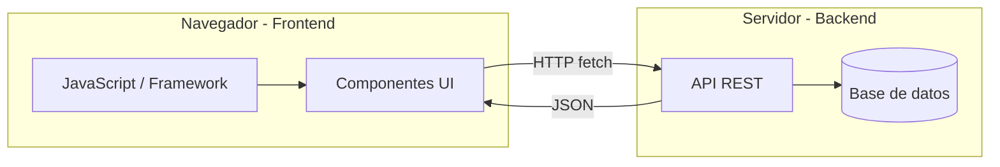
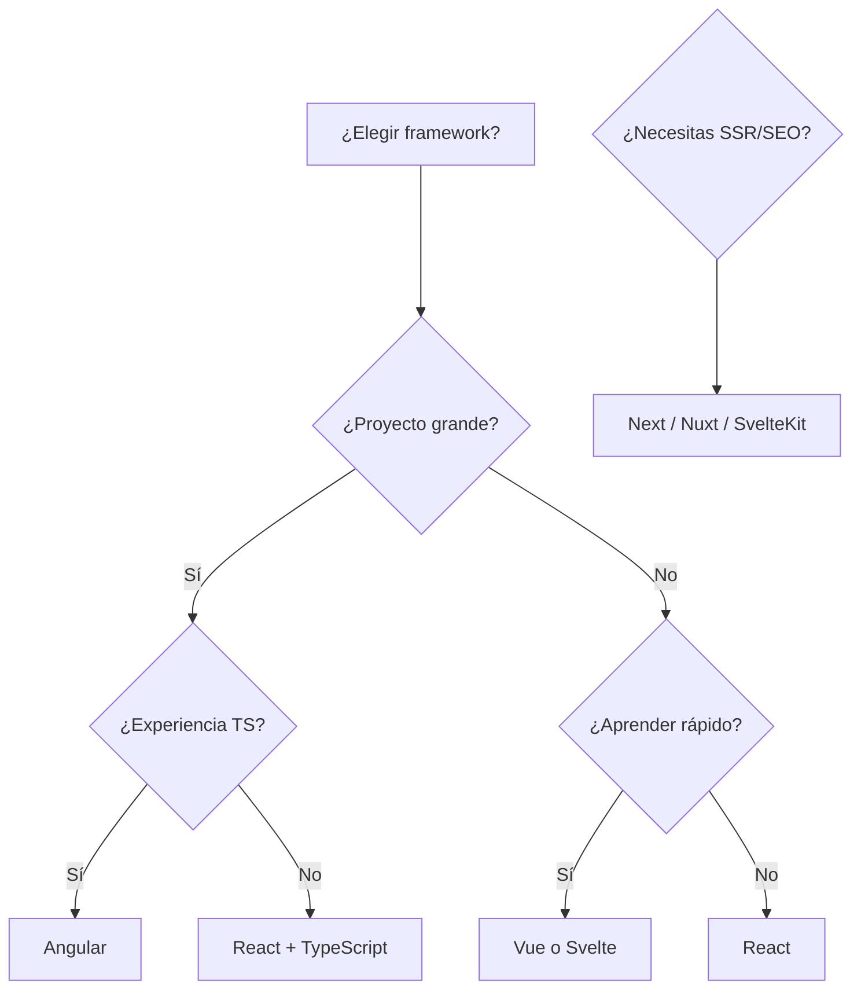

## Objetivos medibles

Al finalizar la lección el estudiante podrá:

1. Definir **frontend (client-side)** como la capa que el usuario ve e interactúa en el navegador, ejecutada en su dispositivo y separada del backend.
2. Enumerar las **responsabilidades del frontend** moderno: renderizar UI, consumir APIs, manejar estado, routing SPA y optimizar UX (rendimiento, accesibilidad, SEO).
3. Comparar **React, Angular, Vue y Svelte** en enfoque (librería vs framework), curva de aprendizaje, ecosistema y casos de uso típicos.
4. Aplicar el **árbol de decisión** para elegir framework según tamaño de equipo, experiencia en TypeScript y necesidad de SSR/SEO.
5. Leer e interpretar un **componente de UI** equivalente en React (JSX), Angular y Vue que consume props y dispara eventos.

## Conceptos clave

- **Frontend (client-side):** capa de la aplicación web que el usuario ve y con la que interactúa en el navegador. El código se ejecuta en el **dispositivo del usuario**, no en el servidor.
- **Separación frontend/backend:** el navegador maneja estructura, estilos e interacción (JS); el servidor maneja base de datos, lógica de negocio y archivos. Se comunican por **HTTP** (APIs).
- **Responsabilidades del frontend:** renderizar interfaz, consumir APIs (`fetch`, axios), manejar estado (formularios, sesión, carrito), gestionar rutas del cliente (SPA routing), optimizar rendimiento, accesibilidad y SEO.
- **JavaScript (ES2020+):** lenguaje del comportamiento en frontend — manipulación del DOM, eventos, fetch de datos, lógica de UI. **TypeScript** añade tipado estático opcional.
- **Motores JS:** V8 (Chrome), SpiderMonkey (Firefox).
- **Componentes:** unidad reutilizable de UI con props (datos entrantes) y eventos (acciones del usuario).
- **React (Meta, 2013):** **librería** para UIs con componentes reutilizables. **JSX** (HTML en JS). Virtual DOM. Mayor demanda laboral. Ecosistema: Next.js, Redux, React Query.
- **Angular (Google, 2016):** **framework** completo con opiniones. TypeScript por defecto. MVC con decoradores, módulos, servicios e inyección de dependencias. Ideal enterprise. Curva alta.
- **Vue.js (Evan You, 2014):** framework **progresivo** (adopción incremental). Plantillas intuitivas. Composition API en Vue 3. Curva baja. Ecosistema: Nuxt.js, Pinia.
- **Svelte (Rich Harris, 2016):** compila componentes a JS puro en build time (sin Virtual DOM runtime). Código conciso. Rendimiento superior en apps pequeñas/medianas. Ecosistema: SvelteKit.
- **Popularidad (referencia Stack Overflow 2024):** React ~40.6%, Angular ~17.1%, Vue ~15.4%, Svelte ~6.5%.
- **Árbol de decisión:** proyecto grande + equipo grande → Angular (si TS/Java) o React+TS; proyecto pequeño + aprender rápido → Vue o Svelte; mayor demanda laboral → React.
- **SSR/SEO:** React → Next.js; Vue → Nuxt.js; Svelte → SvelteKit.
- **Criterios de elección:** demanda laboral, curva de aprendizaje, rendimiento, ecosistema, soporte TypeScript.
- **Consumo de API desde frontend:** `fetch` nativo o librerías (axios); manejar loading, errores HTTP y estado de la respuesta JSON.

## Errores comunes

- **Mezclar responsabilidades:** poner lógica de negocio crítica (cálculo de precios, validación de stock) solo en frontend; el backend debe ser la fuente de verdad.
- **Elegir framework por moda sin criterio:** Angular en equipo junior sin TS puede frenar el proyecto; React en app trivial puede ser overkill.
- **Ignorar estado global desde el inicio:** carrito o sesión repartidos en props profundos; evaluar Context, Pinia, Redux según framework.
- **No manejar estados de carga y error en fetch:** UI congelada o sin feedback cuando la API falla o tarda.
- **SPA sin estrategia SEO:** contenido solo renderizado en cliente invisible para crawlers; usar SSR (Next/Nuxt/SvelteKit) cuando SEO importa.
- **Duplicar lógica en React, Angular y Vue:** en equipos políglotas, definir contrato de API y componentes de diseño compartidos (Figma), no copiar reglas de negocio.
- **Confundir librería con framework:** React necesita decisiones de routing, estado y build; Angular trae todo integrado.
- **Omitir accesibilidad en componentes:** botones sin `alt` en imágenes, sin labels en formularios; impacta usuarios y SEO.

## Casos reales

### 1. Retail: SPA sin SSR pierde posicionamiento en Google

Un e-commerce migra a React SPA puro (create-react-app) sin server-side rendering. Las páginas de producto tardan semanas en indexarse; el tráfico orgánico cae 40% porque los crawlers ven HTML casi vacío.

**Decisión clave:** evaluar SSR desde el árbol de decisión; migrar a **Next.js** (React) para renderizar catálogo en servidor; mantener interactividad en cliente. Medir Core Web Vitals y cobertura de indexación.

### 2. Startup: framework incorrecto para el equipo

Una startup elige **Angular** para un MVP con dos desarrolladores junior sin experiencia en TypeScript. Tres meses después el velocity es bajo, hay deuda en módulos mal estructurados y migrar a React cuesta el doble del presupuesto.

**Decisión clave:** aplicar criterios reales — tamaño de equipo, experiencia previa, plazo. Para MVP rápido con curva baja → **Vue** o **React**; Angular cuando hay equipo enterprise con TS. El framework debe servir al equipo, no al revés.

## Ejemplos de código sugeridos

### Consumir API desde JavaScript

<!-- code: javascript -->
```javascript
async function cargarProductos() {
  const res = await fetch("https://api.ejemplo.com/api/v1/productos");
  if (!res.ok) throw new Error(`Error ${res.status}`);
  const productos = await res.json();
  return productos;
}
```

### Componente React (JSX)

<!-- code: jsx -->
```jsx
function TarjetaProducto({ nombre, precio, imagen }) {
  return (
    <div className="tarjeta">
      
      <h3>{nombre}</h3>
      <p className="precio">${precio.toLocaleString("es-CO")}</p>
      <button onClick={() => agregarAlCarrito(nombre)}>
        Agregar al carrito
      </button>
    </div>
  );
}
```

### Mismo componente en Angular

<!-- code: javascript -->
```typescript
@Component({
  selector: "app-tarjeta-producto",
  template: `
    <div class="tarjeta">
      
      <h3>{{ nombre }}</h3>
      <p class="precio">{{ precio | currency:'COP' }}</p>
      <button (click)="agregarAlCarrito()">Agregar al carrito</button>
    </div>
  `,
})
export class TarjetaProductoComponent {
  @Input() nombre = "";
  @Input() precio = 0;
  @Input() imagen = "";

  agregarAlCarrito() {
    console.log(`Agregando ${this.nombre}`);
  }
}
```

### Mismo componente en Vue 3 (Composition API)

<!-- code: javascript -->
```javascript
// Vue SFC — script setup
const props = defineProps({
  nombre: String,
  precio: Number,
  imagen: String,
});
const formatPrecio = (p) => p.toLocaleString("es-CO");
const agregarAlCarrito = () => console.log(`Agregando ${props.nombre}`);
```

### Request autenticado desde frontend

<!-- code: javascript -->
```javascript
async function obtenerPerfil(token) {
  const res = await fetch("/api/perfil", {
    headers: {
      Authorization: `Bearer ${token}`,
      Accept: "application/json",
    },
  });
  if (res.status === 401) redirectToLogin();
  return res.json();
}
```

## Ejercicios de práctica

- **tipo:** reflexion — Dibuja mentalmente la separación frontend/backend de una app de mensajería. ¿Qué corre en el navegador y qué en el servidor? ¿Cómo se comunican?
- **tipo:** reflexion — Un proyecto necesita SEO fuerte y equipo con experiencia en React. ¿Qué framework base y meta-framework elegirías según el árbol de decisión?
- **tipo:** completar-codigo — Completa: "React usa ___ para mezclar HTML en JS"; "Angular usa ___ por defecto"; "Vue 3 expone lógica reutilizable con ___ API"; "Svelte compila en ___ time sin Virtual DOM runtime".

## Animación o visual sugerida

- **CompareTable — React vs Angular vs Vue vs Svelte:** tipo, curva, ecosistema, mejor para.
- **StepReveal — responsabilidades frontend:** renderizar → consumir API → estado → routing → UX.
- **TabbedCodeExample — TarjetaProducto:** tabs React JSX, Angular template, Vue 3.
- **CompareTable — criterios de elección:** demanda laboral, TypeScript, rendimiento, SSR.

## Diagrama Mermaid (si aplica)

### Frontend y backend



### Árbol de decisión simplificado



## Secciones TSX sugeridas

- `ObjetivosSection` — 5 objetivos medibles
- `QueEsFrontendSection` — definición, diagrama navegador↔servidor, responsabilidades
- `JavaScriptRolSection` — JS en el frontend, fetch, TypeScript, motores
- `FrameworksSection` — grid React, Angular, Vue, Svelte con popularidad
- `ElegirFrameworkSection` — árbol de decisión y tabla de criterios
- `EjemplosComponenteSection` — tabs TarjetaProducto en tres frameworks
- `CompruebaTuComprensionSection` — quiz integrado

## Reto integrador

**"Propón el stack frontend de una app de reservas de coworking"**

Requisitos: web responsive, app móvil futura (misma API), SEO en página de sedes, equipo de 4 devs (2 conocen React, 1 Angular, 1 junior), lanzamiento en 4 meses.

1. Justifica si el frontend es SPA, SSR o híbrido y qué meta-framework usarías.
2. Elige el framework principal aplicando el árbol de decisión y la tabla de criterios.
3. Escribe un componente `TarjetaSede` en el framework elegido: props `nombre`, `ciudad`, `cupos`, evento al reservar.
4. Muestra cómo ese componente consumiría `GET /api/v1/sedes` con manejo de loading y error.
5. Lista dos errores que evitarías (lógica de negocio solo en cliente, SPA sin SEO, framework incompatible con el equipo).

**Criterio de éxito:** decisión fundamentada en criterios reales, componente con props/eventos, fetch con estados, separación clara frontend/backend.

## Preguntas sugeridas para quiz (5)

1. **¿Dónde se ejecuta principalmente el código frontend?**
   - A) En el servidor de base de datos
   - B) En el dispositivo del usuario (navegador)
   - C) En el API Gateway
   - D) En el CDN solamente
   - **Correcta:** B
   - **Feedback:** El frontend (client-side) corre en el navegador del usuario; el backend corre en el servidor.

2. **¿Cuál es una responsabilidad típica del frontend moderno?**
   - A) Persistir datos en PostgreSQL
   - B) Consumir APIs del backend
   - C) Configurar firewalls
   - D) Firmar certificados SSL
   - **Correcta:** B
   - **Feedback:** El frontend renderiza UI y consume APIs; la persistencia y seguridad de infra son backend/DevOps.

3. **¿Qué framework usa JSX y Virtual DOM como enfoque central?**
   - A) Angular
   - B) React
   - C) Django
   - D) Express
   - **Correcta:** B
   - **Feedback:** React es una librería de UI basada en componentes y JSX; Angular usa plantillas TypeScript.

4. **¿Qué meta-framework de React ayuda con SSR y SEO?**
   - A) Redux
   - B) Next.js
   - C) Vite
   - D) Webpack
   - **Correcta:** B
   - **Feedback:** Next.js añade server-side rendering y routing a React; Vue usa Nuxt, Svelte usa SvelteKit.

5. **¿Por qué Svelte suele tener buen rendimiento en apps pequeñas/medianas?**
   - A) Porque no usa JavaScript
   - B) Porque compila a JS puro en build time sin Virtual DOM runtime
   - C) Porque solo funciona en servidor
   - D) Porque reemplaza HTTP por WebSockets
   - **Correcta:** B
   - **Feedback:** Svelte mueve trabajo al compilador; menos overhead en runtime que Virtual DOM tradicional.

## Referencias

- Fuente docente: `kb/education/sources/clases/programacion-orientada-sitios-web/frontend.md`
- Prerrequisitos: `apis`, `servicios-web`
- Lección siguiente: `backend`
- Relacionadas: `modelo-cliente-servidor`, `react`, `angular`, `typescript`
- MDN — JavaScript: https://developer.mozilla.org/es/docs/Web/JavaScript
- React docs: https://react.dev/
- Vue.js guide: https://vuejs.org/guide/introduction.html
- Angular docs: https://angular.dev/
