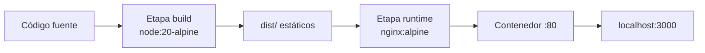
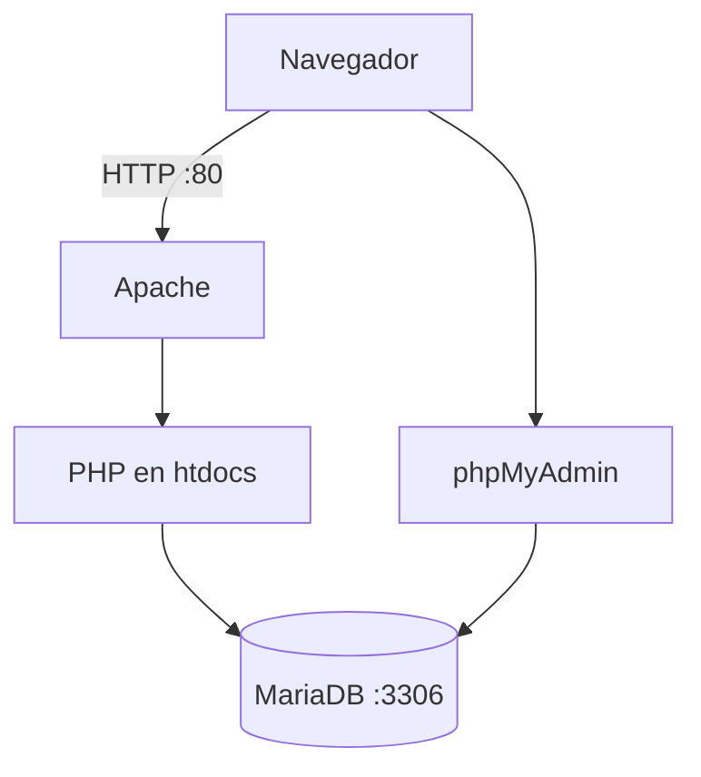

## Objetivos medibles

Al finalizar la lección el estudiante podrá:

1. Describir **XAMPP** (Apache, MariaDB, PHP, phpMyAdmin) y levantar un entorno local con `htdocs` como document root.
2. Explicar conceptos **Docker**: imagen, contenedor, Dockerfile, Compose y registro (Docker Hub).
3. Ejecutar comandos esenciales de Docker (`pull`, `run`, `ps`, `logs`, `build`) y mapear puertos host→contenedor.
4. Comparar **XAMPP vs Docker** en reproducibilidad, portabilidad y aptitud para producción.
5. Empaquetar una app **React + Vite** en imagen multi-etapa (build Node + serve Nginx) y opcionalmente usar Compose para desarrollo.

## Conceptos clave

- **XAMPP:** paquete cross-platform: **X** (cross-platform), **A**pache, **M**ariaDB, **P**HP, **P**erl. Instala stack LAMP/MAMP local en un paso.
- **Apache (en XAMPP):** servidor HTTP; puertos 80/443. Sirve archivos desde `htdocs/`.
- **MariaDB/MySQL:** motor relacional en puerto 3306; datos en `mysql/data/`.
- **PHP:** lenguaje de servidor interpretado por Apache; genera HTML dinámico.
- **phpMyAdmin:** interfaz web en `/phpmyadmin` para administrar la BD sin CLI.
- **Document root:** carpeta que Apache expone (`htdocs/mi-proyecto/index.php`).
- **Docker:** plataforma de contenedores; empaqueta app + dependencias en unidad portable que comparte el kernel del host (más ligero que VM).
- **Imagen (Image):** plantilla de solo lectura; se construye con `Dockerfile` o se descarga de un registry.
- **Contenedor (Container):** instancia en ejecución de una imagen; efímera salvo volúmenes persistentes.
- **Dockerfile:** instrucciones declarativas (`FROM`, `COPY`, `RUN`, `EXPOSE`, `CMD`) para construir imagen.
- **Docker Compose:** orquesta varios contenedores (app + BD + caché) desde `docker-compose.yml`.
- **Mapeo de puertos:** `-p 8080:80` expone puerto 80 del contenedor en 8080 del host.
- **Multi-stage build:** etapa 1 compila assets (Node); etapa 2 sirve estáticos (Nginx). Imagen final más pequeña.
- **`.dockerignore`:** excluye `node_modules`, `dist`, `.git` del contexto de build.
- **VM vs contenedor:** VM virtualiza SO completo (GB, arranque lento); contenedor comparte kernel (MB, arranque rápido).

## Errores comunes

- **Editar archivos fuera de `htdocs` en XAMPP:** Apache no los sirve; cambios "no aparecen" en `localhost`.
- **Olvidar iniciar servicios XAMPP:** `lampp start` pendiente; error de conexión a MySQL o página no carga.
- **Confundir puerto del host con puerto del contenedor:** `docker run -p 3000:80` → navegar a `localhost:3000`, no `:80`.
- **No usar `.dockerignore`:** el build copia `node_modules` gigantes; builds lentos e imágenes hinchadas.
- **Persistir datos en contenedor sin volumen:** al `docker rm` se pierden datos de BD.
- **Usar XAMPP en producción:** pensado para desarrollo local; sin hardening ni escalado industrial.
- **Un solo stage en Dockerfile React:** incluir Node en imagen final cuando solo se necesita Nginx para estáticos.
- **Permisos en Linux XAMPP:** olvidar `chmod +x` o `sudo` en instalador `.run`.

## Casos reales

### 1. Equipo académico: "en mi máquina funciona"

Cuatro estudiantes desarrollan un CRUD PHP con XAMPP. En Windows usan PHP 8.2; en Linux PHP 8.0 con extensiones distintas. En demo grupal, dos laptops muestran errores de `mysqli` y rutas de `include`.

**Decisión clave:** documentar versión PHP y extensiones; para entrega final migrar a `docker-compose.yml` con imagen `php:8.2-apache` y `mariadb:11` fijas. Mismo entorno en todas las máquinas y en CI.

### 2. Startup: deploy manual vs imagen Docker

Un dev sube builds de React por FTP a un hosting compartido. Cada release olvida un `.env` o versión de Node distinta; rollback imposible en minutos.

**Decisión clave:** pipeline `docker build` → registry → servidor con `docker pull` y `docker run`. Rollback = ejecutar tag anterior. Nginx en contenedor sirve `dist/` reproducible.

## Ejemplos de código sugeridos

### Instalar y arrancar XAMPP (Linux)

<!-- code: bash -->
```bash
chmod +x xampp-linux-x64-*.run
sudo ./xampp-linux-x64-*.run
sudo /opt/lampp/lampp start

# Verificar Apache y MariaDB
curl -I http://localhost
```

### Hello World PHP en htdocs

<!-- code: php -->
```php
<?php
// /opt/lampp/htdocs/hola/index.php
$nombre = $_GET['nombre'] ?? 'Mundo';
echo "<h1>Hola, {$nombre}!</h1>";
echo "<p>Servidor: " . $_SERVER['SERVER_SOFTWARE'] . "</p>";
?>
```

URL: `http://localhost/hola/?nombre=Angular`

### Comandos Docker esenciales

<!-- code: bash -->
```bash
docker pull nginx:alpine
docker run -d -p 8080:80 --name mi-nginx nginx:alpine
docker ps
docker logs mi-nginx
docker exec -it mi-nginx sh
docker stop mi-nginx && docker rm mi-nginx
docker build -t mi-app:1.0 .
docker images
```

### Dockerfile multi-etapa React + Nginx

<!-- code: docker -->
```dockerfile
# Etapa 1: Build
FROM node:20-alpine AS build
WORKDIR /app
COPY package*.json ./
RUN npm ci
COPY . .
RUN npm run build

# Etapa 2: Servir con Nginx
FROM nginx:alpine
COPY --from=build /app/dist /usr/share/nginx/html
EXPOSE 80
CMD ["nginx", "-g", "daemon off;"]
```

### Crear proyecto y construir imagen

<!-- code: bash -->
```bash
npm create vite@latest hola-react -- --template react
cd hola-react
docker build -t hola-react:1.0 .
docker run -d -p 3000:80 --name hola-react hola-react:1.0
# Abrir http://localhost:3000
```

### Docker Compose para desarrollo con hot reload

<!-- code: docker -->
```yaml
version: '3.8'
services:
  frontend:
    image: node:20-alpine
    working_dir: /app
    volumes:
      - .:/app
      - /app/node_modules
    ports:
      - "5173:5173"
    command: sh -c "npm install && npm run dev -- --host"
```

Ejecutar: `docker compose up`

## Ejercicios de práctica

- **tipo:** reflexion — ¿Por qué Docker tiene mayor reproducibilidad que XAMPP si ambos corren en tu laptop?
- **tipo:** completar-codigo — Completa: `docker run -d -p ____ :80 --name web nginx:alpine` para acceder en `http://localhost:8080`.
- **tipo:** ordenar-pasos — Ordena build React en Docker: (a) `npm run build`, (b) `COPY package*.json`, (c) `FROM node:20-alpine AS build`, (d) copiar `dist/` a imagen Nginx, (e) `docker build -t app .`.

## Animación o visual sugerida

- **CompareTable — XAMPP vs Docker:** instalación, reproducibilidad, producción, curva de aprendizaje.
- **StepReveal — multi-stage Dockerfile:** Node build → Nginx serve.
- **Diagrama ASCII — VM vs contenedor** (capas App/Libs/OS vs kernel compartido).

## Diagrama Mermaid (si aplica)

### Flujo multi-stage build



### XAMPP stack local



## Secciones TSX sugeridas

- `ObjetivosSection` — 5 objetivos medibles
- `XamppSection` — componentes, puertos, instalación bash, estructura carpetas
- `HelloPhpSection` — ejemplo PHP con `TabbedCodeExample`
- `DockerConceptosSection` — imagen, contenedor, Dockerfile, Compose, VM vs contenedor
- `DockerComandosSection` — bloque bash interactivo
- `ComparativaSection` — `CompareTable` XAMPP vs Docker
- `ReactDockerSection` — Dockerfile multi-etapa + compose dev
- `CompruebaTuComprensionSection` — quiz integrado

## Reto integrador

**"Entorno full-stack local con Docker Compose"**

Necesitas: frontend React (Vite), API PHP o Node, MariaDB, phpMyAdmin opcional.

1. Escribe un `docker-compose.yml` con al menos **2 servicios** (app + BD) y volúmenes para persistir datos.
2. Mapea puertos para acceder al frontend y a la BD desde el host.
3. Explica por qué no copiarías `node_modules` al contexto de build (`.dockerignore`).
4. Compara: ¿levantarías este mismo stack con XAMPP o Docker en un equipo de 5 devs? Justifica reproducibilidad.
5. Indica el comando para ver logs del servicio que falla al arrancar.

**Criterio de éxito:** compose válido, puertos documentados, volumen para BD, justificación XAMPP vs Docker alineada al tamaño del equipo.

## Preguntas sugeridas para quiz (5)

1. **¿Qué significa la "M" en XAMPP?**
   - A) MongoDB
   - B) MariaDB (MySQL)
   - C) Memcached
   - D) Microsoft SQL Server
   - **Correcta:** B
   - **Feedback:** XAMPP incluye MariaDB como motor relacional local.

2. **¿Dónde debe ir `index.php` para que Apache lo sirva por defecto?**
   - A) `/opt/lampp/mysql/data/`
   - B) `/opt/lampp/htdocs/` (document root)
   - C) `/etc/httpd/ssl/`
   - D) Carpeta home del usuario
   - **Correcta:** B
   - **Feedback:** `htdocs` es el document root de Apache en XAMPP.

3. **¿Qué es una imagen Docker?**
   - A) Un contenedor en ejecución
   - B) Una plantilla de solo lectura para crear contenedores
   - C) Una máquina virtual con su propio kernel
   - D) Un archivo `.php` dinámico
   - **Correcta:** B
   - **Feedback:** La imagen es la plantilla; el contenedor es la instancia en ejecución.

4. **¿Qué hace `-p 3000:80` en `docker run`?**
   - A) Limita la RAM a 3000 MB
   - B) Mapea puerto 80 del contenedor al 3000 del host
   - C) Expone solo HTTPS
   - D) Elimina el contenedor al cabo de 3000 s
   - **Correcta:** B
   - **Feedback:** Formato `host:contenedor`; accedes vía `localhost:3000`.

5. **¿Cuándo es más adecuado Docker que XAMPP?**
   - A) Proyecto PHP académico de una sola persona sin DevOps
   - B) Equipo que necesita entorno idéntico en dev, CI y producción
   - C) Instalación rápida sin aprender terminal
   - D) Solo editar WordPress local sin contenedores
   - **Correcta:** B
   - **Feedback:** Docker prioriza reproducibilidad y portabilidad; XAMPP prioriza simplicidad inicial en PHP.

## Referencias

- Fuente docente: `kb/education/sources/clases/programacion-orientada-sitios-web/herramientas-desarrollo.md`
- Prerrequisito: `modelo-cliente-servidor`
- Siguiente lección: `bases-de-datos`
- Lecciones relacionadas: `backend`, `react`, `bases-de-datos`, `frontend`
- XAMPP: https://www.apachefriends.org/
- Docker docs: https://docs.docker.com/
