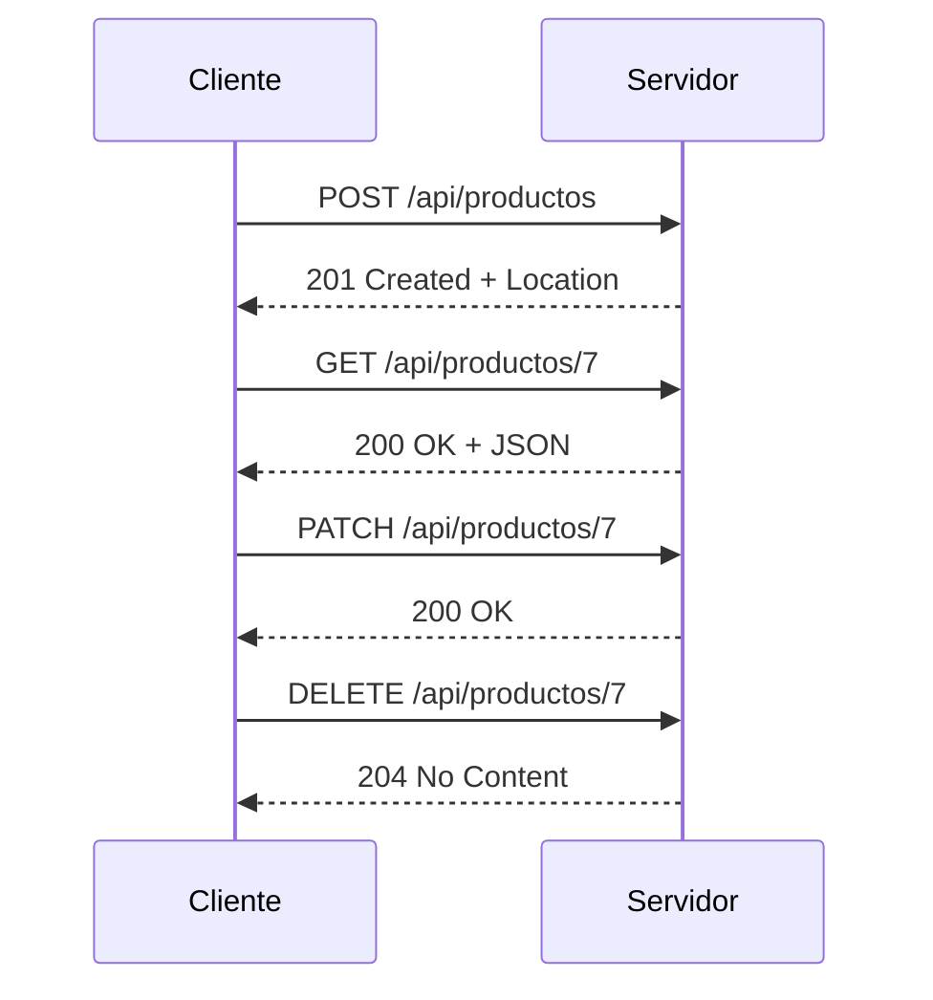
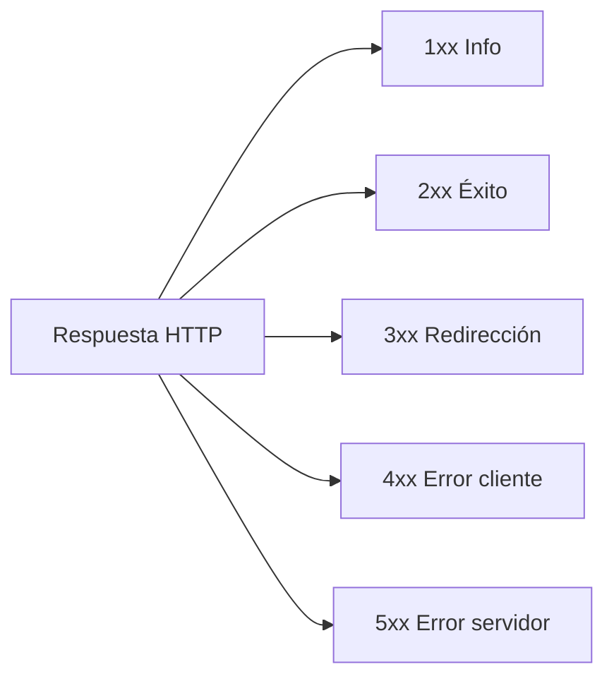

## Objetivos medibles

Al finalizar la lección el estudiante podrá:

1. Definir **métodos HTTP** (verbos) como indicadores de intención del cliente sobre un recurso, citando RFC 9110 y al menos cinco métodos comunes (GET, POST, PUT, PATCH, DELETE).
2. Clasificar métodos según propiedades **Safe** (no modifica estado) e **Idempotente** (múltiples requests idénticos = mismo efecto) y aplicar esa distinción al diseño de APIs.
3. Mapear operaciones **CRUD** a métodos HTTP y URIs de ejemplo (`POST /api/productos`, `GET /api/productos/42`, etc.).
4. Agrupar **códigos de estado** en familias 1xx–5xx y elegir el código adecuado en escenarios concretos (200, 201, 204, 400, 401, 403, 404, 422, 429, 500, 503).
5. Interpretar **respuestas HTTP completas** (línea de estado, headers, cuerpo JSON) y distinguir errores del cliente (4xx) de errores del servidor (5xx).

## Conceptos clave

- **Métodos HTTP (verbos):** indican la **acción** que el cliente quiere realizar sobre un recurso identificado por URI. Semántica definida en RFC 9110.
- **GET:** solicita representación del recurso; **solo lectura**, no modifica estado. Safe: Sí. Idempotente: Sí.
- **POST:** envía datos para **crear** recurso o procesar información; el URI no identifica el nuevo recurso de antemano. Safe: No. Idempotente: No.
- **PUT:** **reemplaza completamente** el recurso en el URI; si no existe, puede crearlo. Safe: No. Idempotente: Sí.
- **PATCH:** **modificación parcial**; solo los campos enviados se actualizan. Safe: No. Idempotente: No (en general).
- **DELETE:** elimina el recurso del URI. Safe: No. Idempotente: Sí.
- **HEAD:** igual que GET sin cuerpo; útil para verificar existencia o headers. Safe: Sí. Idempotente: Sí.
- **OPTIONS:** retorna métodos soportados por el recurso; usado en **preflight CORS**. Safe: Sí. Idempotente: Sí.
- **CONNECT / TRACE:** túnel TCP (proxies HTTPS) y diagnóstico loop-back; raramente habilitados en producción.
- **Safe:** el método no modifica estado en el servidor (GET, HEAD, OPTIONS).
- **Idempotente:** repetir la misma petición tiene el mismo efecto que una sola (GET, PUT, DELETE, HEAD, OPTIONS; POST y PATCH en general no).
- **Mapping CRUD ↔ HTTP:** Create → POST, Read → GET, Update total → PUT, Update parcial → PATCH, Delete → DELETE sobre URIs de recursos.
- **Códigos de estado:** números de **3 dígitos** en la respuesta; el primer dígito indica la familia.
- **1xx Informativos:** 100 Continue, 101 Switching Protocols (upgrade WebSocket).
- **2xx Éxito:** 200 OK, 201 Created (POST exitoso + header `Location`), 204 No Content (DELETE sin cuerpo), 206 Partial Content.
- **3xx Redirecciones:** 301 Moved Permanently (SEO), 302 Found (temporal), 304 Not Modified (caché válida).
- **4xx Errores del cliente:** 400 Bad Request, 401 Unauthorized (falta auth), 403 Forbidden (sin permiso), 404 Not Found, 405 Method Not Allowed, 409 Conflict, 422 Unprocessable Entity (validación semántica), 429 Too Many Requests (rate limit).
- **5xx Errores del servidor:** 500 Internal Server Error, 501 Not Implemented, 502 Bad Gateway, 503 Service Unavailable, 504 Gateway Timeout.
- **Respuesta estructurada:** línea de estado (`HTTP/1.1 201 Created`), headers (`Content-Type`, `Location`), línea en blanco, cuerpo JSON opcional.

## Errores comunes

- **Usar GET para modificar datos:** `GET /api/usuarios/5/eliminar` viola semántica HTTP, se cachea y se re-ejecuta por error; usar DELETE.
- **Confundir 401 con 403:** 401 = no autenticado (falta token); 403 = autenticado pero sin permiso para ese recurso.
- **Devolver siempre 200 con `{ "error": true }`:** oculta el resultado real; el código de estado debe reflejar éxito o fallo (404, 422, etc.).
- **Usar POST para todo:** actualizaciones deberían ser PUT/PATCH; POST solo para crear o acciones no idempotentes.
- **Ignorar idempotencia en reintentos:** reenviar POST duplica recursos; en pagos usar idempotency keys o métodos idempotentes.
- **404 para errores de validación:** si el recurso existe pero los datos son inválidos, usar 400 o 422, no 404.
- **500 para errores previsibles del cliente:** validación fallida no es bug del servidor; reservar 5xx para fallos internos.
- **Omitir header `Location` en 201 Created:** el cliente no sabe dónde quedó el recurso nuevo.
- **Asumir que DELETE siempre devuelve cuerpo:** 204 No Content es la respuesta típica y correcta.

## Casos reales

### 1. E-commerce: doble cobro por reintento de POST

Un cliente móvil con mala conexión envía `POST /api/pagos` dos veces al no recibir respuesta a tiempo. El backend trata cada POST como pago nuevo y cobra dos veces al mismo usuario.

**Decisión clave:** documentar que POST no es idempotente; implementar **clave de idempotencia** (`Idempotency-Key` header) o verificar duplicados; para actualizaciones de estado usar PUT/PATCH idempotentes. Responder 201 con `Location` en el primer éxito y 409 Conflict si el pago ya existe.

### 2. API pública: códigos de estado mal elegidos rompen integraciones

Una API de inventario devuelve `HTTP 200` con `{ "ok": false, "mensaje": "Producto no encontrado" }` en lugar de 404. Los clientes que solo miran el status code muestran stock incorrecto; los monitores de salud no detectan errores.

**Decisión clave:** alinear **semántica HTTP** con contrato de API: 404 cuando el id no existe, 422 para validación de campos, 429 con `Retry-After` en rate limiting. Cuerpo JSON estructurado con `error`, `mensaje` y `campos` en 4xx.

## Ejemplos de código sugeridos

### Ciclo CRUD completo en HTTP

<!-- code: http -->
```http
# Crear
POST /api/productos HTTP/1.1
Host: tienda.ejemplo.com
Content-Type: application/json

{"nombre": "Teclado mecánico", "precio": 320000}

# Leer
GET /api/productos/7 HTTP/1.1
Host: tienda.ejemplo.com
Accept: application/json

# Actualizar parcialmente
PATCH /api/productos/7 HTTP/1.1
Host: tienda.ejemplo.com
Content-Type: application/json

{"precio": 295000}

# Eliminar
DELETE /api/productos/7 HTTP/1.1
Host: tienda.ejemplo.com
```

### Respuesta 201 Created

<!-- code: http -->
```http
HTTP/1.1 201 Created
Content-Type: application/json
Location: /api/usuarios/99

{
  "id": 99,
  "nombre": "Carlos López",
  "email": "carlos@ejemplo.com",
  "creado_en": "2025-09-01T10:30:00Z"
}
```

### Respuesta 404 Not Found

<!-- code: http -->
```http
HTTP/1.1 404 Not Found
Content-Type: application/json

{
  "error": "NOT_FOUND",
  "mensaje": "El producto con id 999 no existe.",
  "timestamp": "2025-09-01T10:31:00Z"
}
```

### Respuesta 422 Unprocessable Entity

<!-- code: json -->
```json
{
  "error": "VALIDATION_ERROR",
  "campos": {
    "email": "El formato del email es inválido.",
    "precio": "El precio debe ser mayor a 0."
  }
}
```

## Ejercicios de práctica

- **tipo:** reflexion — Para cada par, indica si es Safe e Idempotente: GET, POST, PUT, DELETE. Explica por qué POST no es idempotente con un ejemplo de pago.
- **tipo:** completar-codigo — Completa el mapping CRUD: "Listar todos los productos → ___ `/api/productos`"; "Eliminar producto 42 → ___ `/api/productos/42`".
- **tipo:** reflexion — Un cliente recibe 401 en `GET /api/perfil`. ¿Debe reintentar la misma petición sin cambios? ¿Y si recibe 403? Justifica con la diferencia entre ambos códigos.

## Animación o visual sugerida

- **CompareTable — métodos HTTP:** columnas Método | Safe | Idempotente | Uso típico (GET, POST, PUT, PATCH, DELETE).
- **StepReveal — familias de status codes:** revelar 1xx→5xx con color y ejemplos representativos.
- **CompareTable — CRUD ↔ HTTP:** Operación | Método | URI ejemplo.
- **TabbedCodeExample — respuestas HTTP:** tabs 201 Created, 404 Not Found, 422 Unprocessable Entity.

## Diagrama Mermaid (si aplica)

### Flujo CRUD sobre un recurso



### Familias de códigos de estado



## Secciones TSX sugeridas

- `ObjetivosSection` — 5 objetivos medibles
- `MetodosHttpSection` — grid de verbos con Safe/Idempotente
- `CrudMappingSection` — tabla CRUD ↔ HTTP + ciclo CRUD en HTTP
- `CodigosEstadoSection` — acordeones por familia 1xx–5xx
- `EjemplosRespuestaSection` — tabs 201, 404, 422
- `CompruebaTuComprensionSection` — quiz integrado

## Reto integrador

**"Diseña el contrato HTTP de una API de reservas de hotel"**

Un frontend y una app móvil consumen la misma API para consultar habitaciones, crear reservas, modificar fechas y cancelar.

1. Define URIs y métodos HTTP para: listar habitaciones disponibles, obtener una habitación por id, crear reserva, cambiar fecha (parcial), cancelar reserva.
2. Para cada operación indica si el método es Safe e Idempotente y justifica.
3. Escribe la respuesta HTTP completa (status + headers + JSON) para: reserva creada exitosamente, habitación inexistente, fechas inválidas (checkout antes de checkin).
4. Explica qué pasa si el móvil reintenta `POST /api/reservas` tras timeout de red sin protección de idempotencia.
5. Indica qué código usarías si el hotel está en mantenimiento y la API no puede atender temporalmente.

**Criterio de éxito:** mapping CRUD correcto, distingue 401/403/404/422/503, respuestas HTTP bien formadas, menciona idempotencia en POST.

## Preguntas sugeridas para quiz (5)

1. **¿Qué método HTTP es adecuado para obtener datos sin modificar el servidor?**
   - A) POST
   - B) GET
   - C) DELETE
   - D) PATCH
   - **Correcta:** B
   - **Feedback:** GET es Safe e Idempotente; solo solicita representación del recurso.

2. **¿Cuál es la diferencia principal entre PUT y PATCH?**
   - A) PUT es solo para eliminar
   - B) PUT reemplaza el recurso completo; PATCH aplica cambios parciales
   - C) PATCH siempre es Safe
   - D) PUT no puede crear recursos
   - **Correcta:** B
   - **Feedback:** PUT sustituye toda la representación; PATCH actualiza solo los campos enviados.

3. **Un cliente no envió token Bearer. ¿Qué código debe devolver el servidor?**
   - A) 403 Forbidden
   - B) 404 Not Found
   - C) 401 Unauthorized
   - D) 500 Internal Server Error
   - **Correcta:** C
   - **Feedback:** 401 indica que falta autenticación; 403 es cuando ya está autenticado pero sin permiso.

4. **¿Qué código indica que un recurso fue creado exitosamente con POST?**
   - A) 200 OK
   - B) 204 No Content
   - C) 201 Created
   - D) 301 Moved Permanently
   - **Correcta:** C
   - **Feedback:** 201 Created es la respuesta estándar de POST exitoso; suele incluir header Location.

5. **¿Por qué POST generalmente no es idempotente?**
   - A) Porque siempre devuelve 404
   - B) Porque cada petición idéntica puede crear un nuevo recurso o efecto distinto
   - C) Porque no permite JSON
   - D) Porque solo funciona con HTTPS
   - **Correcta:** B
   - **Feedback:** Repetir POST puede duplicar recursos; PUT/DELETE repetidos tienen el mismo efecto final.

## Referencias

- Fuente docente: `kb/education/sources/clases/programacion-orientada-sitios-web/http-metodos-status.md`
- Prerrequisitos: `protocolos-seguridad`
- Lección siguiente: `http-headers`
- Relacionadas: `apis`, `rest-principios`
- RFC 9110 — HTTP Semantics: https://www.rfc-editor.org/rfc/rfc9110
- MDN — Métodos HTTP: https://developer.mozilla.org/es/docs/Web/HTTP/Methods
- MDN — Códigos de estado: https://developer.mozilla.org/es/docs/Web/HTTP/Status
