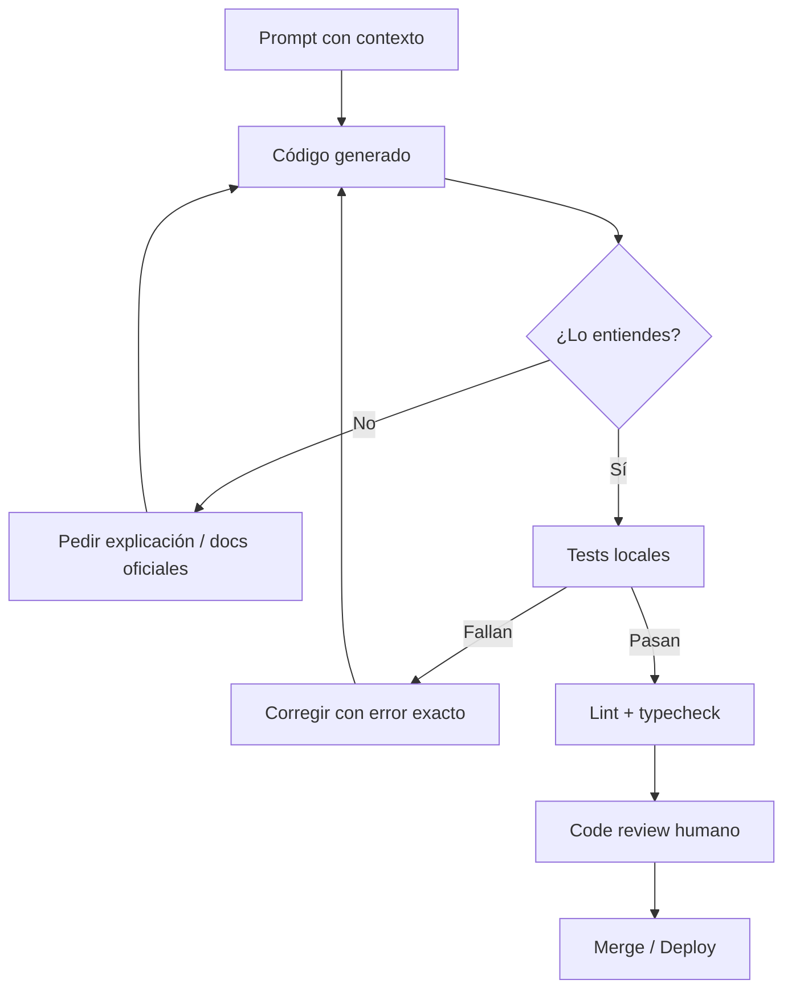
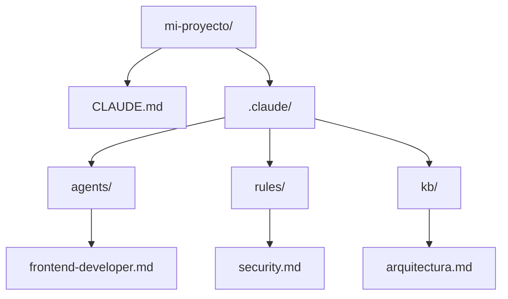

## Objetivos medibles

Al finalizar la lección el estudiante podrá:

1. Enumerar **usos productivos** de IA en desarrollo web (boilerplate, debug, refactor, tests, documentación).
2. Identificar **riesgos** (alucinaciones, código sin comprensión, privacidad, dependencia, desactualización).
3. Aplicar un **flujo de verificación** antes de mergear código generado por IA.
4. Estructurar contexto de proyecto con **`.claude/`**, reglas y `CLAUDE.md` para agentes.
5. Redactar **prompts efectivos** con stack, convenciones y restricciones (ej. DIP, sin `any`).

## Conceptos clave

- **IA generativa en dev:** Copilot, Claude, ChatGPT, Cursor, Gemini — amplifican productividad, no sustituyen criterio técnico.
- **Usos válidos:** CRUD/DTOs, explicar stack traces, traducir entre lenguajes, JSDoc, refactor SOLID, revisión de seguridad, diseño de arquitectura, tests.
- **Alucinaciones:** APIs inventadas, paquetes inexistentes, docs ficticias — todo output requiere verificación.
- **Código sin comprensión:** copiar-pegar acumula deuda técnica y bugs imposibles de depurar.
- **Privacidad:** no enviar secrets, PII ni código propietario a APIs públicas sin acuerdo (GDPR, Habeas Data).
- **Dependencia excesiva:** perder capacidad de razonar sin IA debilita entrevistas y incidentes en producción.
- **Fecha de corte:** modelos desconocen librerías o APIs muy recientes; contrastar con docs oficiales.
- **Flujo de verificación:** entender → ejecutar → tests → lint/typecheck → code review humano → merge.
- **Contexto para agentes:** `.claude/agents/`, `.claude/rules/`, `.claude/kb/`, `CLAUDE.md` con stack, convenciones y prohibiciones.
- **Analogía:** la IA es un junior muy rápido; el senior humano revisa antes de producción.

## Errores comunes

- **Aceptar código sin leer línea por línea** — no poder explicar qué hace cada parte.
- **Prompt vago:** "hazme un servicio de productos" sin stack ni restricciones → código genérico inútil.
- **Pegar secrets en el chat** — API keys, `.env`, datos reales de usuarios.
- **Confiar en nombres de paquetes** sin verificar en npm/PyPI.
- **Saltar tests** porque "la IA ya lo probó" (no lo hizo en tu entorno).
- **No iterar con el error exacto** — ocultar stack trace reduce calidad de la corrección.
- **Omitir code review humano** en PRs generados casi al 100% por IA.
- **Ignorar convenciones del proyecto** — la IA inventa estilo distinto al del equipo.

## Casos reales

### 1. Startup: endpoint con librería inventada

Un dev pide a ChatGPT un middleware de rate limiting. La IA importa `express-rate-limiter-pro` (no existe en npm). CI pasa lint local porque no corrieron `npm install` limpio; producción falla en deploy.

**Decisión clave:** verificar dependencias en registro oficial; prompt con librerías permitidas; `npm ci` en pipeline; rechazar PR sin `package-lock` actualizado.

### 2. Banco: código cliente enviado a IA pública

Un consultor pega fragmentos del core de pagos en un chat web para "refactorizar". Auditoría de compliance detecta fuga de lógica propietaria.

**Decisión clave:** política de datos; IA on-prem o enterprise con DPA; anonimizar snippets; usar agentes locales (Cursor) sin telemetría de código sensible.

## Ejemplos de código sugeridos

### Prompt efectivo vs inefectivo

<!-- code: bash -->
```bash
# ❌ Inefectivo
# "hazme un servicio para productos en nest"

# ✅ Efectivo (pegar como prompt al agente)
# Contexto: NestJS + TypeScript + PostgreSQL
# Convención: DIP — inyectar IProductoRepository
# Métodos: findAll, findById, create, update, delete
# Restricciones: sin any, NotFoundException si no existe,
# JSDoc en métodos públicos, no importar infraestructura directa
```

### Servicio generado (verificar y adaptar)

<!-- code: typescript -->
```typescript
/**
 * Contrato que la IA debe respetar — revisar contra tu proyecto real.
 */
export interface IProductoRepository {
  findAll(): Promise<Producto[]>;
  findById(id: number): Promise<Producto | null>;
  create(dto: CreateProductoDto): Promise<Producto>;
  update(id: number, dto: UpdateProductoDto): Promise<Producto>;
  delete(id: number): Promise<void>;
}

export class ProductosService {
  constructor(private readonly repo: IProductoRepository) {}

  async findById(id: number): Promise<Producto> {
    const producto = await this.repo.findById(id);
    if (!producto) {
      throw new NotFoundException(`Producto ${id} no encontrado`);
    }
    return producto;
  }
}
```

### Test que valida código IA

<!-- code: typescript -->
```typescript
import { ProductosService } from "./productos.service";

describe("ProductosService", () => {
  it("lanza NotFoundException si findById no encuentra", async () => {
    const repo = { findById: jest.fn().mockResolvedValue(null) };
    const service = new ProductosService(repo as never);
    await expect(service.findById(99)).rejects.toThrow(/no encontrado/);
  });
});
```

### CLAUDE.md mínimo

<!-- code: markdown -->
```markdown
# Mi Proyecto

## Stack
- Frontend: React + TypeScript + Vite
- Backend: NestJS + PostgreSQL

## Convenciones
- camelCase variables; PascalCase clases/componentes
- Archivos kebab-case (tarjeta-producto.tsx)
- Commits: Conventional Commits

## Comandos
- npm run dev | test | build

## NO hacer
- No hardcodear secrets
- No push directo a main
```

### Agente code-reviewer

<!-- code: markdown -->
```markdown
---
name: code-reviewer
description: Revisa PRs por bugs, seguridad y convenciones.
---

1. Sin secrets hardcodeados
2. Tests para código nuevo
3. Vulnerabilidades: inyección, XSS
4. Cumple CLAUDE.md
```

### Verificación con curl tras cambio de API

<!-- code: bash -->
```bash
# Tras generar un endpoint, probar localmente
curl -s -o /dev/null -w "%{http_code}" \
  -H "Authorization: Bearer $TOKEN" \
  http://localhost:3000/api/v1/productos/42
# Esperado: 200 o 404 según caso — no asumir sin ejecutar
```

### Respuesta HTTP esperada (contrato)

<!-- code: http -->
```http
HTTP/1.1 404 Not Found
Content-Type: application/json

{
  "statusCode": 404,
  "message": "Producto 42 no encontrado",
  "error": "Not Found"
}
```

## Ejercicios de práctica

- **tipo:** reflexion — ¿Por qué "no entiendo el código pero compila" es deuda técnica? Da un ejemplo de bug oculto.
- **tipo:** ordenar-pasos — Ordena: prompt → código generado → entender → tests → lint → review humano → merge.
- **tipo:** codigo — Escribe un prompt de 8+ líneas para crear `PedidosService` con DIP, sin `any`, con tests.

## Animación o visual sugerida

- **Flowchart — flujo de verificación** desde prompt hasta merge (StepReveal).
- **CompareTable — herramientas IA:** Copilot vs Claude vs Cursor vs ChatGPT (tipo, integración, fortaleza).
- **Tarjetas de riesgo** con borde rojo (alucinaciones, privacidad, dependencia).

## Diagrama Mermaid (si aplica)

### Flujo de verificación de código IA



### Estructura `.claude/`



## Secciones TSX sugeridas

- `ObjetivosSection` — 5 objetivos medibles
- `UsosIaSection` — grid de usos + tabla de herramientas
- `RiesgosSection` — tarjetas alucinaciones, privacidad, dependencia
- `VerificacionSection` — checklist + diagrama de flujo
- `EstructuraClaudeSection` — árbol `.claude/` + ejemplo `CLAUDE.md`
- `AgentesSection` — sub-agentes especializados
- `FlujoTrabajoSection` — 8 pasos + prompt bueno vs malo
- `CompruebaTuComprensionSection` — quiz integrado

## Reto integrador

**"Integra IA en el flujo de un feature real"**

Tarea: endpoint `POST /api/v1/productos` en NestJS + PostgreSQL.

1. Redacta un prompt completo (stack, DIP, validación, códigos HTTP, sin `any`).
2. Simula revisión: lista 3 cosas que verificarías en el código generado.
3. Escribe un test unitario mínimo que debe pasar antes del merge.
4. Crea esqueleto de `CLAUDE.md` (10 líneas) para tu repo ficticio.
5. Describe qué datos **nunca** pegarías en un chat público.

**Criterio de éxito:** prompt accionable, checklist de verificación concreta, test con caso de error, política de privacidad clara.

## Preguntas sugeridas para quiz (5)

1. **¿Qué es una alucinación de IA en desarrollo?**
   - A) Error de sintaxis TypeScript
   - B) Código plausible con APIs o librerías que no existen
   - C) Timeout de red
   - D) Fallo de ESLint
   - **Correcta:** B
   - **Feedback:** La IA puede inventar paquetes y métodos; siempre verificar en docs y registros oficiales.

2. **¿Cuál es el primer paso después de recibir código generado?**
   - A) Merge inmediato a main
   - B) Leerlo y entenderlo línea por línea
   - C) Publicar en npm
   - D) Eliminar tests existentes
   - **Correcta:** B
   - **Feedback:** Si no puedes explicarlo, no debes integrarlo.

3. **¿Qué NO debe incluirse en un prompt a IA pública?**
   - A) Framework usado
   - B) Convenciones de naming
   - C) API keys y datos reales de usuarios
   - D) Restricción "sin any"
   - **Correcta:** C
   - **Feedback:** Secrets y PII violan compliance y seguridad.

4. **¿Para qué sirve `CLAUDE.md` en un proyecto?**
   - A) Reemplazar Git
   - B) Dar contexto, stack y reglas al agente de IA
   - C) Compilar TypeScript
   - D) Almacenar node_modules
   - **Correcta:** B
   - **Feedback:** Documenta convenciones y límites para que el agente actúe alineado al equipo.

5. **¿Qué hace un prompt efectivo frente a uno vago?**
   - A) Es más corto
   - B) Incluye contexto, restricciones y criterios de calidad
   - C) Solo dice "hazlo en React"
   - D) Evita mencionar el lenguaje
   - **Correcta:** B
   - **Feedback:** Contexto específico reduce código genérico e inútil.

## Referencias

- Fuente docente: `kb/education/sources/clases/programacion-orientada-sitios-web/ia-en-desarrollo-web.md`
- Prerrequisito: `naming-conventions`
- Siguiente lección: `arquitectura-api`
- Lecciones relacionadas: `herramientas-desarrollo`, `principios-solid`, `naming-conventions`, `typescript`
