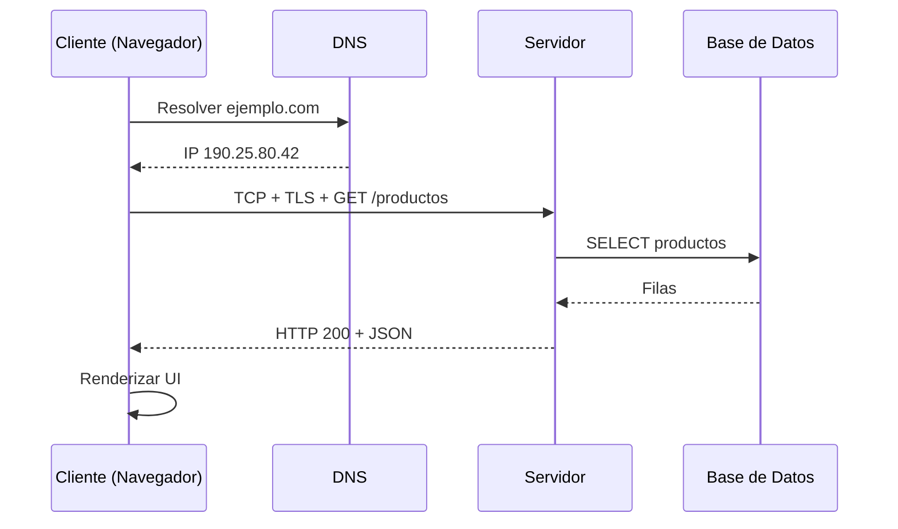
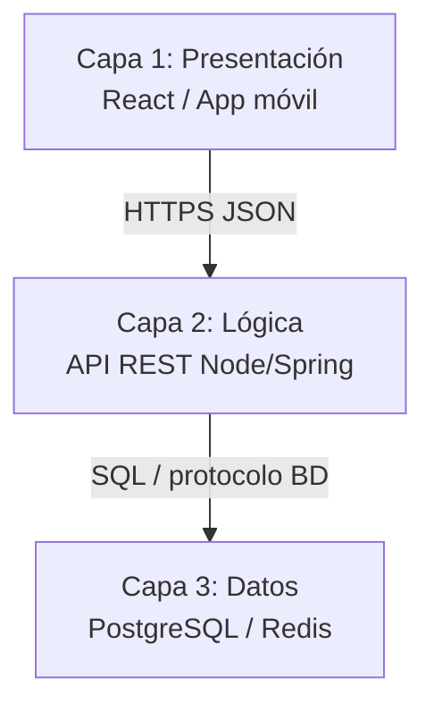

## Objetivos medibles

Al finalizar la lección el estudiante podrá:

1. Definir el **modelo cliente-servidor** y distinguir roles de cliente (solicita) y servidor (provee recursos).
2. Describir el **flujo completo** al abrir una URL: DNS → TCP → TLS → HTTP request/response → renderizado.
3. Comparar arquitecturas **2 capas, 3 capas y N capas/microservicios** en seguridad, escalabilidad y separación de responsabilidades.
4. Identificar variantes (**P2P, híbrido, serverless**) y cuándo cada una aplica en aplicaciones reales.
5. Mapear aplicaciones cotidianas (búsqueda, correo, streaming, juegos) a cliente, servidor y protocolo subyacente.

## Conceptos clave

- **Modelo cliente-servidor:** paradigma de red donde el cliente solicita servicios y el servidor los provee. Base de la WWW, correo, APIs y la mayoría de apps modernas.
- **Request / Response:** intercambio unidireccional por turnos; el cliente inicia, el servidor responde (datos, error o ambos).
- **Cliente:** navegador, app móvil, `curl`, Postman, cliente de juego. Presenta la interfaz o consume la API.
- **Servidor:** Apache, Nginx, Node.js, Spring Boot, clusters cloud. Procesa lógica, consulta datos y devuelve respuesta.
- **Protocolos de transporte y aplicación:** TCP (conexión fiable), TLS (cifrado), HTTP/HTTPS (semántica de petición).
- **Resolución DNS:** traduce `ejemplo.com` a dirección IP antes de abrir la conexión.
- **Arquitectura 2 capas (2-Tier):** cliente ↔ servidor con BD integrada o acceso directo. Simple pero inseguro si el cliente toca la BD.
- **Arquitectura 3 capas (3-Tier):** presentación (navegador/app) → lógica/API (backend) → datos (PostgreSQL, MongoDB). Estándar en la web.
- **N capas / microservicios:** API Gateway, servicios independientes, BDs por dominio. Escala por servicio; mayor complejidad operacional.
- **P2P:** cada nodo es cliente y servidor (BitTorrent, blockchain). Sin servidor central.
- **Híbrido:** servidor central coordina; clientes comparten datos (Skype, metadatos en Spotify).
- **Serverless:** funciones efímeras en la nube (Lambda, Cloudflare Workers); el proveedor gestiona la infraestructura.
- **Carga de página moderna:** una sola URL puede disparar decenas de requests HTTP (HTML, JS, CSS, fuentes, imágenes, APIs).

## Errores comunes

- **Confundir cliente con frontend solamente:** el cliente puede ser terminal ATM, app móvil o script `curl`, no solo navegador.
- **Asumir que el servidor es un solo equipo:** en producción suele ser cluster, CDN o balanceador detrás de un dominio.
- **Omitir DNS y TLS al explicar "abrir una web":** sin IP no hay conexión; sin TLS en HTTPS no hay canal cifrado.
- **Exponer la BD directamente al cliente (2-Tier mal aplicado):** credenciales en el cliente, sin capa de API, riesgo crítico de seguridad.
- **Tratar microservicios como obligatorios:** añaden complejidad de red, despliegue y observabilidad; no todo proyecto los necesita.
- **Pensar que P2P no tiene servidores:** muchos sistemas "P2P" usan servidores de descubrimiento o coordinación.
- **Ignorar el volumen de requests:** optimizar solo el HTML inicial y olvidar assets y llamadas API que bloquean la experiencia.

## Casos reales

### 1. E-commerce: pico de tráfico en Black Friday

Una tienda con arquitectura 2 capas (app de escritorio interna conectada directo a MySQL) colapsa cuando 200 cajeros consultan stock simultáneo. La BD recibe conexiones directas sin pool ni capa de caché; timeouts en checkout.

**Decisión clave:** migrar a 3 capas — React en presentación, API REST en Node.js con pool de conexiones, Redis para stock cacheado, PostgreSQL solo desde el backend. El cliente nunca ve credenciales de BD.

### 2. Videollamadas: modelo híbrido en producción

Una startup copia el modelo P2P puro para videollamadas. Sin servidor de señalización estable, las llamadas fallan detrás de NAT corporativo y no hay registro de sesiones para soporte.

**Decisión clave:** adoptar modelo híbrido — servidor central para autenticación, presencia y signaling (WebSockets/HTTPS); media P2P o TURN relay según red. Balance entre costo y confiabilidad.

## Ejemplos de código sugeridos

### Petición HTTP cruda (lo que envía el navegador)

<!-- code: http -->
```http
GET /productos HTTP/1.1
Host: ejemplo.com
Accept: application/json
User-Agent: Mozilla/5.0
Connection: close
```

### Respuesta del servidor

<!-- code: http -->
```http
HTTP/1.1 200 OK
Content-Type: application/json
Content-Length: 87

[{"id":1,"nombre":"Laptop Pro 15","precio":4500000},{"id":2,"nombre":"Mouse","precio":85000}]
```

### Cliente con curl (terminal)

<!-- code: bash -->
```bash
# Resolver y solicitar recurso (curl hace DNS + TCP + TLS internamente)
curl -v https://ejemplo.com/productos

# Solo cabeceras de respuesta
curl -I https://ejemplo.com/productos
```

### Cliente JavaScript (fetch desde React)

<!-- code: javascript -->
```javascript
// El navegador actúa como cliente HTTP
async function cargarProductos() {
  const response = await fetch("https://ejemplo.com/api/productos");
  if (!response.ok) throw new Error(`HTTP ${response.status}`);
  return response.json();
}
```

### Servidor mínimo Node.js (rol servidor)

<!-- code: javascript -->
```javascript
import http from "node:http";

const server = http.createServer((req, res) => {
  if (req.method === "GET" && req.url === "/productos") {
    res.writeHead(200, { "Content-Type": "application/json" });
    res.end(JSON.stringify([{ id: 1, nombre: "Laptop Pro 15" }]));
  } else {
    res.writeHead(404);
    res.end();
  }
});

server.listen(3000, () => console.log("Servidor en puerto 3000"));
```

## Ejercicios de práctica

- **tipo:** reflexion — Explica la analogía banco/ventanilla aplicada a `GET /api/cuenta/saldo`. ¿Quién es cliente, servidor y qué sería la BD?
- **tipo:** ordenar-pasos — Ordena: (a) TLS handshake, (b) renderizado en navegador, (c) resolución DNS, (d) `GET /productos`, (e) consulta SQL en servidor, (f) TCP a puerto 443.
- **tipo:** diagrama — Dibuja una arquitectura 3 capas para una app de pedidos: React, API Spring Boot, PostgreSQL. Indica qué capa no debe ser accesible desde internet.

## Animación o visual sugerida

- **StepReveal — flujo al abrir URL:** URL → DNS → TCP → TLS → HTTP → DB → response → render.
- **CompareTable — 2-Tier vs 3-Tier:** seguridad, escalabilidad, complejidad.
- **MermaidDiagram — secuencia navegador/DNS/servidor/BD.**

## Diagrama Mermaid (si aplica)

### Secuencia al cargar una página



### Arquitectura 3 capas



## Secciones TSX sugeridas

- `ObjetivosSection` — 5 objetivos medibles
- `QueEsClienteServidorSection` — definición, analogía banco, diagrama request/response
- `FlujoHttpSection` — 8 pasos al abrir URL + secuencia Mermaid
- `ArquitecturasSection` — 2-Tier, 3-Tier, microservicios con `CompareTable`
- `VariantesSection` — P2P, híbrido, serverless en tarjetas
- `EjemplosRealesSection` — tabla apps/protocolos + dato de ~50–100 requests por página
- `CompruebaTuComprensionSection` — quiz integrado

## Reto integrador

**"Diseña la arquitectura de un sistema de reservas de cine"**

Requisitos: app web React, app móvil, API de butacas en tiempo real, pasarela de pago externa, panel admin.

1. Identifica al menos **3 tipos de cliente** y **2 tipos de servidor** (o servicios).
2. Elige entre 3-Tier o microservicios y justifica con un criterio de escala o equipo.
3. Enumera el flujo HTTP cuando un usuario reserva la butaca F-12 (desde clic hasta confirmación).
4. Indica qué protocolo usarías para actualizar butacas ocupadas en tiempo real (HTTP polling vs WebSockets).
5. Señala un error de diseño si la app móvil se conectara directo a PostgreSQL.

**Criterio de éxito:** separación clara de capas, BD no expuesta al cliente, flujo DNS→HTTP documentado, justificación de variante arquitectónica.

## Preguntas sugeridas para quiz (5)

1. **¿Qué rol cumple el cliente en el modelo cliente-servidor?**
   - A) Almacena todos los datos de la aplicación
   - B) Solicita servicios o recursos al servidor
   - C) Solo ejecuta bases de datos
   - D) Reemplaza al protocolo HTTP
   - **Correcta:** B
   - **Feedback:** El cliente inicia peticiones; el servidor procesa y responde.

2. **¿Qué ocurre primero al escribir `https://ejemplo.com` en el navegador?**
   - A) El servidor ejecuta SQL
   - B) Resolución DNS del dominio a IP
   - C) Renderizado del HTML
   - D) COMMIT de transacción
   - **Correcta:** B
   - **Feedback:** Sin IP (vía DNS) no se establece la conexión TCP al servidor.

3. **Ventaja principal de la arquitectura 3 capas frente a 2 capas con acceso directo a BD:**
   - A) El cliente tiene credenciales de la base de datos
   - B) La capa de datos no queda expuesta directamente al cliente
   - C) Elimina la necesidad de un servidor
   - D) Solo permite aplicaciones de escritorio
   - **Correcta:** B
   - **Feedback:** La API intermedia protege la BD y centraliza la lógica de negocio.

4. **¿Cuál es un ejemplo de modelo peer-to-peer (P2P)?**
   - A) Navegador → Apache → MySQL
   - B) BitTorrent sin servidor central de archivos
   - C) React → REST API → PostgreSQL
   - D) AWS Lambda invocada por API Gateway
   - **Correcta:** B
   - **Feedback:** En P2P los nodos intercambian recursos entre sí sin un servidor central de contenido.

5. **En serverless (ej. AWS Lambda), ¿qué gestiona principalmente el proveedor cloud?**
   - A) El código fuente en el repositorio Git del desarrollador
   - B) La infraestructura de ejecución y escalado de funciones
   - C) El diseño de la interfaz React
   - D) La resolución DNS del dominio del usuario final
   - **Correcta:** B
   - **Feedback:** El desarrollador sube funciones; la nube ejecuta y escala sin administrar servidores dedicados.

## Referencias

- Fuente docente: `kb/education/sources/clases/programacion-orientada-sitios-web/modelo-cliente-servidor.md`
- Prerrequisito: `react`
- Siguiente lección: `herramientas-desarrollo`
- Lecciones relacionadas: `frontend`, `backend`, `http-metodos-status`, `protocolos-seguridad`, `apis`
