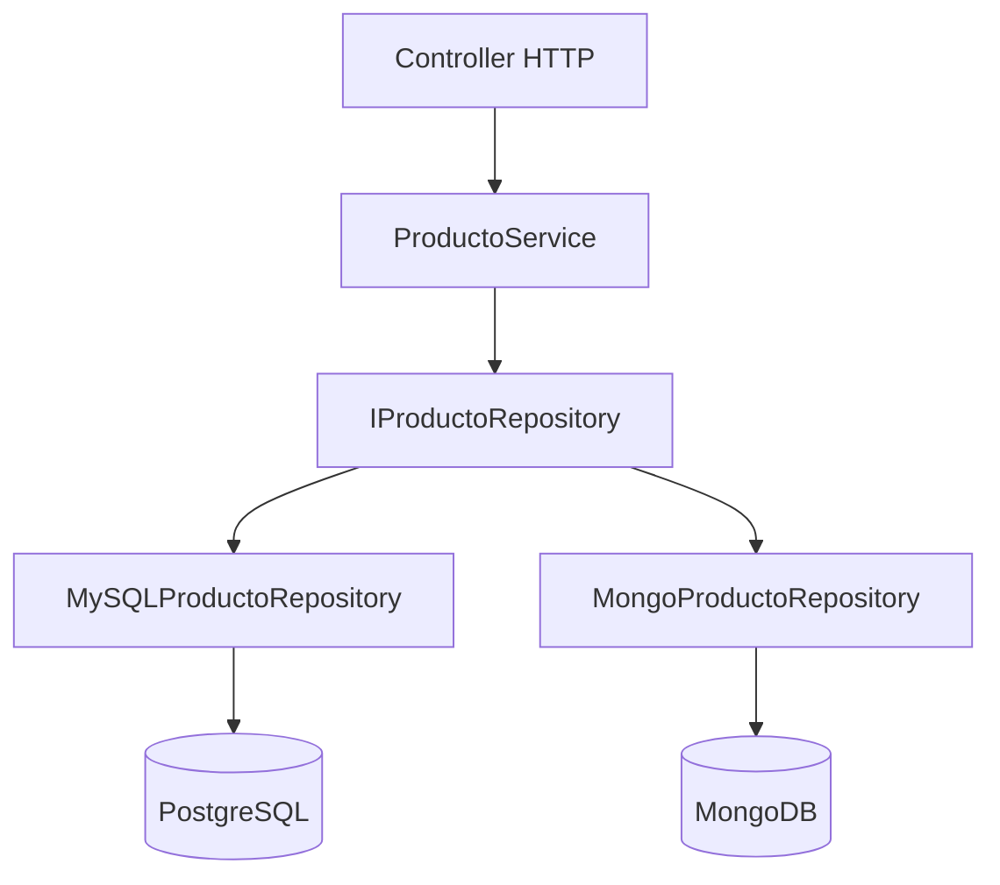

## Objetivos medibles

Al finalizar la lección el estudiante podrá:

1. Explicar el acrónimo **SOLID** y nombrar cada principio con su regla en una frase.
2. Detectar **violaciones de SRP** cuando una clase mezcla negocio, persistencia y notificaciones.
3. Aplicar **OCP** mediante interfaces o estrategias para extender sin modificar código existente.
4. Reconocer violaciones de **LSP, ISP y DIP** (subtipos que rompen contratos, interfaces gordas, `new` de concreciones en servicios).
5. Decidir **cuándo aplicar SOLID** en capas de API/backend sin caer en sobre-ingeniería dogmática.

## Conceptos clave

- **SOLID:** cinco principios de diseño OO de Robert C. Martin ("Uncle Bob"); reducen acoplamiento, aumentan cohesión y facilitan tests y mantenimiento.
- **SRP (Single Responsibility):** una clase, una razón para cambiar; separar entidad, repositorio y servicios externos.
- **OCP (Open/Closed):** abierto a extensión, cerrado a modificación; nuevos métodos de pago = nuevas clases, no más `if/else`.
- **LSP (Liskov Substitution):** un subtipo debe sustituir al padre sin romper el programa; no heredar comportamientos imposibles.
- **ISP (Interface Segregation):** interfaces pequeñas y específicas; el cliente no implementa métodos que no usa.
- **DIP (Dependency Inversion):** capas altas dependen de abstracciones; inyección de dependencias en el punto de composición.
- **Señales de violación:** clase que cambia por múltiples motivos; cadena de `if (tipo === …)`; subclase que lanza en métodos heredados; `new MySQLRepository()` dentro del servicio.
- **Aplicación en POSW:** controladores delgados, servicios con lógica de negocio, repositorios detrás de interfaces, DTOs separados de entidades.
- **Guía práctica:** SOLID no es ley rígida; úsalo donde hay cambio frecuente, equipos grandes o tests unitarios críticos.

## Errores comunes

- **God class:** `Usuario` que valida, guarda en BD y envía email; imposible testear sin BD ni SMTP.
- **OCP ignorado:** cada nuevo gateway de pago exige editar `ProcesadorPago` y re-deploy de todo el módulo.
- **Herencia forzada (LSP):** `PatoDeGoma extends Pato` con `volar()` que lanza; el cliente espera volar cualquier `Pato`.
- **Fat interface (ISP):** `Trabajador` con `comer()` y `dormir()` obliga al `Robot` a métodos vacíos o excepciones.
- **Acoplamiento duro (DIP):** `ProductoService` instancia `MySQLRepository`; migrar a MongoDB rompe el servicio.
- **SOLID dogmático:** 15 interfaces para un CRUD de 3 campos que no cambiará en años.
- **Confundir SRP con "una función por archivo":** el criterio es **razón para cambiar**, no contar líneas.

## Casos reales

### 1. E-commerce: procesador de pagos monolítico

Un `ProcesadorPago` con `if (tipo === 'tarjeta' | 'paypal' | 'nequi' | …)` crece cada trimestre. Un bug en Nequi obliga a retestear tarjeta y PayPal. Releases se retrasan por miedo a regresiones.

**Decisión clave:** interface `MetodoPago`, una clase por proveedor (OCP); `ProcesadorPago` solo delega; tests unitarios por método sin tocar los demás.

### 2. SaaS B2B: servicio acoplado a MySQL

`ProductoService` hace `new MySQLProductoRepository()`. El cliente enterprise exige réplica en MongoDB para catálogo flexible. El equipo duplica `ProductoService` en lugar de abstraer.

**Decisión clave:** `IProductoRepository` inyectado en constructor (DIP); mismos tests de negocio con mock; cambio de motor solo en composición raíz.

## Ejemplos de código sugeridos

### SRP — separar responsabilidades

<!-- code: typescript -->
```typescript
// ❌ Violación SRP
class Usuario {
  constructor(public nombre: string, public email: string) {}
  validarEmail(): boolean {
    return /^[^\s@]+@[^\s@]+\.[^\s@]+$/.test(this.email);
  }
  guardarEnBaseDeDatos(): void {
    console.log("INSERT INTO usuarios...");
  }
  enviarEmailBienvenida(): void {
    console.log("SMTP.send...");
  }
}

// ✅ SRP aplicado
class Usuario {
  constructor(public readonly nombre: string, public readonly email: string) {}
  validarEmail(): boolean {
    return /^[^\s@]+@[^\s@]+\.[^\s@]+$/.test(this.email);
  }
}

class UsuarioRepository {
  guardar(usuario: Usuario): void {
    console.log(`Guardando ${usuario.nombre}`);
  }
}

class EmailService {
  enviarBienvenida(usuario: Usuario): void {
    console.log(`Email a ${usuario.email}`);
  }
}
```

### OCP — extender métodos de pago

<!-- code: typescript -->
```typescript
interface MetodoPago {
  procesar(monto: number): void;
}

class PagoTarjeta implements MetodoPago {
  procesar(monto: number): void {
    console.log(`Cobrar $${monto} con tarjeta`);
  }
}

class PagoNequi implements MetodoPago {
  procesar(monto: number): void {
    console.log(`Cobrar $${monto} con Nequi`);
  }
}

class ProcesadorPago {
  constructor(private metodo: MetodoPago) {}
  procesar(monto: number): void {
    this.metodo.procesar(monto);
  }
}
```

### LSP — contratos por capacidad

<!-- code: typescript -->
```typescript
interface Pato {
  graznar(): void;
}

interface PatoVolador extends Pato {
  volar(): void;
}

class PatoReal implements PatoVolador {
  graznar(): void { console.log("Cuac!"); }
  volar(): void { console.log("Volando..."); }
}

class PatoDeGoma implements Pato {
  graznar(): void { console.log("Cuac de goma!"); }
}
```

### DIP — inyección en servicio de API

<!-- code: csharp -->
```csharp
public interface IProductoRepository
{
    Task GuardarAsync(Producto producto);
    Task<Producto?> BuscarPorIdAsync(int id);
}

public class ProductoService
{
    private readonly IProductoRepository _repo;

    public ProductoService(IProductoRepository repo) => _repo = repo;

    public async Task CrearAsync(Producto datos)
    {
        await _repo.GuardarAsync(datos);
    }
}

// Composición en Program.cs / Startup
// services.AddScoped<IProductoRepository, MySqlProductoRepository>();
```

### ISP — interfaces segregadas

<!-- code: typescript -->
```typescript
interface Trabajable {
  trabajar(): void;
}

interface Humano extends Trabajable {
  comer(): void;
  dormir(): void;
}

class Robot implements Trabajable {
  trabajar(): void { console.log("Procesando..."); }
}
```

## Ejercicios de práctica

- **tipo:** reflexion — Enumera tres "razones para cambiar" en una clase `PedidoService` que calcula totales, envía emails y escribe en PostgreSQL. ¿Cómo aplicarías SRP?
- **tipo:** completar-codigo — Completa la interface y la clase para añadir `PagoPSE` sin modificar `ProcesadorPago`: `interface MetodoPago { ___ }` / `class PagoPSE implements ___`
- **tipo:** diagrama — Dibuja capas Controller → Service → `IRepository` → BD señalando dónde aplica DIP.

## Animación o visual sugerida

- **CompareTable — SOLID resumen:** principio | letra | regla | señal de violación.
- **StepReveal — S → O → L → I → D** con snippet incorrecto/correcto por paso.
- **Tarjetas lado a lado** incorrecto (borde rojo) vs correcto (borde verde) por principio.

## Diagrama Mermaid (si aplica)

### Capas con DIP en backend



### Relación entre principios


## Secciones TSX sugeridas

- `ObjetivosSection` — 5 objetivos medibles
- `IntroSolidSection` — acrónimo, Uncle Bob, guía no dogmática
- `SrpSection` — regla, analogía médico/farmacia, código incorrecto/correcto
- `OcpSection` — `MetodoPago` + `ProcesadorPago`
- `LspSection` — patos voladores vs pato de goma
- `IspSection` — `Trabajable` vs `Humano`
- `DipSection` — `IProductoRepository` + inyección
- `ResumenSolidSection` — tabla comparativa + nota sobre sobre-ingeniería
- `CompruebaTuComprensionSection` — quiz integrado

## Reto integrador

**"Refactoriza el módulo de usuarios de una API REST"**

Partes de un código legacy:
- `Usuario` con validación, `INSERT` SQL y envío SMTP.
- `AuthService` con `new JwtTokenGenerator()` hardcodeado.
- `Notificador` con `if (canal === 'email' | 'sms' | 'push')`.

1. Separa en entidad, repositorio, `EmailService` (SRP).
2. Añade `SmsNotificador` sin tocar código existente (OCP).
3. Define `ITokenGenerator` e inyéctalo en `AuthService` (DIP).
4. Escribe un test unitario del servicio con mock del repositorio.
5. Documenta qué NO refactorizarías y por qué (evitar sobre-ingeniería).

**Criterio de éxito:** responsabilidades separadas, extensión de canal sin editar `if` central, servicio testeable sin BD, justificación pragmática.

## Preguntas sugeridas para quiz (5)

1. **¿Qué establece el principio de Responsabilidad Única (SRP)?**
   - A) Una clase por archivo
   - B) Una clase, una razón para cambiar
   - C) Una función por endpoint
   - D) Un solo desarrollador por módulo
   - **Correcta:** B
   - **Feedback:** SRP mide cohesión por motivo de cambio, no por cantidad de archivos.

2. **¿Cuál es la forma correcta de añadir un nuevo método de pago según OCP?**
   - A) Agregar otro `else if` en `ProcesadorPago`
   - B) Crear una clase que implemente `MetodoPago`
   - C) Duplicar `ProcesadorPago` completo
   - D) Cambiar la firma de `procesar()` en producción
   - **Correcta:** B
   - **Feedback:** OCP extiende con nuevas implementaciones sin modificar el procesador existente.

3. **¿Qué viola LSP en el ejemplo del pato de goma?**
   - A) El pato real no grazna
   - B) La subclase lanza error en `volar()` heredado
   - C) No hay interface
   - D) Usar TypeScript en lugar de Java
   - **Correcta:** B
   - **Feedback:** Un subtipo no puede romper el contrato que el cliente espera del padre.

4. **¿Qué problema resuelve ISP?**
   - A) Interfaces demasiado grandes que obligan métodos inútiles
   - B) Falta de herencia múltiple
   - C) Lentitud de la base de datos
   - D) Versionado de APIs REST
   - **Correcta:** A
   - **Feedback:** ISP divide interfaces para que cada cliente dependa solo de lo que usa.

5. **¿Cómo se aplica DIP en `ProductoService`?**
   - A) `new MySQLProductoRepository()` dentro del servicio
   - B) Depender de `IProductoRepository` inyectada por constructor
   - C) Importar SQL directo en el controlador
   - D) Eliminar todas las interfaces
   - **Correcta:** B
   - **Feedback:** Alto nivel depende de abstracción; la concreción se elige al componer la app.

## Referencias

- Fuente docente: `kb/education/sources/clases/programacion-orientada-sitios-web/principios-solid.md`
- Prerrequisito: `bases-de-datos`
- Siguiente lección: `naming-conventions`
- Lecciones relacionadas: `servicios-web`, `typescript`, `backend`, `naming-conventions`
- Robert C. Martin — Clean Architecture (2017)
