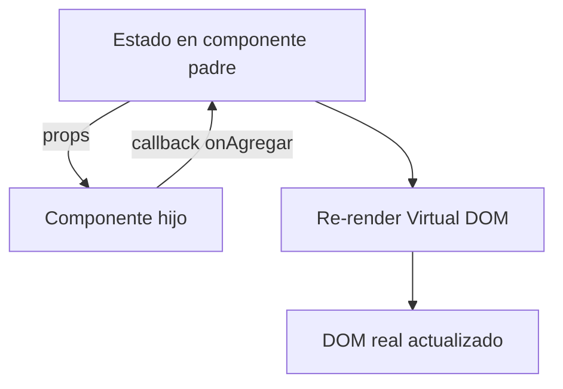
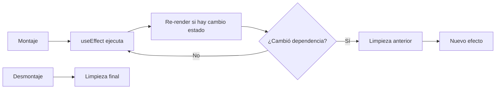

## Objetivos medibles

Al finalizar la lección el estudiante podrá:

1. Definir **React** como librería de UI basada en componentes, Virtual DOM y flujo unidireccional de datos.
2. Escribir **JSX** siguiendo sus reglas (`className`, un elemento raíz, expresiones `{}`, componentes con mayúscula).
3. Construir **componentes funcionales** con props tipadas y composición padre-hijo (incluyendo `key` en listas).
4. Gestionar **estado local** con `useState` (valores simples y objetos en formularios).
5. Aplicar **`useEffect`** para efectos secundarios (fetch a API REST, limpieza al desmontar) y nombrar hooks principales.

## Conceptos clave

- **React:** librería JavaScript (Meta, 2013) para interfaces de usuario con componentes reutilizables. No es framework completo: routing, estado global y data fetching suelen añadirse con librerías del ecosistema.
- **Componentes:** piezas pequeñas con lógica y presentación propias; unidad fundamental de la UI.
- **Virtual DOM:** representación en memoria del DOM; React calcula el diff mínimo y actualiza solo lo necesario.
- **Flujo unidireccional:** datos bajan del padre al hijo vía props; el estado es la fuente de verdad.
- **JSX:** sintaxis que mezcla HTML en JavaScript; compila a `React.createElement`.
- **Componentes funcionales:** estándar moderno (Hooks desde 2019); clases son legacy.
- **Props:** datos de solo lectura del padre al hijo; nunca mutar props dentro del hijo.
- **`key` en listas:** identificador estable para reconciliación; preferir ID único sobre índice en listas dinámicas.
- **`useState`:** estado local; actualizaciones con setter; objetos con spread (`setForm(prev => ({ ...prev, ... }))`).
- **Hooks principales:** `useState`, `useEffect`, `useContext`, `useReducer`, `useMemo`, `useCallback`, `useRef`, `useId`.
- **`useEffect`:** efectos secundarios tras render; array de dependencias; función de limpieza al desmontar o antes del siguiente efecto.
- **Fetch en React:** típicamente `useEffect` + `fetch` o librerías (React Query, SWR); manejar loading, error y cancelación.
- **Vite:** herramienta recomendada para crear proyectos React (`react-ts` template).

## Errores comunes

- **Mutar estado directamente:** `cuenta++` en lugar de `setCuenta(c => c + 1)`; React no detecta el cambio.
- **Olvidar dependencias en `useEffect`:** bucles infinitos o datos obsoletos (stale closures).
- **Sin función de limpieza en fetch:** actualizar estado tras desmontar causa warning y bugs; usar flag `cancelado` o `AbortController`.
- **Usar índice como `key` en listas que cambian:** re-renders incorrectos al reordenar o borrar items.
- **Confundir React con framework completo:** falta routing/HTTP integrado como en Angular; hay que elegir stack.
- **Efectos para cada cálculo derivado:** preferir derivar en render o `useMemo` si no es side effect real.
- **Props drilling excesivo:** muchos niveles pasando props; considerar Context o estado global cuando escale.

## Casos reales

### 1. Startup: bug de race condition en detalle de producto

Un SPA React muestra el producto equivocado cuando el usuario navega rápido entre `/productos/1` y `/productos/2`. El `useEffect` sin limpieza aplica la respuesta tardía del ID anterior.

**Decisión clave:** dependencia `[id]` en `useEffect`, flag `cancelado` o `AbortController.abort()` en cleanup; estados `cargando` y `error` explícitos.

### 2. Equipo híbrido: React vs Angular en el mismo dominio

Una empresa tiene portal en Angular y nueva app móvil-web en React. Duplican tipos de `Producto` manualmente; un cambio en la API rompe solo una app.

**Decisión clave:** paquete compartido de tipos TypeScript (`@empresa/api-types`) generado desde OpenAPI; ambos consumen el mismo contrato REST aprendido en lecciones previas.

## Ejemplos de código sugeridos

### Crear proyecto con Vite

<!-- code: bash -->
```bash
npm create vite@latest mi-app -- --template react-ts
cd mi-app
npm install
npm run dev
```

### JSX vs React.createElement

<!-- code: javascript -->
```javascript
// Sin JSX
const elemento = React.createElement(
  "div",
  { className: "tarjeta" },
  React.createElement("h2", null, "Laptop Pro 15"),
  React.createElement("p", { className: "precio" }, "$4.500.000")
);

// Con JSX
const elemento = (
  <div className="tarjeta">
    <h2>Laptop Pro 15</h2>
    <p className="precio">$4.500.000</p>
  </div>
);
```

### Componente funcional con props

<!-- code: typescript -->
```tsx
interface TarjetaProductoProps {
  nombre: string;
  precio: number;
  imagen: string;
  onAgregar: (nombre: string) => void;
}

function TarjetaProducto({ nombre, precio, imagen, onAgregar }: TarjetaProductoProps) {
  const precioFormateado = precio.toLocaleString("es-CO", {
    style: "currency",
    currency: "COP",
    maximumFractionDigits: 0
  });

  return (
    <article className="tarjeta-producto">
      
      <h3>{nombre}</h3>
      <p className="precio">{precioFormateado}</p>
      <button onClick={() => onAgregar(nombre)}>Agregar al carrito</button>
    </article>
  );
}
```

### Composición y lista con key

<!-- code: typescript -->
```tsx
function Catalogo() {
  const productos = [
    { id: 1, nombre: "Laptop Pro 15", precio: 4500000, imagen: "/img/laptop.jpg" },
    { id: 2, nombre: "Mouse inalámbrico", precio: 85000, imagen: "/img/mouse.jpg" }
  ];

  const handleAgregar = (nombre: string) => {
    console.log(`${nombre} agregado al carrito`);
  };

  return (
    <section className="catalogo">
      {productos.map(p => (
        <TarjetaProducto
          key={p.id}
          nombre={p.nombre}
          precio={p.precio}
          imagen={p.imagen}
          onAgregar={handleAgregar}
        />
      ))}
    </section>
  );
}
```

### useState: contador y formulario

<!-- code: typescript -->
```tsx
import { useState } from "react";

function Contador() {
  const [cuenta, setCuenta] = useState(0);
  return (
    <div>
      <p>Cuenta: {cuenta}</p>
      <button onClick={() => setCuenta(c => c + 1)}>+1</button>
    </div>
  );
}

function FormularioContacto() {
  const [form, setForm] = useState({ nombre: "", email: "", mensaje: "" });

  const handleChange = (e: React.ChangeEvent<HTMLInputElement>) => {
    setForm(prev => ({ ...prev, [e.target.name]: e.target.value }));
  };

  return <input name="nombre" value={form.nombre} onChange={handleChange} />;
}
```

### useEffect: fetch con limpieza

<!-- code: typescript -->
```tsx
import { useState, useEffect } from "react";

function ProductoDetalle({ id }: { id: number }) {
  const [producto, setProducto] = useState<Producto | null>(null);
  const [cargando, setCargando] = useState(true);

  useEffect(() => {
    let cancelado = false;
    setCargando(true);

    fetch(`/api/productos/${id}`)
      .then(r => r.json())
      .then(datos => {
        if (!cancelado) {
          setProducto(datos);
          setCargando(false);
        }
      });

    return () => { cancelado = true; };
  }, [id]);

  if (cargando) return <div>Cargando...</div>;
  return <h1>{producto?.nombre}</h1>;
}
```

## Ejercicios de práctica

- **tipo:** reflexion — Compara el flujo de datos en React (props hacia abajo) con `@Input`/`@Output` en Angular. ¿Qué similitudes y diferencias encuentras?
- **tipo:** ordenar-pasos — Ordena el ciclo de `useEffect` con dependencia `[id]`: (a) desmontaje ejecuta limpieza, (b) render inicial, (c) efecto fetch, (d) `id` cambia → limpieza → nuevo efecto.
- **tipo:** completar-codigo — Completa: lista de productos debe usar `productos.map(p => <TarjetaProducto key={___} ... />)`; estado de contador se actualiza con `setCuenta(c => ___)`.

## Animación o visual sugerida

- **StepReveal — ciclo useEffect:** montaje → efecto → re-render → limpieza → desmontaje.
- **CompareTable — React vs Angular:** librería vs framework, JSX vs templates, hooks vs ciclo de vida.
- **MermaidDiagram — flujo unidireccional:** estado en padre → props → hijo → evento callback → padre actualiza estado.

## Diagrama Mermaid (si aplica)

### Flujo unidireccional de datos



### Ciclo de useEffect



## Secciones TSX sugeridas

- `ObjetivosSection` — 5 objetivos medibles
- `QueEsReactSection` — definición, tres pilares (componentes, Virtual DOM, flujo unidireccional)
- `JsxSection` — reglas JSX, comparativa con `createElement`
- `ComponentesSection` — componente funcional `TarjetaProducto`
- `PropsSection` — composición, `key`, props de solo lectura
- `EstadoSection` — `useState` contador y formulario
- `HooksSection` — tabla hooks principales
- `EfectosSection` — `useEffect` fetch, dependencias, limpieza
- `CompruebaTuComprensionSection` — quiz integrado

## Reto integrador

**"Catálogo React consumiendo API REST"**

Implementa (o diseña en detalle) una vista que liste productos desde `GET /api/v1/productos`.

1. Crea proyecto con `npm create vite@latest -- --template react-ts`.
2. Define `TarjetaProducto` con props tipadas y botón que llame `onAgregar`.
3. En `Catalogo`, usa `useState` para `productos`, `cargando` y `error`.
4. En `useEffect`, fetch a la API con limpieza al desmontar o al cambiar filtros.
5. Renderiza lista con `key={p.id}`; muestra estados vacío, carga y error.

**Criterio de éxito:** sin mutar props/estado directamente, `useEffect` con dependencias correctas, manejo de race conditions, tipos TypeScript en props y respuesta API.

## Preguntas sugeridas para quiz (5)

1. **¿React es un framework o una librería?**
   - A) Framework completo con routing y HTTP integrados
   - B) Librería enfocada en construir interfaces con componentes
   - C) Lenguaje de programación independiente
   - D) Base de datos para el frontend
   - **Correcta:** B
   - **Feedback:** React cubre la capa de UI; routing y estado global suelen añadirse aparte.

2. **¿Qué atributo JSX reemplaza a `class` de HTML?**
   - A) `class`
   - B) `className`
   - C) `cssClass`
   - D) `styleName`
   - **Correcta:** B
   - **Feedback:** En JSX se usa `className` porque `class` es palabra reservada en JavaScript.

3. **¿Las props en un componente hijo pueden modificarse dentro del hijo?**
   - A) Sí, con `useState` inicializado desde props
   - B) No, son de solo lectura; el padre es quien las actualiza
   - C) Solo en componentes de clase
   - D) Sí, mutando el objeto props directamente
   - **Correcta:** B
   - **Feedback:** Las props fluyen del padre; mutar props rompe el modelo unidireccional.

4. **¿Cuándo se re-ejecuta un `useEffect(() => {...}, [id])`?**
   - A) En cada render del árbol completo de la app
   - B) Solo al montar, nunca más
   - C) Al montar y cuando `id` cambia
   - D) Solo al desmontar
   - **Correcta:** C
   - **Feedback:** El array de dependencias controla cuándo el efecto se vuelve a ejecutar.

5. **¿Por qué es importante la prop `key` en `productos.map()`?**
   - A) Para estilos CSS automáticos
   - B) Para que React identifique elementos en listas dinámicas
   - C) Para encriptar datos
   - D) Es opcional y no afecta el comportamiento
   - **Correcta:** B
   - **Feedback:** `key` estable (ID) ayuda a la reconciliación correcta del Virtual DOM.

## Referencias

- Fuente docente: `kb/education/sources/clases/programacion-orientada-sitios-web/react.md`
- Prerrequisitos: `typescript`, `angular`
- Siguiente lección: `modelo-cliente-servidor`
- Lecciones relacionadas: `frontend`, `backend`, `apis`, `herramientas-desarrollo`
- React docs: https://react.dev/
