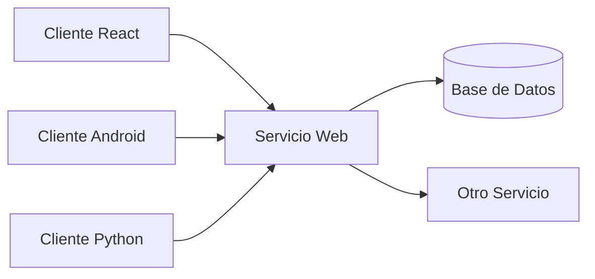
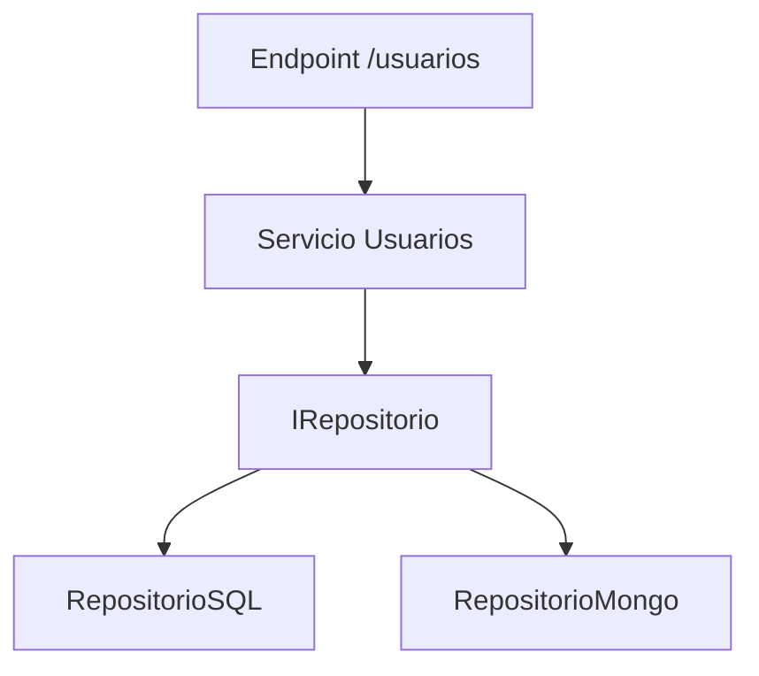

## Objetivos medibles

Al finalizar la lección el estudiante podrá:

1. Definir **servicio web** como sistema máquina-a-máquina con interfaz estandarizada (típicamente HTTP) y distinguirlo de un sitio web estático orientado solo a humanos.
2. Enumerar al menos **cuatro objetivos** de los servicios web (interoperabilidad, compartir datos, escalabilidad, modularidad, estandarización o acceso remoto) con un ejemplo concreto de cada uno.
3. Describir el flujo **cliente → servicio web → recurso** (base de datos u otro servicio) usando un diagrama o analogía (p. ej. ATM).
4. Explicar por qué **SOLID** aplica al diseño de servicios web y nombrar cada letra del acrónimo con un ejemplo de endpoint o módulo.
5. Identificar en un escenario empresarial cuándo conviene **exponer funcionalidad como servicio** en lugar de duplicar lógica en cada cliente.

## Conceptos clave

- **Servicio web:** sistema de software diseñado para **interacción máquina-a-máquina** a través de una red. Expone funcionalidades mediante interfaces estandarizadas (generalmente HTTP) para que aplicaciones heterogéneas — distintos lenguajes y plataformas — se comuniquen sin intervención humana directa.
- **Interoperabilidad:** capacidad de que sistemas en Java, Python, Go, C#, Windows, Linux o cloud se comuniquen usando estándares abiertos (HTTP, JSON, XML). Es el beneficio central frente a integraciones ad hoc propietarias.
- **Compartir datos y lógica:** el servicio expone datos y operaciones como **recursos consumibles** por múltiples clientes sin duplicar reglas de negocio en cada app (web, móvil, scripts).
- **Escalabilidad independiente:** cada servicio puede escalar por separado. Si el servicio de pagos recibe más carga, solo ese componente se escala sin tocar catálogo, usuarios u otros módulos.
- **Modularidad / microservicios:** cada servicio encapsula una responsabilidad; el sistema completo se construye **componiendo** servicios independientes.
- **Estandarización:** protocolos y formatos ampliamente adoptados (HTTP/HTTPS, JSON, XML, REST, SOAP) reducen la curva de integración entre equipos y organizaciones.
- **Acceso remoto:** los servicios son alcanzables desde cualquier red con internet, habilitando arquitecturas distribuidas y colaboración entre organizaciones.
- **Cliente vs servicio:** el **cliente** consume la interfaz (app React, Android, script Python); el **servicio** publica la interfaz y orquesta persistencia u otros servicios downstream.
- **Analogía ATM:** como un cajero automático — no importa la marca de tarjeta ni el lenguaje interno del banco; la interfaz estandarizada permite la operación (retiro, consulta) a cualquier cliente compatible.
- **SOLID (introducción):** cinco principios de diseño OO (Robert C. Martin) especialmente relevantes al estructurar y evolucionar servicios web:
  - **S** — Single Responsibility: un módulo/endpoint una sola razón para cambiar (`/usuarios` no mezcla pagos).
  - **O** — Open/Closed: extender (nuevo tipo de auth) sin modificar el controlador existente.
  - **L** — Liskov Substitution: implementaciones intercambiables (`RepositorioSQL` / `RepositorioMongo` con la misma interfaz).
  - **I** — Interface Segregation: interfaces pequeñas (`ILector`, `IEscritor`) mejor que una gigante.
  - **D** — Dependency Inversion: depender de abstracciones (`IRepositorio`), no de concreciones (`MySQLRepositorio`).

## Errores comunes

- **Confundir servicio web con sitio web estático:** una página HTML que solo muestra contenido no es un servicio web; falta interfaz programática consumible por otras máquinas.
- **Duplicar lógica de negocio en cada cliente:** calcular totales, validar stock o aplicar descuentos en web + móvil + batch genera inconsistencias; la lógica debe vivir en el servicio.
- **Mezclar responsabilidades en un solo endpoint:** un controlador que gestiona usuarios, pagos y reportes viola SRP y dificulta pruebas y despliegues independientes.
- **Ignorar contratos de API:** cambiar respuestas o rutas sin versionar rompe clientes existentes; el servicio es un contrato público.
- **Asumir mismo lenguaje en cliente y servidor:** la interoperabilidad depende de **formato y protocolo**, no de compartir stack.
- **Escalar monolitos enteros por un cuello de botella:** subir réplicas de todo el backend cuando solo falla el módulo de notificaciones es ineficiente frente a servicios desacoplados.
- **Tratar SOLID como teoría ajena a APIs:** diseño mal particionado en backend se manifiesta como endpoints frágiles y deuda técnica en integraciones.

## Casos reales

### 1. Fintech: tres apps, una sola lógica de pagos

Una startup lanza web (React), app móvil (Kotlin) y un proceso batch nocturno (Python) para conciliación. Inicialmente cada equipo implementa su propia validación de montos y estados de transacción. Aparecen discrepancias: la app móvil acepta montos con dos decimales distintos a la web y el batch rechaza transacciones ya aprobadas en frontend.

**Decisión clave:** extraer un **servicio de pagos** con contrato HTTP + JSON, reglas centralizadas y clientes delgados. Refuerza interoperabilidad, compartir datos y SRP.

### 2. E-commerce en Black Friday: escalar solo el catálogo

Durante un pico de tráfico, el monolito escala horizontalmente pero la base de datos colapsa porque todas las réplicas compiten por las mismas tablas de lectura de productos. El equipo de checkout (menor carga) paga el mismo costo de infraestructura que catálogo.

**Decisión clave:** separar **servicio de catálogo** (lectura intensiva, cacheable) del servicio de pedidos. Escala independiente del componente con más carga — beneficio directo de modularidad y arquitectura distribuida.

## Ejemplos de código sugeridos

### Diagrama conceptual: múltiples clientes, un servicio

```text
Cliente A (React)  ──┐
Cliente B (Android)──┼──► [ Servicio Web ] ──► Base de Datos
Cliente C (Python) ──┘         │
                               └──► Otro Servicio
```

### Petición HTTP mínima (vista cliente)

<!-- code: http -->
```http
GET /api/productos/42 HTTP/1.1
Host: tienda.ejemplo.com
Accept: application/json
```

### Respuesta JSON típica de un servicio

<!-- code: json -->
```json
{
  "id": 42,
  "nombre": "Laptop Pro 15",
  "precio": { "valor": 4500000, "moneda": "COP" },
  "stock": 12
}
```

### Anti-patrón: lógica de negocio en el cliente

<!-- code: javascript -->
```javascript
// Evitar: cada cliente recalcula descuentos distinto
function totalCarrito(items) {
  let total = items.reduce((s, i) => s + i.precio * i.cantidad, 0);
  if (items.length > 3) total *= 0.9; // regla duplicada en web, móvil, etc.
  return total;
}
```

### Patrón: cliente delgado, servicio con la regla

<!-- code: http -->
```http
POST /api/carrito/calcular-total HTTP/1.1
Host: tienda.ejemplo.com
Content-Type: application/json

{"items":[{"productoId":42,"cantidad":2}]}
```

## Ejercicios de práctica

- **tipo:** reflexion — Explica la analogía del ATM: ¿qué parte es el cliente, qué parte es la interfaz estandarizada y qué parte es el sistema interno del banco?
- **tipo:** reflexion — Enumera dos razones por las que un banco legacy en Java y una app móvil en Kotlin deberían integrarse vía servicio web en lugar de compartir librería nativa.
- **tipo:** diagrama — Dibuja el flujo Cliente → Servicio Web → Base de Datos → Otro Servicio para un caso de "consultar saldo y pagar factura".
- **tipo:** ordenar-pasos — Ordena: (a) cliente envía petición HTTP, (b) servicio valida y ejecuta lógica, (c) servicio persiste o consulta datos, (d) servicio responde con JSON, (e) cliente muestra resultado.
- **tipo:** reflexion — Para el principio **D** (Dependency Inversion), ¿por qué el servicio no debería importar directamente `MySQLRepositorio` en su controlador?
- **tipo:** completar-codigo — Completa: "Un servicio web permite interacción ___-a-___ mediante interfaces ___." → máquina, máquina, estandarizadas.
- **tipo:** reflexion — Identifica qué principio SOLID se viola si `/usuarios/registro` también procesa pagos y envía emails de marketing.

## Animación o visual sugerida

- **MermaidDiagram — arquitectura cliente/servicio:** varios clientes convergiendo en un servicio con ramas a DB y otro servicio.
- **CompareTable — sitio web vs servicio web:** consumo humano vs máquina, HTML vs API, sin contrato vs contrato HTTP/JSON.
- **StepReveal — objetivos de servicios web:** revelar tarjetas de interoperabilidad, escalabilidad, modularidad, estandarización, acceso remoto.
- **CompareTable — SOLID en servicios web:** tabla Letra | Principio | Ejemplo en endpoint.

## Diagrama Mermaid (si aplica)

### Arquitectura distribuida básica



### SOLID aplicado a capas de API



## Secciones TSX sugeridas

- `ObjetivosSection` — 5 objetivos medibles con checklist
- `QueEsUnServicioWebSection` — definición + analogía ATM
- `ArquitecturaClienteServicioSection` — diagrama múltiples clientes
- `ObjetivosDeLosServiciosSection` — grid interoperabilidad, escalabilidad, modularidad, etc.
- `IntroduccionSolidSection` — tabla SOLID con ejemplos en APIs
- `CompruebaTuComprensionSection` — quiz integrado

## Reto integrador

**"Diseña el servicio de una biblioteca universitaria"**

Una universidad necesita que la app web, la app móvil y un script de reportes consulten préstamos de libros sin duplicar reglas.

1. Identifica **qué expone el servicio** (consultar disponibilidad, registrar préstamo, devolver libro) y **qué hace cada cliente** (solo UI o script).
2. Dibuja el diagrama cliente → servicio → base de datos (y si aplica otro servicio de notificaciones).
3. Para cada operación, indica qué principio SOLID proteges si separas módulo de préstamos del de usuarios.
4. Escribe una petición HTTP de ejemplo para `GET` consultar libro por ISBN y el JSON de respuesta esperado.
5. Explica qué pasa si cada cliente calcula multas por retraso por su cuenta.

**Criterio de éxito:** distingue servicio vs sitio estático, justifica centralizar lógica, diagrama claro, ejemplo HTTP+JSON válido, al menos dos principios SOLID aplicados al diseño.

## Preguntas sugeridas para quiz (5)

1. **¿Qué define mejor a un servicio web?**
   - A) Una página HTML para humanos
   - B) Un sistema máquina-a-máquina con interfaz estandarizada en red
   - C) Solo una base de datos en la nube
   - D) Un framework de frontend
   - **Correcta:** B
   - **Feedback:** Un servicio web expone funcionalidad para que otras aplicaciones la consuman programáticamente, típicamente vía HTTP.

2. **¿Cuál es un beneficio de la escalabilidad independiente en arquitectura de servicios?**
   - A) Obliga a escalar todo el monolito junto
   - B) Solo el componente con más carga puede escalarse sin tocar el resto
   - C) Elimina la necesidad de bases de datos
   - D) Impide usar múltiples lenguajes
   - **Correcta:** B
   - **Feedback:** Modularidad permite escalar el servicio de pagos, catálogo u otro módulo según demanda real.

3. **En SOLID, el principio de Responsabilidad Única (S) implica que…**
   - A) Un endpoint debe hacer todo para reducir archivos
   - B) Cada módulo tiene una sola razón para cambiar
   - C) Solo puede haber una clase en el proyecto
   - D) No se permiten interfaces
   - **Correcta:** B
   - **Feedback:** `/usuarios` no debería mezclar pagos ni envío de emails; cada responsabilidad va en su módulo.

4. **La analogía del ATM ilustra principalmente…**
   - A) Que los servicios web solo funcionan con tarjetas de crédito
   - B) Interoperabilidad mediante interfaz estandarizada independiente del emisor
   - C) Que HTTP no es necesario
   - D) Que los servicios web no usan redes
   - **Correcta:** B
   - **Feedback:** Cualquier tarjeta compatible usa la misma interfaz del cajero, igual que clientes heterogéneos usan la misma API.

5. **¿Qué problema resuelve centralizar lógica en el servicio frente a duplicarla en clientes?**
   - A) Más inconsistencias entre plataformas
   - B) Reglas de negocio coherentes y un solo lugar para corregir bugs
   - C) Imposibilita la interoperabilidad
   - D) Obliga a un solo lenguaje de programación
   - **Correcta:** B
   - **Feedback:** Compartir datos y lógica en el servidor evita que web, móvil y batch implementen reglas distintas.

## Referencias

- Fuente docente: `kb/education/sources/clases/programacion-orientada-sitios-web/servicios-web.md`
- TSX migrado: `src/components/teaching/lessons/posw/servicios-web/`
- Lección siguiente: `formatos-datos` (XML y JSON)
- Relacionadas: `tipos-servicios-web`, `principios-solid` (detalle completo SOLID)
- MDN — Introducción a APIs web: https://developer.mozilla.org/es/docs/Learn/JavaScript/Client-side_web_APIs/Introduction
